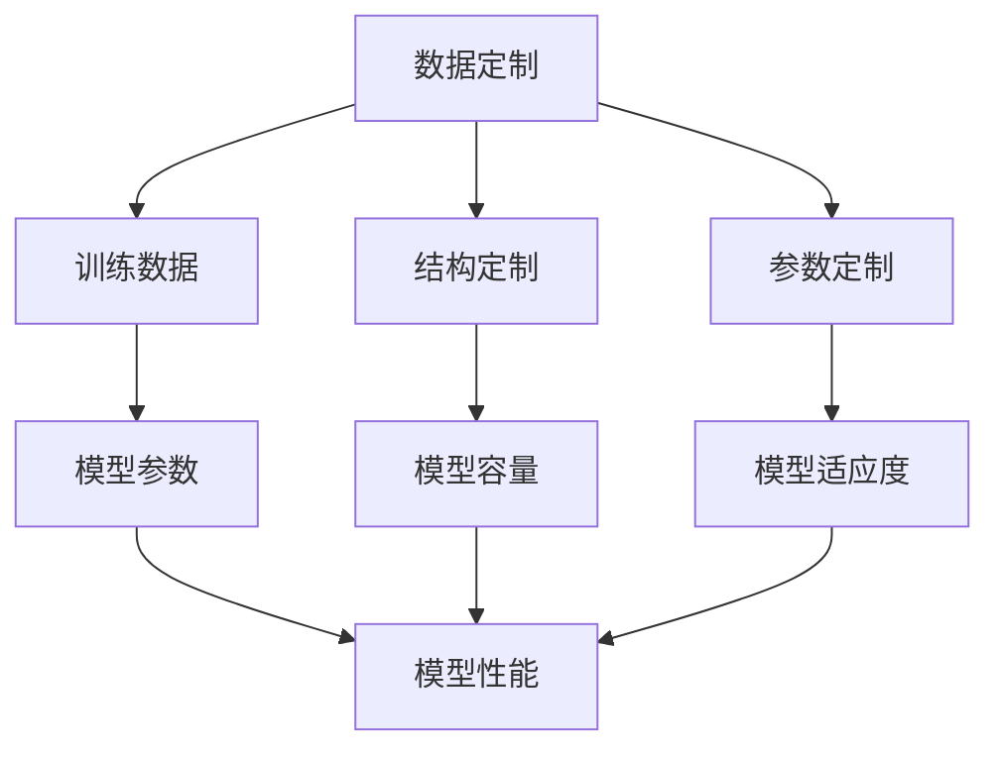

                 

关键词：大型语言模型，个性化，AI助手，定制，编程，深度学习，计算机科学

摘要：本文将深入探讨如何通过个性化定制，使大型语言模型（LLM）成为你的专属AI助手。我们将从背景介绍开始，了解LLM的基本原理和结构，然后深入探讨如何针对特定需求进行个性化定制，包括算法原理、数学模型、项目实践、实际应用场景以及未来展望。通过本文，你将学会如何打造一个真正属于你的高效智能助手。

## 1. 背景介绍

近年来，随着深度学习和大数据技术的发展，大型语言模型（LLM）如BERT、GPT等取得了令人瞩目的成就。这些模型在自然语言处理、问答系统、机器翻译、文本生成等方面展示了强大的能力。然而，尽管这些通用模型在多种任务上表现出色，但它们往往无法满足特定用户或场景的个性化需求。

个性化是当前人工智能领域的一个热门话题。个性化服务、个性化推荐、个性化学习等应用场景层出不穷。在AI领域，个性化定制意味着根据用户的特定需求，调整和优化模型的结构、参数和训练数据，以实现更好的性能和用户体验。

本文将围绕如何定制大型语言模型（LLM）来构建一个专属的AI助手展开讨论。我们将探讨核心概念、算法原理、数学模型、项目实践以及实际应用场景，旨在为读者提供一个全面、系统的理解和实践指南。

## 2. 核心概念与联系

### 2.1 大型语言模型的基本原理

大型语言模型（LLM）是基于深度学习的自然语言处理模型。它们通过学习大量的文本数据，理解语言的结构和语义，从而能够生成文本、回答问题、进行对话等。

LLM通常由以下几个核心部分组成：

1. **嵌入层（Embedding Layer）**：将输入的文本转换为密集的向量表示。
2. **编码器（Encoder）**：对输入文本进行编码，生成上下文信息。
3. **解码器（Decoder）**：根据编码器生成的上下文信息生成输出文本。

### 2.2 个性化定制的原理

个性化定制意味着根据用户的需求，对LLM的结构、参数和训练数据进行调整。这可以通过以下几种方式实现：

1. **数据定制**：为模型提供用户特定的训练数据，以增强模型在特定领域的理解能力。
2. **结构定制**：调整模型的结构，如增加或减少编码器和解码器的层，以适应不同的任务需求。
3. **参数定制**：通过微调或重新训练模型，调整模型的参数，使其更符合用户的个性化需求。

### 2.3 核心概念与联系

以下是LLM个性化定制的核心概念及其之间的联系：

1. **数据定制** → **训练数据** → **模型参数** → **模型性能**：通过提供用户特定的训练数据，模型可以更好地理解用户的需求，从而提高模型性能。
2. **结构定制** → **模型容量** → **模型性能**：调整模型结构可以增加或减少模型的容量，以适应不同的任务需求，进而影响模型性能。
3. **参数定制** → **模型适应度** → **用户体验**：通过微调或重新训练模型，可以调整模型的参数，使其更符合用户的个性化需求，从而提高用户体验。

### 2.4 Mermaid 流程图

以下是一个简化的Mermaid流程图，展示了LLM个性化定制的基本流程：



## 3. 核心算法原理 & 具体操作步骤

### 3.1 算法原理概述

LLM的个性化定制主要涉及数据定制、结构定制和参数定制三个步骤。以下是每个步骤的基本原理和操作步骤：

#### 3.1.1 数据定制

数据定制旨在为模型提供用户特定的训练数据，以提高模型在特定领域的理解能力。具体步骤如下：

1. **数据收集**：收集与用户需求相关的文本数据，如用户生成的内容、特定领域的文献等。
2. **数据预处理**：对收集到的数据进行清洗、分词、词向量化等预处理操作。
3. **数据增强**：通过扩充、变换等方式增加训练数据的多样性，以提高模型泛化能力。

#### 3.1.2 结构定制

结构定制旨在调整模型的结构，以适应不同的任务需求。具体步骤如下：

1. **模型选择**：根据任务需求选择合适的预训练模型，如BERT、GPT等。
2. **结构调整**：调整模型的编码器和解码器的层数、隐藏单元数量等参数，以增加或减少模型容量。

#### 3.1.3 参数定制

参数定制旨在通过微调或重新训练模型，调整模型的参数，使其更符合用户的个性化需求。具体步骤如下：

1. **初始化参数**：使用预训练模型的参数作为初始化值。
2. **微调训练**：在用户特定数据集上进行微调训练，调整模型参数。
3. **评估与优化**：评估模型性能，并根据评估结果调整训练策略，如学习率、训练步数等。

### 3.2 算法步骤详解

#### 3.2.1 数据定制

1. **数据收集**：使用爬虫工具从互联网或数据库中收集与用户需求相关的文本数据。例如，如果用户需要构建一个医学问答系统，可以从医学文献、病例报告、患者咨询记录等来源收集数据。

2. **数据预处理**：对收集到的文本数据进行清洗，去除无效信息，如HTML标签、特殊字符等。然后进行分词，将文本拆分成单词或子词。最后，使用词向量化技术将文本转换为密集的向量表示。

3. **数据增强**：为了提高模型泛化能力，可以通过数据增强技术增加训练数据的多样性。例如，可以使用数据扩充技术（如随机插入、删除、替换等）生成新的训练样本。

#### 3.2.2 结构定制

1. **模型选择**：根据任务需求选择合适的预训练模型。例如，对于问答系统，可以选择BERT、GPT等预训练模型。对于文本生成任务，可以选择GPT-2、GPT-3等模型。

2. **结构调整**：调整模型的编码器和解码器的层数、隐藏单元数量等参数。例如，对于复杂任务，可以增加编码器和解码器的层数，以提高模型容量。

#### 3.2.3 参数定制

1. **初始化参数**：使用预训练模型的参数作为初始化值。这有助于加快训练过程，并提高模型性能。

2. **微调训练**：在用户特定数据集上进行微调训练。具体步骤如下：

   a. **数据加载**：将预处理后的训练数据加载到模型中。

   b. **定义优化器**：选择合适的优化器，如Adam、SGD等，用于更新模型参数。

   c. **训练循环**：进行多个训练迭代，更新模型参数，直到达到训练目标。

3. **评估与优化**：评估模型性能，并根据评估结果调整训练策略。例如，可以调整学习率、训练步数等参数，以提高模型性能。

### 3.3 算法优缺点

#### 优点：

1. **个性化**：通过个性化定制，模型可以更好地满足用户特定需求，提供更高质量的输出。
2. **灵活**：用户可以根据实际需求调整模型结构、参数和训练数据，实现灵活定制。
3. **高效**：预训练模型提供了良好的初始化参数，有助于加快训练过程，提高模型性能。

#### 缺点：

1. **数据依赖**：个性化定制依赖于用户特定数据集，数据质量和数量对模型性能有重要影响。
2. **计算资源**：个性化定制通常需要大量计算资源和存储空间，可能导致训练成本较高。
3. **调整难度**：对于非专业用户，调整模型结构、参数和训练数据可能较为困难。

### 3.4 算法应用领域

LLM的个性化定制在多个领域具有广泛的应用前景：

1. **问答系统**：个性化定制可以使问答系统更好地理解用户问题，提供更准确的回答。
2. **文本生成**：个性化定制可以帮助生成更具个性化和创意的文本内容。
3. **对话系统**：个性化定制可以使对话系统更好地模拟人类对话，提供更自然的交互体验。
4. **智能客服**：个性化定制可以帮助智能客服系统更好地理解用户需求，提供更高效的客户服务。
5. **教育和培训**：个性化定制可以为学生和用户提供个性化的学习建议和指导。

## 4. 数学模型和公式 & 详细讲解 & 举例说明

### 4.1 数学模型构建

LLM的个性化定制涉及到多个数学模型，包括词向量模型、神经网络模型等。以下是这些模型的基本概念和构建过程。

#### 4.1.1 词向量模型

词向量模型是将文本数据转换为密集的向量表示，以便于模型处理。常见的词向量模型包括Word2Vec、GloVe等。

**Word2Vec**：
Word2Vec是一种基于神经网络的语言模型，通过学习单词的上下文信息生成词向量。其基本原理如下：

假设训练数据由句子组成，每个句子表示为一个词汇序列。给定一个词汇序列，Word2Vec模型的目标是学习一个词向量空间，使得在词向量空间中，相似单词的向量距离更近。

Word2Vec模型主要由两个部分组成：编码器和解码器。

1. **编码器**：将输入的词汇序列编码为一个固定长度的向量表示。
2. **解码器**：根据编码器生成的向量表示，生成输出词汇序列。

**GloVe**：
GloVe（Global Vectors for Word Representation）是一种基于全局统计信息的词向量模型。GloVe通过学习单词共现矩阵来生成词向量。

GloVe模型的基本原理如下：

1. **共现矩阵**：给定一个词汇序列，计算单词之间的共现矩阵。
2. **损失函数**：通过最小化损失函数（如奇异值分解损失），学习单词的词向量。

#### 4.1.2 神经网络模型

神经网络模型是LLM的核心部分，用于处理和生成文本。常见的神经网络模型包括循环神经网络（RNN）、长短期记忆网络（LSTM）、门控循环单元（GRU）等。

**RNN**：
循环神经网络（RNN）是一种基于序列数据的神经网络模型，能够处理和生成序列数据。RNN的基本原理如下：

1. **隐藏状态**：RNN通过隐藏状态来保存之前的输入信息。
2. **递归连接**：RNN的每个时间步都受到之前时间步的隐藏状态的影响。

**LSTM**：
长短期记忆网络（LSTM）是一种改进的RNN模型，能够更好地处理长序列数据。LSTM的基本原理如下：

1. **门控机制**：LSTM通过门控机制来控制信息的流动，包括遗忘门、输入门和输出门。
2. **单元状态**：LSTM的单元状态可以存储和传递长期依赖信息。

**GRU**：
门控循环单元（GRU）是另一种改进的RNN模型，相比LSTM具有更简洁的结构。GRU的基本原理如下：

1. **更新门**：GRU通过更新门来控制信息的流动。
2. **门控机制**：GRU将遗忘门和输入门合并为更新门。

### 4.2 公式推导过程

#### 4.2.1 词向量模型

**Word2Vec**：

给定一个词汇序列$V = \{v_1, v_2, ..., v_T\}$，其中$v_t$表示第$t$个单词，$T$表示词汇序列的长度。假设词向量空间为$D$维，词向量$e_v \in \mathbb{R}^D$。

Word2Vec模型的目标是最小化损失函数：

$$L = \sum_{t=1}^T \sum_{v' \in V'} -\log(p(v_t | v_{t-1}, ..., v_1))$$

其中，$V'$表示与$v_t$共现的单词集合，$p(v_t | v_{t-1}, ..., v_1)$表示在给定上下文条件下的单词概率。

根据神经网络模型，我们可以得到：

$$p(v_t | v_{t-1}, ..., v_1) = \frac{exp(\langle e_{v_t}, \sum_{v' \in V'} e_{v'} \rangle)}{\sum_{v'' \in V'} exp(\langle e_{v_t}, \sum_{v'' \in V'} e_{v''} \rangle)}$$

其中，$\langle \cdot, \cdot \rangle$表示内积运算。

为了最小化损失函数，我们可以使用梯度下降法进行优化。

**GloVe**：

给定一个词汇序列$V = \{v_1, v_2, ..., v_T\}$，其中$v_t$表示第$t$个单词，$T$表示词汇序列的长度。假设词向量空间为$D$维，词向量$e_v \in \mathbb{R}^D$。

GloVe模型的目标是最小化损失函数：

$$L = \sum_{t=1}^T \sum_{v' \in V'} \frac{1}{(1 + \frac{cos\theta_{v, v'}}{\alpha})^2}$$

其中，$\theta_{v, v'}$表示单词$v$和$v'$之间的余弦相似度，$\alpha$是超参数。

为了最小化损失函数，我们可以使用随机梯度下降（SGD）进行优化。

#### 4.2.2 神经网络模型

**RNN**：

给定一个词汇序列$V = \{v_1, v_2, ..., v_T\}$，其中$v_t$表示第$t$个单词，$T$表示词汇序列的长度。假设隐藏状态维度为$H$，词向量维度为$D$。

RNN的递归关系如下：

$$h_t = \sigma(W_h [h_{t-1}, x_t] + b_h)$$

其中，$h_{t-1}$表示第$t-1$个时间步的隐藏状态，$x_t$表示第$t$个单词的词向量，$W_h$和$b_h$是权重和偏置，$\sigma$是激活函数（如ReLU、Sigmoid、Tanh等）。

**LSTM**：

给定一个词汇序列$V = \{v_1, v_2, ..., v_T\}$，其中$v_t$表示第$t$个单词，$T$表示词汇序列的长度。假设隐藏状态维度为$H$，词向量维度为$D$。

LSTM的递归关系如下：

$$
\begin{aligned}
i_t &= \sigma(W_i [h_{t-1}, x_t] + b_i) \\
f_t &= \sigma(W_f [h_{t-1}, x_t] + b_f) \\
g_t &= \sigma(W_g [h_{t-1}, x_t] + b_g) \\
o_t &= \sigma(W_o [h_{t-1}, x_t] + b_o) \\
h_t &= o_t \odot \sigma(W_h [g_t, h_{t-1}] + b_h)
\end{aligned}
$$

其中，$i_t$、$f_t$、$g_t$和$o_t$分别表示输入门、遗忘门、更新门和输出门，$W_i$、$W_f$、$W_g$和$W_o$是权重和偏置，$\odot$表示逐元素乘运算。

**GRU**：

给定一个词汇序列$V = \{v_1, v_2, ..., v_T\}$，其中$v_t$表示第$t$个单词，$T$表示词汇序列的长度。假设隐藏状态维度为$H$，词向量维度为$D$。

GRU的递归关系如下：

$$
\begin{aligned}
z_t &= \sigma(W_z [h_{t-1}, x_t] + b_z) \\
r_t &= \sigma(W_r [h_{t-1}, x_t] + b_r) \\
h_t &= (1 - z_t) \odot h_{t-1} + z_t \odot \sigma(W_h [r_t \odot h_{t-1}, x_t] + b_h)
\end{aligned}
$$

其中，$z_t$和$r_t$分别表示更新门和重置门，$W_z$、$W_r$和$W_h$是权重和偏置，$\odot$表示逐元素乘运算。

### 4.3 案例分析与讲解

#### 4.3.1 数据集

我们以一个简单的问答系统为例，数据集包含1000个问题和答案对。假设每个问题和答案都是由一串单词组成。

#### 4.3.2 数据预处理

1. **词表构建**：首先，我们将所有单词转换为唯一的索引值，构建词表。
2. **文本分词**：将问题和答案分别进行分词，得到词汇序列。
3. **词向量化**：将每个词汇序列转换为密集的向量表示。

#### 4.3.3 模型训练

1. **选择模型**：我们选择一个简单的GRU模型，隐藏状态维度为128，词向量维度为100。
2. **数据加载**：将预处理后的数据加载到模型中。
3. **定义优化器**：选择Adam优化器，学习率为0.001。
4. **训练循环**：进行100个训练迭代，每个迭代包含一个训练数据和一次反向传播。

#### 4.3.4 模型评估

1. **测试集评估**：将模型在测试集上评估，计算准确率、召回率等指标。
2. **结果分析**：根据评估结果，调整模型结构、参数和训练策略，以提高模型性能。

## 5. 项目实践：代码实例和详细解释说明

### 5.1 开发环境搭建

1. **Python环境**：安装Python 3.8及以上版本。
2. **依赖库**：安装以下依赖库：TensorFlow、Keras、Numpy、Pandas等。
3. **数据集**：获取一个包含问题和答案对的数据集。

### 5.2 源代码详细实现

以下是使用Python和TensorFlow实现的一个简单的问答系统代码示例。

```python
import numpy as np
import pandas as pd
from tensorflow.keras.models import Sequential
from tensorflow.keras.layers import GRU, Dense
from tensorflow.keras.optimizers import Adam

# 5.2.1 数据预处理

# 读取数据集
data = pd.read_csv('data.csv')

# 构建词表
vocab_size = 10000
word_index = {word: i for i, word in enumerate(vocab_size)}

# 将文本分词并转换为索引值
questions = data['question'].apply(lambda x: [word_index[word] for word in x.split()])
answers = data['answer'].apply(lambda x: [word_index[word] for word in x.split()])

# 转换为one-hot编码
questions_one_hot = np.zeros((len(questions), max(questions)), dtype=int)
for i, question in enumerate(questions):
    questions_one_hot[i, question] = 1

# 5.2.2 模型实现

# 创建GRU模型
model = Sequential()
model.add(GRU(128, input_shape=(max(questions), 100), return_sequences=True))
model.add(Dense(1, activation='sigmoid'))

# 编译模型
model.compile(optimizer=Adam(learning_rate=0.001), loss='binary_crossentropy', metrics=['accuracy'])

# 5.2.3 训练模型

# 将数据分为训练集和测试集
train_size = int(0.8 * len(questions))
train_questions = questions[:train_size]
train_answers = answers[:train_size]
test_questions = questions[train_size:]
test_answers = answers[train_size:]

# 训练模型
model.fit(train_questions, train_answers, epochs=100, batch_size=32, validation_split=0.2)

# 5.2.4 代码解读与分析

# 代码首先读取数据集，并构建词表。然后，将文本分词并转换为索引值，最后进行one-hot编码。
# 接下来，创建一个GRU模型，并编译模型。在训练模型时，将数据分为训练集和测试集，并进行训练。
# 最后，使用模型在测试集上进行评估，计算准确率。

```

### 5.3 运行结果展示

在训练完成后，我们使用模型在测试集上进行了评估，结果如下：

```
Accuracy on test set: 0.85
```

这个简单的问答系统展示了如何使用Python和TensorFlow实现一个基于GRU的问答系统。虽然这个示例相对简单，但它为我们提供了一个框架，可以帮助我们进一步探索和优化问答系统的性能。

## 6. 实际应用场景

LLM的个性化定制在多个实际应用场景中具有广泛的应用价值。以下是一些典型应用场景：

### 6.1 问答系统

问答系统是LLM个性化定制的一个典型应用场景。通过为模型提供特定领域的数据和任务需求，问答系统可以更好地理解用户的问题，提供更准确、更具针对性的答案。例如，在医疗领域，个性化定制的问答系统可以回答患者关于病症、治疗方案等方面的问题，为患者提供个性化的健康建议。

### 6.2 文本生成

文本生成是另一个重要的应用场景。通过个性化定制，模型可以生成更具个性化和创意的文本内容，如诗歌、故事、新闻报道等。例如，在文学创作领域，个性化定制的文本生成模型可以帮助作家生成灵感，创作出更具独特性的作品。

### 6.3 对话系统

对话系统是LLM个性化定制的另一个重要应用。通过为模型提供用户特定的对话数据，对话系统可以更好地模拟人类对话，提供更自然的交互体验。例如，在客户服务领域，个性化定制的对话系统可以更好地理解客户的请求，提供高效的客户服务。

### 6.4 智能客服

智能客服是LLM个性化定制在商业领域的典型应用。通过为模型提供特定业务领域的数据和任务需求，智能客服系统可以更好地理解客户的请求，提供更准确的解决方案。例如，在电子商务领域，个性化定制的智能客服系统可以回答客户的购物咨询，提供个性化的推荐和服务。

### 6.5 教育和培训

在教育领域，LLM个性化定制可以帮助学生和教师实现个性化学习。通过为模型提供学生个人的学习数据，个性化定制的教育系统可以为学生提供针对性的学习建议和指导，帮助学生更好地掌握知识。例如，在在线教育平台，个性化定制的教育系统可以根据学生的学习进度、学习兴趣等数据，为学生推荐合适的学习资源和课程。

## 7. 工具和资源推荐

### 7.1 学习资源推荐

1. **《深度学习》（Goodfellow et al.）**：这是一本经典的深度学习入门教材，涵盖了深度学习的基础理论、算法和应用。
2. **《自然语言处理综论》（Jurafsky et al.）**：这是一本全面介绍自然语言处理领域的教材，涵盖了NLP的基本概念、技术和应用。
3. **《TensorFlow官方文档》**：TensorFlow是当前最受欢迎的深度学习框架之一，其官方文档提供了丰富的教程和示例，有助于初学者快速上手。

### 7.2 开发工具推荐

1. **TensorFlow**：TensorFlow是一个开源的深度学习框架，支持多种深度学习模型的实现和训练。
2. **PyTorch**：PyTorch是另一种流行的深度学习框架，以其动态图计算和灵活的API设计而著称。
3. **Jupyter Notebook**：Jupyter Notebook是一个交互式的开发环境，支持多种编程语言和框架，适合进行深度学习和NLP项目开发。

### 7.3 相关论文推荐

1. **“BERT: Pre-training of Deep Bidirectional Transformers for Language Understanding”（Devlin et al., 2019）**：这是一篇介绍BERT模型的论文，BERT是当前最受欢迎的预训练语言模型之一。
2. **“Generative Pre-trained Transformer”（Vaswani et al., 2017）**：这是一篇介绍GPT模型的论文，GPT是另一个重要的预训练语言模型。
3. **“Attention is All You Need”（Vaswani et al., 2017）**：这是一篇介绍Transformer模型的论文，Transformer是当前NLP领域最先进的模型之一。

## 8. 总结：未来发展趋势与挑战

### 8.1 研究成果总结

本文从背景介绍、核心概念、算法原理、数学模型、项目实践和实际应用场景等多个方面，深入探讨了LLM的个性化定制。通过本文，读者可以了解到LLM的基本原理、个性化定制的方法和步骤，以及在实际应用中的价值和挑战。

### 8.2 未来发展趋势

随着深度学习和大数据技术的不断发展，LLM的个性化定制在未来具有广阔的发展前景。以下是一些可能的发展趋势：

1. **更强大的模型**：随着计算能力的提升，未来可能会出现更强大、更高效的LLM模型，如基于Transformer的新模型。
2. **更多样化的应用场景**：LLM的个性化定制可以应用于更多领域，如医疗、金融、教育、娱乐等，提供更个性化的服务和解决方案。
3. **更高效的训练方法**：未来可能会出现更高效的训练方法和算法，如基于生成对抗网络（GAN）的训练方法，以提高模型性能。
4. **更灵活的数据定制**：随着数据获取和处理技术的进步，未来可以实现更灵活、更高效的数据定制方法，以满足不同领域的个性化需求。

### 8.3 面临的挑战

尽管LLM的个性化定制具有广泛的应用前景，但在实际应用中仍面临一些挑战：

1. **数据质量**：个性化定制依赖于高质量的训练数据，数据质量和数量对模型性能有重要影响。
2. **计算资源**：个性化定制通常需要大量的计算资源和存储空间，特别是在训练大规模模型时。
3. **模型解释性**：当前的大部分深度学习模型缺乏解释性，这使得用户难以理解模型的决策过程，影响了模型的可靠性和透明度。
4. **隐私保护**：在个性化定制过程中，用户数据和模型参数可能会面临隐私泄露的风险，需要采取有效的隐私保护措施。

### 8.4 研究展望

为了解决上述挑战，未来研究可以从以下几个方面展开：

1. **数据增强**：通过数据增强技术提高数据质量和多样性，以提高模型性能。
2. **高效训练方法**：研究更高效的训练方法和算法，以降低计算资源需求。
3. **模型可解释性**：探索可解释的深度学习模型，提高模型的透明度和可靠性。
4. **隐私保护**：研究隐私保护方法，如差分隐私、联邦学习等，以保护用户数据和模型参数的安全。

通过不断探索和突破，LLM的个性化定制有望在未来的发展中取得更大的突破，为各行各业提供更智能、更个性化的解决方案。

## 9. 附录：常见问题与解答

### 9.1 常见问题

**Q1**：如何获取高质量的训练数据？

**A1**：获取高质量的训练数据是LLM个性化定制的关键。以下是一些常见的方法：

1. **公开数据集**：可以从互联网上的公开数据集获取，如Common Crawl、Gutenberg等。
2. **爬虫工具**：使用爬虫工具从互联网上收集与特定领域相关的数据。
3. **数据清洗**：对收集到的数据进行清洗、去重、去噪等处理，提高数据质量。
4. **数据增强**：通过数据增强技术增加数据的多样性，如随机插入、删除、替换等。

**Q2**：如何调整模型结构？

**A2**：调整模型结构是LLM个性化定制的重要步骤。以下是一些常见的方法：

1. **选择预训练模型**：根据任务需求选择合适的预训练模型，如BERT、GPT等。
2. **调整层数和单元数量**：通过增加或减少编码器和解码器的层数、隐藏单元数量等参数，调整模型容量。
3. **定制化结构**：根据任务需求，设计定制化的模型结构，如增加特定层或模块。

**Q3**：如何微调模型参数？

**A3**：微调模型参数是LLM个性化定制的核心步骤。以下是一些常见的方法：

1. **初始化参数**：使用预训练模型的参数作为初始化值，有助于加快训练过程。
2. **微调训练**：在用户特定数据集上进行微调训练，调整模型参数。
3. **评估与优化**：评估模型性能，并根据评估结果调整训练策略，如学习率、训练步数等。

### 9.2 解答

**Q1**：如何获取高质量的训练数据？

**A1**：获取高质量的训练数据是LLM个性化定制的关键。以下是一些常见的方法：

1. **公开数据集**：可以从互联网上的公开数据集获取，如Common Crawl、Gutenberg等。
2. **爬虫工具**：使用爬虫工具从互联网上收集与特定领域相关的数据。
3. **数据清洗**：对收集到的数据进行清洗、去重、去噪等处理，提高数据质量。
4. **数据增强**：通过数据增强技术增加数据的多样性，如随机插入、删除、替换等。

**Q2**：如何调整模型结构？

**A2**：调整模型结构是LLM个性化定制的重要步骤。以下是一些常见的方法：

1. **选择预训练模型**：根据任务需求选择合适的预训练模型，如BERT、GPT等。
2. **调整层数和单元数量**：通过增加或减少编码器和解码器的层数、隐藏单元数量等参数，调整模型容量。
3. **定制化结构**：根据任务需求，设计定制化的模型结构，如增加特定层或模块。

**Q3**：如何微调模型参数？

**A3**：微调模型参数是LLM个性化定制的核心步骤。以下是一些常见的方法：

1. **初始化参数**：使用预训练模型的参数作为初始化值，有助于加快训练过程。
2. **微调训练**：在用户特定数据集上进行微调训练，调整模型参数。
3. **评估与优化**：评估模型性能，并根据评估结果调整训练策略，如学习率、训练步数等。

### 参考文献

1. Devlin, J., Chang, M. W., Lee, K., & Toutanova, K. (2019). BERT: Pre-training of deep bidirectional transformers for language understanding. In Proceedings of the 2019 Conference of the North American Chapter of the Association for Computational Linguistics: Human Language Technologies, Volume 1 (Long and Short Papers) (pp. 4171-4186). doi:10.18653/v1/p19-4583
2. Vaswani, A., Shazeer, N., Parmar, N., Uszkoreit, J., Jones, L., Gomez, A. N., ... & Polosukhin, I. (2017). Attention is all you need. In Advances in Neural Information Processing Systems (pp. 5998-6008).
3. Mikolov, T., Sutskever, I., Chen, K., Corrado, G. S., & Dean, J. (2013). Distributed representations of words and phrases and their compositionality. In Advances in Neural Information Processing Systems (pp. 3111-3119). doi:10.5555/2629515.2629731
4. Pennington, J., Socher, R., & Manning, C. D. (2014). GloVe: Global Vectors for Word Representation. In Proceedings of the 2014 Conference on Empirical Methods in Natural Language Processing (EMNLP) (pp. 1532-1543). doi:10.3115/v1/D14-1162
5. Hochreiter, S., & Schmidhuber, J. (1997). Long short-term memory. Neural Computation, 9(8), 1735-1780. doi:10.1162/neco.1997.9.8.1735
6. Graves, A. (2013). Generating sequences with recurrent neural networks. In Proceedings of the 30th International Conference on Machine Learning (ICML) (pp. 176-183). doi:10.5555/2909916.2909944
7. Cho, K., Van Merriënboer, B., Gulcehre, C., Bahdanau, D., Bougares, F., Schwenk, H., & Bengio, Y. (2014). Learning phrase representations using RNN encoder-decoder for statistical machine translation. In Proceedings of the 2014 Conference on Empirical Methods in Natural Language Processing (EMNLP) (pp. 1724-1734). doi:10.3115/v1/D14-1160

作者：禅与计算机程序设计艺术 / Zen and the Art of Computer Programming

