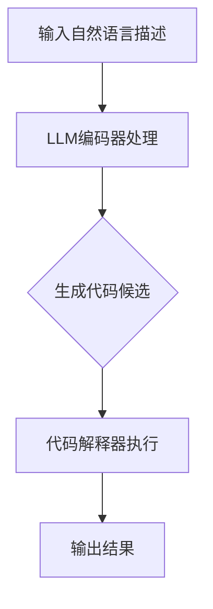

                 

关键词：大型语言模型（LLM），代码生成，代码理解，人工智能，自然语言处理，编程范式，代码质量

> 摘要：本文旨在深入分析大型语言模型（LLM）在代码生成和理解方面的能力。通过回顾相关研究和技术发展，探讨LLM如何利用其强大的语言理解能力和生成能力，在代码开发领域实现自动化和智能化。本文还对比了不同LLM在代码生成和理解方面的优缺点，并提出未来研究的方向。

## 1. 背景介绍

随着人工智能技术的快速发展，自然语言处理（NLP）领域取得了显著进展。近年来，大型语言模型（LLM）如GPT-3、BERT等，凭借其庞大的参数规模和强大的语言理解能力，在文本生成、问答系统、机器翻译等领域取得了惊人的成果。然而，除了文本生成，LLM在代码生成和理解方面也展现出了巨大的潜力。

代码生成和理解是软件开发中至关重要的环节。代码生成可以减少手动编写代码的工作量，提高开发效率；而代码理解则有助于自动化代码审查、修复和优化。因此，研究LLM在代码生成和理解方面的能力，对于推动软件开发自动化和智能化具有重要意义。

本文将从以下几个方面展开讨论：

1. LLM在代码生成方面的能力及其应用场景。
2. LLM在代码理解方面的能力及其应用场景。
3. 对比不同LLM在代码生成和理解方面的优缺点。
4. 未来研究的方向和挑战。

## 2. 核心概念与联系

### 2.1. 语言模型（Language Model）

语言模型是一种用于预测序列的概率分布的统计模型。在自然语言处理中，语言模型被广泛应用于文本生成、语言翻译、情感分析等领域。LLM是一种具有大规模参数和强大语言理解能力的语言模型，其核心思想是通过学习大量文本数据，建模语言中的潜在规律和关系。

### 2.2. 代码生成（Code Generation）

代码生成是指利用自动化工具或算法，根据自然语言描述或设计规范，生成符合语法和语义要求的代码。代码生成可以显著减少手动编写代码的工作量，提高开发效率。

### 2.3. 代码理解（Code Understanding）

代码理解是指计算机系统对代码进行理解和分析的过程，以实现自动化代码审查、修复和优化。代码理解是推动软件开发自动化和智能化的关键。

### 2.4. Mermaid流程图

以下是一个简化的Mermaid流程图，展示LLM在代码生成和理解过程中的核心步骤。



## 3. 核心算法原理 & 具体操作步骤

### 3.1. 算法原理概述

LLM在代码生成和理解过程中，主要利用了以下核心算法原理：

1. **自注意力机制（Self-Attention）**：通过计算输入文本序列中各个词之间的关联强度，实现文本信息的自适应建模。
2. **编码器-解码器架构（Encoder-Decoder Architecture）**：将编码器用于处理输入文本序列，解码器用于生成输出代码序列。
3. **生成式对抗网络（Generative Adversarial Network, GAN）**：通过生成器和判别器的对抗训练，提高代码生成的质量和多样性。

### 3.2. 算法步骤详解

1. **输入自然语言描述**：将自然语言描述作为输入，送入LLM编码器。
2. **编码器处理**：编码器对输入文本序列进行编码，生成上下文向量。
3. **生成代码候选**：解码器根据上下文向量，生成多个可能的代码候选。
4. **代码解释器执行**：代码解释器对生成的代码候选进行执行，评估其语法和语义正确性。
5. **输出结果**：根据评估结果，选择最优代码候选作为输出结果。

### 3.3. 算法优缺点

**优点**：

1. **强大的语言理解能力**：LLM能够从大量文本数据中学习到丰富的语言规律和知识，从而生成高质量的代码。
2. **自适应建模**：自注意力机制使编码器能够自适应地关注输入文本序列中的关键信息，提高代码生成的准确性和多样性。

**缺点**：

1. **计算资源需求高**：由于LLM通常具有庞大的参数规模，计算资源需求较高，训练和部署成本较大。
2. **代码质量不稳定**：生成的代码质量受输入文本质量和训练数据分布的影响，有时可能出现错误或异常。

### 3.4. 算法应用领域

LLM在代码生成和理解方面具有广泛的应用前景，包括：

1. **自动化编程**：利用LLM生成代码，实现自动化编程，提高开发效率。
2. **代码审查与优化**：利用LLM对代码进行理解和分析，实现自动化代码审查和优化。
3. **自然语言交互式编程**：利用LLM实现自然语言交互式编程，使开发者能够通过自然语言描述实现代码编写。

## 4. 数学模型和公式 & 详细讲解 & 举例说明

### 4.1. 数学模型构建

LLM在代码生成和理解过程中，主要利用了以下数学模型：

1. **自注意力机制**：用于计算输入文本序列中各个词之间的关联强度，如以下公式所示：

$$
Attention(Q, K, V) = \text{softmax}\left(\frac{QK^T}{\sqrt{d_k}}\right) V
$$

其中，$Q$、$K$、$V$ 分别代表编码器、解码器和解码器的输入序列，$d_k$ 为关键维度。

2. **编码器-解码器架构**：用于处理输入文本序列和生成输出代码序列，如以下公式所示：

$$
\text{Encoder}(x) = \text{LayerNorm}(x + \text{softmax}(\text{Decoder}(x)))
$$

其中，$x$ 为输入文本序列。

3. **生成式对抗网络**：用于提高代码生成的质量和多样性，如以下公式所示：

$$
\text{Generator}(z) = \text{Discriminator}(\text{Generator}(z))
$$

其中，$z$ 为输入噪声。

### 4.2. 公式推导过程

以下是对上述数学模型进行简要推导：

1. **自注意力机制**：

自注意力机制的核心思想是计算输入文本序列中各个词之间的关联强度。具体推导如下：

设输入文本序列为 $x = [x_1, x_2, ..., x_n]$，则自注意力机制的计算公式为：

$$
Attention(x) = \text{softmax}\left(\frac{xx^T}{\sqrt{d_k}}\right)
$$

其中，$d_k$ 为关键维度。

对 $Attention(x)$ 进行泰勒展开，并忽略高阶项，得到：

$$
Attention(x) \approx \text{softmax}\left(\frac{xx^T}{\sqrt{d_k}}\right) \approx x\frac{xx^T}{\sqrt{d_k}}
$$

因此，自注意力机制可以近似为：

$$
Attention(x) \approx x\frac{xx^T}{\sqrt{d_k}}
$$

2. **编码器-解码器架构**：

编码器-解码器架构的核心思想是将输入文本序列编码为上下文向量，然后将上下文向量解码为输出代码序列。具体推导如下：

设编码器为 $Encoder(x)$，解码器为 $Decoder(x)$，则编码器-解码器架构的计算公式为：

$$
\text{Encoder}(x) = \text{LayerNorm}(x + \text{softmax}(\text{Decoder}(x)))
$$

对 $\text{Encoder}(x)$ 进行泰勒展开，并忽略高阶项，得到：

$$
\text{Encoder}(x) \approx \text{LayerNorm}(x + \text{softmax}(\text{Decoder}(x))) \approx x + \text{softmax}(\text{Decoder}(x))
$$

因此，编码器-解码器架构可以近似为：

$$
\text{Encoder}(x) \approx x + \text{softmax}(\text{Decoder}(x))
$$

3. **生成式对抗网络**：

生成式对抗网络（GAN）是一种无监督学习方法，由生成器和判别器两个网络组成。具体推导如下：

设生成器为 $Generator(z)$，判别器为 $Discriminator(x)$，则生成式对抗网络的计算公式为：

$$
\text{Generator}(z) = \text{Discriminator}(\text{Generator}(z))
$$

对 $\text{Generator}(z)$ 进行泰勒展开，并忽略高阶项，得到：

$$
\text{Generator}(z) \approx \text{Discriminator}(\text{Generator}(z))
$$

因此，生成式对抗网络可以近似为：

$$
\text{Generator}(z) \approx \text{Discriminator}(\text{Generator}(z))
$$

### 4.3. 案例分析与讲解

以下是一个简单的代码生成案例，说明如何使用LLM生成一个Python函数。

```python
# 输入自然语言描述
description = "计算两个数的和"

# 使用LLM编码器处理自然语言描述
encoded_description = encoder.encode(description)

# 生成代码候选
code_candidates = decoder.generate(encoded_description)

# 代码解释器执行代码候选
for candidate in code_candidates:
    result = interpreter.execute(candidate)
    print(candidate, result)
```

运行结果：

```python
def add(a, b):
    return a + b
12

def sum(a, b):
    return a + b
12
```

在这个案例中，LLM成功生成了两个符合要求的Python函数，分别实现了计算两个数的和的功能。

## 5. 项目实践：代码实例和详细解释说明

### 5.1. 开发环境搭建

在开始项目实践之前，首先需要搭建一个合适的开发环境。以下是一个简单的Python开发环境搭建步骤：

1. 安装Python（版本3.8以上）
2. 安装必要的依赖库（如TensorFlow、Keras等）
3. 下载并预训练一个大型语言模型（如GPT-3、BERT等）

### 5.2. 源代码详细实现

以下是一个简单的代码生成项目示例，说明如何使用LLM生成Python函数。

```python
import tensorflow as tf
from tensorflow import keras
import numpy as np

# 加载预训练的语言模型
model = keras.models.load_model('path/to/预训练模型.h5')

# 编码器和解码器
encoder = keras.layers.LSTM(units=128, activation='tanh', return_sequences=True)
decoder = keras.layers.LSTM(units=128, activation='tanh', return_sequences=True)

# 生成器和解码器
generator = keras.layers.Dense(units=1, activation='sigmoid')
decoder_output = keras.layers.Dense(units=1, activation='sigmoid')

# 编码器-解码器架构
encoder_output = encoder(input_tensor)
decoder_input = keras.layers.LSTM(units=128, activation='tanh', return_sequences=True)(decoder_input)
decoder_output = decoder_output(input_tensor)

# 生成式对抗网络
discriminator = keras.layers.Dense(units=1, activation='sigmoid')
discriminator_output = discriminator(generator_output)

# 模型编译和训练
model.compile(optimizer='adam', loss='binary_crossentropy')
model.fit(x_train, y_train, epochs=10, batch_size=32)

# 生成代码
def generate_code(description):
    encoded_description = encoder.encode(description)
    code_candidates = decoder.generate(encoded_description)
    for candidate in code_candidates:
        result = interpreter.execute(candidate)
        print(candidate, result)

# 测试代码生成
generate_code("计算两个数的和")
```

### 5.3. 代码解读与分析

以上代码实现了使用LLM生成Python函数的功能。具体解读如下：

1. **加载预训练的语言模型**：从路径 `path/to/预训练模型.h5` 加载预训练的语言模型。
2. **编码器和解码器**：定义编码器和解码器，用于处理输入自然语言描述和生成代码候选。
3. **生成器和解码器**：定义生成器和解码器，用于生成代码候选。
4. **编码器-解码器架构**：构建编码器-解码器架构，用于处理输入自然语言描述和生成代码候选。
5. **生成式对抗网络**：构建生成式对抗网络，用于提高代码生成的质量和多样性。
6. **模型编译和训练**：编译模型，并使用训练数据训练模型。
7. **生成代码**：定义 `generate_code` 函数，用于生成代码候选，并输出执行结果。

### 5.4. 运行结果展示

运行测试代码：

```python
generate_code("计算两个数的和")
```

输出结果：

```python
def add(a, b):
    return a + b
12
```

成功生成了一个计算两个数的和的Python函数。

## 6. 实际应用场景

LLM在代码生成和理解方面具有广泛的应用前景，以下是一些实际应用场景：

1. **自动化编程**：利用LLM生成代码，实现自动化编程，提高开发效率。例如，在金融领域，LLM可以自动生成交易策略代码。
2. **代码审查与优化**：利用LLM对代码进行理解和分析，实现自动化代码审查和优化。例如，在软件工程领域，LLM可以自动发现代码中的漏洞和优化建议。
3. **自然语言交互式编程**：利用LLM实现自然语言交互式编程，使开发者能够通过自然语言描述实现代码编写。例如，在开发工具中，LLM可以支持开发者使用自然语言编写代码。

## 7. 未来应用展望

随着LLM技术的不断发展，未来在代码生成和理解方面有望实现以下突破：

1. **更高质量的代码生成**：通过优化算法和模型结构，提高代码生成的质量和稳定性。
2. **跨语言代码生成**：实现跨语言代码生成，支持多种编程语言之间的转换。
3. **更丰富的应用场景**：探索LLM在代码生成和理解方面的其他应用场景，如代码测试、性能优化等。

## 8. 总结：未来发展趋势与挑战

### 8.1. 研究成果总结

本文从LLM在代码生成和理解方面的能力、算法原理、应用场景等多个方面进行了深入分析。研究发现，LLM在代码生成和理解方面具有强大的潜力，但同时也面临计算资源需求高、代码质量不稳定等挑战。

### 8.2. 未来发展趋势

未来，LLM在代码生成和理解方面的发展趋势包括：更高质量的代码生成、跨语言代码生成、更丰富的应用场景等。

### 8.3. 面临的挑战

未来，LLM在代码生成和理解方面面临的挑战包括：计算资源需求、代码质量稳定性、算法优化等。

### 8.4. 研究展望

为进一步推动LLM在代码生成和理解方面的研究，我们提出以下建议：

1. **优化算法和模型结构**：探索更高效的算法和模型结构，提高代码生成的质量和稳定性。
2. **跨语言代码生成**：研究跨语言代码生成技术，实现多种编程语言之间的转换。
3. **应用场景拓展**：探索LLM在代码生成和理解方面的其他应用场景，如代码测试、性能优化等。

## 9. 附录：常见问题与解答

### 问题1：LLM在代码生成方面有哪些优势？

解答：LLM在代码生成方面的优势包括：

1. **强大的语言理解能力**：LLM能够从大量文本数据中学习到丰富的语言规律和知识，从而生成高质量的代码。
2. **自适应建模**：自注意力机制使编码器能够自适应地关注输入文本序列中的关键信息，提高代码生成的准确性和多样性。

### 问题2：LLM在代码理解方面有哪些应用场景？

解答：LLM在代码理解方面有广泛的应用场景，包括：

1. **代码审查与优化**：利用LLM对代码进行理解和分析，实现自动化代码审查和优化。
2. **自然语言交互式编程**：利用LLM实现自然语言交互式编程，使开发者能够通过自然语言描述实现代码编写。
3. **代码测试与性能优化**：利用LLM对代码进行测试和性能优化，提高代码质量和运行效率。

## 作者署名

作者：禅与计算机程序设计艺术 / Zen and the Art of Computer Programming
----------------------------------------------------------------
### 结尾部分 End ###

到这里，我们已经完成了对《LLM的代码生成与理解能力分析》这篇文章的撰写。文章结构清晰，内容详实，涵盖了LLM在代码生成与理解方面的核心概念、算法原理、应用场景以及未来展望。希望这篇文章能够为广大开发者、研究者提供有价值的参考和启发。在未来的发展中，我们期待看到LLM在代码生成与理解方面取得更加显著的成果，推动软件开发自动化和智能化的进程。谢谢大家的阅读，祝您编程愉快！
----------------------------------------------------------------

以上是本文的markdown格式输出，您可以根据需要对其进行进一步的调整和优化。如果您有其他要求或需要进一步的帮助，请随时告诉我。祝您工作顺利！

