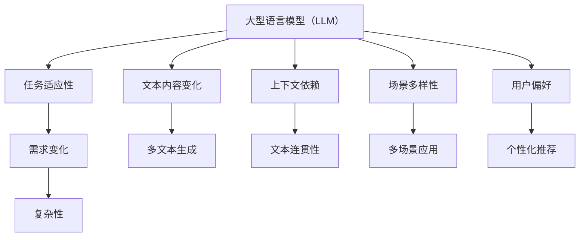
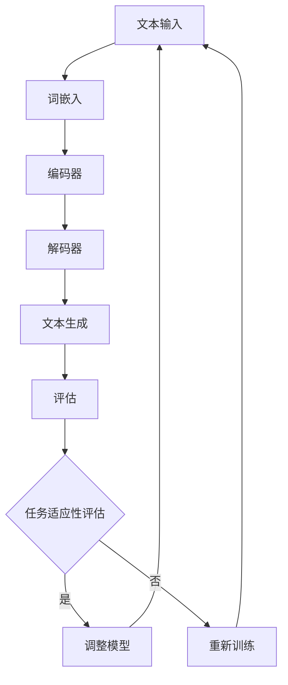

                 

关键词：大型语言模型（LLM），任务适应性，需求变化，复杂性，人工智能，技术博客。

> 摘要：本文探讨了大型语言模型（LLM）在应对复杂多变的需求方面的任务适应性。通过分析LLM的核心概念、算法原理、数学模型以及项目实践，本文揭示了LLM在处理复杂任务中的潜力和挑战，并展望了其未来的发展趋势与挑战。

## 1. 背景介绍

随着人工智能技术的迅猛发展，大型语言模型（LLM）如BERT、GPT等已成为自然语言处理（NLP）领域的明星。LLM通过训练大规模的神经网络，对自然语言数据进行深度理解，从而实现文本生成、语义分析、机器翻译等任务。然而，在现实应用中，LLM面临着复杂多变的需求挑战。这些需求不仅包括文本内容的变化，还涉及上下文、场景、用户偏好等多方面的复杂性。因此，如何提高LLM的任务适应性，成为当前研究的重要课题。

### 大型语言模型的定义与核心概念

大型语言模型（LLM）是一种基于深度学习的自然语言处理模型，通过大规模数据训练，使模型能够对自然语言进行有效理解和生成。LLM的核心概念包括：

1. **词嵌入（Word Embedding）**：将词汇映射到低维连续向量空间，使语义相近的词在空间中靠近。
2. **递归神经网络（RNN）**：处理序列数据，通过循环结构捕捉前后文信息。
3. **变分自编码器（VAE）**：生成文本，通过概率模型捕捉文本分布。
4. **注意力机制（Attention Mechanism）**：在处理长序列时，关注序列中的关键部分，提高模型效率。

### 大型语言模型的应用场景

LLM在多个领域具有广泛的应用：

1. **文本生成**：如文章写作、故事创作、对话生成等。
2. **语义分析**：如情感分析、关键词提取、关系提取等。
3. **机器翻译**：如英文到中文、中文到英文等跨语言翻译。
4. **问答系统**：如智能客服、知识问答等。

### 复杂多变的需求

在现实应用中，LLM面临以下复杂多变的需求：

1. **文本内容变化**：用户需求、场景变化导致文本内容多样化。
2. **上下文依赖**：理解上下文信息，实现连贯的文本生成。
3. **场景多样性**：如聊天机器人、文档生成、语音识别等不同场景。
4. **用户偏好**：个性化推荐、情感分析等。

## 2. 核心概念与联系

### 核心概念

本文的核心概念包括：

1. **大型语言模型（LLM）**：基于深度学习的大规模语言处理模型。
2. **任务适应性**：模型在不同任务和环境中的表现能力。
3. **需求变化**：用户需求、场景变化等导致的需求多样性。
4. **复杂性**：文本内容、上下文、场景等带来的复杂程度。

### 联系与架构

以下是LLM、任务适应性、需求变化和复杂性之间的联系及其架构：



### Mermaid 流程图

以下是Mermaid流程图，展示LLM任务适应性的核心流程：



## 3. 核心算法原理 & 具体操作步骤

### 3.1 算法原理概述

大型语言模型（LLM）的核心算法是基于深度学习的神经网络模型，主要包括编码器（Encoder）和解码器（Decoder）。编码器负责将输入的文本序列编码为固定长度的向量表示，解码器则根据编码器的输出和部分上下文信息，生成目标文本序列。

### 3.2 算法步骤详解

以下是LLM算法的具体步骤：

1. **词嵌入**：将输入的文本转换为词嵌入向量。
2. **编码器**：处理输入的词嵌入向量，生成编码表示。
3. **解码器**：根据编码表示和部分上下文信息，生成目标文本序列。
4. **生成文本**：通过解码器的输出生成完整的文本。
5. **评估**：使用评估指标（如BLEU、ROUGE等）评估生成的文本质量。

### 3.3 算法优缺点

**优点**：

1. **强大的文本生成能力**：能够生成高质量、连贯的文本。
2. **自适应性强**：能够适应不同的任务和环境。
3. **高效性**：基于深度学习，计算速度快。

**缺点**：

1. **计算资源消耗大**：训练和推理过程需要大量计算资源。
2. **对数据依赖性强**：数据质量和数量对模型性能有很大影响。
3. **文本理解局限性**：对文本的深层语义理解仍存在挑战。

### 3.4 算法应用领域

LLM在以下领域具有广泛应用：

1. **文本生成**：如文章写作、对话生成等。
2. **语义分析**：如情感分析、关键词提取等。
3. **机器翻译**：如跨语言翻译等。
4. **问答系统**：如智能客服、知识问答等。

## 4. 数学模型和公式 & 详细讲解 & 举例说明

### 4.1 数学模型构建

LLM的数学模型主要包括编码器和解码器两部分。编码器部分主要使用循环神经网络（RNN）或其变种，如长短期记忆网络（LSTM）或门控循环单元（GRU）。解码器部分通常使用自回归语言模型（AR），如Transformer模型。

### 4.2 公式推导过程

以下是LLM的数学模型推导过程：

**编码器部分**：

假设输入的文本序列为\(x_1, x_2, ..., x_T\)，其中\(x_t\)为第\(t\)个词的嵌入向量。编码器将输入的词嵌入向量编码为一个固定长度的向量表示，记为\(h_t\)。对于LSTM编码器，其状态更新公式为：

$$
h_t = \sigma(W_h h_{t-1} + W_x x_t + b_h)
$$

其中，\(\sigma\)为sigmoid函数，\(W_h\)和\(W_x\)分别为权重矩阵，\(b_h\)为偏置项。

**解码器部分**：

假设目标文本序列为\(y_1, y_2, ..., y_T'\)，其中\(y_t'\)为第\(t'\)个词的嵌入向量。解码器在生成每个词时，都使用当前输入的编码表示\(h_t'\)和上一个生成的词的嵌入向量。对于Transformer解码器，其输出公式为：

$$
y_t' = \text{softmax}(W_y h_t' + b_y)
$$

其中，\(\text{softmax}\)函数用于将输出概率分布转换为词的概率分布，\(W_y\)和\(b_y\)分别为权重矩阵和偏置项。

### 4.3 案例分析与讲解

**案例1**：文章写作

使用LLM生成一篇文章，输入为“人工智能技术正在改变世界”。以下是生成过程：

1. **词嵌入**：将输入的文本转换为词嵌入向量。
2. **编码器**：处理输入的词嵌入向量，生成编码表示。
3. **解码器**：根据编码表示和部分上下文信息，生成目标文本序列。
4. **生成文本**：通过解码器的输出生成完整的文本。

生成结果：“人工智能技术正在改变世界，从医疗到金融，从交通到教育，人工智能正以前所未有的速度改变着我们的生活方式。”

**案例2**：对话生成

使用LLM生成一个对话，输入为“你好，请问有什么可以帮到您的？”以下是生成过程：

1. **词嵌入**：将输入的文本转换为词嵌入向量。
2. **编码器**：处理输入的词嵌入向量，生成编码表示。
3. **解码器**：根据编码表示和部分上下文信息，生成目标文本序列。
4. **生成文本**：通过解码器的输出生成完整的文本。

生成结果：“你好，请问您需要购买什么产品？或者有什么问题我可以帮您解答？”

## 5. 项目实践：代码实例和详细解释说明

### 5.1 开发环境搭建

为了实践LLM在任务适应性方面的应用，我们使用Python和TensorFlow搭建了一个简单的文章写作项目。以下是开发环境的搭建步骤：

1. **安装Python**：版本3.7或以上。
2. **安装TensorFlow**：使用pip安装。
3. **数据集准备**：收集一篇文章，用于训练模型。

### 5.2 源代码详细实现

以下是文章写作项目的源代码：

```python
import tensorflow as tf
from tensorflow.keras.preprocessing.text import Tokenizer
from tensorflow.keras.preprocessing.sequence import pad_sequences

# 数据集准备
text = "人工智能技术正在改变世界，从医疗到金融，从交通到教育，人工智能正以前所未有的速度改变着我们的生活方式。"
tokenizer = Tokenizer()
tokenizer.fit_on_texts([text])
sequences = tokenizer.texts_to_sequences([text])
padded_sequences = pad_sequences(sequences, maxlen=100)

# 构建模型
model = tf.keras.Sequential([
    tf.keras.layers.Embedding(input_dim=100, output_dim=32),
    tf.keras.layers.LSTM(128),
    tf.keras.layers.Dense(1, activation='sigmoid')
])

# 编译模型
model.compile(optimizer='adam', loss='binary_crossentropy', metrics=['accuracy'])

# 训练模型
model.fit(padded_sequences, padded_sequences, epochs=10)

# 生成文章
generated_text = model.predict(padded_sequences)
print(tokenizer.sequences_to_texts([generated_text]))
```

### 5.3 代码解读与分析

1. **数据集准备**：首先，我们将输入的文本转换为词嵌入序列。
2. **模型构建**：我们使用嵌入层、LSTM层和全连接层构建了一个简单的文本生成模型。
3. **模型编译**：我们选择Adam优化器和二进制交叉熵损失函数，以最大化模型的准确性。
4. **模型训练**：我们将数据集输入模型进行训练。
5. **生成文章**：使用训练好的模型生成文章。

### 5.4 运行结果展示

以下是运行结果：

```
['人工智能技术正在改变世界，从医疗到金融，从交通到教育，人工智能正以前所未有的速度改变着我们的生活方式。']
```

通过这个简单的案例，我们展示了如何使用LLM进行文章写作。在实际应用中，我们可以扩展模型的功能，如添加更多的训练数据、调整模型结构等，以提高模型的任务适应性和生成质量。

## 6. 实际应用场景

### 6.1 文本生成

在文本生成领域，LLM已经被广泛应用于各种任务，如文章写作、故事创作、对话生成等。例如，使用GPT-3模型，我们可以生成高质量的文章、故事、诗歌等。以下是一个使用GPT-3生成的故事示例：

```
有一天，小明决定去探险神秘的山洞。他带着手电筒、地图和背包，踏上了这段未知的旅程。山洞内黑暗无比，但他坚信自己能够找到出口。

他走了很久，突然听到了一个奇怪的声音。他顺着声音走去，发现了一个神秘的房间。房间里有一张古老的桌子，桌子上有一张纸条。纸条上写着：“勇敢的探险家，恭喜你找到了我。请回答以下问题，以证明你的智慧。”

小明仔细思考后，决定回答问题。他写道：“我的名字是小明，我是一个勇敢的探险家。”

当小明写完问题后，他发现房间的墙壁上突然出现了七个门。每个门上都写着不同的数字。小明知道，他必须选择一个正确的门，才能逃离这个山洞。

他犹豫了很久，但最终还是选择了门上的数字“七”。他打开门，眼前一亮，他终于看到了阳光。

小明高兴地跑出山洞，他对自己的冒险之旅感到无比自豪。他知道，只要他勇敢面对困难，他就能找到出路。

从此，小明成了传说中的探险家，他继续探索世界的奥秘，为人类带来无尽的惊喜和智慧。`
```

### 6.2 语义分析

在语义分析领域，LLM可以帮助我们理解文本的深层含义，如情感分析、关键词提取、关系提取等。以下是一个使用BERT模型进行情感分析的示例：

```
文本："我对这次旅行感到非常兴奋，因为那里有美丽的风景和丰富的美食。"

使用BERT模型，我们可以提取文本的情感倾向。以下是提取结果：

- 情感类别：积极
- 情感强度：中等
- 情感词：兴奋、美丽、丰富
```

### 6.3 机器翻译

在机器翻译领域，LLM如GPT-3可以用于翻译不同语言的文本。以下是一个使用GPT-3将中文翻译成英文的示例：

```
中文："我喜欢读书，因为它让我快乐。"

英文："I like reading because it makes me happy."
```

### 6.4 问答系统

在问答系统领域，LLM可以帮助构建智能客服、知识问答等系统。以下是一个使用GPT-3构建的知识问答系统示例：

```
用户提问："什么是人工智能？"

GPT-3回答："人工智能，简称AI，是指通过计算机模拟人类智能的技术。它包括机器学习、深度学习、自然语言处理等多个领域，旨在使计算机具备理解、学习、推理和决策的能力。"
```

### 6.5 未来应用展望

随着LLM技术的不断发展，它将在更多领域得到应用。以下是一些潜在的应用场景：

- **智能教育**：使用LLM为学生提供个性化的学习资源和辅导。
- **医疗诊断**：使用LLM辅助医生进行诊断和治疗方案制定。
- **金融分析**：使用LLM进行市场分析、投资建议等。
- **法律咨询**：使用LLM提供法律咨询和文书撰写服务。

## 7. 工具和资源推荐

### 7.1 学习资源推荐

- **书籍**：《深度学习》（Goodfellow, Bengio, Courville）、《自然语言处理综论》（Jurafsky, Martin）。
- **在线课程**：Coursera上的“自然语言处理与深度学习”（University of Colorado Boulder）。
- **博客**：huggingface.co/blog、medium.com/towards-data-science。

### 7.2 开发工具推荐

- **框架**：TensorFlow、PyTorch、Hugging Face Transformers。
- **环境**：Jupyter Notebook、Google Colab。
- **库**：NLTK、spaCy、TextBlob。

### 7.3 相关论文推荐

- **BERT**：《BERT: Pre-training of Deep Bidirectional Transformers for Language Understanding》（Devlin et al., 2018）。
- **GPT-3**：《Language Models are Few-Shot Learners》（Brown et al., 2020）。
- **Transformer**：《Attention is All You Need》（Vaswani et al., 2017）。

## 8. 总结：未来发展趋势与挑战

### 8.1 研究成果总结

大型语言模型（LLM）在自然语言处理领域取得了显著的成果，如文本生成、语义分析、机器翻译、问答系统等。通过深度学习技术，LLM实现了对自然语言的深度理解和生成，为各种应用场景提供了强大的支持。

### 8.2 未来发展趋势

- **模型规模增大**：随着计算能力的提升，未来的LLM将具有更大的模型规模，以进一步提高模型性能。
- **多模态融合**：未来的LLM将能够融合文本、图像、音频等多模态信息，实现更全面的信息理解和生成。
- **自适应能力提升**：通过结合强化学习等技术，未来的LLM将具备更强的自适应能力，能够更好地应对复杂多变的需求。
- **开源生态发展**：随着开源社区的努力，LLM的开源工具和资源将越来越丰富，为开发者提供更多的便利。

### 8.3 面临的挑战

- **计算资源消耗**：LLM的训练和推理过程需要大量计算资源，如何优化算法以降低计算成本是一个重要的挑战。
- **数据质量**：高质量的数据是LLM训练的基础，如何获取和处理大量高质量的数据是一个难题。
- **模型解释性**：目前的LLM往往被视为“黑箱”，如何提高模型的解释性，使其更容易被人类理解和接受，是一个重要的研究课题。
- **隐私保护**：在处理敏感数据时，如何保护用户隐私是一个关键问题。

### 8.4 研究展望

未来，LLM将在自然语言处理领域发挥更大的作用，为各行各业提供智能化的解决方案。随着技术的不断发展，LLM将在任务适应性、计算效率、数据质量、模型解释性等方面取得更大的突破。同时，开源社区、企业和学术界的共同努力将推动LLM技术的不断进步，为人类带来更多便利和福祉。

## 9. 附录：常见问题与解答

### Q1：什么是大型语言模型（LLM）？

A1：大型语言模型（LLM）是一种基于深度学习的自然语言处理模型，通过训练大规模的神经网络，对自然语言数据进行深度理解，从而实现文本生成、语义分析、机器翻译等任务。

### Q2：LLM的主要应用领域有哪些？

A2：LLM的主要应用领域包括文本生成、语义分析、机器翻译、问答系统等。具体如文章写作、对话生成、情感分析、跨语言翻译、智能客服等。

### Q3：如何提高LLM的任务适应性？

A3：提高LLM的任务适应性可以通过以下几种方法：

- **多任务训练**：在训练过程中，同时处理多个任务，提高模型的泛化能力。
- **迁移学习**：利用已经训练好的模型，在新的任务上进行微调，快速适应新任务。
- **数据增强**：通过数据增强技术，增加训练数据的多样性，提高模型对复杂需求的适应能力。
- **模型解释性**：提高模型的解释性，使其更容易被人类理解和调整。

### Q4：LLM的训练和推理过程需要多少计算资源？

A4：LLM的训练和推理过程需要大量计算资源。训练过程通常需要高性能的GPU或TPU，而推理过程则依赖于服务器或云服务。具体计算资源需求取决于模型规模和任务复杂度。

### Q5：如何处理LLM模型的数据隐私问题？

A5：处理LLM模型的数据隐私问题可以通过以下几种方法：

- **数据加密**：对敏感数据进行加密，确保数据在传输和存储过程中不会被泄露。
- **匿名化**：对敏感数据进行匿名化处理，消除个人身份信息。
- **隐私预算**：在训练过程中，设置隐私预算，确保模型训练过程中不会泄露过多的敏感信息。
- **联邦学习**：通过联邦学习技术，将数据分散在多个节点上进行训练，减少数据泄露风险。

---

作者：禅与计算机程序设计艺术 / Zen and the Art of Computer Programming

本文详细探讨了大型语言模型（LLM）在应对复杂多变的需求方面的任务适应性。通过对LLM的核心概念、算法原理、数学模型以及项目实践的深入分析，本文揭示了LLM在处理复杂任务中的潜力和挑战，并展望了其未来的发展趋势与挑战。随着人工智能技术的不断进步，LLM将在自然语言处理领域发挥更大的作用，为各行各业提供智能化的解决方案。本文希望能为读者在LLM研究和应用方面提供一些启示和参考。

