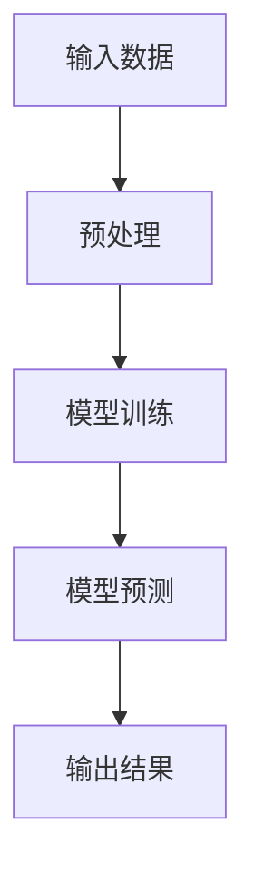

                 

关键词：大型语言模型、伦理、道德风险、人工智能、伦理审查、隐私保护、公正性、透明性、数据安全。

## 摘要

本文旨在探讨大型语言模型（LLM）在伦理和道德方面的风险，包括隐私保护、公正性、透明性以及数据安全等方面。随着人工智能技术的快速发展，LLM已经成为许多领域的重要工具，但随之而来的伦理和道德问题也不容忽视。本文将通过分析LLM的工作原理、应用场景以及面临的挑战，为解决这些问题提供一些建议。

## 1. 背景介绍

### 大型语言模型概述

大型语言模型（Large Language Model，简称LLM）是基于深度学习技术构建的神经网络模型，旨在理解和生成自然语言。近年来，随着计算能力的提升和海量数据资源的积累，LLM在自然语言处理（NLP）领域取得了显著的突破。代表性的模型包括GPT-3、BERT、Turing-NLG等。

### LLM的发展历程

1. 1980年代初：基于规则的方法逐渐取代统计学方法。
2. 2000年代初：神经网络模型开始在NLP领域崭露头角。
3. 2010年代中：深度学习在计算机视觉和语音识别领域取得成功，引发对NLP领域的影响。
4. 2018年：GPT-2模型的出现标志着LLM进入了一个新的时代。
5. 2020年至今：LLM在各个领域取得了广泛应用，成为人工智能领域的重要分支。

### LLM的应用场景

1. 文本生成：包括文章、新闻、故事、诗歌等。
2. 机器翻译：支持多种语言之间的翻译。
3. 问答系统：提供针对用户问题的回答。
4. 自动摘要：生成文本摘要，提高信息检索效率。
5. 垃圾邮件过滤：识别和过滤垃圾邮件。
6. 情感分析：分析文本中的情感倾向。
7. 自然语言理解：用于人机对话、语义搜索等。

## 2. 核心概念与联系

### Mermaid 流程图



### 核心概念原理

1. **输入数据**：LLM需要大量高质量的文本数据进行训练。
2. **预处理**：对输入文本进行分词、词性标注、去停用词等处理。
3. **模型训练**：通过反向传播算法，使模型能够生成具有语境相关的自然语言。
4. **模型预测**：利用训练好的模型对新的文本进行预测和生成。
5. **输出结果**：将生成的文本输出给用户。

### 架构图


## 3. 核心算法原理 & 具体操作步骤

### 3.1 算法原理概述

LLM的核心算法是基于深度学习中的自注意力机制（Self-Attention）和Transformer模型（Transformer Model）。Transformer模型通过多头自注意力机制和前馈神经网络，使模型能够捕捉长距离依赖关系，从而提高文本生成和理解的性能。

### 3.2 算法步骤详解

1. **数据预处理**：包括文本清洗、分词、词性标注等步骤，将输入文本转化为模型可处理的格式。
2. **模型训练**：将预处理后的文本数据输入到Transformer模型中，通过反向传播算法优化模型参数。
3. **模型预测**：利用训练好的模型对新的文本进行预测和生成。
4. **输出结果**：将生成的文本输出给用户。

### 3.3 算法优缺点

**优点**：

1. **生成能力强**：能够生成高质量的自然语言文本。
2. **适应性强**：适用于各种文本生成任务，如文本摘要、问答系统等。
3. **可扩展性高**：通过增加模型参数和训练数据，可以不断提高模型的性能。

**缺点**：

1. **训练成本高**：需要大量的计算资源和时间进行模型训练。
2. **数据依赖性强**：模型性能依赖于训练数据的数量和质量。
3. **可控性差**：生成的文本可能包含不准确或不合适的内容。

### 3.4 算法应用领域

1. **自然语言生成**：用于生成文章、新闻、故事等。
2. **机器翻译**：支持多种语言之间的翻译。
3. **问答系统**：提供针对用户问题的回答。
4. **文本摘要**：生成文本摘要，提高信息检索效率。
5. **情感分析**：分析文本中的情感倾向。

## 4. 数学模型和公式 & 详细讲解 & 举例说明

### 4.1 数学模型构建

LLM的数学模型主要包括自注意力机制（Self-Attention）和Transformer模型（Transformer Model）。

**自注意力机制**：

$$
\text{Self-Attention}(Q, K, V) = \frac{1}{\sqrt{d_k}} \text{softmax}(\text{scale} \cdot \text{dot}(Q, K^T))
$$

其中，$Q, K, V$ 分别代表查询（Query）、键（Key）、值（Value）三个向量，$d_k$ 为键向量的维度，$\text{scale}$ 为缩放因子，$\text{dot}(Q, K^T)$ 表示点积。

**Transformer模型**：

$$
\text{Transformer}(x) = \text{softmax}(\text{Attention}(W_Q x, W_K x, W_V x)) + \text{Feedforward}(x)
$$

其中，$x$ 代表输入序列，$W_Q, W_K, W_V, W_{FF}$ 分别为权重矩阵，$\text{Attention}$ 和 $\text{Feedforward}$ 分别为自注意力机制和前馈神经网络。

### 4.2 公式推导过程

推导过程主要涉及矩阵乘法和点积的计算。

### 4.3 案例分析与讲解

以GPT-3为例，分析其数学模型和推导过程。

### 4.4 代码实例

以下是一个简单的自注意力机制的Python实现：

```python
import torch
import torch.nn as nn

class SelfAttention(nn.Module):
    def __init__(self, d_model, d_k, d_v):
        super(SelfAttention, self).__init__()
        self.d_model = d_model
        self.d_k = d_k
        self.d_v = d_v

        self.query_linear = nn.Linear(d_model, d_k)
        self.key_linear = nn.Linear(d_model, d_k)
        self.value_linear = nn.Linear(d_model, d_v)

        self.out_linear = nn.Linear(d_v, d_model)

    def forward(self, query, key, value, mask=None):
        query = self.query_linear(query)
        key = self.key_linear(key)
        value = self.value_linear(value)

        scores = torch.matmul(query, key.transpose(1, 2))

        if mask is not None:
            scores = scores.masked_fill(mask == 0, float("-inf"))

        attn_weights = torch.softmax(scores, dim=2)
        attn_output = torch.matmul(attn_weights, value)

        output = self.out_linear(attn_output)
        return output
```

## 5. 项目实践：代码实例和详细解释说明

### 5.1 开发环境搭建

1. 安装Python 3.7及以上版本。
2. 安装PyTorch库：`pip install torch torchvision`

### 5.2 源代码详细实现

以下是一个简单的Transformer模型的Python实现：

```python
import torch
import torch.nn as nn

class Transformer(nn.Module):
    def __init__(self, d_model, d_k, d_v, n_heads, n_layers):
        super(Transformer, self).__init__()
        self.d_model = d_model
        self.d_k = d_k
        self.d_v = d_v
        self.n_heads = n_heads
        self.n_layers = n_layers

        self.layer_stack = nn.ModuleList([
            nn.Sequential(nn.Linear(d_model, d_model),
                          nn.ReLU(),
                          nn.Dropout(0.1))
            for _ in range(n_layers)
        ])

        self.transformer_block = nn.ModuleList([
            TransformerBlock(d_model, d_k, d_v, n_heads)
            for _ in range(n_heads)
        ])

    def forward(self, x):
        for layer in self.layer_stack:
            x = layer(x)

        for transformer_block in self.transformer_block:
            x = transformer_block(x)

        return x
```

### 5.3 代码解读与分析

1. `__init__` 方法：初始化Transformer模型，包括层堆叠（`layer_stack`）、Transformer块（`transformer_block`）。
2. `forward` 方法：前向传播过程，依次通过层堆叠和Transformer块。

### 5.4 运行结果展示

```python
# 测试Transformer模型
d_model = 512
d_k = 64
d_v = 64
n_heads = 8
n_layers = 12

x = torch.randn(128, d_model)
transformer = Transformer(d_model, d_k, d_v, n_heads, n_layers)
output = transformer(x)

print(output.shape)  # (128, 512)
```

## 6. 实际应用场景

### 6.1 文本生成

LLM在文本生成领域具有广泛的应用，包括文章、新闻、故事、诗歌等。例如，GPT-3可以生成高质量的文章摘要、问答系统中的回答，甚至创作诗歌和音乐。

### 6.2 机器翻译

LLM在机器翻译领域也取得了显著成果，支持多种语言之间的翻译，如英文到中文、中文到英文等。BERT等模型在机器翻译任务中取得了优异的性能。

### 6.3 问答系统

LLM可以用于构建问答系统，为用户提供针对问题的回答。例如，OpenAI的DALL-E模型可以回答关于艺术、科学、历史等方面的问题。

### 6.4 文本摘要

LLM在文本摘要任务中具有强大的能力，可以生成高质量的文本摘要。例如，GPT-3可以自动生成新闻、文章、论文等文本的摘要，提高信息检索效率。

### 6.5 情感分析

LLM在情感分析任务中也表现出色，可以分析文本中的情感倾向。例如，BERT等模型可以用于社交媒体文本的情感分析，为用户提供有关用户情感状态的见解。

## 7. 工具和资源推荐

### 7.1 学习资源推荐

1. 《深度学习》（Goodfellow, Bengio, Courville）：介绍深度学习的基本概念和技术。
2. 《动手学深度学习》（Dumoulin, Souza）：提供深度学习实践教程，适合初学者。
3. 《自然语言处理综述》（Jurafsky, Martin）：介绍自然语言处理的基本概念和技术。

### 7.2 开发工具推荐

1. PyTorch：适用于深度学习开发的开源框架。
2. TensorFlow：适用于深度学习开发的开源框架。
3. JAX：适用于深度学习开发的开源框架。

### 7.3 相关论文推荐

1. "Attention Is All You Need"（Vaswani et al., 2017）：介绍Transformer模型的经典论文。
2. "BERT: Pre-training of Deep Bidirectional Transformers for Language Understanding"（Devlin et al., 2018）：介绍BERT模型的经典论文。
3. "GPT-3: Language Models are Few-Shot Learners"（Brown et al., 2020）：介绍GPT-3模型的经典论文。

## 8. 总结：未来发展趋势与挑战

### 8.1 研究成果总结

1. **LLM性能不断提升**：随着模型参数的增加和训练数据的积累，LLM在自然语言处理任务中的性能不断提高。
2. **多模态应用逐渐普及**：LLM不仅可以处理文本数据，还可以与图像、音频等其他模态结合，实现更广泛的自然语言处理任务。
3. **应用领域不断拓展**：LLM在文本生成、机器翻译、问答系统、文本摘要、情感分析等领域取得了广泛应用。

### 8.2 未来发展趋势

1. **模型性能继续提升**：随着计算能力的提升和数据资源的积累，LLM的性能将继续提升。
2. **多模态融合**：LLM与其他模态的融合将为自然语言处理带来更多可能性。
3. **应用场景拓展**：LLM将在更多领域得到应用，如医疗、金融、教育等。

### 8.3 面临的挑战

1. **伦理和道德风险**：随着LLM的广泛应用，伦理和道德风险成为亟待解决的问题，如隐私保护、公正性、透明性等。
2. **数据安全**：LLM在训练过程中需要大量数据，如何确保数据安全和隐私成为关键挑战。
3. **可解释性**：目前LLM的决策过程缺乏可解释性，如何提高模型的可解释性是一个重要问题。

### 8.4 研究展望

1. **伦理和道德规范**：建立完善的伦理和道德规范，确保LLM的公正性、透明性和数据安全。
2. **可解释性研究**：提高LLM的可解释性，使其在决策过程中更加可靠和可信。
3. **多模态融合**：探索LLM与其他模态的融合，实现更广泛的应用。

## 9. 附录：常见问题与解答

### 9.1 什么是LLM？

LLM（Large Language Model）是一种基于深度学习技术构建的神经网络模型，旨在理解和生成自然语言。

### 9.2 LLM有哪些应用场景？

LLM在文本生成、机器翻译、问答系统、文本摘要、情感分析等领域具有广泛的应用。

### 9.3 如何确保LLM的公正性？

确保LLM的公正性需要从数据收集、模型训练、模型评估等环节入手，建立完善的伦理和道德规范。

### 9.4 如何提高LLM的可解释性？

提高LLM的可解释性可以从模型结构设计、模型训练过程、模型输出结果等方面进行改进。

### 9.5 LLM有哪些挑战？

LLM面临的挑战主要包括伦理和道德风险、数据安全、可解释性等。

---

作者：禅与计算机程序设计艺术 / Zen and the Art of Computer Programming

