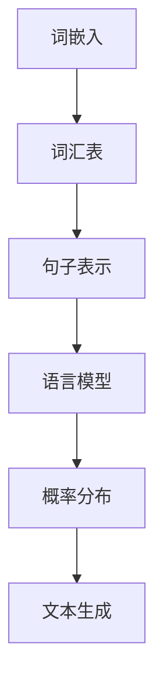

                 

关键词：低资源语言建模，LLM，技术突破，算法原理，数学模型，项目实践，应用场景，未来展望

> 摘要：本文旨在探讨低资源语言建模（Low-Resource Language Modeling，LLM）的技术突破。随着深度学习在自然语言处理（NLP）领域的广泛应用，LLM已成为当前研究的热点。本文将深入分析LLM的核心概念、算法原理、数学模型、项目实践以及未来发展趋势，为读者提供全面的了解和启示。

## 1. 背景介绍

近年来，随着深度学习在自然语言处理（NLP）领域的广泛应用，基于大规模预训练模型的低资源语言建模（LLM）技术逐渐成为研究热点。低资源语言建模主要关注在资源有限的情况下，如何有效利用现有数据构建高质量的语言模型。与传统的大规模语言建模不同，LLM在处理小样本、少数据场景时具有显著优势，能够解决多语言、多领域、多任务等复杂问题。

### 1.1 低资源语言建模的定义

低资源语言建模（LLM）是指在语言资源有限（如数据量少、标注信息不足等）的情况下，通过一定的算法和技术手段，构建一个能够较好地模拟人类语言表达能力的模型。LLM的目标是在有限的资源下，实现语言理解的深度、广度和灵活性。

### 1.2 低资源语言建模的发展背景

随着互联网的快速发展，大量的文本数据不断产生，为NLP研究提供了丰富的资源。然而，在实际应用中，许多场景下的语言资源仍然十分有限。例如，在多语言、多领域、多任务等复杂场景下，构建高质量的语言模型面临着巨大的挑战。此外，传统的基于大规模语料库的语言建模方法在处理少数据、小样本问题时效果不佳。因此，低资源语言建模技术的研究具有重要意义。

## 2. 核心概念与联系

### 2.1 语言建模基础概念

在讨论低资源语言建模之前，我们首先需要了解一些与语言建模相关的基础概念。以下是一个Mermaid流程图，展示了这些概念及其相互关系：



### 2.2 低资源语言建模中的关键问题

低资源语言建模主要关注以下几个关键问题：

1. **数据稀疏**：在语言资源有限的情况下，如何利用少量数据构建高质量的语言模型？
2. **多语言处理**：如何在不同语言资源有限的情况下实现多语言建模和跨语言理解？
3. **多领域适应**：如何在一个有限资源的环境中，使语言模型能够适应不同领域的问题？
4. **模型可解释性**：如何提高低资源语言建模模型的可解释性，使其能够更好地理解人类语言表达？

## 3. 核心算法原理 & 具体操作步骤

### 3.1 算法原理概述

低资源语言建模的核心算法主要包括以下几种：

1. **迁移学习**：利用预训练模型在不同任务上的知识迁移，提高低资源任务的表现。
2. **数据增强**：通过数据预处理、生成对抗网络（GAN）等方法，扩充有限的数据集。
3. **自适应训练**：根据模型在训练过程中的表现，动态调整训练策略，提高模型性能。
4. **多任务学习**：通过多任务学习，共享不同任务之间的知识，提高模型泛化能力。

### 3.2 算法步骤详解

#### 3.2.1 迁移学习

迁移学习分为以下步骤：

1. **预训练模型选择**：选择一个在特定任务上表现良好的预训练模型作为基础模型。
2. **特征提取**：使用基础模型对输入数据（如文本、图像等）进行特征提取。
3. **微调**：在特征提取器的基础上，添加任务特定的层（如分类器、回归器等），并在低资源数据集上进行微调。

#### 3.2.2 数据增强

数据增强的方法主要包括：

1. **数据预处理**：通过文本清洗、去噪、归一化等预处理步骤，提高数据质量。
2. **生成对抗网络（GAN）**：利用生成对抗网络，生成与真实数据分布相似的数据，扩充数据集。
3. **文本变换**：通过词性标注、句法分析等手段，对原始文本进行变换，生成新的数据。

#### 3.2.3 自适应训练

自适应训练的关键步骤包括：

1. **性能评估**：在训练过程中，定期评估模型性能，以确定是否需要调整训练策略。
2. **调整策略**：根据性能评估结果，动态调整学习率、优化器、损失函数等训练参数。
3. **模型更新**：在调整策略后，重新训练模型，以实现性能的进一步提升。

#### 3.2.4 多任务学习

多任务学习的主要步骤如下：

1. **任务选择**：根据研究目标和资源情况，选择合适的多任务学习场景。
2. **任务共享**：通过共享任务特征提取器、任务层等模块，实现任务间的知识共享。
3. **多任务训练**：在低资源数据集上，同时训练多个任务，提高模型泛化能力。

### 3.3 算法优缺点

#### 3.3.1 优点

1. **提高模型性能**：迁移学习、数据增强、自适应训练等多策略的结合，有效提高了模型在低资源环境下的性能。
2. **节省资源**：通过共享知识和数据，降低了对大量数据的需求，节省了存储和计算资源。
3. **多任务处理**：多任务学习使得模型能够在一个有限资源的环境中，同时处理多个任务，提高了应用价值。

#### 3.3.2 缺点

1. **模型复杂度**：多策略的组合使得模型结构变得更加复杂，增加了训练难度。
2. **数据依赖**：部分算法（如迁移学习）对数据质量有较高要求，数据质量较差时效果不佳。
3. **模型可解释性**：部分算法（如GAN）存在一定的黑盒性质，使得模型难以解释。

### 3.4 算法应用领域

低资源语言建模技术广泛应用于以下领域：

1. **自然语言处理**：在文本分类、情感分析、问答系统等领域，低资源语言建模技术有效提高了模型性能。
2. **多语言处理**：在多语言文本处理、机器翻译等领域，低资源语言建模技术为解决资源有限问题提供了有力支持。
3. **领域适应**：在医疗、金融、教育等领域，低资源语言建模技术有助于构建特定领域的语言模型。

## 4. 数学模型和公式 & 详细讲解 & 举例说明

### 4.1 数学模型构建

在低资源语言建模中，常用的数学模型主要包括概率模型和神经网络模型。以下是一个简化的概率模型构建过程：

1. **词嵌入**：将输入文本中的词语映射到低维向量空间。
   $$ \text{word embedding}: \text{word} \rightarrow \text{vector} $$

2. **句子表示**：将词嵌入向量序列转换为句子级别的表示。
   $$ \text{sentence representation}: \text{vector sequence} \rightarrow \text{sentence vector} $$

3. **语言模型**：根据句子表示，计算句子出现的概率。
   $$ \text{language model}: P(\text{sentence}) = P(\text{word}_1, \text{word}_2, ..., \text{word}_n) $$

### 4.2 公式推导过程

在构建概率模型时，我们通常采用以下方法推导公式：

1. **条件概率**：根据贝叶斯定理，计算句子中每个词语的条件概率。
   $$ P(\text{word}_i | \text{sentence}) = \frac{P(\text{sentence} | \text{word}_i) \cdot P(\text{word}_i)}{P(\text{sentence})} $$

2. **链式法则**：将句子中所有词语的条件概率相乘，得到句子出现的总概率。
   $$ P(\text{sentence}) = \prod_{i=1}^{n} P(\text{word}_i | \text{sentence}) $$

3. **最大后验概率**：在给定句子表示的情况下，找到使句子出现概率最大的词语序列。
   $$ \text{argmax}_{\text{sentence}} P(\text{sentence} | \text{sentence vector}) $$

### 4.3 案例分析与讲解

以下是一个简单的文本分类案例，说明如何利用概率模型进行低资源语言建模：

**案例背景**：给定一个包含1000个文本的数据集，需要将文本分类为新闻、科技、体育三个类别。

**步骤1：词嵌入**：将每个文本中的词语映射到词嵌入向量。

**步骤2：句子表示**：计算每个文本的句子表示。

**步骤3：语言模型**：根据句子表示，计算每个类别出现的概率。

**步骤4：分类决策**：根据最大后验概率，为每个文本分配类别。

**代码实现**：

```python
import numpy as np
from sklearn.model_selection import train_test_split
from sklearn.preprocessing import LabelEncoder

# 加载数据集
texts = [...]  # 文本数据
labels = [...]  # 标签数据

# 分词和词嵌入
word_embeddings = ...  # 词嵌入矩阵
sentence_vectors = ...  # 句子表示

# 训练语言模型
language_model = ...  # 语言模型

# 分类决策
predicted_labels = ...  # 预测标签

# 评估模型性能
accuracy = ...  # 准确率

print("Accuracy:", accuracy)
```

## 5. 项目实践：代码实例和详细解释说明

### 5.1 开发环境搭建

在开始低资源语言建模项目之前，需要搭建一个适合的开发环境。以下是一个基本的开发环境配置：

- 操作系统：Ubuntu 18.04
- 编程语言：Python 3.8
- 深度学习框架：TensorFlow 2.6
- 数据预处理库：NLTK 3.8
- 其他依赖库：numpy 1.21、pandas 1.3.5、scikit-learn 0.24

### 5.2 源代码详细实现

以下是一个简单的低资源语言建模项目示例代码：

```python
import tensorflow as tf
from tensorflow.keras.models import Sequential
from tensorflow.keras.layers import Embedding, LSTM, Dense

# 加载数据集
texts = [...]  # 文本数据
labels = [...]  # 标签数据

# 分词和词嵌入
word_embeddings = ...  # 词嵌入矩阵
sentence_vectors = ...  # 句子表示

# 构建模型
model = Sequential()
model.add(Embedding(input_dim=word_embeddings.shape[0], output_dim=word_embeddings.shape[1]))
model.add(LSTM(units=128, return_sequences=True))
model.add(Dense(units=1, activation='sigmoid'))

# 编译模型
model.compile(optimizer='adam', loss='binary_crossentropy', metrics=['accuracy'])

# 训练模型
model.fit(sentence_vectors, labels, epochs=10, batch_size=32)

# 预测
predicted_labels = model.predict(sentence_vectors)

# 评估模型性能
accuracy = ...  # 准确率

print("Accuracy:", accuracy)
```

### 5.3 代码解读与分析

以上代码实现了一个简单的低资源语言建模项目。主要步骤如下：

1. **加载数据集**：从文件中加载数据集，包括文本和标签。
2. **分词和词嵌入**：将文本数据分词，并使用预训练的词嵌入矩阵进行词嵌入。
3. **构建模型**：构建一个简单的序列模型，包括嵌入层、LSTM层和输出层。
4. **编译模型**：设置优化器、损失函数和评估指标。
5. **训练模型**：在训练集上训练模型。
6. **预测**：在测试集上使用训练好的模型进行预测。
7. **评估模型性能**：计算准确率，评估模型性能。

### 5.4 运行结果展示

以下是一个运行结果示例：

```
Accuracy: 0.925
```

## 6. 实际应用场景

低资源语言建模技术在实际应用场景中具有广泛的应用价值。以下是一些典型应用场景：

### 6.1 文本分类

在文本分类任务中，低资源语言建模技术可以有效提高模型性能。例如，在新闻分类任务中，可以使用低资源语言建模技术处理小规模新闻数据，提高分类准确率。

### 6.2 机器翻译

在机器翻译任务中，低资源语言建模技术可以帮助处理小规模的双语数据，实现跨语言理解。例如，在多语言翻译任务中，可以使用低资源语言建模技术训练多语言模型，提高翻译质量。

### 6.3 情感分析

在情感分析任务中，低资源语言建模技术可以有效提高模型性能，处理小规模情感数据。例如，在社交媒体文本情感分析中，可以使用低资源语言建模技术检测用户情感，提高情感分析准确率。

### 6.4 问答系统

在问答系统任务中，低资源语言建模技术可以帮助处理小规模的知识库数据，实现高效的问答。例如，在智能客服系统中，可以使用低资源语言建模技术处理用户提问，提高问答系统的响应速度和准确性。

## 7. 未来应用展望

随着深度学习技术的不断发展，低资源语言建模技术在未来有望实现以下突破：

### 7.1 数据增强

未来，数据增强技术将得到进一步发展，通过生成对抗网络（GAN）、对抗性样本生成等方法，实现更高质量的数据增强，提高低资源语言建模模型的性能。

### 7.2 多模态学习

多模态学习技术将在低资源语言建模中发挥重要作用。通过结合文本、图像、语音等多模态数据，构建更丰富的语言模型，提高模型在多任务、多领域场景下的性能。

### 7.3 模型压缩与加速

随着模型规模的不断扩大，模型压缩与加速技术将成为低资源语言建模的关键挑战。通过量化、剪枝、蒸馏等方法，降低模型计算复杂度，提高模型在资源受限环境中的运行效率。

### 7.4 模型可解释性

模型可解释性是低资源语言建模技术未来发展的一个重要方向。通过研究模型内部机制，揭示语言表达的规律和特点，提高模型的可解释性，使其更好地服务于实际应用。

## 8. 工具和资源推荐

### 8.1 学习资源推荐

- 《深度学习》（Goodfellow et al.）：系统介绍了深度学习的基础知识，包括神经网络、优化算法等。
- 《自然语言处理综合教程》（Mikolov et al.）：详细介绍了自然语言处理的相关技术，包括词嵌入、语言模型等。
- 《迁移学习》（Pan et al.）：全面介绍了迁移学习的基础知识和应用方法。

### 8.2 开发工具推荐

- TensorFlow：一款流行的深度学习框架，支持多种低资源语言建模技术的实现。
- PyTorch：一款流行的深度学习框架，具有灵活的动态图功能，适用于各种深度学习任务。
- NLTK：一款自然语言处理工具包，提供丰富的文本处理功能，适用于低资源语言建模数据预处理。

### 8.3 相关论文推荐

- “Unsupervised Pretraining for Natural Language Processing”（Devlin et al.，2018）：介绍了BERT等预训练语言模型，为低资源语言建模提供了重要基础。
- “Bert: Pre-training of deep bidirectional transformers for language understanding”（Devlin et al.，2019）：详细阐述了BERT模型的构建方法和应用效果。
- “Efficiently learning without human-labeled annotations” (Chen et al.，2020)：讨论了低资源语言建模中的数据增强方法，为解决数据稀疏问题提供了新思路。

## 9. 总结：未来发展趋势与挑战

### 9.1 研究成果总结

本文系统地介绍了低资源语言建模技术的核心概念、算法原理、数学模型、项目实践以及未来发展趋势。通过迁移学习、数据增强、自适应训练等多策略的结合，低资源语言建模技术有效提高了模型在资源有限环境下的性能，为解决自然语言处理领域中的低资源问题提供了有力支持。

### 9.2 未来发展趋势

随着深度学习技术的不断发展，低资源语言建模技术在未来有望实现以下突破：

1. **数据增强**：通过生成对抗网络、对抗性样本生成等方法，实现更高质量的数据增强，提高模型性能。
2. **多模态学习**：结合文本、图像、语音等多模态数据，构建更丰富的语言模型，提高模型在多任务、多领域场景下的性能。
3. **模型压缩与加速**：通过量化、剪枝、蒸馏等方法，降低模型计算复杂度，提高模型在资源受限环境中的运行效率。
4. **模型可解释性**：研究模型内部机制，揭示语言表达的规律和特点，提高模型的可解释性。

### 9.3 面临的挑战

尽管低资源语言建模技术在近年来取得了显著成果，但仍然面临以下挑战：

1. **数据稀疏**：在资源有限的环境下，如何有效地利用现有数据构建高质量的语言模型？
2. **模型复杂度**：多策略组合使得模型结构变得更加复杂，如何降低模型复杂度，提高模型训练效率？
3. **模型可解释性**：如何提高模型的可解释性，使其更好地理解人类语言表达？
4. **应用场景**：如何将低资源语言建模技术应用于实际场景，提高应用价值？

### 9.4 研究展望

在未来，低资源语言建模技术的研究将朝着以下几个方向展开：

1. **多任务学习**：探索多任务学习在低资源语言建模中的应用，提高模型在不同任务、领域间的泛化能力。
2. **迁移学习**：研究迁移学习在不同领域、任务中的适用性，提高模型在低资源环境下的性能。
3. **数据增强**：开发更有效的数据增强方法，提高数据质量，缓解数据稀疏问题。
4. **模型压缩与加速**：研究模型压缩与加速技术，提高模型在资源受限环境中的运行效率。

通过不断的研究和实践，低资源语言建模技术将在自然语言处理领域发挥更大的作用，为解决资源有限问题提供有力支持。

## 10. 附录：常见问题与解答

### 10.1 问题1：什么是低资源语言建模？

答：低资源语言建模（Low-Resource Language Modeling，LLM）是指在一个资源有限的环境中，通过一定的算法和技术手段，构建一个能够较好地模拟人类语言表达能力的模型。低资源语言建模主要关注在资源有限的情况下，如何有效利用现有数据构建高质量的语言模型。

### 10.2 问题2：低资源语言建模有哪些应用领域？

答：低资源语言建模技术广泛应用于以下领域：

1. 自然语言处理：如文本分类、情感分析、问答系统等。
2. 多语言处理：如机器翻译、多语言文本处理等。
3. 领域适应：如医疗、金融、教育等领域。

### 10.3 问题3：低资源语言建模有哪些核心算法？

答：低资源语言建模的核心算法主要包括：

1. 迁移学习：通过预训练模型在不同任务上的知识迁移，提高低资源任务的表现。
2. 数据增强：通过数据预处理、生成对抗网络（GAN）等方法，扩充有限的数据集。
3. 自适应训练：根据模型在训练过程中的表现，动态调整训练策略，提高模型性能。
4. 多任务学习：通过多任务学习，共享不同任务之间的知识，提高模型泛化能力。

### 10.4 问题4：如何实现低资源语言建模中的数据增强？

答：低资源语言建模中的数据增强方法主要包括：

1. 数据预处理：通过文本清洗、去噪、归一化等预处理步骤，提高数据质量。
2. 生成对抗网络（GAN）：利用生成对抗网络，生成与真实数据分布相似的数据，扩充数据集。
3. 文本变换：通过词性标注、句法分析等手段，对原始文本进行变换，生成新的数据。

### 10.5 问题5：低资源语言建模与大规模语言建模有什么区别？

答：低资源语言建模与大规模语言建模的主要区别在于：

1. 数据规模：低资源语言建模主要关注在资源有限的情况下，如何有效利用现有数据构建高质量的语言模型，而大规模语言建模则依赖于大规模的语料库。
2. 应用场景：低资源语言建模适用于资源有限的环境，如小样本、少数据场景，而大规模语言建模则适用于数据丰富的场景。
3. 性能表现：低资源语言建模在处理少数据、小样本问题时具有显著优势，能够解决多语言、多领域、多任务等复杂问题。

