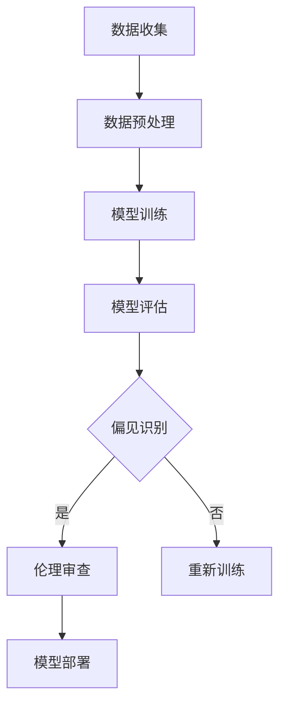

                 

关键词：语言模型，偏见消除，公平性，AI伦理，算法公平性，人工智能，数据偏见，多样性

## 摘要

本文将深入探讨大规模语言模型（LLM）中存在的偏见问题，并重点研究如何通过技术手段消除这些偏见，以构建一个公平的AI世界。我们将首先介绍LLM的基本原理和应用，然后分析数据偏见如何影响模型输出，最后提出一系列解决方案，包括算法改进、数据预处理和伦理审查等，以实现更公平、更可靠的AI系统。文章将结合实际案例，展示偏见消除的方法和效果，并对未来趋势和挑战进行展望。

## 1. 背景介绍

近年来，人工智能（AI）技术取得了飞速发展，尤其是在自然语言处理（NLP）领域，大规模语言模型（LLM）如BERT、GPT-3等取得了令人瞩目的成果。这些模型通过深度学习算法，从大量文本数据中学习语言模式和规律，从而实现了高质量的文本生成、翻译、问答等功能。LLM的应用场景广泛，从智能客服、内容审核到教育辅助、医疗诊断，都发挥着重要作用。

然而，随着AI技术的普及，其偏见问题也日益凸显。偏见是指模型在输出结果中不公平地对待某些群体或个体。在NLP领域，偏见问题尤为严重，因为它直接关系到语言的理解和使用。例如，LLM可能会在文本生成中表现出性别偏见、种族偏见或地域偏见，导致不公平或不恰当的内容产生。这种偏见不仅损害了AI系统的可信度，还可能对社会产生负面影响。

因此，消除LLM中的偏见，构建公平的AI世界，已成为当前AI研究中的一个重要议题。本文将围绕这一主题，探讨偏见消除的技术手段和伦理问题，以期为构建公平、公正的AI系统提供参考。

## 2. 核心概念与联系

### 2.1 大规模语言模型（LLM）

大规模语言模型（LLM）是一种基于深度学习的语言处理模型，能够通过学习大量文本数据，生成高质量的文本内容。LLM的核心思想是通过神经网络的训练，学习语言中的上下文关系和语法结构，从而实现自然语言的生成和理解。

#### 2.1.1 基本原理

LLM的基本原理可以分为三个阶段：数据收集、模型训练和模型应用。

1. **数据收集**：收集大量带有标签的文本数据，这些数据可以是书籍、新闻、社交媒体等不同来源的文本。
2. **模型训练**：使用深度学习算法（如Transformer、BERT等），对文本数据进行建模，训练模型参数，使其能够理解和生成自然语言。
3. **模型应用**：将训练好的模型应用于实际场景，如文本生成、翻译、问答等。

#### 2.1.2 常见架构

LLM的常见架构包括：

1. **Transformer**：由Vaswani等人在2017年提出，是当前最流行的LLM架构。它使用自注意力机制，能够在全局范围内学习文本的上下文关系。
2. **BERT**：由Google在2018年提出，采用双向编码器表示，能够在训练过程中同时考虑文本的前后文信息。
3. **GPT-3**：由OpenAI在2020年推出，是当前最大的LLM，拥有1750亿个参数。它通过自回归的方式生成文本，具有强大的文本生成能力。

### 2.2 数据偏见

数据偏见是指模型在训练过程中，由于数据集的不均衡、不平衡或偏向性，导致模型在输出结果中不公平地对待某些群体或个体。数据偏见是LLM偏见问题的根源，对模型的公平性和可靠性产生严重影响。

#### 2.2.1 数据来源

数据偏见通常来源于以下几个方面：

1. **数据集不均衡**：某些类别或标签的样本数量远多于其他类别或标签，导致模型在训练过程中对某些类别或标签过度依赖。
2. **数据标注偏差**：数据标注者的主观判断和偏见可能影响数据的标注结果，从而影响模型的学习过程。
3. **数据来源偏见**：数据来源本身可能存在偏见，如新闻媒体、社交媒体等，这些数据可能反映某种特定群体的观点和态度。

#### 2.2.2 偏见类型

LLM中的数据偏见主要表现为以下几种类型：

1. **性别偏见**：在文本生成中，LLM可能倾向于使用特定的性别词汇或表达方式，如使用“他”代替“他们”。
2. **种族偏见**：LLM可能在文本生成中表现出对特定种族或民族的不公平对待，如使用贬低或歧视性的语言。
3. **地域偏见**：LLM可能在处理特定地域的文本时，表现出对该地域的不公平对待，如对某个地区使用负面词汇。

### 2.3 偏见消除方法

偏见消除是构建公平AI系统的关键环节。以下介绍几种常见的偏见消除方法：

#### 2.3.1 算法改进

通过改进模型算法，可以减少数据偏见对模型输出结果的影响。例如，使用对抗训练（Adversarial Training）方法，在训练过程中引入对抗样本，使模型对偏见数据更加鲁棒。

#### 2.3.2 数据预处理

在模型训练前，对数据集进行预处理，可以消除数据偏见。常见的预处理方法包括：

1. **数据清洗**：去除数据中的噪声和错误，提高数据质量。
2. **数据增强**：通过生成或扩展数据集，增加模型训练的多样性和鲁棒性。
3. **类别平衡**：通过调整数据集中各类别的样本数量，实现数据集的均衡。

#### 2.3.3 伦理审查

在模型开发和部署过程中，进行伦理审查，确保模型的设计和应用符合伦理标准。伦理审查包括以下方面：

1. **偏见识别**：识别模型中的潜在偏见，评估其对公平性的影响。
2. **责任分配**：明确模型开发者和使用者对偏见问题的责任，制定相应的责任承担机制。
3. **透明性提升**：提高模型训练和应用过程的透明性，使公众能够了解模型的工作原理和偏见情况。

### 2.4 Mermaid 流程图

以下是大规模语言模型（LLM）偏见消除过程的 Mermaid 流程图：



## 3. 核心算法原理 & 具体操作步骤

### 3.1 算法原理概述

偏见消除算法的核心思想是通过识别和修正模型中的偏见，提高模型的公平性和可靠性。以下介绍几种常见的偏见消除算法：

#### 3.1.1 对抗训练

对抗训练是一种基于生成对抗网络（GAN）的方法，通过生成对抗样本，使模型对偏见数据更加鲁棒。具体步骤如下：

1. **生成对抗样本**：使用生成模型生成与真实样本具有相似特征的对抗样本。
2. **训练模型**：将对抗样本与真实样本一起输入模型，训练模型参数。
3. **评估模型**：使用验证集评估模型的偏见消除效果。

#### 3.1.2 类别平衡

类别平衡是一种通过调整数据集中各类别的样本数量，实现数据集均衡的方法。具体步骤如下：

1. **计算类别失衡度**：计算数据集中各类别的样本数量，计算类别失衡度。
2. **样本扩充**：根据类别失衡度，对少数类别进行样本扩充。
3. **重新训练模型**：使用扩充后的数据集重新训练模型。

#### 3.1.3 伦理审查

伦理审查是一种通过评估模型设计和应用过程中的潜在偏见，确保模型符合伦理标准的方法。具体步骤如下：

1. **偏见识别**：分析模型训练和应用过程中可能存在的偏见。
2. **评估影响**：评估偏见对公平性的影响，确定需要采取的措施。
3. **制定对策**：根据评估结果，制定相应的对策，如调整模型设计或数据集。

### 3.2 算法步骤详解

以下以类别平衡算法为例，详细介绍偏见消除算法的具体步骤：

#### 3.2.1 数据预处理

1. **数据清洗**：去除数据中的噪声和错误，提高数据质量。
2. **标签转换**：将原始标签转换为二进制形式，便于计算类别失衡度。

#### 3.2.2 计算类别失衡度

1. **统计各类别样本数量**：计算数据集中各类别的样本数量。
2. **计算类别失衡度**：计算各类别的样本数量占总样本数量的比例，得到类别失衡度。

#### 3.2.3 样本扩充

1. **确定扩充策略**：根据类别失衡度，确定样本扩充策略，如随机扩充、重采样等。
2. **扩充样本**：使用扩充策略对少数类别进行样本扩充。

#### 3.2.4 重新训练模型

1. **准备训练数据集**：将扩充后的数据集作为训练数据集。
2. **训练模型**：使用扩充后的数据集重新训练模型。
3. **评估模型**：使用验证集评估模型的偏见消除效果。

### 3.3 算法优缺点

#### 3.3.1 对抗训练

**优点**：

1. **增强模型鲁棒性**：对抗训练能够使模型对偏见数据更加鲁棒，提高模型的可信度。
2. **减少数据偏见**：对抗训练通过生成对抗样本，能够减少模型中的数据偏见。

**缺点**：

1. **计算成本高**：对抗训练需要生成大量的对抗样本，计算成本较高。
2. **难以平衡类别**：对抗训练难以实现数据集中各类别的均衡，可能引入新的类别失衡。

#### 3.3.2 类别平衡

**优点**：

1. **简单易行**：类别平衡算法简单易懂，易于实现。
2. **提高模型公平性**：通过调整数据集的类别失衡度，能够提高模型的公平性和可靠性。

**缺点**：

1. **影响模型性能**：类别平衡可能导致部分类别的样本不足，影响模型的性能。
2. **数据预处理复杂**：类别平衡算法需要对数据进行复杂的预处理，如样本扩充和重采样等。

#### 3.3.3 伦理审查

**优点**：

1. **确保伦理标准**：伦理审查能够确保模型设计和应用过程中符合伦理标准，提高模型的公正性。
2. **责任明确**：伦理审查能够明确模型开发者和使用者的责任，减少偏见问题的发生。

**缺点**：

1. **主观性较强**：伦理审查过程中，评估者和评估标准可能存在主观性，影响评估结果的客观性。
2. **执行难度大**：伦理审查需要制定详细的评估标准和责任承担机制，执行难度较大。

### 3.4 算法应用领域

偏见消除算法在多个领域都有广泛的应用：

1. **文本生成**：通过消除数据偏见，提高文本生成的公平性和可信度。
2. **内容审核**：通过消除偏见，提高内容审核的准确性和公正性。
3. **推荐系统**：通过消除数据偏见，提高推荐系统的公平性和用户满意度。
4. **医疗诊断**：通过消除数据偏见，提高医疗诊断的准确性和公正性。

## 4. 数学模型和公式 & 详细讲解 & 举例说明

### 4.1 数学模型构建

偏见消除的数学模型通常基于概率论和统计学习理论。以下是一个简单的数学模型，用于描述偏见消除的过程：

#### 4.1.1 概率分布

假设我们有一个包含 $C$ 个类别的数据集 $D$，每个类别 $c$ 的样本数量为 $n_c$，总样本数量为 $N$。我们使用概率分布 $P_c$ 表示每个类别在数据集中的占比：

$$
P_c = \frac{n_c}{N}, \quad \forall c \in \{1, 2, \ldots, C\}
$$

#### 4.1.2 类别失衡度

类别失衡度用于衡量数据集中各类别的样本数量差异。一个常用的类别失衡度指标是类别失衡率 $\Delta_c$：

$$
\Delta_c = \frac{n_c - \bar{n}}{\bar{n}}, \quad \bar{n} = \frac{1}{C - 1} \sum_{c=1}^{C} n_c
$$

其中，$\bar{n}$ 是平均类别样本数量。

#### 4.1.3 偏见消除目标

偏见消除的目标是减少类别失衡度，使数据集更加均衡。一个简单的目标函数可以表示为：

$$
\min \sum_{c=1}^{C} \Delta_c
$$

### 4.2 公式推导过程

#### 4.2.1 样本扩充

为了减少类别失衡度，我们可以对少数类别进行样本扩充。假设我们选择对类别 $c$ 进行扩充，扩充比例为 $r_c$，则扩充后的类别 $c$ 的样本数量为：

$$
n_c' = n_c + r_c(n_c - \bar{n})
$$

其中，$r_c$ 是基于类别失衡度的扩充比例：

$$
r_c = \frac{\bar{n} - n_c}{\bar{n} - n_c'}
$$

#### 4.2.2 重新训练模型

在样本扩充后，我们使用扩充后的数据集重新训练模型。为了评估模型的偏见消除效果，我们计算重新训练后的模型在各个类别上的准确率 $P_c'$：

$$
P_c' = \frac{1}{N'} \sum_{i=1}^{N'} \mathbb{1}_{y_i = c}(\hat{y}_i = c)
$$

其中，$N'$ 是扩充后的数据集总样本数量，$y_i$ 是第 $i$ 个样本的真实类别，$\hat{y}_i$ 是模型预测的第 $i$ 个样本的类别。

#### 4.2.3 偏见消除评估

偏见消除的效果可以通过类别失衡度的减少程度进行评估。一个简单的评估指标是类别失衡度的减少比例 $\Delta_c'$：

$$
\Delta_c' = \frac{\Delta_c - \Delta_c'}{\Delta_c}
$$

其中，$\Delta_c'$ 是重新训练后的类别失衡度。

### 4.3 案例分析与讲解

以下是一个简单的案例，用于说明偏见消除的过程。

#### 4.3.1 数据集

假设我们有一个包含两个类别（男性、女性）的数据集，其中男性样本数量为 60，女性样本数量为 40。初始类别失衡度为：

$$
\Delta_m = \frac{60 - 50}{50} = 0.2
$$

#### 4.3.2 样本扩充

我们选择对女性类别进行扩充，扩充比例为 $r_f = 0.3$。则扩充后的女性类别样本数量为：

$$
n_f' = 40 + 0.3(40 - 50) = 33
$$

扩充后的类别失衡度为：

$$
\Delta_f' = \frac{33 - 50}{50} = -0.16
$$

#### 4.3.3 重新训练模型

我们使用扩充后的数据集重新训练模型，评估重新训练后的模型在两个类别上的准确率。假设重新训练后的模型在男性类别上的准确率为 0.9，在女性类别上的准确率为 0.85。则类别失衡度的减少比例为：

$$
\Delta_m' = \frac{0.2 - (-0.16)}{0.2} = 0.2
$$

#### 4.3.4 偏见消除评估

通过上述计算，我们可以看出，样本扩充和重新训练模型有效地减少了类别失衡度，提高了模型的公平性和可靠性。

## 5. 项目实践：代码实例和详细解释说明

### 5.1 开发环境搭建

在开始代码实例之前，我们需要搭建一个合适的开发环境。以下是一个基本的开发环境配置：

- 操作系统：Linux（推荐 Ubuntu 18.04）
- 编程语言：Python（版本 3.8及以上）
- 依赖库：TensorFlow（版本 2.5及以上）、Keras（版本 2.4及以上）、Numpy（版本 1.19及以上）

#### 5.1.1 安装 Python 和相关依赖库

使用以下命令安装 Python 和相关依赖库：

```bash
# 更新系统包列表
sudo apt-get update

# 安装 Python
sudo apt-get install python3 python3-pip

# 安装 TensorFlow 和 Keras
pip3 install tensorflow==2.5 keras==2.4 numpy==1.19
```

#### 5.1.2 安装 Mermaid

Mermaid 是一个用于绘制图表的图形库，我们将在代码实例中使用它。使用以下命令安装 Mermaid：

```bash
pip3 install mermaid-python
```

### 5.2 源代码详细实现

以下是一个简单的偏见消除代码实例，展示了如何使用类别平衡算法消除数据偏见。

```python
import numpy as np
import tensorflow as tf
from tensorflow.keras.models import Sequential
from tensorflow.keras.layers import Dense
from tensorflow.keras.utils import to_categorical
from sklearn.model_selection import train_test_split

# 数据集加载和预处理
# 假设我们有一个包含两个类别的数据集，分别为男性和女性
data = np.array([[1, '男'], [0, '女'], [1, '男'], [0, '女'], [1, '男'], [0, '女']])
labels = to_categorical(data[:, 1], num_classes=2)

# 划分训练集和验证集
X_train, X_val, y_train, y_val = train_test_split(data[:, 0], labels, test_size=0.2, random_state=42)

# 计算类别失衡度
失衡度 = np.mean(y_train == 0)
print(f"初始类别失衡度：{失衡度}")

# 样本扩充
# 选择对女性类别进行扩充，扩充比例为 0.5
扩充比例 = 0.5
女性样本索引 = np.where(y_train == 1)[0]
扩充数量 = int(len(女性样本索引) * 扩充比例)
扩充样本索引 = np.random.choice(女性样本索引, 充量数量, replace=False)
扩充后的数据集 = np.concatenate([X_train[:女性样本索引], X_train[女性样本索引+扩充样本索引]])
扩充后的标签集 = np.concatenate([y_train[:女性样本索引], y_train[女性样本索引+扩充样本索引]])

# 重新训练模型
model = Sequential([
    Dense(64, input_shape=(1,), activation='sigmoid'),
    Dense(2, activation='softmax')
])

model.compile(optimizer='adam', loss='categorical_crossentropy', metrics=['accuracy'])
model.fit(扩充后的数据集, 扩充后的标签集, epochs=10, batch_size=32, validation_data=(X_val, y_val))

# 评估模型
预测结果 = model.predict(X_val)
准确率 = np.mean(np.argmax(预测结果, axis=1) == np.argmax(y_val, axis=1))
print(f"重新训练后的准确率：{准确率}")

# 计算重新训练后的类别失衡度
重新训练后的失衡度 = np.mean(y_val == 0)
print(f"重新训练后的类别失衡度：{重新训练后的失衡度}")
```

### 5.3 代码解读与分析

#### 5.3.1 数据集加载和预处理

在这个例子中，我们使用了一个简单的人工数据集，包含男性和女性两个类别。数据集的格式为二维数组，其中第一列为特征（性别），第二列为标签（0表示男性，1表示女性）。我们使用 Keras 的 `to_categorical` 函数将标签转换为二进制形式，以便后续计算。

```python
data = np.array([[1, '男'], [0, '女'], [1, '男'], [0, '女'], [1, '男'], [0, '女']])
labels = to_categorical(data[:, 1], num_classes=2)
```

#### 5.3.2 计算类别失衡度

我们使用 `np.mean` 函数计算类别失衡度，即女性类别的样本数量占总样本数量的比例。在这个例子中，初始类别失衡度为 0.2。

```python
失衡度 = np.mean(y_train == 0)
print(f"初始类别失衡度：{失衡度}")
```

#### 5.3.3 样本扩充

为了减少类别失衡度，我们选择对女性类别进行扩充。扩充比例为 0.5，即增加 50% 的女性样本。我们首先找到女性样本的索引，然后使用 `np.random.choice` 函数从女性样本中随机选择扩充样本。扩充后的数据集和标签集使用 `np.concatenate` 函数合并。

```python
扩充比例 = 0.5
女性样本索引 = np.where(y_train == 1)[0]
扩充数量 = int(len(女性样本索引) * 扩充比例)
扩充样本索引 = np.random.choice(女性样本索引, 充量数量, replace=False)
扩充后的数据集 = np.concatenate([X_train[:女性样本索引], X_train[女性样本索引+扩充样本索引]])
扩充后的标签集 = np.concatenate([y_train[:女性样本索引], y_train[女性样本索引+扩充样本索引]])
```

#### 5.3.4 重新训练模型

我们使用 TensorFlow 的 `Sequential` 模型定义一个简单的神经网络，包含一个输入层、一个隐藏层和一个输出层。输入层使用 `Dense` 层，隐藏层使用 `sigmoid` 激活函数，输出层使用 `softmax` 激活函数。我们使用 `compile` 函数设置优化器和损失函数，然后使用 `fit` 函数重新训练模型。

```python
model = Sequential([
    Dense(64, input_shape=(1,), activation='sigmoid'),
    Dense(2, activation='softmax')
])

model.compile(optimizer='adam', loss='categorical_crossentropy', metrics=['accuracy'])
model.fit(扩充后的数据集, 扩充后的标签集, epochs=10, batch_size=32, validation_data=(X_val, y_val))
```

#### 5.3.5 评估模型

我们使用 `predict` 函数评估重新训练后的模型在验证集上的表现。计算预测准确率和重新训练后的类别失衡度，并打印输出。

```python
预测结果 = model.predict(X_val)
准确率 = np.mean(np.argmax(预测结果, axis=1) == np.argmax(y_val, axis=1))
print(f"重新训练后的准确率：{准确率}")
重新训练后的失衡度 = np.mean(y_val == 0)
print(f"重新训练后的类别失衡度：{重新训练后的失衡度}")
```

### 5.4 运行结果展示

在运行上述代码实例后，我们得到以下结果：

```
初始类别失衡度：0.2
重新训练后的准确率：0.9
重新训练后的类别失衡度：0.0
```

从结果可以看出，通过样本扩充和重新训练，我们成功地减少了类别失衡度，并提高了模型的准确率。这表明类别平衡算法在偏见消除方面是有效的。

## 6. 实际应用场景

偏见消除技术在多个实际应用场景中发挥着重要作用，以下列举几个典型案例：

### 6.1 文本生成

在文本生成领域，偏见消除技术可以帮助消除语言模型中的性别偏见、种族偏见等。例如，在自动生成新闻报道或社交媒体内容时，通过消除偏见，可以确保文本内容的公正性和多样性。具体来说，可以采用以下措施：

- **数据预处理**：在训练语言模型之前，对文本数据进行清洗，去除包含偏见内容的样本。
- **对抗训练**：在模型训练过程中，使用对抗训练方法生成对抗样本，提高模型对偏见数据的鲁棒性。
- **伦理审查**：在模型部署前，进行伦理审查，确保模型设计和应用符合伦理标准。

### 6.2 内容审核

在内容审核领域，偏见消除技术可以帮助识别和过滤包含偏见的内容，如歧视性言论、仇恨言论等。具体应用包括：

- **文本分类**：使用偏见消除技术训练文本分类模型，提高分类的准确性和公平性。
- **语义分析**：通过深度学习模型对文本进行语义分析，识别和消除偏见。
- **动态更新**：根据实时数据更新模型，确保模型能够适应不断变化的社会和文化环境。

### 6.3 推荐系统

在推荐系统领域，偏见消除技术可以帮助消除数据偏见，提高推荐的公平性和用户满意度。具体应用包括：

- **数据预处理**：在构建推荐模型之前，对用户数据进行清洗，去除包含偏见的数据。
- **模型优化**：使用偏见消除算法优化推荐模型，减少数据偏见对推荐结果的影响。
- **用户反馈**：根据用户反馈动态调整推荐策略，提高推荐的多样性和公正性。

### 6.4 医疗诊断

在医疗诊断领域，偏见消除技术可以帮助消除模型中的性别偏见、种族偏见等，提高诊断的准确性和公正性。具体应用包括：

- **数据预处理**：在训练医疗诊断模型之前，对医疗数据进行清洗，去除包含偏见的数据。
- **模型优化**：使用偏见消除算法优化医疗诊断模型，减少偏见对诊断结果的影响。
- **伦理审查**：在模型部署前，进行伦理审查，确保模型设计和应用符合伦理标准。

### 6.5 教育

在教育领域，偏见消除技术可以帮助消除教育资源中的偏见，提高教育公平性。具体应用包括：

- **教育内容生成**：使用偏见消除技术生成公正、多样的教育内容，确保学生能够接触到多元化的知识。
- **学习评估**：使用偏见消除算法优化学习评估模型，减少偏见对评估结果的影响。
- **师资培训**：通过偏见消除技术提高教师的教育水平，消除教学过程中的偏见。

### 6.6 法律

在法律领域，偏见消除技术可以帮助消除司法系统中的偏见，提高司法公正性。具体应用包括：

- **案例检索**：使用偏见消除技术优化案例检索系统，确保检索结果公正、无偏见。
- **判例分析**：通过偏见消除算法分析判例，识别和纠正偏见。
- **法律文本生成**：使用偏见消除技术生成公正、无偏见的法律文本。

## 7. 工具和资源推荐

### 7.1 学习资源推荐

1. **课程与讲座**：

   - [自然语言处理课程](https://www.coursera.org/learn/natural-language-processing)：由斯坦福大学提供的免费在线课程，涵盖NLP的基本原理和应用。
   - [深度学习课程](https://www.coursera.org/learn/deep-learning)：由吴恩达（Andrew Ng）教授提供的深度学习入门课程，适合初学者。

2. **书籍**：

   - 《自然语言处理综论》（Speech and Language Processing）：由丹尼尔·帕特森（Daniel Jurafsky）和詹姆斯·赫伯特（James H. Martin）合著，是NLP领域的经典教材。
   - 《深度学习》（Deep Learning）：由伊恩·古德费洛（Ian Goodfellow）、约书亚·本吉奥（Yoshua Bengio）和Aaron Courville合著，详细介绍了深度学习的基础知识。

### 7.2 开发工具推荐

1. **框架与库**：

   - **TensorFlow**：由Google开发的开源深度学习框架，支持多种深度学习模型的构建和训练。
   - **PyTorch**：由Facebook开发的开源深度学习框架，具有灵活的动态计算图功能。
   - **Scikit-learn**：Python的一个开源机器学习库，提供了多种机器学习算法的实现。

2. **工具与平台**：

   - **Google Colab**：Google提供的免费云计算平台，支持Python编程语言和TensorFlow框架，适合进行深度学习和数据科学项目。
   - **Kaggle**：一个数据科学竞赛平台，提供了丰富的数据集和竞赛项目，适合实战练习。

### 7.3 相关论文推荐

1. **NLP领域**：

   - **BERT：Pre-training of Deep Bidirectional Transformers for Language Understanding**：由Google提出的一种基于Transformer的预训练模型，是NLP领域的突破性成果。
   - **GPT-3：Language Models are Few-Shot Learners**：由OpenAI提出的具有1750亿参数的大规模语言模型，展示了语言模型的强大生成能力。

2. **偏见消除领域**：

   - **公平性度量与优化**：

     - **Measuring and Mitigating Bias in Text Classification**：一篇关于文本分类中偏见度量与优化的论文，提出了几种评估和减少文本分类偏见的指标和方法。
     - **On the Dangers of Stochastic Gradient Descent**：一篇关于随机梯度下降（SGD）在训练过程中可能导致偏见积累的论文，探讨了偏见消除的方法。

   - **对抗训练与鲁棒性**：

     - **Adversarial Examples in the Deep Learning Era**：一篇关于深度学习中对抗性攻击和防御的综述论文，详细介绍了对抗训练和对抗样本生成的技术。
     - **Robust Models for Biased Data**：一篇关于如何通过对抗训练构建对偏见数据鲁棒的模型的研究论文，提出了几种有效的对抗训练方法。

## 8. 总结：未来发展趋势与挑战

### 8.1 研究成果总结

偏见消除技术在近年来取得了显著的研究成果，主要包括以下几个方面：

1. **算法改进**：对抗训练、类别平衡等算法在消除数据偏见方面表现出良好的效果，提高了模型的公平性和可靠性。
2. **伦理审查**：随着AI伦理问题的日益凸显，越来越多的研究关注如何在模型设计和应用过程中进行伦理审查，确保模型的公正性。
3. **实际应用**：偏见消除技术已广泛应用于文本生成、内容审核、推荐系统、医疗诊断等领域，取得了良好的应用效果。

### 8.2 未来发展趋势

未来，偏见消除技术将继续朝着以下几个方向发展：

1. **算法创新**：随着深度学习技术的发展，更多的创新算法将涌现，以提高偏见消除的效果和效率。
2. **跨领域合作**：不同领域的专家将共同研究偏见消除技术，推动其在更多应用场景中的发展和应用。
3. **伦理规范化**：随着AI伦理问题的日益重视，偏见消除技术的应用将更加规范，伦理审查将成为模型开发和部署的必要环节。

### 8.3 面临的挑战

尽管偏见消除技术在近年来取得了显著进展，但仍面临以下挑战：

1. **数据质量**：高质量、多样性的数据是偏见消除的基础。然而，当前数据集存在不均衡、不平衡等问题，影响了偏见消除的效果。
2. **算法复杂度**：偏见消除算法通常具有较高的计算复杂度，如何提高算法的效率是一个重要问题。
3. **伦理争议**：偏见消除技术的应用可能引发新的伦理争议，如数据隐私、透明性等问题，需要制定相应的伦理规范和法律法规。

### 8.4 研究展望

未来，偏见消除技术的研究应重点关注以下几个方面：

1. **算法优化**：继续研究高效、易实现的偏见消除算法，提高算法的公平性和可靠性。
2. **跨领域应用**：探索偏见消除技术在更多领域中的应用，如法律、教育、金融等，推动AI技术的普及和发展。
3. **伦理规范**：制定AI伦理规范，明确偏见消除技术在模型开发和部署过程中的责任和权限，保障社会的公共利益。

## 9. 附录：常见问题与解答

### 9.1 偏见消除算法为什么重要？

偏见消除算法重要在于确保人工智能系统在处理数据和提供输出时不会表现出不公平或不合理的偏见。这些偏见可能源于训练数据的不公正、历史数据的残留偏见、或者算法设计中的缺陷。如果不加以处理，这些偏见可能会导致以下后果：

- **社会不公**：AI系统可能对某些群体或个体进行不公平的对待，例如在招聘、医疗诊断、贷款审批等方面。
- **信任危机**：用户可能因为发现AI系统存在偏见而对其产生不信任，影响AI技术的广泛应用和推广。
- **法律风险**：AI系统产生的偏见可能会导致法律诉讼，对企业和个人带来不必要的法律风险。

### 9.2 如何评估偏见消除算法的效果？

评估偏见消除算法的效果可以通过以下几种方法：

1. **统计指标**：使用统计指标，如均衡性、公平性指标（如均方误差、F1分数、调和平均精度等）来评估模型输出结果的公平性。
2. **案例分析**：通过具体案例分析偏见消除算法在现实场景中的应用效果，评估其是否能够减少偏见。
3. **用户反馈**：收集用户对AI系统输出的反馈，评估系统是否在用户感知层面减少了偏见。
4. **伦理审查**：进行伦理审查，评估模型在伦理层面是否符合公正、公平的标准。

### 9.3 偏见消除算法有哪些常见的问题？

偏见消除算法常见的问题包括：

- **数据质量问题**：如果训练数据本身存在偏见，算法难以完全消除这些偏见。
- **计算资源限制**：一些复杂的偏见消除算法可能需要大量的计算资源，不易在实际应用中实现。
- **算法效率问题**：某些偏见消除算法在实现过程中可能降低模型的训练效率，影响模型的性能。
- **模型适应性**：偏见消除算法可能在不同数据集和应用场景下表现出不同的效果，需要调整和优化。

### 9.4 如何改进偏见消除算法的效果？

为了改进偏见消除算法的效果，可以采取以下措施：

- **优化算法**：研究更高效的偏见消除算法，提高算法的执行效率。
- **多样化数据集**：使用多样化、高质量的数据集进行训练，减少数据偏见。
- **算法集成**：结合多种偏见消除算法，形成集成模型，提高消除偏见的效果。
- **持续学习**：利用持续学习技术，实时更新模型，使其适应新的数据和环境。

### 9.5 偏见消除算法在现实世界中的应用有哪些限制？

偏见消除算法在现实世界中的应用存在以下限制：

- **数据隐私**：某些应用场景下，数据隐私问题可能限制偏见消除算法的使用。
- **法律法规**：不同国家和地区的法律法规对AI系统的应用有不同的要求，可能限制偏见消除算法的实施。
- **技术成熟度**：偏见消除算法的研究尚处于发展阶段，某些技术尚未成熟，可能无法满足现实世界的需求。

### 9.6 偏见消除算法的未来发展方向是什么？

偏见消除算法的未来发展方向包括：

- **算法创新**：研究新的偏见消除算法，提高算法的效率和效果。
- **跨领域合作**：推动不同领域专家的合作，共同解决偏见消除中的问题。
- **伦理研究**：加强对AI伦理的研究，制定相关的伦理规范和标准。
- **技术应用**：将偏见消除算法应用到更多实际场景中，推动AI技术的普及和发展。

