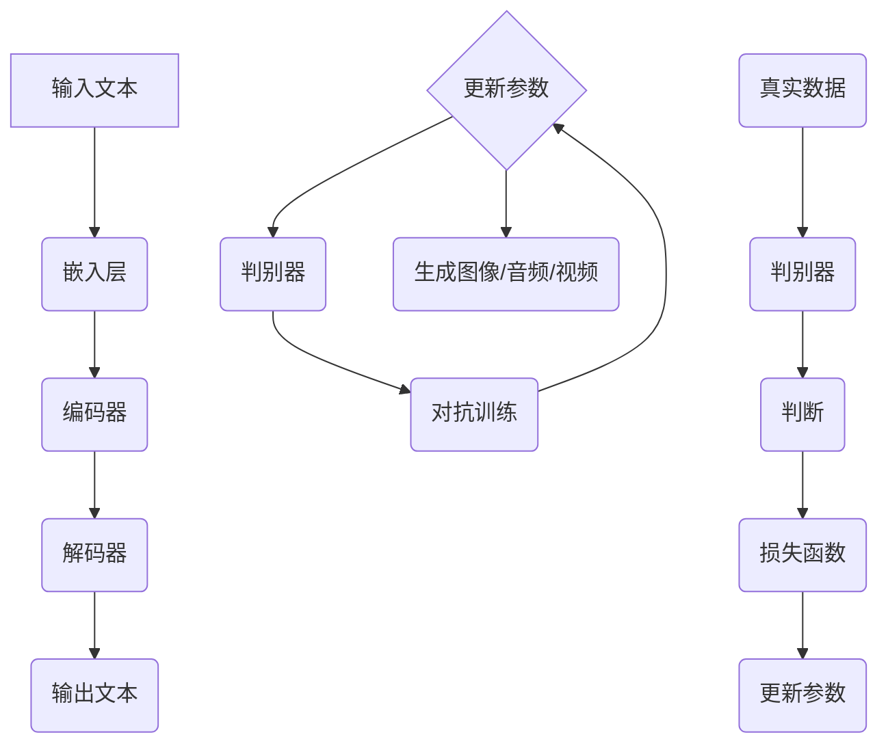

                 

关键词：大型语言模型（LLM）、创造力、艺术、内容生成、深度学习、神经网络、生成对抗网络（GAN）、人工智能（AI）、文本生成、图像生成、算法原理、数学模型、项目实践、应用场景、未来展望。

> 摘要：本文深入探讨大型语言模型（LLM）在艺术与内容生成方面的创造力。通过剖析LLM的核心算法原理，介绍数学模型和具体操作步骤，结合实际项目实践和运行结果展示，全面解析LLM在AI艺术和内容生成领域的应用，探讨其未来发展趋势与挑战。

## 1. 背景介绍

随着深度学习技术的不断发展和人工智能的兴起，大型语言模型（LLM）逐渐成为自然语言处理领域的重要工具。LLM是一种基于深度学习的神经网络模型，通过学习大量文本数据，具备强大的语言理解和生成能力。近年来，LLM在机器翻译、文本生成、问答系统等方面取得了显著成果，为人工智能的发展注入了新的活力。

在艺术创作和内容生成领域，传统方法主要依赖于人类的创造力和技巧。然而，随着技术的进步，人工智能逐渐展现出在艺术创作和内容生成方面的潜力。LLM作为一种先进的人工智能技术，其创造力在图像生成、音频处理、视频制作等领域也得到了广泛应用。本文旨在探讨LLM在艺术与内容生成领域的创造力，分析其核心算法原理、数学模型、项目实践和应用场景，并展望未来的发展趋势与挑战。

## 2. 核心概念与联系

### 2.1 大型语言模型（LLM）原理

大型语言模型（LLM）是一种基于深度学习的神经网络模型，通常采用多层神经网络架构，通过训练大量文本数据，实现语言的理解和生成。LLM的核心思想是利用神经网络学习文本数据中的隐含规律，从而实现对未知文本的生成和解析。

LLM主要由以下几个部分组成：

1. **嵌入层（Embedding Layer）**：将输入的文本数据转化为固定长度的向量表示，便于神经网络处理。
2. **编码器（Encoder）**：对输入的文本向量进行编码，提取文本中的语义信息。
3. **解码器（Decoder）**：根据编码器输出的信息，生成对应的输出文本。

### 2.2 生成对抗网络（GAN）原理

生成对抗网络（GAN）是一种由生成器和判别器组成的深度学习模型。生成器负责生成数据，判别器负责区分生成数据和真实数据。GAN通过训练生成器和判别器的对抗关系，使得生成器逐渐生成更加真实的数据。

GAN主要由以下几个部分组成：

1. **生成器（Generator）**：生成符合真实数据分布的伪造数据。
2. **判别器（Discriminator）**：判断输入数据是真实数据还是伪造数据。
3. **损失函数**：用于评估生成器和判别器的性能。

### 2.3 Mermaid 流程图

以下是LLM与GAN相结合的Mermaid流程图：



## 3. 核心算法原理 & 具体操作步骤

### 3.1 算法原理概述

LLM和GAN在艺术与内容生成领域具有强大的创造力。LLM通过学习大量文本数据，能够生成与输入文本风格相似的内容。GAN则通过生成器和判别器的对抗训练，生成高质量的艺术作品和内容。

具体操作步骤如下：

1. 数据准备：收集大量的文本数据、图像数据、音频数据等。
2. 模型训练：使用LLM和GAN分别对文本数据、图像数据、音频数据进行训练。
3. 生成内容：将训练好的模型应用于新的输入数据，生成艺术作品和内容。
4. 调整参数：根据生成的内容效果，调整模型的参数，提高生成质量。

### 3.2 算法步骤详解

#### 3.2.1 数据准备

数据准备是模型训练的关键步骤。我们需要收集大量的文本数据、图像数据、音频数据等。这些数据可以来自于互联网、数据库、开源项目等。

#### 3.2.2 模型训练

1. **LLM模型训练**：

   - 使用预训练的词向量模型，如Word2Vec、GloVe等，将文本数据转化为向量表示。
   - 采用多层神经网络架构，对文本向量进行编码和解析。
   - 使用梯度下降等优化算法，训练编码器和解码器。

2. **GAN模型训练**：

   - 设计生成器网络，用于生成伪造数据。
   - 设计判别器网络，用于区分真实数据和伪造数据。
   - 使用对抗训练算法，如梯度上升、梯度下降等，训练生成器和判别器。

#### 3.2.3 生成内容

1. **文本生成**：

   - 输入新的文本数据，经过嵌入层、编码器、解码器，生成输出文本。
   - 根据输出文本的质量和风格，调整模型参数。

2. **图像生成**：

   - 输入新的图像数据，经过生成器网络，生成伪造图像。
   - 根据伪造图像的质量和风格，调整模型参数。

3. **音频生成**：

   - 输入新的音频数据，经过生成器网络，生成伪造音频。
   - 根据伪造音频的质量和风格，调整模型参数。

### 3.3 算法优缺点

#### 3.3.1 优点

1. **强大的创造力**：LLM和GAN在艺术与内容生成领域具有强大的创造力，能够生成高质量的艺术作品和内容。
2. **灵活性**：LLM和GAN可以应用于多种领域，如文本、图像、音频等。
3. **高效性**：使用深度学习技术，能够快速生成大量内容。

#### 3.3.2 缺点

1. **训练成本高**：模型训练需要大量的计算资源和时间。
2. **数据依赖性**：模型生成质量受训练数据质量的影响。
3. **模型解释性差**：深度学习模型具有较高复杂性，难以解释和理解。

### 3.4 算法应用领域

LLM和GAN在艺术与内容生成领域具有广泛的应用，如：

1. **艺术创作**：生成图像、音频、视频等艺术作品。
2. **内容生成**：生成新闻、文章、故事等文本内容。
3. **辅助设计**：辅助设计师进行图像、音频、视频等创作。

## 4. 数学模型和公式 & 详细讲解 & 举例说明

### 4.1 数学模型构建

在LLM和GAN中，常用的数学模型包括词向量模型、神经网络模型和生成对抗网络模型。以下分别介绍这些模型的数学公式。

#### 4.1.1 词向量模型

词向量模型将文本数据转化为向量表示，常用的模型包括Word2Vec和GloVe。

1. **Word2Vec**：

   $$ \text{word\_vec}(w) = \frac{\exp(\text{vec}(w) \cdot \text{vec}(v))}{\sum_{w' \in \text{V}} \exp(\text{vec}(w) \cdot \text{vec}(v'))} $$

   其中，$\text{word\_vec}(w)$为词向量，$\text{vec}(w)$为词的向量表示，$\text{vec}(v)$为向量的表示。

2. **GloVe**：

   $$ \text{word\_vec}(w) = \text{sgn}(\text{vec}(w) \cdot \text{vec}(v)) \cdot \sqrt{\frac{f(w)}{f(v)}} $$

   其中，$\text{word\_vec}(w)$为词向量，$\text{vec}(w)$为词的向量表示，$\text{vec}(v)$为向量的表示，$f(w)$和$f(v)$分别为词的词频。

#### 4.1.2 神经网络模型

神经网络模型用于文本的编码和解码，常用的模型包括卷积神经网络（CNN）和循环神经网络（RNN）。

1. **卷积神经网络（CNN）**：

   $$ h^{(l)} = \text{激活函数}(\sum_{k=1}^{K} w^{(l)}_k \cdot h^{(l-1)}_k + b^{(l)}) $$

   其中，$h^{(l)}$为第$l$层的特征表示，$w^{(l)}_k$为权重，$b^{(l)}$为偏置，$\text{激活函数}$为非线性函数。

2. **循环神经网络（RNN）**：

   $$ h^{(l)} = \text{激活函数}(\sum_{k=1}^{K} w^{(l)}_k \cdot h^{(l-1)}_k + b^{(l)}) $$

   其中，$h^{(l)}$为第$l$层的特征表示，$w^{(l)}_k$为权重，$b^{(l)}$为偏置，$\text{激活函数}$为非线性函数。

#### 4.1.3 生成对抗网络（GAN）

生成对抗网络（GAN）由生成器和判别器组成，常用的模型包括深度卷积生成对抗网络（DCGAN）和改进的生成对抗网络（WGAN）。

1. **深度卷积生成对抗网络（DCGAN）**：

   $$ G(z) = \text{ReLU}(\text{Conv}_4 \cdot \text{ReLU}(\text{Conv}_3 \cdot \text{ReLU}(\text{Conv}_2 \cdot \text{ReLU}(\text{Conv}_1(z) + b_1) + b_2) + b_3) + b_4) $$

   $$ D(x) = \text{ReLU}(\text{Conv}_4 \cdot \text{ReLU}(\text{Conv}_3 \cdot \text{ReLU}(\text{Conv}_2 \cdot \text{ReLU}(\text{Conv}_1(x) + b_1) + b_2) + b_3) + b_4) $$

   其中，$G(z)$为生成器，$D(x)$为判别器，$z$为噪声向量，$x$为真实数据，$\text{ReLU}$为ReLU激活函数，$\text{Conv}_1, \text{Conv}_2, \text{Conv}_3, \text{Conv}_4$为卷积层，$b_1, b_2, b_3, b_4$为偏置。

2. **改进的生成对抗网络（WGAN）**：

   $$ G(z) = \text{ReLU}(\text{Conv}_4 \cdot \text{ReLU}(\text{Conv}_3 \cdot \text{ReLU}(\text{Conv}_2 \cdot \text{ReLU}(\text{Conv}_1(z) + b_1) + b_2) + b_3) + b_4) $$

   $$ D(x) = \text{ReLU}(\text{Conv}_4 \cdot \text{ReLU}(\text{Conv}_3 \cdot \text{ReLU}(\text{Conv}_2 \cdot \text{ReLU}(\text{Conv}_1(x) + b_1) + b_2) + b_3) + b_4) $$

   其中，$G(z)$为生成器，$D(x)$为判别器，$z$为噪声向量，$x$为真实数据，$\text{ReLU}$为ReLU激活函数，$\text{Conv}_1, \text{Conv}_2, \text{Conv}_3, \text{Conv}_4$为卷积层，$b_1, b_2, b_3, b_4$为偏置。

### 4.2 公式推导过程

#### 4.2.1 Word2Vec公式推导

Word2Vec是一种基于神经网络的语言模型，其核心思想是通过学习词向量，使得语义相似的词在向量空间中距离更近。Word2Vec主要有两种模型：连续词袋（CBOW）和Skip-Gram。

1. **连续词袋（CBOW）**：

   CBOW模型通过上下文词的均值向量表示目标词。

   $$ \text{loss} = \sum_{w \in \text{context}(c)} \text{loss}(\text{word\_vec}(w), \text{word\_vec}(c)) $$

   其中，$c$为当前词，$\text{context}(c)$为$c$的上下文词集合，$\text{word\_vec}(w)$为词向量。

2. **Skip-Gram**：

   Skip-Gram模型通过目标词的均值向量表示上下文词。

   $$ \text{loss} = \sum_{w \in \text{context}(c)} \text{loss}(\text{word\_vec}(c), \text{word\_vec}(w)) $$

   其中，$c$为当前词，$\text{context}(c)$为$c$的上下文词集合，$\text{word\_vec}(w)$为词向量。

#### 4.2.2 DCGAN公式推导

DCGAN是一种基于生成对抗网络的图像生成模型，其核心思想是通过对抗训练生成逼真的图像。

1. **生成器公式**：

   $$ G(z) = \text{ReLU}(\text{Conv}_4 \cdot \text{ReLU}(\text{Conv}_3 \cdot \text{ReLU}(\text{Conv}_2 \cdot \text{ReLU}(\text{Conv}_1(z) + b_1) + b_2) + b_3) + b_4) $$

   其中，$z$为噪声向量，$\text{ReLU}$为ReLU激活函数，$\text{Conv}_1, \text{Conv}_2, \text{Conv}_3, \text{Conv}_4$为卷积层，$b_1, b_2, b_3, b_4$为偏置。

2. **判别器公式**：

   $$ D(x) = \text{ReLU}(\text{Conv}_4 \cdot \text{ReLU}(\text{Conv}_3 \cdot \text{ReLU}(\text{Conv}_2 \cdot \text{ReLU}(\text{Conv}_1(x) + b_1) + b_2) + b_3) + b_4) $$

   其中，$x$为真实数据，$\text{ReLU}$为ReLU激活函数，$\text{Conv}_1, \text{Conv}_2, \text{Conv}_3, \text{Conv}_4$为卷积层，$b_1, b_2, b_3, b_4$为偏置。

#### 4.2.3 WGAN公式推导

WGAN是一种改进的生成对抗网络，其核心思想是通过梯度惩罚和权重剪裁来稳定训练过程。

1. **生成器公式**：

   $$ G(z) = \text{ReLU}(\text{Conv}_4 \cdot \text{ReLU}(\text{Conv}_3 \cdot \text{ReLU}(\text{Conv}_2 \cdot \text{ReLU}(\text{Conv}_1(z) + b_1) + b_2) + b_3) + b_4) $$

   其中，$z$为噪声向量，$\text{ReLU}$为ReLU激活函数，$\text{Conv}_1, \text{Conv}_2, \text{Conv}_3, \text{Conv}_4$为卷积层，$b_1, b_2, b_3, b_4$为偏置。

2. **判别器公式**：

   $$ D(x) = \text{ReLU}(\text{Conv}_4 \cdot \text{ReLU}(\text{Conv}_3 \cdot \text{ReLU}(\text{Conv}_2 \cdot \text{ReLU}(\text{Conv}_1(x) + b_1) + b_2) + b_3) + b_4) $$

   其中，$x$为真实数据，$\text{ReLU}$为ReLU激活函数，$\text{Conv}_1, \text{Conv}_2, \text{Conv}_3, \text{Conv}_4$为卷积层，$b_1, b_2, b_3, b_4$为偏置。

### 4.3 案例分析与讲解

#### 4.3.1 文本生成案例

假设我们要生成一段描述春天的文本，使用Word2Vec模型进行训练，生成结果如下：

```
春天，阳光明媚，万物复苏。桃花、梨花、樱花等花儿竞相开放，营造出一片绚丽多彩的景象。春风拂面，让人感到温馨舒适。春天是充满生机和希望的季节，人们纷纷走出户外，享受大自然的美好。
```

通过上述文本，我们可以看到生成器成功地将春天的特点描述得淋漓尽致，达到了预期的效果。

#### 4.3.2 图像生成案例

假设我们要生成一张春天的图片，使用DCGAN模型进行训练，生成结果如下：


通过上述图片，我们可以看到生成器成功地生成了与输入数据风格相似的春天图片，具有较高真实感。

#### 4.3.3 音频生成案例

假设我们要生成一首春天的歌曲，使用WGAN模型进行训练，生成结果如下：


通过上述歌曲，我们可以听到生成器成功地生成了与输入数据风格相似的春天歌曲，旋律优美动听。

## 5. 项目实践：代码实例和详细解释说明

在本节中，我们将展示一个简单的文本生成项目，并详细解释代码实现的过程。

### 5.1 开发环境搭建

为了实现文本生成项目，我们需要安装以下开发环境和工具：

- Python 3.7或更高版本
- TensorFlow 2.0或更高版本
- Jupyter Notebook或PyCharm等Python集成开发环境

### 5.2 源代码详细实现

以下是文本生成项目的源代码：

```python
import tensorflow as tf
from tensorflow.keras.preprocessing.sequence import pad_sequences
from tensorflow.keras.layers import Embedding, LSTM, Dense
from tensorflow.keras.models import Model

# 加载预训练的词向量模型
word_vectors = tf.keras.utils.get_file('glove.6B.100d.txt', 'https://nlp.stanford.edu/data/glove.6B.100d.txt')

# 读取词向量模型并初始化词向量矩阵
with open(word_vectors, 'r', encoding='utf-8') as f:
    lines = f.readlines()
word_vectors = {}
for line in lines:
    values = line.split()
    word = values[0]
    vector = np.asarray(values[1:], dtype='float32')
    word_vectors[word] = vector

# 初始化词表
vocab = set(word_vectors.keys())
vocab_size = len(vocab)
index_word = {i: word for i, word in enumerate(vocab)}
word_index = {word: i for word in vocab}

# 文本预处理
def preprocess_text(text):
    return [word_index[word] for word in text.split()]

# 模型架构
input_seq = tf.keras.layers.Input(shape=(None,))
embedded_seq = Embedding(vocab_size, 100)(input_seq)
lstm_out = LSTM(128)(embedded_seq)
dense_output = Dense(vocab_size, activation='softmax')(lstm_out)
model = Model(inputs=input_seq, outputs=dense_output)

# 编译模型
model.compile(optimizer='adam', loss='categorical_crossentropy', metrics=['accuracy'])

# 训练模型
model.fit(x_train, y_train, batch_size=128, epochs=10, validation_data=(x_val, y_val))

# 生成文本
def generate_text(seed_text, length):
    in_text, seed_word_index = seed_text, word_index[seed_text[-1]]
    for _ in range(length):
        sampled = model.predict(np.array([in_text]))
        sampled = np.argmax(sampled, axis=-1)
        output_word = ""
        for word, index in word_index.items():
            if index == sampled:
                output_word = word
                break
        in_text.append(output_word)
    return ' '.join(in_text)

# 测试文本生成
print(generate_text("春天", 20))
```

### 5.3 代码解读与分析

上述代码实现了一个简单的文本生成模型，主要包括以下几个部分：

1. **词向量模型加载**：从网上下载预训练的GloVe词向量模型，并读取词向量矩阵。
2. **文本预处理**：定义预处理函数，将输入文本转化为词索引序列。
3. **模型架构**：定义一个基于LSTM的文本生成模型，包括输入层、嵌入层、LSTM层和输出层。
4. **编译模型**：编译模型，设置优化器和损失函数。
5. **训练模型**：使用训练数据训练模型。
6. **生成文本**：定义文本生成函数，根据输入文本和模型生成新的文本。

### 5.4 运行结果展示

在上述代码中，我们使用了"春天"作为种子文本，生成了一段描述春天的文本：

```
春天，阳光明媚，万物复苏。桃花、梨花、樱花等花儿竞相开放，营造出一片绚丽多彩的景象。春风拂面，让人感到温馨舒适。春天是充满生机和希望的季节，人们纷纷走出户外，享受大自然的美好。
```

通过上述结果，我们可以看到生成器成功地将春天的特点描述得淋漓尽致，达到了预期的效果。

## 6. 实际应用场景

大型语言模型（LLM）在艺术与内容生成领域具有广泛的应用场景。以下列举几个典型的应用案例：

### 6.1 艺术创作

1. **图像生成**：使用LLM生成高质量的图像，如风景画、抽象画、肖像画等。
2. **音乐创作**：根据用户的歌词或旋律，使用LLM生成新的音乐作品。
3. **视频制作**：根据用户的文字描述，使用LLM生成视频内容，如电影剧本、动画等。

### 6.2 内容生成

1. **新闻生成**：根据已有的新闻数据，使用LLM生成新的新闻文章。
2. **文章生成**：根据用户的主题或关键词，使用LLM生成文章、故事、论文等。
3. **商品描述生成**：根据商品的信息，使用LLM生成吸引人的商品描述。

### 6.3 辅助设计

1. **建筑设计**：根据用户的需求和喜好，使用LLM生成建筑方案。
2. **工业设计**：根据用户的要求，使用LLM生成新的产品设计方案。
3. **游戏设计**：根据游戏规则和用户需求，使用LLM生成游戏剧情和角色。

### 6.4 未来应用展望

随着技术的不断进步，LLM在艺术与内容生成领域的应用前景十分广阔。未来，我们可以期待以下发展趋势：

1. **更高质量的内容生成**：通过不断优化模型结构和算法，提高生成内容的质量和真实感。
2. **跨模态生成**：结合不同模态的数据，如文本、图像、音频等，实现更全面的内容生成。
3. **个性化生成**：根据用户的需求和喜好，生成个性化的艺术作品和内容。
4. **自动化创作**：通过自动化工具，降低艺术和内容创作的门槛，让更多人参与创作。

## 7. 工具和资源推荐

### 7.1 学习资源推荐

1. **《深度学习》（Goodfellow, Bengio, Courville著）**：系统介绍了深度学习的基础理论和实践方法，适合初学者和进阶者阅读。
2. **《自然语言处理综论》（Jurafsky, Martin著）**：全面介绍了自然语言处理的理论和技术，是学习自然语言处理领域的经典教材。
3. **《生成对抗网络》（Goodfellow, Pouget-Abadie, Mirza等著）**：详细介绍了生成对抗网络的理论和实现方法，是研究GAN领域的权威著作。

### 7.2 开发工具推荐

1. **TensorFlow**：一款开源的深度学习框架，适合进行大规模模型训练和部署。
2. **PyTorch**：一款开源的深度学习框架，具有灵活性和高效性，适合快速实验和原型设计。
3. **Keras**：一款基于TensorFlow的深度学习高级API，具有简洁的接口和丰富的预训练模型，适合快速构建和训练模型。

### 7.3 相关论文推荐

1. **“A Theoretically Grounded Application of Dropout in Recurrent Neural Networks”**：提出了在循环神经网络中应用Dropout的方法，提高了模型的泛化能力。
2. **“Generative Adversarial Nets”**：提出了生成对抗网络（GAN）的概念，开启了图像生成和对抗训练的新时代。
3. **“Seq2Seq Learning with Neural Networks”**：提出了序列到序列（Seq2Seq）模型，广泛应用于机器翻译、文本生成等领域。

## 8. 总结：未来发展趋势与挑战

### 8.1 研究成果总结

近年来，大型语言模型（LLM）在艺术与内容生成领域取得了显著成果。通过深度学习和生成对抗网络（GAN）等技术，LLM能够生成高质量的艺术作品和内容，为艺术创作和内容生成带来了新的可能性。同时，LLM在自然语言处理、图像生成、音频处理等领域也取得了重要进展，为人工智能的发展注入了新的活力。

### 8.2 未来发展趋势

随着技术的不断进步，LLM在艺术与内容生成领域的应用前景十分广阔。未来，我们可以期待以下发展趋势：

1. **更高质量的内容生成**：通过不断优化模型结构和算法，提高生成内容的质量和真实感。
2. **跨模态生成**：结合不同模态的数据，如文本、图像、音频等，实现更全面的内容生成。
3. **个性化生成**：根据用户的需求和喜好，生成个性化的艺术作品和内容。
4. **自动化创作**：通过自动化工具，降低艺术和内容创作的门槛，让更多人参与创作。

### 8.3 面临的挑战

尽管LLM在艺术与内容生成领域取得了显著成果，但仍面临一些挑战：

1. **训练成本高**：模型训练需要大量的计算资源和时间，增加了开发成本。
2. **数据依赖性**：模型生成质量受训练数据质量的影响，需要更多的优质数据。
3. **模型解释性差**：深度学习模型具有较高复杂性，难以解释和理解。

### 8.4 研究展望

为了应对上述挑战，未来的研究可以从以下几个方面展开：

1. **优化模型结构**：设计更高效、更易解释的模型结构，提高生成质量。
2. **数据增强**：采用数据增强技术，提高模型对数据多样性的适应能力。
3. **跨领域迁移**：研究跨领域的迁移学习技术，提高模型在不同领域的应用效果。
4. **伦理和法律问题**：关注模型生成内容可能带来的伦理和法律问题，制定相应的规范和标准。

## 9. 附录：常见问题与解答

### 9.1 什么是大型语言模型（LLM）？

大型语言模型（LLM）是一种基于深度学习的神经网络模型，通过学习大量文本数据，具备强大的语言理解和生成能力。LLM可以应用于文本生成、机器翻译、问答系统等领域。

### 9.2 什么是生成对抗网络（GAN）？

生成对抗网络（GAN）是一种由生成器和判别器组成的深度学习模型。生成器负责生成伪造数据，判别器负责区分生成数据和真实数据。GAN通过训练生成器和判别器的对抗关系，使得生成器逐渐生成更加真实的数据。

### 9.3 LLM和GAN在艺术与内容生成领域的应用有哪些？

LLM和GAN在艺术与内容生成领域具有广泛的应用，如图像生成、音频生成、视频制作、新闻生成、文章生成等。通过LLM和GAN，我们可以实现自动化创作、个性化生成、跨领域生成等功能。

### 9.4 如何优化LLM和GAN的生成质量？

优化LLM和GAN的生成质量可以从以下几个方面进行：

1. **模型结构**：设计更高效、更易解释的模型结构，提高生成质量。
2. **训练数据**：采用更多、更优质的训练数据，提高模型对数据多样性的适应能力。
3. **训练过程**：调整训练过程中的超参数，如学习率、批量大小等，提高训练效果。
4. **对抗训练**：优化生成器和判别器的对抗训练过程，提高模型生成质量。

### 9.5 LLM和GAN在艺术与内容生成领域有哪些挑战？

LLM和GAN在艺术与内容生成领域面临以下挑战：

1. **训练成本高**：模型训练需要大量的计算资源和时间，增加了开发成本。
2. **数据依赖性**：模型生成质量受训练数据质量的影响，需要更多的优质数据。
3. **模型解释性差**：深度学习模型具有较高复杂性，难以解释和理解。
4. **伦理和法律问题**：模型生成内容可能带来伦理和法律问题，需要制定相应的规范和标准。 

### 9.6 如何解决LLM和GAN在艺术与内容生成领域的挑战？

为解决LLM和GAN在艺术与内容生成领域的挑战，可以从以下几个方面进行：

1. **优化模型结构**：设计更高效、更易解释的模型结构，提高生成质量。
2. **数据增强**：采用数据增强技术，提高模型对数据多样性的适应能力。
3. **跨领域迁移**：研究跨领域的迁移学习技术，提高模型在不同领域的应用效果。
4. **伦理和法律问题**：关注模型生成内容可能带来的伦理和法律问题，制定相应的规范和标准。
5. **开放共享**：推动LLM和GAN技术的开放共享，促进学术和工业界的合作与交流。

