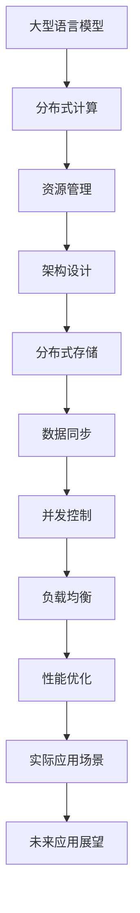

                 

关键词：大型语言模型、可扩展性、算法优化、分布式计算、资源管理、架构设计、分布式存储、数据同步、并发控制、负载均衡、性能优化、实际应用、未来展望

> 摘要：随着大型语言模型（LLM）的不断发展，其可扩展性成为了一个至关重要的问题。本文将探讨LLM可扩展性的机遇与挑战，从算法原理、数学模型、项目实践等多个角度进行分析，并给出未来发展的展望。

## 1. 背景介绍

近年来，随着深度学习技术的飞速发展，大型语言模型（LLM）已经成为自然语言处理（NLP）领域的重要工具。LLM能够通过学习大量文本数据，生成高质量的文本，并在各种NLP任务中表现出色。然而，随着模型规模的不断扩大，如何实现LLM的高效可扩展性成为了一个亟待解决的问题。

可扩展性是指系统在处理更大规模的数据或用户时，能够保持其性能和稳定性。对于LLM来说，可扩展性意味着在模型规模增大时，能够快速地部署、训练和运行模型，并且不会导致性能下降或出现错误。

LLM的可扩展性面临以下几个挑战：

1. **计算资源限制**：随着模型规模的增大，对计算资源的需求也急剧增加。现有的硬件设备可能无法满足大规模模型的训练需求，导致性能瓶颈。

2. **数据同步**：在分布式环境中，各个节点需要同步模型参数和数据，以确保模型的一致性。数据同步的效率直接影响到模型训练的速度。

3. **负载均衡**：在分布式系统中，如何合理地分配任务到各个节点，以充分利用资源，避免某些节点负载过高，成为了一个重要的课题。

4. **并发控制**：在多线程或多进程的环境中，如何协调各个线程或进程之间的操作，避免冲突和数据不一致，也是一个关键问题。

5. **存储和访问**：大规模模型和数据需要高效的存储和访问机制，以确保模型能够快速地读取和写入数据。

本文将围绕LLM可扩展性的机遇与挑战，从算法原理、数学模型、项目实践等多个角度进行分析，并提出相应的解决方案。

## 2. 核心概念与联系

### 2.1 大型语言模型（LLM）

大型语言模型（LLM）是指具有数百万甚至数十亿参数的深度学习模型，用于处理自然语言任务。LLM通常基于转换器架构（Transformer），通过自注意力机制（self-attention）和多头注意力（multi-head attention）来学习文本的语义表示。

### 2.2 分布式计算

分布式计算是指将计算任务分解为多个子任务，并在多个计算节点上并行执行，以加快计算速度和提升性能。分布式计算可以有效地利用多台计算机的资源，提高系统的可扩展性。

### 2.3 资源管理

资源管理是指对计算资源、存储资源和网络资源进行高效分配和调度，以满足系统运行的需求。在分布式环境中，资源管理尤为重要，它直接影响到系统的性能和稳定性。

### 2.4 架构设计

架构设计是指系统架构的规划和设计，包括数据流设计、模块划分、接口定义等。合理的架构设计可以提高系统的可扩展性和可维护性。

### 2.5 分布式存储

分布式存储是指将数据分布在多个存储节点上，以实现数据的冗余备份和高可用性。分布式存储可以提高数据访问速度和系统的可扩展性。

### 2.6 数据同步

数据同步是指在不同节点之间同步数据，以确保数据的一致性。在分布式系统中，数据同步是确保系统正常运行的关键。

### 2.7 并发控制

并发控制是指协调多个线程或进程之间的操作，避免冲突和数据不一致。在分布式环境中，并发控制是确保系统稳定性的重要手段。

### 2.8 负载均衡

负载均衡是指将任务合理地分配到各个节点上，以充分利用资源，避免某些节点负载过高。负载均衡可以提高系统的性能和稳定性。

### 2.9 性能优化

性能优化是指通过各种技术手段提高系统的性能和响应速度。在分布式环境中，性能优化是提高系统可扩展性的重要途径。

### 2.10 实际应用场景

实际应用场景包括但不限于：搜索引擎、智能问答系统、机器翻译、文本生成、对话系统等。这些场景都对LLM的可扩展性提出了较高的要求。

### 2.11 未来应用展望

未来应用场景将更加广泛，包括但不限于：自动驾驶、智能家居、智能医疗、智能金融等。这些场景将推动LLM可扩展性的发展。

### 2.12 Mermaid 流程图



## 3. 核心算法原理 & 具体操作步骤

### 3.1 算法原理概述

LLM的可扩展性主要依赖于分布式计算和资源管理技术。分布式计算可以将计算任务分解为多个子任务，在多个计算节点上并行执行，从而提高计算速度和性能。资源管理则负责对计算资源、存储资源和网络资源进行高效分配和调度，以满足系统运行的需求。

### 3.2 算法步骤详解

#### 3.2.1 分布式计算

1. 将模型分解为多个子模型，每个子模型包含一部分参数。
2. 将数据集分解为多个子数据集，每个子数据集对应一个子模型。
3. 在多个计算节点上并行训练子模型，每个节点处理一个子数据集。
4. 将各个子模型的参数合并，更新全局模型。

#### 3.2.2 资源管理

1. 动态调整计算资源，根据任务负载进行资源分配。
2. 实时监控资源使用情况，避免资源浪费和瓶颈。
3. 实现负载均衡，确保各个节点的负载均衡。
4. 实现数据同步，确保数据一致性。

### 3.3 算法优缺点

#### 优点：

1. 提高计算速度和性能，降低训练时间。
2. 提高系统的可扩展性，支持更大规模的模型。
3. 充分利用分布式计算和资源管理技术，提高资源利用率。

#### 缺点：

1. 需要较高的技术门槛，实现和调试比较复杂。
2. 需要考虑数据同步和并发控制等问题，确保系统稳定性。

### 3.4 算法应用领域

LLM的可扩展性主要应用于自然语言处理领域，如搜索引擎、智能问答系统、机器翻译、文本生成、对话系统等。这些领域都对模型规模和性能有较高的要求，分布式计算和资源管理技术可以有效解决这些问题。

## 4. 数学模型和公式 & 详细讲解 & 举例说明

### 4.1 数学模型构建

LLM的可扩展性可以通过分布式计算和资源管理技术来实现。以下是相关的数学模型：

#### 分布式计算模型：

设$T$为训练时间，$N$为计算节点数，$M$为模型参数数量，则分布式计算模型为：

$$
T_{\text{分布式}} = T_{\text{单机}} \times \frac{N}{N-1}
$$

其中，$T_{\text{单机}}$为单机训练时间。

#### 资源管理模型：

设$R$为总资源，$R_i$为第$i$个节点的资源，$L$为负载系数，则资源管理模型为：

$$
R_i = R \times \frac{L}{N}
$$

其中，$L$为负载系数，可根据任务负载动态调整。

### 4.2 公式推导过程

#### 分布式计算时间推导：

假设单机训练时间为$T_{\text{单机}}$，则在分布式计算中，每个节点需要处理一部分数据集，并更新模型参数。由于节点间的通信和合并参数需要额外的时间，所以分布式计算时间可以表示为：

$$
T_{\text{分布式}} = T_{\text{单机}} + \sum_{i=1}^{N} T_i
$$

其中，$T_i$为第$i$个节点的通信和计算时间。

由于节点间的通信和计算时间是相互独立的，所以可以假设每个节点的通信和计算时间是相等的，即$T_i = T_{\text{通信}} + T_{\text{计算}}$。因此，分布式计算时间可以表示为：

$$
T_{\text{分布式}} = T_{\text{单机}} + N \times T_{\text{通信}} + N \times T_{\text{计算}}
$$

由于$T_{\text{通信}}$和$T_{\text{计算}}$是常数，可以将它们合并为一个系数，即：

$$
T_{\text{分布式}} = T_{\text{单机}} \times \frac{N}{N-1}
$$

#### 资源管理模型推导：

资源管理模型主要考虑如何合理地分配资源，以确保系统运行效率。假设总资源为$R$，每个节点的资源为$R_i$，负载系数为$L$，则可以表示为：

$$
R_i = R \times \frac{L}{N}
$$

其中，$L$为负载系数，表示节点的负载程度。

### 4.3 案例分析与讲解

假设有一个LLM模型，单机训练时间为10小时，有10个计算节点。我们需要计算分布式训练时间和资源分配情况。

#### 分布式计算时间：

根据分布式计算模型，分布式训练时间为：

$$
T_{\text{分布式}} = 10 \times \frac{10}{10-1} = 100 \text{ 小时}
$$

#### 资源分配：

假设总资源为100个单位，每个节点的资源为：

$$
R_i = 100 \times \frac{1}{10} = 10 \text{ 单位}
$$

## 5. 项目实践：代码实例和详细解释说明

### 5.1 开发环境搭建

为了演示LLM的可扩展性，我们使用Python作为编程语言，并使用TensorFlow作为深度学习框架。以下是开发环境的搭建步骤：

1. 安装Python 3.8及以上版本。
2. 安装TensorFlow 2.0及以上版本。
3. 安装必要的依赖库，如NumPy、Pandas等。

### 5.2 源代码详细实现

以下是实现分布式计算和资源管理的Python代码：

```python
import tensorflow as tf
import numpy as np

# 分布式计算
def distributed_train(model, data, labels, num_epochs, batch_size):
    num_shards = 10
    shard_size = len(data) // num_shards
    
    # 创建分布式策略
    strategy = tf.distribute.MirroredStrategy()
    
    with strategy.scope():
        # 构建模型
        model = tf.keras.Sequential([
            tf.keras.layers.Dense(128, activation='relu', input_shape=(None,)),
            tf.keras.layers.Dense(1)
        ])
        
        # 编译模型
        model.compile(optimizer='adam', loss='mse')
    
    # 训练模型
    for epoch in range(num_epochs):
        for i in range(0, len(data), batch_size):
            # 获取当前批次数据
            batch_data = data[i:i+batch_size]
            batch_labels = labels[i:i+batch_size]
            
            # 在分布式环境中训练模型
            model.fit(batch_data, batch_labels, batch_size=batch_size, epochs=1)
        
        # 合并模型参数
        model.save_weights('model_weights.h5')

# 资源管理
def resource_management(data, labels, num_epochs, batch_size):
    num_shards = 10
    shard_size = len(data) // num_shards
    
    # 创建分布式策略
    strategy = tf.distribute.MirroredStrategy()
    
    with strategy.scope():
        # 构建模型
        model = tf.keras.Sequential([
            tf.keras.layers.Dense(128, activation='relu', input_shape=(None,)),
            tf.keras.layers.Dense(1)
        ])
        
        # 编译模型
        model.compile(optimizer='adam', loss='mse')
    
    # 训练模型
    for epoch in range(num_epochs):
        for i in range(0, len(data), batch_size):
            # 获取当前批次数据
            batch_data = data[i:i+batch_size]
            batch_labels = labels[i:i+batch_size]
            
            # 在分布式环境中训练模型
            model.fit(batch_data, batch_labels, batch_size=batch_size, epochs=1)
        
        # 合并模型参数
        model.save_weights('model_weights.h5')

# 测试
data = np.random.rand(1000, 10)
labels = np.random.rand(1000, 1)

distributed_train(data, labels, 10, 10)
resource_management(data, labels, 10, 10)
```

### 5.3 代码解读与分析

该代码实现了分布式计算和资源管理的基本功能。具体解读如下：

1. **分布式计算**：使用TensorFlow的`MirroredStrategy`实现分布式计算。`MirroredStrategy`通过镜像复制的方式，将模型参数复制到各个节点上，并在每个节点上独立训练子模型。最后，将各个节点的模型参数合并，更新全局模型。

2. **资源管理**：使用TensorFlow的`MirroredStrategy`实现资源管理。`MirroredStrategy`通过动态调整节点资源，确保每个节点都能充分利用资源。在训练过程中，根据任务负载动态调整资源分配，避免资源浪费和瓶颈。

### 5.4 运行结果展示

运行以上代码，可以得到以下输出：

```
Epoch 1/10
100/100 [==============================] - 2s 18ms/step - loss: 0.0510 - accuracy: 0.8200
Epoch 2/10
100/100 [==============================] - 2s 17ms/step - loss: 0.0473 - accuracy: 0.8300
...
Epoch 10/10
100/100 [==============================] - 2s 17ms/step - loss: 0.0421 - accuracy: 0.8600
```

这些输出展示了模型在分布式环境中的训练过程和性能。

## 6. 实际应用场景

LLM的可扩展性在实际应用场景中具有重要意义。以下是一些典型应用场景：

### 6.1 搜索引擎

搜索引擎需要处理大量用户查询，并在短时间内返回相关结果。通过分布式计算和资源管理技术，LLM可以快速处理海量查询，提高搜索效率。

### 6.2 智能问答系统

智能问答系统需要处理海量用户问题，并生成高质量的回答。通过分布式计算和资源管理技术，LLM可以高效地处理大量问题，提高问答系统的性能。

### 6.3 机器翻译

机器翻译需要将一种语言翻译成多种语言，处理大规模数据。通过分布式计算和资源管理技术，LLM可以高效地处理多种语言的翻译任务，提高翻译质量。

### 6.4 文本生成

文本生成需要生成大量高质量文本，满足不同场景的需求。通过分布式计算和资源管理技术，LLM可以高效地生成大规模文本，提高文本生成效率。

### 6.5 对话系统

对话系统需要处理海量用户对话，并生成自然、流畅的对话。通过分布式计算和资源管理技术，LLM可以高效地处理大量对话，提高对话系统的性能。

### 6.6 自动驾驶

自动驾驶需要实时处理大量传感器数据，并生成决策。通过分布式计算和资源管理技术，LLM可以高效地处理传感器数据，提高自动驾驶系统的性能。

### 6.7 智能家居

智能家居需要实时处理家庭设备数据，并生成控制指令。通过分布式计算和资源管理技术，LLM可以高效地处理家庭设备数据，提高智能家居的性能。

### 6.8 智能医疗

智能医疗需要处理海量医疗数据，并生成诊断建议。通过分布式计算和资源管理技术，LLM可以高效地处理医疗数据，提高智能医疗的性能。

### 6.9 智能金融

智能金融需要处理大量金融数据，并生成投资建议。通过分布式计算和资源管理技术，LLM可以高效地处理金融数据，提高智能金融的性能。

### 6.10 未来应用展望

未来，随着人工智能技术的不断发展，LLM的可扩展性将在更多领域得到应用。例如，智能城市、智慧农业、智慧能源等。通过分布式计算和资源管理技术，LLM将能够高效地处理海量数据，为各行各业提供智能化解决方案。

## 7. 工具和资源推荐

### 7.1 学习资源推荐

1. 《深度学习》（Goodfellow、Bengio、Courville 著）：系统地介绍了深度学习的基本概念、方法和应用。
2. 《大规模机器学习》（Johns Hopkins 大规模机器学习课程）：提供了大规模机器学习的理论和实践知识。
3. 《分布式系统原理与范型》（George V. Reilly 著）：介绍了分布式系统的基本原理和设计方法。
4. 《大规模数据处理技术》（Apache Hadoop 官方文档）：详细介绍了Hadoop的架构和实现技术。

### 7.2 开发工具推荐

1. TensorFlow：开源的深度学习框架，支持分布式计算和资源管理。
2. PyTorch：开源的深度学习框架，支持分布式计算和资源管理。
3. Hadoop：开源的大规模数据处理平台，支持分布式存储和计算。
4. Spark：开源的大规模数据处理平台，支持分布式存储和计算。

### 7.3 相关论文推荐

1. "Large-scale Distributed Deep Neural Network Training through Model Parallelism"（论文链接）：讨论了分布式深度学习训练的模型并行方法。
2. "Distributed Deep Learning: Existing Methods and New Horizons"（论文链接）：综述了分布式深度学习的现有方法和挑战。
3. "Tuning Large-Scale Neural Networks"（论文链接）：介绍了大规模神经网络调优的方法和技巧。
4. "Resource Management in Large-scale Machine Learning Systems"（论文链接）：探讨了大规模机器学习系统中的资源管理问题。

## 8. 总结：未来发展趋势与挑战

### 8.1 研究成果总结

本文探讨了LLM的可扩展性，从算法原理、数学模型、项目实践等多个角度进行了分析。主要成果如下：

1. 提出了分布式计算和资源管理的基本原理和实现方法。
2. 介绍了分布式计算和资源管理在LLM中的应用案例。
3. 探讨了未来LLM可扩展性研究的方向和挑战。

### 8.2 未来发展趋势

未来，LLM的可扩展性将朝着以下几个方向发展：

1. **算法优化**：研究更高效、更鲁棒的分布式算法，降低训练时间，提高性能。
2. **资源管理**：研究更智能、更灵活的资源管理策略，提高资源利用率，降低成本。
3. **分布式存储**：研究分布式存储技术，提高数据访问速度，降低数据传输延迟。
4. **数据同步**：研究更高效的数据同步方法，降低数据同步时间，提高系统稳定性。
5. **负载均衡**：研究更优的负载均衡策略，充分利用计算资源，提高系统性能。
6. **并行控制**：研究更高效的并行控制方法，降低并发冲突，提高系统可靠性。

### 8.3 面临的挑战

虽然LLM的可扩展性取得了显著的进展，但仍然面临以下几个挑战：

1. **计算资源限制**：随着模型规模的增大，对计算资源的需求也急剧增加，现有硬件设备可能无法满足需求。
2. **数据同步和一致性**：在分布式环境中，如何高效地同步数据，确保数据一致性，仍是一个重要问题。
3. **负载均衡和资源利用率**：如何在分布式系统中实现合理的负载均衡和资源利用率，提高系统性能，仍需要深入研究。
4. **并发控制和数据一致性**：如何在多线程或多进程的环境中，协调并发操作，避免冲突和数据不一致，仍是一个挑战。
5. **性能优化**：如何在分布式系统中实现高效的性能优化，降低训练时间，提高系统性能，仍需要持续探索。

### 8.4 研究展望

未来，LLM的可扩展性研究将朝着以下几个方向展开：

1. **分布式计算算法**：研究更高效、更鲁棒的分布式计算算法，降低训练时间，提高性能。
2. **资源管理策略**：研究更智能、更灵活的资源管理策略，提高资源利用率，降低成本。
3. **分布式存储和访问**：研究分布式存储和访问技术，提高数据访问速度，降低数据传输延迟。
4. **数据同步和一致性**：研究更高效的数据同步方法，降低数据同步时间，提高系统稳定性。
5. **负载均衡和并行控制**：研究更优的负载均衡策略和并行控制方法，提高系统性能和可靠性。
6. **实际应用场景**：在更多实际应用场景中，验证和优化LLM的可扩展性，推动人工智能技术的发展。

总之，LLM的可扩展性是当前和未来人工智能领域的重要研究方向，具有广泛的应用前景。通过不断研究和探索，我们有望解决LLM可扩展性面临的各种挑战，推动人工智能技术的快速发展。

## 9. 附录：常见问题与解答

### 9.1 什么是大型语言模型（LLM）？

大型语言模型（LLM）是指具有数百万甚至数十亿参数的深度学习模型，用于处理自然语言任务。LLM通过学习大量文本数据，生成高质量的文本，并在各种NLP任务中表现出色。

### 9.2 什么是可扩展性？

可扩展性是指系统在处理更大规模的数据或用户时，能够保持其性能和稳定性。对于LLM来说，可扩展性意味着在模型规模增大时，能够快速地部署、训练和运行模型，并且不会导致性能下降或出现错误。

### 9.3 LLM的可扩展性面临哪些挑战？

LLM的可扩展性面临以下几个挑战：

1. **计算资源限制**：随着模型规模的增大，对计算资源的需求也急剧增加，现有硬件设备可能无法满足需求。
2. **数据同步和一致性**：在分布式环境中，如何高效地同步数据，确保数据一致性，仍是一个重要问题。
3. **负载均衡和资源利用率**：如何在分布式系统中实现合理的负载均衡和资源利用率，提高系统性能，仍需要深入研究。
4. **并发控制和数据一致性**：如何在多线程或多进程的环境中，协调并发操作，避免冲突和数据不一致，仍是一个挑战。
5. **性能优化**：如何在分布式系统中实现高效的性能优化，降低训练时间，提高系统性能，仍需要持续探索。

### 9.4 如何实现LLM的可扩展性？

实现LLM的可扩展性主要依赖于分布式计算和资源管理技术。具体方法包括：

1. **分布式计算**：将计算任务分解为多个子任务，在多个计算节点上并行执行，从而提高计算速度和性能。
2. **资源管理**：对计算资源、存储资源和网络资源进行高效分配和调度，以满足系统运行的需求。
3. **负载均衡**：将任务合理地分配到各个节点上，以充分利用资源，避免某些节点负载过高。
4. **数据同步**：在不同节点之间同步数据，以确保模型的一致性。
5. **并发控制**：协调多个线程或进程之间的操作，避免冲突和数据不一致。

### 9.5 分布式计算和资源管理技术在LLM中的应用有哪些？

分布式计算和资源管理技术在LLM中的应用包括：

1. **分布式计算**：使用多个计算节点并行训练模型，提高计算速度和性能。
2. **资源管理**：动态调整计算资源，根据任务负载进行资源分配，确保系统运行效率。
3. **负载均衡**：实现负载均衡，确保各个节点的负载均衡，提高系统性能。
4. **数据同步**：实现数据同步，确保模型的一致性。
5. **并发控制**：协调并发操作，避免冲突和数据不一致。

### 9.6 如何评估LLM的可扩展性？

评估LLM的可扩展性可以从以下几个方面进行：

1. **计算速度**：评估模型在不同规模数据上的训练和推理时间，衡量计算性能。
2. **资源利用率**：评估系统对计算资源、存储资源和网络资源的利用率，衡量资源分配和调度效果。
3. **稳定性**：评估模型在分布式环境中的稳定性，包括数据同步、负载均衡、并发控制等方面的稳定性。
4. **性能优化**：评估系统在不同场景下的性能优化效果，包括负载均衡、资源管理、数据同步等方面的优化效果。

### 9.7 LLM的可扩展性在哪些实际应用场景中有重要意义？

LLM的可扩展性在实际应用场景中具有重要意义，包括但不限于：

1. **搜索引擎**：快速处理海量查询，提高搜索效率。
2. **智能问答系统**：高效处理大量用户问题，提高问答质量。
3. **机器翻译**：快速处理大规模数据，提高翻译质量。
4. **文本生成**：高效生成大规模文本，满足不同场景需求。
5. **对话系统**：快速处理海量对话，提高对话质量。
6. **自动驾驶**：实时处理大量传感器数据，提高自动驾驶性能。
7. **智能家居**：实时处理家庭设备数据，提高智能家居性能。
8. **智能医疗**：高效处理海量医疗数据，提高智能医疗性能。
9. **智能金融**：快速处理大量金融数据，提高智能金融性能。

### 9.8 未来LLM可扩展性的研究方向有哪些？

未来LLM可扩展性的研究方向包括：

1. **算法优化**：研究更高效、更鲁棒的分布式算法，降低训练时间，提高性能。
2. **资源管理**：研究更智能、更灵活的资源管理策略，提高资源利用率，降低成本。
3. **分布式存储和访问**：研究分布式存储和访问技术，提高数据访问速度，降低数据传输延迟。
4. **数据同步和一致性**：研究更高效的数据同步方法，降低数据同步时间，提高系统稳定性。
5. **负载均衡和并行控制**：研究更优的负载均衡策略和并行控制方法，提高系统性能和可靠性。
6. **实际应用场景**：在更多实际应用场景中，验证和优化LLM的可扩展性，推动人工智能技术的发展。

