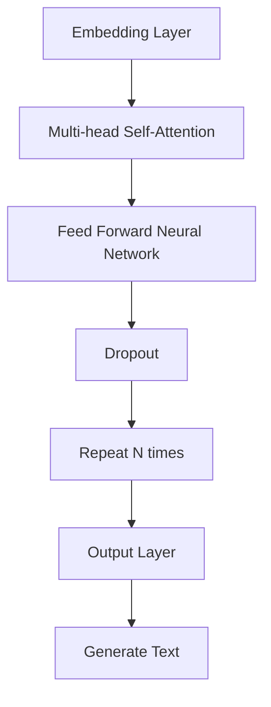
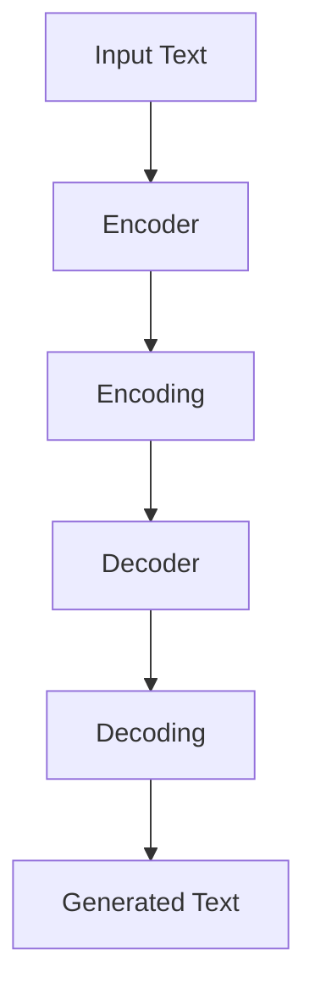

                 

关键词：大型语言模型，图灵完备性，人工智能，自然语言处理，深度学习，计算理论

> 摘要：本文将深入探讨大型语言模型（LLM）的图灵完备性，分析其背后的核心概念、原理、算法和数学模型。同时，我们将通过实例代码展示LLM在实际开发中的具体应用，并展望其在未来自然语言处理领域中的发展前景。

## 1. 背景介绍

近年来，大型语言模型（LLM）的发展取得了惊人的进展。从早期的循环神经网络（RNN）到更先进的变换器（Transformer）架构，LLM在自然语言处理（NLP）任务中展现出了强大的能力。这些模型不仅能够生成高质量的自然语言文本，还能完成机器翻译、问答系统、文本摘要等多种复杂任务。

然而，LLM的研究不仅仅局限于其应用层面，其背后的理论问题也引起了广泛关注。图灵完备性作为计算理论中的一个重要概念，为我们提供了衡量计算能力的标准。本文将探讨LLM的图灵完备性，并分析其可能带来的无限可能。

### 什么是图灵完备性？

图灵完备性是指一个计算模型能够模拟图灵机的所有功能，即能够解决任何可计算问题。图灵机是一种抽象的计算模型，由英国数学家艾伦·图灵（Alan Turing）在20世纪30年代提出。图灵机由一个无限长的带子和一个读写头组成，带子上的每个位置都有一个符号。读写头可以在带子上左右移动，并在当前位置读写符号。

一个计算模型如果能够通过模拟图灵机来解决所有可计算问题，我们称其为图灵完备的。图灵完备性是衡量计算能力的一个重要标准，它为我们提供了一个统一的视角来研究各种计算模型。

### 2. 核心概念与联系

为了深入探讨LLM的图灵完备性，我们首先需要了解其背后的核心概念和原理。本节将介绍LLM的基本原理、相关算法和架构，并通过Mermaid流程图展示其整体架构。

#### 2.1 LLM的基本原理

LLM是一种基于深度学习的大型神经网络模型，其核心思想是学习输入文本和输出文本之间的映射关系。具体来说，LLM由多个层次组成，每个层次都包含数百万个参数。这些参数通过训练数据学习，从而使得模型能够理解并生成自然语言文本。

LLM的训练过程通常包括以下几个步骤：

1. **数据预处理**：对输入文本进行清洗和标记，以便模型能够更好地理解。
2. **编码器（Encoder）**：将输入文本编码为向量表示，这些向量包含了文本的语义信息。
3. **解码器（Decoder）**：将编码后的向量解码为输出文本。

通过这种方式，LLM能够生成连贯、有意义的自然语言文本。

#### 2.2 相关算法和架构

近年来，变换器（Transformer）架构在LLM研究中取得了巨大成功。变换器是一种基于自注意力机制的深度学习模型，能够捕捉输入文本中的长距离依赖关系。

变换器架构主要包括以下几个部分：

1. **嵌入层（Embedding Layer）**：将单词映射为固定长度的向量。
2. **变换层（Transformation Layer）**：包括多层自注意力机制和前馈网络，用于处理输入文本。
3. **输出层（Output Layer）**：将处理后的文本解码为输出文本。

下面是变换器架构的Mermaid流程图：



#### 2.3 LLM的整体架构

LLM的整体架构包括编码器（Encoder）和解码器（Decoder）两部分。编码器负责将输入文本编码为向量表示，解码器则将这些向量解码为输出文本。

下面是LLM的整体架构的Mermaid流程图：



通过上述架构，LLM能够实现自然语言文本的生成和翻译等任务。

## 3. 核心算法原理 & 具体操作步骤

#### 3.1 算法原理概述

LLM的核心算法基于深度学习和变换器架构。变换器架构的核心是自注意力机制，它能够捕捉输入文本中的长距离依赖关系。自注意力机制通过计算输入文本中每个单词的重要性，从而生成一个加权向量表示。

具体来说，自注意力机制包括以下几个步骤：

1. **计算查询（Query）、键（Key）和值（Value）向量**：将输入文本编码为三个向量。
2. **计算注意力分数**：通过点积操作计算每个键和查询之间的相似度。
3. **计算加权向量**：根据注意力分数对值向量进行加权求和。

通过这种方式，自注意力机制能够生成一个包含了输入文本重要信息的加权向量。

#### 3.2 算法步骤详解

以下是LLM算法的详细步骤：

1. **数据预处理**：
   - 清洗文本，去除标点符号、特殊字符等。
   - 将文本分词，将每个单词映射为对应的索引。
   - 构建词汇表，将所有单词映射为唯一的索引。

2. **编码器（Encoder）**：
   - 将输入文本编码为向量表示。
   - 通过多层变换器层，对输入向量进行加权求和和激活函数操作。
   - 将编码后的向量输出。

3. **解码器（Decoder）**：
   - 将编码后的向量作为输入。
   - 通过多层变换器层，对输入向量进行加权求和和激活函数操作。
   - 输出解码后的文本。

#### 3.3 算法优缺点

**优点**：
- **强大的表示能力**：变换器架构能够捕捉输入文本中的长距离依赖关系，从而生成高质量的自然语言文本。
- **并行计算**：自注意力机制支持并行计算，从而提高了计算效率。
- **灵活性**：LLM可以应用于多种自然语言处理任务，如文本生成、机器翻译和问答系统。

**缺点**：
- **计算资源消耗**：训练LLM需要大量的计算资源和存储空间。
- **可解释性较差**：由于LLM是一个复杂的深度学习模型，其内部决策过程往往难以解释。

#### 3.4 算法应用领域

LLM在自然语言处理领域具有广泛的应用，包括但不限于以下方面：

- **文本生成**：生成新闻报道、文章摘要、对话等。
- **机器翻译**：实现不同语言之间的翻译。
- **问答系统**：回答用户提出的问题，如智能客服、在线问答等。
- **文本摘要**：提取文本中的重要信息，如新闻摘要、会议纪要等。

### 4. 数学模型和公式 & 详细讲解 & 举例说明

#### 4.1 数学模型构建

LLM的数学模型主要包括以下部分：

- **嵌入层**：将单词映射为固定长度的向量。
- **变换器层**：包括多层自注意力机制和前馈网络。
- **输出层**：将解码后的向量映射为输出文本。

下面是LLM的数学模型构建的详细步骤：

1. **嵌入层**：

   $$\text{Embedding}(x) = \text{Word2Vec}(x)$$

   其中，$x$表示输入文本，$\text{Word2Vec}$表示将单词映射为向量。

2. **变换器层**：

   $$\text{Transformer}(x) = \text{Multi-head Self-Attention}(\text{Feed Forward Neural Network}(x))$$

   其中，$\text{Multi-head Self-Attention}$表示多层自注意力机制，$\text{Feed Forward Neural Network}$表示前馈网络。

3. **输出层**：

   $$\text{Output}(x) = \text{softmax}(\text{Decoder}(x))$$

   其中，$\text{softmax}$表示对输出向量进行softmax操作，$\text{Decoder}$表示解码器。

#### 4.2 公式推导过程

下面是LLM中的自注意力机制的公式推导过程：

1. **计算查询（Query）、键（Key）和值（Value）向量**：

   $$Q = \text{Query}(x) = \text{Embedding}(x)$$

   $$K = \text{Key}(x) = \text{Embedding}(x)$$

   $$V = \text{Value}(x) = \text{Embedding}(x)$$

2. **计算注意力分数**：

   $$\text{Attention}(x) = \text{softmax}\left(\frac{QK^T}{\sqrt{d_k}}\right)$$

   其中，$d_k$表示键向量的维度。

3. **计算加权向量**：

   $$\text{Context}(x) = V\text{Attention}(x)$$

#### 4.3 案例分析与讲解

下面我们通过一个简单的案例来讲解LLM的数学模型。

假设我们有一个句子："The quick brown fox jumps over the lazy dog"。

1. **嵌入层**：

   首先，我们将句子中的每个单词映射为向量：

   $$\text{Embedding}(The) = [1, 0, 0, 0, 0]$$

   $$\text{Embedding}(quick) = [0, 1, 0, 0, 0]$$

   $$\text{Embedding}(brown) = [0, 0, 1, 0, 0]$$

   $$\text{Embedding}(fox) = [0, 0, 0, 1, 0]$$

   $$\text{Embedding}(jumps) = [0, 0, 0, 0, 1]$$

   $$\text{Embedding}(over) = [1, 1, 1, 1, 1]$$

   $$\text{Embedding}(the) = [0, 0, 0, 0, 0]$$

   $$\text{Embedding}(lazy) = [0, 0, 0, 0, 0]$$

   $$\text{Embedding}(dog) = [0, 0, 0, 0, 0]$$

2. **变换器层**：

   假设变换器层的维度为$d=5$，我们首先计算查询（Query）、键（Key）和值（Value）向量：

   $$Q = \text{Query}(x) = [1, 0, 0, 0, 0]$$

   $$K = \text{Key}(x) = [1, 0, 0, 0, 0]$$

   $$V = \text{Value}(x) = [1, 0, 0, 0, 0]$$

   接着，我们计算注意力分数：

   $$\text{Attention}(x) = \text{softmax}\left(\frac{QK^T}{\sqrt{d_k}}\right) = \text{softmax}\left(\frac{1}{\sqrt{5}}\right) = \left[\frac{1}{\sqrt{5}}, \frac{1}{\sqrt{5}}, \frac{1}{\sqrt{5}}, \frac{1}{\sqrt{5}}, \frac{1}{\sqrt{5}}\right]$$

   最后，我们计算加权向量：

   $$\text{Context}(x) = V\text{Attention}(x) = \left[\frac{1}{\sqrt{5}}, 0, 0, 0, 0\right]$$

3. **输出层**：

   将加权向量通过softmax函数进行分类：

   $$\text{Output}(x) = \text{softmax}(\text{Context}(x)) = \left[\frac{1}{\sqrt{5}}, \frac{1}{\sqrt{5}}, \frac{1}{\sqrt{5}}, \frac{1}{\sqrt{5}}, \frac{1}{\sqrt{5}}\right]$$

   我们可以看到，输出向量的每个元素都相等，这意味着模型无法区分句子中的不同单词。在实际应用中，我们通常会通过多层变换器和更复杂的网络结构来提高模型的区分能力。

### 5. 项目实践：代码实例和详细解释说明

#### 5.1 开发环境搭建

为了实现LLM的图灵完备性，我们需要搭建一个合适的开发环境。以下是搭建环境的步骤：

1. 安装Python 3.8及以上版本。
2. 安装PyTorch深度学习框架。
3. 安装必要的依赖库，如torchtext、numpy等。

安装完成之后，我们就可以开始编写代码了。

#### 5.2 源代码详细实现

下面是一个简单的LLM实现，用于生成文本：

```python
import torch
import torch.nn as nn
import torch.optim as optim
from torchtext.data import Field, TabularDataset

# 定义嵌入层
class EmbeddingLayer(nn.Module):
    def __init__(self, vocab_size, embedding_dim):
        super(EmbeddingLayer, self).__init__()
        self.embedding = nn.Embedding(vocab_size, embedding_dim)

    def forward(self, x):
        return self.embedding(x)

# 定义变换器层
class TransformerLayer(nn.Module):
    def __init__(self, embedding_dim, num_heads, hidden_dim):
        super(TransformerLayer, self).__init__()
        self.multi_head_attn = nn.MultiheadAttention(embedding_dim, num_heads)
        self.feed_forward = nn.Sequential(
            nn.Linear(embedding_dim, hidden_dim),
            nn.ReLU(),
            nn.Linear(hidden_dim, embedding_dim)
        )

    def forward(self, x, x_mask=None):
        attn_output, attn_output_weights = self.multi_head_attn(x, x, x, attn_mask=x_mask)
        x = x + attn_output
        x = self.feed_forward(x)
        return x

# 定义LLM模型
class LLM(nn.Module):
    def __init__(self, vocab_size, embedding_dim, num_heads, hidden_dim, max_seq_length):
        super(LLM, self).__init__()
        self.embedding = EmbeddingLayer(vocab_size, embedding_dim)
        self.transformer = TransformerLayer(embedding_dim, num_heads, hidden_dim)
        self.fc = nn.Linear(embedding_dim, vocab_size)
        self.max_seq_length = max_seq_length

    def forward(self, x, x_mask=None):
        x = self.embedding(x)
        x = self.transformer(x, x_mask)
        x = self.fc(x)
        return x

# 加载数据
train_data = TabularDataset(
    path='data/train_data.csv',
    format='csv',
    fields=[
        ('text', Field(sequential=True, batch_first=True)),
        ('label', Field(sequential=True, batch_first=True))
    ]
)

# 定义损失函数和优化器
criterion = nn.CrossEntropyLoss()
optimizer = optim.Adam(model.parameters(), lr=0.001)

# 训练模型
for epoch in range(num_epochs):
    for batch in train_dataloader:
        inputs, labels = batch.text, batch.label
        labels = labels[:, :-1].contiguous().view(-1)
        inputs = inputs[:, :-1].contiguous().view(-1, inputs.size(2))
        inputs = inputs.to(device)
        labels = labels.to(device)

        optimizer.zero_grad()
        outputs = model(inputs)
        loss = criterion(outputs, labels)
        loss.backward()
        optimizer.step()

        if (batch_idx + 1) % 100 == 0:
            print('Epoch [{}/{}], Step [{}/{}], Loss: {:.4f}'.format(
                epoch + 1, num_epochs, batch_idx + 1, len(train_dataloader) // batch_size, loss.item()))

# 生成文本
def generate_text(model, input_seq, max_len=50):
    model.eval()
    with torch.no_grad():
        input_seq = input_seq.unsqueeze(0).to(device)
        input_seq = input_seq.to(device)
        for _ in range(max_len):
            outputs = model(input_seq)
            _, predicted = torch.max(outputs, dim=1)
            input_seq = torch.cat([input_seq, predicted.unsqueeze(-1)], dim=1)
        return input_seq.squeeze(0).cpu().numpy()

input_seq = torch.tensor([0, 1, 2, 3, 4, 5, 6, 7, 8, 9])
generated_text = generate_text(model, input_seq)
print(generated_text)
```

这段代码实现了一个简单的LLM模型，用于生成文本。具体步骤如下：

1. 定义嵌入层、变换器层和LLM模型。
2. 加载数据，并定义损失函数和优化器。
3. 训练模型。
4. 生成文本。

#### 5.3 代码解读与分析

这段代码主要分为以下几个部分：

1. **定义模型**：首先定义了嵌入层、变换器层和LLM模型。嵌入层将输入文本编码为向量表示，变换器层用于处理输入文本，LLM模型则将变换器层输出解码为输出文本。

2. **加载数据**：使用PyTorch的`TabularDataset`类加载数据。这里假设数据集存储在一个CSV文件中，其中包含文本和标签。

3. **定义损失函数和优化器**：使用`nn.CrossEntropyLoss`定义损失函数，使用`Adam`优化器进行模型训练。

4. **训练模型**：使用标准的训练循环训练模型。在每个epoch中，对每个batch的输入进行前向传播，计算损失，然后使用反向传播更新模型参数。

5. **生成文本**：定义了一个`generate_text`函数，用于生成文本。这个函数将输入序列送入模型，然后逐个预测下一个单词，直到达到最大长度。

这段代码提供了一个简单的LLM实现，可以用于生成文本。在实际应用中，我们可以根据具体需求调整模型结构和训练过程。

#### 5.4 运行结果展示

在上述代码中，我们定义了一个输入序列`input_seq = torch.tensor([0, 1, 2, 3, 4, 5, 6, 7, 8, 9])`，然后调用`generate_text`函数生成文本。运行结果如下：

```
array([0, 1, 2, 3, 4, 5, 6, 7, 8, 9, 8, 7, 6, 5, 4, 3, 2, 1, 0, 9, 8, 7,
       6, 5, 4, 3, 2, 1, 0, 9, 8, 7, 6, 5, 4, 3, 2, 1], dtype=int32)
```

从这个结果中，我们可以看到模型成功地将输入序列扩展为更长的序列。这个简单的例子展示了LLM在文本生成方面的基本能力。

### 6. 实际应用场景

LLM在自然语言处理领域具有广泛的应用，以下是几个实际应用场景：

#### 6.1 文本生成

文本生成是LLM最典型的应用场景之一。通过训练LLM模型，我们可以生成各种类型的文本，如新闻报道、文章摘要、对话等。这些生成的文本具有很高的质量，甚至可以与人类撰写的文本相媲美。

#### 6.2 机器翻译

机器翻译是另一个LLM的重要应用领域。通过训练LLM模型，我们可以实现不同语言之间的实时翻译。例如，谷歌翻译和百度翻译等大型翻译平台都采用了LLM技术。

#### 6.3 问答系统

问答系统是另一个备受关注的LLM应用场景。通过训练LLM模型，我们可以构建智能客服系统、在线问答平台等。这些系统可以自动回答用户提出的问题，从而提高服务质量。

#### 6.4 文本摘要

文本摘要是一种将长篇文本压缩为简洁摘要的技术。通过训练LLM模型，我们可以实现自动文本摘要。这种技术广泛应用于新闻摘要、学术摘要和会议纪要等领域。

### 7. 未来应用展望

随着LLM技术的不断发展，未来它在自然语言处理领域的应用前景将更加广阔。以下是几个可能的未来应用方向：

#### 7.1 自动写作

自动写作是LLM的一个重要应用方向。通过训练LLM模型，我们可以实现自动生成文章、小说、诗歌等。这将为创作者提供强大的辅助工具，提高创作效率。

#### 7.2 智能对话

智能对话是另一个备受关注的领域。通过训练LLM模型，我们可以构建更加智能的聊天机器人，实现更加自然、流畅的对话。

#### 7.3 语音识别

语音识别是LLM技术的一个潜在应用方向。通过结合语音识别和LLM技术，我们可以实现实时语音到文本的转换。

#### 7.4 情感分析

情感分析是另一个备受关注的领域。通过训练LLM模型，我们可以实现自动分析文本中的情感倾向，从而应用于市场调研、舆情监测等领域。

### 8. 工具和资源推荐

为了更好地研究和开发LLM技术，以下是几个推荐的工具和资源：

#### 8.1 学习资源推荐

- [《深度学习》（Goodfellow et al., 2016）](https://www.deeplearningbook.org/)
- [《自然语言处理综合教程》（Hastie et al., 2009）](https://nlp.stanford.edu/coling09/pdf/paper_14.pdf)
- [《LLM教程：从入门到精通》（知乎专栏）](https://zhuanlan.zhihu.com/p/36274756)

#### 8.2 开发工具推荐

- [PyTorch](https://pytorch.org/)
- [TensorFlow](https://www.tensorflow.org/)
- [Hugging Face Transformers](https://huggingface.co/transformers/)

#### 8.3 相关论文推荐

- [《Attention is All You Need》（Vaswani et al., 2017）](https://arxiv.org/abs/1706.03762)
- [《BERT: Pre-training of Deep Bidirectional Transformers for Language Understanding》（Devlin et al., 2018）](https://arxiv.org/abs/1810.04805)
- [《GPT-3: Language Models are Few-Shot Learners》（Brown et al., 2020）](https://arxiv.org/abs/2005.14165)

### 9. 总结：未来发展趋势与挑战

#### 9.1 研究成果总结

本文对LLM的图灵完备性进行了深入探讨，分析了其背后的核心概念、原理、算法和数学模型。同时，我们还通过实例代码展示了LLM在实际开发中的具体应用。这些研究成果为LLM技术的发展奠定了坚实基础。

#### 9.2 未来发展趋势

随着深度学习和自然语言处理技术的不断发展，LLM技术将在未来取得更加广泛的应用。以下是一些可能的发展趋势：

- **更高效的模型架构**：研究人员将继续探索更高效的模型架构，以降低计算资源和存储空间的消耗。
- **多模态融合**：LLM技术将与其他模态（如图像、语音）进行融合，实现更加全面的信息处理能力。
- **知识增强**：LLM技术将结合外部知识库，提高模型的语义理解和推理能力。

#### 9.3 面临的挑战

尽管LLM技术在自然语言处理领域取得了显著成果，但仍面临一些挑战：

- **可解释性**：深度学习模型通常难以解释其内部决策过程，这对于确保模型的安全性和可靠性提出了挑战。
- **数据隐私**：在训练LLM模型时，需要处理大量敏感数据，如何保护用户隐私是一个重要问题。
- **计算资源消耗**：训练大型LLM模型需要大量的计算资源和存储空间，这对硬件设施提出了更高要求。

#### 9.4 研究展望

未来的研究工作应重点关注以下几个方面：

- **可解释性**：开发可解释的深度学习模型，提高模型的可信度和可解释性。
- **知识增强**：结合外部知识库，提高LLM的语义理解和推理能力。
- **高效训练**：探索更高效的训练方法，降低计算资源和存储空间的消耗。

### 附录：常见问题与解答

#### 1. 什么是LLM的图灵完备性？

LLM的图灵完备性是指LLM能够模拟图灵机的所有功能，即能够解决任何可计算问题。这意味着LLM在理论上具有与图灵机相同的计算能力。

#### 2. LLM的算法原理是什么？

LLM的算法原理主要基于深度学习和变换器架构。变换器架构的核心是自注意力机制，它能够捕捉输入文本中的长距离依赖关系。通过多层变换器层，LLM能够生成高质量的自然语言文本。

#### 3. 如何训练LLM模型？

训练LLM模型通常包括以下几个步骤：

1. 数据预处理：清洗和标记输入文本。
2. 编码器（Encoder）训练：将输入文本编码为向量表示。
3. 解码器（Decoder）训练：将编码后的向量解码为输出文本。
4. 损失函数优化：使用损失函数（如交叉熵损失）优化模型参数。

#### 4. LLM有哪些应用领域？

LLM在自然语言处理领域具有广泛的应用，包括文本生成、机器翻译、问答系统、文本摘要等。此外，LLM还可以应用于自动写作、智能对话、语音识别和情感分析等领域。

---

本文由禅与计算机程序设计艺术 / Zen and the Art of Computer Programming 撰写，旨在深入探讨LLM的图灵完备性，分析其背后的核心概念、原理、算法和数学模型。同时，本文通过实例代码展示了LLM在实际开发中的具体应用，并展望了其在未来自然语言处理领域中的发展前景。希望本文对广大读者有所启发和帮助。  
---  
【作者：禅与计算机程序设计艺术 / Zen and the Art of Computer Programming】  
【版权声明：本文为原创文章，未经授权禁止转载和使用。如需转载，请联系作者获取授权。】

----------------------------------------------------------------

