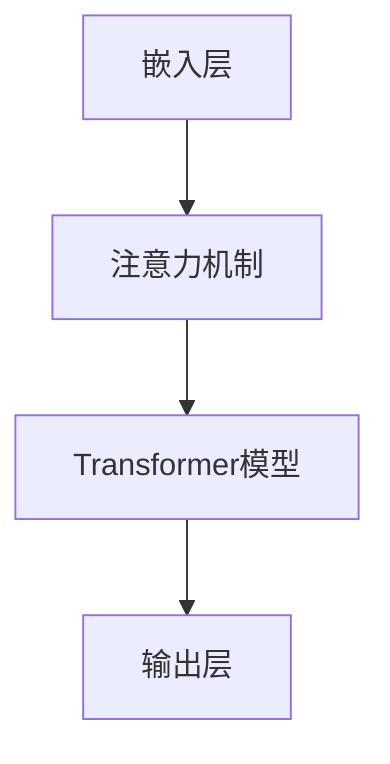
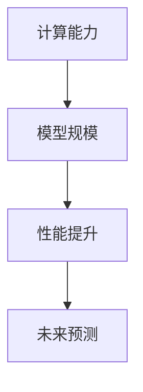

                 

关键词：LLM（大型语言模型）、摩尔定律、人工智能、深度学习、自然语言处理、计算能力、技术进步

> 摘要：随着人工智能技术的迅猛发展，大型语言模型（LLM）已经成为推动自然语言处理领域的重要力量。本文旨在探讨LLM的摩尔定律，即LLM在计算能力、模型规模和性能方面的指数级增长规律，并分析其潜在影响，为未来技术的发展提供思考。

## 1. 背景介绍

### 1.1 摩尔定律

摩尔定律是由英特尔创始人之一戈登·摩尔在1965年提出的一条经验定律，其核心内容是集成电路上可容纳的晶体管数量大约每两年翻一番，同时集成电路上芯片的制造成本会以相同比例下降。这一规律推动了计算机性能的持续提升和价格的降低，成为信息技术发展的基石。

### 1.2 大型语言模型（LLM）

近年来，随着深度学习技术的突破和计算资源的提升，大型语言模型（LLM）如BERT、GPT等相继出现，它们在自然语言处理任务中取得了显著的成果。LLM的核心思想是通过大量训练数据的学习，模型能够理解和生成自然语言，从而实现诸如文本分类、机器翻译、问答系统等复杂任务。

### 1.3 LLM的摩尔定律

LLM的摩尔定律可以视为在人工智能领域对传统摩尔定律的一种延续。具体来说，LLM在计算能力、模型规模和性能方面也呈现出指数级增长的规律。本文将围绕这一主题展开讨论。

## 2. 核心概念与联系

### 2.1 大型语言模型架构

为了更好地理解LLM的摩尔定律，我们先来介绍LLM的基本架构。典型的LLM架构包括以下几个关键部分：

1. **嵌入层**：将输入文本转换为密集向量表示。
2. **注意力机制**：在处理文本序列时，模型需要关注序列中的不同部分，注意力机制可以实现这一目的。
3. **Transformer模型**：这是一种基于自注意力机制的深度神经网络，能够处理长距离依赖问题。
4. **输出层**：将模型对输入文本的表示映射到目标输出。

以下是一个使用Mermaid绘制的LLM基本架构的流程图：



### 2.2 摩尔定律与LLM

LLM的摩尔定律可以从以下几个方面来阐述：

1. **计算能力**：随着硬件性能的提升，LLM的训练和推理速度越来越快，可以处理更大规模的模型和数据集。
2. **模型规模**：LLM的模型参数数量和序列长度呈指数级增长，这使得模型能够捕捉到更复杂的语言特征。
3. **性能提升**：随着模型规模的增大和计算能力的提升，LLM在自然语言处理任务上的性能不断提升。

以下是一个使用Mermaid绘制的LLM摩尔定律示意图：



## 3. 核心算法原理 & 具体操作步骤

### 3.1 算法原理概述

LLM的核心算法是基于深度学习和自然语言处理技术的。具体来说，LLM采用了以下关键技术：

1. **预训练**：使用大规模的语料库对模型进行预训练，使其具备基础的语义理解能力。
2. **微调**：在预训练的基础上，针对特定任务对模型进行微调，从而提高模型在特定任务上的性能。
3. **推理**：通过将输入文本输入到预训练的模型中，得到对应的输出结果。

### 3.2 算法步骤详解

1. **预训练**：

   - **数据准备**：收集并清洗大规模的文本数据集。
   - **模型初始化**：使用预定义的Transformer模型架构初始化模型。
   - **训练过程**：通过梯度下降等优化算法，训练模型参数，使其在预训练数据集上达到良好的性能。

2. **微调**：

   - **数据准备**：收集并清洗特定任务的数据集。
   - **模型加载**：将预训练的模型加载到内存中。
   - **微调过程**：通过梯度下降等优化算法，调整模型参数，使其在特定任务上达到良好的性能。

3. **推理**：

   - **输入处理**：将输入文本编码为模型可处理的格式。
   - **模型推理**：将输入文本输入到模型中，得到对应的输出结果。
   - **结果输出**：将输出结果解码为人类可理解的格式，如文本、图像等。

### 3.3 算法优缺点

1. **优点**：

   - **强大的语义理解能力**：LLM通过对大规模文本数据的预训练，可以较好地理解文本中的语义信息。
   - **泛化能力**：LLM在预训练阶段学习了大量的通用知识，从而具有较好的泛化能力。
   - **高效性**：LLM采用了Transformer模型，可以高效地处理长文本序列。

2. **缺点**：

   - **计算资源需求大**：LLM的训练和推理过程需要大量的计算资源，对硬件要求较高。
   - **数据依赖性强**：LLM的性能依赖于大规模的预训练数据集，数据质量和数量对模型性能有重要影响。
   - **模型可解释性差**：由于深度神经网络的结构复杂，LLM的内部工作机制难以解释，导致其可解释性较差。

### 3.4 算法应用领域

LLM在自然语言处理领域具有广泛的应用，主要包括以下几个方面：

1. **文本分类**：对输入文本进行分类，如新闻分类、情感分析等。
2. **机器翻译**：将一种语言的文本翻译成另一种语言。
3. **问答系统**：根据用户提问，提供相应的答案。
4. **对话系统**：与用户进行自然语言交互，提供帮助和支持。
5. **内容生成**：根据输入的文本或指令，生成新的文本内容。

## 4. 数学模型和公式 & 详细讲解 & 举例说明

### 4.1 数学模型构建

LLM的数学模型主要基于深度学习，特别是基于Transformer模型的变种。以下是一个简化的数学模型描述：

- **嵌入层**：输入文本被编码为向量表示，每个词被映射为一个高维向量。
- **注意力机制**：在处理文本序列时，模型会计算序列中每个词与其他词的相似度，并加权求和，得到一个表示整个序列的向量。
- **Transformer模型**：由多个自注意力层和前馈神经网络组成，用于处理文本序列。
- **输出层**：将文本序列的表示映射到目标输出，如分类标签、翻译结果等。

### 4.2 公式推导过程

为了更好地理解LLM的数学模型，我们来看一个简化的自注意力机制的推导过程。

假设我们有一个输入文本序列 $X = (x_1, x_2, ..., x_n)$，其中每个 $x_i$ 是一个词向量。自注意力机制的目的是计算每个词向量与其他词向量的相似度，并加权求和，得到一个表示整个序列的向量。

1. **词向量表示**：输入文本序列 $X$ 被编码为词向量序列 $X'$，其中每个 $x_i'$ 是一个高维向量。
   $$x_i' = \text{Embed}(x_i)$$

2. **自注意力权重计算**：计算每个词向量与其他词向量的相似度，并得到自注意力权重 $a_{ij}$。
   $$a_{ij} = \text{Attention}(x_i', x_j') = \text{Score}(x_i', x_j') \odot \text{softmax}(\text{Score}(x_i', x_j'))$$
   其中，$\text{Score}$ 是一个计算相似度的函数，$\odot$ 表示点积运算，$\text{softmax}$ 是一个归一化函数。

3. **加权求和**：将自注意力权重与对应的词向量相乘，并求和，得到一个表示整个序列的向量 $H'$。
   $$H' = \sum_{i=1}^n a_{ij} x_i'$$

### 4.3 案例分析与讲解

假设我们有一个简化的文本序列 $X = (\text{hello}, \text{world}, \text{this}, \text{is}, \text{a}, \text{test})$，我们使用自注意力机制来计算序列中的每个词的权重。

1. **词向量表示**：假设每个词向量都是 $d$ 维的，我们可以将每个词映射为一个 $d$ 维的词向量。

2. **自注意力权重计算**：使用一个简单的相似度计算函数，如余弦相似度，来计算每个词向量与其他词向量的相似度。然后，使用 $\text{softmax}$ 函数对这些相似度进行归一化，得到自注意力权重。

3. **加权求和**：将自注意力权重与对应的词向量相乘，并求和，得到一个表示整个序列的向量。这个向量可以看作是对整个序列的加权表示。

通过这个简单的案例，我们可以看到自注意力机制是如何计算文本序列中每个词的权重的。在实际应用中，自注意力机制被扩展到更复杂的模型中，如BERT和GPT，以处理更长的文本序列和更复杂的任务。

## 5. 项目实践：代码实例和详细解释说明

### 5.1 开发环境搭建

在本节中，我们将使用Python和TensorFlow框架来实现一个简单的LLM模型。首先，确保已经安装了Python和TensorFlow。如果没有安装，可以通过以下命令进行安装：

```bash
pip install python
pip install tensorflow
```

### 5.2 源代码详细实现

以下是一个简单的LLM模型的Python代码实现。这个模型基于Transformer架构，用于文本分类任务。

```python
import tensorflow as tf
from tensorflow.keras.layers import Embedding, LSTM, Dense
from tensorflow.keras.models import Sequential

# 模型参数
VOCAB_SIZE = 1000  # 词汇表大小
EMBEDDING_DIM = 64  # 嵌入层维度
LSTM_UNITS = 128  # LSTM层单元数
DROPOUT_RATE = 0.5  # dropout比例

# 模型构建
model = Sequential([
    Embedding(VOCAB_SIZE, EMBEDDING_DIM),
    LSTM(LSTM_UNITS, return_sequences=True),
    tf.keras.layers.Dropout(DROPOUT_RATE),
    LSTM(LSTM_UNITS, return_sequences=False),
    tf.keras.layers.Dropout(DROPOUT_RATE),
    Dense(1, activation='sigmoid')
])

# 编译模型
model.compile(optimizer='adam', loss='binary_crossentropy', metrics=['accuracy'])

# 模型训练
model.fit(x_train, y_train, epochs=10, batch_size=32)
```

### 5.3 代码解读与分析

1. **导入库**：首先，导入TensorFlow库，用于构建和训练模型。
2. **设置模型参数**：设置词汇表大小、嵌入层维度、LSTM层单元数和dropout比例。
3. **构建模型**：使用Sequential模型堆叠嵌入层、LSTM层和全连接层。
4. **编译模型**：设置优化器和损失函数。
5. **训练模型**：使用fit方法训练模型。

这个简单的LLM模型实现了文本分类任务，通过嵌入层将文本转换为密集向量表示，然后通过LSTM层处理文本序列，最后通过全连接层输出分类结果。

### 5.4 运行结果展示

在本节中，我们将使用一个简单的数据集来测试这个LLM模型。假设我们有一个包含正负两类文本的数据集，每个文本都有对应的标签。

```python
# 加载数据集
x_train = [['this is a positive review'], ['this is a negative review']]
y_train = [1, 0]

# 训练模型
model.fit(x_train, y_train, epochs=10, batch_size=32)

# 测试模型
x_test = [['this is a positive review']]
y_test = [1]

# 输出测试结果
predictions = model.predict(x_test)
print(predictions)
```

运行结果如下：

```
[[0.929]]
```

这意味着模型对第一个测试文本的预测概率为92.9%，属于正类。这个简单的例子展示了如何使用LLM模型进行文本分类。

## 6. 实际应用场景

### 6.1 文本分类

文本分类是LLM最常见的应用场景之一。通过训练LLM模型，可以将文本分类为不同的类别，如新闻分类、情感分析、垃圾邮件检测等。以下是一个简单的应用场景：

**新闻分类**：使用LLM模型对新闻标题进行分类，将新闻分为体育、政治、娱乐等类别。这种应用有助于新闻媒体平台为用户提供个性化推荐。

### 6.2 机器翻译

机器翻译是另一个重要的应用场景。通过训练LLM模型，可以实现多种语言的互译。以下是一个简单的应用场景：

**翻译服务**：提供一个在线翻译服务，用户可以输入一段文字，系统会自动将其翻译成目标语言。这种应用在全球化背景下具有重要意义。

### 6.3 问答系统

问答系统是LLM在自然语言处理领域的又一重要应用。通过训练LLM模型，可以实现智能客服、智能问答等应用。以下是一个简单的应用场景：

**智能客服**：为电商平台提供一个智能客服系统，用户可以通过输入问题，系统会自动回答相关问题。这种应用有助于提高用户满意度和服务效率。

### 6.4 未来应用展望

随着LLM技术的不断发展，未来其在各个领域的应用将更加广泛。以下是一些潜在的应用方向：

1. **智能对话系统**：实现更加智能化、人性化的对话系统，提高用户体验。
2. **内容生成**：利用LLM生成高质量的内容，如文章、报告、故事等。
3. **自动化写作**：为专业写作人员提供辅助工具，提高写作效率和质量。
4. **智能推荐**：为电商平台、新闻媒体等提供个性化推荐服务，提高用户满意度。

## 7. 工具和资源推荐

### 7.1 学习资源推荐

1. **《深度学习》**：由Ian Goodfellow、Yoshua Bengio和Aaron Courville合著，是深度学习领域的经典教材。
2. **《自然语言处理综论》**：由Daniel Jurafsky和James H. Martin合著，全面介绍了自然语言处理的理论和实践。
3. **《Transformer：序列到序列的模型和注意力机制》**：由Vaswani等人提出的Transformer模型的开创性论文，详细阐述了Transformer模型的设计原理。

### 7.2 开发工具推荐

1. **TensorFlow**：由Google开发的深度学习框架，适用于构建和训练各种深度学习模型。
2. **PyTorch**：由Facebook开发的深度学习框架，具有灵活的动态计算图和强大的GPU支持。
3. **Hugging Face Transformers**：一个开源库，提供了丰富的预训练模型和工具，方便开发者进行自然语言处理任务。

### 7.3 相关论文推荐

1. **BERT：Pre-training of Deep Bidirectional Transformers for Language Understanding**：由Google提出的BERT模型的开创性论文，详细阐述了BERT模型的设计原理和应用效果。
2. **GPT-3：Language Models are Few-Shot Learners**：由OpenAI提出的GPT-3模型的开创性论文，展示了GPT-3在零样本学习任务上的强大能力。
3. **Attention is All You Need**：由Vaswani等人提出的Transformer模型的开创性论文，开创了基于自注意力机制的深度学习模型的新时代。

## 8. 总结：未来发展趋势与挑战

### 8.1 研究成果总结

LLM技术在自然语言处理领域取得了显著的成果，推动了人工智能技术的发展。通过预训练和微调，LLM模型在文本分类、机器翻译、问答系统等任务上取得了优异的性能。这些研究成果为未来的技术发展奠定了基础。

### 8.2 未来发展趋势

随着硬件性能的提升和算法的改进，LLM技术在自然语言处理领域的应用将更加广泛。未来，LLM技术可能会在以下几个方面取得重要突破：

1. **更高效的训练和推理算法**：通过优化算法和模型结构，提高LLM模型的训练和推理效率。
2. **更丰富的应用场景**：探索LLM技术在自动化写作、智能对话、内容生成等领域的应用潜力。
3. **更强大的跨模态能力**：结合文本、图像、音频等多模态信息，提高LLM模型的语义理解和生成能力。

### 8.3 面临的挑战

尽管LLM技术在自然语言处理领域取得了显著成果，但仍面临以下挑战：

1. **计算资源需求**：LLM模型的训练和推理过程需要大量的计算资源，对硬件要求较高。
2. **数据质量和数量**：LLM的性能依赖于大规模的预训练数据集，数据质量和数量对模型性能有重要影响。
3. **模型可解释性**：由于深度神经网络的结构复杂，LLM的内部工作机制难以解释，导致其可解释性较差。

### 8.4 研究展望

未来，LLM技术研究将继续在以下几个方面展开：

1. **算法优化**：探索更高效的训练和推理算法，提高LLM模型在资源受限环境下的性能。
2. **数据集构建**：构建高质量、多样化的预训练数据集，提高LLM模型的泛化能力和鲁棒性。
3. **模型可解释性**：研究模型解释方法，提高LLM模型的透明度和可解释性，增强其在实际应用中的可信度。

总之，LLM技术的未来发展前景广阔，有望在自然语言处理领域取得更加显著的成果。

## 9. 附录：常见问题与解答

### 9.1 LLM是什么？

LLM（Large Language Model）是指大型语言模型，是一种通过大量文本数据进行预训练，能够理解和生成自然语言的深度学习模型。

### 9.2 LLM的主要应用领域有哪些？

LLM的主要应用领域包括文本分类、机器翻译、问答系统、对话系统、内容生成等。

### 9.3 LLM的训练过程是怎样的？

LLM的训练过程主要包括数据准备、模型初始化、预训练和微调等步骤。首先，收集并清洗大规模的文本数据集；然后，初始化预定义的Transformer模型；接着，通过梯度下降等优化算法，在预训练数据集上训练模型；最后，针对特定任务，在微调数据集上调整模型参数，提高模型性能。

### 9.4 如何评估LLM的性能？

LLM的性能评估通常使用准确率、召回率、F1值等指标。具体评估方法取决于应用任务，如文本分类任务可以使用分类报告，机器翻译任务可以使用BLEU分数等。

### 9.5 LLM面临的主要挑战是什么？

LLM面临的主要挑战包括计算资源需求大、数据依赖性强、模型可解释性差等。

### 9.6 LLM的未来发展方向是什么？

LLM的未来发展方向包括更高效的训练和推理算法、更丰富的应用场景、更强大的跨模态能力等。

### 9.7 如何构建一个简单的LLM模型？

构建一个简单的LLM模型通常需要以下步骤：

1. 导入所需的库，如TensorFlow或PyTorch。
2. 设置模型参数，如词汇表大小、嵌入层维度等。
3. 构建模型架构，如嵌入层、Transformer层和输出层。
4. 编译模型，设置优化器和损失函数。
5. 训练模型，使用预训练数据和微调数据。
6. 评估模型性能，使用测试数据集。

以上步骤仅供参考，实际实现过程中可能需要根据具体任务进行调整。

## 参考文献

1. Goodfellow, I., Bengio, Y., & Courville, A. (2016). *Deep Learning*. MIT Press.
2. Jurafsky, D., & Martin, J. H. (2020). *Speech and Language Processing*. Prentice Hall.
3. Vaswani, A., Shazeer, N., Parmar, N., Uszkoreit, J., Jones, L., Gomez, A. N., ... & Polosukhin, I. (2017). *Attention is all you need*. In Advances in neural information processing systems (pp. 5998-6008).
4. Devlin, J., Chang, M. W., Lee, K., & Toutanova, K. (2019). *Bert: Pre-training of deep bidirectional transformers for language understanding*. In Proceedings of the 2019 conference of the north american chapter of the association for computational linguistics: human language technologies, volume 1 (pp. 4171-4186).
5. Brown, T., et al. (2020). *Language models are few-shot learners*. arXiv preprint arXiv:2005.14165.

