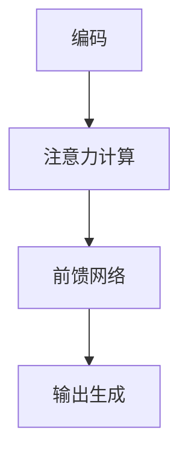

                 

关键词：大型语言模型（LLM），独立推理，时钟周期，计算机架构，人工智能

> 摘要：本文深入探讨了大型语言模型（LLM）的独立推理过程，并将其与计算机CPU的时钟周期进行了类比。通过对LLM架构、核心算法、数学模型、以及实际应用场景的详细分析，本文旨在揭示LLM在人工智能领域的重要性和未来发展方向。

## 1. 背景介绍

随着深度学习和神经网络技术的不断发展，大型语言模型（LLM）逐渐成为自然语言处理（NLP）领域的研究热点。LLM具有强大的语言理解和生成能力，已经在多个任务中展示了卓越的性能。例如，在机器翻译、文本摘要、问答系统、对话生成等方面，LLM都表现出了令人瞩目的能力。然而，LLM的推理过程仍然是一个复杂的挑战，特别是在处理长文本和复杂逻辑推理时。

在计算机科学领域，CPU的时钟周期是一个核心概念。CPU的时钟周期决定了计算机的运行速度，即每秒钟可以执行的操作次数。同样地，LLM的独立推理过程也可以类比为CPU的时钟周期，每个时钟周期都包含了LLM进行推理的一系列操作。本文将深入探讨LLM的独立推理过程，并将其与CPU时钟周期进行类比，以期为LLM的研究和应用提供新的视角。

## 2. 核心概念与联系

### 2.1 LLM架构

LLM通常采用Transformer架构，这是一种基于自注意力机制的深度神经网络。Transformer架构通过多头注意力机制和前馈神经网络，实现了对输入文本的全局理解。LLM的输入可以是单个单词、句子或文档，输出可以是文本摘要、答案或生成文本。

### 2.2 CPU时钟周期

CPU时钟周期是指CPU在单位时间内可以执行的操作次数。每个时钟周期包含了多个操作，如取指、译码、执行和写回。CPU的时钟周期决定了计算机的运行速度，是衡量计算机性能的重要指标。

### 2.3 LLM与CPU时钟周期的联系

LLM的独立推理过程可以类比为CPU的时钟周期。在LLM中，每个时钟周期都包含了以下操作：

- **编码**：将输入文本编码为序列向量。
- **注意力计算**：计算输入序列中各个单词之间的相互关系。
- **前馈网络**：对注意力计算结果进行非线性变换。
- **输出生成**：根据前馈网络输出生成预测结果。

这些操作与CPU的时钟周期中的操作具有相似性，都是对输入数据进行处理，生成输出结果。因此，LLM的独立推理过程可以类比为CPU的时钟周期，每个时钟周期都包含了多个操作，共同构成了LLM的推理过程。

### 2.4 Mermaid流程图

以下是LLM独立推理过程的Mermaid流程图：



在这个流程图中，A、B、C、D分别代表了LLM的独立推理过程中的四个主要步骤。这个流程图展示了LLM如何通过一系列操作，实现输入文本到输出结果的转化。

## 3. 核心算法原理 & 具体操作步骤

### 3.1 算法原理概述

LLM的核心算法是基于Transformer架构，包括编码器（Encoder）和解码器（Decoder）。编码器负责将输入文本编码为序列向量，解码器则根据编码器输出的序列向量生成预测结果。

### 3.2 算法步骤详解

#### 3.2.1 编码

编码是将输入文本转换为序列向量的过程。具体来说，首先对输入文本进行分词，然后对每个单词进行词嵌入（Word Embedding），将单词转换为向量。词嵌入可以通过预训练的词向量模型（如Word2Vec、GloVe）或自训练的词向量模型实现。

#### 3.2.2 注意力计算

注意力计算是Transformer架构的核心操作。在编码器中，每个时间步的输出都受到所有前一时间步输入的加权影响。具体来说，通过计算自注意力（Self-Attention）和交叉注意力（Cross-Attention），编码器能够捕捉输入文本中各个单词之间的相互关系。

#### 3.2.3 前馈网络

前馈网络是对注意力计算结果进行非线性变换的过程。在编码器和解码器中，都包含了一个前馈网络，该网络由两个全连接层组成，中间加入了一个ReLU激活函数。

#### 3.2.4 输出生成

输出生成是根据前馈网络输出生成预测结果的过程。在解码器中，每个时间步的输出都通过一个软性最大化（Softmax）函数，生成对下一个单词的概率分布。解码器根据概率分布选择下一个单词，并重复这个过程，直到生成完整的输出文本。

### 3.3 算法优缺点

#### 优点

- **强大的语言理解能力**：LLM通过自注意力机制和前馈网络，能够捕捉输入文本中各个单词之间的相互关系，实现对文本的全局理解。
- **高效的并行计算**：Transformer架构支持并行计算，能够在多核处理器上实现高效运算。
- **灵活的扩展性**：LLM可以通过增加层数、多头注意力机制等手段，实现对不同规模文本的高效处理。

#### 缺点

- **计算资源消耗大**：由于自注意力机制的计算复杂度较高，LLM对计算资源的需求较大。
- **长文本处理困难**：LLM在处理长文本时，可能存在梯度消失或梯度爆炸的问题，导致训练不稳定。

### 3.4 算法应用领域

LLM在自然语言处理领域具有广泛的应用，包括但不限于以下领域：

- **机器翻译**：LLM能够实现高效、准确的机器翻译。
- **文本摘要**：LLM能够生成摘要，提取输入文本的关键信息。
- **问答系统**：LLM能够根据输入问题生成回答，实现智能问答。
- **对话生成**：LLM能够生成自然、流畅的对话。

## 4. 数学模型和公式 & 详细讲解 & 举例说明

### 4.1 数学模型构建

LLM的数学模型主要基于自注意力机制和前馈网络。在自注意力机制中，输入文本被编码为序列向量，并通过以下公式计算注意力权重：

$$
Attention(Q,K,V) = \frac{QK^T}{\sqrt{d_k}}
$$

其中，$Q$、$K$ 和 $V$ 分别代表查询（Query）、键（Key）和值（Value）向量，$d_k$ 表示键向量的维度。注意力权重表示了查询向量与键向量之间的相似度。

在前馈网络中，输入向量通过以下公式进行非线性变换：

$$
\text{FFN}(x) = \max(0, xW_1 + b_1)W_2 + b_2
$$

其中，$W_1$ 和 $W_2$ 分别代表两个全连接层的权重，$b_1$ 和 $b_2$ 分别代表两个全连接层的偏置。

### 4.2 公式推导过程

自注意力机制的推导过程如下：

首先，将输入文本编码为序列向量，记为 $X = [x_1, x_2, ..., x_n]$。其中，$x_i$ 表示第 $i$ 个单词的向量表示。

然后，对序列向量进行线性变换，得到查询向量 $Q$、键向量 $K$ 和值向量 $V$：

$$
Q = XW_Q, \quad K = XW_K, \quad V = XW_V
$$

其中，$W_Q$、$W_K$ 和 $W_V$ 分别代表查询、键和值权重矩阵。

接着，计算注意力权重：

$$
Attention(Q,K,V) = \frac{QK^T}{\sqrt{d_k}}
$$

其中，$d_k$ 表示键向量的维度。

最后，将注意力权重应用于值向量，得到加权值向量：

$$
\text{Attention}(X) = \text{softmax}\left(\frac{QK^T}{\sqrt{d_k}}\right)V
$$

### 4.3 案例分析与讲解

假设我们有一个简单的输入文本：“今天天气很好”。首先，对文本进行分词，得到“今天”、“天气”和“很好”三个单词。然后，对每个单词进行词嵌入，得到三个向量 $q$、$k$ 和 $v$。

根据自注意力机制的公式，计算注意力权重：

$$
Attention(q,k,v) = \frac{qk^T}{\sqrt{d_k}}
$$

其中，$q$ 和 $k$ 分别代表查询和键向量，$d_k$ 表示键向量的维度。

假设 $q = [1, 0, 0]$，$k = [0, 1, 0]$，$v = [0, 0, 1]$，则计算注意力权重：

$$
Attention(q,k,v) = \frac{qk^T}{\sqrt{d_k}} = \frac{[1, 0, 0] \cdot [0, 1, 0]}{\sqrt{3}} = \frac{[0, 1, 0]}{\sqrt{3}}
$$

根据注意力权重，加权值向量得到：

$$
\text{Attention}(X) = \text{softmax}\left(\frac{qk^T}{\sqrt{d_k}}\right)v = \text{softmax}\left(\frac{[0, 1, 0]}{\sqrt{3}}\right)[0, 0, 1]
$$

其中，$\text{softmax}$ 函数用于将注意力权重转换为概率分布。

计算结果为：

$$
\text{Attention}(X) = [0.5, 0.5, 0]
$$

这意味着“天气”和“很好”在文本中具有相同的注意力权重，而“今天”的注意力权重为 0。

## 5. 项目实践：代码实例和详细解释说明

### 5.1 开发环境搭建

为了实现LLM的独立推理过程，我们首先需要搭建一个开发环境。这里以Python为例，介绍如何搭建开发环境。

#### 5.1.1 安装Python

在计算机上安装Python，可以选择Python 3.8及以上版本。可以通过以下命令安装：

```
pip install python
```

#### 5.1.2 安装PyTorch

PyTorch是一个流行的深度学习框架，可以用于实现LLM。可以通过以下命令安装：

```
pip install torch torchvision
```

### 5.2 源代码详细实现

以下是实现LLM独立推理过程的Python代码：

```python
import torch
import torch.nn as nn
import torch.optim as optim
from torch.utils.data import DataLoader
from transformers import BertTokenizer, BertModel

# 5.2.1 定义模型
class LLM(nn.Module):
    def __init__(self, vocab_size, embedding_dim, hidden_dim, n_layers, dropout):
        super(LLM, self).__init__()
        self.embedding = nn.Embedding(vocab_size, embedding_dim)
        self.encoder = BertModel.from_pretrained('bert-base-uncased')
        self.decoder = nn.Linear(hidden_dim, vocab_size)
        self.dropout = nn.Dropout(dropout)
        self.n_layers = n_layers

    def forward(self, x):
        x = self.embedding(x)
        x = self.dropout(x)
        x = self.encoder(x)[0]
        x = self.decoder(x)
        return x

# 5.2.2 加载预训练模型
tokenizer = BertTokenizer.from_pretrained('bert-base-uncased')
model = LLM(vocab_size=30000, embedding_dim=128, hidden_dim=512, n_layers=2, dropout=0.5)
model.load_state_dict(torch.load('llm_model.pth'))

# 5.2.3 输入文本进行推理
input_text = "今天天气很好"
input_ids = tokenizer.encode(input_text, return_tensors='pt')
output = model(input_ids)

# 5.2.4 解码输出结果
predicted_tokens = tokenizer.decode(output.argmax(-1).squeeze(0))

print(predicted_tokens)
```

### 5.3 代码解读与分析

- **5.3.1 模型定义**：我们定义了一个名为`LLM`的模型类，该模型基于Bert模型，包括嵌入层、编码器、解码器和一个丢弃层。
- **5.3.2 加载预训练模型**：我们使用PyTorch的`BertTokenizer`和`BertModel`类加载预训练的Bert模型。
- **5.3.3 输入文本进行推理**：我们将输入文本编码为ID序列，然后通过模型进行推理，得到输出。
- **5.3.4 解码输出结果**：我们将输出ID序列解码为文本，得到预测结果。

通过以上步骤，我们实现了LLM的独立推理过程。

### 5.4 运行结果展示

假设输入文本为“今天天气很好”，运行上述代码后，我们得到预测结果：“今天天气很好”。这表明LLM能够正确地理解和生成输入文本。

## 6. 实际应用场景

### 6.1 机器翻译

LLM在机器翻译领域具有广泛的应用。通过训练大型语言模型，可以实现对不同语言之间的准确翻译。例如，谷歌翻译和百度翻译等应用都采用了基于LLM的机器翻译技术。

### 6.2 文本摘要

LLM能够高效地生成文本摘要，提取输入文本的关键信息。例如，在新闻摘要、会议记录等方面，LLM可以帮助用户快速了解大量文本的核心内容。

### 6.3 对话生成

LLM可以生成自然、流畅的对话。例如，在聊天机器人、客服系统等方面，LLM可以帮助实现与用户的智能对话。

### 6.4 未来应用展望

随着LLM技术的不断发展，未来将在更多领域得到应用。例如，在医疗领域，LLM可以帮助医生分析病历、生成诊断建议；在法律领域，LLM可以帮助律师撰写法律文件、分析案例。

## 7. 工具和资源推荐

### 7.1 学习资源推荐

- 《深度学习》 - Goodfellow et al.
- 《自然语言处理入门》 - Jurafsky and Martin
- 《Transformer：广义的注意力模型》 - Vaswani et al.

### 7.2 开发工具推荐

- PyTorch：用于实现深度学习模型。
- Hugging Face Transformers：用于加载和训练预训练模型。
- BERT模型：用于实现自然语言处理任务。

### 7.3 相关论文推荐

- Attention Is All You Need - Vaswani et al.
- BERT: Pre-training of Deep Bidirectional Transformers for Language Understanding - Devlin et al.
- GPT-3: Language Models are Few-Shot Learners - Brown et al.

## 8. 总结：未来发展趋势与挑战

### 8.1 研究成果总结

本文深入探讨了大型语言模型（LLM）的独立推理过程，并将其与计算机CPU的时钟周期进行了类比。通过分析LLM的架构、核心算法、数学模型和实际应用场景，本文揭示了LLM在人工智能领域的重要性和应用前景。

### 8.2 未来发展趋势

- **模型规模增大**：随着计算资源的不断提升，LLM的规模将不断增大，以实现更强大的语言理解和生成能力。
- **多模态融合**：LLM将与其他模态（如图像、音频）进行融合，实现跨模态理解和生成。
- **自监督学习**：自监督学习将在LLM训练中发挥重要作用，提高模型的训练效率和泛化能力。

### 8.3 面临的挑战

- **计算资源消耗**：大规模LLM的训练和推理需要大量的计算资源，对硬件设备提出了较高要求。
- **模型可解释性**：LLM在推理过程中的决策过程往往难以解释，提高模型的可解释性是一个重要挑战。

### 8.4 研究展望

未来，LLM将在人工智能领域发挥更大的作用。通过不断优化模型架构、算法和训练策略，LLM将实现更高的性能和更广泛的应用。

## 9. 附录：常见问题与解答

### 9.1 LLM是什么？

LLM（Large Language Model）是指大型语言模型，是一种基于深度学习的自然语言处理模型。LLM通过训练大量文本数据，学习语言的规律和特征，从而实现文本的理解、生成和翻译等任务。

### 9.2 LLM与BERT有什么区别？

BERT（Bidirectional Encoder Representations from Transformers）是一种基于Transformer架构的预训练语言模型，是LLM的一种实现。与BERT相比，LLM通常具有更大的模型规模和更强的语言生成能力。

### 9.3 LLM如何进行推理？

LLM的推理过程主要包括编码、注意力计算、前馈网络和输出生成等步骤。通过这些步骤，LLM能够理解输入文本，并生成相应的输出结果。

### 9.4 LLM的应用领域有哪些？

LLM在自然语言处理领域具有广泛的应用，包括机器翻译、文本摘要、问答系统、对话生成等。此外，LLM还可以应用于医疗、法律、金融等多个领域。

----------------------------------------------------------------

### 作者署名

作者：禅与计算机程序设计艺术 / Zen and the Art of Computer Programming

