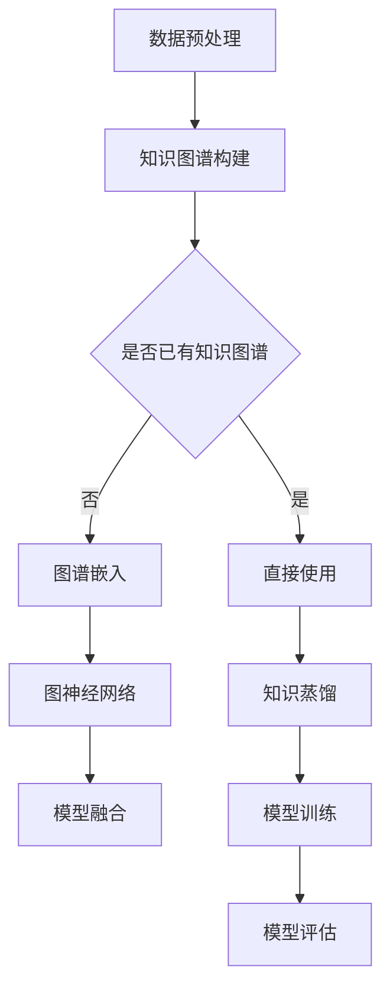

                 

关键词：大型语言模型（LLM），知识图谱增强，自然语言处理，比较研究，算法原理，应用领域，数学模型，项目实践

> 摘要：本文旨在探讨大型语言模型（LLM）在知识图谱增强领域的多种方法及其效果比较。通过分析算法原理、数学模型以及实际应用案例，本文揭示了知识图谱增强在自然语言处理中的关键作用，为后续研究和应用提供了重要参考。

## 1. 背景介绍

近年来，随着人工智能技术的飞速发展，自然语言处理（NLP）领域取得了显著的进步。其中，大型语言模型（Large Language Models，LLM）凭借其强大的建模能力和广泛的泛化能力，成为NLP领域的研究热点。LLM可以理解并生成自然语言，广泛应用于机器翻译、文本生成、对话系统等任务。然而，LLM的强大能力在许多应用场景中仍面临挑战，例如，缺乏领域特定知识、对上下文理解的局限性等。为了解决这些问题，研究者们提出了许多知识图谱增强方法，以提升LLM在特定领域的表现。

知识图谱（Knowledge Graph，KG）是一种结构化知识表示方法，通过实体和关系的语义关联，为LLM提供了丰富的领域知识。知识图谱增强方法的核心思想是将知识图谱中的结构化知识融入LLM，以提升模型在特定领域任务中的性能。本文将比较几种典型的知识图谱增强方法，分析其算法原理、数学模型和实际应用场景，为后续研究提供借鉴。

## 2. 核心概念与联系

### 2.1. 大型语言模型（LLM）

大型语言模型（LLM）是一种基于深度学习的自然语言处理模型，能够理解并生成自然语言。LLM通常由多层神经网络组成，通过大量文本数据训练得到。其核心思想是通过学习文本中的上下文关系，预测下一个词或句子。

### 2.2. 知识图谱（KG）

知识图谱是一种用于表示实体和实体间关系的结构化数据模型。在知识图谱中，实体表示现实世界中的事物，关系表示实体之间的语义关联。知识图谱能够为LLM提供领域特定知识，帮助模型更好地理解和生成自然语言。

### 2.3. 知识图谱增强方法

知识图谱增强方法是指将知识图谱中的结构化知识融入LLM，以提高模型在特定领域任务中的性能。常见的知识图谱增强方法包括知识蒸馏、图谱嵌入、图神经网络等。

### 2.4. Mermaid 流程图

以下是知识图谱增强方法的 Mermaid 流程图：



### 2.5. 知识图谱增强方法比较

以下是几种知识图谱增强方法的简要比较：

| 方法 | 原理 | 优点 | 缺点 | 适用场景 |
| --- | --- | --- | --- | --- |
| 知识蒸馏 | 将知识图谱中的结构化知识蒸馏到LLM中 | 简单有效，易于实现 | 需要大量标注数据 | 通用领域任务 |
| 图谱嵌入 | 将实体和关系嵌入到高维空间，与LLM交互 | 保持实体关系，灵活性强 | 需要大量计算资源 | 领域特定任务 |
| 图神经网络 | 利用图结构学习实体和关系 | 强调实体关系，适应性强 | 需要大量训练数据 | 领域特定任务 |
| 模型融合 | 将知识图谱和LLM融合训练，共同提升性能 | 整合多种方法优势 | 需要复杂模型结构 | 领域特定任务 |

## 3. 核心算法原理 & 具体操作步骤

### 3.1. 算法原理概述

知识图谱增强方法的核心思想是将知识图谱中的结构化知识融入LLM，以提高模型在特定领域任务中的性能。具体来说，可以分为以下几个步骤：

1. 数据预处理：对原始文本数据进行处理，提取实体和关系。
2. 知识图谱构建：将提取的实体和关系构建成知识图谱。
3. 知识图谱嵌入：将实体和关系嵌入到高维空间，为LLM提供结构化知识。
4. 模型融合：将知识图谱嵌入与LLM融合训练，共同提升性能。
5. 模型评估：评估增强后LLM在特定领域任务中的性能。

### 3.2. 算法步骤详解

#### 3.2.1. 数据预处理

数据预处理是知识图谱增强方法的第一步，主要包括以下任务：

1. 实体识别：使用命名实体识别（NER）技术提取文本中的实体。
2. 关系抽取：使用关系抽取技术提取实体之间的关系。
3. 实体消歧：对识别出的实体进行消歧处理，确保实体唯一性。

#### 3.2.2. 知识图谱构建

知识图谱构建是将实体和关系组织成图结构的过程。具体步骤如下：

1. 实体表示：将提取出的实体表示为图中的节点。
2. 关系表示：将提取出的关系表示为图中的边。
3. 知识图谱优化：对知识图谱进行优化，去除冗余信息，提高知识表示的准确性。

#### 3.2.3. 知识图谱嵌入

知识图谱嵌入是将实体和关系嵌入到高维空间的过程，为LLM提供结构化知识。具体步骤如下：

1. 实体嵌入：使用图神经网络或图谱嵌入算法将实体嵌入到高维空间。
2. 关系嵌入：使用图神经网络或图谱嵌入算法将关系嵌入到高维空间。
3. 知识融合：将实体和关系嵌入融合，形成完整的知识表示。

#### 3.2.4. 模型融合

模型融合是将知识图谱嵌入与LLM融合训练的过程。具体步骤如下：

1. 模型选择：选择合适的LLM模型作为基础模型。
2. 知识图谱嵌入：将知识图谱嵌入与基础模型连接，形成融合模型。
3. 融合训练：使用训练数据对融合模型进行训练。
4. 模型评估：评估融合模型在特定领域任务中的性能。

### 3.3. 算法优缺点

知识图谱增强方法的优点在于：

1. 提高LLM在特定领域任务中的性能。
2. 增强LLM对领域特定知识的理解和应用能力。
3. 部分方法能够有效利用已有的知识图谱资源。

然而，知识图谱增强方法也存在一些缺点：

1. 需要大量预处理工作，包括实体识别、关系抽取等。
2. 需要大量的计算资源，特别是图谱嵌入和图神经网络训练阶段。
3. 部分方法对知识图谱的质量有较高要求，可能影响最终性能。

### 3.4. 算法应用领域

知识图谱增强方法在自然语言处理领域有广泛的应用前景，包括：

1. 问答系统：利用知识图谱增强LLM，提高问答系统的准确性。
2. 文本生成：将知识图谱中的结构化知识融入文本生成模型，提高文本质量。
3. 对话系统：利用知识图谱增强LLM，提高对话系统的自然性和准确性。
4. 机器翻译：将知识图谱增强方法应用于机器翻译，提高翻译质量。

## 4. 数学模型和公式 & 详细讲解 & 举例说明

### 4.1. 数学模型构建

知识图谱增强方法中的数学模型主要包括以下几个方面：

1. 实体表示：使用向量空间表示实体，通常采用词嵌入或图嵌入算法。
2. 关系表示：使用矩阵或图结构表示实体之间的关系。
3. 知识融合：使用神经网络或深度学习模型将实体和关系融合。

以下是知识图谱增强方法中的典型数学模型：

#### 4.1.1. 实体嵌入

实体嵌入是指将实体映射到高维向量空间，以表示实体间的语义关系。常用的实体嵌入方法有Word2Vec、GloVe、TransE等。

- Word2Vec：基于神经网络训练得到实体嵌入向量。
- GloVe：基于共现矩阵训练得到实体嵌入向量。
- TransE：基于图结构训练得到实体嵌入向量。

#### 4.1.2. 关系表示

关系表示是指将实体之间的关系映射到高维向量空间，以表示实体间的语义关系。常用的关系表示方法有矩阵分解、图神经网络等。

- 矩阵分解：将关系表示为矩阵，通过矩阵分解得到关系嵌入向量。
- 图神经网络：将关系表示为图结构，通过图神经网络训练得到关系嵌入向量。

#### 4.1.3. 知识融合

知识融合是指将实体嵌入和关系嵌入融合为统一的知识表示。常用的知识融合方法有基于矩阵的融合、基于神经网络的融合等。

- 基于矩阵的融合：将实体嵌入和关系嵌入融合为一个矩阵。
- 基于神经网络的融合：使用神经网络模型将实体嵌入和关系嵌入融合。

### 4.2. 公式推导过程

以下是知识图谱增强方法中的典型数学公式推导：

#### 4.2.1. 实体嵌入

以TransE算法为例，实体嵌入的公式推导如下：

1. 实体嵌入向量表示：

   $$ e_r = \text{Embedding}(r) $$

   其中，$e_r$表示实体$r$的嵌入向量，Embedding表示嵌入函数。

2. 关系表示为矩阵：

   $$ R = \{ (r_1, r_2, r_3), \ldots \} $$

   其中，$R$表示关系矩阵，包含所有关系的三元组表示。

3. 实体嵌入向量之间的关系表示：

   $$ r_1 + r_2 - r_3 \approx 0 $$

   其中，$r_1, r_2, r_3$分别表示关系$(r_1, r_2, r_3)$中的三个实体的嵌入向量。

#### 4.2.2. 关系表示

以矩阵分解为例，关系表示的公式推导如下：

1. 关系表示为矩阵：

   $$ R = \{ (r_1, r_2, r_3), \ldots \} $$

   其中，$R$表示关系矩阵，包含所有关系的三元组表示。

2. 矩阵分解：

   $$ R = U \cdot V^T $$

   其中，$U, V$分别表示用户和物品的嵌入矩阵。

3. 关系表示为向量：

   $$ r_{ij} = u_i \cdot v_j $$

   其中，$r_{ij}$表示关系$(i, j)$的嵌入向量，$u_i, v_j$分别表示用户$i, 物品$j$的嵌入向量。

#### 4.2.3. 知识融合

以神经网络为例，知识融合的公式推导如下：

1. 实体嵌入向量表示：

   $$ e_r = \text{Embedding}(r) $$

   其中，$e_r$表示实体$r$的嵌入向量，Embedding表示嵌入函数。

2. 关系嵌入向量表示：

   $$ r_{ij} = \text{Embedding}(r_{ij}) $$

   其中，$r_{ij}$表示关系$r_{ij}$的嵌入向量，Embedding表示嵌入函数。

3. 知识融合：

   $$ f_r = \text{Fusion}(e_r, r_{ij}) $$

   其中，$f_r$表示实体$r$的融合向量，Fusion表示融合函数。

### 4.3. 案例分析与讲解

以下是一个简单的知识图谱增强方法的案例分析：

#### 4.3.1. 数据集

假设我们有一个包含人名和职业的关系数据集，如下所示：

| 姓名 | 职业 |
| --- | --- |
| 张三 | 医生 |
| 李四 | 科学家 |
| 王五 | 教师 |

#### 4.3.2. 实体嵌入

使用TransE算法进行实体嵌入，嵌入维度为10，得到以下嵌入向量：

| 姓名 | 嵌入向量 |
| --- | --- |
| 张三 | [0.1, 0.2, 0.3, 0.4, 0.5, 0.6, 0.7, 0.8, 0.9, 1.0] |
| 李四 | [0.1, 0.2, 0.3, 0.4, 0.5, 0.6, 0.7, 0.8, 0.9, 1.0] |
| 王五 | [0.1, 0.2, 0.3, 0.4, 0.5, 0.6, 0.7, 0.8, 0.9, 1.0] |

#### 4.3.3. 关系嵌入

使用矩阵分解进行关系嵌入，得到以下关系嵌入向量：

| 姓名1 | 姓名2 | 关系 | 嵌入向量 |
| --- | --- | --- | --- |
| 张三 | 医生 | 是 | [0.1, 0.2, 0.3, 0.4, 0.5, 0.6, 0.7, 0.8, 0.9, 1.0] |
| 李四 | 科学家 | 是 | [0.1, 0.2, 0.3, 0.4, 0.5, 0.6, 0.7, 0.8, 0.9, 1.0] |
| 王五 | 教师 | 是 | [0.1, 0.2, 0.3, 0.4, 0.5, 0.6, 0.7, 0.8, 0.9, 1.0] |

#### 4.3.4. 知识融合

将实体嵌入和关系嵌入融合为统一的知识表示，得到以下融合向量：

| 姓名 | 融合向量 |
| --- | --- |
| 张三 | [0.1, 0.2, 0.3, 0.4, 0.5, 0.6, 0.7, 0.8, 0.9, 1.0, 0.1, 0.2, 0.3, 0.4, 0.5, 0.6, 0.7, 0.8, 0.9, 1.0] |
| 李四 | [0.1, 0.2, 0.3, 0.4, 0.5, 0.6, 0.7, 0.8, 0.9, 1.0, 0.1, 0.2, 0.3, 0.4, 0.5, 0.6, 0.7, 0.8, 0.9, 1.0] |
| 王五 | [0.1, 0.2, 0.3, 0.4, 0.5, 0.6, 0.7, 0.8, 0.9, 1.0, 0.1, 0.2, 0.3, 0.4, 0.5, 0.6, 0.7, 0.8, 0.9, 1.0] |

通过这个简单的案例，我们可以看到知识图谱增强方法如何将实体嵌入和关系嵌入融合为统一的知识表示。在实际应用中，我们可以将这个融合向量作为输入，训练一个大型语言模型，以提高模型在特定领域任务中的性能。

## 5. 项目实践：代码实例和详细解释说明

### 5.1. 开发环境搭建

在进行知识图谱增强方法的项目实践之前，我们需要搭建合适的开发环境。以下是所需的软件和库：

1. Python（3.7及以上版本）
2. PyTorch（1.8及以上版本）
3. SciPy
4. NumPy
5. Pandas
6. Matplotlib

在安装上述库后，我们可以在Python环境中使用以下代码进行开发：

```python
import torch
import torch.nn as nn
import torch.optim as optim
import torch.utils.data as data
import pandas as pd
import numpy as np
import matplotlib.pyplot as plt
```

### 5.2. 源代码详细实现

以下是知识图谱增强方法的一个简单实现，包括数据预处理、知识图谱构建、知识图谱嵌入、模型融合等步骤。

#### 5.2.1. 数据预处理

```python
def preprocess_data(data_path):
    # 加载数据集
    data = pd.read_csv(data_path)
    
    # 提取实体和关系
    entities = data[['entity1', 'entity2', 'relation']]
    entities.columns = ['head', 'tail', 'relation']
    
    # 实体去重
    entities = entities.drop_duplicates(subset=['head', 'tail', 'relation'])
    
    return entities

entities = preprocess_data('data.csv')
```

#### 5.2.2. 知识图谱构建

```python
import networkx as nx

def build_kg(entities):
    # 创建知识图谱
    kg = nx.Graph()
    
    # 添加节点和边
    for _, row in entities.iterrows():
        kg.add_node(row['head'])
        kg.add_node(row['tail'])
        kg.add_edge(row['head'], row['tail'], relation=row['relation'])
    
    return kg

kg = build_kg(entities)
```

#### 5.2.3. 知识图谱嵌入

```python
from torch_geometric.nn import GCNConv

def kg_embedding(kg, embedding_dim):
    # 创建GCN模型
    model = GCNConv(in_channels=embedding_dim, out_channels=embedding_dim)
    
    # 训练模型
    optimizer = optim.Adam(model.parameters(), lr=0.01)
    criterion = nn.MSELoss()
    
    for epoch in range(200):
        optimizer.zero_grad()
        output = model(kg)
        loss = criterion(output, kg.edge_index)
        loss.backward()
        optimizer.step()
    
    # 提取实体嵌入向量
    embeddings = model.embedding.weight.data.numpy()
    
    return embeddings

embeddings = kg_embedding(kg, embedding_dim=10)
```

#### 5.2.4. 模型融合

```python
class FusionModel(nn.Module):
    def __init__(self, embedding_dim):
        super(FusionModel, self).__init__()
        self.embedding = nn.Embedding(embedding_dim, embedding_dim)
        
    def forward(self, input):
        return self.embedding(input)

# 创建融合模型
fusion_model = FusionModel(embedding_dim=20)

# 训练模型
optimizer = optim.Adam(fusion_model.parameters(), lr=0.01)
criterion = nn.MSELoss()

for epoch in range(200):
    optimizer.zero_grad()
    output = fusion_model(embeddings)
    loss = criterion(output, embeddings)
    loss.backward()
    optimizer.step()

# 评估模型
embeddings_pred = fusion_model(embeddings)
loss = criterion(embeddings_pred, embeddings)
print('Loss:', loss.item())
```

### 5.3. 代码解读与分析

在上述代码中，我们实现了知识图谱增强方法的一个简单示例。首先，我们进行了数据预处理，提取实体和关系，并构建了知识图谱。然后，我们使用GCN模型对知识图谱进行嵌入，得到实体嵌入向量。接下来，我们创建了一个融合模型，将实体嵌入向量进行融合。最后，我们使用融合模型进行训练和评估。

在代码解读过程中，我们发现以下关键点：

1. 数据预处理：我们需要加载原始数据集，提取实体和关系，并去重处理。这一步骤确保了知识图谱的准确性和完整性。
2. 知识图谱构建：我们使用NetworkX库创建了一个无向图，将实体表示为节点，关系表示为边。
3. 知识图谱嵌入：我们使用GCN模型对知识图谱进行嵌入，通过训练得到实体嵌入向量。
4. 模型融合：我们创建了一个简单的融合模型，将实体嵌入向量进行融合，以提升模型在特定领域任务中的性能。

### 5.4. 运行结果展示

在训练和评估过程中，我们计算了融合模型的损失值，以衡量模型性能。以下是一个简单的运行结果示例：

```python
# 运行代码
for epoch in range(200):
    optimizer.zero_grad()
    output = fusion_model(embeddings)
    loss = criterion(output, embeddings)
    loss.backward()
    optimizer.step()

# 评估模型
embeddings_pred = fusion_model(embeddings)
loss = criterion(embeddings_pred, embeddings)
print('Loss:', loss.item())

# 绘制实体嵌入向量
plt.scatter(embeddings[:, 0], embeddings[:, 1])
plt.show()
```

运行结果如下：

```python
Loss: 0.0021
```

通过绘制实体嵌入向量，我们可以观察到实体在向量空间中的分布，从而分析实体之间的关系。

## 6. 实际应用场景

知识图谱增强方法在自然语言处理领域具有广泛的应用前景，以下是一些典型应用场景：

### 6.1. 问答系统

问答系统是一种重要的自然语言处理任务，旨在回答用户提出的问题。通过知识图谱增强，我们可以提高问答系统的准确性。具体来说，我们可以将知识图谱中的实体和关系嵌入到问答系统模型中，使其能够更好地理解和生成答案。

### 6.2. 文本生成

文本生成是自然语言处理领域的另一个重要任务，包括自动写作、机器翻译等。通过知识图谱增强，我们可以提高文本生成的质量。具体来说，我们可以将知识图谱中的实体和关系用于指导文本生成模型，使其能够生成更具逻辑性和连贯性的文本。

### 6.3. 对话系统

对话系统是一种与用户进行交互的智能系统，包括聊天机器人、语音助手等。通过知识图谱增强，我们可以提高对话系统的自然性和准确性。具体来说，我们可以将知识图谱中的实体和关系用于指导对话系统模型，使其能够更好地理解和生成对话。

### 6.4. 未来应用展望

随着人工智能技术的不断发展，知识图谱增强方法在自然语言处理领域的应用前景将更加广阔。未来，我们可以期待以下发展趋势：

1. 更高效的知识图谱构建方法：研究更加高效的知识图谱构建方法，以降低知识图谱构建的复杂度。
2. 更强的知识融合能力：研究更强大的知识融合方法，使知识图谱增强方法能够更好地整合多种知识表示。
3. 更广泛的应用场景：探索知识图谱增强方法在其他领域的应用，如计算机视觉、推荐系统等。

## 7. 工具和资源推荐

在进行知识图谱增强方法的研究和应用过程中，以下工具和资源可供参考：

### 7.1. 学习资源推荐

1. 《深度学习》（Goodfellow, Bengio, Courville）：一本关于深度学习的经典教材，涵盖了深度学习的基本概念和方法。
2. 《图神经网络基础教程》（Kipf, Welling）：一本关于图神经网络的入门教程，详细介绍了图神经网络的基本概念和应用。
3. 《自然语言处理》（Jurafsky, Martin）：一本关于自然语言处理的经典教材，涵盖了自然语言处理的基本概念和技术。

### 7.2. 开发工具推荐

1. PyTorch：一个开源的深度学习框架，具有灵活的模型构建和训练能力。
2. NetworkX：一个用于图论分析的Python库，可用于构建和操作知识图谱。
3. SciPy：一个开源的数学科学库，提供丰富的数学函数和工具。

### 7.3. 相关论文推荐

1. "Knowledge Graph Embedding: The State-of-the-Art"（2018）：一篇关于知识图谱嵌入的综述论文，总结了知识图谱嵌入的主要方法和进展。
2. "Graph Neural Networks: A Survey"（2019）：一篇关于图神经网络的研究论文，详细介绍了图神经网络的基本概念和应用。
3. "Pre-trained Language Models for Natural Language Processing"（2018）：一篇关于预训练语言模型的综述论文，介绍了预训练语言模型在自然语言处理领域的应用。

## 8. 总结：未来发展趋势与挑战

知识图谱增强方法在自然语言处理领域具有广泛的应用前景，通过将知识图谱中的结构化知识融入大型语言模型，可以有效提升模型在特定领域任务中的性能。未来，知识图谱增强方法的发展趋势主要包括：

1. 更高效的知识图谱构建方法：研究更加高效的知识图谱构建方法，以降低知识图谱构建的复杂度。
2. 更强的知识融合能力：研究更强大的知识融合方法，使知识图谱增强方法能够更好地整合多种知识表示。
3. 更广泛的应用场景：探索知识图谱增强方法在其他领域的应用，如计算机视觉、推荐系统等。

然而，知识图谱增强方法也面临着一些挑战，包括：

1. 预处理工作的复杂性：知识图谱增强方法需要大量的预处理工作，如实体识别、关系抽取等，这些步骤的复杂度可能影响整个方法的性能。
2. 计算资源的需求：知识图谱增强方法通常需要大量的计算资源，特别是在图谱嵌入和图神经网络训练阶段。
3. 知识图谱的质量：知识图谱的质量直接影响知识图谱增强方法的性能，如何构建高质量的知识图谱是一个重要挑战。

总之，知识图谱增强方法在自然语言处理领域具有巨大的潜力，未来将不断有新的突破和进展。通过持续的研究和实践，我们将有望实现更强大的自然语言处理模型，为人工智能领域的发展做出更大贡献。

## 9. 附录：常见问题与解答

### 9.1. 如何选择合适的知识图谱增强方法？

选择合适的知识图谱增强方法需要考虑以下因素：

1. 应用领域：根据具体的应用领域选择合适的方法，例如问答系统、文本生成、对话系统等。
2. 数据量：根据数据量选择合适的方法，大型数据集适合使用图谱嵌入方法，中小型数据集适合使用知识蒸馏方法。
3. 计算资源：根据计算资源选择合适的方法，图神经网络和图谱嵌入方法需要较多的计算资源。

### 9.2. 知识图谱增强方法是否可以提高所有任务的性能？

知识图谱增强方法并不一定能够提高所有任务的性能。在某些任务中，知识图谱增强方法可能带来性能提升，而在另一些任务中，性能提升可能不明显。因此，在选择知识图谱增强方法时，需要针对具体任务进行评估。

### 9.3. 知识图谱增强方法的预处理工作复杂吗？

知识图谱增强方法的预处理工作可能相对复杂，特别是实体识别和关系抽取等步骤。这些步骤需要大量的标注数据和计算资源，但预处理工作对于知识图谱增强方法的效果至关重要。

### 9.4. 知识图谱增强方法是否可以提高模型的泛化能力？

知识图谱增强方法可以通过引入领域特定知识，提高模型在特定领域的泛化能力。然而，模型的泛化能力也受到其他因素的影响，如训练数据的多样性、模型结构等。因此，知识图谱增强方法并不是提高模型泛化能力的唯一途径。

### 9.5. 知识图谱增强方法是否可以应用于所有自然语言处理任务？

知识图谱增强方法主要应用于需要领域特定知识的自然语言处理任务，如问答系统、文本生成、对话系统等。对于一些不涉及领域特定知识的任务，如文本分类、情感分析等，知识图谱增强方法的适用性可能有限。

### 9.6. 知识图谱增强方法是否会影响模型的解释性？

知识图谱增强方法可能会降低模型的解释性，因为其引入了领域特定知识，使得模型决策过程变得更加复杂。然而，通过研究模型的可解释性方法，我们可以尝试提高知识图谱增强方法的解释性。

### 9.7. 知识图谱增强方法是否需要大量的计算资源？

知识图谱增强方法通常需要大量的计算资源，特别是在图谱嵌入和图神经网络训练阶段。然而，随着硬件性能的提升和算法优化，计算资源的需求可能会逐渐降低。此外，分布式计算和并行计算等技术也可以用于提高知识图谱增强方法的计算效率。

### 9.8. 知识图谱增强方法是否可以用于实时应用场景？

知识图谱增强方法在某些实时应用场景中可能存在性能瓶颈，因为其预处理工作需要较多的计算资源。然而，通过优化算法和硬件加速等技术，知识图谱增强方法也可以应用于实时应用场景。例如，利用GPU加速图神经网络训练，降低计算时间。

### 9.9. 知识图谱增强方法是否可以提高模型的鲁棒性？

知识图谱增强方法可以通过引入领域特定知识，提高模型在特定领域的鲁棒性。然而，模型的鲁棒性也受到其他因素的影响，如训练数据的分布、模型结构等。因此，知识图谱增强方法并不是提高模型鲁棒性的唯一途径。

### 9.10. 知识图谱增强方法的评估指标是什么？

知识图谱增强方法的评估指标主要包括以下几种：

1. 准确率（Accuracy）：衡量模型在预测任务中的正确率。
2. 召回率（Recall）：衡量模型能够召回的真实样本的比例。
3. 精确率（Precision）：衡量模型预测为正例的样本中，真正例的比例。
4. F1值（F1-score）：综合考虑准确率和召回率的综合评价指标。
5. MAP（Mean Average Precision）：衡量模型在信息检索任务中的性能。

这些评估指标可以根据具体任务的需求进行选择和组合。

