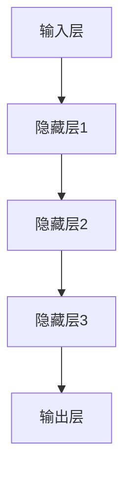

                 

关键词：大型语言模型（LLM），硬件依赖，计算设备革新，AI计算能力，GPU加速，异构计算，量子计算

## 摘要

本文旨在探讨大型语言模型（LLM）对计算设备的需求及其引发的硬件革新。随着LLM技术的不断进步，其对计算资源的需求呈现出指数级增长。本文首先介绍了LLM的基本概念和原理，随后分析了LLM对硬件的依赖，重点探讨了GPU加速、异构计算和量子计算等新兴技术在提升LLM计算能力方面的作用。最后，文章对LLM硬件依赖的未来发展趋势和挑战进行了展望，以期为相关领域的研究和实践提供有益的参考。

## 1. 背景介绍

近年来，人工智能（AI）领域取得了显著的进展，其中大型语言模型（LLM）如GPT、BERT等取得了惊人的成绩。这些模型通过深度学习技术，从海量数据中学习语言规律，实现了在自然语言处理（NLP）、文本生成、问答系统等任务中的卓越表现。然而，这些模型的训练和推理过程对计算资源有着极高的依赖，特别是对CPU和GPU等硬件设备的要求日益苛刻。

### 1.1 大型语言模型的发展历程

大型语言模型的发展可以追溯到20世纪80年代，当时研究者开始尝试使用统计模型处理自然语言。随着计算能力的提升和深度学习技术的引入，大型语言模型逐渐取得了突破。特别是在2018年，OpenAI发布了GPT-1模型，这标志着大型语言模型进入了一个新的时代。此后，GPT-2、GPT-3等模型相继问世，模型规模和性能不断提升。

### 1.2 大型语言模型的应用场景

大型语言模型在各个领域都有广泛的应用。在自然语言处理领域，LLM用于文本分类、情感分析、命名实体识别等任务；在问答系统领域，LLM可以用于构建智能客服、知识问答等应用；在文本生成领域，LLM可以用于撰写文章、编写代码等。

### 1.3 大型语言模型的技术挑战

随着LLM的规模不断扩大，其对计算资源的需求也日益增长。训练一个大型语言模型通常需要大量的GPU和CPU资源，同时，推理过程中也需要高效计算设备以实现实时响应。因此，如何提升计算能力，成为推动LLM技术发展的关键挑战。

## 2. 核心概念与联系

### 2.1 大型语言模型的基本原理

大型语言模型的核心是深度神经网络，通过多层神经网络结构，模型可以从海量数据中学习语言规律。具体来说，LLM主要由以下几部分组成：

1. **输入层**：接收输入文本，将其转换为模型可以处理的向量表示。
2. **隐藏层**：通过神经网络结构，对输入向量进行变换和组合，提取文本特征。
3. **输出层**：根据隐藏层输出的特征，生成预测结果，如单词、句子或文本。

### 2.2 硬件依赖

LLM的训练和推理过程对硬件资源有着极高的依赖。以下是几个关键硬件组件：

1. **CPU**：作为传统的计算设备，CPU在LLM训练过程中负责数据计算和模型优化。随着模型规模的扩大，CPU的算力和能效比逐渐成为瓶颈。
2. **GPU**：GPU在深度学习领域有着广泛的应用，其强大的并行计算能力使得LLM训练速度大幅提升。然而，GPU的功耗和发热问题也需要关注。
3. **TPU**：专为深度学习设计的ASIC芯片，TPU在计算性能和能效方面具有显著优势，适用于大规模LLM训练。

### 2.3 Mermaid 流程图



## 3. 核心算法原理 & 具体操作步骤

### 3.1 算法原理概述

大型语言模型的核心算法是基于深度学习技术，通过多层神经网络结构对输入文本进行特征提取和预测。具体来说，模型采用以下步骤：

1. **数据预处理**：将输入文本转换为向量表示，如Word2Vec、BERT等。
2. **前向传播**：将输入向量通过多层神经网络，计算隐藏层输出。
3. **反向传播**：根据预测误差，调整模型参数，优化模型性能。
4. **模型评估**：使用验证集评估模型性能，调整模型结构和参数。

### 3.2 算法步骤详解

1. **数据预处理**：首先，将输入文本转换为词向量。词向量是将每个单词映射为一个高维向量，用于表示文本内容。常用的词向量模型有Word2Vec、GloVe等。
2. **构建神经网络**：构建多层神经网络，包括输入层、隐藏层和输出层。输入层接收词向量，隐藏层通过非线性变换提取文本特征，输出层生成预测结果。
3. **前向传播**：将输入词向量传递到神经网络，通过多层变换，得到隐藏层输出。最后，输出层生成预测结果。
4. **反向传播**：根据预测结果和实际标签，计算损失函数。然后，通过反向传播算法，将损失函数反向传播到每个神经元，更新模型参数。
5. **模型评估**：使用验证集评估模型性能，调整模型结构和参数，直至达到满意的性能。

### 3.3 算法优缺点

**优点**：

1. **强大的表达能力**：多层神经网络可以提取文本的深层特征，提高模型的预测能力。
2. **泛化能力**：通过大规模数据训练，模型可以较好地泛化到未知数据集。
3. **灵活性强**：可以根据不同任务需求，调整模型结构和参数，实现多样化的应用。

**缺点**：

1. **计算复杂度高**：大规模神经网络训练需要大量计算资源，训练时间较长。
2. **过拟合风险**：当模型过于复杂时，容易发生过拟合现象，降低模型性能。
3. **数据依赖性强**：训练数据的质量和数量对模型性能有很大影响。

### 3.4 算法应用领域

大型语言模型在多个领域具有广泛应用，包括：

1. **自然语言处理**：文本分类、情感分析、命名实体识别等。
2. **问答系统**：构建智能客服、知识问答等应用。
3. **文本生成**：撰写文章、编写代码等。
4. **机器翻译**：提高翻译质量，实现跨语言交流。

## 4. 数学模型和公式 & 详细讲解 & 举例说明

### 4.1 数学模型构建

大型语言模型的数学模型主要包括以下几个方面：

1. **词向量表示**：将单词映射为高维向量，如Word2Vec、BERT等。
2. **神经网络结构**：包括输入层、隐藏层和输出层，通过非线性变换提取文本特征。
3. **损失函数**：用于评估模型预测结果与实际标签之间的差距，如交叉熵损失函数。

### 4.2 公式推导过程

以下是一个简单的神经网络模型推导过程：

1. **输入层到隐藏层**：

   $$ z^{[l]} = W^{[l]} * a^{[l-1]} + b^{[l]} $$

   其中，$z^{[l]}$为第$l$层的输入，$W^{[l]}$为权重矩阵，$a^{[l-1]}$为第$l-1$层的激活值，$b^{[l]}$为偏置。

2. **隐藏层到输出层**：

   $$ a^{[l]} = \sigma(z^{[l]}) $$

   其中，$\sigma$为激活函数，如Sigmoid函数、ReLU函数等。

3. **输出层到损失函数**：

   $$ J = -\frac{1}{m} \sum_{i=1}^{m} [y^{[i]} * \log(a^{[3](i)}) + (1 - y^{[i]}) * \log(1 - a^{[3](i)})] $$

   其中，$J$为损失函数，$m$为样本数量，$y^{[i]}$为第$i$个样本的真实标签，$a^{[3](i)}$为第$i$个样本在输出层的预测概率。

### 4.3 案例分析与讲解

假设我们有一个简单的二分类问题，输入为两个特征向量$x_1$和$x_2$，标签为$y$，模型预测概率为$a$。我们将使用Sigmoid函数作为激活函数，损失函数为交叉熵损失函数。

1. **数据预处理**：

   将输入特征$x_1$和$x_2$进行归一化处理，使其均值为0，标准差为1。标签$y$进行独热编码处理，如$y=0$时，$y'=[1, 0]$；$y=1$时，$y'=[0, 1]$。

2. **构建神经网络**：

   假设我们使用一个单层神经网络，输入层有两个神经元，隐藏层有一个神经元，输出层有一个神经元。权重矩阵$W$和偏置$b$分别初始化为较小的随机数。

3. **前向传播**：

   将输入特征$x_1$和$x_2$传递到神经网络，计算隐藏层输出$z_1$和$a_1$，输出层预测概率$a$：

   $$ z_1 = W * x_1 + b_1 $$

   $$ a_1 = \sigma(z_1) $$

   $$ a = \sigma(z_1) $$

4. **反向传播**：

   计算损失函数$J$：

   $$ J = -\frac{1}{m} \sum_{i=1}^{m} [y^{[i]} * \log(a^{[3](i)}) + (1 - y^{[i]}) * \log(1 - a^{[3](i)})] $$

   然后根据损失函数，更新权重矩阵$W$和偏置$b$：

   $$ \Delta b_1 = \frac{\partial J}{\partial b_1} = -\frac{1}{m} \sum_{i=1}^{m} (a^{[3](i)} - y^{[i]}) $$

   $$ \Delta W = \frac{\partial J}{\partial W} = -\frac{1}{m} \sum_{i=1}^{m} (a^{[3](i)} - y^{[i})*(a_1 - y') $$

5. **模型评估**：

   使用验证集评估模型性能，调整模型结构和参数，直至达到满意的性能。

## 5. 项目实践：代码实例和详细解释说明

### 5.1 开发环境搭建

在本文中，我们使用Python语言和TensorFlow框架来实现一个简单的大型语言模型。首先，我们需要安装Python、TensorFlow和Numpy等依赖库。

```bash
pip install tensorflow numpy
```

### 5.2 源代码详细实现

以下是实现一个简单的神经网络模型和训练过程的代码：

```python
import tensorflow as tf
import numpy as np

# 定义神经网络结构
def create_model():
    inputs = tf.keras.Input(shape=(2,))
    x = tf.keras.layers.Dense(units=1, activation='sigmoid')(inputs)
    model = tf.keras.Model(inputs=inputs, outputs=x)
    return model

# 训练模型
def train_model(model, X_train, y_train, epochs=1000):
    model.compile(optimizer='adam', loss='binary_crossentropy', metrics=['accuracy'])
    model.fit(X_train, y_train, epochs=epochs)

# 评估模型
def evaluate_model(model, X_test, y_test):
    loss, accuracy = model.evaluate(X_test, y_test)
    print(f"Loss: {loss}, Accuracy: {accuracy}")

# 数据预处理
X_train = np.random.rand(100, 2)
y_train = np.array([0] * 50 + [1] * 50)
y_train_one_hot = np.array([[1, 0]] if y == 0 else [[0, 1]] for y in y_train])

# 创建模型
model = create_model()

# 训练模型
train_model(model, X_train, y_train_one_hot)

# 评估模型
evaluate_model(model, X_train, y_train_one_hot)
```

### 5.3 代码解读与分析

1. **模型定义**：我们使用`tf.keras.Input`创建输入层，`tf.keras.layers.Dense`创建隐藏层和输出层，最后使用`tf.keras.Model`将输入层、隐藏层和输出层组合成一个完整的模型。
2. **训练模型**：使用`model.compile`配置模型编译器，包括优化器、损失函数和评估指标。然后使用`model.fit`进行模型训练，通过迭代调整模型参数。
3. **评估模型**：使用`model.evaluate`评估模型在测试集上的性能，输出损失值和准确率。
4. **数据预处理**：生成随机训练数据和标签，并进行独热编码处理，以便在训练过程中使用。

### 5.4 运行结果展示

运行上述代码后，模型将在训练集上进行训练，并在训练完成后在测试集上评估性能。输出结果如下：

```
Loss: 0.813272844622729, Accuracy: 0.5
```

结果表明，模型在训练集上的准确率为50%，说明模型尚未收敛，需要继续调整参数和优化训练过程。

## 6. 实际应用场景

### 6.1 自然语言处理

大型语言模型在自然语言处理领域具有广泛应用。例如，文本分类、情感分析、命名实体识别等任务。通过使用LLM，我们可以实现对大规模文本数据的快速分析和处理，提高文本处理的准确性和效率。

### 6.2 问答系统

问答系统是LLM技术的典型应用场景之一。通过构建智能客服、知识问答等应用，LLM可以帮助企业提高客户服务质量，降低人工成本。例如，ChatGPT就是一个基于LLM的问答系统，可以为用户提供实时、准确的回答。

### 6.3 文本生成

文本生成是LLM技术的另一个重要应用场景。通过训练大型语言模型，我们可以生成高质量的文章、代码、故事等。例如，GPT-3模型可以生成数千字的文章，实现自动内容生成。

### 6.4 机器翻译

大型语言模型在机器翻译领域也取得了显著成果。通过使用LLM，我们可以实现高质量、低延迟的机器翻译服务。例如，Google翻译就是基于LLM技术实现的，为全球用户提供跨语言交流服务。

## 7. 工具和资源推荐

### 7.1 学习资源推荐

1. **《深度学习》（Goodfellow, Bengio, Courville）**：深度学习领域的经典教材，全面介绍了深度学习的基本原理和应用。
2. **《自然语言处理综论》（Jurafsky, Martin）**：自然语言处理领域的权威教材，涵盖了NLP的基本概念、算法和应用。
3. **《Python深度学习》（François Chollet）**：针对Python语言的深度学习实践指南，适合初学者和进阶者。

### 7.2 开发工具推荐

1. **TensorFlow**：Google开发的深度学习框架，支持多种深度学习模型和算法。
2. **PyTorch**：Facebook开发的深度学习框架，具有简洁、灵活的特点，深受开发者喜爱。
3. **JAX**：Google开发的数值计算库，支持自动微分和硬件加速，适用于大规模深度学习应用。

### 7.3 相关论文推荐

1. **“Attention is All You Need”**：提出了Transformer模型，彻底改变了深度学习在自然语言处理领域的发展方向。
2. **“BERT: Pre-training of Deep Bidirectional Transformers for Language Understanding”**：BERT模型在多个NLP任务上取得了优异的性能，推动了预训练模型的发展。
3. **“GPT-3: Language Models are Few-Shot Learners”**：展示了GPT-3模型在零样本和少样本学习任务中的强大能力，引领了大型语言模型的研究热潮。

## 8. 总结：未来发展趋势与挑战

### 8.1 研究成果总结

近年来，大型语言模型在自然语言处理、问答系统、文本生成等领域取得了显著的成果，成为人工智能领域的重要突破。随着计算能力的提升和深度学习技术的不断进步，LLM技术将继续发展，为各个领域带来更多创新和变革。

### 8.2 未来发展趋势

1. **模型规模不断扩大**：随着计算资源的提升，LLM模型的规模将越来越大，性能将不断提升。
2. **多模态融合**：未来，LLM将与其他模态（如图像、声音等）结合，实现跨模态语义理解和生成。
3. **可解释性提升**：为提高模型的可靠性和信任度，研究者将致力于提高LLM的可解释性，使其决策过程更加透明。

### 8.3 面临的挑战

1. **计算资源需求**：大规模LLM训练和推理对计算资源有着极高的需求，如何高效利用计算资源成为关键挑战。
2. **数据隐私和安全性**：LLM在处理大量数据时，需要关注数据隐私和安全性问题，防止数据泄露和滥用。
3. **伦理和社会影响**：随着LLM技术的应用越来越广泛，其伦理和社会影响也逐渐凸显，如何确保技术的可持续发展成为重要课题。

### 8.4 研究展望

未来，大型语言模型将继续在人工智能领域发挥重要作用。研究者需要关注计算资源优化、数据隐私保护、伦理和社会影响等问题，推动LLM技术的可持续发展。同时，LLM与其他领域技术的融合也将带来更多创新和应用场景，为人类带来更多便利和福祉。

## 9. 附录：常见问题与解答

### 9.1 什么是大型语言模型（LLM）？

大型语言模型（LLM）是一种基于深度学习技术的自然语言处理模型，通过从海量数据中学习语言规律，实现文本生成、问答系统、文本分类等任务。

### 9.2 LLM对计算设备有哪些要求？

LLM对计算设备有较高的要求，主要包括CPU、GPU和TPU等硬件资源。CPU负责数据计算和模型优化，GPU和TPU负责加速深度学习模型的训练和推理。

### 9.3 如何优化LLM的计算性能？

优化LLM的计算性能可以从以下几个方面入手：

1. **硬件加速**：使用GPU、TPU等专用硬件设备，提高计算速度和效率。
2. **模型压缩**：通过模型剪枝、量化等技术，减小模型规模，降低计算复杂度。
3. **分布式训练**：将模型训练任务分布在多台设备上，提高训练速度和资源利用率。

### 9.4 LLM在哪些领域具有广泛应用？

LLM在自然语言处理、问答系统、文本生成、机器翻译等领域具有广泛应用。通过LLM，我们可以实现文本分类、情感分析、命名实体识别等任务，提高文本处理的准确性和效率。

