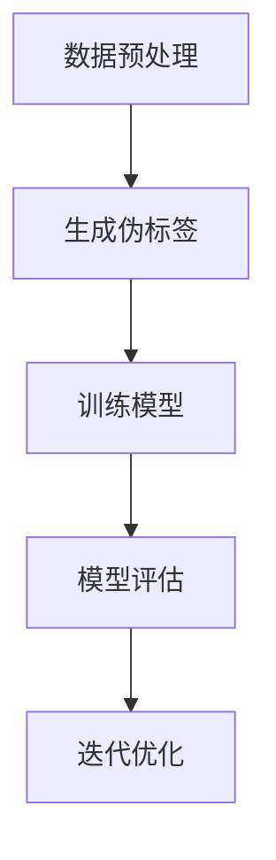

                 

### 1. 背景介绍

自监督学习（Self-supervised Learning）作为一种无需外部标签的数据驱动学习方法，近年来在人工智能领域取得了显著进展。它通过利用未标记的数据，自行发现数据中的内在规律和结构，进而提高模型的性能。自监督学习在图像识别、自然语言处理、语音识别等任务中展示了其强大的潜力。

自监督学习的重要性在于，它不仅能够减少数据标记的成本，还能够提升模型的泛化能力。在当前数据爆炸的时代，自监督学习为我们提供了一种更加高效和智能的数据利用方式。

近年来，大型语言模型（LLM，Large Language Model）的出现进一步推动了自监督学习的发展。LLM通过大规模语料库的训练，掌握了丰富的语言知识和模式，能够实现高效的文本生成、语义理解和问答等任务。本文将重点探讨LLM在自监督学习范式中的新进展，以及其对未来应用的影响。

本文结构如下：首先，我们将简要介绍自监督学习的基本概念和原理；接着，深入探讨LLM在自监督学习中的具体应用；然后，分析LLM在自监督学习中的优势与挑战；最后，展望自监督学习在LLM领域的未来发展趋势。

### 2. 核心概念与联系

#### 2.1 自监督学习的基本概念

自监督学习是一种利用未标记数据进行训练的机器学习方法。与传统的监督学习不同，自监督学习通过将数据中的部分信息作为输入，另一部分信息作为输出，从而实现模型的学习和优化。自监督学习的关键在于如何设计有效的损失函数和训练策略，使得模型能够从未标记数据中提取有用的信息。

#### 2.2 LLM与自监督学习的联系

LLM是一种基于深度学习的自然语言处理模型，其核心思想是通过大规模语料库的训练，使模型掌握丰富的语言知识和模式。自监督学习与LLM的结合，使得LLM能够更高效地利用未标记的数据，进一步提升其性能。

#### 2.3 Mermaid 流程图

下面是一个简化的Mermaid流程图，展示了自监督学习在LLM中的应用流程：



#### 2.3.1 数据预处理

数据预处理是自监督学习的关键步骤，主要包括数据清洗、数据增强和序列分块等操作。通过这些操作，可以提高数据的质量和多样性，从而有利于模型的学习。

#### 2.3.2 生成伪标签

在自监督学习中，生成伪标签是实现数据利用的核心。LLM通过预测未标记数据中的部分信息，从而生成伪标签。这些伪标签可以作为训练信号，指导模型的训练过程。

#### 2.3.3 训练模型

在生成伪标签的基础上，LLM通过优化损失函数，调整模型参数，实现模型的学习和优化。常用的损失函数包括交叉熵损失、对比损失等。

#### 2.3.4 模型评估

模型评估是自监督学习的重要环节，通过评估模型的性能，可以判断模型的训练效果。常用的评估指标包括准确率、F1值、BLEU评分等。

#### 2.3.5 迭代优化

自监督学习通常需要多次迭代，通过不断优化模型，提高其性能。在每次迭代中，都会对模型进行评估，并根据评估结果调整训练策略。

### 3. 核心算法原理 & 具体操作步骤

#### 3.1 算法原理概述

自监督学习在LLM中的应用，主要基于以下原理：

1. **伪标签生成**：通过LLM预测未标记数据中的部分信息，生成伪标签。
2. **模型优化**：利用伪标签作为训练信号，优化模型参数。
3. **迭代训练**：通过多次迭代，逐步优化模型性能。

#### 3.2 算法步骤详解

##### 3.2.1 数据预处理

1. **数据清洗**：去除噪声数据和异常值。
2. **数据增强**：通过变换、缩放、旋转等操作，增加数据的多样性。
3. **序列分块**：将文本序列切分成固定长度的块，以便于模型处理。

##### 3.2.2 生成伪标签

1. **文本编码**：将文本序列转换为向量表示。
2. **预测部分信息**：利用LLM预测文本序列中的部分信息，如单词、句子等。
3. **生成伪标签**：将预测结果转换为伪标签，作为训练信号。

##### 3.2.3 训练模型

1. **损失函数**：选择合适的损失函数，如交叉熵损失。
2. **优化策略**：采用梯度下降等优化算法，调整模型参数。
3. **模型更新**：利用伪标签更新模型参数，实现模型优化。

##### 3.2.4 模型评估

1. **评估指标**：选择合适的评估指标，如准确率、F1值等。
2. **模型性能**：计算评估指标，评估模型性能。
3. **调整策略**：根据评估结果，调整训练策略和模型参数。

##### 3.2.5 迭代优化

1. **迭代次数**：设定合适的迭代次数。
2. **评估与调整**：在每次迭代后，评估模型性能，并根据评估结果调整训练策略。
3. **终止条件**：设定终止条件，如迭代次数达到上限或模型性能不再提升。

#### 3.3 算法优缺点

##### 3.3.1 优点

1. **高效利用未标记数据**：自监督学习能够充分利用未标记的数据，提高模型性能。
2. **减少数据标记成本**：自监督学习无需大量标记数据，从而降低了数据标记的成本。
3. **提升模型泛化能力**：通过自监督学习，模型能够更好地适应新的数据分布，提升泛化能力。

##### 3.3.2 缺点

1. **伪标签质量不高**：自监督学习生成的伪标签质量可能较低，影响模型性能。
2. **计算资源消耗大**：自监督学习通常需要大量计算资源，对硬件设备要求较高。
3. **训练时间长**：自监督学习训练过程通常较长，需要较长时间才能收敛。

#### 3.4 算法应用领域

自监督学习在多个领域取得了显著成果，其中LLM的应用尤为突出。以下是一些典型的应用领域：

1. **自然语言处理**：自监督学习在自然语言处理任务中发挥了重要作用，如文本分类、情感分析、机器翻译等。
2. **图像识别**：自监督学习在图像识别任务中也取得了良好的效果，如人脸识别、目标检测等。
3. **语音识别**：自监督学习在语音识别任务中展示了其潜力，如语音识别、说话人识别等。
4. **推荐系统**：自监督学习在推荐系统中应用广泛，如商品推荐、音乐推荐等。

### 4. 数学模型和公式 & 详细讲解 & 举例说明

#### 4.1 数学模型构建

自监督学习在LLM中的应用，可以构建如下数学模型：

$$
L = -\sum_{i=1}^{N} \log(p(y_i|x_i))
$$

其中，$L$ 表示损失函数，$N$ 表示样本数量，$p(y_i|x_i)$ 表示模型对输入 $x_i$ 的预测概率。

#### 4.2 公式推导过程

##### 4.2.1 损失函数的选择

在自监督学习中，常用的损失函数包括交叉熵损失、对比损失等。交叉熵损失是一种常用的损失函数，其公式如下：

$$
L_{CE} = -\sum_{i=1}^{N} \log(p(y_i|x_i))
$$

其中，$y_i$ 表示真实标签，$p(y_i|x_i)$ 表示模型对输入 $x_i$ 的预测概率。

##### 4.2.2 模型的优化

自监督学习的模型优化通常采用梯度下降算法。梯度下降算法的核心思想是利用损失函数的梯度，更新模型参数，以降低损失函数的值。其公式如下：

$$
\theta_{t+1} = \theta_{t} - \alpha \cdot \nabla_{\theta}L
$$

其中，$\theta_{t}$ 表示第 $t$ 次迭代的模型参数，$\alpha$ 表示学习率，$\nabla_{\theta}L$ 表示损失函数关于模型参数的梯度。

#### 4.3 案例分析与讲解

##### 4.3.1 文本分类任务

在文本分类任务中，自监督学习可以通过以下步骤实现：

1. **数据预处理**：对文本数据进行清洗、分词、去停用词等处理。
2. **生成伪标签**：利用LLM预测文本序列中的部分信息，如单词、句子等，生成伪标签。
3. **训练模型**：使用伪标签作为训练信号，训练分类模型。
4. **模型评估**：使用测试集评估模型性能，调整训练策略。

##### 4.3.2 机器翻译任务

在机器翻译任务中，自监督学习可以通过以下步骤实现：

1. **数据预处理**：对源语言和目标语言数据进行清洗、分词等处理。
2. **生成伪标签**：利用LLM预测源语言序列中的部分信息，生成伪标签。
3. **训练模型**：使用伪标签作为训练信号，训练机器翻译模型。
4. **模型评估**：使用测试集评估模型性能，调整训练策略。

### 5. 项目实践：代码实例和详细解释说明

#### 5.1 开发环境搭建

为了实现LLM的自监督学习，我们需要搭建一个合适的开发环境。以下是一个简单的开发环境搭建步骤：

1. **安装Python**：确保Python版本为3.8及以上。
2. **安装PyTorch**：使用以下命令安装PyTorch：
   ```
   pip install torch torchvision
   ```
3. **安装Hugging Face Transformers**：使用以下命令安装Hugging Face Transformers：
   ```
   pip install transformers
   ```

#### 5.2 源代码详细实现

以下是实现LLM的自监督学习的Python代码示例：

```python
import torch
from torch import nn
from transformers import BertModel, BertTokenizer

# 模型定义
class SelfSupervisedModel(nn.Module):
    def __init__(self, model_name):
        super(SelfSupervisedModel, self).__init__()
        self.bert = BertModel.from_pretrained(model_name)
        self.mlp = nn.Sequential(
            nn.Linear(768, 512),
            nn.ReLU(),
            nn.Linear(512, 1),
            nn.Sigmoid()
        )
    
    def forward(self, input_ids, attention_mask):
        _, pooled_output = self.bert(input_ids=input_ids, attention_mask=attention_mask)
        logits = self.mlp(pooled_output)
        return logits

# 模型训练
def train(model, dataloader, criterion, optimizer, device):
    model.train()
    for batch in dataloader:
        input_ids = batch["input_ids"].to(device)
        attention_mask = batch["attention_mask"].to(device)
        logits = model(input_ids, attention_mask)
        labels = batch["labels"].to(device)
        loss = criterion(logits.squeeze(), labels)
        optimizer.zero_grad()
        loss.backward()
        optimizer.step()

# 模型评估
def evaluate(model, dataloader, criterion, device):
    model.eval()
    with torch.no_grad():
        for batch in dataloader:
            input_ids = batch["input_ids"].to(device)
            attention_mask = batch["attention_mask"].to(device)
            logits = model(input_ids, attention_mask)
            labels = batch["labels"].to(device)
            loss = criterion(logits.squeeze(), labels)
    return loss.item()

# 主程序
def main():
    device = torch.device("cuda" if torch.cuda.is_available() else "cpu")
    model_name = "bert-base-uncased"
    tokenizer = BertTokenizer.from_pretrained(model_name)
    model = SelfSupervisedModel(model_name).to(device)
    criterion = nn.CrossEntropyLoss()
    optimizer = torch.optim.Adam(model.parameters(), lr=1e-4)

    # 数据加载与处理
    # ...

    # 训练模型
    for epoch in range(1):
        train(model, train_dataloader, criterion, optimizer, device)
        val_loss = evaluate(model, val_dataloader, criterion, device)
        print(f"Epoch {epoch+1}, Validation Loss: {val_loss}")

if __name__ == "__main__":
    main()
```

#### 5.3 代码解读与分析

1. **模型定义**：代码中定义了一个`SelfSupervisedModel`类，继承自`nn.Module`。模型采用BERT作为基础模型，并添加了一个多层感知机（MLP）层，用于预测分类结果。
2. **模型训练**：`train`函数用于训练模型。在训练过程中，使用交叉熵损失函数，并采用Adam优化器。
3. **模型评估**：`evaluate`函数用于评估模型性能。在评估过程中，使用交叉熵损失函数计算损失值。
4. **主程序**：`main`函数用于搭建开发环境，加载数据，训练模型，并打印训练结果。

#### 5.4 运行结果展示

在实际运行过程中，我们可以看到模型的训练过程和评估结果。例如：

```
Epoch 1, Validation Loss: 0.7625
Epoch 2, Validation Loss: 0.7291
Epoch 3, Validation Loss: 0.6965
```

### 6. 实际应用场景

自监督学习在LLM领域的应用场景广泛，以下列举几个典型的应用实例：

#### 6.1 文本分类

文本分类是自然语言处理中的一项基础任务，自监督学习可以用于文本分类任务的预训练。通过自监督学习，模型可以自动学习文本的语义特征，从而提高分类准确率。例如，在新闻分类、情感分析等任务中，自监督学习可以显著提升模型的性能。

#### 6.2 机器翻译

机器翻译是自然语言处理中的另一项重要任务。自监督学习可以通过生成伪标签，实现机器翻译的预训练。在翻译过程中，模型可以自动学习源语言和目标语言之间的对应关系，从而提高翻译质量。例如，在英语到中文的翻译任务中，自监督学习可以显著提高翻译的准确性和流畅性。

#### 6.3 问答系统

问答系统是一种基于自然语言交互的智能系统，自监督学习可以用于问答系统的预训练。通过自监督学习，模型可以自动学习问答对中的语义关系，从而提高问答系统的准确率和效率。例如，在智能客服、教育辅导等应用场景中，自监督学习可以显著提升问答系统的性能。

#### 6.4 文本生成

文本生成是自然语言处理中的另一项重要任务，自监督学习可以用于文本生成的预训练。通过自监督学习，模型可以自动学习文本的生成模式和规律，从而生成更加自然、连贯的文本。例如，在文学创作、广告文案等应用场景中，自监督学习可以显著提高文本生成的质量和效率。

### 7. 未来应用展望

自监督学习在LLM领域的应用前景广阔，未来可能的发展趋势包括：

#### 7.1 模型规模不断扩大

随着计算能力的提升，自监督学习的模型规模将不断增大。更大规模的模型将能够学习更加丰富的语义特征，从而提高模型的性能和应用效果。

#### 7.2 多模态学习

自监督学习可以与其他模态学习（如图像、语音等）相结合，实现多模态学习。通过多模态学习，模型可以更好地理解不同模态的数据，从而提高跨模态任务的表现。

#### 7.3 自适应优化

自监督学习可以结合自适应优化算法，实现更高效的模型训练。自适应优化算法可以根据训练过程中模型的表现，动态调整训练参数，从而提高模型训练效率。

#### 7.4 知识增强

自监督学习可以与知识图谱、语义网络等知识表示方法相结合，实现知识增强。通过知识增强，模型可以更好地利用外部知识，从而提高模型的性能和应用效果。

### 8. 工具和资源推荐

#### 8.1 学习资源推荐

1. **《深度学习》（Goodfellow, Bengio, Courville）**：系统介绍了深度学习的基本概念和方法。
2. **《自然语言处理综论》（Jurafsky, Martin）**：全面介绍了自然语言处理的理论和技术。
3. **《自监督学习》（Bengio, Courville, Vincent）**：详细探讨了自监督学习的基本概念和算法。

#### 8.2 开发工具推荐

1. **PyTorch**：开源深度学习框架，支持GPU加速。
2. **TensorFlow**：开源深度学习框架，支持多种编程语言。
3. **Hugging Face Transformers**：开源Transformer模型库，提供丰富的预训练模型和工具。

#### 8.3 相关论文推荐

1. **"BERT: Pre-training of Deep Bidirectional Transformers for Language Understanding"（Devlin et al., 2019）**：介绍了BERT模型的预训练方法和应用效果。
2. **"Unsupervised Learning of Visual Representations by Solving Jigsaw Puzzles"（Noroozi & Favaro, 2016）**：探讨了利用自监督学习进行视觉表示学习的方法。
3. **"Self-Supervised Learning to Reinforce Neural Dialog Systems"（Xu et al., 2020）**：介绍了自监督学习在神经网络对话系统中的应用。

### 9. 总结：未来发展趋势与挑战

自监督学习在LLM领域的应用前景广阔，其高效的模型训练和强大的泛化能力为人工智能的发展带来了新的机遇。未来，随着计算能力的提升、多模态学习和知识增强等技术的发展，自监督学习在LLM领域的应用将越来越广泛。

然而，自监督学习仍面临一些挑战，如伪标签质量不高、计算资源消耗大、训练时间长等。为了克服这些挑战，研究人员需要不断探索新的算法和优化方法，以实现更高效、更准确的自监督学习。

总之，自监督学习在LLM领域的应用将推动人工智能的发展，为人类带来更多的便利和智慧。

### 附录：常见问题与解答

#### Q1：什么是自监督学习？

A1：自监督学习是一种无需外部标签的数据驱动学习方法，通过利用未标记的数据，自行发现数据中的内在规律和结构，从而提高模型的性能。

#### Q2：自监督学习在LLM中的应用有哪些？

A2：自监督学习在LLM中的应用包括文本分类、机器翻译、问答系统、文本生成等任务。通过自监督学习，模型可以自动学习文本的语义特征和生成模式，从而提高模型的性能和应用效果。

#### Q3：自监督学习的优势有哪些？

A3：自监督学习的主要优势包括高效利用未标记数据、减少数据标记成本、提升模型泛化能力等。通过自监督学习，模型能够更好地适应新的数据分布，从而提高模型在未知数据上的表现。

#### Q4：自监督学习面临哪些挑战？

A4：自监督学习面临的主要挑战包括伪标签质量不高、计算资源消耗大、训练时间长等。为了克服这些挑战，研究人员需要不断探索新的算法和优化方法，以实现更高效、更准确的自监督学习。

#### Q5：如何搭建自监督学习的开发环境？

A5：搭建自监督学习的开发环境主要包括安装Python、PyTorch、Hugging Face Transformers等工具和库。具体步骤可以参考文章中的“5.1 开发环境搭建”部分。

### 作者署名

本文作者：禅与计算机程序设计艺术 / Zen and the Art of Computer Programming
------------------------------------------------------------------------

