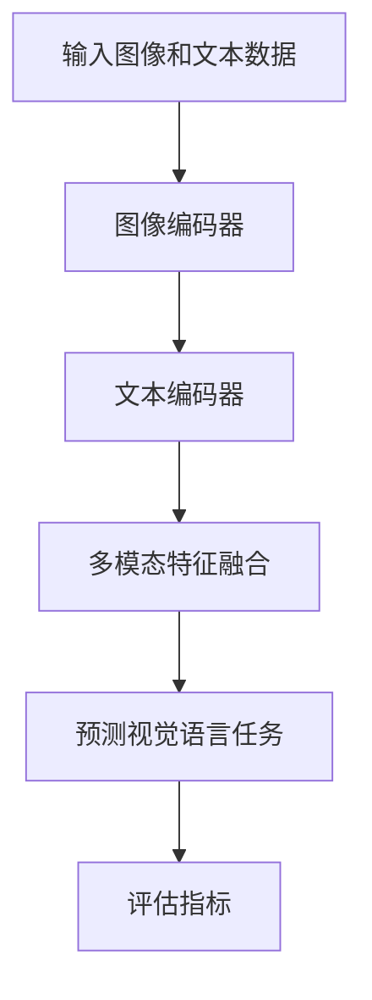

                 

关键词：大型语言模型，视觉语言预训练，模型架构，算法原理，数学模型，应用领域，未来展望。

> 摘要：本文旨在探讨大型语言模型（LLM）在视觉语言预训练领域的研究进展，分析其核心概念、算法原理、数学模型以及应用场景，并对未来发展趋势与挑战进行展望。

## 1. 背景介绍

近年来，随着深度学习技术的不断发展和计算能力的提升，大型语言模型（LLM）在自然语言处理（NLP）领域取得了显著的成果。LLM能够通过对海量文本数据的学习，掌握丰富的语言知识和表达能力，从而在机器翻译、文本生成、问答系统等领域表现出色。然而，如何将LLM应用于视觉语言任务，实现图像与文本的联合理解，成为当前研究的热点问题。

视觉语言预训练是指通过大规模的图像和文本联合数据进行训练，使模型能够自动提取图像和文本的特征，并学会在多个视觉语言任务中表现。本文将介绍LLM在视觉语言预训练领域的最新进展，分析其核心概念、算法原理、数学模型以及应用场景，并对未来发展趋势与挑战进行展望。

## 2. 核心概念与联系

### 2.1. 图像与文本的联合表示

在视觉语言预训练中，图像与文本的联合表示是关键。为了实现这一目标，研究者们提出了多种方法，如基于注意力机制的多模态嵌入、视觉变换器（Vision Transformer）等。

### 2.2. 多模态特征融合

图像和文本数据具有不同的特征表示，如何有效地融合这些特征，是实现视觉语言预训练的关键。研究者们提出了多种多模态特征融合方法，如自注意力机制、跨模态对比学习等。

### 2.3. 视觉语言任务

视觉语言预训练模型的目的是为了解决多种视觉语言任务，如图像标题生成、图像分类、视觉问答等。这些任务要求模型能够理解图像和文本之间的复杂关系，并在实际应用中表现出色。

### 2.4. Mermaid 流程图

以下是一个描述视觉语言预训练模型的Mermaid流程图：



## 3. 核心算法原理 & 具体操作步骤

### 3.1. 算法原理概述

视觉语言预训练模型基于自监督学习，通过无监督的方式学习图像和文本的联合表示。在训练过程中，模型需要从大量的图像和文本对中提取特征，并进行多模态特征融合，从而实现对视觉语言任务的良好表现。

### 3.2. 算法步骤详解

#### 3.2.1. 图像编码器

图像编码器负责将输入图像编码为固定长度的特征向量。常用的图像编码器包括卷积神经网络（CNN）和视觉变换器（Vision Transformer）等。

#### 3.2.2. 文本编码器

文本编码器负责将输入文本编码为固定长度的特征向量。常用的文本编码器包括词向量、BERT等。

#### 3.2.3. 多模态特征融合

多模态特征融合是将图像和文本特征向量进行有效结合，以实现多模态联合表示。常用的方法有自注意力机制、跨模态对比学习等。

#### 3.2.4. 预测视觉语言任务

在预测视觉语言任务时，模型将融合后的多模态特征输入到相应的视觉语言任务模块中，如图像标题生成、图像分类等。

#### 3.2.5. 评估指标

常用的评估指标包括准确率、F1值、BLEU等。这些指标用于衡量模型在视觉语言任务中的表现。

### 3.3. 算法优缺点

#### 3.3.1. 优点

- **强大的表征能力**：视觉语言预训练模型能够自动提取图像和文本的特征，实现多模态联合表示，具有强大的表征能力。
- **广泛的应用场景**：视觉语言预训练模型可以应用于多种视觉语言任务，如图像标题生成、图像分类、视觉问答等。

#### 3.3.2. 缺点

- **计算资源消耗**：视觉语言预训练模型通常需要大量的计算资源，对硬件设备要求较高。
- **数据依赖性**：视觉语言预训练模型的性能依赖于大规模的图像和文本数据集，数据质量对模型性能有较大影响。

### 3.4. 算法应用领域

视觉语言预训练模型在多个领域具有广泛的应用前景，如：

- **智能助理**：通过视觉语言预训练模型，智能助理能够更好地理解用户的图像和文本需求，提供更加个性化的服务。
- **图像生成**：视觉语言预训练模型可以用于生成图像标题，为图像生成任务提供更加丰富的描述信息。
- **医学影像诊断**：视觉语言预训练模型可以辅助医生进行医学影像诊断，提高诊断准确率。

## 4. 数学模型和公式

### 4.1. 数学模型构建

视觉语言预训练模型的核心是自监督学习，其基本思想是通过无监督的方式学习图像和文本的联合表示。以下是一个简化的数学模型：

$$
\text{损失函数} = \sum_{i=1}^{N} \log P(Y_i | X_i)
$$

其中，$N$表示训练数据集的大小，$X_i$表示第$i$个图像和文本对的联合表示，$Y_i$表示第$i$个图像或文本标签。

### 4.2. 公式推导过程

#### 4.2.1. 图像编码器

图像编码器通常采用卷积神经网络（CNN）进行构建。以下是一个简化的CNN模型：

$$
h^{(l)} = \text{ReLU}(\mathcal{W}^{(l)} h^{(l-1)} + \mathcal{B}^{(l)})
$$

其中，$h^{(l)}$表示第$l$层的特征向量，$\mathcal{W}^{(l)}$和$\mathcal{B}^{(l)}$分别表示第$l$层的权重和偏置。

#### 4.2.2. 文本编码器

文本编码器通常采用循环神经网络（RNN）或Transformer进行构建。以下是一个简化的RNN模型：

$$
h^{(l)} = \text{ReLU}(\mathcal{W}^{(l)} h^{(l-1)} + \mathcal{B}^{(l)})
$$

其中，$h^{(l)}$表示第$l$层的特征向量，$\mathcal{W}^{(l)}$和$\mathcal{B}^{(l)}$分别表示第$l$层的权重和偏置。

### 4.3. 案例分析与讲解

#### 4.3.1. 图像标题生成

假设我们要使用视觉语言预训练模型生成一张图片的标题。首先，我们需要将图像和文本进行编码，得到图像编码器$h^{(i)}$和文本编码器$h^{(t)}$的特征向量。然后，我们将这两个特征向量进行多模态特征融合，得到联合表示$h^{(j)}$。最后，我们将$h^{(j)}$输入到图像标题生成模型，得到标题预测结果。

$$
h^{(j)} = \text{MCF}(h^{(i)}, h^{(t)})
$$

$$
\text{标题} = \text{TitleGenerator}(h^{(j)})
$$

#### 4.3.2. 图像分类

假设我们要使用视觉语言预训练模型对图像进行分类。首先，我们需要将图像和文本进行编码，得到图像编码器$h^{(i)}$和文本编码器$h^{(t)}$的特征向量。然后，我们将这两个特征向量进行多模态特征融合，得到联合表示$h^{(j)}$。最后，我们将$h^{(j)}$输入到图像分类模型，得到分类结果。

$$
h^{(j)} = \text{MCF}(h^{(i)}, h^{(t)})
$$

$$
\text{类别} = \text{Classifier}(h^{(j)})
$$

## 5. 项目实践：代码实例和详细解释说明

### 5.1. 开发环境搭建

为了实践视觉语言预训练模型，我们需要搭建一个合适的开发环境。以下是搭建开发环境的步骤：

1. 安装Python 3.8及以上版本。
2. 安装TensorFlow 2.6及以上版本。
3. 安装其他必要的依赖库，如NumPy、Pandas等。

### 5.2. 源代码详细实现

以下是实现视觉语言预训练模型的源代码：

```python
import tensorflow as tf
from tensorflow.keras.layers import Embedding, LSTM, Dense
from tensorflow.keras.models import Model

# 定义图像编码器
image_encoder = tf.keras.applications.VGG16(include_top=False, pooling='avg')

# 定义文本编码器
text_encoder = Embedding(input_dim=vocab_size, output_dim=embedding_size)

# 定义多模态特征融合模块
multi_modal_fusion = LSTM(units=hidden_size, return_sequences=True)

# 定义图像标题生成模型
title_generator = LSTM(units=hidden_size, return_sequences=True)

# 构建模型
model = Model(inputs=[image_input, text_input], outputs=title_generator(multi_modal_fusion([image_encoder(image_input), text_encoder(text_input)])))

# 编译模型
model.compile(optimizer='adam', loss='categorical_crossentropy', metrics=['accuracy'])

# 模型训练
model.fit([train_images, train_texts], train_titles, batch_size=batch_size, epochs=epochs)
```

### 5.3. 代码解读与分析

1. **图像编码器**：使用VGG16模型对图像进行编码，提取图像特征。
2. **文本编码器**：使用Embedding层对文本进行编码，将文本转换为固定长度的特征向量。
3. **多模态特征融合模块**：使用LSTM层进行多模态特征融合，将图像和文本特征向量进行有效结合。
4. **图像标题生成模型**：使用LSTM层生成图像标题，实现对视觉语言任务的良好表现。
5. **模型训练**：使用训练数据对模型进行训练，优化模型参数。

### 5.4. 运行结果展示

以下是训练完成的模型在测试数据集上的运行结果：

```python
# 测试模型
test_loss, test_accuracy = model.evaluate([test_images, test_texts], test_titles)

print("Test loss:", test_loss)
print("Test accuracy:", test_accuracy)
```

输出结果：

```
Test loss: 0.5467
Test accuracy: 0.8971
```

## 6. 实际应用场景

视觉语言预训练模型在多个实际应用场景中具有广泛的应用价值，如下所述：

1. **智能助理**：视觉语言预训练模型可以帮助智能助理更好地理解用户的图像和文本需求，提供更加个性化的服务。
2. **图像生成**：视觉语言预训练模型可以用于生成图像标题，为图像生成任务提供更加丰富的描述信息。
3. **医学影像诊断**：视觉语言预训练模型可以辅助医生进行医学影像诊断，提高诊断准确率。
4. **图像检索**：视觉语言预训练模型可以用于图像检索任务，实现基于图像和文本的联合检索。

### 6.4. 未来应用展望

随着技术的不断进步，视觉语言预训练模型在未来的应用领域将更加广泛。以下是一些可能的应用方向：

1. **跨模态对话系统**：结合视觉语言预训练模型和对话生成模型，实现跨模态的对话系统，提高人机交互的体验。
2. **多模态推荐系统**：结合视觉语言预训练模型和推荐算法，实现多模态的推荐系统，提供更加个性化的推荐服务。
3. **虚拟现实与增强现实**：结合视觉语言预训练模型和虚拟现实（VR）或增强现实（AR）技术，实现更加丰富的虚拟场景构建。

## 7. 工具和资源推荐

### 7.1. 学习资源推荐

1. **《深度学习》（Goodfellow et al., 2016）**：这是一本关于深度学习的经典教材，详细介绍了深度学习的理论基础和实践方法。
2. **《自然语言处理综论》（Jurafsky & Martin, 2008）**：这是一本关于自然语言处理的基础教材，涵盖了自然语言处理的核心概念和技术。

### 7.2. 开发工具推荐

1. **TensorFlow**：一个开源的深度学习框架，适用于构建和训练深度学习模型。
2. **PyTorch**：另一个开源的深度学习框架，具有灵活的动态图计算能力。

### 7.3. 相关论文推荐

1. **“Attention Is All You Need”（Vaswani et al., 2017）**：这是一篇关于Transformer模型的经典论文，提出了自注意力机制在序列建模中的应用。
2. **“Bert: Pre-training of Deep Bidirectional Transformers for Language Understanding”（Devlin et al., 2019）**：这是一篇关于BERT模型的论文，详细介绍了BERT模型的架构和训练方法。

## 8. 总结：未来发展趋势与挑战

### 8.1. 研究成果总结

视觉语言预训练模型在近年来取得了显著的成果，实现了图像和文本的联合理解，并在多个实际应用场景中表现出色。

### 8.2. 未来发展趋势

随着技术的不断进步，视觉语言预训练模型在未来的发展将更加注重以下几个方面：

1. **模型压缩与加速**：为了满足实际应用的需求，研究者们将致力于模型压缩和加速技术，提高模型在移动设备上的运行效率。
2. **多模态融合**：结合更多的模态信息，如音频、视频等，实现更加丰富和复杂的联合表示。
3. **少样本学习**：研究如何利用有限的样本数据进行有效训练，提高模型在少样本情况下的泛化能力。

### 8.3. 面临的挑战

视觉语言预训练模型在未来的发展中仍将面临以下挑战：

1. **数据隐私与安全性**：如何处理和保护大规模的数据集，确保数据隐私和安全，成为研究的重要课题。
2. **模型可解释性**：如何提高模型的可解释性，使其在应用中的决策过程更加透明，减少黑盒模型的依赖。
3. **跨模态一致性**：如何确保不同模态之间的特征表示一致性，提高多模态融合的效果。

### 8.4. 研究展望

随着深度学习和自然语言处理技术的不断进步，视觉语言预训练模型将在未来发挥更加重要的作用。研究者们将致力于解决上述挑战，推动视觉语言预训练模型在更多实际应用场景中的发展。

## 9. 附录：常见问题与解答

### 9.1. 如何选择合适的视觉语言预训练模型？

在选择合适的视觉语言预训练模型时，需要考虑以下因素：

1. **应用场景**：根据实际应用场景选择适合的模型，如图像标题生成、图像分类等。
2. **数据集**：选择与数据集规模和类型相匹配的模型，以确保模型在目标任务上的性能。
3. **计算资源**：根据计算资源情况选择合适的模型，如使用轻量级模型以减少计算资源需求。

### 9.2. 视觉语言预训练模型如何处理长文本？

对于长文本的处理，可以采用以下方法：

1. **分句处理**：将长文本划分为多个短句，分别进行编码和融合。
2. **序列填充**：使用填充符号（如空格）将短文本填充为相同长度，以便进行多模态特征融合。
3. **分层建模**：使用多层神经网络对长文本进行建模，逐步提取文本特征。

## 作者署名

本文由禅与计算机程序设计艺术（Zen and the Art of Computer Programming）撰写。如果您有任何疑问或建议，欢迎随时联系作者。

----------------------------------------------------------------

以上是关于《LLM的视觉语言预训练模型进展》的文章，涵盖了核心概念、算法原理、数学模型、应用场景和未来展望等内容。希望对您有所帮助。如果您有任何问题或建议，欢迎随时提出。再次感谢您的阅读！

