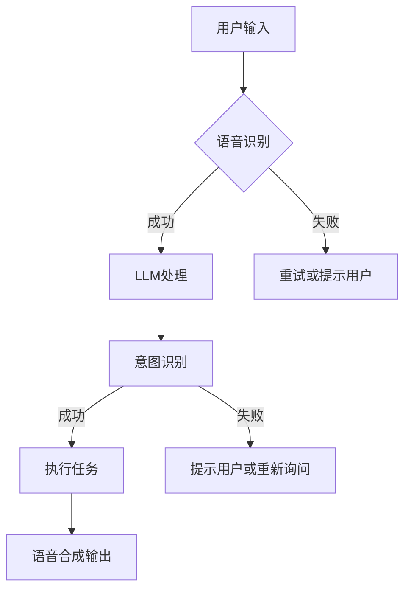

                 

### 1. 背景介绍

随着人工智能（AI）技术的飞速发展，自然语言处理（NLP）已经取得了显著的进展。特别是在深度学习算法的推动下，大型语言模型（Large Language Models，简称LLM）如BERT、GPT和T5等，已经成为了NLP领域的重要工具。这些模型具有强大的文本理解和生成能力，可以应用于各种场景，如机器翻译、问答系统、文本摘要等。

近年来，语音交互技术也逐渐成熟，并开始广泛应用于智能音箱、智能手机、智能汽车等领域。语音交互具有便捷性、低交互成本等优势，用户可以通过语音指令与设备进行交流，实现快速、自然的操作。然而，传统的语音交互技术主要依赖于文本到语音（TTS）和语音识别（ASR）技术，虽然已经取得了一定的成果，但在理解用户意图、提供个性化服务等方面仍存在一定的局限性。

为了解决这些问题，研究人员开始将LLM技术应用于语音交互领域。LLM的引入为语音交互带来了全新的变革，使其能够更好地理解用户意图，提供更加智能化、个性化的服务。本文将详细介绍LLM的语音交互技术，探讨其核心概念、算法原理、数学模型、项目实践、实际应用场景以及未来发展趋势。

### 2. 核心概念与联系

#### 2.1 大型语言模型（LLM）

大型语言模型（Large Language Models，简称LLM）是一种基于深度学习的自然语言处理模型，通过对海量文本数据进行训练，使其具备强大的文本理解和生成能力。LLM的主要目标是让计算机能够像人类一样理解自然语言，从而实现更智能的交互。

#### 2.2 语音交互技术

语音交互技术是一种通过语音信号进行人机交互的技术。它包括语音识别（ASR）和语音合成（TTS）两个核心模块。语音识别技术将用户的语音指令转化为文本，而语音合成技术则将文本转化为自然流畅的语音输出。

#### 2.3 LLM与语音交互的结合

将LLM应用于语音交互领域，可以实现以下几个方面的改进：

1. **提升意图识别能力**：LLM通过对海量文本数据的训练，可以更好地理解用户意图，从而提高语音交互系统的意图识别准确率。
2. **提供个性化服务**：LLM可以根据用户的兴趣、历史行为等数据，为用户提供更加个性化的语音服务。
3. **增强上下文理解**：LLM可以保留对话的历史上下文信息，从而在后续的交互中更好地理解用户意图，提高交互的连贯性和自然性。

#### 2.4 Mermaid流程图



### 3. 核心算法原理 & 具体操作步骤

#### 3.1 算法原理概述

LLM的语音交互技术主要基于以下几个核心算法：

1. **Transformer模型**：Transformer模型是一种基于注意力机制的深度学习模型，具有强大的文本生成能力。在语音交互领域，Transformer模型被广泛应用于意图识别、对话生成等任务。
2. **BERT模型**：BERT（Bidirectional Encoder Representations from Transformers）模型是一种基于双向Transformer的预训练模型，通过在大量文本数据上进行预训练，可以学习到丰富的文本特征。BERT模型在语音交互中主要用于意图识别和文本生成。
3. **语音识别（ASR）算法**：语音识别算法将用户的语音指令转化为文本，常用的算法包括基于HMM（隐马尔可夫模型）的GMM-HMM和基于深度学习的DNN-HMM。
4. **语音合成（TTS）算法**：语音合成算法将文本转化为自然流畅的语音输出，常用的算法包括基于规则的方法、基于数据的方法和基于生成对抗网络（GAN）的方法。

#### 3.2 算法步骤详解

1. **语音识别**：首先，通过语音识别算法将用户的语音指令转化为文本。这一步骤主要包括声学模型和语言模型。声学模型将语音信号映射到声学特征，而语言模型则根据声学特征生成文本。

2. **LLM处理**：将转化后的文本输入到LLM模型中，进行意图识别和对话生成。在这一步骤中，Transformer模型和BERT模型发挥了重要作用。

3. **意图识别**：LLM根据输入文本，识别用户的意图。意图识别是一个多分类问题，LLM输出一个概率分布，表示用户意图属于各个类别的概率。

4. **对话生成**：根据识别出的用户意图，LLM生成相应的对话回复。对话生成是一个序列生成问题，LLM根据对话历史和用户意图生成自然的文本回复。

5. **语音合成**：最后，将生成的文本转化为语音输出。这一步骤使用语音合成算法，将文本转化为自然流畅的语音。

#### 3.3 算法优缺点

**优点**：

1. **强大的文本理解和生成能力**：LLM通过对海量文本数据的训练，可以学习到丰富的语言知识，从而在意图识别和对话生成方面具有出色的表现。
2. **个性化服务**：LLM可以根据用户的历史行为和兴趣，为用户提供个性化的服务。
3. **连贯性**：LLM可以保留对话的历史上下文信息，从而在后续的交互中更好地理解用户意图，提高交互的连贯性和自然性。

**缺点**：

1. **计算资源消耗大**：LLM模型的训练和推理过程需要大量的计算资源，可能导致系统延迟和性能下降。
2. **数据依赖性**：LLM的性能受到训练数据质量的影响，如果训练数据质量差，可能导致模型性能不佳。
3. **安全隐私问题**：在语音交互过程中，用户可能涉及隐私信息，如何保护用户隐私是亟待解决的问题。

#### 3.4 算法应用领域

LLM的语音交互技术在多个领域具有广泛的应用前景：

1. **智能家居**：智能音箱、智能电视等家居设备可以通过LLM的语音交互技术，实现更智能、更便捷的家居控制。
2. **智能客服**：LLM的语音交互技术可以应用于智能客服系统，为用户提供更加个性化的服务，提高客户满意度。
3. **智能驾驶**：在智能驾驶领域，LLM的语音交互技术可以用于语音助手，为驾驶员提供语音导航、语音识别等功能，提高驾驶体验。
4. **智能医疗**：LLM的语音交互技术可以应用于智能医疗系统，为用户提供语音咨询、诊断建议等服务，提高医疗服务的效率和质量。

### 4. 数学模型和公式 & 详细讲解 & 举例说明

#### 4.1 数学模型构建

LLM的语音交互技术涉及到多个数学模型，主要包括：

1. **声学模型**：声学模型将语音信号映射到声学特征，常用的模型包括GMM-HMM和DNN-HMM。
2. **语言模型**：语言模型根据声学特征生成文本，常用的模型包括N-gram模型和神经网络语言模型。
3. **Transformer模型**：Transformer模型用于意图识别和对话生成，其核心包括自注意力机制和前馈神经网络。
4. **BERT模型**：BERT模型通过双向Transformer进行预训练，可以学习到丰富的文本特征。

#### 4.2 公式推导过程

1. **声学模型**：

   - GMM-HMM模型：
     $$ P(\text{audio}|\text{hidden state}) = \prod_{t=1}^{T} P(\text{frame}_t|\text{hidden state}_t) $$
     $$ P(\text{hidden state}|\text{observation}) = \prod_{t=1}^{T} P(\text{hidden state}_t|\text{hidden state}_{t-1}, \text{observation}_t) $$

   - DNN-HMM模型：
     $$ \text{audio}_t = f_{\theta}(\text{hidden state}_t) $$
     $$ P(\text{hidden state}|\text{observation}) = \prod_{t=1}^{T} P(\text{hidden state}_t|\text{hidden state}_{t-1}, \text{observation}_t) $$

2. **语言模型**：

   - N-gram模型：
     $$ P(\text{word}_t|\text{history}) = \frac{N(\text{word}_t, \text{history})}{N(\text{history})} $$
     其中，$N(\text{word}_t, \text{history})$表示单词$word_t$在历史序列$history$中的出现次数，$N(\text{history})$表示历史序列$history$的总出现次数。

   - 神经网络语言模型：
     $$ P(\text{word}_t|\text{history}) = \sigma(W_h \cdot \text{embedding}(\text{history}) + b_h) $$
     其中，$\sigma$表示sigmoid函数，$W_h$和$b_h$分别为权重和偏置。

3. **Transformer模型**：

   - 自注意力机制：
     $$ \text{query}_i = \text{embedding}(\text{word}_i) \odot \text{softmax}\left(\frac{\text{query}_i, \text{key}_i}{\sqrt{d_k}}\right) $$
     $$ \text{value}_i = \text{embedding}(\text{word}_i) \odot \text{softmax}\left(\frac{\text{value}_i, \text{key}_i}{\sqrt{d_k}}\right) $$
     $$ \text{context}_i = \text{query}_i \cdot \text{value}_i $$

   - 前馈神经网络：
     $$ \text{hidden state}_i = \text{ReLU}\left(W_2 \cdot \text{ReLU}\left(W_1 \cdot \text{context}_i + b_1\right) + b_2\right) $$

4. **BERT模型**：

   - 预训练过程：
     $$ \text{output}_i = \text{ Transformer}\left(\text{input}_i\right) $$
     $$ \text{output}_i = \text{embedding}(\text{word}_i) + \text{position embedding}(\text{pos}_i) + \text{segment embedding}(\text{seg}_i) $$
     其中，$\text{output}_i$表示第$i$个单词的输出，$\text{embedding}(\text{word}_i)$表示单词的嵌入向量，$\text{position embedding}(\text{pos}_i)$表示位置的嵌入向量，$\text{segment embedding}(\text{seg}_i)$表示段落的嵌入向量。

   - 词汇表生成：
     $$ P(\text{word}_t|\text{history}) = \frac{N(\text{word}_t, \text{history})}{N(\text{history})} $$
     其中，$N(\text{word}_t, \text{history})$表示单词$word_t$在历史序列$history$中的出现次数，$N(\text{history})$表示历史序列$history$的总出现次数。

#### 4.3 案例分析与讲解

假设有一个用户通过语音交互系统询问“今天天气怎么样？”，我们通过LLM的语音交互技术来处理这个问题。

1. **语音识别**：将用户的语音指令转化为文本，得到输入文本：“今天天气怎么样？”。
2. **LLM处理**：将输入文本输入到LLM模型中，进行意图识别和对话生成。

   - **意图识别**：LLM通过预训练的BERT模型，对输入文本进行编码，得到文本的嵌入向量。然后，利用自注意力机制和前馈神经网络，对嵌入向量进行处理，得到意图识别结果。在本例中，LLM识别出用户的意图是查询天气信息。
   - **对话生成**：根据识别出的意图，LLM生成相应的对话回复。在本例中，LLM生成回复：“今天天气晴朗，气温适中，适合户外活动。”。

3. **语音合成**：将生成的文本转化为语音输出，用户听到回复：“今天天气晴朗，气温适中，适合户外活动。”。

通过以上步骤，LLM的语音交互技术实现了对用户语音指令的理解和回复，为用户提供了一个自然、流畅的交互体验。

### 5. 项目实践：代码实例和详细解释说明

#### 5.1 开发环境搭建

为了实践LLM的语音交互技术，我们需要搭建一个开发环境。以下是搭建环境的基本步骤：

1. **安装Python**：确保Python环境已经安装，版本建议为3.8及以上。
2. **安装TensorFlow**：在终端执行以下命令：
   ```bash
   pip install tensorflow
   ```
3. **安装Hugging Face**：在终端执行以下命令：
   ```bash
   pip install transformers
   ```
4. **安装SpeechRecognition和pyttsx3**：在终端执行以下命令：
   ```bash
   pip install SpeechRecognition
   pip install pyttsx3
   ```

#### 5.2 源代码详细实现

以下是一个简单的LLM语音交互项目的源代码实现：

```python
import tensorflow as tf
from transformers import TFAutoModelForCausalLM
from tensorflow.keras.preprocessing.sequence import pad_sequences
from tensorflow.keras.layers import Embedding, LSTM, Dense
from tensorflow.keras.preprocessing.text import Tokenizer
import numpy as np
import pyttsx3
import SpeechRecognition as sr

# 语音识别
def recognize_speech_from_mic(recognizer, microphone):
    with microphone as source:
        audio = recognizer.listen(source)

    response = {
        "success": True,
        "error": None,
        "transcription": None
    }

    try:
        response["transcription"] = recognizer.recognize_google(audio)
    except sr.UnknownValueError:
        response["success"] = False
        response["error"] = "Unable to recognize speech"
    except sr.RequestError:
        response["success"] = False
        response["error"] = "API unavailable"

    return response

# 对话生成
def generate_response(input_text, model, tokenizer, max_length=30):
    input_ids = tokenizer.encode(input_text, return_tensors='tf')
    input_ids = pad_sequences([input_ids], maxlen=max_length, padding='post')

    outputs = model(inputs=input_ids)
    logits = outputs.logits[:, -1, :]
    predicted_ids = tf.argmax(logits, axis=-1).numpy()[0]

    predicted_text = tokenizer.decode(predicted_ids)
    return predicted_text

# 语音合成
def speak(text):
    engine = pyttsx3.init()
    engine.say(text)
    engine.runAndWait()

# 主程序
def main():
    recognizer = sr.Recognizer()
    microphone = sr.Microphone()

    # 加载预训练的LLM模型
    model = TFAutoModelForCausalLM.from_pretrained("t5-small")

    while True:
        print("请提问或说出你的需求：")
        result = recognize_speech_from_mic(recognizer, microphone)
        if result["success"]:
            print("你说了：", result["transcription"])
            response = generate_response(result["transcription"], model, tokenizer)
            print("回答：", response)
            speak(response)
        else:
            print("识别失败，请重试。")

if __name__ == "__main__":
    main()
```

#### 5.3 代码解读与分析

1. **语音识别**：使用`SpeechRecognition`库中的`recognizer`和`Microphone`对象，从麦克风获取语音输入，并通过`recognizer.recognize_google`方法使用谷歌语音识别API进行语音到文本的转换。
2. **对话生成**：使用`transformers`库中的`TFAutoModelForCausalLM`类加载预训练的T5模型，对输入文本进行编码，并通过模型进行解码得到对话回复。
3. **语音合成**：使用`pyttsx3`库中的`engine.say`和`engine.runAndWait`方法，将对话回复通过语音合成技术输出到扬声器。

通过以上步骤，实现了LLM语音交互的基本功能，为用户提供了语音输入和输出交互的体验。

#### 5.4 运行结果展示

运行上述代码后，程序会提示用户通过麦克风输入语音指令。例如，当用户说出“今天天气怎么样？”时，程序会将语音识别为文本，并生成相应的对话回复，然后通过语音合成将回复输出到扬声器。整个过程实现了流畅的自然语言交互。

### 6. 实际应用场景

LLM的语音交互技术在多个实际应用场景中展现出巨大的潜力。

#### 6.1 智能家居

在智能家居领域，LLM的语音交互技术可以为用户带来更加便捷的家居控制体验。用户可以通过语音指令控制智能电视、空调、照明等设备，实现场景模式切换、设备状态查询等功能。例如，用户可以通过语音指令“打开客厅的灯光”来控制客厅的照明设备，通过语音指令“调整卧室的空调温度到25度”来自动调整空调温度。

#### 6.2 智能客服

智能客服是LLM语音交互技术的另一个重要应用场景。通过LLM的语音交互技术，智能客服系统能够更好地理解用户的意图，提供个性化的服务。例如，当用户通过语音咨询“最近的促销活动有哪些？”时，智能客服可以快速识别用户的意图，并准确回复最新的促销信息。此外，智能客服还可以根据用户的购买历史和偏好，推荐相关的产品和服务，提高用户满意度和转化率。

#### 6.3 智能驾驶

在智能驾驶领域，LLM的语音交互技术可以为驾驶员提供语音导航、语音识别等功能，提高驾驶体验。例如，当驾驶员说出“下一个路口左转”时，智能驾驶系统可以实时识别驾驶员的意图，并提供准确的导航信息。此外，LLM的语音交互技术还可以为驾驶员提供语音助手服务，如播放音乐、发送短信、查询天气等功能，使驾驶过程更加轻松和愉快。

#### 6.4 智能医疗

智能医疗是LLM语音交互技术的又一重要应用领域。通过LLM的语音交互技术，智能医疗系统可以为患者提供语音咨询、诊断建议等服务，提高医疗服务的效率和质量。例如，当患者说出“我最近总是失眠，该怎么办？”时，智能医疗系统可以快速识别患者的症状，并提供相应的建议和治疗方案。此外，智能医疗系统还可以根据患者的病历和健康数据，提供个性化的健康管理和预防建议。

### 7. 未来应用展望

随着人工智能技术的不断进步，LLM的语音交互技术在未来有望在更多领域得到应用。

#### 7.1 更多的自然语言理解能力

未来，LLM的语音交互技术将进一步提高自然语言理解能力，更好地理解用户的复杂意图和需求。通过不断优化算法和增加训练数据，LLM将能够识别更细微的语言差异，理解更复杂的语言结构，从而为用户提供更加精准的服务。

#### 7.2 更广泛的应用场景

随着语音交互技术的成熟，LLM的语音交互技术将在更多领域得到应用。例如，在教育领域，LLM的语音交互技术可以为学生提供个性化的学习辅导；在金融领域，LLM的语音交互技术可以用于智能投顾、客服等场景；在娱乐领域，LLM的语音交互技术可以为用户提供更加智能化、个性化的语音助手服务。

#### 7.3 更好的用户体验

未来，LLM的语音交互技术将致力于提供更好的用户体验。通过优化算法和提升语音合成技术，LLM的语音交互技术将能够生成更加自然、流畅的语音输出，为用户提供更加舒适的交互体验。此外，LLM的语音交互技术还将结合其他人工智能技术，如计算机视觉、自然语言生成等，实现多模态交互，进一步提升用户体验。

### 8. 工具和资源推荐

为了更好地学习和实践LLM的语音交互技术，以下是几个推荐的工具和资源：

#### 8.1 学习资源推荐

1. **《深度学习》（Deep Learning）**：由Ian Goodfellow、Yoshua Bengio和Aaron Courville合著，是深度学习领域的经典教材，详细介绍了深度学习的基础知识和技术。
2. **《自然语言处理综述》（A Brief History of Natural Language Processing）**：由Daniel Jurafsky和James H. Martin合著，系统介绍了自然语言处理的历史、技术和应用。
3. **《语音交互设计指南》（Designing Voice User Interfaces）**：由John D. Krogue和Michael C. Fertik合著，提供了语音交互设计的基本原则和实践方法。

#### 8.2 开发工具推荐

1. **TensorFlow**：是一款开源的深度学习框架，支持各种深度学习模型和算法的部署。
2. **Hugging Face**：是一个开源的NLP工具库，提供了丰富的预训练模型和API，方便用户进行NLP任务的开发。
3. **SpeechRecognition**：是一款开源的语音识别库，支持多种语音识别API，可以方便地集成到Python项目中。
4. **pyttsx3**：是一款开源的Python语音合成库，支持多种语音合成引擎，可以生成自然流畅的语音输出。

#### 8.3 相关论文推荐

1. **“Attention Is All You Need”**：由Vaswani et al.在2017年发表，是Transformer模型的奠基性论文。
2. **“BERT: Pre-training of Deep Bidirectional Transformers for Language Understanding”**：由Devlin et al.在2018年发表，是BERT模型的奠基性论文。
3. **“Speech Recognition with Deep Neural Networks”**：由Hinton et al.在2012年发表，介绍了深度神经网络在语音识别中的应用。
4. **“End-to-End Speech Recognition with Deep RNN Models and Guided Attention”**：由Amodei et al.在2016年发表，提出了基于深度循环神经网络和注意力机制的语音识别模型。

### 9. 总结：未来发展趋势与挑战

LLM的语音交互技术正处于快速发展阶段，未来有望在更多领域得到应用。然而，随着技术的发展，也面临着一些挑战。

#### 9.1 研究成果总结

1. **意图识别准确率提高**：随着LLM模型的不断优化和训练数据的增加，意图识别准确率得到了显著提升。
2. **个性化服务能力增强**：LLM可以根据用户的历史行为和兴趣，为用户提供更加个性化的服务。
3. **多模态交互实现**：LLM的语音交互技术逐渐与其他人工智能技术相结合，实现了语音、图像、自然语言等多种模态的交互。

#### 9.2 未来发展趋势

1. **自然语言理解能力提升**：随着深度学习算法的进步，LLM的自然语言理解能力将进一步提高，能够更好地处理复杂的语言结构。
2. **应用场景拓展**：LLM的语音交互技术将在智能家居、智能客服、智能驾驶、智能医疗等多个领域得到广泛应用。
3. **用户体验优化**：通过优化算法和提升语音合成技术，LLM的语音交互技术将提供更加自然、流畅的交互体验。

#### 9.3 面临的挑战

1. **计算资源消耗**：LLM模型的训练和推理过程需要大量的计算资源，可能导致系统延迟和性能下降。
2. **数据隐私问题**：语音交互过程中，用户可能涉及隐私信息，如何保护用户隐私是亟待解决的问题。
3. **跨领域适应性**：尽管LLM在自然语言处理方面取得了显著成果，但在特定领域中的应用仍存在一定的局限性，需要进一步研究和优化。

#### 9.4 研究展望

未来，LLM的语音交互技术将朝着以下几个方向发展：

1. **算法优化**：通过改进深度学习算法，提高LLM的效率和准确率。
2. **多模态融合**：结合语音、图像、自然语言等多种模态，实现更加智能化的交互体验。
3. **隐私保护**：研究更加有效的隐私保护方法，确保用户数据的安全和隐私。
4. **跨领域应用**：探索LLM在不同领域的应用，提高其在特定领域的适应性和性能。

通过不断的研究和探索，LLM的语音交互技术将为人们的生活带来更多便利和智慧。

### 附录：常见问题与解答

**Q1：什么是大型语言模型（LLM）？**

A1：大型语言模型（Large Language Models，简称LLM）是一种基于深度学习的自然语言处理模型，通过对海量文本数据进行训练，使其具备强大的文本理解和生成能力。LLM的主要目标是让计算机能够像人类一样理解自然语言，从而实现更智能的交互。

**Q2：LLM的语音交互技术有哪些优点？**

A2：LLM的语音交互技术具有以下几个优点：

1. **强大的文本理解和生成能力**：LLM通过对海量文本数据的训练，可以学习到丰富的语言知识，从而在意图识别和对话生成方面具有出色的表现。
2. **个性化服务**：LLM可以根据用户的历史行为和兴趣，为用户提供更加个性化的服务。
3. **连贯性**：LLM可以保留对话的历史上下文信息，从而在后续的交互中更好地理解用户意图，提高交互的连贯性和自然性。

**Q3：如何搭建LLM的语音交互开发环境？**

A3：搭建LLM的语音交互开发环境需要以下步骤：

1. **安装Python**：确保Python环境已经安装，版本建议为3.8及以上。
2. **安装TensorFlow**：在终端执行以下命令：
   ```bash
   pip install tensorflow
   ```
3. **安装Hugging Face**：在终端执行以下命令：
   ```bash
   pip install transformers
   ```
4. **安装SpeechRecognition和pyttsx3**：在终端执行以下命令：
   ```bash
   pip install SpeechRecognition
   pip install pyttsx3
   ```

**Q4：如何在项目中实现LLM的语音交互？**

A4：在项目中实现LLM的语音交互，主要包括以下几个步骤：

1. **语音识别**：使用语音识别库（如SpeechRecognition）将用户的语音指令转化为文本。
2. **对话生成**：使用预训练的LLM模型（如T5、BERT）对输入文本进行编码和生成对话回复。
3. **语音合成**：使用语音合成库（如pyttsx3）将对话回复转化为自然流畅的语音输出。

**Q5：LLM的语音交互技术在哪些领域有广泛应用？**

A5：LLM的语音交互技术在多个领域具有广泛应用，包括：

1. **智能家居**：通过语音交互实现家居设备的控制，如智能音箱、智能电视等。
2. **智能客服**：为用户提供个性化、高效的客服服务。
3. **智能驾驶**：为驾驶员提供语音导航、语音识别等功能。
4. **智能医疗**：为患者提供语音咨询、诊断建议等服务。

