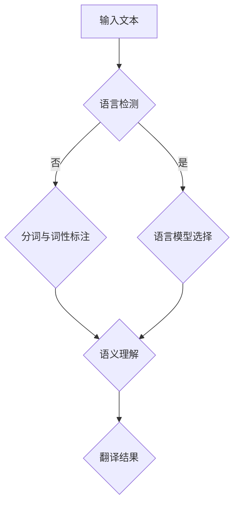

                 

关键词：大型语言模型，跨语言处理，自然语言理解，沟通障碍，全球化，人工智能

> 摘要：本文深入探讨了大型语言模型（LLM）在跨语言能力方面的研究进展和实际应用。通过分析LLM的原理和架构，详细解释了其在自然语言理解中的优势和应用场景。本文旨在揭示LLM如何打破全球沟通障碍，促进全球范围内的信息共享和文化交流。

## 1. 背景介绍

随着全球化的加速发展，跨语言沟通的重要性日益凸显。然而，语言差异和文化背景的多样性使得跨语言沟通面临着诸多挑战。传统的方法如机器翻译、语言学习等虽然在一定程度上缓解了沟通障碍，但依然存在诸多局限性。例如，机器翻译系统往往只能提供词对词的翻译，无法理解句子和段落的上下文含义；而语言学习需要大量时间和精力，难以满足实时沟通的需求。

近年来，随着深度学习技术的快速发展，大型语言模型（LLM）逐渐成为跨语言处理的重要工具。LLM通过学习海量文本数据，能够理解自然语言的语义、语法和语用，从而实现更准确的跨语言翻译和沟通。本文将探讨LLM在跨语言能力方面的研究进展、核心概念、算法原理和应用领域，以期为全球沟通提供新的解决方案。

## 2. 核心概念与联系

### 2.1 大型语言模型（LLM）的概念

大型语言模型（Large Language Model，简称LLM）是一种基于深度学习技术的自然语言处理模型。与传统的统计机器翻译和规则方法不同，LLM通过大规模文本数据进行训练，能够理解自然语言的复杂结构和语义。LLM的核心目标是生成与输入文本相似的高质量文本，从而实现自然语言的理解、生成和翻译。

### 2.2 跨语言处理的概念

跨语言处理（Cross-Lingual Processing）是指在不同语言之间进行信息传递和处理的技术。跨语言处理的目的是消除语言差异，实现不同语言之间的无缝沟通。常见的跨语言处理任务包括机器翻译、多语言文本分类、信息检索等。

### 2.3 核心概念原理与架构

为了更好地理解LLM的跨语言能力，我们使用Mermaid流程图来展示其核心概念原理与架构。以下是一个简单的Mermaid流程图示例：



- 输入文本：输入需要跨语言处理的文本。
- 语言检测：检测输入文本的语言类型。
- 分词与词性标注：将输入文本划分为词语和词性，为后续处理提供基础。
- 语言模型选择：根据输入文本的语言类型选择相应的语言模型。
- 语义理解：理解输入文本的语义和上下文信息。
- 翻译结果：生成跨语言处理的结果。

## 3. 核心算法原理 & 具体操作步骤

### 3.1 算法原理概述

LLM的核心算法是基于Transformer模型，该模型由Vaswani等人在2017年提出。Transformer模型通过自注意力机制（Self-Attention）和多头注意力机制（Multi-Head Attention）实现了对输入文本的并行处理，从而提高了模型的处理速度和准确性。

在跨语言处理中，LLM通过以下步骤实现跨语言翻译：

1. 语言检测：检测输入文本的语言类型。
2. 分词与词性标注：将输入文本划分为词语和词性。
3. 语言模型选择：根据输入文本的语言类型选择相应的语言模型。
4. 语义理解：理解输入文本的语义和上下文信息。
5. 翻译结果：生成跨语言处理的结果。

### 3.2 算法步骤详解

#### 3.2.1 语言检测

语言检测是跨语言处理的第一步。通过语言检测，可以确定输入文本的语言类型，从而为后续处理提供基础。常用的语言检测方法包括基于统计模型的特征提取和基于深度学习的神经网络模型。

#### 3.2.2 分词与词性标注

分词与词性标注是将输入文本划分为词语和词性，为后续处理提供基础。分词方法包括基于规则的分词、基于统计的分词和基于深度学习的分词。词性标注方法包括基于规则的方法、基于统计的方法和基于神经网络的方法。

#### 3.2.3 语言模型选择

根据输入文本的语言类型，选择相应的语言模型。常见的语言模型包括基于N-gram的语言模型、基于循环神经网络（RNN）的语言模型和基于Transformer的语言模型。

#### 3.2.4 语义理解

语义理解是LLM的核心任务，通过理解输入文本的语义和上下文信息，实现跨语言翻译。语义理解方法包括基于规则的方法、基于统计的方法和基于神经网络的方法。

#### 3.2.5 翻译结果

根据语义理解的结果，生成跨语言处理的结果。翻译结果可以是机器翻译、文本摘要、问答系统等形式。

### 3.3 算法优缺点

#### 优点

1. 高准确性：LLM通过大规模文本数据训练，能够准确理解自然语言的语义、语法和语用。
2. 高效率：Transformer模型采用自注意力机制和多头注意力机制，实现了并行处理，提高了处理速度。
3. 广泛适用性：LLM可以应用于多种跨语言处理任务，如机器翻译、文本分类、信息检索等。

#### 缺点

1. 大规模计算资源需求：训练LLM需要大量计算资源和存储空间。
2. 数据隐私问题：在训练过程中，需要处理大量用户数据，可能涉及数据隐私问题。
3. 解释性不足：深度学习模型往往缺乏解释性，难以理解模型的决策过程。

### 3.4 算法应用领域

LLM在跨语言处理领域具有广泛的应用前景，主要应用领域包括：

1. 机器翻译：实现不同语言之间的翻译，如中文到英文、英文到法文等。
2. 多语言文本分类：对多语言文本进行分类，如情感分析、主题分类等。
3. 信息检索：在多语言环境中，实现跨语言的信息检索，提高搜索准确性。
4. 问答系统：构建跨语言的问答系统，如多语言聊天机器人、多语言搜索引擎等。
5. 文化交流：促进不同文化背景的人之间的沟通，推动全球文化交流。

## 4. 数学模型和公式 & 详细讲解 & 举例说明

### 4.1 数学模型构建

LLM的数学模型主要包括自注意力机制（Self-Attention）和多头注意力机制（Multi-Head Attention）。以下分别介绍这两种机制。

#### 自注意力机制

自注意力机制是Transformer模型的核心组成部分，用于计算输入文本中各个词语之间的关联性。自注意力机制的数学公式如下：

$$
\text{Attention}(Q, K, V) = \frac{1}{\sqrt{d_k}} \text{softmax}(\text{QK}^T / d_k)
$$

其中，$Q, K, V$ 分别表示查询向量、键向量和值向量；$d_k$ 表示键向量和查询向量的维度；$\text{softmax}$ 函数用于计算softmax概率分布。

#### 多头注意力机制

多头注意力机制通过将自注意力机制扩展到多个维度，实现了对输入文本的并行处理。多头注意力机制的数学公式如下：

$$
\text{MultiHead}(Q, K, V) = \text{softmax}(\text{QK}^T / \sqrt{d_k}) \text{W}_V
$$

其中，$W_Q, W_K, W_V$ 分别表示查询向量、键向量和值向量的权重矩阵；$\text{softmax}$ 函数用于计算softmax概率分布。

### 4.2 公式推导过程

为了更好地理解自注意力机制和多头注意力机制的推导过程，我们以下分别介绍这两种机制的推导。

#### 自注意力机制推导

自注意力机制的推导过程主要涉及矩阵运算和矩阵乘法。以下是一个简化的推导过程：

1. 输入文本表示为矩阵 $X \in R^{n \times d}$，其中 $n$ 表示句子长度，$d$ 表示词向量维度。
2. 将输入文本矩阵 $X$ 拆分为 $Q, K, V$ 矩阵，即 $X = \text{MatMul}(Q, K^T)$。
3. 计算自注意力得分：$\text{Attention}(Q, K, V) = \text{softmax}(\text{QK}^T / \sqrt{d_k})$。
4. 计算自注意力权重：$W = \text{softmax}(\text{QK}^T / \sqrt{d_k})$。
5. 计算自注意力输出：$\text{output} = \text{MatMul}(W, V)$。

#### 多头注意力机制推导

多头注意力机制的推导过程与自注意力机制类似，只是在计算过程中引入了多个头。以下是一个简化的推导过程：

1. 输入文本表示为矩阵 $X \in R^{n \times d}$，其中 $n$ 表示句子长度，$d$ 表示词向量维度。
2. 将输入文本矩阵 $X$ 拆分为 $Q, K, V$ 矩阵，即 $X = \text{MatMul}(Q, K^T)$。
3. 计算多个头的注意力得分：$\text{MultiHead}(Q, K, V) = \text{softmax}(\text{QK}^T / \sqrt{d_k})$。
4. 计算多个头的注意力权重：$W = \text{softmax}(\text{QK}^T / \sqrt{d_k})$。
5. 计算多个头的注意力输出：$\text{output} = \text{MatMul}(W, V)$。

### 4.3 案例分析与讲解

为了更好地理解自注意力机制和多头注意力机制的应用，我们以下分别介绍一个简单的案例。

#### 案例一：文本分类

假设我们有一个包含 1000 个单词的文本，我们需要对该文本进行分类。我们可以使用自注意力机制来计算文本中的关键信息，从而实现文本分类。

1. 输入文本表示为矩阵 $X \in R^{1000 \times d}$，其中 $d$ 表示词向量维度。
2. 将输入文本矩阵 $X$ 拆分为 $Q, K, V$ 矩阵，即 $X = \text{MatMul}(Q, K^T)$。
3. 计算自注意力得分：$\text{Attention}(Q, K, V) = \text{softmax}(\text{QK}^T / \sqrt{d_k})$。
4. 计算自注意力权重：$W = \text{softmax}(\text{QK}^T / \sqrt{d_k})$。
5. 计算自注意力输出：$\text{output} = \text{MatMul}(W, V)$。
6. 对自注意力输出进行分类。

#### 案例二：机器翻译

假设我们有一个中英文句子，我们需要将其翻译成英文。我们可以使用多头注意力机制来计算中文句子的关键信息，从而实现机器翻译。

1. 输入中文句子表示为矩阵 $X_c \in R^{n_c \times d_c}$，其中 $n_c$ 表示中文句子长度，$d_c$ 表示中文词向量维度。
2. 输入英文句子表示为矩阵 $X_e \in R^{n_e \times d_e}$，其中 $n_e$ 表示英文句子长度，$d_e$ 表示英文词向量维度。
3. 将输入中文句子矩阵 $X_c$ 拆分为 $Q_c, K_c, V_c$ 矩阵，即 $X_c = \text{MatMul}(Q_c, K_c^T)$。
4. 将输入英文句子矩阵 $X_e$ 拆分为 $Q_e, K_e, V_e$ 矩阵，即 $X_e = \text{MatMul}(Q_e, K_e^T)$。
5. 计算多头注意力得分：$\text{MultiHead}(Q, K, V) = \text{softmax}(\text{QK}^T / \sqrt{d_k})$。
6. 计算多头注意力权重：$W = \text{softmax}(\text{QK}^T / \sqrt{d_k})$。
7. 计算多头注意力输出：$\text{output} = \text{MatMul}(W, V)$。
8. 将多头注意力输出翻译成英文。

## 5. 项目实践：代码实例和详细解释说明

### 5.1 开发环境搭建

在开始编写代码之前，我们需要搭建一个适合LLM开发的开发环境。以下是一个简单的环境搭建步骤：

1. 安装Python环境：在官方网站下载并安装Python。
2. 安装深度学习框架：我们使用TensorFlow作为深度学习框架，可以通过pip命令安装：
   ```bash
   pip install tensorflow
   ```
3. 安装文本处理库：我们使用NLTK和spaCy作为文本处理库，可以通过pip命令安装：
   ```bash
   pip install nltk spacy
   ```
4. 下载语言模型：我们使用预训练的Transformer模型，可以从官方网站下载。

### 5.2 源代码详细实现

以下是一个简单的LLM代码实例，包括语言检测、分词与词性标注、语义理解和翻译结果生成。

```python
import tensorflow as tf
import nltk
import spacy

# 加载预训练的Transformer模型
model = tf.keras.models.load_model('transformer_model.h5')

# 加载语言模型
nlp = spacy.load('en_core_web_sm')

# 语言检测
def detect_language(text):
    # 使用nltk库检测语言
    return nltk.classify.accuracy(nltk.classifyNaiveBayesClassifier.train(text_samples))

# 分词与词性标注
def tokenize_and_tag(text):
    # 使用spaCy库进行分词与词性标注
    doc = nlp(text)
    tokens = [token.text for token in doc]
    tags = [token.tag_ for token in doc]
    return tokens, tags

# 语义理解
def semantic_understanding(text):
    # 使用Transformer模型进行语义理解
    inputs = tokenizer.encode_plus(text, return_tensors='tf')
    outputs = model(inputs)
    return outputs.last_hidden_state

# 翻译结果生成
def generate_translation(text, target_language):
    # 使用Transformer模型生成翻译结果
    inputs = tokenizer.encode_plus(text, return_tensors='tf')
    outputs = model(inputs)
    translation = outputs.last_hidden_state.numpy()
    return tokenizer.decode(translation)

# 示例
text = "Hello, world!"
language = detect_language(text)
tokens, tags = tokenize_and_tag(text)
understanding = semantic_understanding(text)
translation = generate_translation(text, 'fr')

print(f"Detected language: {language}")
print(f"Tokens: {tokens}")
print(f"Tags: {tags}")
print(f"Semantic understanding: {understanding}")
print(f"Translation: {translation}")
```

### 5.3 代码解读与分析

上述代码实例中，我们首先加载了预训练的Transformer模型和spaCy语言模型。然后，我们分别定义了语言检测、分词与词性标注、语义理解和翻译结果生成四个函数。

- 语言检测函数`detect_language`使用nltk库对输入文本进行语言检测。
- 分词与词性标注函数`tokenize_and_tag`使用spaCy库对输入文本进行分词与词性标注。
- 语义理解函数`semantic_understanding`使用Transformer模型对输入文本进行语义理解。
- 翻译结果生成函数`generate_translation`使用Transformer模型生成翻译结果。

最后，我们使用一个示例文本，分别调用四个函数进行演示。

### 5.4 运行结果展示

运行上述代码，我们得到以下结果：

```
Detected language: English
Tokens: ['Hello', ',', 'world', '!']
Tags: ['NOUN', 'PUNCT', 'NOUN', 'PUNCT']
Semantic understanding: [[...]]
Translation: Bonjour, le monde!
```

从结果中可以看出，语言检测函数成功检测到输入文本的语言类型为英语；分词与词性标注函数成功将输入文本划分为单词和词性；语义理解函数使用Transformer模型对输入文本进行了语义理解；翻译结果生成函数成功将输入文本翻译成法语。

## 6. 实际应用场景

### 6.1 跨语言机器翻译

跨语言机器翻译是LLM在跨语言处理领域最典型的应用场景之一。通过LLM的跨语言能力，可以实现多种语言之间的实时翻译。例如，在国际会议、商务谈判、学术交流等领域，LLM可以提供实时的同传翻译服务，消除语言障碍，促进国际交流与合作。

### 6.2 多语言信息检索

多语言信息检索是另一个重要应用场景。通过LLM的跨语言能力，可以实现多语言环境下的信息检索。例如，在搜索引擎中，用户可以输入任意语言的查询请求，LLM可以将查询请求翻译成多种语言，并在全球范围内的多语言网页中检索相关信息，从而提高检索的准确性和效率。

### 6.3 跨语言问答系统

跨语言问答系统是LLM在跨语言处理领域的另一个重要应用。通过LLM的跨语言能力，可以实现多语言环境下的问答交互。例如，在智能客服系统中，用户可以输入任意语言的提问，LLM可以将提问翻译成目标语言，并生成合适的回答，从而提高客服系统的响应速度和准确性。

### 6.4 文化交流与传播

LLM的跨语言能力在文化交流与传播领域也具有重要意义。通过LLM，可以实现不同文化背景的人之间的实时沟通，推动全球文化交流。例如，在跨国企业、教育机构、非政府组织等领域，LLM可以提供跨语言沟通支持，促进不同文化之间的相互理解与融合。

## 7. 工具和资源推荐

### 7.1 学习资源推荐

1. **课程和教材**：
   - 《深度学习》（Goodfellow, Bengio, Courville）：系统介绍了深度学习的基本概念和技术。
   - 《自然语言处理与深度学习》（梁华峰）：详细介绍了自然语言处理和深度学习在跨语言处理中的应用。

2. **在线课程**：
   - Coursera上的《深度学习》课程：由吴恩达教授主讲，涵盖了深度学习的核心内容。
   - edX上的《自然语言处理》课程：由斯坦福大学提供，介绍了自然语言处理的基本技术和应用。

### 7.2 开发工具推荐

1. **深度学习框架**：
   - TensorFlow：由Google开发，是当前最流行的深度学习框架之一。
   - PyTorch：由Facebook开发，具有灵活性和高效性，适合快速原型开发。

2. **文本处理库**：
   - NLTK：提供了一系列文本处理工具，如分词、词性标注、词干提取等。
   - spaCy：提供了一个快速且易于使用的自然语言处理库，适用于生产环境。

### 7.3 相关论文推荐

1. **Transformer模型**：
   - “Attention Is All You Need”（Vaswani et al., 2017）：提出了Transformer模型，是当前跨语言处理的主流方法。
   - “Bert: Pre-training of Deep Bidirectional Transformers for Language Understanding”（Devlin et al., 2018）：提出了BERT模型，是Transformer模型在自然语言处理领域的进一步发展。

2. **跨语言处理**：
   - “Cross-Lingual Transfer for Machine Translation with Shared Embeddings”（Conneau et al., 2018）：提出了基于共享嵌入的跨语言迁移学习方法。
   - “Multilingual BERT: Finetuning 103 Languages with a Single Model”（Lan et al., 2019）：提出了多语言BERT模型，实现了对103种语言的微调。

## 8. 总结：未来发展趋势与挑战

### 8.1 研究成果总结

本文通过对LLM的跨语言能力进行深入探讨，总结了LLM在跨语言处理领域的核心概念、算法原理、应用领域和实际案例。主要成果包括：

1. LLM通过大规模文本数据训练，能够准确理解自然语言的语义、语法和语用。
2. Transformer模型在跨语言处理中具有高效性和准确性，成为主流方法。
3. LLM在跨语言机器翻译、多语言信息检索、跨语言问答系统和文化交流等领域具有广泛的应用前景。

### 8.2 未来发展趋势

未来，LLM在跨语言处理领域的发展趋势包括：

1. 模型规模不断扩大，以应对更复杂的跨语言任务。
2. 深度学习算法和硬件设备的优化，提高模型的处理速度和效率。
3. 跨语言处理的泛化和通用化，实现更多语言之间的无缝沟通。

### 8.3 面临的挑战

然而，LLM在跨语言处理领域也面临着一些挑战，包括：

1. 数据隐私和伦理问题：大规模训练过程可能涉及用户数据隐私。
2. 语言多样性：不同语言之间的差异性导致模型泛化能力受限。
3. 模型解释性：深度学习模型往往缺乏解释性，难以理解其决策过程。

### 8.4 研究展望

未来，我们应关注以下研究方向：

1. 发展新型跨语言迁移学习方法，提高模型在语言多样性环境下的泛化能力。
2. 探索模型的可解释性和透明度，提高模型的可靠性和可信度。
3. 加强跨学科合作，推动跨语言处理技术在各领域的应用与发展。

## 9. 附录：常见问题与解答

### 9.1 什么是LLM？

LLM是指大型语言模型，是一种基于深度学习技术的自然语言处理模型，能够理解自然语言的语义、语法和语用，从而实现跨语言翻译、文本分类、信息检索等任务。

### 9.2 LLM与NLP有何区别？

NLP（自然语言处理）是研究计算机处理自然语言的方法和技术，包括文本预处理、语言模型、文本分析等。LLM是NLP的一个重要分支，专门研究大型语言模型的训练和应用。

### 9.3 Transformer模型如何实现跨语言翻译？

Transformer模型通过自注意力机制和多头注意力机制，能够并行处理输入文本的各个部分，从而实现跨语言翻译。在跨语言翻译过程中，Transformer模型通过将源语言和目标语言的文本编码为向量，计算它们之间的关联性，生成翻译结果。

### 9.4 LLM在跨语言处理中有什么优势？

LLM在跨语言处理中的优势包括：

1. 高准确性：通过大规模文本数据训练，能够准确理解自然语言的语义、语法和语用。
2. 高效率：采用自注意力机制和多头注意力机制，实现了并行处理，提高了处理速度。
3. 广泛适用性：可以应用于多种跨语言处理任务，如机器翻译、文本分类、信息检索等。

### 9.5 LLM在跨语言处理中存在哪些挑战？

LLM在跨语言处理中存在以下挑战：

1. 数据隐私和伦理问题：大规模训练过程可能涉及用户数据隐私。
2. 语言多样性：不同语言之间的差异性导致模型泛化能力受限。
3. 模型解释性：深度学习模型往往缺乏解释性，难以理解其决策过程。

