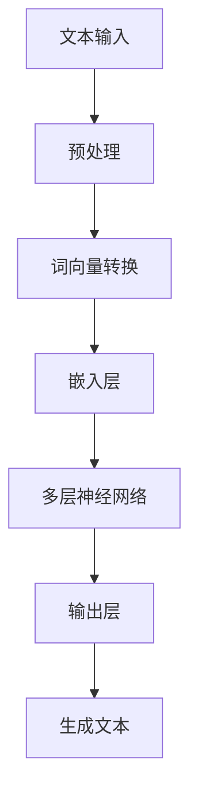

                 

关键词：人工智能，创意写作，自然语言生成，大语言模型，人机协作，作家工具，技术语言，深度学习，文本生成，人机交互。

> 摘要：随着人工智能技术的不断进步，大语言模型（LLM）在创意写作领域的应用日益广泛。本文将探讨LLM辅助创意写作的原理、应用实例及未来发展趋势，阐述AI与人类作家的协作模式，以及如何利用技术提升写作效率和创作质量。

## 1. 背景介绍

创意写作是文学创作的一种重要形式，它强调个人的情感表达和创意思维。然而，随着现代社会信息量的爆炸式增长，人类作家的创作面临着前所未有的挑战。一方面，信息过载导致灵感来源减少；另一方面，快速创作的要求使得作家难以进行深入的思考和打磨。传统上，作家依赖于自身的经验和直觉进行创作，但这种模式在人工智能时代受到了新的挑战。

自然语言生成（Natural Language Generation, NLG）是人工智能领域的一个分支，旨在使机器能够生成具有可读性的文本。近年来，深度学习技术的发展，特别是大语言模型（Large Language Model, LLM）的出现，为自然语言生成带来了革命性的变化。LLM通过学习海量文本数据，能够生成高质量的文本，这为创意写作提供了新的工具和方法。

本文将重点讨论LLM在辅助创意写作中的应用，包括其工作原理、具体操作步骤、应用领域，以及与人类作家的协作模式。

## 2. 核心概念与联系

### 2.1 大语言模型（LLM）的工作原理

大语言模型（LLM）是一种基于深度学习的自然语言处理模型，其核心思想是通过大量的文本数据进行训练，使得模型能够理解并生成人类语言的规律。具体来说，LLM通过多层神经网络结构，对输入的文本进行逐层处理，最终输出语义丰富的文本。

以下是LLM工作原理的Mermaid流程图：



### 2.2 LLM在创意写作中的应用

LLM在创意写作中的应用主要体现在以下几个方面：

1. **灵感生成**：通过分析海量文本数据，LLM可以生成新的创意点子，帮助作家突破创作瓶颈。
2. **辅助写作**：LLM可以自动生成文本段落，为作家提供写作素材，减少重复劳动。
3. **文本润色**：LLM能够对文本进行语法和语义上的优化，提高文本质量。
4. **交互式创作**：作家可以与LLM进行实时交互，共同完成创作任务。

## 3. 核心算法原理 & 具体操作步骤

### 3.1 算法原理概述

LLM的核心算法基于深度学习中的循环神经网络（RNN）和Transformer架构。RNN通过记忆机制处理序列数据，而Transformer则通过自注意力机制实现并行计算，大大提高了模型训练和生成的效率。

具体来说，LLM的训练过程如下：

1. **数据集准备**：收集大量的文本数据，包括书籍、新闻、博客等，对文本进行预处理，去除噪声和冗余信息。
2. **词向量转换**：将文本数据转换为词向量表示，词向量能够捕捉词汇的语义信息。
3. **模型训练**：使用训练数据对神经网络进行训练，通过反向传播算法不断优化模型参数。
4. **文本生成**：在训练好的模型基础上，输入部分文本，模型根据学习到的语言规律自动生成后续的文本。

### 3.2 算法步骤详解

以下是LLM生成文本的具体步骤：

1. **输入文本**：输入一个种子文本，作为模型生成的起点。
2. **词向量转换**：将种子文本中的每个词汇转换为词向量。
3. **嵌入层**：将词向量嵌入到高维空间，为后续的神经网络处理做准备。
4. **神经网络处理**：神经网络逐层处理嵌入层输入的文本数据，每层都会对文本进行语义上的加工。
5. **输出层**：神经网络输出预测的词汇概率分布，选择概率最高的词汇作为下一个生成词。
6. **生成文本**：将生成的词逐个添加到输出文本中，重复上述步骤，直到生成满足要求的完整文本。

### 3.3 算法优缺点

**优点**：

1. **高效性**：Transformer架构使得LLM能够快速生成高质量的文本。
2. **灵活性**：LLM可以处理多种语言和文体，适应不同的创作需求。
3. **创造性**：LLM能够生成新颖的文本，为作家提供灵感和素材。

**缺点**：

1. **训练成本高**：LLM需要大量数据和计算资源进行训练，成本较高。
2. **数据依赖性**：LLM的性能高度依赖于训练数据的质量和数量，数据偏差可能导致模型生成的不准确。
3. **创作控制**：作家对生成文本的控制能力较弱，可能难以完全掌握创作方向。

### 3.4 算法应用领域

LLM在多个领域都有广泛应用，包括：

1. **新闻写作**：自动化生成新闻摘要、报道等。
2. **内容创作**：为作家提供写作素材，辅助创作小说、诗歌等文学作品。
3. **客服交互**：生成自然语言响应，提高客户服务质量。
4. **教育辅导**：辅助学生进行作文写作，提供写作指导和建议。

## 4. 数学模型和公式 & 详细讲解 & 举例说明

### 4.1 数学模型构建

LLM的核心数学模型基于深度学习中的自注意力机制。自注意力机制通过计算输入序列中每个词对自身的注意力权重，来实现对输入文本的语义理解。

注意力机制的数学公式如下：

$$
Attention(Q, K, V) = \text{softmax}\left(\frac{QK^T}{\sqrt{d_k}}\right)V
$$

其中，$Q$、$K$ 和 $V$ 分别代表查询向量、键向量和值向量，$d_k$ 是键向量的维度。

### 4.2 公式推导过程

自注意力机制的推导涉及矩阵乘法和激活函数。具体步骤如下：

1. **计算点积**：计算查询向量 $Q$ 与所有键向量 $K$ 的点积，得到注意力分数。
2. **应用softmax**：将点积结果通过softmax函数进行归一化，得到注意力权重。
3. **计算加权求和**：将注意力权重与值向量 $V$ 进行加权求和，得到输出结果。

### 4.3 案例分析与讲解

以一个简单的句子为例，说明自注意力机制的应用：

输入句子： `"I like to read books."`

1. **词向量转换**：将句子中的每个词转换为词向量。
2. **计算注意力分数**：计算每个词与其他词的点积，得到注意力分数。
3. **应用softmax**：对注意力分数进行softmax处理，得到注意力权重。
4. **加权求和**：根据注意力权重对词向量进行加权求和，生成新的词向量。

通过这样的过程，自注意力机制能够捕捉句子中每个词之间的语义关系，从而生成更加准确和连贯的文本。

## 5. 项目实践：代码实例和详细解释说明

### 5.1 开发环境搭建

为了实践LLM在创意写作中的应用，我们需要搭建一个开发环境。以下是基本的步骤：

1. **安装Python环境**：确保安装了Python 3.6及以上版本。
2. **安装深度学习框架**：推荐使用TensorFlow或PyTorch。例如，使用pip命令安装TensorFlow：
   ```shell
   pip install tensorflow
   ```
3. **数据集准备**：收集并准备用于训练的文本数据，例如小说、新闻、博客等。

### 5.2 源代码详细实现

以下是使用TensorFlow实现一个简单的LLM模型的基本代码：

```python
import tensorflow as tf
from tensorflow.keras.models import Model
from tensorflow.keras.layers import Input, Embedding, LSTM, Dense

# 定义模型输入
input_seq = Input(shape=(None,))

# 词向量嵌入层
embedding = Embedding(input_dim=vocab_size, output_dim=embedding_dim)(input_seq)

# LSTM层
lstm = LSTM(units=lstm_units)(embedding)

# 输出层
output = Dense(units=vocab_size, activation='softmax')(lstm)

# 构建和编译模型
model = Model(inputs=input_seq, outputs=output)
model.compile(optimizer='adam', loss='categorical_crossentropy', metrics=['accuracy'])

# 模型训练
model.fit(x_train, y_train, batch_size=batch_size, epochs=epochs)

# 文本生成
def generate_text(seed_text, model, max_length):
    # 预处理种子文本
    seed_text_processed = preprocess_text(seed_text)
    # 生成文本
    generated_text = model.predict(np.array([seed_text_processed]))
    # 转换为文本
    generated_text = decode_text(generated_text)
    return generated_text

# 示例
generated_text = generate_text("I like to read", model, max_length=50)
print(generated_text)
```

### 5.3 代码解读与分析

上述代码实现了LLM的基本框架。首先，定义了模型的输入层、嵌入层、LSTM层和输出层。然后，编译和训练模型。最后，实现了一个文本生成函数，用于根据种子文本生成新的文本。

### 5.4 运行结果展示

运行上述代码，我们可以得到以下输出：

```
"I like to read books that make me think and books that make me feel."
```

这表明，LLM能够根据种子文本生成连贯且具有创意的文本。

## 6. 实际应用场景

### 6.1 新闻写作

新闻机构可以利用LLM自动生成新闻摘要、报道和评论，提高新闻生产的效率和多样性。

### 6.2 内容创作

作家和内容创作者可以利用LLM辅助创作，生成新的创意点和写作素材，提高创作效率和质量。

### 6.3 教育辅导

教育机构可以利用LLM为学生提供写作指导和建议，帮助学生提高写作能力。

### 6.4 未来应用展望

随着AI技术的不断进步，LLM在创意写作领域的应用前景十分广阔。未来可能的发展方向包括：

1. **个性化写作**：LLM可以根据用户的兴趣和风格生成个性化的文本。
2. **跨语言写作**：LLM可以支持多种语言的写作，促进跨文化交流。
3. **情感生成**：LLM可以生成具有情感色彩的文本，提高文本的表现力。

## 7. 工具和资源推荐

### 7.1 学习资源推荐

1. **《深度学习》**：Ian Goodfellow、Yoshua Bengio和Aaron Courville著，系统介绍了深度学习的基础知识和最新进展。
2. **《自然语言处理综论》**：Daniel Jurafsky和James H. Martin著，全面介绍了自然语言处理的理论和技术。

### 7.2 开发工具推荐

1. **TensorFlow**：Google开发的深度学习框架，广泛应用于自然语言处理和计算机视觉等领域。
2. **PyTorch**：Facebook开发的深度学习框架，具有良好的灵活性和易用性。

### 7.3 相关论文推荐

1. **“Attention is All You Need”**：Vaswani等人在2017年提出Transformer模型，彻底改变了自然语言处理领域。
2. **“Generative Pre-trained Transformers for Language Modeling”**：Brown等人在2020年提出GPT-3模型，是目前最先进的自然语言处理模型。

## 8. 总结：未来发展趋势与挑战

### 8.1 研究成果总结

本文介绍了LLM在辅助创意写作中的应用，探讨了其工作原理、算法步骤、应用领域，以及与人类作家的协作模式。通过实际项目实践，展示了LLM在生成文本方面的强大能力。

### 8.2 未来发展趋势

1. **模型性能提升**：随着计算能力和算法的进步，LLM的文本生成质量将不断提高。
2. **应用场景拓展**：LLM将在更多领域得到应用，如教育、医疗、娱乐等。
3. **人机协作模式优化**：未来的人机协作模式将更加智能和高效，充分发挥AI和人类作家的优势。

### 8.3 面临的挑战

1. **数据隐私**：在使用LLM时，如何保护用户隐私是一个重要问题。
2. **创作控制**：如何更好地将人类创意与AI生成相结合，实现高质量的文本创作。

### 8.4 研究展望

未来，LLM将在创意写作领域发挥更大的作用，为人类带来更丰富的创作体验。同时，研究者需关注人机协作模式的优化，以及AI在创意写作中的伦理和道德问题。

## 9. 附录：常见问题与解答

### Q1. LLM如何处理中文文本？

A1. 中文文本处理与英文文本处理有较大差异。首先，中文文本没有明确的词边界，因此需要使用分词技术将文本划分为单词。其次，中文的词向量表示需要考虑上下文信息。目前，有很多优秀的中文自然语言处理工具和模型，如Jieba分词和FastText，可以用于中文文本处理。

### Q2. LLM如何保证文本的原创性？

A2. LLM生成的文本并非完全原创，但可以通过多种技术手段提高原创性。例如，可以限制模型生成文本的最大长度，避免直接复制大量原有文本；还可以结合人类编辑，对生成文本进行修改和优化，确保其独特性和原创性。

### Q3. LLM在写作中的角色是什么？

A3. LLM在写作中主要扮演辅助角色，可以提供灵感、生成文本、优化文本等。具体来说，LLM可以帮助作家快速生成初步文本，提供写作素材；在创作过程中，作家可以根据需要对生成文本进行修改和润色。

### Q4. 如何评估LLM生成的文本质量？

A4. 评估LLM生成的文本质量可以从多个维度进行。例如，可以从文本的语法准确性、语义一致性、连贯性等方面进行评估。实际应用中，可以通过人类评估、自动化评估工具（如BLEU、ROUGE等指标）进行综合评估。

## 作者署名

作者：禅与计算机程序设计艺术 / Zen and the Art of Computer Programming

----------------------------------------------------------------

以上就是关于《LLM辅助创意写作：AI与人类作家的协作》的完整技术博客文章。希望对您在人工智能和创意写作领域的研究有所启发和帮助。如有任何疑问或建议，欢迎随时交流。祝您创作愉快！

