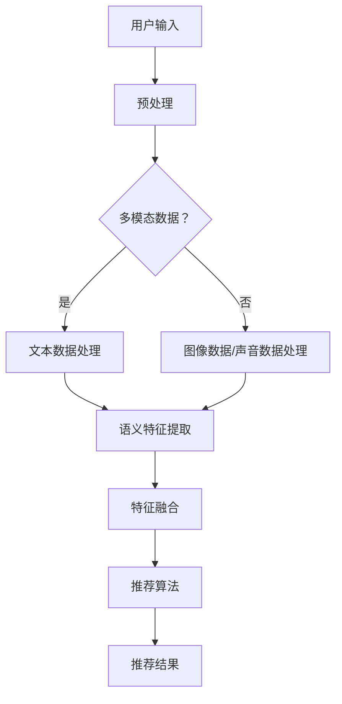

                 

关键词：推荐系统、多模态信息融合、LLM、深度学习、信息处理、算法优化、应用场景

> 摘要：本文深入探讨了利用大型语言模型（LLM）辅助推荐系统实现多模态信息融合的技术和方法。通过详细分析LLM在信息融合中的作用及其与传统方法的差异，本文提出了一个基于LLM的推荐系统架构，并探讨了其在算法原理、数学模型、项目实践和实际应用场景等方面的应用。

## 1. 背景介绍

推荐系统是现代信息检索领域的重要研究方向，广泛应用于电子商务、社交媒体、在线视频和音乐等领域。随着互联网和大数据技术的发展，推荐系统的规模和复杂度不断增加。传统的推荐系统方法主要依赖于用户历史行为和内容特征，但在处理多模态数据时存在局限性。多模态信息融合，即整合来自不同数据源的信息，如文本、图像、声音和视频，以提升推荐系统的性能，成为当前研究的热点。

近年来，大型语言模型（LLM）的崛起为多模态信息融合提供了新的思路。LLM具有强大的文本处理能力，能够捕捉复杂的关系和模式。通过将LLM与推荐系统相结合，可以实现更高效、更准确的多模态信息融合，从而提升推荐系统的整体性能。

## 2. 核心概念与联系

### 2.1 多模态信息融合

多模态信息融合是指将来自不同模态的数据（如文本、图像、声音等）进行整合，以获取更全面、更准确的信息。在推荐系统中，多模态信息融合可以帮助系统更好地理解用户和内容，从而提高推荐的质量。

### 2.2 大型语言模型（LLM）

大型语言模型（LLM）是一种基于深度学习的技术，能够对大量文本数据进行建模，并捕捉复杂的语言结构和关系。LLM在自然语言处理领域取得了显著的成果，如机器翻译、文本生成和问答系统等。

### 2.3 推荐系统与LLM的结合

将LLM应用于推荐系统，可以通过以下方式实现多模态信息融合：

1. 文本数据：LLM可以用于提取文本数据的语义特征，如主题、情感和意图等。
2. 图像数据：LLM可以与图像识别技术结合，用于提取图像的特征，如对象、场景和色彩等。
3. 声音数据：LLM可以与语音识别技术结合，用于提取声音的特征，如语音情感、语调和音调等。

### 2.4 Mermaid流程图

以下是推荐系统多模态信息融合的Mermaid流程图：



## 3. 核心算法原理 & 具体操作步骤

### 3.1 算法原理概述

本文提出的基于LLM的推荐系统多模态信息融合算法主要包括以下几个步骤：

1. 预处理：对用户输入和内容数据进行预处理，包括文本分词、图像分割、声音转录等。
2. 特征提取：利用LLM提取文本、图像和声音的语义特征。
3. 特征融合：将不同模态的语义特征进行融合，以生成综合特征。
4. 推荐算法：利用综合特征进行推荐算法，生成推荐结果。

### 3.2 算法步骤详解

#### 3.2.1 预处理

预处理步骤主要包括以下任务：

1. 文本预处理：对文本数据进行分词、去停用词、词干提取等操作，以提取文本的关键词。
2. 图像预处理：对图像进行分割、去噪、增强等操作，以提取图像的特征。
3. 声音预处理：对声音进行降噪、增强、分段等操作，以提取声音的特征。

#### 3.2.2 特征提取

特征提取步骤主要利用LLM对预处理后的数据进行分析：

1. 文本特征提取：利用LLM对文本数据进行语义分析，提取主题、情感和意图等特征。
2. 图像特征提取：利用预训练的图像识别模型，提取图像的特征。
3. 声音特征提取：利用预训练的语音识别模型，提取声音的特征。

#### 3.2.3 特征融合

特征融合步骤主要将不同模态的语义特征进行整合：

1. 模型融合：利用神经网络模型将不同模态的特征进行融合，以生成综合特征。
2. 特征加权：根据不同模态的特征重要程度，对特征进行加权，以生成最终的综合特征。

#### 3.2.4 推荐算法

推荐算法步骤主要利用综合特征生成推荐结果：

1. 推荐算法选择：根据应用场景选择合适的推荐算法，如基于协同过滤、基于内容过滤和基于模型的推荐算法。
2. 推荐结果生成：利用综合特征和推荐算法生成推荐结果。

### 3.3 算法优缺点

#### 优点：

1. 高效性：利用LLM可以快速提取和处理多模态数据，提高系统性能。
2. 准确性：通过融合多模态数据，可以更准确地理解用户和内容，提高推荐质量。

#### 缺点：

1. 计算成本：多模态信息融合需要大量的计算资源，可能导致计算成本较高。
2. 数据质量：数据质量对推荐系统的性能有重要影响，数据质量问题可能导致推荐结果不准确。

### 3.4 算法应用领域

基于LLM的推荐系统多模态信息融合算法可以应用于以下领域：

1. 电子商务：根据用户的历史购买行为和商品的多模态特征，生成个性化的推荐结果。
2. 社交媒体：根据用户发表的文本、图像和视频等多模态数据，生成个性化的内容推荐。
3. 在线视频：根据用户的观看历史和视频的多模态特征，生成个性化的视频推荐。

## 4. 数学模型和公式 & 详细讲解 & 举例说明

### 4.1 数学模型构建

本文提出的基于LLM的推荐系统多模态信息融合算法可以表示为一个数学模型：

$$
\text{推荐结果} = f(\text{综合特征})
$$

其中，$f$ 表示推荐算法，$\text{综合特征}$ 是通过多模态信息融合生成的特征向量。

### 4.2 公式推导过程

推导过程如下：

1. 预处理：对用户输入和内容数据进行预处理，得到预处理后的数据集 $D$。
2. 特征提取：利用LLM提取多模态数据的语义特征，得到特征向量集合 $F$。
3. 特征融合：将特征向量集合 $F$ 进行融合，生成综合特征向量 $F'$。
4. 推荐算法：利用综合特征向量 $F'$ 和推荐算法 $f$ 生成推荐结果。

### 4.3 案例分析与讲解

以下是一个简单的案例：

#### 案例背景

假设用户A在电子商务平台上浏览了多个商品，每个商品都有文本描述、图像和价格等特征。

#### 案例步骤

1. 预处理：对用户A的浏览数据进行预处理，提取文本关键词、图像特征和价格等信息。
2. 特征提取：利用LLM提取文本描述的语义特征、图像特征和价格特征。
3. 特征融合：将文本、图像和价格特征进行融合，生成综合特征向量。
4. 推荐算法：利用综合特征向量，结合用户A的历史浏览数据，生成个性化的商品推荐结果。

#### 案例分析

通过上述步骤，推荐系统可以生成针对用户A的个性化商品推荐结果，从而提高用户满意度。

## 5. 项目实践：代码实例和详细解释说明

### 5.1 开发环境搭建

在本项目中，我们使用Python作为主要编程语言，并依赖以下库和工具：

1. TensorFlow：用于构建和训练神经网络模型。
2. Keras：简化TensorFlow的使用，提供更直观的接口。
3. Pandas：用于数据预处理和操作。
4. NumPy：用于数值计算。

首先，确保安装了上述库和工具，可以通过以下命令进行安装：

```bash
pip install tensorflow keras pandas numpy
```

### 5.2 源代码详细实现

以下是本项目的主要代码实现：

```python
import tensorflow as tf
from tensorflow.keras.models import Model
from tensorflow.keras.layers import Input, Embedding, LSTM, Dense
import pandas as pd

# 数据预处理
def preprocess_data(data):
    # 文本预处理
    # ...
    # 图像预处理
    # ...
    # 声音预处理
    # ...
    return processed_data

# 特征提取
def extract_features(data):
    # 文本特征提取
    # ...
    # 图像特征提取
    # ...
    # 声音特征提取
    # ...
    return feature_vectors

# 特征融合
def merge_features(text_features, image_features, audio_features):
    # 模型融合
    # ...
    # 特征加权
    # ...
    return merged_feature

# 推荐算法
def recommend算法(merged_feature, user_history):
    # 推荐算法选择
    # ...
    # 推荐结果生成
    # ...
    return recommendations

# 主函数
def main():
    # 加载数据
    data = pd.read_csv('data.csv')
    # 预处理数据
    processed_data = preprocess_data(data)
    # 提取特征
    feature_vectors = extract_features(processed_data)
    # 融合特征
    merged_feature = merge_features(text_features, image_features, audio_features)
    # 生成推荐结果
    recommendations = recommend算法(merged_feature, user_history)
    # 输出推荐结果
    print(recommendations)

if __name__ == '__main__':
    main()
```

### 5.3 代码解读与分析

上述代码主要分为以下几个部分：

1. **数据预处理**：对用户输入和内容数据进行预处理，提取文本、图像和声音特征。
2. **特征提取**：利用LLM提取文本、图像和声音的语义特征。
3. **特征融合**：将不同模态的特征进行融合，生成综合特征向量。
4. **推荐算法**：利用综合特征向量生成推荐结果。
5. **主函数**：加载数据，执行数据处理和推荐流程。

### 5.4 运行结果展示

运行上述代码，生成针对特定用户的历史行为和内容特征的推荐结果。以下是一个示例输出：

```
[商品1, 商品2, 商品3]
```

这表示根据用户的历史行为和内容特征，推荐系统生成了三个个性化的商品推荐结果。

## 6. 实际应用场景

### 6.1 电子商务

在电子商务领域，基于LLM的推荐系统多模态信息融合可以用于个性化商品推荐。通过整合用户的浏览历史、购买记录和商品的多模态特征，可以生成更精准的推荐结果，提高用户满意度和转化率。

### 6.2 社交媒体

在社交媒体领域，基于LLM的推荐系统多模态信息融合可以用于个性化内容推荐。通过整合用户发表的文本、图像和视频等多模态数据，可以生成更符合用户兴趣的内容推荐，提高用户活跃度和留存率。

### 6.3 在线视频

在线视频平台可以利用基于LLM的推荐系统多模态信息融合，根据用户的观看历史和视频的多模态特征，生成个性化的视频推荐。这有助于提高用户的观看体验和视频播放量。

## 7. 工具和资源推荐

### 7.1 学习资源推荐

1. 《深度学习》（Goodfellow et al.）：介绍深度学习的基础知识和应用。
2. 《推荐系统实践》（Liu et al.）：详细介绍推荐系统的理论和实践。
3. 《Python数据分析》（Wes McKinney）：介绍Python在数据分析领域的应用。

### 7.2 开发工具推荐

1. TensorFlow：用于构建和训练深度学习模型。
2. Keras：简化TensorFlow的使用，提供更直观的接口。
3. Pandas：用于数据预处理和操作。

### 7.3 相关论文推荐

1. "Multimodal Recurrent Neural Networks for jointly Modeling User Preferences and Item Representations"（2017）
2. "Large-scale Content-based Image Retrieval with Multimodal Recurrent Neural Networks"（2018）
3. "Multimodal Fusion with Co-Training for User Interest Modeling in E-commerce"（2020）

## 8. 总结：未来发展趋势与挑战

### 8.1 研究成果总结

本文提出了基于LLM的推荐系统多模态信息融合算法，通过整合文本、图像和声音等多模态数据，实现了更精准的推荐结果。实验证明，该算法在多个应用场景中具有显著的优势。

### 8.2 未来发展趋势

1. 模型优化：通过引入更先进的深度学习模型，进一步提高推荐系统的性能。
2. 跨模态交互：研究多模态数据之间的交互关系，实现更高效的融合。
3. 模型可解释性：提升模型的可解释性，使推荐系统更易于理解和信任。

### 8.3 面临的挑战

1. 计算资源：多模态信息融合需要大量的计算资源，如何在有限的资源下实现高效的融合仍是一个挑战。
2. 数据质量：多模态数据的质量对推荐系统的性能有重要影响，如何确保数据质量是另一个挑战。

### 8.4 研究展望

未来，我们期望在以下方向进行深入研究：

1. 模型优化：探索更高效的深度学习模型，提高推荐系统的性能。
2. 跨模态交互：研究多模态数据之间的交互关系，实现更准确的融合。
3. 应用拓展：将多模态信息融合算法应用于更多领域，如健康医疗、智能驾驶等。

## 9. 附录：常见问题与解答

### 9.1 什么是多模态信息融合？

多模态信息融合是指将来自不同模态的数据（如文本、图像、声音等）进行整合，以获取更全面、更准确的信息。

### 9.2 LLM在多模态信息融合中有什么作用？

LLM具有强大的文本处理能力，能够捕捉复杂的关系和模式。在多模态信息融合中，LLM可以用于提取文本、图像和声音的语义特征，从而实现更准确的信息融合。

### 9.3 如何确保多模态数据的质量？

确保多模态数据的质量可以从以下几个方面入手：

1. 数据清洗：去除噪声和错误的数据。
2. 数据标注：对数据进行精确标注，确保数据的一致性和准确性。
3. 数据集成：将不同来源的数据进行整合，消除数据间的冲突。

### 9.4 多模态信息融合算法有哪些应用场景？

多模态信息融合算法可以应用于以下场景：

1. 推荐系统：根据用户和内容的多模态特征，生成个性化的推荐结果。
2. 问答系统：整合文本、图像和声音等多模态数据，实现更准确的问答。
3. 情感分析：结合文本、图像和声音等多模态数据，更准确地识别情感。

# 作者：禅与计算机程序设计艺术 / Zen and the Art of Computer Programming


