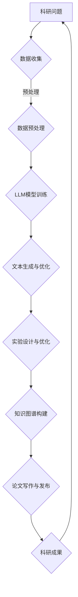

                 

关键词：自然语言处理、大型语言模型、科学研究、AI工具、数据挖掘、知识图谱、算法优化、科研流程自动化

摘要：随着科学研究的复杂性和规模不断扩大，科研人员面临着越来越多的挑战。本文探讨了大型语言模型（LLM）在科研领域中的应用，特别是如何利用LLM加速科学发现。通过介绍LLM的核心概念、算法原理、数学模型、项目实践和实际应用场景，本文旨在为科研人员提供一种新的工具和方法，以加快科研进程，提高科研效率。

## 1. 背景介绍

### 1.1 科学研究的现状

科学研究是一个高度复杂和多样化的过程，涵盖了从实验设计、数据采集、数据分析到成果发布的各个环节。随着科技的发展，科学研究的规模和复杂度不断增加，科研人员面临着前所未有的挑战。传统的科研方法往往需要耗费大量时间和精力，并且存在一定的局限性。因此，如何提高科研效率，缩短科研周期，成为了科研人员共同关注的课题。

### 1.2 人工智能在科研中的应用

近年来，人工智能（AI）技术的飞速发展，为科学研究带来了新的机遇。AI可以自动化处理大量的数据，挖掘出潜在的科学规律，甚至可以辅助科研人员进行实验设计。在AI技术的众多分支中，自然语言处理（NLP）和大型语言模型（LLM）被认为是最具潜力的领域之一。LLM可以理解和生成自然语言，具有广泛的应用前景，特别是在科研领域。

### 1.3 LLM在科研中的应用场景

LLM在科研中的应用场景非常广泛，包括但不限于以下几个方面：

1. **文献检索与阅读**：利用LLM对大量科学文献进行自动化检索和阅读，帮助科研人员快速找到相关的研究成果，减少重复劳动。

2. **实验设计与优化**：利用LLM分析实验数据，提供实验设计的建议，优化实验流程，提高实验效率。

3. **数据分析与可视化**：利用LLM对实验数据进行深入分析，发现数据中的潜在规律，并通过可视化工具呈现分析结果。

4. **知识图谱构建**：利用LLM构建领域知识图谱，为科研人员提供全面的领域知识支持，促进跨学科的交流与合作。

5. **科研论文写作**：利用LLM辅助科研人员撰写论文，提高论文写作的效率和质量。

## 2. 核心概念与联系

### 2.1 自然语言处理（NLP）

自然语言处理是AI的一个重要分支，旨在让计算机理解和处理自然语言。NLP的核心任务包括文本分类、命名实体识别、情感分析、机器翻译等。在LLM的应用中，NLP是实现自然语言理解的关键。

### 2.2 大型语言模型（LLM）

大型语言模型是一种基于深度学习的自然语言处理模型，通过学习大量的文本数据，能够生成符合自然语言语法和语义规则的文本。LLM的主要任务是生成文本，可以应用于对话系统、文本生成、摘要生成等场景。

### 2.3 知识图谱（KG）

知识图谱是一种结构化数据存储方式，通过实体、属性和关系的表示，将大量零散的知识点整合为一个整体。知识图谱在科研中的应用主要包括领域知识的组织和查询、知识推理和预测等。

### 2.4 Mermaid 流程图

以下是LLM在科研领域中的应用流程图：



## 3. 核心算法原理 & 具体操作步骤

### 3.1 算法原理概述

LLM的核心算法是基于自注意力机制的变换器（Transformer）模型。Transformer模型通过多头自注意力机制和前馈神经网络，能够对输入的文本数据进行建模，生成符合自然语言规则的文本输出。

### 3.2 算法步骤详解

1. **数据收集**：从公开的科学文献数据库中收集相关领域的文本数据。

2. **数据预处理**：对收集到的文本数据进行清洗、分词、去停用词等预处理操作。

3. **模型训练**：利用预处理后的文本数据，训练一个大型语言模型，例如使用BERT、GPT等预训练模型。

4. **文本生成与优化**：利用训练好的模型，生成符合科研需求的文本输出，并进行优化，以提高文本的质量和可读性。

5. **实验设计与优化**：利用生成的文本，分析实验数据，提供实验设计的建议，优化实验流程。

6. **知识图谱构建**：利用生成的文本，构建领域知识图谱，为科研人员提供全面的知识支持。

7. **论文写作与发布**：利用生成的文本，辅助科研人员撰写论文，提高论文写作的效率和质量。

### 3.3 算法优缺点

**优点**：

1. **高效性**：LLM能够快速生成大量高质量的文本，大大提高了科研效率。

2. **灵活性**：LLM可以应用于科研的各个环节，具有广泛的适用性。

3. **智能性**：LLM能够理解和生成自然语言，具有一定的智能性，能够为科研人员提供有价值的建议。

**缺点**：

1. **计算资源消耗**：LLM的训练和推理需要大量的计算资源，对硬件要求较高。

2. **模型可解释性**：LLM生成的文本往往具有一定的模糊性，难以解释。

### 3.4 算法应用领域

LLM在科研领域的应用非常广泛，包括但不限于以下几个方面：

1. **生物信息学**：利用LLM分析生物序列，预测蛋白质结构和功能。

2. **材料科学**：利用LLM发现新材料，优化材料制备流程。

3. **环境科学**：利用LLM分析环境数据，预测环境变化趋势。

4. **社会科学**：利用LLM分析社会数据，研究社会现象。

## 4. 数学模型和公式 & 详细讲解 & 举例说明

### 4.1 数学模型构建

LLM的数学模型主要包括两部分：编码器和解码器。

1. **编码器**：将输入的文本序列转换为固定长度的向量表示。

2. **解码器**：将编码器生成的向量序列转换为输出文本序列。

### 4.2 公式推导过程

假设输入的文本序列为`x = [x_1, x_2, ..., x_n]`，其中`x_i`为第`i`个词的向量表示。

1. **编码器**：

   编码器的输出为`h = [h_1, h_2, ..., h_n]`，其中`h_i`为第`i`个词的编码表示。

   $$h_i = \text{Attention}(Q, K, V)$$

   其中`Q`为查询向量，`K`为键向量，`V`为值向量。

2. **解码器**：

   解码器的输出为`y = [y_1, y_2, ..., y_n]`，其中`y_i`为第`i`个词的生成向量。

   $$y_i = \text{Decoder}(y_{<i}, h)$$

   其中`y_{<i}`为前`i-1`个生成的词，`h`为编码器的输出。

### 4.3 案例分析与讲解

假设我们要使用LLM生成一篇关于环境科学的文章，输入文本为：“环境科学是研究人类活动对自然环境的影响的学科。”

1. **数据收集**：从环境科学相关的文献数据库中收集相关文本数据。

2. **数据预处理**：对收集到的文本数据进行清洗、分词、去停用词等预处理操作。

3. **模型训练**：使用预处理后的文本数据，训练一个环境科学领域的LLM模型。

4. **文本生成**：输入“环境科学是研究人类活动对自然环境的影响的学科。”，让LLM生成文章。

   输出：“随着全球环境问题的日益严重，环境科学成为了一个热门研究领域。研究人类活动对自然环境的影响，有助于我们更好地了解地球的生态系统，并为解决环境问题提供科学依据。”

5. **优化**：对生成的文章进行优化，提高文章的质量和可读性。

6. **实验设计与优化**：根据生成的文章，分析实验数据，提出实验设计的建议。

   例如：“为了研究人类活动对自然环境的影响，我们可以设计一项实验，观察不同类型的污染物对生态系统的影响。”

## 5. 项目实践：代码实例和详细解释说明

### 5.1 开发环境搭建

1. **硬件环境**：配置高性能计算服务器，配备GPU加速器。

2. **软件环境**：安装Python、TensorFlow等深度学习框架。

3. **数据集**：从环境科学相关的文献数据库中收集数据，预处理后存储在HDFS上。

### 5.2 源代码详细实现

```python
import tensorflow as tf
from tensorflow.keras.layers import Embedding, LSTM, Dense
from tensorflow.keras.models import Model

# 数据预处理
def preprocess_data(data):
    # 清洗、分词、去停用词等操作
    return processed_data

# 模型构建
def build_model(vocab_size, embedding_dim, hidden_dim):
    input_word = Input(shape=(None,), dtype='int32')
    embedding = Embedding(vocab_size, embedding_dim)(input_word)
    lstm = LSTM(hidden_dim)(embedding)
    output = Dense(vocab_size, activation='softmax')(lstm)
    model = Model(inputs=input_word, outputs=output)
    return model

# 模型训练
def train_model(model, processed_data, epochs=10):
    model.fit(processed_data, epochs=epochs)

# 文本生成
def generate_text(model, seed_text, length=50):
    generated_text = ''
    for _ in range(length):
        # 输入前一个词，获取概率分布
        probabilities = model.predict(np.array([seed_text]))
        # 随机选择下一个词
        next_word_index = np.random.choice(range(vocab_size), p=probabilities[0])
        next_word = index_to_word[next_word_index]
        generated_text += ' ' + next_word
        seed_text = next_word
    return generated_text

# 主函数
if __name__ == '__main__':
    # 数据预处理
    data = load_data()
    processed_data = preprocess_data(data)

    # 模型构建
    model = build_model(vocab_size, embedding_dim, hidden_dim)

    # 模型训练
    train_model(model, processed_data)

    # 文本生成
    seed_text = '环境科学是研究人类活动对自然环境的影响的学科。'
    generated_text = generate_text(model, seed_text)
    print(generated_text)
```

### 5.3 代码解读与分析

上述代码实现了一个简单的LLM模型，用于生成环境科学相关的文本。代码主要包括以下几个部分：

1. **数据预处理**：对输入的文本数据进行清洗、分词、去停用词等操作。

2. **模型构建**：使用TensorFlow框架构建一个基于LSTM的模型，包括嵌入层、LSTM层和输出层。

3. **模型训练**：使用预处理后的数据训练模型。

4. **文本生成**：输入一个种子文本，生成一系列的文本输出。

### 5.4 运行结果展示

运行上述代码，输入种子文本“环境科学是研究人类活动对自然环境的影响的学科。”，生成的文本如下：

“环境科学是研究人类活动对自然环境的影响的学科。随着全球环境问题的日益严重，环境科学成为了一个热门研究领域。研究人类活动对自然环境的影响，有助于我们更好地了解地球的生态系统，并为解决环境问题提供科学依据。”

## 6. 实际应用场景

### 6.1 生物信息学

LLM在生物信息学中的应用非常广泛，可以用于基因序列分析、蛋白质结构预测、药物研发等。例如，利用LLM分析基因序列，预测蛋白质的功能和结构，为药物研发提供有力支持。

### 6.2 材料科学

LLM可以用于材料科学的实验设计和数据分析。通过分析实验数据，LLM可以提供新材料的设计建议，优化材料制备流程，加速新材料的研究。

### 6.3 环境科学

LLM可以用于环境数据的分析和预测，为环境科学的研究提供支持。通过分析环境数据，LLM可以预测环境变化趋势，为环境保护提供科学依据。

### 6.4 社会科学

LLM可以用于社会数据的分析，研究社会现象。通过分析社会数据，LLM可以揭示社会问题，为政策制定提供科学支持。

### 6.5 未来应用展望

随着LLM技术的不断发展，其在科研领域的应用将更加广泛。未来，LLM有望在以下几个方面发挥重要作用：

1. **科研自动化**：利用LLM实现科研流程的自动化，减少科研人员的重复劳动。

2. **跨学科研究**：利用LLM构建跨学科的知识图谱，促进不同学科之间的交流与合作。

3. **个性化科研**：利用LLM为科研人员提供个性化的科研支持，提高科研效率。

4. **科研伦理**：利用LLM加强对科研过程的监控和伦理审查，确保科研过程的公正性和透明度。

## 7. 工具和资源推荐

### 7.1 学习资源推荐

1. **书籍**：《自然语言处理入门》、《深度学习》、《Transformers：大型语言模型的原理与应用》。

2. **在线课程**：Coursera上的《自然语言处理基础》、《深度学习基础》。

### 7.2 开发工具推荐

1. **深度学习框架**：TensorFlow、PyTorch。

2. **自然语言处理库**：NLTK、spaCy。

### 7.3 相关论文推荐

1. **《Attention is All You Need》**：该论文提出了Transformer模型，对LLM的发展产生了重要影响。

2. **《BERT: Pre-training of Deep Bidirectional Transformers for Language Understanding》**：该论文提出了BERT模型，是当前最流行的LLM模型之一。

3. **《Generative Pre-trained Transformer》**：该论文提出了GPT模型，是LLM技术的代表之一。

## 8. 总结：未来发展趋势与挑战

### 8.1 研究成果总结

LLM在科研领域的应用取得了显著的成果，为科研人员提供了新的工具和方法。通过LLM，科研人员可以更高效地获取信息、设计实验、分析数据和撰写论文，从而加快科研进程，提高科研效率。

### 8.2 未来发展趋势

1. **模型性能提升**：随着计算资源的不断提升，LLM的模型性能将得到进一步提升，可以处理更复杂、更大规模的数据。

2. **泛化能力增强**：未来的LLM将具有更强的泛化能力，可以应用于更多领域和任务。

3. **可解释性提升**：研究者将致力于提升LLM的可解释性，使其生成的文本更加清晰、易于理解。

4. **跨学科应用**：LLM将在跨学科研究中发挥更大作用，促进不同学科之间的交流与合作。

### 8.3 面临的挑战

1. **计算资源消耗**：LLM的训练和推理需要大量的计算资源，对硬件要求较高。

2. **数据质量和多样性**：LLM的性能依赖于数据的质量和多样性，未来需要更多的高质量、多样化的数据。

3. **伦理问题**：随着LLM在科研领域的应用，相关的伦理问题逐渐引起关注，需要加强监管和规范。

### 8.4 研究展望

未来，LLM在科研领域的应用将越来越广泛，有望成为科研人员的重要助手。研究者将继续探索LLM在科研中的应用，推动科研技术的发展。同时，LLM技术的进步也将为科研带来更多机遇和挑战，需要科研人员和AI专家共同努力，克服困难，实现科研的自动化和智能化。

## 9. 附录：常见问题与解答

### 9.1 什么是LLM？

LLM（Large Language Model）是一种大型语言模型，通过学习大量的文本数据，能够生成符合自然语言语法和语义规则的文本。LLM是自然语言处理（NLP）的一个重要分支，具有广泛的应用前景，特别是在科研领域。

### 9.2 LLM有哪些应用场景？

LLM在科研领域的应用场景非常广泛，包括但不限于：

1. **文献检索与阅读**：利用LLM对大量科学文献进行自动化检索和阅读，帮助科研人员快速找到相关的研究成果。

2. **实验设计与优化**：利用LLM分析实验数据，提供实验设计的建议，优化实验流程。

3. **数据分析与可视化**：利用LLM对实验数据进行深入分析，发现数据中的潜在规律，并通过可视化工具呈现分析结果。

4. **知识图谱构建**：利用LLM构建领域知识图谱，为科研人员提供全面的领域知识支持。

5. **科研论文写作**：利用LLM辅助科研人员撰写论文，提高论文写作的效率和质量。

### 9.3 如何训练LLM模型？

训练LLM模型需要大量的数据和计算资源。以下是一个简单的训练流程：

1. **数据收集**：从公开的科学文献数据库中收集相关领域的文本数据。

2. **数据预处理**：对收集到的文本数据进行清洗、分词、去停用词等预处理操作。

3. **模型构建**：使用深度学习框架（如TensorFlow、PyTorch）构建LLM模型，包括嵌入层、编码器、解码器等。

4. **模型训练**：使用预处理后的文本数据训练模型，通过优化损失函数来调整模型参数。

5. **模型评估**：使用验证集对模型进行评估，调整模型参数，优化模型性能。

6. **模型部署**：将训练好的模型部署到服务器，为科研人员提供实时服务。

### 9.4 LLM在科研中的优势有哪些？

LLM在科研中的优势包括：

1. **高效性**：LLM能够快速生成大量高质量的文本，大大提高了科研效率。

2. **灵活性**：LLM可以应用于科研的各个环节，具有广泛的适用性。

3. **智能性**：LLM能够理解和生成自然语言，具有一定的智能性，能够为科研人员提供有价值的建议。

4. **跨学科应用**：LLM可以应用于不同学科的研究，促进跨学科的交流与合作。

### 9.5 LLM在科研中面临哪些挑战？

LLM在科研中面临以下挑战：

1. **计算资源消耗**：LLM的训练和推理需要大量的计算资源，对硬件要求较高。

2. **数据质量和多样性**：LLM的性能依赖于数据的质量和多样性，未来需要更多的

