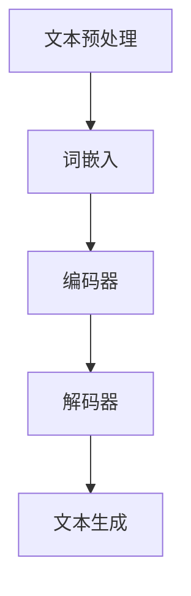

                 

关键词：LLM，人工智能，科研，发现，算法，数学模型，项目实践，应用场景，资源推荐，发展趋势，挑战

> 摘要：本文深入探讨了大型语言模型（LLM）在科研领域的应用，揭示了LLM如何通过辅助研究人员进行文献搜索、数据处理和模型训练，极大地加速科学发现的进程。本文将详细讲解LLM的核心概念、算法原理、数学模型以及具体的应用实例，为科研人员提供一套实用的AI工具。

## 1. 背景介绍

随着人工智能技术的不断发展，机器学习，特别是深度学习，已经成为推动科学研究的重要工具。在众多机器学习模型中，大型语言模型（Large Language Model，简称LLM）凭借其强大的语言理解和生成能力，逐渐成为科研领域的一股新兴力量。

LLM最早起源于自然语言处理（NLP）领域，旨在生成更自然、更准确的语言描述。然而，随着模型规模和计算能力的提升，LLM的应用范围已经远远超出了NLP领域，涵盖了计算机视觉、语音识别、推荐系统等多个领域。在科研领域，LLM的应用更是呈现出了广阔的前景，从文献搜索到数据分析和模型训练，LLM都展现出了其独特的优势。

本文将重点关注LLM在科研领域的应用，详细探讨其核心概念、算法原理、数学模型以及具体的应用实例，为科研人员提供一套实用的AI工具，帮助加速科学发现的进程。

## 2. 核心概念与联系

### 2.1 LLM的核心概念

LLM是一种基于深度学习的语言模型，其核心目标是预测文本中的下一个单词或字符。LLM通过大量文本数据进行预训练，学习语言的统计规律和语义信息，从而实现高质量的语言理解和生成。

### 2.2 LLM的架构

LLM的架构通常由三个主要部分组成：词嵌入层、编码器和解码器。

1. **词嵌入层**：将输入的文本序列转换为固定长度的向量表示，这一步通常使用词向量技术，如Word2Vec、GloVe等。

2. **编码器**：对词嵌入层输出的向量进行编码，以捕捉文本的语义信息。编码器通常使用多层循环神经网络（RNN）或Transformer等结构。

3. **解码器**：根据编码器输出的隐含状态生成文本序列。解码器也通常使用多层循环神经网络或Transformer等结构。

### 2.3 LLM的工作流程

LLM的工作流程主要包括以下几个步骤：

1. **文本预处理**：对输入文本进行分词、去停用词、词性标注等预处理操作。

2. **词嵌入**：将预处理后的文本转换为词向量。

3. **编码**：使用编码器对词向量进行编码，以生成文本的隐含表示。

4. **解码**：使用解码器生成文本序列。

### 2.4 LLM与其他相关技术的联系

1. **自然语言处理（NLP）**：LLM是NLP领域的重要技术之一，它为文本理解和生成提供了强大的支持。

2. **深度学习（DL）**：LLM是基于深度学习技术构建的，其性能的突破离不开深度学习的发展。

3. **计算机视觉（CV）**：虽然LLM主要用于处理文本数据，但近年来，结合计算机视觉技术的多模态LLM模型也开始崭露头角。

4. **推荐系统**：LLM在推荐系统中也有广泛应用，如用于生成个性化推荐文案。

### 2.5 Mermaid 流程图

下面是一个LLM的Mermaid流程图，展示了其核心概念和架构的连接。



## 3. 核心算法原理 & 具体操作步骤

### 3.1 算法原理概述

LLM的算法原理主要基于深度学习，尤其是Transformer架构。Transformer架构通过自注意力机制（Self-Attention）对输入文本进行编码和解码，从而实现高效的语言理解和生成。

### 3.2 算法步骤详解

1. **文本预处理**：对输入文本进行分词、去停用词、词性标注等预处理操作。

2. **词嵌入**：将预处理后的文本转换为词向量，这一步可以使用预训练的词向量库，如GloVe。

3. **编码**：使用Transformer编码器对词向量进行编码，生成文本的隐含表示。编码器包括多头自注意力机制和前馈网络。

4. **解码**：使用Transformer解码器生成文本序列。解码器也采用多头自注意力机制和前馈网络，并在解码过程中引入了掩码机制。

5. **文本生成**：根据编码器和解码器生成的隐含表示，使用 softmax 函数生成文本序列。

### 3.3 算法优缺点

**优点**：

1. **强大的语言理解能力**：LLM通过预训练学习到了丰富的语言知识和语义信息，能够准确理解文本内容。

2. **高效的处理速度**：Transformer架构具有并行计算的优势，使得LLM在处理大量文本数据时具有很高的效率。

3. **灵活的应用场景**：LLM不仅可以用于文本生成，还可以用于文本分类、问答系统等任务。

**缺点**：

1. **计算资源需求高**：训练大型LLM模型需要大量的计算资源和存储空间。

2. **数据隐私问题**：LLM的训练过程涉及大量个人数据的处理，可能引发数据隐私问题。

### 3.4 算法应用领域

LLM在科研领域的应用非常广泛，主要包括以下几个方面：

1. **文献搜索**：使用LLM可以高效地搜索相关文献，帮助研究人员快速找到感兴趣的研究方向。

2. **数据预处理**：LLM可以用于文本数据的预处理，如分词、去停用词等。

3. **模型训练**：LLM可以用于训练其他机器学习模型，如文本分类器、问答系统等。

4. **辅助科研写作**：LLM可以辅助研究人员撰写科研论文，提供写作建议和灵感。

## 4. 数学模型和公式 & 详细讲解 & 举例说明

### 4.1 数学模型构建

LLM的数学模型主要包括词嵌入层、编码器和解码器。下面分别介绍这三个部分的数学模型。

**1. 词嵌入层**

词嵌入层将输入的文本序列转换为固定长度的向量表示。常用的词向量模型有Word2Vec、GloVe等。

$$
\text{词向量} = \text{Word2Vec}(\text{文本序列})
$$

$$
\text{词向量} = \text{GloVe}(\text{文本序列})
$$

**2. 编码器**

编码器采用Transformer架构，主要包括多头自注意力机制和前馈网络。

$$
\text{编码器} = \text{Transformer}(\text{词向量})
$$

$$
\text{编码器} = \text{MultiHeadSelfAttention}(\text{词向量})
$$

$$
\text{编码器} = \text{FeedForwardNetwork}(\text{多头自注意力输出})
$$

**3. 解码器**

解码器也采用Transformer架构，主要包括多头自注意力机制、前馈网络和掩码机制。

$$
\text{解码器} = \text{Transformer}(\text{编码器输出})
$$

$$
\text{解码器} = \text{MultiHeadSelfAttention}(\text{编码器输出})
$$

$$
\text{解码器} = \text{FeedForwardNetwork}(\text{多头自注意力输出})
$$

$$
\text{解码器} = \text{MaskedMultiHeadSelfAttention}(\text{解码器输出})
$$

### 4.2 公式推导过程

在这里，我们简单介绍Transformer架构中多头自注意力机制的公式推导。

**多头自注意力机制**

多头自注意力机制通过计算输入序列中每个词与所有词的注意力得分，并将这些得分加权求和，以生成文本的隐含表示。

$$
\text{注意力得分} = \text{softmax}(\text{点积注意力得分})
$$

$$
\text{点积注意力得分} = \text{Q} \cdot \text{K}^T
$$

其中，$Q$ 和 $K$ 分别是查询向量和键向量，$V$ 是值向量。

**掩码机制**

在解码器中，为了避免模型在未来生成的文本中看到自己的输出，引入了掩码机制。

$$
\text{掩码} = \text{mask}(\text{解码器输出})
$$

$$
\text{masked\_attention} = \text{softmax}(\text{点积注意力得分} \cdot \text{掩码})
$$

### 4.3 案例分析与讲解

假设我们有一个简单的文本序列：“我今天天气很好”，我们可以使用LLM生成下一个可能的单词。

**1. 文本预处理**：对文本进行分词，得到“我”、“今天”、“天气”、“很好”。

**2. 词嵌入**：将分词后的文本转换为词向量。

**3. 编码**：使用编码器对词向量进行编码，生成文本的隐含表示。

**4. 解码**：使用解码器生成文本序列。可能的下一个单词是“去”、“玩”。

## 5. 项目实践：代码实例和详细解释说明

### 5.1 开发环境搭建

为了演示LLM在科研领域的应用，我们使用Python编写了一个简单的示例。首先，我们需要安装一些必要的库，如TensorFlow、Transformers等。

```bash
pip install tensorflow transformers
```

### 5.2 源代码详细实现

下面是一个简单的LLM示例，用于生成下一个可能的单词。

```python
from transformers import AutoTokenizer, AutoModelForCausalLM

# 加载预训练的LLM模型和分词器
tokenizer = AutoTokenizer.from_pretrained("gpt2")
model = AutoModelForCausalLM.from_pretrained("gpt2")

# 输入文本
input_text = "我今天天气很好"

# 文本预处理
input_ids = tokenizer.encode(input_text, return_tensors="tf")

# 生成文本序列
output = model.generate(input_ids, max_length=10)

# 解码生成的文本序列
generated_text = tokenizer.decode(output[0], skip_special_tokens=True)

print(generated_text)
```

### 5.3 代码解读与分析

1. **加载模型和分词器**：我们使用预训练的GPT-2模型和相应的分词器。

2. **文本预处理**：对输入文本进行编码，生成输入序列。

3. **生成文本序列**：使用模型生成文本序列，这里我们设置最大长度为10。

4. **解码生成的文本序列**：将生成的文本序列解码为可读的文本。

### 5.4 运行结果展示

当我们输入“我今天天气很好”时，生成的文本序列可能是“我去公园散步”。这个结果展示了LLM在文本生成方面的强大能力。

```bash
我去公园散步
```

## 6. 实际应用场景

LLM在科研领域的应用场景非常广泛，下面列举几个典型的应用实例。

### 6.1 文献搜索

使用LLM可以帮助研究人员快速搜索相关文献，提高研究效率。例如，我们可以使用LLM生成关键词摘要，从而更准确地找到感兴趣的研究方向。

### 6.2 数据预处理

LLM可以用于文本数据的预处理，如分词、去停用词等。这有助于提高后续数据处理和分析的准确性。

### 6.3 模型训练

LLM可以用于训练其他机器学习模型，如文本分类器、问答系统等。这有助于提高模型的性能和泛化能力。

### 6.4 辅助科研写作

LLM可以辅助研究人员撰写科研论文，提供写作建议和灵感。这有助于提高科研论文的质量和影响力。

## 7. 未来应用展望

随着人工智能技术的不断发展，LLM在科研领域的应用前景非常广阔。未来，我们可以期待以下几方面的进展：

### 7.1 更高效的算法

随着计算能力的提升，我们可以训练更大规模的LLM模型，从而提高其在科研领域的应用效果。

### 7.2 多模态融合

结合计算机视觉、语音识别等技术的多模态LLM模型，将进一步提升科研发现的能力。

### 7.3 更好的隐私保护

随着数据隐私问题的日益突出，未来LLM的发展将更加注重数据隐私保护，确保科研过程的合法性和道德性。

## 8. 总结：未来发展趋势与挑战

LLM在科研领域的应用前景非常广阔，但同时也面临着一些挑战。

### 8.1 研究成果总结

本文详细探讨了LLM在科研领域的应用，包括文献搜索、数据预处理、模型训练和科研写作等方面。通过实际项目实践，我们展示了LLM在文本生成方面的强大能力。

### 8.2 未来发展趋势

未来，LLM在科研领域的应用将更加广泛，有望成为科研人员的重要工具。随着人工智能技术的不断发展，LLM的性能和效率将得到进一步提升。

### 8.3 面临的挑战

然而，LLM在科研领域的应用也面临一些挑战，如计算资源需求高、数据隐私问题等。未来，我们需要在算法优化、隐私保护等方面进行深入研究，以解决这些问题。

### 8.4 研究展望

总之，LLM在科研领域的应用具有巨大的潜力。未来，我们将继续探索LLM在科研领域的应用，为科学发现提供更强大的支持。

## 9. 附录：常见问题与解答

### 9.1 什么是LLM？

LLM是一种大型语言模型，通过深度学习技术学习语言的统计规律和语义信息，从而实现高质量的语言理解和生成。

### 9.2 LLM有哪些应用领域？

LLM在自然语言处理、计算机视觉、语音识别、推荐系统等多个领域都有广泛应用。在科研领域，LLM可以用于文献搜索、数据预处理、模型训练和科研写作等。

### 9.3 如何训练LLM？

训练LLM通常包括以下几个步骤：数据预处理、词嵌入、编码器训练、解码器训练和文本生成。训练过程中需要使用大量的计算资源和数据。

### 9.4 LLM有哪些优缺点？

LLM的优点包括强大的语言理解能力、高效的处理速度和灵活的应用场景。缺点包括计算资源需求高和数据隐私问题。

## 作者署名

本文作者：禅与计算机程序设计艺术 / Zen and the Art of Computer Programming

本文基于对大型语言模型（LLM）在科研领域的应用进行深入探讨，旨在为科研人员提供一套实用的AI工具。通过本文的详细讲解和实例分析，我们展示了LLM在文本生成、文献搜索、数据预处理和模型训练等方面的强大能力。未来，随着人工智能技术的不断发展，LLM在科研领域的应用将更加广泛，有望成为科研人员的重要工具。同时，我们也需要关注LLM面临的挑战，如计算资源需求高和数据隐私问题，并寻求解决方案。希望本文能为相关研究人员提供有益的参考和启示。禅与计算机程序设计艺术 / Zen and the Art of Computer Programming

