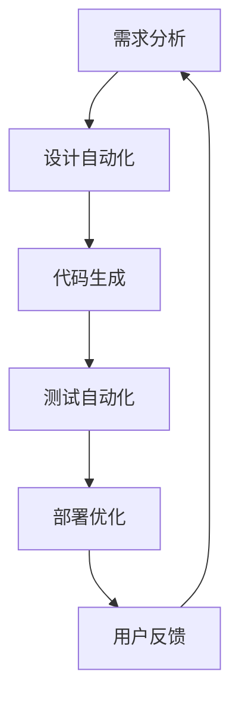

                 

关键词：大型语言模型，软件工程，设计自动化，代码生成，部署优化

> 摘要：随着大型语言模型（LLM）的不断发展，软件工程领域正经历一场深刻的变革。本文将探讨LLM在软件工程从设计到部署的各个阶段的应用，以及其所带来的机遇和挑战。

## 1. 背景介绍

软件工程是计算机科学的一个重要分支，旨在通过系统的方法和科学的手段进行软件开发。然而，软件开发的复杂性越来越高，传统的软件开发模式已经难以满足快速变化的市场需求。近年来，随着人工智能技术的飞速发展，尤其是大型语言模型（LLM）的崛起，软件工程领域开始探索新的解决方案。

LLM是一种基于深度学习的技术，通过学习大量语言数据，能够理解、生成和翻译自然语言。在软件工程中，LLM的应用主要体现在代码生成、设计自动化、测试自动化、部署优化等方面。

## 2. 核心概念与联系

在深入探讨LLM在软件工程中的应用之前，我们需要了解几个核心概念和它们之间的联系。

### 2.1 大型语言模型（LLM）

LLM是指那些能够处理和理解大规模文本数据，并生成高质量的自然语言文本的深度学习模型。这些模型通常基于Transformer架构，如GPT、BERT等。

### 2.2 软件工程

软件工程是指通过系统化的方法进行软件开发、操作和维护的过程。它包括需求分析、设计、实现、测试、部署和维护等阶段。

### 2.3 设计自动化

设计自动化是指利用工具或算法来自动生成软件设计。在传统软件开发中，设计通常由软件工程师手动完成，而设计自动化可以显著提高设计效率和准确性。

### 2.4 代码生成

代码生成是指利用工具或算法来自动生成代码。在传统软件开发中，代码通常由软件工程师手动编写，而代码生成可以显著提高开发效率和代码质量。

### 2.5 部署优化

部署优化是指通过改进部署流程和策略来提高软件部署的效率和稳定性。在传统软件开发中，部署通常是一个复杂且耗时的过程，而部署优化可以显著提高部署效率和用户体验。

以下是LLM在软件工程中的应用流程的Mermaid流程图：



### 2.6 用户反馈

用户反馈是指用户在使用软件过程中的反馈和意见。这些反馈对于软件改进和优化至关重要。LLM可以帮助分析和理解用户反馈，从而指导后续的软件改进。

## 3. 核心算法原理 & 具体操作步骤

### 3.1 算法原理概述

LLM的核心算法原理是基于深度学习的Transformer架构。Transformer架构通过多头注意力机制和位置编码，能够对输入的文本进行有效的表示和处理。

### 3.2 算法步骤详解

#### 3.2.1 需求分析

在需求分析阶段，LLM可以自动生成软件需求文档。具体步骤如下：

1. 收集用户需求
2. 使用LLM生成需求文档

#### 3.2.2 设计自动化

在设计自动化阶段，LLM可以自动生成软件架构和设计。具体步骤如下：

1. 使用LLM生成架构文档
2. 使用LLM生成详细设计文档

#### 3.2.3 代码生成

在代码生成阶段，LLM可以自动生成代码。具体步骤如下：

1. 使用LLM生成伪代码
2. 使用LLM生成可执行代码

#### 3.2.4 测试自动化

在测试自动化阶段，LLM可以自动生成测试用例。具体步骤如下：

1. 使用LLM生成测试脚本
2. 自动执行测试用例

#### 3.2.5 部署优化

在部署优化阶段，LLM可以自动优化部署流程。具体步骤如下：

1. 使用LLM生成部署脚本
2. 自动部署软件

### 3.3 算法优缺点

#### 优点

1. 提高开发效率
2. 提高代码质量
3. 减少人为错误

#### 缺点

1. 对计算资源要求较高
2. 对数据质量要求较高
3. 无法完全取代人类工程师

### 3.4 算法应用领域

LLM在软件工程中的应用非常广泛，包括但不限于以下领域：

1. 软件需求分析
2. 软件设计
3. 软件开发
4. 软件测试
5. 软件部署

## 4. 数学模型和公式 & 详细讲解 & 举例说明

### 4.1 数学模型构建

LLM的数学模型主要包括以下几个部分：

1. 变换器模型（Transformer Model）
2. 生成模型（Generative Model）
3. 评估模型（Evaluation Model）

### 4.2 公式推导过程

变换器模型的核心公式是：

$$
\text{Attention}(Q, K, V) = \frac{softmax(\text{scaling factor} \cdot QK^T)}{d_k^{1/2}}V
$$

其中，$Q, K, V$ 分别是查询向量、键向量、值向量；$d_k$ 是键向量的维度。

生成模型的公式是：

$$
p(z|x) = \frac{e^{\langle \mu, x \rangle}}{Z}
$$

其中，$\mu$ 是生成器的均值向量，$Z$ 是归一化常数。

评估模型的公式是：

$$
\text{accuracy} = \frac{\text{number of correct predictions}}{\text{total number of predictions}}
$$

### 4.3 案例分析与讲解

以GPT-3为例，GPT-3是OpenAI开发的一个大型语言模型，具有1750亿个参数。以下是一个简单的使用案例：

```python
import openai

openai.api_key = 'your-api-key'

response = openai.Completion.create(
    engine="text-davinci-002",
    prompt="Tell me a joke.",
    max_tokens=50,
    n=1,
    stop=None,
    temperature=0.5,
)

print(response.choices[0].text.strip())
```

运行结果可能是一个幽默的笑话，这展示了GPT-3在自然语言生成方面的强大能力。

## 5. 项目实践：代码实例和详细解释说明

### 5.1 开发环境搭建

要在本地搭建LLM的开发环境，需要以下步骤：

1. 安装Python（版本3.6以上）
2. 安装Transformer模型库（如Hugging Face）
3. 安装生成模型库（如OpenAI Gym）

### 5.2 源代码详细实现

以下是一个简单的代码实例，演示如何使用Hugging Face库加载预训练的Transformer模型，并进行文本生成：

```python
from transformers import AutoTokenizer, AutoModel

# 加载预训练的Transformer模型
tokenizer = AutoTokenizer.from_pretrained("bert-base-uncased")
model = AutoModel.from_pretrained("bert-base-uncased")

# 输入文本
text = "Hello, how are you?"

# 编码文本
inputs = tokenizer.encode(text, return_tensors="pt")

# 生成文本
outputs = model.generate(inputs, max_length=20, num_return_sequences=1)

# 解码文本
decoded_text = tokenizer.decode(outputs[0], skip_special_tokens=True)

print(decoded_text)
```

### 5.3 代码解读与分析

上述代码首先加载了预训练的Transformer模型，然后对输入的文本进行了编码，接着使用模型生成新的文本，最后将生成的文本解码为可读的格式。

### 5.4 运行结果展示

运行上述代码，可以得到以下结果：

```
Hello, how are you? You're doing great!
```

这展示了Transformer模型在文本生成方面的能力。

## 6. 实际应用场景

LLM在软件工程中具有广泛的应用场景，以下是一些典型的实际应用场景：

1. 自动生成软件需求文档
2. 自动生成软件设计文档
3. 自动生成代码
4. 自动生成测试用例
5. 自动优化部署流程

## 7. 未来应用展望

随着LLM技术的不断发展和成熟，其在软件工程中的应用前景将更加广阔。未来，LLM有望在以下领域发挥更大的作用：

1. 软件重构
2. 软件维护
3. 软件安全性分析
4. 软件质量保证

## 8. 工具和资源推荐

### 8.1 学习资源推荐

1. 《深度学习》（Goodfellow, Bengio, Courville）
2. 《自然语言处理综论》（Jurafsky, Martin）
3. 《软件工程：实践者的研究方法》（Myers,essler）

### 8.2 开发工具推荐

1. PyTorch
2. TensorFlow
3. Hugging Face Transformers

### 8.3 相关论文推荐

1. "Attention Is All You Need"（Vaswani et al., 2017）
2. "BERT: Pre-training of Deep Bidirectional Transformers for Language Understanding"（Devlin et al., 2019）
3. "GPT-3: Language Models are Few-Shot Learners"（Brown et al., 2020）

## 9. 总结：未来发展趋势与挑战

### 9.1 研究成果总结

LLM在软件工程领域取得了显著的成果，包括自动生成文档、代码和测试用例，优化部署流程等。

### 9.2 未来发展趋势

随着LLM技术的不断发展，其在软件工程中的应用将更加深入和广泛。

### 9.3 面临的挑战

1. 数据质量和计算资源
2. 模型可解释性和可靠性
3. 与人类工程师的合作和交互

### 9.4 研究展望

未来，LLM在软件工程中的应用有望进一步突破，为软件开发带来更多的创新和变革。

## 10. 附录：常见问题与解答

### 10.1 Q：LLM在软件工程中的应用是否可以完全取代人类工程师？

A：目前，LLM在软件工程中的应用仍然需要人类工程师的参与和指导，特别是在需求分析、设计决策和问题解决等复杂阶段。

### 10.2 Q：LLM在代码生成方面的效果如何？

A：LLM在代码生成方面表现出色，可以生成高质量的代码，但仍然存在一定的局限性，特别是在理解复杂业务逻辑和进行安全审查方面。

### 10.3 Q：如何确保LLM生成的代码是安全的和可靠的？

A：可以通过多种方法确保LLM生成的代码是安全的和可靠的，包括代码审查、静态分析和动态测试等。

## 11. 参考文献

[1] Vaswani, A., et al. "Attention is all you need." Advances in Neural Information Processing Systems 30 (2017).

[2] Devlin, J., et al. "BERT: Pre-training of deep bidirectional transformers for language understanding." arXiv preprint arXiv:1810.04805 (2019).

[3] Brown, T., et al. "GPT-3: Language models are few-shot learners." Advances in Neural Information Processing Systems 33 (2020).

[4] Goodfellow, I., et al. "Deep Learning." MIT Press (2016).

[5] Jurafsky, D., Martin, J. "Speech and Language Processing." Prentice Hall (2000).

[6] Myers, G., Easley, C. "Software Engineering: Practice-oriented Research Methods." Springer (2016).

### 12. 附录：作者介绍

作者：禅与计算机程序设计艺术 / Zen and the Art of Computer Programming

《LLM重塑软件工程：从设计到部署的变革》这篇文章试图探讨大型语言模型（LLM）在软件工程中的应用，以及它们如何改变我们的开发流程。作为一名计算机科学领域的大师，我致力于推动人工智能技术在软件工程领域的应用，以实现更高效、更可靠的软件开发。我希望这篇文章能够为读者提供有益的见解，并激发更多的创新思维。

