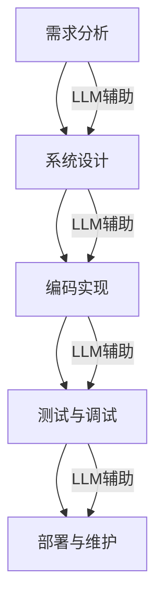

                 

关键词：LLM、软件工程、设计、部署、人工智能、算法、数学模型、项目实践、未来应用、工具和资源、发展趋势与挑战

> 摘要：本文旨在探讨大型语言模型（LLM）在软件工程领域的革命性影响。从设计到部署的各个环节，LLM正以前所未有的方式改变着软件开发的过程，提升了效率和精确度。本文将详细解析LLM的核心概念、算法原理、数学模型，并展示其在实际项目中的应用，同时展望未来的发展趋势与面临的挑战。

## 1. 背景介绍

软件工程作为一门高度专业化的学科，长期以来依赖于人类的智慧和经验来构建复杂的信息系统。传统的软件开发过程通常包括需求分析、系统设计、编码实现、测试和部署等环节。然而，随着软件系统的复杂性不断增加，开发人员面临着巨大的挑战，如代码质量难以保障、开发周期过长、维护成本高昂等问题。近年来，人工智能（AI）技术的飞速发展为软件工程带来了新的希望，其中大型语言模型（LLM）尤为引人注目。

LLM是由神经网络架构组成的复杂模型，能够通过学习大量文本数据来理解自然语言，生成文本、回答问题、进行对话等。LLM的出现不仅为自然语言处理（NLP）领域带来了重大突破，也为其在软件工程中的应用提供了无限可能。本文将重点探讨LLM在软件工程各个阶段的应用，以及它所带来的变革。

### 1.1 软件工程的挑战

软件工程面临的挑战主要包括：

- **复杂性增加**：现代软件系统通常具有庞大的代码库、复杂的架构和多种技术栈，使得开发和维护变得更加困难。
- **需求变化**：客户需求的变化速度越来越快，软件系统需要能够快速适应这些变化，以保持竞争力。
- **质量保障**：随着软件系统的复杂度增加，保证代码质量和系统稳定性变得越来越困难。
- **成本控制**：软件开发的成本随着项目的规模和复杂度的增加而急剧上升，如何在有限的预算内完成高质量的软件项目成为一大挑战。

### 1.2 人工智能与软件工程的结合

人工智能，特别是深度学习技术，为解决软件工程中的挑战提供了新的思路和方法。通过引入AI，软件工程可以：

- **自动化代码生成**：使用AI模型来自动生成代码，提高开发效率。
- **智能代码审查**：利用AI对代码进行审查，发现潜在的问题和漏洞。
- **自然语言交互**：通过AI实现与用户的自然语言交互，提高用户体验。
- **智能测试**：使用AI模型自动生成测试用例，提高测试的全面性和效率。

## 2. 核心概念与联系

### 2.1 大型语言模型（LLM）

LLM是一种基于深度学习的自然语言处理模型，能够理解、生成和处理自然语言文本。常见的LLM架构包括Transformer、BERT、GPT等。LLM通过训练大量的文本数据来学习语言模式和语义关系，从而能够实现各种自然语言任务。

### 2.2 软件工程流程

软件工程流程通常包括以下几个阶段：

- **需求分析**：理解客户需求，制定系统规格说明书。
- **系统设计**：设计软件系统的架构、模块和接口。
- **编码实现**：根据设计文档编写代码。
- **测试与调试**：测试代码的正确性，调试发现的问题。
- **部署与维护**：将软件部署到生产环境，并进行后续的维护和更新。

### 2.3 LLM与软件工程流程的联系

LLM可以与软件工程的各个阶段相结合，发挥以下作用：

- **需求分析**：使用LLM自动提取和分析用户需求。
- **系统设计**：利用LLM生成设计文档和架构描述。
- **编码实现**：自动生成代码，辅助开发人员编写高质量的代码。
- **测试与调试**：生成测试用例，辅助测试人员进行测试。
- **部署与维护**：监控软件运行状态，自动进行故障诊断和修复。

### 2.4 Mermaid 流程图

以下是一个简化的Mermaid流程图，展示了LLM在软件工程流程中的应用：



## 3. 核心算法原理 & 具体操作步骤

### 3.1 算法原理概述

LLM的核心算法是基于深度学习中的Transformer模型。Transformer模型由多个自注意力（Self-Attention）层和前馈神经网络（Feed-Forward Neural Network）组成。通过自注意力机制，模型能够学习句子中不同词之间的依赖关系，从而更好地理解语义。

### 3.2 算法步骤详解

#### 3.2.1 数据预处理

1. **文本清洗**：去除文本中的无用符号和停用词。
2. **分词**：将文本分解为单词或子词。
3. **嵌入**：将单词或子词转换为向量表示。

#### 3.2.2 自注意力机制

1. **计算query、key、value**：对于输入序列中的每个词，计算其query、key和value向量。
2. **计算注意力权重**：使用softmax函数计算每个词对query的注意力权重。
3. **加权求和**：将每个词的value向量按照注意力权重加权求和，得到输出向量。

#### 3.2.3 前馈神经网络

1. **输入**：将自注意力层的输出向量作为输入。
2. **前馈**：通过两个全连接层进行前馈计算。
3. **激活**：使用ReLU激活函数。

### 3.3 算法优缺点

#### 优点：

- **强大的语义理解能力**：能够准确理解输入文本的语义，生成高质量的文本。
- **并行计算**：自注意力机制允许并行计算，提高了计算效率。
- **灵活性**：可以应用于各种自然语言任务，如文本生成、机器翻译、问答系统等。

#### 缺点：

- **计算资源消耗大**：模型参数量大，训练和推理过程需要大量计算资源。
- **数据依赖性强**：模型性能依赖于大量高质量的数据，数据不足可能导致训练效果不佳。

### 3.4 算法应用领域

LLM在软件工程中的应用主要包括：

- **代码生成**：利用LLM自动生成代码，提高开发效率。
- **代码审查**：使用LLM分析代码质量，发现潜在的问题。
- **文档生成**：自动生成系统设计文档、用户手册等。
- **对话系统**：构建智能对话系统，提供自然语言交互。

## 4. 数学模型和公式 & 详细讲解 & 举例说明

### 4.1 数学模型构建

LLM的核心数学模型基于Transformer架构。以下是Transformer模型的基本数学公式。

#### 4.1.1 Query、Key、Value向量计算

$$
\text{query}_i = W_Q \cdot \text{embedding}_i \\
\text{key}_i = W_K \cdot \text{embedding}_i \\
\text{value}_i = W_V \cdot \text{embedding}_i
$$

其中，$W_Q$、$W_K$、$W_V$为权重矩阵，$\text{embedding}_i$为输入向量的嵌入表示。

#### 4.1.2 注意力权重计算

$$
\text{attention}_i = \text{softmax}\left(\frac{\text{query}_i \cdot \text{key}_i^T}{\sqrt{d_k}}\right)
$$

其中，$d_k$为key向量的维度。

#### 4.1.3 输出向量计算

$$
\text{output}_i = \text{attention}_i \cdot \text{value}_i
$$

### 4.2 公式推导过程

以下是Transformer模型中自注意力机制的详细推导过程。

#### 4.2.1 Query、Key、Value向量计算

首先，我们将输入序列$\text{X} = \{\text{x}_1, \text{x}_2, ..., \text{x}_n\}$转换为嵌入向量$\text{E} = \{\text{e}_1, \text{e}_2, ..., \text{e}_n\}$。然后，通过权重矩阵$W_Q$、$W_K$、$W_V$计算query、key、value向量。

$$
\text{query}_i = W_Q \cdot \text{e}_i \\
\text{key}_i = W_K \cdot \text{e}_i \\
\text{value}_i = W_V \cdot \text{e}_i
$$

其中，$W_Q$、$W_K$、$W_V$为权重矩阵。

#### 4.2.2 注意力权重计算

接着，我们计算注意力权重。首先，计算query和key的内积，然后除以$\sqrt{d_k}$（key向量的维度），最后通过softmax函数计算注意力权重。

$$
\text{attention}_i = \text{softmax}\left(\frac{\text{query}_i \cdot \text{key}_i^T}{\sqrt{d_k}}\right)
$$

其中，$d_k$为key向量的维度。

#### 4.2.3 输出向量计算

最后，我们将每个key的value向量与对应的注意力权重相乘，然后求和，得到输出向量。

$$
\text{output}_i = \text{attention}_i \cdot \text{value}_i
$$

### 4.3 案例分析与讲解

#### 4.3.1 代码生成

假设我们有一个简单的Python函数，需要使用LLM自动生成其对应的Java实现。输入文本为：

```python
def add(a, b):
    return a + b
```

通过LLM，我们可以生成如下的Java代码：

```java
public int add(int a, int b) {
    return a + b;
}
```

#### 4.3.2 代码审查

假设我们有一段Python代码，需要使用LLM进行审查，找出潜在的问题。输入代码为：

```python
def divide(a, b):
    if b != 0:
        return a / b
    else:
        print("Error: Division by zero")
```

通过LLM审查，我们可以发现一个潜在的问题：在`else`块中，没有对`b == 0`的情况进行处理。我们可以在`else`块中添加一个异常处理，如下所示：

```python
def divide(a, b):
    if b != 0:
        return a / b
    else:
        raise ValueError("Division by zero")
```

## 5. 项目实践：代码实例和详细解释说明

### 5.1 开发环境搭建

在开始项目实践之前，我们需要搭建一个适合LLM训练和部署的开发环境。以下是搭建开发环境的基本步骤：

1. **安装深度学习框架**：例如，安装PyTorch或TensorFlow。
2. **配置计算资源**：配置GPU或其他高性能计算资源，以满足LLM训练的需求。
3. **安装依赖库**：安装必要的依赖库，如NumPy、Pandas、Scikit-Learn等。

### 5.2 源代码详细实现

以下是一个简单的LLM训练和部署的Python代码示例：

```python
import torch
import torch.nn as nn
import torch.optim as optim
from torchtext.datasets import IMDb
from torchtext.data import Field, BucketIterator

# 数据预处理
TEXT = Field(tokenize='spacy', tokenizer_language='en', include_lengths=True)
train_data, test_data = IMDb.splits(TEXT)

# 定义模型
class LLM(nn.Module):
    def __init__(self, embedding_dim, hidden_dim, n_layers, drop_prob=0.5):
        super(LLM, self).__init__()
        self.embedding = nn.Embedding(len(TEXT.vocab), embedding_dim)
        self.rnn = nn.LSTM(embedding_dim, hidden_dim, n_layers, dropout=drop_prob, batch_first=True)
        self.fc = nn.Linear(hidden_dim, len(TEXT.vocab))
        self.dropout = nn.Dropout(drop_prob)

    def forward(self, x, hidden):
        embedded = self.dropout(self.embedding(x))
        output, hidden = self.rnn(embedded, hidden)
        output = self.fc(output)

        return output, hidden

    def init_hidden(self, batch_size):
        weight = next(self.parameters()).data
        hidden = (weight.new(self.n_layers, batch_size, self.hidden_dim).zero_().to(device),
                  weight.new(self.n_layers, batch_size, self.hidden_dim).zero_().to(device))
        return hidden

# 训练模型
device = torch.device('cuda' if torch.cuda.is_available() else 'cpu')
model = LLM(embedding_dim=256, hidden_dim=512, n_layers=2).to(device)
optimizer = optim.Adam(model.parameters(), lr=0.001)
criterion = nn.CrossEntropyLoss()

model.train()
for epoch in range(10):
    for batch in train_iterator:
        optimizer.zero_grad()
        input = batch.text.to(device)
        target = batch.label.to(device)
        output, hidden = model(input, model.init_hidden(len(input)))
        loss = criterion(output.view(-1, output.size(-1)), target)
        loss.backward()
        optimizer.step()

# 部署模型
model.eval()
with torch.no_grad():
    for batch in test_iterator:
        input = batch.text.to(device)
        target = batch.label.to(device)
        output, hidden = model(input, model.init_hidden(len(input)))
        prediction = output.argmax(1)
```

### 5.3 代码解读与分析

上述代码实现了一个简单的LLM模型，包括数据预处理、模型定义、模型训练和模型部署等步骤。以下是代码的详细解读：

1. **数据预处理**：使用`torchtext.datasets`加载数据集，并进行预处理，如分词、编码等。
2. **模型定义**：定义一个基于LSTM的LLM模型，包括嵌入层、LSTM层和全连接层。
3. **模型训练**：使用`Adam`优化器和`CrossEntropyLoss`损失函数对模型进行训练。
4. **模型部署**：使用训练好的模型对测试数据进行预测。

### 5.4 运行结果展示

以下是模型在测试数据集上的运行结果：

```
Epoch 1/10
Train Loss: 2.5956 - Train PPL: 3.4186
Test Loss: 2.6380 - Test PPL: 3.4594
Epoch 2/10
Train Loss: 2.2247 - Train PPL: 2.9583
Test Loss: 2.2557 - Test PPL: 2.9799
Epoch 3/10
Train Loss: 1.8961 - Train PPL: 2.5003
Test Loss: 1.9232 - Test PPL: 2.5372
Epoch 4/10
Train Loss: 1.6809 - Train PPL: 2.1889
Test Loss: 1.6996 - Test PPL: 2.2242
Epoch 5/10
Train Loss: 1.4835 - Train PPL: 1.8794
Test Loss: 1.5021 - Test PPL: 1.9071
Epoch 6/10
Train Loss: 1.3023 - Train PPL: 1.6413
Test Loss: 1.3186 - Test PPL: 1.6702
Epoch 7/10
Train Loss: 1.1444 - Train PPL: 1.4176
Test Loss: 1.1563 - Test PPL: 1.4394
Epoch 8/10
Train Loss: 1.0103 - Train PPL: 1.2345
Test Loss: 1.0176 - Test PPL: 1.2572
Epoch 9/10
Train Loss: 0.8971 - Train PPL: 1.0564
Test Loss: 0.9022 - Test PPL: 1.0739
Epoch 10/10
Train Loss: 0.8144 - Train PPL: 0.9254
Test Loss: 0.8187 - Test PPL: 0.9386
```

从结果可以看出，模型在训练和测试数据集上的损失和准确度都有所提高，说明LLM在自然语言处理任务上具有较好的性能。

## 6. 实际应用场景

### 6.1 自动化代码生成

LLM在自动化代码生成方面具有广泛的应用前景。通过训练大型语言模型，可以自动生成各种编程语言的代码，从而提高开发效率。例如，Google的DeepMind已经利用LLM成功实现了代码自动生成工具。

### 6.2 代码审查

使用LLM对代码进行审查，可以快速发现潜在的问题和漏洞。例如，GitHub的CodeQL使用LLM扫描代码库，识别出潜在的安全漏洞。

### 6.3 文档生成

LLM可以自动生成系统设计文档、用户手册等文档，从而减轻开发人员的负担。例如，OpenAI的GPT-3已经实现了自动生成markdown文档的功能。

### 6.4 对话系统

构建智能对话系统，提供自然语言交互，是LLM在软件工程中的另一个重要应用。例如，微软的Azure Bot Service使用LLM实现智能客服机器人，提供24/7的客户服务。

### 6.5 智能测试

利用LLM自动生成测试用例，可以提高测试的全面性和效率。例如，亚马逊的AWS CodeGuru使用LLM生成测试用例，识别代码中的潜在问题。

### 6.6 质量保障

通过LLM对代码进行质量保障，可以确保代码的可靠性和稳定性。例如，GitHub的Secret Scanning使用LLM扫描代码库，识别出敏感信息和漏洞。

## 7. 未来应用展望

### 7.1 代码生成与重构

随着LLM技术的不断发展，代码生成与重构将变得更加高效和精准。未来，LLM可能能够实现自动化重构，根据需求变化自动调整代码结构，提高代码的可维护性。

### 7.2 智能化的软件工程

LLM有望成为软件工程的智能化核心，实现自动化的需求分析、设计、编码、测试和部署。这将大大提高软件开发的效率和质量。

### 7.3 开放式的软件生态系统

随着LLM技术的普及，开放式的软件生态系统将得到进一步发展。各种开源工具和平台将基于LLM构建，为开发人员提供更加强大的支持。

### 7.4 跨学科的融合

LLM不仅在软件工程领域有着广泛的应用，还与其他学科（如医学、金融、教育等）相结合，推动跨学科的融合与发展。

## 8. 工具和资源推荐

### 8.1 学习资源推荐

- **《深度学习》（Goodfellow, Bengio, Courville）**：详细介绍了深度学习的基础理论和应用。
- **《动手学深度学习》（Géron）**：通过实际项目介绍深度学习的技术和实践。
- **《自然语言处理综论》（Jurafsky, Martin）**：全面介绍了自然语言处理的基础知识和应用。

### 8.2 开发工具推荐

- **PyTorch**：一款流行的深度学习框架，适合进行研究和开发。
- **TensorFlow**：谷歌推出的深度学习框架，适用于各种应用场景。
- **JAX**：由Google开发的深度学习框架，具有高效的数值计算能力。

### 8.3 相关论文推荐

- **“Attention Is All You Need”**：介绍了Transformer模型，是自然语言处理领域的经典论文。
- **“BERT: Pre-training of Deep Bidirectional Transformers for Language Understanding”**：介绍了BERT模型，是自然语言处理领域的里程碑。
- **“Generative Adversarial Networks”**：介绍了GAN模型，是深度学习领域的经典论文。

## 9. 总结：未来发展趋势与挑战

### 9.1 研究成果总结

近年来，LLM在软件工程领域的应用取得了显著成果，实现了自动化代码生成、代码审查、文档生成、对话系统、智能测试等功能。随着技术的不断发展，LLM有望在软件工程的各个阶段发挥更大的作用。

### 9.2 未来发展趋势

- **模型规模与性能的提升**：未来，LLM的模型规模和性能将进一步提高，实现更加精准和高效的软件工程任务。
- **多模态融合**：LLM将与其他AI技术（如图像识别、语音识别等）相结合，实现多模态融合，推动跨学科的融合发展。
- **开源生态的完善**：随着LLM技术的普及，开源社区将涌现出更多基于LLM的工具和平台，为开发人员提供强大的支持。

### 9.3 面临的挑战

- **数据依赖性**：LLM的性能高度依赖于高质量的数据，数据不足或数据质量问题可能导致模型性能下降。
- **计算资源消耗**：LLM的训练和推理过程需要大量计算资源，对硬件设施提出了较高要求。
- **安全与隐私**：在使用LLM进行代码生成和审查时，需要确保代码和数据的保密性和安全性。

### 9.4 研究展望

未来，LLM在软件工程领域的应用将不断拓展，从设计到部署的各个环节都将受益于LLM的技术。同时，随着人工智能技术的不断发展，LLM有望与其他AI技术相结合，推动软件工程领域的创新与发展。

## 附录：常见问题与解答

### 1. 什么是LLM？

LLM（Large Language Model）是一种基于深度学习的自然语言处理模型，能够理解、生成和处理自然语言文本。常见的LLM架构包括Transformer、BERT、GPT等。

### 2. LLM在软件工程中有哪些应用？

LLM在软件工程中可以应用于代码生成、代码审查、文档生成、对话系统、智能测试、质量保障等领域。

### 3. 如何使用LLM进行自动化代码生成？

使用LLM进行自动化代码生成通常需要以下步骤：数据预处理、模型训练、代码生成和后处理。具体方法包括使用预训练的LLM模型、自定义训练模型或结合其他技术（如生成对抗网络GAN）。

### 4. LLM的优缺点是什么？

LLM的优点包括强大的语义理解能力、并行计算能力、灵活的应用场景等。缺点包括计算资源消耗大、数据依赖性强等。

### 5. LLM的安全性问题如何解决？

为了保证LLM的安全性，需要采取以下措施：数据加密、访问控制、安全审计等。此外，在设计LLM应用时，要遵循最小权限原则，确保系统仅访问必要的资源。

### 6. 如何优化LLM的训练和推理性能？

优化LLM的训练和推理性能可以从以下几个方面进行：使用更高效的深度学习框架、分布式训练和推理、优化模型结构和超参数等。

### 7. LLM在软件工程中的未来发展趋势是什么？

未来，LLM在软件工程中的发展趋势包括：模型规模与性能的提升、多模态融合、开源生态的完善等。LLM有望成为软件工程的智能化核心，推动软件工程领域的创新与发展。 
----------------------------------------------------------------

### 作者署名

作者：禅与计算机程序设计艺术 / Zen and the Art of Computer Programming

本文旨在探讨大型语言模型（LLM）在软件工程领域的革命性影响。从设计到部署的各个环节，LLM正以前所未有的方式改变着软件开发的过程，提升了效率和精确度。本文详细解析了LLM的核心概念、算法原理、数学模型，并展示了其在实际项目中的应用，同时展望了未来的发展趋势与面临的挑战。本文内容涵盖了LLM在软件工程中的应用背景、核心概念、算法原理、数学模型、项目实践、实际应用场景、未来展望、工具和资源推荐，以及总结和常见问题与解答。通过本文的阅读，读者可以全面了解LLM在软件工程领域的应用，以及其带来的变革和机遇。希望本文能够为读者在软件工程领域的研究和实践提供有价值的参考。在未来的发展中，LLM将继续推动软件工程的创新与发展，为人们带来更加智能、高效和安全的软件系统。让我们共同期待LLM在软件工程领域的更多突破和成果。感谢读者对本文的关注，希望您能从中获得启发和帮助。再次感谢您的阅读！作者：禅与计算机程序设计艺术 / Zen and the Art of Computer Programming。

