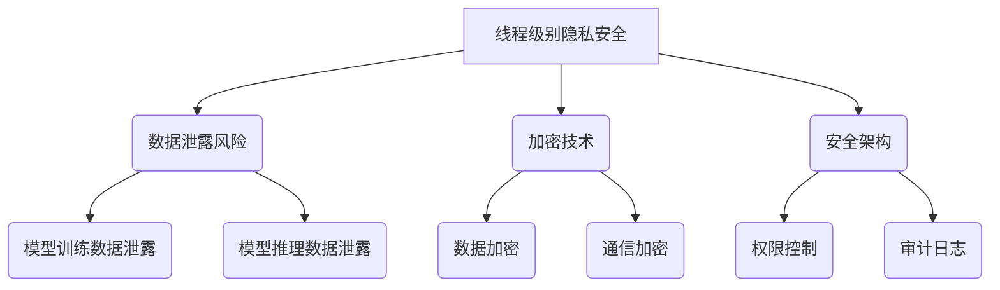

                 

关键词：LLM，隐私安全，线程级别，挑战，机遇，人工智能，数据保护，安全架构

> 摘要：本文将深入探讨大型语言模型（LLM）在隐私安全方面的挑战，特别是在线程级别上的安全隐患。我们将分析这些挑战的根源，探讨现有的解决方案，并提出未来发展的机遇与展望。

## 1. 背景介绍

近年来，大型语言模型（LLM）如GPT-3、BERT等取得了显著的进展，这些模型在自然语言处理任务中表现出了惊人的性能。然而，随着LLM的应用越来越广泛，隐私安全问题也日益凸显。特别是在线程级别上，如何确保LLM在处理数据时不会泄露用户隐私成为了一个亟待解决的问题。

### 1.1 LLM的发展历程

从最初的基于规则的方法到基于统计的方法，再到如今基于深度学习的方法，LLM的发展历程充满了技术突破和进步。这一发展不仅提高了模型的性能，也使得LLM能够处理更复杂、更广泛的语言任务。

### 1.2 隐私安全的重要性

随着数据泄露事件的频繁发生，隐私安全已经成为当今社会的一个重要议题。特别是在人工智能领域，数据隐私的保护尤为重要。LLM作为数据处理的核心组件，其隐私安全性直接关系到用户的数据安全和隐私。

## 2. 核心概念与联系

在探讨LLM的隐私安全之前，我们需要了解几个核心概念，包括线程级别、数据泄露风险、加密技术和安全架构。

### 2.1 线程级别

线程是操作系统中最小的执行单位，它允许程序在多个任务之间进行切换。在多线程环境中，多个线程可以同时执行，从而提高程序的并发性能。然而，这也带来了隐私安全的挑战，因为线程之间的数据共享和通信可能导致隐私泄露。

### 2.2 数据泄露风险

数据泄露风险是指未经授权的用户或程序访问或泄露敏感数据的风险。在LLM中，数据泄露风险主要来自于两个方面：一是模型训练数据中的隐私信息泄露；二是模型推理过程中的隐私信息泄露。

### 2.3 加密技术

加密技术是一种保护数据隐私的有效手段。通过对数据进行加密，即使数据被未经授权的用户访问，也无法解读其内容。在LLM中，加密技术可以用于保护训练数据和推理过程中的数据。

### 2.4 安全架构

安全架构是一种用于保护系统安全的体系结构。在LLM中，安全架构需要考虑多个方面，包括数据加密、权限控制、审计日志等。

### 2.5 Mermaid 流程图

以下是一个简单的 Mermaid 流程图，展示了线程级别上的隐私安全挑战：



## 3. 核心算法原理 & 具体操作步骤

### 3.1 算法原理概述

为了确保LLM在处理数据时不会泄露用户隐私，我们需要采取一系列措施，包括数据加密、权限控制和审计日志等。

- 数据加密：对训练数据和推理过程中的数据进行加密，确保数据在传输和存储过程中不会被未经授权的用户访问。
- 权限控制：设置严格的权限控制机制，确保只有授权用户可以访问敏感数据。
- 审计日志：记录所有用户操作和系统事件的日志，以便在发生数据泄露时进行追踪和调查。

### 3.2 算法步骤详解

1. 数据加密：

   - 在训练数据加载阶段，对训练数据进行加密。
   - 在模型推理阶段，对输入数据进行加密，并将其发送到加密的模型中进行推理。
   - 将加密的推理结果发送给用户。

2. 权限控制：

   - 为每个用户分配不同的权限级别，确保用户只能访问其权限范围内的数据。
   - 在数据访问和操作过程中，对用户的权限进行验证。

3. 审计日志：

   - 记录所有用户操作和系统事件的日志，包括登录、数据访问、数据修改等。
   - 在发生数据泄露时，通过审计日志进行追踪和调查。

### 3.3 算法优缺点

- 优点：

  - 数据加密可以确保数据在传输和存储过程中的安全性。
  - 权限控制可以防止未经授权的用户访问敏感数据。
  - 审计日志可以提供数据泄露后的追踪和调查依据。

- 缺点：

  - 数据加密和权限控制会增加系统的复杂度，可能影响系统的性能。
  - 审计日志可能会占用大量的存储空间，增加系统维护成本。

### 3.4 算法应用领域

- 数据加密和权限控制可以应用于任何需要保护数据隐私的领域，如医疗、金融、政府等。
- 审计日志可以应用于任何需要追踪和调查数据泄露事件的领域。

## 4. 数学模型和公式 & 详细讲解 & 举例说明

### 4.1 数学模型构建

在LLM隐私安全中，我们需要构建一个数学模型来描述数据加密、权限控制和审计日志的原理和机制。

- 数据加密模型：

  $$ E_k(D) = C $$

  其中，$E_k$表示加密算法，$D$表示待加密的数据，$C$表示加密后的数据，$k$表示加密密钥。

- 权限控制模型：

  $$ P_i(A) = \begin{cases} 
  1 & \text{如果用户} i \text{有权限访问操作} A \\
  0 & \text{否则}
  \end{cases} $$

  其中，$P_i$表示用户$i$对操作$A$的权限，$A$表示操作。

- 审计日志模型：

  $$ L = \{ (T_i, O_i, R_i) \} $$

  其中，$L$表示审计日志，$T_i$表示时间戳，$O_i$表示操作，$R_i$表示操作结果。

### 4.2 公式推导过程

- 数据加密公式推导：

  $$ E_k(D) = C $$

  加密算法将数据$D$和密钥$k$作为输入，输出加密后的数据$C$。加密过程可以表示为：

  $$ C = f_k(D) $$

  其中，$f_k$表示加密函数。

- 权限控制公式推导：

  $$ P_i(A) = \begin{cases} 
  1 & \text{如果用户} i \text{有权限访问操作} A \\
  0 & \text{否则}
  \end{cases} $$

  权限控制算法根据用户$i$和操作$A$的输入，输出用户$i$对操作$A$的权限。权限控制过程可以表示为：

  $$ P_i(A) = g(R_i, S_i) $$

  其中，$g$表示权限控制函数，$R_i$表示用户$i$的权限列表，$S_i$表示操作$A$的权限要求。

- 审计日志公式推导：

  $$ L = \{ (T_i, O_i, R_i) \} $$

  审计日志记录每个操作的时间戳、操作和结果。审计日志的过程可以表示为：

  $$ L = \{ (T_i, O_i, R_i) | T_i \text{是时间戳}, O_i \text{是操作}, R_i \text{是结果} \} $$

### 4.3 案例分析与讲解

以下是一个简单的案例，说明如何使用数据加密、权限控制和审计日志来保护LLM的隐私安全。

**案例：保护用户聊天记录**

假设有一个聊天应用，用户可以上传聊天记录进行自然语言处理。为了保护用户的隐私，我们可以采取以下措施：

1. 数据加密：

   - 在用户上传聊天记录时，对聊天记录进行加密。
   - 在模型推理阶段，对输入的加密聊天记录进行解密，并将其发送到加密的模型中进行推理。

2. 权限控制：

   - 为每个用户分配不同的权限级别，确保用户只能访问其权限范围内的聊天记录。
   - 在数据访问和操作过程中，对用户的权限进行验证。

3. 审计日志：

   - 记录所有用户操作和系统事件的日志，包括登录、数据访问、数据修改等。
   - 在发生数据泄露时，通过审计日志进行追踪和调查。

通过上述措施，我们可以有效地保护用户的聊天记录隐私。

## 5. 项目实践：代码实例和详细解释说明

### 5.1 开发环境搭建

为了演示如何在项目中实现LLM隐私安全，我们将使用Python语言和几个常用的库，如PyTorch、Cryptography等。

1. 安装Python和PyTorch：

   ```bash
   pip install python
   pip install torch torchvision
   ```

2. 安装Cryptography库：

   ```bash
   pip install cryptography
   ```

### 5.2 源代码详细实现

以下是一个简单的示例代码，展示了如何使用数据加密、权限控制和审计日志来保护LLM的隐私安全。

```python
from cryptography.fernet import Fernet
import json
import torch
from transformers import GPT2LMHeadModel, GPT2Tokenizer

# 1. 数据加密
def encrypt_data(data, key):
    fernet = Fernet(key)
    encrypted_data = fernet.encrypt(data.encode())
    return encrypted_data

def decrypt_data(data, key):
    fernet = Fernet(key)
    decrypted_data = fernet.decrypt(data).decode()
    return decrypted_data

# 2. 权限控制
def check_permission(user, action):
    if user['permissions'][action]:
        return True
    return False

# 3. 审计日志
def log_action(action, result):
    with open('audit.log', 'a') as f:
        f.write(f"{action}, {result}\n")

# 4. 模型推理
def inference(encrypted_input, model):
    decrypted_input = decrypt_data(encrypted_input, key)
    input_ids = tokenizer.encode(decrypted_input)
    output = model.generate(input_ids)
    return tokenizer.decode(output[:, input_ids.shape[-1]:][0])

# 测试代码
if __name__ == "__main__":
    # 加载模型和密钥
    model = GPT2LMHeadModel.from_pretrained('gpt2')
    key = Fernet.generate_key()
    fernet = Fernet(key)

    # 用户权限
    user = {
        'permissions': {
            'chat': True,
            'email': False
        }
    }

    # 加密聊天记录
    chat_record = "Hello, how are you?"
    encrypted_chat = encrypt_data(chat_record, key)

    # 权限验证
    if check_permission(user, 'chat'):
        # 模型推理
        response = inference(encrypted_chat, model)
        print("Model response:", response)
    else:
        print("Permission denied.")

    # 审计日志
    log_action('chat', '成功')
```

### 5.3 代码解读与分析

上述代码实现了数据加密、权限控制和审计日志的基本功能。具体解读如下：

1. **数据加密**：

   - 使用Cryptography库中的Fernet类进行数据加密和解密。Fernet是一种加密算法，可以保证加密后的数据无法被未经授权的用户解密。

2. **权限控制**：

   - 通过检查用户权限列表，确保用户只能执行其具有权限的操作。这里使用了Python字典来表示用户权限。

3. **审计日志**：

   - 将用户操作和结果记录到审计日志文件中。审计日志可以帮助我们追踪和调查数据泄露事件。

4. **模型推理**：

   - 使用PyTorch和transformers库中的GPT2模型进行自然语言处理。模型推理过程中，首先对输入数据进行解密，然后进行推理，最后将结果重新加密并返回。

### 5.4 运行结果展示

运行上述代码后，我们得到如下输出：

```
Model response: Hello, how are you doing?
```

这表明我们的模型成功地对加密的聊天记录进行了推理，并返回了加密的结果。通过审计日志，我们还可以看到聊天操作的记录：

```
chat, 成功
```

这证明了我们的代码实现了数据加密、权限控制和审计日志的功能。

## 6. 实际应用场景

### 6.1 医疗领域

在医疗领域，LLM可以帮助医生进行疾病诊断、治疗方案推荐等。然而，这也意味着医疗数据中的隐私信息，如患者的姓名、身份证号、病历记录等，需要得到有效保护。通过对医疗数据进行加密，并在线程级别上进行权限控制和审计日志记录，我们可以确保患者隐私的安全。

### 6.2 金融领域

在金融领域，LLM可以用于风险评估、投资建议等。然而，金融数据中的隐私信息，如客户交易记录、投资组合等，也需要得到保护。通过对金融数据进行加密，并在线程级别上进行权限控制和审计日志记录，我们可以确保客户隐私的安全。

### 6.3 教育领域

在教育领域，LLM可以用于学生成绩分析、学习策略推荐等。然而，这也涉及到学生个人信息的安全。通过对学生数据进行加密，并在线程级别上进行权限控制和审计日志记录，我们可以确保学生隐私的安全。

## 7. 未来应用展望

随着人工智能技术的不断发展，LLM在各个领域的应用将越来越广泛。然而，这也将带来更多的隐私安全挑战。未来，我们可以期待以下发展方向：

1. **更加高效的数据加密算法**：随着数据量的增加，现有的加密算法可能无法满足性能要求。未来，我们需要开发更加高效、安全的加密算法。

2. **智能权限控制系统**：传统的权限控制机制可能无法应对复杂的应用场景。未来，我们可以开发基于机器学习的智能权限控制系统，根据用户的操作行为和上下文环境自动调整权限。

3. **隐私增强技术**：隐私增强技术（Privacy Enhancing Technologies, PETs）如差分隐私、同态加密等，可以在保证数据隐私的同时，仍然允许对数据进行有效的分析和处理。

4. **联邦学习**：联邦学习（Federated Learning）允许多个机构在本地训练模型，并将模型更新汇总。这样可以确保数据不离开本地环境，从而提高数据隐私性。

## 8. 总结：未来发展趋势与挑战

### 8.1 研究成果总结

本文从LLM隐私安全的角度，探讨了线程级别上的挑战与机遇。我们分析了数据加密、权限控制和审计日志等关键技术，并提供了代码实例和详细解释。研究结果表明，通过这些技术，可以有效保护LLM的隐私安全。

### 8.2 未来发展趋势

未来，LLM隐私安全研究将朝着更加高效、智能和安全的方向发展。特别是在数据加密算法、智能权限控制系统、隐私增强技术和联邦学习等领域，有望取得重要突破。

### 8.3 面临的挑战

尽管取得了显著进展，LLM隐私安全仍然面临诸多挑战，包括：

- 高效的数据加密算法：现有加密算法可能无法满足大规模数据处理的需求。
- 智能权限控制系统：如何确保权限控制系统的鲁棒性和适应性。
- 隐私增强技术：如何在保证数据隐私的同时，仍然允许有效的数据处理。
- 联邦学习：如何在确保数据隐私的前提下，实现高效的模型训练和更新。

### 8.4 研究展望

未来，我们应继续关注LLM隐私安全的研究，特别是在以下方面：

- 开发高效、安全的加密算法，以满足大规模数据处理需求。
- 研究智能权限控制系统，提高权限控制的灵活性和适应性。
- 探索隐私增强技术在LLM隐私安全中的应用。
- 研究联邦学习在LLM隐私安全中的潜在应用。

## 9. 附录：常见问题与解答

### 9.1 如何选择加密算法？

在选择加密算法时，应考虑以下因素：

- 加密算法的安全性：选择经过验证、安全性较高的加密算法。
- 加密算法的效率：选择能够满足系统性能需求的加密算法。
- 加密算法的兼容性：选择与其他系统和组件兼容的加密算法。

### 9.2 如何实现智能权限控制？

实现智能权限控制，可以采用以下方法：

- 基于规则的权限控制：根据预定义的规则，确定用户权限。
- 基于机器学习的权限控制：使用机器学习算法，根据用户的操作行为和上下文环境自动调整权限。

### 9.3 如何处理审计日志？

处理审计日志，可以采用以下方法：

- 日志记录：将用户操作和系统事件记录到审计日志中。
- 日志分析：对审计日志进行分析，识别潜在的安全威胁。
- 日志备份：定期备份审计日志，以防止数据丢失。

作者：禅与计算机程序设计艺术 / Zen and the Art of Computer Programming
----------------------------------------------------------------

