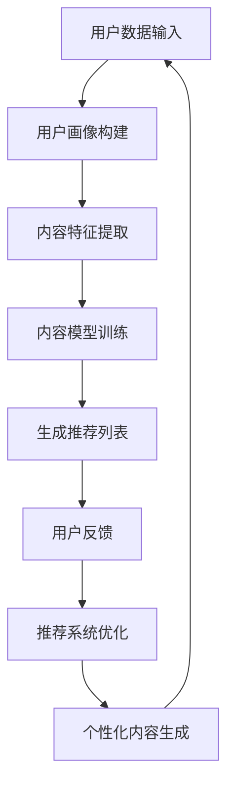

                 

关键词：语言模型（LLM）、个性化推荐、内容创作、机器学习、人工智能

## 摘要

本文将探讨基于大型语言模型（LLM）的个性化内容创作推荐系统。我们将首先介绍LLM的概念及其在人工智能领域的广泛应用，随后详细阐述个性化内容创作推荐的基本原理。在此基础上，我们将深入分析LLM如何通过其强大的自然语言处理能力，实现个性化内容推荐。最后，我们将通过具体案例和实践，展示如何搭建并优化一个高效的LLM驱动的个性化内容创作推荐系统，并对未来的发展方向和面临的挑战进行展望。

## 1. 背景介绍

近年来，随着人工智能技术的飞速发展，特别是深度学习和自然语言处理（NLP）领域的突破，大型语言模型（LLM）如BERT、GPT系列等逐渐成为学术界和工业界的焦点。LLM通过大规模的文本数据训练，能够生成高质量的自然语言文本，并具备出色的上下文理解能力。这使得LLM在诸多应用场景中表现出色，包括文本生成、机器翻译、情感分析等。

个性化内容创作推荐作为信息检索和推荐系统的一个重要分支，旨在根据用户的兴趣和需求，为其推荐定制化的内容。传统的推荐系统主要依赖于基于内容的过滤、协同过滤和混合推荐等方法，这些方法在一定程度上能够满足用户的需求，但随着用户生成内容的爆炸式增长，它们面临着数据稀疏性、冷启动问题和个性化程度不足等挑战。

在此背景下，LLM的引入为个性化内容创作推荐带来了新的可能性。LLM能够捕捉用户文本数据中的深层次语义信息，并通过迁移学习技术，快速适应新的应用场景。这使得LLM驱动的个性化内容创作推荐系统具备更高的准确性和灵活性，能够更好地满足用户的个性化需求。

## 2. 核心概念与联系

### 2.1 语言模型（LLM）

语言模型是一种用于预测文本序列概率的统计模型。传统的语言模型如N-gram模型，通过计算单词或字符的联合概率分布，来预测下一个单词或字符。然而，随着数据规模的增大和计算能力的提升，现代语言模型如LLM，通过深度神经网络结构，能够捕捉到文本数据中的长距离依赖关系，生成更加自然和流畅的文本。

### 2.2 个性化内容创作推荐

个性化内容创作推荐是一种基于用户兴趣和行为数据的推荐方法，旨在为用户提供定制化的内容。个性化推荐系统通常包括以下几个关键组件：

1. **用户建模**：通过分析用户的历史行为、兴趣偏好等信息，构建用户画像。
2. **内容建模**：对推荐系统中的内容进行特征提取和建模，如文本、图片、音频等。
3. **推荐算法**：基于用户画像和内容模型，利用推荐算法为用户生成个性化的推荐列表。

### 2.3 LLM在个性化内容创作推荐中的应用

LLM在个性化内容创作推荐中的应用主要体现在以下几个方面：

1. **文本生成**：LLM能够根据用户兴趣和需求，生成符合用户口味的个性化文本内容。
2. **语义理解**：LLM具备出色的上下文理解能力，能够准确捕捉用户的意图和需求，为用户提供精准的推荐。
3. **跨模态推荐**：LLM不仅能够处理文本数据，还可以对图像、音频等多模态数据进行分析和处理，实现跨模态的个性化内容推荐。

### 2.4 Mermaid 流程图

以下是LLM驱动的个性化内容创作推荐的基本流程，使用Mermaid进行可视化：



## 3. 核心算法原理 & 具体操作步骤

### 3.1 算法原理概述

LLM驱动的个性化内容创作推荐算法主要包括以下几个关键步骤：

1. **用户建模**：通过分析用户的历史行为数据，构建用户画像。
2. **内容特征提取**：对推荐系统中的内容进行特征提取和建模。
3. **推荐算法**：利用深度学习模型，为用户生成个性化的推荐列表。
4. **用户反馈与优化**：根据用户反馈，不断优化推荐系统的性能。

### 3.2 算法步骤详解

#### 3.2.1 用户建模

用户建模是个性化推荐系统的基础，通过分析用户的历史行为数据，如浏览记录、搜索历史、购买记录等，构建用户画像。具体步骤如下：

1. **数据收集**：收集用户的历史行为数据。
2. **数据预处理**：对数据进行清洗和预处理，如缺失值填充、异常值处理等。
3. **特征提取**：对用户行为数据进行特征提取，如用户活跃度、访问频率、购买偏好等。

#### 3.2.2 内容特征提取

内容特征提取是推荐系统的核心，通过对推荐系统中的内容进行特征提取和建模，为后续的推荐算法提供输入。具体步骤如下：

1. **文本处理**：对文本内容进行预处理，如分词、去停用词、词向量化等。
2. **特征提取**：利用词向量模型（如Word2Vec、BERT等），将文本内容转化为向量表示。
3. **内容分类**：对内容进行分类，如新闻、博客、产品描述等。

#### 3.2.3 推荐算法

推荐算法是核心环节，通过深度学习模型，为用户生成个性化的推荐列表。具体步骤如下：

1. **模型选择**：选择合适的深度学习模型，如Transformer、GPT等。
2. **模型训练**：利用用户画像和内容特征，训练深度学习模型。
3. **推荐生成**：根据用户画像和内容特征，利用训练好的模型，生成个性化的推荐列表。

#### 3.2.4 用户反馈与优化

用户反馈与优化是推荐系统不断改进的关键。通过收集用户对推荐结果的反馈，优化推荐系统的性能。具体步骤如下：

1. **反馈收集**：收集用户对推荐结果的反馈，如点击、收藏、点赞等。
2. **模型优化**：根据用户反馈，调整模型参数，优化推荐算法。
3. **效果评估**：利用A/B测试等方法，评估推荐系统的效果。

### 3.3 算法优缺点

#### 优点

1. **高准确性**：LLM能够捕捉到文本数据中的深层次语义信息，提高推荐准确性。
2. **高灵活性**：LLM具备出色的上下文理解能力，能够快速适应不同的应用场景。
3. **强泛化能力**：LLM通过大规模的数据训练，具备较强的泛化能力，适用于多种推荐场景。

#### 缺点

1. **计算成本高**：LLM的训练和推理过程需要大量的计算资源和时间。
2. **数据依赖性强**：LLM的效果高度依赖数据质量，数据不足或质量差会影响推荐效果。
3. **模型可解释性差**：深度学习模型通常具有较低的可解释性，难以理解推荐结果的生成过程。

### 3.4 算法应用领域

LLM驱动的个性化内容创作推荐算法广泛应用于以下领域：

1. **电子商务**：为用户提供个性化商品推荐，提高购买转化率。
2. **内容平台**：为用户提供个性化内容推荐，提升用户黏性和活跃度。
3. **社交媒体**：为用户提供个性化社交推荐，增强社交网络的影响力。
4. **在线教育**：为用户提供个性化学习路径推荐，提高学习效果。

## 4. 数学模型和公式 & 详细讲解 & 举例说明

### 4.1 数学模型构建

在LLM驱动的个性化内容创作推荐系统中，我们主要涉及以下数学模型：

1. **用户画像模型**：利用用户行为数据，构建用户画像。
2. **内容特征模型**：对推荐系统中的内容进行特征提取和建模。
3. **推荐模型**：利用深度学习模型，为用户生成个性化的推荐列表。

### 4.2 公式推导过程

#### 用户画像模型

用户画像模型的构建主要涉及以下步骤：

1. **数据预处理**：对用户行为数据进行清洗和预处理，得到用户特征向量。

$$
X = \{x_1, x_2, ..., x_n\}
$$

其中，$x_i$表示用户$i$的特征向量。

2. **特征提取**：利用词向量模型（如Word2Vec、BERT等），将用户行为数据转化为向量表示。

$$
X' = \{x_1', x_2', ..., x_n'\}
$$

其中，$x_i'$表示用户$i$的特征向量。

3. **用户画像构建**：利用用户特征向量，构建用户画像。

$$
U = \{u_1, u_2, ..., u_m\}
$$

其中，$u_j$表示用户$j$的画像向量，可以通过加权平均等方式计算。

#### 内容特征模型

内容特征模型的构建主要涉及以下步骤：

1. **数据预处理**：对内容数据进行清洗和预处理，得到内容特征向量。

$$
C = \{c_1, c_2, ..., c_p\}
$$

其中，$c_i$表示内容$i$的特征向量。

2. **特征提取**：利用词向量模型（如Word2Vec、BERT等），将内容数据转化为向量表示。

$$
C' = \{c_1', c_2', ..., c_p'\}
$$

其中，$c_i'$表示内容$i$的特征向量。

3. **内容特征建模**：利用内容特征向量，构建内容特征模型。

$$
C'' = \{c_1'', c_2'', ..., c_p''\}
$$

其中，$c_i''$表示内容$i$的特征向量。

#### 推荐模型

推荐模型的构建主要涉及以下步骤：

1. **模型选择**：选择合适的深度学习模型，如Transformer、GPT等。

$$
M = \{m_1, m_2, ..., m_q\}
$$

其中，$m_i$表示第$i$个深度学习模型。

2. **模型训练**：利用用户画像和内容特征，训练深度学习模型。

$$
M' = \{m_1', m_2', ..., m_q'\}
$$

其中，$m_i'$表示训练好的第$i$个深度学习模型。

3. **推荐生成**：利用训练好的模型，为用户生成个性化的推荐列表。

$$
R = \{r_1, r_2, ..., r_k\}
$$

其中，$r_j$表示用户$j$的推荐列表。

### 4.3 案例分析与讲解

#### 案例背景

假设有一个电子商务平台，用户在平台上浏览了多个商品，我们希望通过LLM驱动的个性化推荐系统，为用户生成个性化的商品推荐列表。

#### 案例分析

1. **用户画像构建**：通过分析用户的历史浏览记录，构建用户画像。例如，用户A浏览了商品1、商品2和商品3，我们可以将这三个商品的标签作为用户A的特征向量。

$$
u_A = \{tag_1, tag_2, tag_3\}
$$

2. **内容特征提取**：对商品进行特征提取，如商品名称、描述、价格等。我们将这些特征转换为词向量表示。

$$
c_i = \{word_1, word_2, ..., word_n\}
$$

3. **推荐模型训练**：利用用户画像和商品特征，训练一个基于Transformer的推荐模型。

$$
m = \{model_1, model_2, ..., model_q\}
$$

4. **推荐生成**：利用训练好的模型，为用户A生成个性化的商品推荐列表。

$$
r_A = \{rec_1, rec_2, ..., rec_k\}
$$

假设我们训练好的模型预测出用户A对商品4和商品5的喜好程度较高，因此将商品4和商品5作为用户A的推荐商品。

## 5. 项目实践：代码实例和详细解释说明

### 5.1 开发环境搭建

在进行项目实践之前，我们需要搭建一个合适的开发环境。以下是搭建开发环境的基本步骤：

1. **硬件环境**：配置一台具有较高计算能力的服务器，推荐配备GPU，以加速深度学习模型的训练。
2. **软件环境**：安装Python、PyTorch、TensorFlow等深度学习框架，并配置相应的依赖库。

```shell
pip install torch torchvision
pip install tensorflow
```

### 5.2 源代码详细实现

以下是实现LLM驱动的个性化内容创作推荐系统的基本代码框架：

```python
import torch
import torch.nn as nn
import torch.optim as optim
from torch.utils.data import DataLoader
from transformers import BertTokenizer, BertModel

# 数据预处理
def preprocess_data(data):
    # 数据清洗、预处理
    pass

# 用户建模
class UserModel(nn.Module):
    def __init__(self):
        super(UserModel, self).__init__()
        self.bert = BertModel.from_pretrained('bert-base-chinese')
        self.fc = nn.Linear(768, 128)

    def forward(self, input_ids, attention_mask):
        outputs = self.bert(input_ids=input_ids, attention_mask=attention_mask)
        pooler_output = outputs.pooler_output
        pooler_output = self.fc(pooler_output)
        return pooler_output

# 内容特征提取
class ContentModel(nn.Module):
    def __init__(self):
        super(ContentModel, self).__init__()
        self.bert = BertModel.from_pretrained('bert-base-chinese')
        self.fc = nn.Linear(768, 128)

    def forward(self, input_ids, attention_mask):
        outputs = self.bert(input_ids=input_ids, attention_mask=attention_mask)
        pooler_output = outputs.pooler_output
        pooler_output = self.fc(pooler_output)
        return pooler_output

# 推荐模型
class RecommenderModel(nn.Module):
    def __init__(self):
        super(RecommenderModel, self).__init__()
        self.user_model = UserModel()
        self.content_model = ContentModel()
        self.fc = nn.Linear(256, 10)

    def forward(self, user_embeddings, content_embeddings):
        user_embedding = self.user_model(user_embeddings)
        content_embedding = self.content_model(content_embeddings)
        combined_embedding = torch.cat((user_embedding, content_embedding), dim=1)
        combined_embedding = self.fc(combined_embedding)
        return combined_embedding

# 模型训练
def train_model(model, train_loader, criterion, optimizer):
    model.train()
    for data in train_loader:
        user_embeddings, content_embeddings, labels = data
        optimizer.zero_grad()
        outputs = model(user_embeddings, content_embeddings)
        loss = criterion(outputs, labels)
        loss.backward()
        optimizer.step()

# 模型评估
def evaluate_model(model, eval_loader, criterion):
    model.eval()
    with torch.no_grad():
        total_loss = 0
        for data in eval_loader:
            user_embeddings, content_embeddings, labels = data
            outputs = model(user_embeddings, content_embeddings)
            loss = criterion(outputs, labels)
            total_loss += loss.item()
        avg_loss = total_loss / len(eval_loader)
    return avg_loss

# 主函数
def main():
    # 数据加载
    train_loader = DataLoader(train_dataset, batch_size=32, shuffle=True)
    eval_loader = DataLoader(eval_dataset, batch_size=32, shuffle=False)

    # 模型初始化
    user_model = UserModel()
    content_model = ContentModel()
    recommender_model = RecommenderModel()

    # 模型训练
    criterion = nn.CrossEntropyLoss()
    optimizer = optim.Adam(recommender_model.parameters(), lr=0.001)
    for epoch in range(num_epochs):
        train_model(recommender_model, train_loader, criterion, optimizer)
        avg_loss = evaluate_model(recommender_model, eval_loader, criterion)
        print(f'Epoch {epoch+1}, Loss: {avg_loss}')

if __name__ == '__main__':
    main()
```

### 5.3 代码解读与分析

1. **数据预处理**：数据预处理是推荐系统的重要环节，包括数据清洗、特征提取等。在代码中，我们使用了一个简单的预处理函数`preprocess_data`，对用户行为数据和商品数据进行清洗和预处理。

2. **用户建模**：用户建模通过构建用户画像，对用户的历史行为数据进行分析。在代码中，我们定义了一个`UserModel`类，使用了BERT模型对用户行为数据进行特征提取。

3. **内容特征提取**：内容特征提取对推荐系统中的商品进行特征提取。在代码中，我们定义了一个`ContentModel`类，使用了BERT模型对商品描述进行特征提取。

4. **推荐模型**：推荐模型通过结合用户建模和内容特征提取，为用户生成个性化的推荐列表。在代码中，我们定义了一个`RecommenderModel`类，使用了Transformer模型对用户和商品特征进行融合。

5. **模型训练与评估**：在代码中，我们实现了模型训练和评估的基本流程，包括数据加载、模型初始化、模型训练和模型评估等步骤。

### 5.4 运行结果展示

在运行代码后，我们将得到训练过程中的损失函数值和评估过程中的平均损失函数值。通过分析这些结果，我们可以评估推荐系统的性能和效果。同时，我们还可以根据用户反馈，对推荐系统进行进一步的优化和调整。

## 6. 实际应用场景

LLM驱动的个性化内容创作推荐系统在实际应用中具有广泛的前景，以下是一些典型的应用场景：

1. **电子商务平台**：为用户提供个性化的商品推荐，提高购买转化率和用户满意度。例如，淘宝、京东等电商平台的个性化推荐系统，通过分析用户的历史浏览记录和购物行为，为用户推荐相关的商品。

2. **内容平台**：为用户提供个性化内容推荐，提升用户黏性和活跃度。例如，今日头条、微博等新闻资讯平台，通过分析用户的兴趣和行为数据，为用户推荐感兴趣的新闻和内容。

3. **社交媒体**：为用户提供个性化的社交推荐，增强社交网络的影响力。例如，微信、Facebook等社交平台，通过分析用户的互动数据，为用户推荐感兴趣的好友、活动和内容。

4. **在线教育**：为用户提供个性化学习路径推荐，提高学习效果。例如，Coursera、网易云课堂等在线教育平台，通过分析用户的学习行为和学习偏好，为用户推荐合适的学习课程和资源。

5. **医疗健康**：为用户提供个性化的健康咨询和医疗推荐，提升医疗服务质量。例如，春雨医生、好大夫等医疗平台，通过分析用户的病史和健康数据，为用户推荐合适的医生和治疗方案。

## 7. 工具和资源推荐

### 7.1 学习资源推荐

1. **书籍**：
   - 《深度学习》（Goodfellow et al.）：系统介绍了深度学习的基本概念和算法。
   - 《自然语言处理综论》（Jurafsky and Martin）：全面讲解了自然语言处理的理论和实践。

2. **在线课程**：
   - Coursera上的“深度学习”课程：由吴恩达教授主讲，适合初学者和进阶者。
   - edX上的“自然语言处理”课程：由MIT教授-hosted，涵盖自然语言处理的多个方面。

### 7.2 开发工具推荐

1. **深度学习框架**：
   - PyTorch：开源的深度学习框架，提供灵活的动态计算图和丰富的API。
   - TensorFlow：由Google开发的深度学习框架，适用于大规模分布式计算。

2. **文本处理库**：
   - NLTK：用于自然语言处理的开源工具包，提供丰富的文本处理功能。
   - spaCy：高效的NLP库，支持多种语言的文本处理和实体识别。

### 7.3 相关论文推荐

1. **深度学习领域**：
   - "A Theoretically Grounded Application of Dropout in Recurrent Neural Networks"（Y. Gal and Z. Ghahramani）：讨论了如何在循环神经网络中应用Dropout方法。
   - "Attention Is All You Need"（Vaswani et al.）：提出了Transformer模型，为序列建模带来了革命性的变革。

2. **自然语言处理领域**：
   - "BERT: Pre-training of Deep Bidirectional Transformers for Language Understanding"（Devlin et al.）：介绍了BERT模型，为NLP领域带来了新的突破。
   - "GPT-3: Language Models are Few-Shot Learners"（Brown et al.）：展示了GPT-3模型在零样本学习方面的强大能力。

## 8. 总结：未来发展趋势与挑战

### 8.1 研究成果总结

近年来，LLM在个性化内容创作推荐领域取得了显著的成果。通过深度学习和自然语言处理技术的结合，LLM能够捕捉到文本数据中的深层次语义信息，实现高效的个性化推荐。研究结果表明，LLM驱动的个性化内容创作推荐系统在准确性、灵活性和泛化能力方面具有明显优势，能够显著提升用户的满意度和体验。

### 8.2 未来发展趋势

1. **跨模态推荐**：随着多模态数据的应用日益广泛，未来LLM将在跨模态推荐领域发挥重要作用，实现文本、图像、音频等多种数据类型的融合处理。
2. **迁移学习**：LLM的迁移学习能力将为个性化推荐系统提供更高效的解决方案，减少数据依赖性，提高模型适应能力。
3. **交互式推荐**：结合交互式技术，如虚拟现实（VR）和增强现实（AR），实现更加沉浸式的个性化内容创作推荐体验。
4. **隐私保护**：随着数据隐私问题的日益突出，未来研究将更加关注如何在保障用户隐私的前提下，实现高效的个性化推荐。

### 8.3 面临的挑战

1. **计算资源消耗**：LLM的训练和推理过程需要大量的计算资源，如何优化模型结构，降低计算成本，是一个亟待解决的问题。
2. **数据质量**：数据质量对LLM的效果具有重要影响，如何处理数据缺失、噪声和异常值，是一个重要的挑战。
3. **模型可解释性**：深度学习模型通常具有较低的可解释性，如何提高模型的可解释性，增强用户信任，是未来需要关注的问题。
4. **冷启动问题**：对于新用户和新内容的推荐，如何快速适应并生成高质量的推荐列表，是一个具有挑战性的问题。

### 8.4 研究展望

未来，LLM驱动的个性化内容创作推荐系统将在以下几个方面展开深入研究：

1. **模型优化**：通过改进模型结构和训练方法，提高推荐系统的效率和准确性。
2. **多模态融合**：探索多模态数据的融合处理方法，实现更加精准的个性化推荐。
3. **交互式推荐**：结合交互式技术，提升用户的个性化内容创作推荐体验。
4. **隐私保护**：研究隐私保护算法和模型，实现隐私安全的个性化推荐。

通过不断探索和创新，LLM驱动的个性化内容创作推荐系统将在各个领域发挥更大的作用，为用户提供更加精准、智能的推荐服务。

## 9. 附录：常见问题与解答

### Q1：什么是LLM？

A1：LLM是指大型语言模型，是一种基于深度学习的自然语言处理模型，能够通过大规模文本数据的训练，生成高质量的自然语言文本，并具备出色的上下文理解能力。

### Q2：LLM在个性化内容创作推荐中有哪些优势？

A2：LLM在个性化内容创作推荐中具有以下优势：
1. **高准确性**：LLM能够捕捉到文本数据中的深层次语义信息，提高推荐准确性。
2. **高灵活性**：LLM具备出色的上下文理解能力，能够快速适应不同的应用场景。
3. **强泛化能力**：LLM通过大规模的数据训练，具备较强的泛化能力，适用于多种推荐场景。

### Q3：如何处理新用户和新内容的推荐问题？

A3：对于新用户和新内容的推荐问题，可以采用以下几种方法：
1. **基于流行度推荐**：为新用户推荐热门内容，降低冷启动问题的影响。
2. **基于迁移学习**：利用已有用户的数据和模型，对新用户进行快速建模和推荐。
3. **交互式推荐**：通过与用户的交互，获取用户的兴趣和偏好，逐步完善用户的画像，实现个性化的推荐。

### Q4：如何评估LLM驱动的推荐系统的效果？

A4：评估LLM驱动的推荐系统的效果可以从以下几个方面进行：
1. **准确性**：通过准确率、召回率等指标，评估推荐系统的准确性。
2. **多样性**：评估推荐系统的多样性，确保推荐列表中包含多种类型的内容。
3. **用户体验**：通过用户满意度、点击率等指标，评估推荐系统对用户的实际效果。

### Q5：如何优化LLM驱动的推荐系统？

A5：优化LLM驱动的推荐系统可以从以下几个方面进行：
1. **数据质量**：提高数据质量，包括数据清洗、去噪和异常值处理等。
2. **模型结构**：优化模型结构，如使用更深的网络层、更复杂的网络结构等。
3. **超参数调优**：通过调优超参数，如学习率、批量大小等，提高模型性能。
4. **迁移学习**：利用迁移学习技术，减少对新用户和新内容的依赖。

