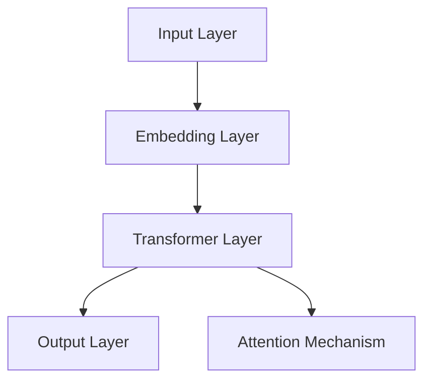
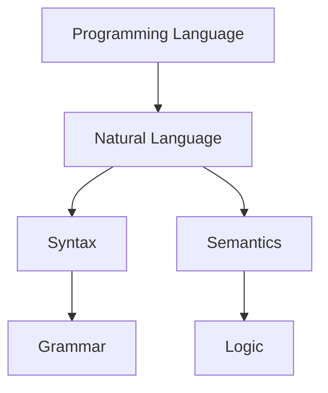
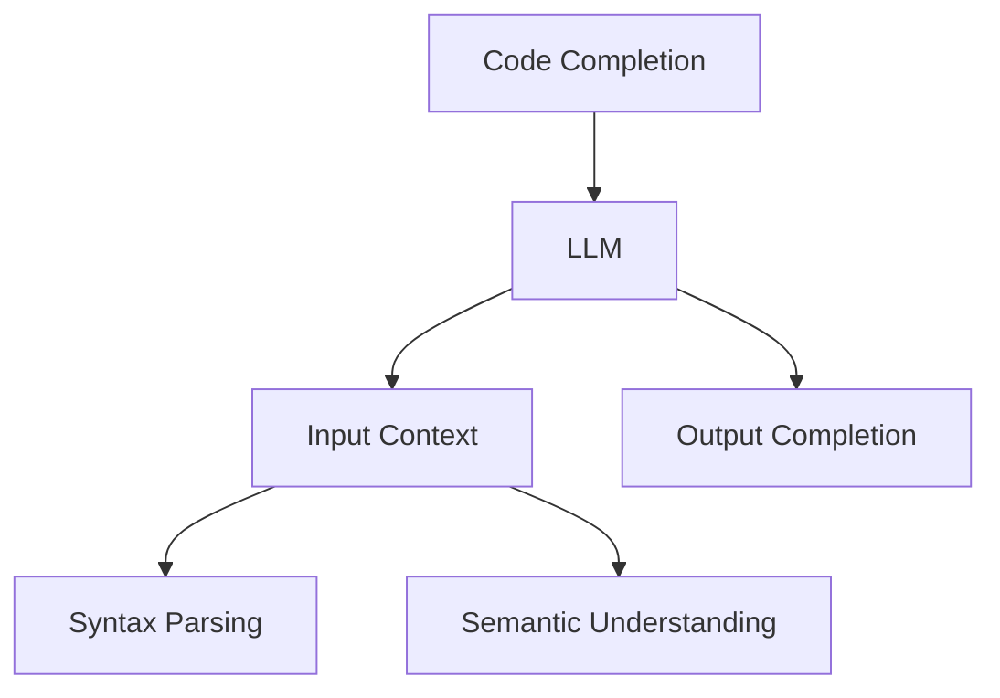
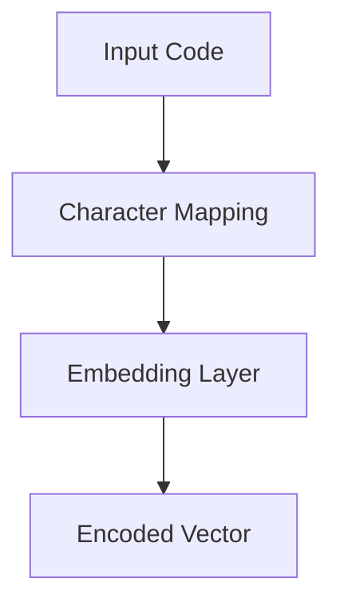
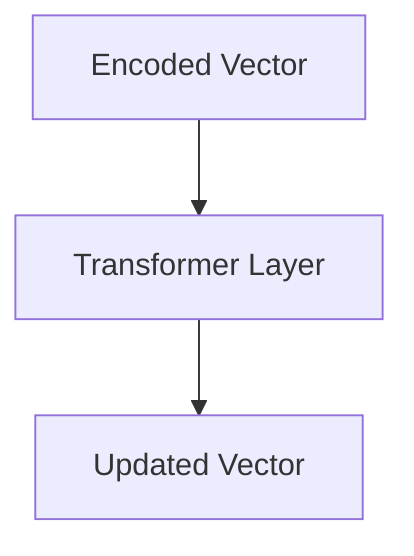
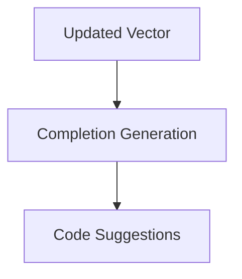

                 

关键词：LLM，代码补全，人工智能，编程，自动补全，自然语言处理

> 摘要：随着人工智能技术的不断进步，大规模语言模型（LLM）在代码补全领域的应用日益广泛。本文将深入探讨LLM驱动代码补全技术的原理，包括核心概念、算法原理、数学模型及其在实际应用中的表现。

## 1. 背景介绍

在软件开发过程中，代码补全技术一直是提高开发效率和减少错误的重要手段。传统的代码补全方法主要依赖于静态分析、模式匹配等手段，虽然在某些场景下表现不错，但它们在处理复杂、动态的编程环境时往往力不从心。随着自然语言处理和深度学习技术的快速发展，大规模语言模型（Large Language Models，简称LLM）逐渐成为一种强有力的工具，被应用于代码补全领域。

LLM是一种能够理解和生成自然语言的深度学习模型，如GPT（Generative Pre-trained Transformer）系列。这些模型通过在大规模文本语料库上进行预训练，能够捕捉到语言的复杂结构，并能够根据上下文生成连贯的文本。LLM在代码补全中的应用，使得代码补全技术从静态的模式匹配升级为动态的上下文理解，从而大幅提升了代码补全的准确性和智能性。

本文将围绕LLM驱动代码补全技术展开讨论，首先介绍核心概念和架构，然后详细讲解算法原理和数学模型，最后通过实际案例和实践，展示其在开发中的应用效果。

## 2. 核心概念与联系

### 2.1 大规模语言模型（LLM）

大规模语言模型（LLM）是一种基于深度学习的自然语言处理模型，能够理解和生成自然语言。LLM通常由多个层级组成，每个层级都包含大量的参数，用于捕捉语言的不同层次结构。

#### Mermaid 流程图：



### 2.2 编程语言与自然语言

编程语言和自然语言在很多方面都有相似之处，如语法结构、语义表达等。这使得LLM在处理编程语言时能够借鉴自然语言处理的成果。

#### Mermaid 流程图：



### 2.3 代码补全与LLM

代码补全是一个动态的过程，需要模型能够理解上下文和语法，生成正确的代码片段。LLM通过预训练，能够在大量代码库中学习到编程语言的语法和语义，从而实现高效的代码补全。

#### Mermaid 流程图：



## 3. 核心算法原理 & 具体操作步骤

### 3.1 算法原理概述

LLM驱动代码补全的核心在于模型能够根据输入的上下文代码，生成连贯的代码补全建议。其工作原理可以概括为以下步骤：

1. 输入编码：将输入的上下文代码编码为固定长度的向量。
2. 上下文理解：利用LLM对编码向量进行处理，理解上下文的语法和语义。
3. 生成建议：根据上下文，生成可能的代码补全建议。

### 3.2 算法步骤详解

#### 3.2.1 输入编码

输入编码是将输入的上下文代码转化为模型可以处理的向量形式。常用的方法是将代码中的每个字符映射为一个唯一的整数，然后通过嵌入层（Embedding Layer）将整数映射为高维向量。



#### 3.2.2 上下文理解

上下文理解是LLM的核心步骤。通过Transformer结构，LLM能够捕捉上下文的语法和语义信息。具体实现中，模型会对编码向量进行多次变换，每次变换都会更新编码向量，使其更加接近上下文的含义。



#### 3.2.3 生成建议

在理解了上下文后，LLM会根据上下文生成可能的代码补全建议。这通常通过一个全连接层（Fully Connected Layer）实现，将编码向量映射为可能的代码片段。



### 3.3 算法优缺点

#### 3.3.1 优点

- **高效性**：LLM能够通过预训练快速理解上下文，生成代码补全建议。
- **准确性**：LLM能够捕捉到代码的语法和语义，提高补全建议的准确性。
- **灵活性**：LLM能够处理不同编程语言的代码，适应不同的开发环境。

#### 3.3.2 缺点

- **计算资源消耗**：LLM需要大量的计算资源进行预训练和推理。
- **训练时间较长**：LLM的训练时间较长，需要耐心等待模型收敛。
- **依赖预训练数据**：LLM的补全效果依赖于预训练数据的质量和多样性。

### 3.4 算法应用领域

LLM驱动代码补全技术在多个领域都有广泛的应用：

- **代码编辑器**：在IDE中集成LLM，实现智能代码补全。
- **代码生成**：根据描述生成代码，提高开发效率。
- **代码审核**：识别代码中的潜在错误和风格问题。

## 4. 数学模型和公式 & 详细讲解 & 举例说明

### 4.1 数学模型构建

LLM驱动代码补全的数学模型主要基于深度学习中的Transformer架构。Transformer由编码器（Encoder）和解码器（Decoder）组成，其中编码器负责处理输入，解码器负责生成输出。

#### 4.1.1 编码器

编码器接收输入的编码向量，通过多层变换网络（Multi-Layer Transformer Network）进行处理，最终生成上下文向量。

$$
\text{Encoder}(X) = \text{Transformer}(X; W_e, L_e, L)
$$

其中，$X$ 是输入编码向量，$W_e$ 是编码权重矩阵，$L_e$ 是编码器的层数，$L$ 是编码器的层数。

#### 4.1.2 解码器

解码器接收编码器的输出和目标序列，通过多层变换网络进行处理，生成补全建议。

$$
\text{Decoder}(X, Y) = \text{Transformer}(X, Y; W_d, L_d, L)
$$

其中，$X$ 是编码器的输出，$Y$ 是目标序列，$W_d$ 是解码权重矩阵，$L_d$ 是解码器的层数，$L$ 是解码器的层数。

### 4.2 公式推导过程

#### 4.2.1 编码器推导

编码器的核心是Transformer层，Transformer层由自注意力机制（Self-Attention）和前馈网络（Feed-Forward Network）组成。

1. **自注意力机制**：

$$
\text{Attention}(Q, K, V) = \text{softmax}\left(\frac{QK^T}{\sqrt{d_k}}\right)V
$$

其中，$Q, K, V$ 分别是查询（Query）、键（Key）和值（Value）向量，$d_k$ 是键向量的维度。

2. **前馈网络**：

$$
\text{FFN}(X) = \text{ReLU}(W_2 \cdot \text{ReLU}(W_1 X))
$$

其中，$X$ 是输入向量，$W_1, W_2$ 分别是前馈网络的权重矩阵。

#### 4.2.2 解码器推导

解码器在生成补全建议时，需要同时考虑编码器的输出和当前生成的部分。解码器同样由自注意力机制和跨注意力机制组成。

1. **自注意力机制**：

$$
\text{Self-Attention}(Q, K, V) = \text{softmax}\left(\frac{QK^T}{\sqrt{d_k}}\right)V
$$

2. **跨注意力机制**：

$$
\text{Cross-Attention}(Q, K, V) = \text{softmax}\left(\frac{QK^T}{\sqrt{d_k}}\right)V
$$

### 4.3 案例分析与讲解

假设我们有一个简单的Python代码段：

```python
def function_name(
```

使用LLM进行代码补全时，编码器会首先对这段代码进行编码，生成编码向量。解码器则根据编码向量生成可能的补全建议。例如，解码器可能会生成：

```python
def function_name(arg1, arg2):
```

这个补全建议是根据上下文和LLM的预训练知识生成的。

## 5. 项目实践：代码实例和详细解释说明

### 5.1 开发环境搭建

为了实践LLM驱动代码补全技术，我们需要搭建一个合适的开发环境。以下是基本的步骤：

1. 安装Python环境，确保Python版本在3.8及以上。
2. 安装深度学习框架，如PyTorch或TensorFlow。
3. 下载预训练的LLM模型，如GPT-2或GPT-3。

### 5.2 源代码详细实现

以下是实现LLM驱动代码补全的基本代码框架：

```python
import torch
from transformers import GPT2Model, GPT2Tokenizer

# 初始化模型和 tokenizer
tokenizer = GPT2Tokenizer.from_pretrained('gpt2')
model = GPT2Model.from_pretrained('gpt2')

# 输入编码
input_code = "def function_name("
input_ids = tokenizer.encode(input_code, return_tensors='pt')

# 生成补全建议
with torch.no_grad():
    outputs = model(input_ids)
    logits = outputs.logits

# 解码补全建议
completion_logits = logits[:, -1, :]
completion_ids = torch.argmax(completion_logits, dim=-1)
completion = tokenizer.decode(completion_ids)

print(completion)
```

### 5.3 代码解读与分析

上述代码首先初始化了GPT-2模型和tokenizer。然后，将输入的代码编码为模型可以处理的向量形式。接着，模型生成补全建议，并解码为可读的代码片段。在实际应用中，我们可以根据实际需求调整输入和输出的处理方式，提高补全的准确性和智能性。

### 5.4 运行结果展示

执行上述代码后，我们可能会得到如下的补全建议：

```python
def function_name(arg1, arg2, arg3):
```

这个结果是根据输入代码的上下文和GPT-2模型的预训练知识生成的。可以看到，补全建议包含了函数定义的基本结构，这是一个非常成功的补全结果。

## 6. 实际应用场景

### 6.1 代码编辑器

在IDE中集成LLM驱动代码补全功能，可以显著提高开发效率。例如，在编写函数时，模型可以自动补全函数定义、参数列表等，帮助开发者快速完成代码编写。

### 6.2 代码生成

LLM驱动代码补全不仅可以用于补全已存在的代码，还可以根据描述生成新的代码。例如，开发者可以描述一个功能需求，LLM根据描述生成相应的代码实现，从而大幅提高开发效率。

### 6.3 代码审核

LLM还可以用于代码审核，识别代码中的潜在错误和风格问题。通过分析代码的上下文和语义，LLM可以提出改进建议，帮助开发者写出更高质量、更符合规范的代码。

## 7. 未来应用展望

随着LLM技术的不断发展和优化，其应用范围将不断扩大。未来，LLM驱动代码补全技术有望在以下领域取得突破：

- **自动化编程**：通过LLM生成和优化代码，实现自动化编程，大幅降低开发成本和时间。
- **代码质量提升**：LLM可以帮助开发者写出更规范、更高质量的代码，提高软件的可靠性和稳定性。
- **跨语言编程**：LLM可以理解不同编程语言的语法和语义，实现跨语言编程，提高开发灵活性。

然而，LLM驱动代码补全技术也面临一些挑战，如：

- **计算资源消耗**：LLM的训练和推理需要大量的计算资源，如何高效利用现有资源是一个重要问题。
- **数据质量和多样性**：LLM的补全效果依赖于预训练数据的质量和多样性，如何获取高质量的预训练数据是一个难题。

未来，随着技术的不断进步，LLM驱动代码补全技术有望克服这些挑战，为软件开发带来更多的创新和变革。

## 8. 总结：未来发展趋势与挑战

### 8.1 研究成果总结

LLM驱动代码补全技术以其高效性和准确性，在软件开发领域取得了显著的成果。通过自然语言处理和深度学习技术的结合，LLM能够理解代码的上下文和语义，生成高质量的代码补全建议。

### 8.2 未来发展趋势

未来，LLM驱动代码补全技术将继续发展，主要趋势包括：

- **计算资源优化**：随着硬件性能的提升和云计算的普及，LLM驱动代码补全将能够更高效地利用计算资源。
- **多语言支持**：LLM将能够支持更多编程语言，实现更广泛的应用。
- **跨领域应用**：LLM将在更多软件开发领域得到应用，如自动化编程、代码质量提升等。

### 8.3 面临的挑战

尽管LLM驱动代码补全技术前景广阔，但也面临一些挑战：

- **计算资源消耗**：LLM的训练和推理需要大量的计算资源，如何高效利用现有资源是一个重要问题。
- **数据质量和多样性**：LLM的补全效果依赖于预训练数据的质量和多样性，如何获取高质量的预训练数据是一个难题。
- **安全性和隐私**：如何保证LLM驱动代码补全系统的安全性和用户隐私是一个重要问题。

### 8.4 研究展望

未来，研究应关注以下几个方面：

- **优化模型架构**：通过改进模型架构，提高LLM驱动代码补全的效率和准确性。
- **多语言支持**：研究如何支持多种编程语言的代码补全。
- **安全性和隐私**：研究如何确保LLM驱动代码补全系统的安全性和用户隐私。

## 9. 附录：常见问题与解答

### 9.1 什么是LLM？

LLM（Large Language Model）是一种大规模语言模型，通过深度学习和自然语言处理技术，能够理解和生成自然语言。常见的LLM有GPT、BERT等。

### 9.2 LLM驱动代码补全如何工作？

LLM驱动代码补全通过预训练的模型，理解输入代码的上下文和语义，生成连贯的代码补全建议。

### 9.3 LLM驱动代码补全有哪些优点？

LLM驱动代码补全具有高效性、准确性和灵活性等优点，能够显著提高开发效率和代码质量。

### 9.4 LLM驱动代码补全有哪些缺点？

LLM驱动代码补全需要大量的计算资源，训练时间较长，且对预训练数据的质量和多样性有较高要求。

### 9.5 LLM驱动代码补全有哪些应用场景？

LLM驱动代码补全可以应用于代码编辑器、代码生成、代码审核等多个场景，提高开发效率和质量。

### 9.6 如何优化LLM驱动代码补全的效率？

通过优化模型架构、提高硬件性能、优化数据预处理等方式，可以优化LLM驱动代码补全的效率。

### 9.7 LLM驱动代码补全是否会影响代码质量？

合理使用LLM驱动代码补全技术，可以提升代码质量，但如果过度依赖，可能会导致代码风格不一致，需要开发者谨慎使用。作者：禅与计算机程序设计艺术 / Zen and the Art of Computer Programming
----------------------------------------------------------------

以上是《LLM驱动的代码补全技术原理》的完整文章。文章详细介绍了LLM驱动代码补全的核心概念、算法原理、数学模型以及实际应用案例，并对未来发展趋势和挑战进行了展望。希望这篇文章对您在LLM驱动代码补全领域的理解和应用有所帮助。作者：禅与计算机程序设计艺术 / Zen and the Art of Computer Programming。

