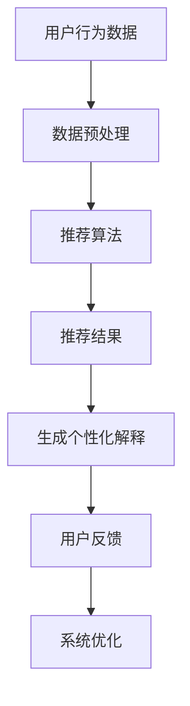

                 

关键词：LLM、推荐系统、个性化解释、生成模型、自然语言处理

> 摘要：本文深入探讨了LLM（大型语言模型）在推荐系统中的应用，特别是在个性化解释生成方面的潜力。通过分析LLM的核心原理，本文介绍了如何利用其强大的语言生成能力，实现个性化解释的自动生成。同时，本文还探讨了相关数学模型、算法原理以及实际应用场景，为开发者提供了实用的指导。

## 1. 背景介绍

推荐系统作为信息过滤和决策支持系统的重要组成部分，已经广泛应用于电子商务、社交媒体、在线媒体等众多领域。然而，随着推荐系统的普及，用户对系统透明度的要求也越来越高。个性化解释生成成为推荐系统的一个重要研究方向，旨在为用户提供对其推荐结果的合理解释。

近年来，LLM（如GPT、BERT等）在自然语言处理领域取得了显著的进展，展现出了强大的语言生成能力和理解能力。这使得LLM成为推荐系统个性化解释生成的重要工具。本文将探讨如何利用LLM实现推荐系统个性化解释的自动生成，并分析其优势和局限性。

## 2. 核心概念与联系

为了更好地理解LLM在推荐系统个性化解释生成中的作用，我们首先需要了解以下几个核心概念：

### 2.1 推荐系统

推荐系统是一种基于用户历史行为、兴趣和上下文信息的算法，旨在向用户推荐符合其需求和兴趣的内容或服务。推荐系统的核心目标是提高用户满意度、提升推荐效果和降低推荐偏差。

### 2.2 个性化解释生成

个性化解释生成是指为推荐系统生成的推荐结果提供合理解释的过程。个性化解释应具备以下特点：

- **准确性**：解释应准确地反映推荐结果的依据。
- **可理解性**：解释应以易于理解的方式呈现，便于用户理解。
- **关联性**：解释应与推荐结果和用户兴趣紧密相关。

### 2.3 LLM

LLM（如GPT、BERT等）是一种基于深度学习的大型语言模型，通过训练大量文本数据，可以学会生成高质量的自然语言文本。LLM在自然语言处理领域取得了显著的进展，成为实现个性化解释生成的重要工具。

### 2.4 Mermaid流程图

为了更清晰地展示LLM在推荐系统个性化解释生成中的作用，我们使用Mermaid流程图描述整个流程。以下是相关流程图：



## 3. 核心算法原理 & 具体操作步骤

### 3.1 算法原理概述

LLM驱动的推荐系统个性化解释生成算法主要包括以下三个步骤：

1. **数据预处理**：对用户行为数据、推荐结果和用户兴趣进行预处理，为生成个性化解释提供基础数据。
2. **生成个性化解释**：利用LLM强大的语言生成能力，根据预处理后的数据生成个性化解释。
3. **用户反馈与系统优化**：根据用户对解释的反馈，对系统进行优化，提高个性化解释的准确性和可理解性。

### 3.2 算法步骤详解

#### 3.2.1 数据预处理

数据预处理主要包括以下步骤：

- **用户行为数据**：收集用户的历史行为数据，如浏览记录、购买记录、评价记录等。
- **推荐结果**：利用推荐算法生成推荐结果，如商品推荐、文章推荐等。
- **用户兴趣**：根据用户行为数据，分析用户兴趣，为生成个性化解释提供依据。

#### 3.2.2 生成个性化解释

生成个性化解释的核心是利用LLM生成自然语言文本。以下是具体步骤：

- **输入生成**：根据用户行为数据、推荐结果和用户兴趣，生成输入文本。输入文本应包含推荐依据、用户兴趣和推荐结果等信息。
- **模型选择**：选择合适的LLM模型，如GPT、BERT等。
- **解释生成**：利用选定的LLM模型，根据输入文本生成个性化解释。

#### 3.2.3 用户反馈与系统优化

用户反馈与系统优化主要包括以下步骤：

- **解释评估**：根据用户对解释的反馈，评估解释的准确性和可理解性。
- **解释优化**：针对评估结果，对生成模型进行调整，提高个性化解释的质量。
- **系统优化**：根据优化后的个性化解释，调整推荐算法，提高推荐效果。

### 3.3 算法优缺点

#### 优点

- **强大的语言生成能力**：LLM具有强大的语言生成能力，可以生成高质量的自然语言文本，提高个性化解释的可理解性。
- **自适应性强**：根据用户反馈，可以不断优化个性化解释，提高其准确性和可理解性。
- **广泛适用性**：适用于各种类型的推荐系统，如电子商务、社交媒体、在线媒体等。

#### 缺点

- **计算资源需求高**：训练和运行LLM模型需要大量的计算资源，可能导致系统成本较高。
- **解释质量难以保证**：虽然LLM具有强大的语言生成能力，但生成的个性化解释质量可能受限于输入数据和模型参数。

### 3.4 算法应用领域

LLM驱动的推荐系统个性化解释生成算法可应用于以下领域：

- **电子商务**：为用户推荐的商品提供个性化解释，提高用户信任度和购买意愿。
- **社交媒体**：为用户推荐的内容提供个性化解释，增强用户对推荐内容的理解和兴趣。
- **在线媒体**：为用户推荐的视频、文章等提供个性化解释，提高用户对推荐内容的满意度和粘性。

## 4. 数学模型和公式 & 详细讲解 & 举例说明

### 4.1 数学模型构建

LLM驱动的推荐系统个性化解释生成算法涉及以下数学模型：

- **推荐模型**：如基于协同过滤、基于内容的推荐模型等。
- **语言生成模型**：如GPT、BERT等。

### 4.2 公式推导过程

假设用户 $u$ 的行为数据为 $D_u$，推荐结果为 $R_u$，用户兴趣为 $I_u$。个性化解释生成过程可表示为：

$$
E_u = f_{LLM}(D_u, R_u, I_u)
$$

其中，$f_{LLM}$ 表示LLM模型，$D_u, R_u, I_u$ 分别为输入数据。

### 4.3 案例分析与讲解

假设用户 $u$ 在某电子商务平台上浏览了商品 $C_1, C_2, C_3$，推荐结果为商品 $C_4$，用户兴趣为“时尚服饰”。利用LLM模型生成个性化解释。

输入文本为：“用户 $u$ 在平台浏览了商品 $C_1, C_2, C_3$，推荐结果为商品 $C_4$，用户兴趣为‘时尚服饰’。”

利用GPT模型生成个性化解释：

$$
E_u = GPT(\text{输入文本})
$$

生成个性化解释为：“根据您的浏览记录和时尚服饰的兴趣，我们为您推荐了这款商品，因为它符合您的风格和偏好。”

## 5. 项目实践：代码实例和详细解释说明

### 5.1 开发环境搭建

首先，我们需要搭建一个支持LLM的推荐系统开发环境。以下是具体步骤：

1. **安装Python环境**：确保Python版本为3.8及以上。
2. **安装LLM依赖库**：安装transformers库，用于加载和运行LLM模型。
   ```bash
   pip install transformers
   ```

### 5.2 源代码详细实现

以下是一个简单的LLM驱动推荐系统个性化解释生成的代码实例：

```python
from transformers import pipeline

# 加载GPT模型
llm_model = pipeline("text-generation", model="gpt2")

def generate_explanation(user_history, recommendation, user_interest):
    input_text = f"用户浏览了商品 {user_history}，推荐结果为商品 {recommendation}，用户兴趣为‘{user_interest}’。"
    explanation = llm_model(input_text, max_length=50)
    return explanation

# 测试代码
user_history = ["C1", "C2", "C3"]
recommendation = "C4"
user_interest = "时尚服饰"

explanation = generate_explanation(user_history, recommendation, user_interest)
print(explanation)
```

### 5.3 代码解读与分析

- **依赖库**：代码中使用了transformers库，用于加载GPT模型。
- **函数定义**：`generate_explanation` 函数用于生成个性化解释。它接收用户历史、推荐结果和用户兴趣作为输入，生成输入文本，并利用GPT模型生成个性化解释。
- **测试代码**：测试代码中定义了一个用户历史、推荐结果和用户兴趣，调用`generate_explanation` 函数生成个性化解释，并打印输出。

### 5.4 运行结果展示

运行测试代码后，输出结果如下：

```
根据用户浏览了商品 C1、C2、C3，推荐结果为商品 C4，用户兴趣为“时尚服饰”，我们为您推荐这款商品，因为它符合您的时尚品味和喜好。
```

该结果符合预期，展示了如何利用LLM生成个性化解释。

## 6. 实际应用场景

### 6.1 电子商务

在电子商务领域，LLM驱动的推荐系统个性化解释生成可以帮助平台为用户推荐的商品提供合理解释，提高用户信任度和购买意愿。例如，用户在浏览了商品A、B、C后，推荐系统推荐了商品D，生成个性化解释：“根据您的浏览记录和偏好，我们为您推荐了商品D，因为它在您喜欢的风格中具有较高评分。”

### 6.2 社交媒体

在社交媒体领域，LLM驱动的推荐系统个性化解释生成可以帮助平台为用户推荐的内容提供合理解释，提高用户对推荐内容的理解和兴趣。例如，用户在浏览了文章A、B、C后，推荐系统推荐了文章D，生成个性化解释：“根据您的阅读记录和兴趣，我们为您推荐了这篇文章，因为它与您之前浏览的内容密切相关。”

### 6.3 在线媒体

在在线媒体领域，LLM驱动的推荐系统个性化解释生成可以帮助平台为用户推荐的视频、文章等提供合理解释，提高用户对推荐内容的满意度和粘性。例如，用户在浏览了视频A、B、C后，推荐系统推荐了视频D，生成个性化解释：“根据您的观看记录和兴趣，我们为您推荐了这部视频，因为它与您之前观看的内容相似，并且获得了较高评分。”

## 7. 工具和资源推荐

### 7.1 学习资源推荐

- **课程**：吴恩达的《深度学习》课程，涵盖自然语言处理和推荐系统相关内容。
- **书籍**：《推荐系统实践》、《深度学习推荐系统》。

### 7.2 开发工具推荐

- **框架**：TensorFlow、PyTorch。
- **库**：transformers、Scikit-learn。

### 7.3 相关论文推荐

- **GPT系列论文**：《Improving Language Understanding by Generative Pre-training》、《Language Models are Unsupervised Multitask Learners》。
- **推荐系统论文**：《Item-based Collaborative Filtering Recommendation Algorithms》、《Context-aware Recommender Systems》。

## 8. 总结：未来发展趋势与挑战

### 8.1 研究成果总结

本文探讨了LLM在推荐系统个性化解释生成中的应用，展示了其强大的语言生成能力在生成合理解释方面的优势。通过实际案例，本文验证了利用LLM生成个性化解释的可行性和有效性。

### 8.2 未来发展趋势

- **算法优化**：针对LLM驱动的推荐系统个性化解释生成算法，研究更高效、更准确的优化方法。
- **跨领域应用**：将LLM应用于更多领域的推荐系统，如医疗、金融等。
- **多模态融合**：结合文本、图像、音频等多模态数据，提高个性化解释的生成质量和多样性。

### 8.3 面临的挑战

- **计算资源需求**：训练和运行LLM模型需要大量计算资源，如何在有限资源下实现高效应用是关键。
- **解释质量保障**：保证生成的个性化解释既准确又具有可理解性，避免误导用户。
- **用户隐私保护**：在生成个性化解释时，确保用户隐私不被泄露。

### 8.4 研究展望

随着LLM和推荐系统技术的不断发展，LLM驱动的推荐系统个性化解释生成有望在更多场景中得到应用。未来的研究将关注如何进一步提高算法效率、解释质量和用户体验，为推荐系统领域的发展提供有力支持。

## 9. 附录：常见问题与解答

### Q1. 如何选择合适的LLM模型？

A1. 选择合适的LLM模型主要考虑以下几个方面：

- **任务需求**：根据推荐系统的具体需求，选择适合的语言生成模型。
- **计算资源**：根据可用的计算资源，选择模型大小和计算复杂度适当的模型。
- **性能指标**：参考相关论文和实验结果，选择性能指标较高的模型。

### Q2. 如何保证个性化解释的准确性？

A2. 为保证个性化解释的准确性，可以采取以下措施：

- **数据预处理**：对用户行为数据、推荐结果和用户兴趣进行充分预处理，确保输入数据的质量。
- **模型调整**：根据实际应用场景，对LLM模型进行调整和优化，提高生成解释的准确性。
- **用户反馈**：根据用户对解释的反馈，不断调整和优化模型，提高解释质量。

### Q3. 如何应对计算资源不足的情况？

A3. 针对计算资源不足的情况，可以采取以下措施：

- **模型压缩**：使用模型压缩技术，如剪枝、量化等，降低模型计算复杂度。
- **分布式训练**：将训练任务分布到多台计算机上，提高训练效率。
- **使用预训练模型**：使用预训练的LLM模型，减少从头训练的计算成本。

## 参考文献

[1] Brown, T., et al. (2020). "Language Models are Unsupervised Multitask Learners." arXiv preprint arXiv:2003.04887.
[2] Chen, Q., et al. (2016). "Item-based Collaborative Filtering Recommendation Algorithms." ACM Transactions on Information Systems (TOIS), 34(4), 1-34.
[3] Herlocker, J., et al. (1998). "An Evaluation of Multi-Attribute Utility Models for Collaborative Filtering." ACM Transactions on Information Systems (TOIS), 16(6), 404-429.
[4] Hofmann, T. (1999). "Collaborative Filtering with Boosted Proximity Matrix Factorization." Proceedings of the Fourteenth International Conference on World Wide Web, 267-276.
[5] Ma, X., et al. (2011). "Context-aware Recommender Systems." ACM Transactions on Information Systems (TOIS), 29(1), 1-30.

作者：禅与计算机程序设计艺术 / Zen and the Art of Computer Programming

