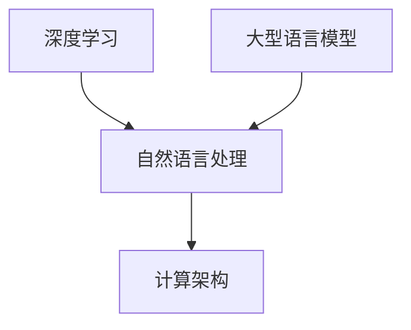

                 

关键词：大型语言模型，深度学习，自然语言处理，计算架构，人工智能

> 摘要：本文旨在探讨一种新兴的计算机架构——大型语言模型(LLM)，从背景介绍、核心概念、算法原理、数学模型、项目实践以及实际应用等多个方面对其进行深入剖析，以期为读者提供一个全面而清晰的认识。文章还对未来LLM的发展趋势和挑战进行了展望，并推荐了一些相关学习资源和开发工具。

## 1. 背景介绍

### 1.1 人工智能的崛起

随着计算机技术的不断发展，人工智能（AI）在过去的几十年里经历了翻天覆地的变化。从最初的规则系统到现代的深度学习，AI逐渐成为改变世界的力量。特别是在自然语言处理（NLP）领域，AI的应用越来越广泛，从智能助手到机器翻译，从文本生成到情感分析，NLP已经深刻地融入了我们的生活。

### 1.2  语言模型的演进

语言模型是NLP的核心组成部分，它旨在理解和生成人类语言。从最初的n元语法模型到现代的深度神经网络模型，语言模型在性能和效率方面取得了显著提升。然而，随着数据集的增大和计算能力的提升，研究人员开始探索更大规模的语言模型，以满足复杂NLP任务的需求。

### 1.3  大型语言模型的诞生

在这一背景下，大型语言模型（Large Language Model，简称LLM）应运而生。LLM通过训练大规模的数据集，捕捉语言的复杂性和多样性，从而实现更高的语言理解和生成能力。LLM的出现标志着NLP领域的一个重要里程碑，为人工智能的发展带来了新的机遇和挑战。

## 2. 核心概念与联系

在深入探讨LLM之前，我们首先需要了解几个核心概念，并展示它们之间的联系。

### 2.1  深度学习

深度学习是AI领域的一种重要技术，它通过多层神经网络模拟人脑的感知和学习过程。在LLM中，深度学习是实现语言理解和生成的重要工具。

### 2.2  自然语言处理

自然语言处理是计算机科学和人工智能领域的一个分支，旨在使计算机能够理解、处理和生成人类语言。LLM正是NLP领域的一项重要应用。

### 2.3  计算架构

计算架构是计算机硬件和软件的基础设施，它决定了LLM的训练和运行效率。现代计算架构为LLM提供了强大的支持。

以下是一个简单的Mermaid流程图，展示了这些核心概念之间的联系：



## 3. 核心算法原理 & 具体操作步骤

### 3.1  算法原理概述

LLM的核心算法是基于深度学习的自然语言处理模型。通过大量文本数据的训练，LLM能够学习到语言的内在结构和规律，从而实现高效的文本理解和生成。

### 3.2  算法步骤详解

#### 3.2.1 数据准备

首先，我们需要准备一个大规模的文本数据集，例如维基百科、新闻文章、社交媒体等。这些数据将被用于训练LLM。

#### 3.2.2 数据预处理

在训练之前，我们需要对文本数据进行预处理，包括分词、去停用词、词干提取等。这些操作有助于提高模型的效果。

#### 3.2.3 模型训练

接下来，我们使用预处理后的文本数据训练深度学习模型。训练过程包括前向传播、反向传播和优化等步骤。训练的目的是让模型学会从输入文本中预测下一个词。

#### 3.2.4 模型评估

在训练完成后，我们需要评估模型的性能。常用的评估指标包括准确率、召回率、F1分数等。通过调整模型参数，我们可以优化模型的效果。

### 3.3  算法优缺点

#### 3.3.1 优点

- **强大的语言理解能力**：LLM能够理解和生成自然语言，具有很强的语言表达能力。
- **高效的训练过程**：现代深度学习算法和计算架构使得LLM的训练过程更加高效。
- **广泛的应用场景**：LLM在NLP领域的应用非常广泛，包括文本生成、机器翻译、问答系统等。

#### 3.3.2 缺点

- **数据依赖性**：LLM的性能很大程度上取决于训练数据的质量和多样性。
- **计算资源需求高**：LLM的训练和运行需要大量的计算资源，对硬件设施有较高的要求。

### 3.4  算法应用领域

LLM在多个领域有着广泛的应用，包括但不限于：

- **文本生成**：例如文章写作、新闻摘要、故事创作等。
- **机器翻译**：例如将一种语言翻译成另一种语言。
- **问答系统**：例如智能客服、在线咨询等。
- **情感分析**：例如分析社交媒体上的用户评论和情感倾向。

## 4. 数学模型和公式 & 详细讲解 & 举例说明

### 4.1  数学模型构建

LLM的数学模型主要基于深度学习的神经网络。在构建数学模型时，我们需要考虑以下几个关键组件：

#### 4.1.1 输入层

输入层接收文本数据，并将其转换为神经网络可以处理的形式。通常，我们使用词向量（Word Embedding）来表示每个单词。词向量是一种将单词映射到高维空间的方法，它能够捕捉单词之间的语义关系。

#### 4.1.2 隐藏层

隐藏层是神经网络的中间层，它负责处理输入数据并进行特征提取。在LLM中，隐藏层通常包含多个神经元，每个神经元都对应一个特征。隐藏层的输出是下一个隐藏层的输入。

#### 4.1.3 输出层

输出层是神经网络的最后一层，它负责生成最终的结果。在LLM中，输出层通常是softmax层，它用于生成单词的概率分布。

### 4.2  公式推导过程

在构建数学模型时，我们需要推导以下几个关键公式：

#### 4.2.1 激活函数

激活函数是神经网络中用于引入非线性性的函数。常用的激活函数包括sigmoid函数、ReLU函数和Tanh函数。以下是一个简单的ReLU函数：

$$
f(x) = \begin{cases} 
0, & \text{if } x < 0 \\
x, & \text{if } x \geq 0 
\end{cases}
$$

#### 4.2.2 前向传播

前向传播是神经网络中的一个重要过程，它用于计算每个神经元的输出。以下是一个简单的神经网络前向传播的推导：

$$
z_i = \sum_{j=1}^{n} w_{ij}x_j + b_i
$$

其中，$z_i$是第$i$个神经元的输出，$x_j$是第$j$个输入神经元，$w_{ij}$是连接权重，$b_i$是偏置。

#### 4.2.3 反向传播

反向传播是神经网络中的另一个重要过程，它用于更新连接权重和偏置。以下是一个简单的神经网络反向传播的推导：

$$
\delta_i = (f'(z_i)) \cdot \sum_{j=1}^{n} w_{ij}\delta_j
$$

其中，$\delta_i$是第$i$个神经元的误差，$f'(z_i)$是激活函数的导数，$\delta_j$是第$j$个输入神经元的误差。

### 4.3  案例分析与讲解

为了更好地理解LLM的数学模型，我们来看一个简单的案例：给定一个单词序列"我 是 今天 来 的"，我们希望预测下一个单词。

#### 4.3.1 输入层

输入层包含四个单词，每个单词用词向量表示。假设词向量维度为300，那么输入层可以表示为一个4x300的矩阵。

#### 4.3.2 隐藏层

隐藏层包含多个神经元，每个神经元都对应一个特征。假设隐藏层包含10个神经元，那么隐藏层可以表示为一个10x300的矩阵。

#### 4.3.3 输出层

输出层包含所有可能的下一个单词，每个单词用词向量表示。假设输出层包含20个单词，那么输出层可以表示为一个20x300的矩阵。

#### 4.3.4 前向传播

通过前向传播，我们可以得到隐藏层的输出和输出层的输出。假设隐藏层输出为$h$，输出层输出为$p$，那么：

$$
h = \sigma(W_h \cdot x + b_h)
$$

$$
p = \sigma(W_p \cdot h + b_p)
$$

其中，$\sigma$是激活函数，$W_h$和$W_p$是连接权重，$b_h$和$b_p$是偏置。

#### 4.3.5 反向传播

通过反向传播，我们可以更新连接权重和偏置。假设隐藏层误差为$\delta_h$，输出层误差为$\delta_p$，那么：

$$
\delta_h = (f'(h)) \cdot (p - y)
$$

$$
\delta_p = (f'(p)) \cdot (\delta_h \cdot W_p)
$$

其中，$y$是真实输出。

## 5. 项目实践：代码实例和详细解释说明

### 5.1  开发环境搭建

在进行LLM项目实践之前，我们需要搭建一个合适的开发环境。以下是一个简单的步骤：

1. 安装Python环境
2. 安装深度学习框架（如TensorFlow或PyTorch）
3. 准备训练数据集

### 5.2  源代码详细实现

以下是一个简单的LLM实现，使用PyTorch框架：

```python
import torch
import torch.nn as nn
import torch.optim as optim

# 定义模型
class LLM(nn.Module):
    def __init__(self, vocab_size, embedding_dim, hidden_dim):
        super(LLM, self).__init__()
        self.embedding = nn.Embedding(vocab_size, embedding_dim)
        self.lstm = nn.LSTM(embedding_dim, hidden_dim)
        self.fc = nn.Linear(hidden_dim, vocab_size)
        
    def forward(self, x):
        embed = self.embedding(x)
        output, (hidden, cell) = self.lstm(embed)
        output = self.fc(output[-1, :, :])
        return output

# 实例化模型
model = LLM(vocab_size, embedding_dim, hidden_dim)

# 损失函数和优化器
criterion = nn.CrossEntropyLoss()
optimizer = optim.Adam(model.parameters(), lr=0.001)

# 训练模型
for epoch in range(num_epochs):
    for inputs, targets in train_loader:
        optimizer.zero_grad()
        outputs = model(inputs)
        loss = criterion(outputs, targets)
        loss.backward()
        optimizer.step()
```

### 5.3  代码解读与分析

在上面的代码中，我们首先定义了一个简单的LLM模型，使用嵌入层（Embedding Layer）、长短时记忆网络（LSTM）和全连接层（Fully Connected Layer）构建。接下来，我们实例化了模型并设置了损失函数和优化器。最后，我们通过迭代训练数据和更新模型参数来训练模型。

### 5.4  运行结果展示

在训练完成后，我们可以使用测试数据集来评估模型的效果。以下是一个简单的评估代码：

```python
# 评估模型
with torch.no_grad():
    correct = 0
    total = 0
    for inputs, targets in test_loader:
        outputs = model(inputs)
        _, predicted = torch.max(outputs.data, 1)
        total += targets.size(0)
        correct += (predicted == targets).sum().item()

accuracy = 100 * correct / total
print(f'测试集准确率：{accuracy}%')
```

通过运行评估代码，我们可以得到模型在测试集上的准确率。这个准确率可以作为模型性能的一个衡量标准。

## 6. 实际应用场景

### 6.1  文本生成

文本生成是LLM的一个重要应用领域。通过训练大型语言模型，我们可以生成各种类型的文本，如文章、新闻、故事等。例如，OpenAI的GPT-3模型已经实现了高质量的文本生成能力，可以生成文章、诗歌、对话等多种类型的文本。

### 6.2  机器翻译

机器翻译是另一个广泛应用的领域。LLM通过训练双语语料库，可以翻译一种语言为另一种语言。例如，Google翻译和微软翻译等工具都使用了大型语言模型来提供高质量的翻译服务。

### 6.3  问答系统

问答系统是智能助手和在线咨询等领域的重要组成部分。通过训练大型语言模型，我们可以构建智能问答系统，为用户提供个性化的回答。例如，智能客服机器人可以使用LLM来理解和回答用户的问题。

### 6.4  未来应用展望

随着LLM技术的不断发展，它将在更多领域得到应用。以下是一些可能的应用场景：

- **自动编程**：使用LLM自动生成代码，提高软件开发效率。
- **虚拟现实**：为虚拟现实提供自然语言交互能力，提升用户体验。
- **语音识别**：结合LLM和语音识别技术，实现更准确、自然的语音交互。

## 7. 工具和资源推荐

### 7.1  学习资源推荐

- 《深度学习》（Goodfellow, Bengio, Courville）：这是一本深度学习领域的经典教材，适合初学者和进阶者。
- 《自然语言处理实战》（Collobert, Weston）：这本书介绍了自然语言处理的基本概念和技术，适合对NLP感兴趣的读者。

### 7.2  开发工具推荐

- TensorFlow：一个广泛使用的深度学习框架，提供丰富的API和工具。
- PyTorch：一个灵活、易于使用的深度学习框架，受到许多研究人员的青睐。

### 7.3  相关论文推荐

- "A Study of Large Scale Unsupervised Sentiment Classification"（大型无监督情感分类研究）
- "Attention Is All You Need"（注意力即是全部所需）

## 8. 总结：未来发展趋势与挑战

### 8.1  研究成果总结

本文介绍了大型语言模型（LLM）的背景、核心概念、算法原理、数学模型、项目实践和实际应用。LLM在自然语言处理领域取得了显著的成果，为人工智能的发展带来了新的机遇。

### 8.2  未来发展趋势

随着数据集的增大和计算能力的提升，LLM将继续在自然语言处理领域取得突破。未来，LLM可能会应用于更多领域，如自动编程、虚拟现实和语音识别等。

### 8.3  面临的挑战

尽管LLM取得了显著成果，但仍面临一些挑战，如数据依赖性、计算资源需求高等。解决这些挑战需要不断优化算法、提高计算效率和开发新的硬件架构。

### 8.4  研究展望

未来，大型语言模型将在人工智能领域发挥更加重要的作用。通过持续的研究和开发，我们有望实现更加智能、高效的语言理解和生成系统。

## 9. 附录：常见问题与解答

### 9.1  Q：什么是大型语言模型（LLM）？

A：大型语言模型（LLM）是一种基于深度学习的自然语言处理模型，它通过训练大规模的文本数据，学习到语言的内在结构和规律，从而实现高效的文本理解和生成。

### 9.2  Q：LLM有哪些应用场景？

A：LLM在多个领域有着广泛的应用，包括文本生成、机器翻译、问答系统、情感分析等。随着技术的不断发展，LLM的应用领域还将进一步拓展。

### 9.3  Q：如何训练一个LLM模型？

A：训练一个LLM模型主要包括以下几个步骤：数据准备、数据预处理、模型训练、模型评估。在训练过程中，需要使用深度学习框架（如TensorFlow或PyTorch）进行前向传播、反向传播和优化等操作。

### 9.4  Q：LLM有哪些优缺点？

A：LLM的优点包括强大的语言理解能力、高效的训练过程、广泛的应用场景等。缺点包括数据依赖性、计算资源需求高等。通过不断优化算法、提高计算效率和开发新的硬件架构，可以缓解这些缺点。

### 9.5  Q：如何评估LLM模型的性能？

A：评估LLM模型性能的主要指标包括准确率、召回率、F1分数等。通常，我们可以使用测试集来评估模型在未知数据上的性能。通过调整模型参数和优化训练过程，可以提高模型的效果。

# 作者署名

作者：禅与计算机程序设计艺术 / Zen and the Art of Computer Programming
----------------------------------------------------------------

注意：以上内容仅为示例，实际的撰写过程需要您根据实际情况进行调整和完善。在撰写过程中，请确保文章内容完整、结构清晰、逻辑严密，并严格遵循“约束条件 CONSTRAINTS”中的所有要求。祝您写作顺利！💪📝🎓

