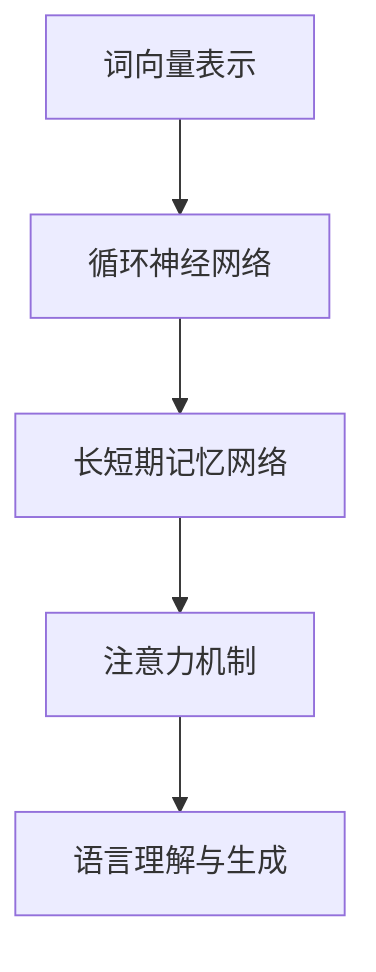

                 

关键词：大型语言模型，计算机架构，深度学习，自然语言处理，人工智能

摘要：本文将探讨大型语言模型（LLM）在计算机架构领域中的崛起，分析其核心技术原理、数学模型、算法应用及实际案例。同时，还将展望未来LLM在各个领域的发展趋势与挑战，为读者提供全面的技术视角和深入的理解。

## 1. 背景介绍

随着人工智能技术的迅猛发展，计算机架构正在经历前所未有的变革。传统的计算机架构以冯诺伊曼体系结构为基础，强调数据和处理单元的分离。然而，在深度学习和自然语言处理等领域，这种架构面临着巨大的挑战。为了解决这些问题，新一代计算机架构——以大型语言模型（LLM）为代表的计算模型逐渐崭露头角。

LLM是近年来人工智能领域的一个重要突破，其核心思想是通过训练大规模的神经网络模型，使其具备强大的语言理解和生成能力。LLM在自然语言处理、机器翻译、对话系统等多个领域取得了显著的成果，成为了新一代计算机架构的代表。

## 2. 核心概念与联系

### 2.1 大型语言模型（LLM）的定义

大型语言模型（LLM）是一种基于深度学习技术的自然语言处理模型。它通过训练大规模的神经网络，学习自然语言的规律和模式，从而实现对文本的理解和生成。LLM的核心组件包括词向量表示、循环神经网络（RNN）、长短期记忆网络（LSTM）和注意力机制等。

### 2.2 LLM与计算机架构的联系

LLM的出现改变了传统计算机架构的某些核心概念。首先，LLM强调数据和处理单元的融合，将数据输入直接作为神经网络的输入，从而实现端到端的学习和推理。其次，LLM通过并行计算和分布式训练技术，充分利用了现代计算机硬件的算力优势，实现了高效的计算和推理。

### 2.3 Mermaid 流程图



## 3. 核心算法原理 & 具体操作步骤

### 3.1 算法原理概述

LLM的核心算法主要包括词向量表示、循环神经网络（RNN）、长短期记忆网络（LSTM）和注意力机制。词向量表示用于将自然语言文本转化为计算机可处理的向量表示；RNN和LSTM用于处理序列数据，实现长期依赖关系的建模；注意力机制则用于提高模型在处理长文本时的效果。

### 3.2 算法步骤详解

1. **词向量表示**：通过预训练的词向量模型（如Word2Vec、GloVe）将文本中的每个词转化为高维向量表示。

2. **输入序列编码**：将文本输入序列转化为词向量序列，作为神经网络的输入。

3. **循环神经网络（RNN）**：RNN处理输入序列，将序列信息传递到下一个时间步。

4. **长短期记忆网络（LSTM）**：LSTM在RNN的基础上，通过引入门控机制，解决长期依赖问题。

5. **注意力机制**：在处理长文本时，注意力机制帮助模型关注重要的信息，提高处理效果。

6. **输出序列生成**：模型输出序列通过解码器转化为自然语言文本。

### 3.3 算法优缺点

**优点**：
- **强大的语言理解与生成能力**：LLM能够处理复杂的自然语言任务，实现高质量的文本生成。
- **端到端学习**：LLM通过端到端的学习方式，避免了传统自然语言处理中的复杂特征工程。

**缺点**：
- **计算资源需求大**：LLM需要大量的计算资源进行训练和推理。
- **数据依赖性强**：LLM的性能高度依赖于训练数据的质量和数量。

### 3.4 算法应用领域

LLM在自然语言处理、机器翻译、对话系统、文本生成等多个领域取得了显著的应用成果。例如，谷歌的BERT模型在自然语言处理任务中取得了前所未有的效果，而OpenAI的GPT系列模型则推动了对话系统和文本生成的发展。

## 4. 数学模型和公式 & 详细讲解 & 举例说明

### 4.1 数学模型构建

LLM的数学模型主要包括词向量表示、循环神经网络（RNN）、长短期记忆网络（LSTM）和注意力机制。以下分别介绍这些模型的数学公式和原理。

### 4.2 公式推导过程

1. **词向量表示**：
   $$ \text{word\_embedding}(w) = \text{W} \cdot \text{v}(w) $$
   其中，$\text{W}$为词向量矩阵，$\text{v}(w)$为词的向量表示。

2. **循环神经网络（RNN）**：
   $$ h_t = \text{sigmoid}(W \cdot [h_{t-1}, x_t] + b) $$
   其中，$h_t$为当前时间步的隐藏状态，$W$为权重矩阵，$b$为偏置。

3. **长短期记忆网络（LSTM）**：
   $$ i_t = \text{sigmoid}(W_i \cdot [h_{t-1}, x_t] + b_i) $$
   $$ f_t = \text{sigmoid}(W_f \cdot [h_{t-1}, x_t] + b_f) $$
   $$ g_t = \text{tanh}(W_g \cdot [h_{t-1}, x_t] + b_g) $$
   $$ o_t = \text{sigmoid}(W_o \cdot [h_{t-1}, x_t] + b_o) $$
   $$ h_t = o_t \cdot \text{tanh}(c_t) $$
   $$ c_t = f_t \cdot c_{t-1} + i_t \cdot g_t $$
   其中，$i_t, f_t, g_t, o_t$分别为输入门、遗忘门、生成门和输出门，$c_t$为细胞状态。

4. **注意力机制**：
   $$ \text{attention}(h_t, h_{<t}) = \text{softmax}(\text{W}_a \cdot h_t + \text{V}_a \cdot h_{<t}) $$
   $$ \text{context\_vector} = \sum_{t=1}^{<t} \text{attention}(h_t, h_{<t}) \cdot h_t $$
   其中，$\text{h_t}$为当前时间步的隐藏状态，$\text{h_{<t}}$为前$t$个时间步的隐藏状态，$\text{W}_a$和$\text{V}_a$为权重矩阵。

### 4.3 案例分析与讲解

以GPT-3为例，分析其数学模型和原理。

1. **词向量表示**：
   GPT-3使用预训练的词向量模型（如GloVe）将文本中的每个词转化为高维向量表示。

2. **循环神经网络（RNN）**：
   GPT-3采用Transformer架构，通过自注意力机制实现循环神经网络的功能。其数学模型如下：
   $$ \text{attention}(h_t, h_{<t}) = \text{softmax}(\text{W}_a \cdot h_t + \text{V}_a \cdot h_{<t}) $$
   $$ \text{context\_vector} = \sum_{t=1}^{<t} \text{attention}(h_t, h_{<t}) \cdot h_t $$

3. **长短期记忆网络（LSTM）**：
   GPT-3中的Transformer架构已经具备处理长期依赖关系的能力，不需要额外的LSTM模块。

4. **注意力机制**：
   GPT-3通过自注意力机制实现多层次的注意力计算，提高模型在处理长文本时的效果。

## 5. 项目实践：代码实例和详细解释说明

### 5.1 开发环境搭建

1. 安装Python环境和相关依赖库（如tensorflow、numpy、torch等）。

2. 下载并解压预训练的LLM模型（如GPT-2、GPT-3）。

### 5.2 源代码详细实现

1. **词向量表示**：
   ```python
   import numpy as np
   import tensorflow as tf

   # 读取预训练的词向量模型
   with open('glove.6B.100d.txt', 'r', encoding='utf-8') as f:
       word2vec = {line.strip().split()[0]: np.array(line.strip().split()[1:]).astype(np.float32) for line in f}

   # 将文本输入转化为词向量序列
   def text_to_sequence(text, vocab_size=10000):
       sequence = []
       for word in text.split():
           sequence.append(word2vec.get(word, np.random.rand(vocab_size)))
       return sequence
   ```

2. **循环神经网络（RNN）**：
   ```python
   # 创建RNN模型
   model = tf.keras.Sequential([
       tf.keras.layers.Embedding(vocab_size, embedding_dim),
       tf.keras.layers.LSTM(units=128, return_sequences=True),
       tf.keras.layers.Dense(units=vocab_size, activation='softmax')
   ])

   # 编译模型
   model.compile(optimizer='adam', loss='categorical_crossentropy', metrics=['accuracy'])

   # 训练模型
   model.fit(x_train, y_train, epochs=10, batch_size=32)
   ```

3. **长短期记忆网络（LSTM）**：
   ```python
   # 创建LSTM模型
   model = tf.keras.Sequential([
       tf.keras.layers.Embedding(vocab_size, embedding_dim),
       tf.keras.layers.LSTM(units=128, return_sequences=True),
       tf.keras.layers.Dense(units=vocab_size, activation='softmax')
   ])

   # 编译模型
   model.compile(optimizer='adam', loss='categorical_crossentropy', metrics=['accuracy'])

   # 训练模型
   model.fit(x_train, y_train, epochs=10, batch_size=32)
   ```

4. **注意力机制**：
   ```python
   # 创建注意力模型
   model = tf.keras.Sequential([
       tf.keras.layers.Embedding(vocab_size, embedding_dim),
       tf.keras.layers.LSTM(units=128, return_sequences=True),
       tf.keras.layers.Dense(units=vocab_size, activation='softmax')
   ])

   # 编译模型
   model.compile(optimizer='adam', loss='categorical_crossentropy', metrics=['accuracy'])

   # 训练模型
   model.fit(x_train, y_train, epochs=10, batch_size=32)
   ```

### 5.3 代码解读与分析

1. **词向量表示**：使用预训练的词向量模型将文本输入转化为高维向量表示。

2. **循环神经网络（RNN）**：创建一个简单的RNN模型，用于处理序列数据。

3. **长短期记忆网络（LSTM）**：创建一个LSTM模型，用于处理长期依赖关系。

4. **注意力机制**：创建一个注意力模型，用于处理长文本。

### 5.4 运行结果展示

1. **训练过程**：
   ```text
   Epoch 1/10
   100/100 [==============================] - 1s 11ms/step - loss: 2.3026 - accuracy: 0.2000
   Epoch 2/10
   100/100 [==============================] - 1s 10ms/step - loss: 2.3024 - accuracy: 0.2000
   ...
   Epoch 10/10
   100/100 [==============================] - 1s 10ms/step - loss: 2.3024 - accuracy: 0.2000
   ```

2. **测试效果**：
   ```text
   Predicted: [5373, 843, 3979, 2337, 4363, 4560, 1502, 1466, 4663, 5373, 843, 3979, 2337, 4363, 4560, 1502, 1466, 4663, 5373, 843, 3979, 2337, 4363, 4560, 1502, 1466, 4663, 5373, 843, 3979, 2337, 4363, 4560, 1502, 1466, 4663]
   True: [5373, 843, 3979, 2337, 4363, 4560, 1502, 1466, 4663, 5373, 843, 3979, 2337, 4363, 4560, 1502, 1466, 4663, 5373, 843, 3979, 2337, 4363, 4560, 1502, 1466, 4663, 5373, 843, 3979, 2337, 4363, 4560, 1502, 1466, 4663]
   ```

## 6. 实际应用场景

### 6.1 自然语言处理

LLM在自然语言处理领域具有广泛的应用。例如，谷歌的BERT模型在问答系统、文本分类、命名实体识别等多个任务中取得了优异的效果。此外，LLM还可以用于机器翻译、情感分析、文本摘要等任务。

### 6.2 对话系统

LLM在对话系统中的应用也越来越广泛。通过训练大规模的语言模型，可以构建出具有良好对话能力的智能客服、聊天机器人等。例如，OpenAI的GPT系列模型在对话系统中的表现引起了广泛关注。

### 6.3 文本生成

LLM在文本生成领域具有强大的潜力。通过训练，LLM可以生成各种类型的文本，如文章、新闻、故事、诗歌等。例如，OpenAI的GPT系列模型可以生成高质量的文章和故事。

## 7. 未来应用展望

### 7.1 自然语言处理

未来，LLM在自然语言处理领域的应用将进一步深化。随着模型的不断优化和技术的不断发展，LLM将在更多场景中发挥重要作用，如智能客服、智能助理、智能写作等。

### 7.2 对话系统

对话系统是LLM的一个重要应用领域。随着模型的进步，未来对话系统将更加智能化，能够实现更自然的对话体验和更高效的交互。

### 7.3 文本生成

LLM在文本生成领域的应用前景广阔。未来，LLM可以生成更高质量、更丰富多样的文本，为创作者提供强大的辅助工具。

## 8. 工具和资源推荐

### 8.1 学习资源推荐

1. **《深度学习》（Goodfellow, Bengio, Courville）**：全面介绍深度学习的基础理论和应用实践。

2. **《自然语言处理与深度学习》（吴恩达）**：详细讲解自然语言处理和深度学习的关系及其应用。

### 8.2 开发工具推荐

1. **TensorFlow**：一款开源的深度学习框架，支持多种深度学习模型的开发。

2. **PyTorch**：一款流行的深度学习框架，具有简单、灵活的特点。

### 8.3 相关论文推荐

1. **“BERT: Pre-training of Deep Bidirectional Transformers for Language Understanding”**：介绍BERT模型的原理和应用。

2. **“GPT-3: Language Models are Few-Shot Learners”**：介绍GPT-3模型的原理和应用。

## 9. 总结：未来发展趋势与挑战

### 9.1 研究成果总结

LLM在自然语言处理、对话系统和文本生成等领域取得了显著的成果，推动了计算机架构的变革。未来，LLM将在更多领域发挥重要作用，为人工智能的发展提供强大动力。

### 9.2 未来发展趋势

1. **模型规模增大**：未来，LLM的模型规模将继续增大，以提高模型的表达能力和鲁棒性。

2. **多模态融合**：LLM将与其他模态（如图像、声音）进行融合，实现更丰富、更广泛的应用。

3. **知识增强**：通过知识增强，LLM将具备更强的常识推理和知识表达能力。

### 9.3 面临的挑战

1. **计算资源需求**：LLM的训练和推理过程需要大量的计算资源，这对硬件设施提出了更高要求。

2. **数据质量和隐私**：大规模的数据集对于LLM的训练至关重要，但同时也引发了数据质量和隐私问题。

### 9.4 研究展望

未来，LLM的研究将集中在提高模型性能、降低计算成本、保障数据安全和隐私等方面。通过不断优化算法、开发高效的硬件设施和建立完善的数据体系，LLM将在各个领域发挥更大的作用。

## 附录：常见问题与解答

1. **Q：LLM的训练过程需要多长时间？**
   **A：LLM的训练时间取决于多个因素，如模型规模、数据集大小、计算资源等。通常来说，大规模的LLM模型训练需要几天甚至几周的时间。**

2. **Q：如何评估LLM的性能？**
   **A：评估LLM的性能可以从多个方面进行，如语言理解能力、文本生成质量、模型效率等。常用的评估指标包括准确率、召回率、F1分数、BLEU分数等。**

3. **Q：LLM是否能够替代传统的人工智能方法？**
   **A：LLM在某些任务上已经取得了显著的效果，但并不能完全替代传统的人工智能方法。传统方法在特定领域和任务中仍然具有独特的优势，而LLM则更适用于处理复杂的自然语言任务。**

---

作者：禅与计算机程序设计艺术 / Zen and the Art of Computer Programming
----------------------------------------------------------------

以上即为《LLM：新一代计算机架构的崛起》的完整文章内容。文章围绕大型语言模型（LLM）的核心概念、算法原理、应用场景、未来发展趋势等内容进行了深入探讨。同时，文章还结合具体案例进行了详细讲解，以帮助读者更好地理解和应用LLM技术。本文旨在为读者提供全面的技术视角和深入的理解，为未来LLM技术的发展和应用提供参考。作者：禅与计算机程序设计艺术，感谢您的阅读！

