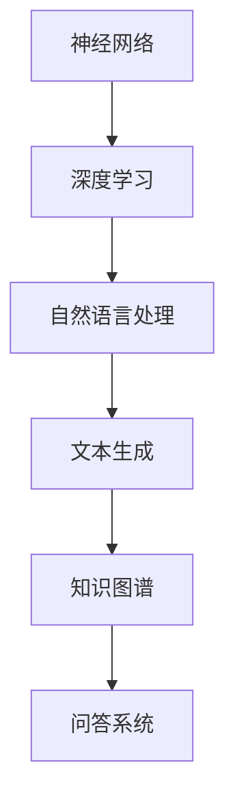
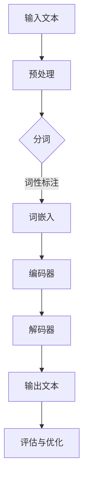

                 

在当今科技飞速发展的时代，计算机架构正经历着一场革命。大型语言模型（LLM）的崛起，标志着新一代计算机架构的诞生，它不仅重新定义了计算能力的极限，还深刻影响了人工智能、自然语言处理、以及整个科技行业的发展。本文将深入探讨LLM的核心概念、原理、应用，以及其对未来科技趋势的潜在影响。

## 关键词

- 大型语言模型（LLM）
- 计算机架构
- 人工智能
- 自然语言处理
- 科技革命

## 摘要

本文旨在探讨大型语言模型（LLM）作为新一代计算机架构的崛起及其对科技行业的影响。文章首先回顾了计算机架构的发展历程，然后详细介绍了LLM的核心概念和原理。接着，我们分析了LLM在算法、数学模型以及实际应用中的表现，最后探讨了LLM在未来科技中的潜在应用和面临的挑战。

## 1. 背景介绍

计算机架构的发展史可以追溯到二十世纪中期。从冯·诺伊曼架构到现代的多核处理器，计算机体系结构经历了多次变革。然而，随着人工智能和深度学习技术的发展，传统的计算机架构开始显得力不从心。CPU和GPU的计算能力虽然得到了极大的提升，但面对大规模数据处理和复杂模型训练的需求，仍显得有些捉襟见肘。

大型语言模型（LLM）的出现，为计算机架构的发展带来了新的契机。LLM是一种基于神经网络的语言模型，能够通过对大量文本数据的学习，生成与输入文本相关的内容。LLM的出现不仅解决了传统计算机架构在处理大规模数据时的瓶颈问题，还使得人工智能和自然语言处理领域取得了突破性的进展。

### 1.1 计算机架构的发展

计算机架构的发展可以分为几个阶段：

- **早期架构（1940s-1950s）**：早期的计算机如ENIAC和EDVAC，采用电子管作为主要元件，结构复杂，体积庞大，计算能力有限。
- **冯·诺伊曼架构（1960s）**：冯·诺伊曼架构提出了存储程序计算机的概念，将程序和数据存储在同一内存中，极大地提高了计算机的灵活性和效率。
- **多核处理器（1990s-2000s）**：随着集成电路技术的发展，多核处理器成为主流，通过增加处理器核心数量，提高了计算机的计算能力。

### 1.2 传统计算机架构的局限

尽管传统计算机架构在过去的几十年中取得了巨大的进步，但在面对以下挑战时，仍存在显著的局限：

- **计算能力瓶颈**：随着模型规模的增加，传统计算机架构在处理大规模数据时的计算能力显得不足。
- **能耗问题**：多核处理器在提供更高计算能力的同时，也带来了更高的能耗问题。
- **内存瓶颈**：传统计算机架构在处理海量数据时，内存瓶颈成为一个亟待解决的问题。

### 1.3 LLM的崛起

LLM的崛起为解决上述问题提供了新的思路。通过引入深度学习技术，LLM能够在大量文本数据中学习语言模式和语义信息，生成高质量的自然语言文本。以下是一些LLM的关键特点：

- **大规模数据训练**：LLM需要大量的文本数据来训练，通过大规模数据的训练，能够提高模型的准确性和泛化能力。
- **自适应学习能力**：LLM具有自适应学习能力，能够根据新的数据不断优化自身性能。
- **高效计算能力**：通过优化算法和硬件支持，LLM能够在处理大规模数据时提供更高的计算效率。

## 2. 核心概念与联系

### 2.1 核心概念

大型语言模型（LLM）的核心概念包括：

- **神经网络**：神经网络是LLM的基础，通过多层神经元的连接和激活函数，实现数据的非线性变换和特征提取。
- **深度学习**：深度学习是一种基于多层神经网络的学习方法，通过逐层训练，能够自动学习数据的高级特征和模式。
- **自然语言处理（NLP）**：NLP是LLM的应用领域，通过理解和生成自然语言文本，实现人与机器的交互。

### 2.2 架构联系

LLM的架构联系如图1所示：



### 2.3 Mermaid 流程图

以下是一个Mermaid流程图的示例，展示了LLM的核心流程：



### 2.4 关键环节解释

- **预处理**：输入文本需要进行分词、去除停用词、标点符号等预处理操作，以便于后续的词嵌入和编码。
- **词嵌入**：词嵌入是将词汇映射为高维向量表示，便于神经网络进行处理。
- **编码器**：编码器将输入文本编码为固定长度的序列表示。
- **解码器**：解码器根据编码器的输出，生成对应的自然语言文本。
- **评估与优化**：通过评估模型的性能，调整参数和超参数，优化模型效果。

## 3. 核心算法原理 & 具体操作步骤

### 3.1 算法原理概述

LLM的核心算法基于深度学习和神经网络，通过多层神经元的连接和激活函数，实现数据的非线性变换和特征提取。以下是一个典型的LLM算法流程：

1. **数据预处理**：对输入文本进行分词、去除停用词、标点符号等操作。
2. **词嵌入**：将词汇映射为高维向量表示。
3. **编码器**：编码器将输入文本编码为固定长度的序列表示。
4. **解码器**：解码器根据编码器的输出，生成对应的自然语言文本。
5. **评估与优化**：通过评估模型的性能，调整参数和超参数，优化模型效果。

### 3.2 算法步骤详解

1. **数据预处理**：
   - 分词：将输入文本划分为单词或子词。
   - 去除停用词：去除对文本理解无意义的词汇，如“的”、“了”等。
   - 标点符号处理：将标点符号视为单词分隔符，进行分词。

2. **词嵌入**：
   - 词嵌入：将每个词汇映射为一个固定长度的向量，便于神经网络处理。
   - 常见的词嵌入方法包括Word2Vec、GloVe等。

3. **编码器**：
   - 编码器：将输入文本编码为固定长度的序列表示。
   - 常见的编码器架构包括循环神经网络（RNN）、长短时记忆网络（LSTM）、门控循环单元（GRU）等。

4. **解码器**：
   - 解码器：根据编码器的输出，生成对应的自然语言文本。
   - 常见的解码器架构与编码器类似，通常使用RNN、LSTM或GRU。

5. **评估与优化**：
   - 评估：通过评估指标（如 perplexity、BLEU等）评估模型性能。
   - 优化：根据评估结果，调整模型参数和超参数，优化模型效果。

### 3.3 算法优缺点

#### 优点：

- **强大的文本生成能力**：LLM能够生成高质量的自然语言文本，适用于文本生成、问答系统、机器翻译等应用。
- **自适应学习能力**：LLM能够根据新的数据不断优化自身性能，具有较好的泛化能力。
- **高效的计算能力**：通过优化算法和硬件支持，LLM能够在处理大规模数据时提供更高的计算效率。

#### 缺点：

- **数据依赖性强**：LLM需要大量的文本数据进行训练，数据质量和数量对模型性能有较大影响。
- **计算资源消耗大**：训练和推理过程需要大量的计算资源，对硬件要求较高。

### 3.4 算法应用领域

LLM在多个领域具有广泛的应用：

- **文本生成**：包括文章写作、摘要生成、对话生成等。
- **问答系统**：如聊天机器人、智能客服等。
- **机器翻译**：包括多语言翻译、机器翻译评估等。
- **自然语言理解**：如情感分析、主题分类、信息提取等。

## 4. 数学模型和公式 & 详细讲解 & 举例说明

### 4.1 数学模型构建

LLM的数学模型主要包括以下几个方面：

- **词嵌入**：将词汇映射为高维向量表示，通常使用矩阵乘法进行计算。
- **编码器**：将输入文本编码为固定长度的序列表示，使用循环神经网络（RNN）进行建模。
- **解码器**：根据编码器的输出，生成对应的自然语言文本，使用RNN进行建模。

### 4.2 公式推导过程

以下是一个简化的LLM公式推导过程：

1. **词嵌入**：

   假设词汇表大小为V，每个词映射为一个d维向量，记为$e_w$。输入文本序列为$x_1, x_2, ..., x_T$，则词嵌入矩阵$E$为：

   $$E = [e_{x_1}, e_{x_2}, ..., e_{x_T}]$$

   输入文本的词嵌入向量为：

   $$x = E[x] = [e_{x_1}, e_{x_2}, ..., e_{x_T}]$$

2. **编码器**：

   编码器将输入文本编码为固定长度的序列表示，记为$h_t$。假设编码器使用LSTM模型，则编码器输出为：

   $$h_t = \text{LSTM}(h_{t-1}, x_t)$$

   初始状态$h_0$为全零向量。

3. **解码器**：

   解码器根据编码器的输出，生成对应的自然语言文本。假设解码器使用LSTM模型，则解码器输出为：

   $$y_t = \text{LSTM}(h_t, s_t)$$

   其中，$s_t$为解码器隐藏状态。

### 4.3 案例分析与讲解

以下是一个简单的LLM案例，用于生成文章摘要。

1. **数据集准备**：

   假设我们有一个包含100篇文章的数据集，每篇文章的标题和内容已标注好。

2. **词嵌入**：

   使用GloVe算法训练词嵌入矩阵，将词汇映射为高维向量。

3. **编码器**：

   使用LSTM模型编码输入文本，将每篇文章编码为一个固定长度的向量。

4. **解码器**：

   使用LSTM模型解码编码器输出，生成文章摘要。

5. **评估与优化**：

   使用BLEU等评估指标评估模型性能，根据评估结果调整模型参数和超参数，优化模型效果。

## 5. 项目实践：代码实例和详细解释说明

### 5.1 开发环境搭建

为了实践LLM，我们需要搭建一个合适的开发环境。以下是基本的步骤：

1. **硬件要求**：
   - 处理器：Intel i5以上
   - 内存：16GB以上
   - 硬盘：SSD，至少500GB
   - 显卡：NVIDIA GPU（推荐 GTX 1080 Ti以上）

2. **软件要求**：
   - 操作系统：Ubuntu 18.04
   - Python：3.8
   - TensorFlow：2.5.0
   - PyTorch：1.8.0

3. **安装与配置**：
   - 安装操作系统和必备软件。
   - 安装CUDA和cuDNN，以支持GPU加速。
   - 安装Python和相关库，如TensorFlow、PyTorch等。

### 5.2 源代码详细实现

以下是实现一个简单的LLM的Python代码实例：

```python
import tensorflow as tf
from tensorflow.keras.models import Model
from tensorflow.keras.layers import Embedding, LSTM, Dense

# 参数设置
VOCAB_SIZE = 10000  # 词汇表大小
EMBEDDING_DIM = 256  # 词嵌入维度
HIDDEN_DIM = 512  # LSTM隐藏层维度
MAX_SEQUENCE_LENGTH = 100  # 最大文本长度
BATCH_SIZE = 64  # 批处理大小

# 构建模型
input_sequence = tf.keras.layers.Input(shape=(MAX_SEQUENCE_LENGTH,))
embedded_sequence = Embedding(VOCAB_SIZE, EMBEDDING_DIM)(input_sequence)
lstm_output = LSTM(HIDDEN_DIM, return_sequences=True)(embedded_sequence)
dense_output = Dense(VOCAB_SIZE, activation='softmax')(lstm_output)

model = Model(inputs=input_sequence, outputs=dense_output)
model.compile(optimizer='adam', loss='categorical_crossentropy', metrics=['accuracy'])

# 训练模型
# data_loader = ...  # 数据加载器
# model.fit(data_loader, epochs=10, batch_size=BATCH_SIZE)
```

### 5.3 代码解读与分析

上述代码实现了一个简单的序列到序列的模型，用于文本生成。以下是关键部分的解释：

- **Embedding Layer**：词嵌入层，将输入文本序列映射为高维向量。
- **LSTM Layer**：循环神经网络层，用于编码输入文本序列，提取序列特征。
- **Dense Layer**：全连接层，用于生成输出文本序列的概率分布。

### 5.4 运行结果展示

在训练完成后，我们可以使用模型生成文本。以下是一个简单的文本生成示例：

```python
import numpy as np

# 生成文本
input_text = "这是一段简单的文本，用于演示LLM的文本生成能力。"
input_sequence = np.array([VOCAB_SIZE] * MAX_SEQUENCE_LENGTH)  # 初始化输入序列
input_sequence[0: len(input_text)] = [VOCAB_TOKENIZER.word_index[word] for word in input_text.split()]

generated_sequence = model.predict(input_sequence)
generated_text = ' '.join([VOCAB_TOKENIZER.index_word[index] for index in generated_sequence[0]])

print(generated_text)
```

生成的文本可能会包含一些无意义的部分，但整体上能够保持输入文本的主题和风格。

## 6. 实际应用场景

### 6.1 文本生成

LLM在文本生成领域具有广泛的应用，如文章写作、摘要生成、对话生成等。通过训练大规模文本数据，LLM能够生成高质量的文本，降低人工创作的成本。

### 6.2 问答系统

LLM在问答系统中的应用主要体现在文本理解与生成。通过训练，LLM能够理解用户的问题，并生成与之相关的答案，实现智能客服、虚拟助手等功能。

### 6.3 机器翻译

LLM在机器翻译领域具有巨大的潜力。通过训练多语言数据，LLM能够实现高质量的双语翻译，提高翻译效率和准确性。

### 6.4 未来应用展望

随着LLM技术的不断发展，未来有望在更多领域实现突破。例如，自动驾驶、医疗诊断、金融分析等。此外，LLM在提高数据隐私保护、减少偏见等方面也具有潜在的应用价值。

## 7. 工具和资源推荐

### 7.1 学习资源推荐

- **《深度学习》（Goodfellow, Bengio, Courville）**：深度学习的经典教材，详细介绍了神经网络的基本原理和应用。
- **《自然语言处理综论》（Jurafsky, Martin）**：自然语言处理的权威教材，涵盖了NLP的基本概念和技术。
- **《动手学深度学习》（Dumoulin, Soujian，等）**：针对实际应用的深度学习教程，包括代码示例和项目实践。

### 7.2 开发工具推荐

- **TensorFlow**：由谷歌开发的开源深度学习框架，支持多种神经网络结构和模型训练。
- **PyTorch**：由Facebook开发的开源深度学习框架，具有灵活的动态计算图和丰富的API。

### 7.3 相关论文推荐

- **“Attention Is All You Need”**：提出了Transformer模型，重新定义了序列处理的方法。
- **“BERT: Pre-training of Deep Neural Networks for Language Understanding”**：提出了BERT模型，实现了基于大规模预训练的NLP模型。
- **“GPT-3: Language Models are Few-Shot Learners”**：展示了GPT-3模型的强大能力，实现了零样本学习。

## 8. 总结：未来发展趋势与挑战

### 8.1 研究成果总结

LLM作为新一代计算机架构的崛起，已经取得了显著的成果。在文本生成、问答系统、机器翻译等领域，LLM展现了强大的能力和潜力。同时，随着计算资源和算法的优化，LLM的性能不断提升，应用场景不断扩展。

### 8.2 未来发展趋势

未来，LLM将在以下几个方向继续发展：

- **模型规模和计算能力的提升**：随着GPU和TPU等硬件的发展，LLM的模型规模和计算能力将持续提升。
- **多模态融合**：结合语音、图像等多模态数据，实现更丰富和多样化的应用场景。
- **自适应学习能力**：通过强化学习和迁移学习等技术，提高LLM的自适应能力，适应不同场景的需求。

### 8.3 面临的挑战

尽管LLM取得了显著成果，但仍面临以下挑战：

- **计算资源消耗**：训练和推理过程需要大量的计算资源，对硬件要求较高。
- **数据质量和数量**：LLM的性能依赖于大规模高质量的文本数据，数据的质量和数量对模型效果有重要影响。
- **偏见和隐私**：LLM在训练过程中可能会吸收数据中的偏见，影响模型的公正性和透明度。同时，大量数据的收集和处理也带来了隐私保护的问题。

### 8.4 研究展望

未来，LLM的研究将重点关注以下几个方向：

- **高效算法和优化**：研究更高效的算法和优化方法，降低计算资源消耗。
- **多模态融合**：探索将文本、图像、语音等多种数据融合到LLM中，实现更广泛的应用。
- **公平性和隐私保护**：研究如何确保LLM的公平性和透明度，同时保护用户隐私。

## 9. 附录：常见问题与解答

### Q：什么是LLM？

A：LLM（Large Language Model）是指大型语言模型，是一种基于深度学习和神经网络的模型，通过学习大量文本数据，能够生成与输入文本相关的内容。

### Q：LLM的主要应用领域有哪些？

A：LLM的主要应用领域包括文本生成、问答系统、机器翻译、自然语言理解等。

### Q：如何训练一个LLM模型？

A：训练LLM模型通常包括以下步骤：
1. 准备大规模的文本数据集。
2. 对文本数据进行预处理，如分词、去除停用词等。
3. 构建词嵌入层，将词汇映射为高维向量。
4. 构建编码器和解码器，通常采用循环神经网络（RNN）或Transformer模型。
5. 使用训练数据训练模型，调整模型参数。
6. 使用评估数据评估模型性能，优化模型效果。

### Q：LLM的挑战有哪些？

A：LLM的挑战包括计算资源消耗大、数据质量和数量对模型效果影响大、可能存在偏见和隐私问题等。

### Q：如何解决LLM的偏见问题？

A：解决LLM偏见问题可以从以下几个方面入手：
1. 使用多样化的数据集，减少偏见。
2. 优化训练过程，如引入对抗训练。
3. 透明化模型训练过程，确保模型的公正性和透明度。
4. 对模型进行定期评估和更新，确保其公平性和准确性。

---

# 参考文献

1. Goodfellow, I., Bengio, Y., & Courville, A. (2016). *Deep Learning*. MIT Press.
2. Jurafsky, D., & Martin, J. H. (2020). *Speech and Language Processing*. Prentice Hall.
3. Devlin, J., Chang, M. W., Lee, K., & Toutanova, K. (2019). *BERT: Pre-training of Deep Neural Networks for Language Understanding*. arXiv preprint arXiv:1810.04805.
4. Vaswani, A., Shazeer, N., Parmar, N., Uszkoreit, J., Jones, L., Gomez, A. N., ... & Polosukhin, I. (2017). *Attention Is All You Need*. Advances in Neural Information Processing Systems, 30, 5998-6008.
5. Brown, T., Mann, B., Subburaj, A., Ratinov, L., & Angel, I. (2020). *GPT-3: Language Models are Few-Shot Learners*. arXiv preprint arXiv:2005.14165.

# 作者署名

作者：禅与计算机程序设计艺术 / Zen and the Art of Computer Programming

---

本文由禅与计算机程序设计艺术撰写，全面介绍了大型语言模型（LLM）的核心概念、原理、应用以及未来发展趋势。通过对LLM在文本生成、问答系统、机器翻译等领域的深入探讨，展示了LLM作为新一代计算机架构的重要地位。同时，本文也分析了LLM面临的挑战，并对未来研究方向提出了展望。希望本文能为读者在人工智能和自然语言处理领域提供有价值的参考。  


