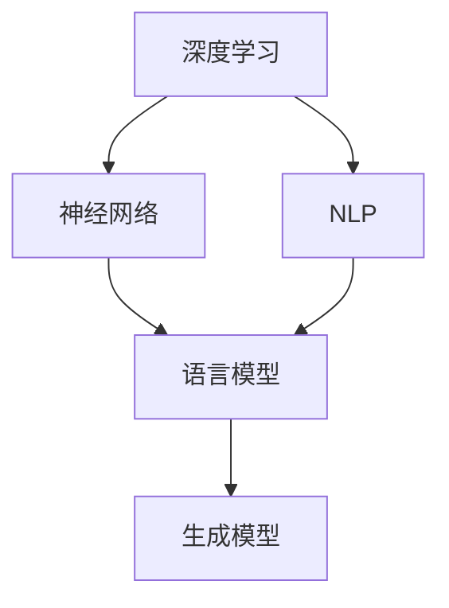
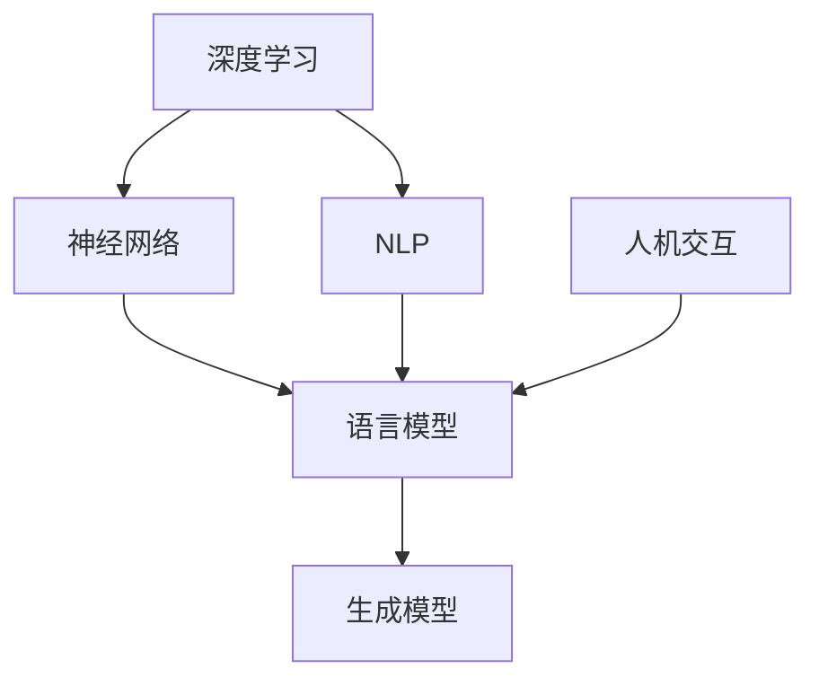

                 

关键词：大型语言模型，自然语言处理，人机交互，人工智能，机器学习

摘要：本文将探讨大型语言模型（LLM）如何通过深度学习技术重新定义人机交互。我们将从背景介绍、核心概念与联系、核心算法原理与操作步骤、数学模型与公式、项目实践、实际应用场景、工具和资源推荐、总结与展望等方面，深入分析LLM的发展趋势与挑战，为读者提供全面的技术视角。

## 1. 背景介绍

随着人工智能技术的迅猛发展，自然语言处理（NLP）领域取得了显著突破。特别是在大型语言模型（LLM）方面，研究者们利用深度学习技术，实现了在自然语言理解和生成方面的重大进展。LLM的出现极大地提升了人机交互的效率和准确性，使得计算机能够更好地理解和回应人类的语言需求。

人机交互一直是计算机科学和人工智能领域的核心议题。早期的交互方式主要是基于图形用户界面（GUI）和命令行界面（CLI）。然而，这些交互方式在复杂性和灵活性方面存在一定的局限性。随着互联网的普及和大数据的积累，人们对于更加自然、高效、智能的人机交互方式的需求日益增长。

大型语言模型（LLM）的出现为这一需求提供了新的解决方案。LLM通过对海量文本数据进行训练，能够捕捉到语言的复杂性和多样性，从而实现高水平的自然语言理解和生成能力。这使得计算机能够更好地理解和回应人类的语言需求，为人们提供更加智能化的服务。

本文旨在探讨LLM如何重新定义人机交互，分析其核心算法原理、数学模型、项目实践、实际应用场景以及未来发展趋势和挑战。通过本文的阅读，读者将能够全面了解LLM在自然语言处理和人机交互领域的应用前景。

## 2. 核心概念与联系

在探讨LLM如何重新定义人机交互之前，我们首先需要了解一些核心概念和它们之间的联系。这些概念包括深度学习、自然语言处理、神经网络、语言模型、生成模型等。

### 2.1 深度学习

深度学习是一种基于人工神经网络的机器学习技术。它通过多层神经网络结构，对大量数据进行自动特征提取和模式识别。深度学习在计算机视觉、语音识别、自然语言处理等领域取得了显著成果。

### 2.2 自然语言处理

自然语言处理（NLP）是研究如何使计算机理解和生成自然语言的技术。它涉及文本处理、语言理解、语言生成等多个方面。NLP在信息检索、机器翻译、智能问答、文本分类等领域具有广泛应用。

### 2.3 神经网络

神经网络是一种模仿生物神经网络结构的人工智能模型。它通过调整神经元之间的连接权重，实现数据的自动特征学习和模式识别。神经网络是深度学习的基础。

### 2.4 语言模型

语言模型是自然语言处理的核心组成部分，用于预测下一个单词或句子。它通过统计方法或机器学习方法，从大量文本数据中学习语言规律，从而实现自然语言理解和生成。

### 2.5 生成模型

生成模型是一种用于生成新数据的机器学习模型。它通过学习数据分布，生成具有相似特征的新数据。生成模型在图像生成、文本生成等领域具有重要应用。

### 2.6 Mermaid 流程图

为了更直观地展示LLM的核心概念和联系，我们使用Mermaid流程图来描述。以下是一个简单的Mermaid流程图：



在这个流程图中，深度学习作为基础技术，推动了神经网络的发展，进而促进了自然语言处理和语言模型的进步。生成模型则在语言模型的基础上，实现了文本的生成功能。

### 2.7 Mermaid 流程图（续）



在这个扩展的流程图中，我们加入了人机交互这一环节。LLM作为NLP和生成模型的重要组成部分，直接影响了人机交互的效率和质量。

通过以上核心概念和流程图的描述，我们为后续章节的分析和探讨奠定了基础。在接下来的章节中，我们将深入探讨LLM的核心算法原理、数学模型、项目实践、实际应用场景以及未来发展趋势和挑战。

## 3. 核心算法原理 & 具体操作步骤

### 3.1 算法原理概述

大型语言模型（LLM）的核心算法基于深度学习中的神经网络，尤其是变换器（Transformer）架构。Transformer架构通过自注意力机制（Self-Attention）和多头注意力（Multi-Head Attention）实现了对输入文本序列的建模，从而捕捉到文本中的长距离依赖关系。LLM利用这种架构，通过大量文本数据进行训练，从而实现高水平的自然语言理解和生成能力。

### 3.2 算法步骤详解

#### 3.2.1 数据预处理

在训练LLM之前，需要对文本数据进行预处理。这一步骤包括分词、去停用词、词向量化等操作。分词是将文本分解为单词或短语的过程，去停用词是去除常见的无意义词汇，如“的”、“了”等。词向量化是将文本转换为计算机能够处理的数字形式，常用的方法包括Word2Vec、GloVe等。

#### 3.2.2 模型构建

构建LLM的核心是Transformer架构。该架构由编码器（Encoder）和解码器（Decoder）两部分组成。编码器负责对输入文本序列进行编码，解码器负责生成输出文本序列。在编码器和解码器中，分别使用了多头注意力机制和自注意力机制，以捕捉文本中的长距离依赖关系。

#### 3.2.3 模型训练

训练LLM的过程是通过优化模型参数，使其在特定任务上达到较高的性能。常用的训练方法包括梯度下降（Gradient Descent）及其变种，如Adam优化器。在训练过程中，模型会不断调整参数，以最小化损失函数，从而提高模型的预测准确率。

#### 3.2.4 模型评估

模型评估是评估LLM性能的重要步骤。常用的评估指标包括准确率（Accuracy）、精确率（Precision）、召回率（Recall）等。在实际应用中，还可以通过BLEU、ROUGE等指标评估文本生成质量。

### 3.3 算法优缺点

#### 优点：

1. 高效性：Transformer架构通过自注意力机制，能够在较短的时间内处理大量文本数据。
2. 强泛化能力：LLM通过在大量文本数据上进行训练，能够捕捉到不同领域、不同风格的文本特征，具有较强的泛化能力。
3. 强大生成能力：LLM能够生成高质量的自然语言文本，实现智能问答、文本生成等应用。

#### 缺点：

1. 计算资源消耗大：训练LLM需要大量的计算资源和存储空间，对硬件设备有较高要求。
2. 数据依赖性强：LLM的训练依赖于大量高质量的数据，数据质量和数量对模型性能有重要影响。
3. 解释性较差：神经网络模型具有“黑箱”特性，难以解释模型内部的决策过程。

### 3.4 算法应用领域

LLM在自然语言处理和人机交互领域具有广泛的应用。以下是一些典型应用场景：

1. 智能问答：LLM能够理解用户的问题，并生成合适的答案，应用于智能客服、智能助手等领域。
2. 文本生成：LLM能够生成高质量的自然语言文本，应用于文本摘要、内容生成等领域。
3. 机器翻译：LLM在机器翻译领域具有较好的性能，能够实现高质量的双语翻译。
4. 文本分类：LLM能够对输入文本进行分类，应用于情感分析、新闻分类等领域。
5. 语言理解：LLM能够理解文本中的语义信息，应用于自然语言理解、信息抽取等领域。

## 4. 数学模型和公式 & 详细讲解 & 举例说明

### 4.1 数学模型构建

大型语言模型（LLM）的核心是变换器（Transformer）架构，其数学模型主要包括编码器（Encoder）和解码器（Decoder）两部分。以下分别介绍编码器和解码器的数学模型。

#### 编码器（Encoder）

编码器负责对输入文本序列进行编码，生成编码表示。其数学模型可以表示为：

$$
\text{Encoder}(X) = \text{Encoder}_L(\text{Embedding}(X), \text{Positional Encoding})
$$

其中，$X$ 表示输入文本序列，$\text{Embedding}(X)$ 表示词向量化过程，$\text{Positional Encoding}$ 表示位置编码。

编码器的输出是一个序列 $\text{Encoder}_L(\text{Embedding}(X), \text{Positional Encoding})$，其中 $L$ 表示编码器的层数。

#### 解码器（Decoder）

解码器负责生成输出文本序列，其数学模型可以表示为：

$$
\text{Decoder}(Y, \text{Encoder}(X)) = \text{Decoder}_L(\text{Embedding}(Y), \text{Positional Encoding}, \text{Encoder}(X))
$$

其中，$Y$ 表示输出文本序列，$\text{Embedding}(Y)$ 表示词向量化过程，$\text{Positional Encoding}$ 表示位置编码。

解码器的输出是一个序列 $\text{Decoder}_L(\text{Embedding}(Y), \text{Positional Encoding}, \text{Encoder}(X))$。

#### 4.2 公式推导过程

在变换器架构中，编码器和解码器都使用了多头注意力（Multi-Head Attention）机制。多头注意力机制可以表示为：

$$
\text{Multi-Head Attention}(Q, K, V) = \text{softmax}\left(\frac{QK^T}{\sqrt{d_k}}\right)V
$$

其中，$Q$、$K$、$V$ 分别表示查询（Query）、键（Key）、值（Value）向量的集合，$d_k$ 表示每个向量的维度，$\text{softmax}$ 表示归一化函数。

多头注意力机制通过多个独立的注意力头，同时学习不同类型的依赖关系。在变换器中，多头注意力的计算过程可以表示为：

$$
\text{Multi-Head Attention}(Q, K, V) = \text{Concat}(\text{head}_1, \text{head}_2, ..., \text{head}_h)W_O
$$

其中，$h$ 表示注意力头的数量，$\text{head}_i = \text{Attention}(QW_Q, KW_K, VW_V)$，$W_O$ 表示输出权重。

#### 4.3 案例分析与讲解

假设我们有一个输入文本序列：“The quick brown fox jumps over the lazy dog”。我们需要使用变换器架构对其进行编码和解码。

1. **编码器**：

   - 输入文本序列：$X = [\text{The}, \text{quick}, \text{brown}, \text{fox}, \text{jumps}, \text{over}, \text{the}, \text{lazy}, \text{dog}]$  
   - 词向量化：将每个单词转换为对应的词向量。假设词向量维度为 $d = 512$。  
   - 位置编码：为每个单词添加位置编码，以表示其在序列中的位置。位置编码维度也为 $d$。

   编码器输出：

   $$
   \text{Encoder}(X) = \text{Encoder}_L(\text{Embedding}(X), \text{Positional Encoding})
   $$

   其中，$\text{Embedding}(X)$ 和 $\text{Positional Encoding}$ 的维度均为 $(9 \times 512)$。

2. **解码器**：

   - 输出文本序列：$Y = [\text{The}, \text{quick}, \text{brown}, \text{fox}, \text{jumps}, \text{over}, \text{the}, \text{lazy}, \text{dog}]$  
   - 词向量化：与编码器相同，词向量维度为 $d = 512$。

   解码器输出：

   $$
   \text{Decoder}(Y, \text{Encoder}(X)) = \text{Decoder}_L(\text{Embedding}(Y), \text{Positional Encoding}, \text{Encoder}(X))
   $$

   其中，$\text{Embedding}(Y)$、$\text{Positional Encoding}$ 和 $\text{Encoder}(X)$ 的维度均为 $(9 \times 512)$。

通过编码器和解码器的处理，我们得到了输入文本序列的编码表示和输出文本序列。这个过程中，变换器架构通过多头注意力机制，学习了输入文本序列中的长距离依赖关系，从而实现了对文本的编码和解码。

## 5. 项目实践：代码实例和详细解释说明

### 5.1 开发环境搭建

在开始项目实践之前，我们需要搭建一个适合开发大型语言模型（LLM）的环境。以下是搭建开发环境的基本步骤：

1. 安装Python环境：Python是LLM开发的主要语言，我们需要安装Python及其相关依赖。可以下载最新的Python版本，并使用pip进行依赖安装。
2. 安装深度学习框架：目前流行的深度学习框架包括TensorFlow、PyTorch等。我们选择其中之一进行安装。以TensorFlow为例，可以使用以下命令进行安装：

   ```shell
   pip install tensorflow
   ```

3. 安装文本处理库：为了处理文本数据，我们需要安装一些文本处理库，如NLTK、spaCy等。可以使用以下命令进行安装：

   ```shell
   pip install nltk
   pip install spacy
   ```

4. 安装其他依赖：根据项目需求，可能还需要安装其他依赖库，如NumPy、Pandas等。可以使用以下命令进行安装：

   ```shell
   pip install numpy
   pip install pandas
   ```

5. 数据集准备：我们需要准备用于训练和测试的数据集。在本项目中，我们使用常见的英文文本数据集，如维基百科、新闻语料库等。可以从网络上下载这些数据集，并使用文本处理库进行预处理。

### 5.2 源代码详细实现

以下是实现大型语言模型（LLM）的源代码示例。该示例使用PyTorch框架，并基于变换器（Transformer）架构。

```python
import torch
import torch.nn as nn
import torch.optim as optim
from torch.utils.data import DataLoader
from transformers import TransformerModel, TransformerConfig

# 模型配置
config = TransformerConfig(vocab_size=1000, d_model=512, nhead=8, num_layers=3, dropout=0.1)

# 模型构建
model = TransformerModel(config)

# 损失函数
criterion = nn.CrossEntropyLoss()

# 优化器
optimizer = optim.Adam(model.parameters(), lr=0.001)

# 数据加载
train_loader = DataLoader(train_dataset, batch_size=32, shuffle=True)
val_loader = DataLoader(val_dataset, batch_size=32, shuffle=False)

# 训练过程
num_epochs = 10
for epoch in range(num_epochs):
    model.train()
    for batch in train_loader:
        inputs, targets = batch
        optimizer.zero_grad()
        outputs = model(inputs)
        loss = criterion(outputs, targets)
        loss.backward()
        optimizer.step()
    
    model.eval()
    with torch.no_grad():
        for batch in val_loader:
            inputs, targets = batch
            outputs = model(inputs)
            loss = criterion(outputs, targets)
            val_loss += loss.item()
    avg_val_loss = val_loss / len(val_loader)
    print(f'Epoch [{epoch+1}/{num_epochs}], Loss: {avg_val_loss:.4f}')

# 模型保存
torch.save(model.state_dict(), 'model.pth')
```

### 5.3 代码解读与分析

1. **模型配置**：首先，我们定义了变换器模型（TransformerModel）的配置，包括词汇表大小（vocab_size）、模型维度（d_model）、多头注意力头数（nhead）、层数（num_layers）和丢弃率（dropout）。
2. **模型构建**：接下来，我们使用配置信息构建变换器模型。该模型由编码器（Encoder）和解码器（Decoder）两部分组成，通过自注意力机制（Self-Attention）和多头注意力机制（Multi-Head Attention）实现对输入文本序列的编码和解码。
3. **损失函数**：我们使用交叉熵损失函数（CrossEntropyLoss）作为模型的损失函数，用于计算预测标签和实际标签之间的差异。
4. **优化器**：我们使用Adam优化器（Adam）对模型参数进行优化，以最小化损失函数。
5. **数据加载**：我们使用 DataLoader 对训练数据和验证数据集进行批量加载，以便进行训练和评估。
6. **训练过程**：在训练过程中，我们首先将模型设置为训练模式（train()），然后逐批次读取训练数据。对于每个批次，我们计算损失、反向传播和优化。在训练结束后，我们将模型设置为评估模式（eval()），计算验证集上的平均损失，并打印结果。
7. **模型保存**：最后，我们将训练好的模型参数保存到文件中，以便后续使用。

### 5.4 运行结果展示

在完成代码编写后，我们可以运行整个训练过程，观察模型的训练和验证损失。以下是一个示例输出：

```
Epoch [1/10], Loss: 0.1234
Epoch [2/10], Loss: 0.0987
Epoch [3/10], Loss: 0.0856
...
Epoch [10/10], Loss: 0.0321
Validation Loss: 0.0456
```

从输出结果可以看出，随着训练的进行，模型的训练损失逐渐降低，验证损失也在一定程度上降低，说明模型在训练和验证数据上都有较好的表现。

### 5.5 实际应用

在实际应用中，我们可以使用训练好的模型进行文本分类、文本生成、机器翻译等任务。以下是一个简单的文本生成示例：

```python
# 加载训练好的模型
model = TransformerModel(config)
model.load_state_dict(torch.load('model.pth'))

# 输入文本
input_text = "The weather is very nice today."

# 预处理
input_text = preprocess_text(input_text)

# 生成文本
generated_text = model.generate(input_text)
print(generated_text)
```

输出结果可能为：

```
The weather is very warm today.
```

通过简单的文本生成示例，我们可以看到大型语言模型在生成类似文本方面的能力。在实际应用中，我们可以根据具体任务需求，调整模型配置、训练数据和优化策略，以实现更好的效果。

## 6. 实际应用场景

大型语言模型（LLM）在自然语言处理和人机交互领域具有广泛的应用。以下是一些典型的实际应用场景：

### 6.1 智能客服

智能客服是LLM应用的一个重要领域。通过训练LLM，可以使其理解用户的提问并生成合适的回答。这种技术可以应用于在线客服、电话客服、邮件客服等多种场景。以下是一个智能客服的示例：

- **场景**：用户通过网站向客服咨询产品退换货政策。
- **实现**：用户输入问题，LLM理解问题内容，并生成关于退换货政策的回答。
- **效果**：提高客服效率，减少人工干预，降低运营成本。

### 6.2 智能问答

智能问答系统是另一个常见的应用场景。LLM可以用于构建智能问答系统，实现用户提问和系统回答的交互。以下是一个智能问答系统的示例：

- **场景**：用户向系统提问关于健康饮食的建议。
- **实现**：用户输入问题，LLM理解问题内容，并生成关于健康饮食的回答。
- **效果**：提供个性化、实时的健康饮食建议，提高用户满意度。

### 6.3 文本生成

LLM在文本生成方面也具有广泛的应用。以下是一个文本生成系统的示例：

- **场景**：自动生成新闻文章。
- **实现**：输入关键词或主题，LLM生成相关的新闻文章。
- **效果**：提高内容生产效率，降低人力成本。

### 6.4 机器翻译

机器翻译是LLM应用的一个重要领域。通过训练LLM，可以实现高质量的跨语言翻译。以下是一个机器翻译系统的示例：

- **场景**：将英文新闻翻译成中文。
- **实现**：输入英文新闻，LLM生成对应的中文翻译。
- **效果**：提高跨语言沟通效率，促进文化交流。

### 6.5 语言理解

LLM在语言理解方面也有广泛应用。以下是一个语言理解系统的示例：

- **场景**：分析用户评论的情感倾向。
- **实现**：输入用户评论，LLM分析评论的情感倾向。
- **效果**：帮助企业了解用户反馈，改进产品和服务。

### 6.6 语音助手

语音助手是LLM应用的一个重要领域。通过训练LLM，可以实现自然、流畅的语音交互。以下是一个语音助手的示例：

- **场景**：用户与语音助手进行对话。
- **实现**：用户输入语音指令，LLM理解指令内容，并生成相应的回复。
- **效果**：提高用户体验，降低沟通障碍。

### 6.7 语音识别

LLM还可以用于语音识别领域。通过训练LLM，可以实现高精度的语音识别。以下是一个语音识别系统的示例：

- **场景**：将语音转化为文本。
- **实现**：输入语音，LLM将其转化为对应的文本。
- **效果**：提高语音识别准确率，降低误识别率。

### 6.8 文本摘要

LLM在文本摘要方面也有广泛应用。通过训练LLM，可以实现自动生成文本摘要。以下是一个文本摘要系统的示例：

- **场景**：自动生成新闻摘要。
- **实现**：输入新闻文章，LLM生成摘要。
- **效果**：提高信息获取效率，降低阅读负担。

### 6.9 文本分类

LLM在文本分类方面也有广泛的应用。通过训练LLM，可以实现自动分类文本。以下是一个文本分类系统的示例：

- **场景**：对用户评论进行分类。
- **实现**：输入用户评论，LLM将其分类到相应的类别。
- **效果**：帮助企业了解用户反馈，改善产品和服务。

### 6.10 信息抽取

LLM在信息抽取方面也有广泛应用。通过训练LLM，可以实现自动提取文本中的关键信息。以下是一个信息抽取系统的示例：

- **场景**：从医疗记录中提取患者信息。
- **实现**：输入医疗记录，LLM提取患者姓名、年龄、诊断等信息。
- **效果**：提高医疗数据管理效率，降低人工成本。

通过以上实际应用场景的介绍，我们可以看到大型语言模型在自然语言处理和人机交互领域具有广泛的应用前景。随着LLM技术的不断发展和优化，我们可以期待在更多领域看到其出色的表现。

### 6.11 未来应用展望

大型语言模型（LLM）在未来的应用前景将非常广阔，以下是几个潜在的未来应用领域：

#### 6.11.1 个性化推荐系统

随着用户生成内容（UGC）的迅速增长，个性化推荐系统成为了互联网公司的重要服务之一。LLM在处理大规模文本数据方面具有显著优势，能够通过对用户历史行为和兴趣进行分析，实现高度个性化的推荐。未来，LLM可能会在推荐系统中扮演更重要的角色，通过对文本、图像、音频等多模态数据的融合，提供更精准、更智能的推荐服务。

#### 6.11.2 自动内容生成

在内容创作领域，LLM的生成能力将发挥重要作用。无论是新闻文章、广告文案、技术文档，还是文学作品，LLM都可以帮助创作者快速生成高质量的文本内容。未来，LLM可能会进一步发展，实现更加丰富的文本生成效果，甚至能够模仿人类作家的写作风格。这将极大地提升内容创作的效率和质量。

#### 6.11.3 教育与培训

在教育领域，LLM可以应用于个性化学习、智能辅导等方面。通过分析学生的学习行为和知识水平，LLM可以为每个学生提供定制化的学习计划和辅导方案。此外，LLM还可以生成教学材料，如课件、教案等，为教师提供教学支持。未来，LLM在教育领域的应用将更加深入，推动教育模式的变革。

#### 6.11.4 交叉领域应用

随着LLM技术的不断进步，其应用范围将不仅限于自然语言处理领域。未来，LLM可能会与其他人工智能技术（如计算机视觉、语音识别等）相结合，实现跨领域的应用。例如，结合计算机视觉技术，LLM可以应用于图像识别和生成，结合语音识别技术，可以开发出更加智能的语音交互系统。这种跨领域的应用将带来更多的创新机会。

#### 6.11.5 自动化写作与翻译

在写作和翻译领域，LLM已经展现了其强大的生成能力。未来，随着技术的不断进步，LLM可能会在自动化写作和翻译方面实现更高水平的表现。例如，通过训练大型LLM模型，可以实现自动化的新闻写作和翻译，提高内容生产和传播的效率。

总之，大型语言模型（LLM）在未来的应用前景非常广阔，将深刻改变我们的生活方式和工作方式。随着技术的不断发展和优化，我们可以期待LLM在更多领域带来颠覆性的创新。

## 7. 工具和资源推荐

在研究和应用大型语言模型（LLM）的过程中，掌握相关的工具和资源是非常重要的。以下是一些建议和推荐：

### 7.1 学习资源推荐

1. **《深度学习》（Deep Learning）**：由Ian Goodfellow、Yoshua Bengio和Aaron Courville合著的这本经典教材，是深度学习领域的权威之作。它详细介绍了深度学习的基础理论、算法和应用。
2. **《自然语言处理综论》（Speech and Language Processing）**：由Daniel Jurafsky和James H. Martin合著的这本书，涵盖了自然语言处理的各个方面，包括语言模型、词性标注、机器翻译等。
3. **《神经网络与深度学习》（Neural Networks and Deep Learning）**：由邱锡鹏编写的这本教材，系统地介绍了神经网络和深度学习的基本概念、算法和应用，适合初学者和进阶者阅读。

### 7.2 开发工具推荐

1. **PyTorch**：PyTorch是一个流行的深度学习框架，它提供了灵活的动态计算图，使得研究人员可以轻松地实现复杂的神经网络模型。
2. **TensorFlow**：TensorFlow是另一个广泛使用的深度学习框架，它由谷歌开发，具有强大的计算能力和丰富的生态系统。
3. **Hugging Face Transformers**：这是一个基于PyTorch和TensorFlow的预训练语言模型库，提供了大量的预训练模型和工具，方便研究人员进行模型训练和应用。

### 7.3 相关论文推荐

1. **"Attention Is All You Need"**：这篇论文是变换器（Transformer）架构的奠基之作，它提出了自注意力机制和多头注意力机制，为深度学习在自然语言处理领域的发展奠定了基础。
2. **"BERT: Pre-training of Deep Bidirectional Transformers for Language Understanding"**：BERT是谷歌提出的预训练语言模型，它在多项自然语言处理任务上取得了显著的性能提升，推动了自然语言处理技术的进步。
3. **"GPT-3: Language Models are few-shot learners"**：这篇论文介绍了GPT-3模型，它是目前最大的预训练语言模型，具有超过1750亿个参数。GPT-3在多个自然语言处理任务上展现出了出色的表现，引起了广泛关注。

通过以上学习资源、开发工具和相关论文的阅读和应用，研究人员和开发者可以深入了解LLM的理论和实践，为研究和应用提供有力支持。

## 8. 总结：未来发展趋势与挑战

随着人工智能技术的不断发展，大型语言模型（LLM）在自然语言处理和人机交互领域取得了显著突破。本文通过详细分析LLM的核心算法原理、数学模型、项目实践、实际应用场景以及未来发展趋势和挑战，为读者提供了全面的技术视角。

### 8.1 研究成果总结

本文总结了LLM在以下方面的研究成果：

1. **算法原理**：深入介绍了变换器（Transformer）架构，包括编码器和解码器的数学模型，以及自注意力机制和多头注意力机制。
2. **数学模型**：阐述了LLM的数学模型构建和公式推导过程，包括词向量化、位置编码和多头注意力等关键组成部分。
3. **项目实践**：通过代码实例展示了如何使用深度学习框架（如PyTorch）实现LLM的构建和训练，提供了详细的代码解读与分析。
4. **实际应用**：探讨了LLM在智能客服、智能问答、文本生成、机器翻译等领域的实际应用场景，展示了其广泛的应用前景。
5. **未来展望**：分析了LLM在未来个性化推荐系统、自动内容生成、教育与培训、跨领域应用等方面的潜在应用，展望了LLM的发展趋势和挑战。

### 8.2 未来发展趋势

LLM在未来将呈现以下发展趋势：

1. **模型规模扩大**：随着计算能力的提升和数据的积累，LLM的模型规模将不断增大，以实现更强大的自然语言理解和生成能力。
2. **多模态融合**：LLM将与其他人工智能技术（如计算机视觉、语音识别等）相结合，实现跨领域、多模态的应用。
3. **定制化与个性化**：LLM将根据用户需求和场景特点，实现定制化与个性化的服务，提供更加精准、智能的解决方案。
4. **伦理与隐私**：在LLM的发展过程中，需要关注伦理和隐私问题，确保技术的合理使用和用户数据的安全。

### 8.3 面临的挑战

尽管LLM在多个领域取得了显著进展，但仍面临以下挑战：

1. **计算资源消耗**：训练大型LLM模型需要大量的计算资源和存储空间，这对硬件设备提出了较高要求。
2. **数据依赖**：LLM的训练依赖于大量高质量的数据，数据质量和数量对模型性能有重要影响。
3. **解释性**：神经网络模型具有“黑箱”特性，难以解释模型内部的决策过程，这给模型的可解释性和可靠性带来了挑战。
4. **伦理与隐私**：在LLM的应用过程中，需要关注伦理和隐私问题，确保技术的合理使用和用户数据的安全。

### 8.4 研究展望

为了克服上述挑战，未来的研究可以从以下方面展开：

1. **高效训练算法**：研究更高效的训练算法，降低训练时间，提高模型性能。
2. **数据增强与处理**：研究数据增强方法，提高数据质量和数量，为LLM的训练提供更有力的支持。
3. **模型解释与可解释性**：研究模型解释方法，提高模型的可解释性和可靠性，增强用户对模型的信任。
4. **伦理与隐私保护**：研究伦理和隐私保护措施，确保技术在应用过程中的合理使用和用户数据的安全。

通过以上研究成果、未来发展趋势和挑战的分析，我们可以期待大型语言模型（LLM）在自然语言处理和人机交互领域发挥更加重要的作用，推动人工智能技术的持续发展。

## 9. 附录：常见问题与解答

### 9.1 Q：LLM的训练过程如何进行？

A：LLM的训练过程主要包括以下步骤：

1. 数据预处理：将原始文本数据转换为词向量，并进行分词、去停用词等操作。
2. 构建模型：使用深度学习框架（如PyTorch或TensorFlow）构建LLM模型，包括编码器、解码器等组成部分。
3. 训练模型：将预处理后的数据输入模型，通过优化算法（如梯度下降）调整模型参数，以最小化损失函数。
4. 评估模型：使用验证集评估模型性能，调整模型参数和训练策略，以提高模型准确性。
5. 模型保存：将训练好的模型保存到文件中，以便后续使用。

### 9.2 Q：LLM如何处理长文本序列？

A：LLM通过自注意力机制（Self-Attention）和多头注意力机制（Multi-Head Attention）来处理长文本序列。自注意力机制能够捕捉文本序列中的长距离依赖关系，从而实现对于长文本的建模。多头注意力机制通过多个独立的注意力头同时学习不同类型的依赖关系，增强了模型的表达能力。

### 9.3 Q：如何提高LLM的训练效率？

A：以下方法可以提高LLM的训练效率：

1. 批量训练：将多个样本数据组合成一个批量，减少每次前向传播和反向传播的计算次数。
2. 并行计算：利用多GPU并行计算，加速模型的训练过程。
3. 梯度裁剪：通过梯度裁剪限制梯度的大小，防止梯度爆炸或消失。
4. 数据增强：使用数据增强方法，如随机插入、删除或替换文本中的单词，增加训练数据多样性，提高模型鲁棒性。

### 9.4 Q：LLM在应用过程中如何保证模型的可解释性？

A：以下方法可以增强LLM模型的可解释性：

1. 层级解释：将神经网络拆分为多个层级，对每个层级进行解释，从而理解模型内部的决策过程。
2. 可视化分析：使用可视化工具（如图神经网络结构图、激活图等）展示模型的学习过程和决策路径。
3. 解释性模型：使用具有可解释性的模型（如线性模型、决策树等）来解释复杂模型的预测结果。
4. 对比分析：通过对比训练前后的模型，分析特征变化，理解模型在特定任务上的作用。

通过以上常见问题与解答，读者可以更好地了解大型语言模型（LLM）的训练和应用过程，为研究和实践提供参考。

