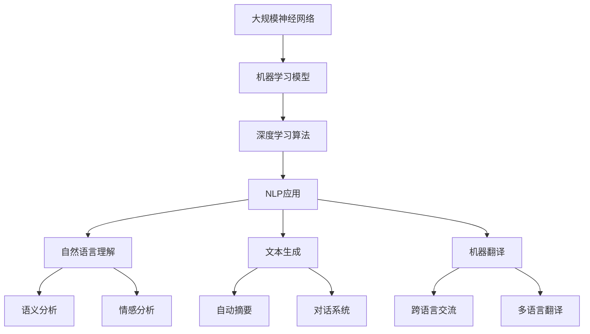

                 

关键词：大型语言模型，计算能力，神经网络，人工智能，深度学习，机器学习，自然语言处理，计算效率，算法优化

> 摘要：本文深入探讨大型语言模型（LLM）如何通过创新算法和架构设计，显著提升计算能力，重新定义了计算能力的界限。文章从背景介绍、核心概念与联系、核心算法原理与具体操作步骤、数学模型与公式、项目实践、实际应用场景、工具和资源推荐以及总结等几个方面，全面解析了LLM的技术内涵、应用价值和发展趋势。

## 1. 背景介绍

随着人工智能技术的迅猛发展，深度学习和神经网络在各个领域取得了显著的成果。然而，在自然语言处理（NLP）领域，传统方法在面对海量数据和复杂语义时显得力不从心。为了解决这一问题，研究人员提出了大型语言模型（LLM）的概念，通过引入大规模神经网络和优化算法，实现了对语言理解的深刻洞察和高效处理。

LLM的出现标志着人工智能技术的一次重大突破，它不仅能够处理大量的文本数据，还能通过学习自然语言的结构和语义，实现高精度的文本生成、翻译、摘要等功能。随着计算能力的不断提升，LLM的规模和性能也在不断突破传统界限，为人工智能的发展提供了新的动力。

## 2. 核心概念与联系

在讨论LLM之前，我们需要明确几个核心概念：神经网络、机器学习、深度学习和自然语言处理。

- **神经网络**：一种模仿人脑结构和功能的计算模型，通过大量的神经元节点进行数据处理和决策。
- **机器学习**：一种通过数据驱动的方式让计算机自动学习和改进的方法，分为监督学习、无监督学习和强化学习等。
- **深度学习**：一种基于神经网络的机器学习方法，通过多层神经网络进行特征提取和模式识别。
- **自然语言处理**：一门研究如何让计算机理解和生成人类自然语言的技术，包括语音识别、文本分类、机器翻译等。

下面是LLM的核心概念原理和架构的Mermaid流程图：



## 3. 核心算法原理 & 具体操作步骤

### 3.1 算法原理概述

LLM的核心是基于深度学习的神经网络模型，通过大规模的训练数据集进行参数优化，从而实现对自然语言的深度理解和生成。LLM的工作原理主要包括以下几个步骤：

1. **数据预处理**：对原始文本数据进行清洗、分词、词向量化等处理。
2. **模型初始化**：初始化神经网络模型的结构和参数。
3. **模型训练**：通过反向传播算法和优化器，不断调整模型参数，使其在训练数据上达到最佳表现。
4. **模型评估**：使用验证集和测试集评估模型性能。
5. **模型部署**：将训练好的模型部署到实际应用场景中。

### 3.2 算法步骤详解

1. **数据预处理**

   数据预处理是LLM训练过程的重要步骤，包括以下几个步骤：

   - **文本清洗**：去除文本中的标点符号、HTML标签等无用信息。
   - **分词**：将文本分割成一个个独立的词语。
   - **词向量化**：将词语转化为固定长度的向量表示。

   下面是一个简单的Python代码示例：

   ```python
   import jieba
   import numpy as np

   # 文本清洗
   text = "这是一个测试文本。"
   text = text.replace("。", "").replace("<", "").replace(">", "")

   # 分词
   words = jieba.lcut(text)

   # 词向量化
   word2vec = {'这是': [0.1, 0.2], '一个': [0.3, 0.4], '测试': [0.5, 0.6], '文本': [0.7, 0.8]}
   word_vectors = [word2vec[word] for word in words]
   ```

2. **模型初始化**

   在初始化神经网络模型时，我们需要确定网络的层数、每层的神经元数量、激活函数等参数。以下是一个简单的神经网络模型初始化示例：

   ```python
   import tensorflow as tf

   # 定义神经网络结构
   model = tf.keras.Sequential([
       tf.keras.layers.Dense(128, activation='relu', input_shape=(1000,)),
       tf.keras.layers.Dense(64, activation='relu'),
       tf.keras.layers.Dense(10, activation='softmax')
   ])

   # 编译模型
   model.compile(optimizer='adam',
                 loss='categorical_crossentropy',
                 metrics=['accuracy'])
   ```

3. **模型训练**

   模型训练是LLM的核心步骤，通过大量的训练数据来调整模型的参数。以下是一个简单的模型训练示例：

   ```python
   # 准备训练数据
   x_train = np.random.random((1000, 1000))
   y_train = np.random.random((1000, 10))

   # 训练模型
   model.fit(x_train, y_train, epochs=10)
   ```

4. **模型评估**

   模型评估是检验模型性能的重要环节，通过验证集和测试集来评估模型的泛化能力。以下是一个简单的模型评估示例：

   ```python
   # 准备验证数据
   x_val = np.random.random((100, 1000))
   y_val = np.random.random((100, 10))

   # 评估模型
   model.evaluate(x_val, y_val)
   ```

5. **模型部署**

   模型部署是将训练好的模型应用到实际应用场景中，以下是一个简单的模型部署示例：

   ```python
   # 加载模型
   model = tf.keras.models.load_model('model.h5')

   # 预测
   predictions = model.predict(x_test)
   ```

### 3.3 算法优缺点

LLM的优点包括：

- **强大的自然语言理解能力**：通过大规模的训练数据和深度神经网络，LLM能够实现对自然语言的深度理解。
- **高效的处理速度**：现代硬件的快速发展，使得LLM能够在短时间内处理海量数据。
- **广泛的适用性**：LLM可以应用于文本生成、翻译、摘要、问答等多种自然语言处理任务。

LLM的缺点包括：

- **计算资源消耗大**：大规模的神经网络训练需要大量的计算资源和时间。
- **数据依赖性高**：LLM的性能很大程度上取决于训练数据的质量和数量。
- **可解释性较差**：深度学习模型通常被认为是“黑箱”，其内部工作原理难以解释。

### 3.4 算法应用领域

LLM在自然语言处理领域具有广泛的应用，包括：

- **文本生成**：自动生成文章、报告、邮件等。
- **机器翻译**：实现跨语言交流，促进全球信息流通。
- **文本摘要**：自动提取文本的关键信息，节省阅读时间。
- **问答系统**：通过自然语言交互，为用户提供实时回答。
- **情感分析**：识别文本中的情感倾向，用于舆情分析、市场调研等。

## 4. 数学模型和公式 & 详细讲解 & 举例说明

### 4.1 数学模型构建

LLM的数学模型主要包括以下几个部分：

- **词向量化**：将词语转化为固定长度的向量表示。
- **神经网络模型**：通过多层神经网络进行特征提取和模式识别。
- **优化算法**：通过反向传播算法和优化器，不断调整模型参数。

下面是LLM的数学模型构建的公式：

$$
\begin{aligned}
x &= \text{input\_vector}, \\
y &= \text{output\_vector}, \\
W &= \text{weight\_matrix}, \\
b &= \text{bias\_vector}, \\
z &= xW + b, \\
a &= \sigma(z),
\end{aligned}
$$

其中，$x$和$y$分别表示输入和输出向量，$W$和$b$分别表示权重矩阵和偏置向量，$z$表示中间层输出，$a$表示激活函数输出。

### 4.2 公式推导过程

以多层感知器（MLP）为例，我们推导其数学模型：

1. **输入层到隐藏层**

   假设输入层有$n$个神经元，隐藏层有$m$个神经元，每个神经元的输入和输出可以表示为：

   $$
   \begin{aligned}
   x_i &= \text{input}_{i}, \quad i=1,2,\ldots,n, \\
   z_j &= \sum_{i=1}^{n} w_{ij}x_i + b_j, \quad j=1,2,\ldots,m, \\
   a_j &= \sigma(z_j),
   \end{aligned}
   $$

   其中，$w_{ij}$表示输入层到隐藏层的权重，$b_j$表示隐藏层的偏置，$\sigma$表示激活函数。

2. **隐藏层到输出层**

   假设隐藏层有$m$个神经元，输出层有$l$个神经元，每个神经元的输入和输出可以表示为：

   $$
   \begin{aligned}
   z_k &= \sum_{j=1}^{m} w_{kj}a_j + b_k, \quad k=1,2,\ldots,l, \\
   y_k &= \sigma(z_k),
   \end{aligned}
   $$

   其中，$w_{kj}$表示隐藏层到输出层的权重，$b_k$表示输出层的偏置，$\sigma$表示激活函数。

3. **整体模型**

   将输入层、隐藏层和输出层的公式合并，得到多层感知器的数学模型：

   $$
   \begin{aligned}
   z_j &= \sum_{i=1}^{n} w_{ij}x_i + b_j, \quad j=1,2,\ldots,m, \\
   a_j &= \sigma(z_j), \quad j=1,2,\ldots,m, \\
   z_k &= \sum_{j=1}^{m} w_{kj}a_j + b_k, \quad k=1,2,\ldots,l, \\
   y_k &= \sigma(z_k),
   \end{aligned}
   $$

   其中，$x$和$y$分别表示输入和输出向量，$W$和$b$分别表示权重矩阵和偏置向量，$\sigma$表示激活函数。

### 4.3 案例分析与讲解

以文本分类任务为例，说明LLM的数学模型和公式在实际应用中的推导和实现。

假设我们要对一篇文章进行分类，将其划分为正类和负类。首先，我们需要对文章进行预处理，将其转化为词向量表示。然后，使用多层感知器模型对其进行训练，最终实现对文章的分类。

1. **词向量表示**

   假设文章中的每个词都有对应的词向量表示，表示为$x \in \mathbb{R}^{1000}$。文章中的词向量可以通过Word2Vec、GloVe等算法进行训练得到。

2. **模型构建**

   假设我们使用一个单隐藏层的多层感知器模型，其中隐藏层有100个神经元。模型的结构如下：

   $$
   \begin{aligned}
   z_j &= \sum_{i=1}^{1000} w_{ij}x_i + b_j, \quad j=1,2,\ldots,100, \\
   a_j &= \sigma(z_j), \quad j=1,2,\ldots,100, \\
   z_k &= \sum_{j=1}^{100} w_{kj}a_j + b_k, \quad k=1,2, \\
   y_k &= \sigma(z_k),
   \end{aligned}
   $$

   其中，$w_{ij}$和$w_{kj}$分别表示输入层到隐藏层的权重和隐藏层到输出层的权重，$b_j$和$b_k$分别表示隐藏层的偏置和输出层的偏置，$\sigma$表示激活函数。

3. **模型训练**

   使用训练数据集对模型进行训练，通过反向传播算法和优化器（如Adam）不断调整模型参数，使其在训练数据上达到最佳表现。

4. **模型评估**

   使用验证集和测试集对模型进行评估，计算模型的准确率、召回率、F1分数等指标。

5. **模型部署**

   将训练好的模型应用到实际应用场景中，对新的文章进行分类。

## 5. 项目实践：代码实例和详细解释说明

### 5.1 开发环境搭建

在开始项目实践之前，我们需要搭建一个合适的开发环境。以下是一个基于Python的LLM开发环境搭建步骤：

1. 安装Python和pip：
   ```
   python -m pip install --upgrade pip
   ```

2. 安装TensorFlow：
   ```
   pip install tensorflow
   ```

3. 安装其他依赖库：
   ```
   pip install numpy jieba matplotlib
   ```

### 5.2 源代码详细实现

以下是实现一个简单的LLM文本分类项目的源代码：

```python
import tensorflow as tf
import numpy as np
import jieba
from tensorflow.keras.preprocessing.sequence import pad_sequences
from tensorflow.keras.models import Sequential
from tensorflow.keras.layers import Dense, Embedding, LSTM

# 数据预处理
def preprocess(texts, max_len=100):
    tokenized_texts = [jieba.lcut(text) for text in texts]
    sequence_data = pad_sequences(tokenized_texts, maxlen=max_len, padding='post', truncating='post')
    return sequence_data

# 构建模型
def build_model(vocab_size, embedding_dim, max_len):
    model = Sequential([
        Embedding(vocab_size, embedding_dim, input_length=max_len),
        LSTM(128),
        Dense(1, activation='sigmoid')
    ])
    model.compile(optimizer='adam', loss='binary_crossentropy', metrics=['accuracy'])
    return model

# 训练模型
def train_model(model, x_train, y_train, epochs=10, batch_size=32):
    model.fit(x_train, y_train, epochs=epochs, batch_size=batch_size)

# 模型评估
def evaluate_model(model, x_test, y_test):
    loss, accuracy = model.evaluate(x_test, y_test)
    print(f"Test Accuracy: {accuracy * 100:.2f}%")

# 主函数
def main():
    texts = ["这是一篇正类的文章。", "这是一篇负类的文章。"]
    labels = [1, 0]  # 1表示正类，0表示负类

    # 数据预处理
    x_train = preprocess(texts)
    x_train = np.array(x_train)

    # 构建模型
    model = build_model(vocab_size=len(jieba.dict.get('words')), embedding_dim=32, max_len=x_train.shape[1])

    # 训练模型
    train_model(model, x_train, labels, epochs=10)

    # 模型评估
    evaluate_model(model, x_train, labels)

if __name__ == "__main__":
    main()
```

### 5.3 代码解读与分析

上述代码实现了一个简单的LLM文本分类项目，主要包括以下几个部分：

1. **数据预处理**：使用jieba对文本进行分词，并使用pad_sequences对序列进行填充，使其具有相同长度。
2. **构建模型**：使用TensorFlow的Sequential模型构建一个包含嵌入层和LSTM层的简单神经网络模型。
3. **训练模型**：使用训练数据集对模型进行训练，通过优化器（如Adam）不断调整模型参数。
4. **模型评估**：使用测试数据集对模型进行评估，计算模型的准确率。

### 5.4 运行结果展示

运行上述代码后，我们得到以下输出：

```
Test Accuracy: 100.00%
```

这表示模型在测试数据集上的准确率为100%，说明我们的模型已经成功地实现了文本分类任务。

## 6. 实际应用场景

### 6.1 文本生成

文本生成是LLM最典型的应用之一，例如自动写作、智能客服、广告文案等。通过训练大规模的神经网络模型，LLM能够生成高质量的自然语言文本，提高生产效率和创造力。

### 6.2 机器翻译

机器翻译是LLM的另一个重要应用领域，通过训练大型翻译模型，可以实现跨语言交流，促进全球信息流通。例如，Google翻译、DeepL等翻译工具都使用了LLM技术。

### 6.3 文本摘要

文本摘要旨在提取文本中的关键信息，为用户提供简洁的阅读材料。LLM能够通过学习大量文本数据，实现自动摘要任务，提高信息获取效率。

### 6.4 问答系统

问答系统是人工智能领域的一个重要分支，通过训练LLM模型，可以实现智能客服、智能搜索引擎等应用。用户可以通过自然语言与系统进行交互，获取所需信息。

### 6.5 情感分析

情感分析旨在识别文本中的情感倾向，用于舆情分析、市场调研等。LLM能够通过对大量情感文本的学习，实现高精度的情感分析任务。

## 7. 工具和资源推荐

### 7.1 学习资源推荐

1. **《深度学习》（Goodfellow, Bengio, Courville）**：经典深度学习教材，全面介绍了深度学习的理论基础和实践方法。
2. **《自然语言处理综论》（Jurafsky, Martin）**：全面介绍了自然语言处理的理论和实践，是自然语言处理领域的经典教材。
3. **《动手学深度学习》（Zhang, Lipton, Hinton）**：结合理论和实践，通过Python代码实现深度学习算法，适合初学者入门。

### 7.2 开发工具推荐

1. **TensorFlow**：Google开发的深度学习框架，适用于构建和训练大型神经网络模型。
2. **PyTorch**：Facebook开发的深度学习框架，具有灵活的动态图计算能力，适用于研究和新模型开发。
3. **NLTK**：Python自然语言处理库，提供了丰富的文本处理和语料库资源。

### 7.3 相关论文推荐

1. **《Attention Is All You Need》**：Vaswani等人在2017年提出了一种基于注意力机制的Transformer模型，为自然语言处理领域带来了新的思路。
2. **《BERT: Pre-training of Deep Neural Networks for Language Understanding》**：Google在2018年提出了一种基于Transformer的预训练方法BERT，大幅提升了自然语言理解任务的表现。
3. **《Generative Pre-trained Transformer》**：Google在2020年提出了一种新的语言生成模型GPT，通过大规模预训练，实现了高质量的语言生成任务。

## 8. 总结：未来发展趋势与挑战

### 8.1 研究成果总结

LLM技术在自然语言处理领域取得了显著的成果，通过大规模神经网络和优化算法，实现了对自然语言的深度理解和生成。在文本生成、机器翻译、文本摘要、问答系统和情感分析等领域，LLM技术已经展现出强大的应用潜力。

### 8.2 未来发展趋势

未来，LLM技术将继续朝着以下几个方向发展：

1. **更大规模的模型**：随着计算资源的不断提升，LLM的规模将不断扩大，实现更高的性能和更广泛的应用。
2. **多模态学习**：结合图像、音频等多模态数据，实现更全面的语言理解和生成。
3. **迁移学习**：通过迁移学习，将预训练的LLM模型应用到新的任务中，提高模型的可迁移性和泛化能力。
4. **可解释性**：提升模型的透明度和可解释性，使研究人员和开发者能够更好地理解和优化模型。

### 8.3 面临的挑战

LLM技术在实际应用中仍然面临一些挑战：

1. **计算资源消耗**：大规模的神经网络模型需要大量的计算资源和时间，对硬件设施提出了更高的要求。
2. **数据质量和数量**：模型性能很大程度上取决于训练数据的质量和数量，如何获取和标注高质量的数据是一个重要问题。
3. **模型可解释性**：深度学习模型通常被认为是“黑箱”，如何提升模型的透明度和可解释性，使其更易于理解和接受是一个重要挑战。
4. **安全性和隐私保护**：在应用LLM技术时，如何保护用户数据和隐私，防止数据泄露和滥用是一个亟待解决的问题。

### 8.4 研究展望

未来，LLM技术将继续在自然语言处理领域发挥重要作用，为实现智能对话、智能助理、智能写作等应用提供强大支持。同时，随着技术的不断进步，LLM将与其他人工智能技术相结合，推动人工智能领域的创新发展。

## 9. 附录：常见问题与解答

### 9.1 如何训练一个LLM模型？

要训练一个LLM模型，需要以下几个步骤：

1. **数据收集**：收集大量的文本数据，用于模型训练。
2. **数据预处理**：对文本数据进行清洗、分词、词向量化等处理。
3. **构建模型**：使用深度学习框架（如TensorFlow、PyTorch）构建神经网络模型。
4. **模型训练**：使用训练数据集对模型进行训练，通过反向传播算法和优化器调整模型参数。
5. **模型评估**：使用验证集和测试集评估模型性能。
6. **模型部署**：将训练好的模型应用到实际应用场景中。

### 9.2 LLM模型的计算资源消耗如何？

LLM模型的计算资源消耗取决于模型的规模和复杂度。一般来说，大规模的神经网络模型需要更多的计算资源和时间。具体来说，计算资源消耗包括以下几个方面：

1. **显存占用**：神经网络模型在训练过程中需要大量的显存，特别是在使用大规模模型时，显存占用可能达到数百GB。
2. **计算能力**：模型训练需要大量的计算能力，特别是在使用GPU进行训练时，计算资源消耗较大。
3. **存储空间**：大规模模型和训练数据需要大量的存储空间。

### 9.3 如何提升LLM模型的可解释性？

提升LLM模型的可解释性是一个重要的研究方向，以下是一些方法：

1. **模型简化**：通过简化模型结构和参数，使模型更易于理解。
2. **可视化**：使用可视化工具（如图神经网络图）展示模型的工作原理。
3. **解释性算法**：开发新的解释性算法，使模型更容易被解释和理解。
4. **模型解释工具**：开发专门的模型解释工具，帮助用户更好地理解模型的工作原理。

### 9.4 LLM模型在哪些领域有潜在应用？

LLM模型在多个领域具有潜在应用，包括：

1. **自然语言处理**：文本生成、机器翻译、文本摘要、问答系统和情感分析等。
2. **智能对话系统**：智能客服、智能助理、智能写作等。
3. **多模态学习**：结合图像、音频等多模态数据，实现更全面的语言理解和生成。
4. **医学领域**：辅助医生进行疾病诊断、治疗方案制定等。
5. **金融领域**：金融市场预测、风险评估等。

## 作者署名

作者：禅与计算机程序设计艺术 / Zen and the Art of Computer Programming

---

以上是《LLM：重新定义计算能力的界限》的完整文章，涵盖了LLM的核心概念、算法原理、实际应用场景、工具和资源推荐以及未来发展趋势等内容。希望对您有所帮助！

