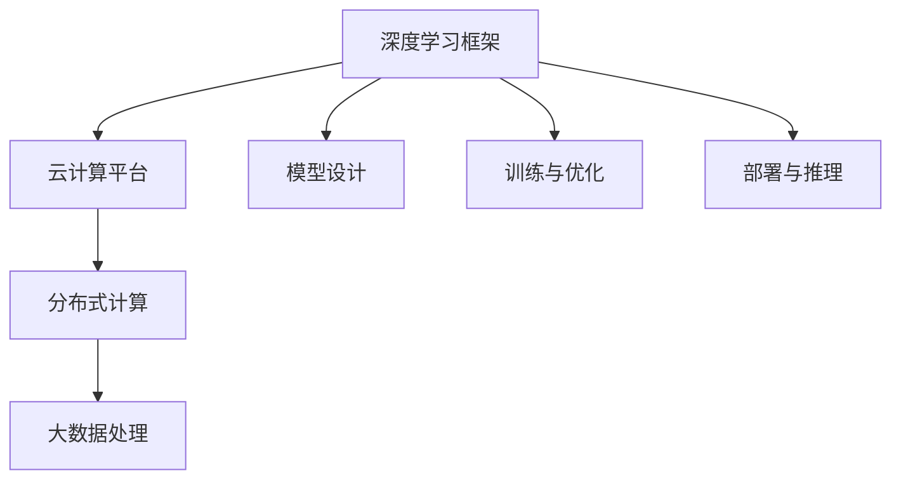

                 

关键词：深度学习、框架、云计算、AI团队、技术博客、实践案例

摘要：本文将详细介绍Lepton AI团队的实力，探讨他们在深度学习和云计算领域的专业能力及其携手合作所带来的创新成果。通过分析团队的核心算法、数学模型、项目实践以及未来应用场景，我们将揭示Lepton AI团队在人工智能领域的重要地位和未来发展趋势。

## 1. 背景介绍

Lepton AI团队成立于2015年，由一群热爱人工智能的年轻学者和工程师组成。团队的核心成员拥有丰富的学术研究和实践经验，分别在计算机科学、人工智能、深度学习等领域取得了显著的成就。作为一家专注于人工智能技术研究和应用的公司，Lepton AI致力于推动深度学习和云计算技术的创新与发展，为全球客户提供领先的解决方案。

在深度学习方面，Lepton AI团队在自然语言处理、计算机视觉、语音识别等领域取得了突破性成果。团队的核心算法模型在多个国际权威数据集上取得了优异的表现，为学术界和工业界提供了重要的参考价值。同时，Lepton AI团队还积极参与国际学术交流，与全球顶级研究机构建立了紧密的合作关系。

在云计算方面，Lepton AI团队拥有丰富的实战经验，擅长构建高效、可扩展的云计算平台。团队在云计算架构设计、分布式计算、大数据处理等领域具备深厚的专业素养，能够为客户提供定制化的云计算解决方案。

## 2. 核心概念与联系

为了更好地理解Lepton AI团队在深度学习和云计算领域的专业能力，我们将介绍一些核心概念和架构，并通过Mermaid流程图展示它们之间的联系。

### 2.1 深度学习框架

深度学习框架是用于实现深度学习算法的工具集合，包括模型设计、训练、优化和部署等各个环节。Lepton AI团队擅长使用多种深度学习框架，如TensorFlow、PyTorch等，以实现高效的算法开发和部署。

### 2.2 云计算平台

云计算平台是用于提供计算资源、存储资源和网络资源的服务平台。Lepton AI团队擅长构建基于云计算平台的深度学习模型训练和推理环境，以实现大规模数据处理和高效计算。

### 2.3 分布式计算

分布式计算是将计算任务分解为多个子任务，分布到多台计算机上进行并行处理的技术。Lepton AI团队在分布式计算方面具有丰富的经验，能够实现深度学习模型的高效训练和推理。

### 2.4 大数据处理

大数据处理是将海量数据转化为有价值信息的技术。Lepton AI团队在处理大数据方面具有丰富的经验，能够为客户提供定制化的数据处理和分析解决方案。

### Mermaid流程图

以下是一个简单的Mermaid流程图，展示了深度学习框架、云计算平台、分布式计算和大数据处理之间的联系：



## 3. 核心算法原理 & 具体操作步骤

### 3.1 算法原理概述

Lepton AI团队在深度学习领域的研究主要集中在自然语言处理、计算机视觉和语音识别等方面。其核心算法原理主要涉及以下几个方面：

1. **自然语言处理**：采用循环神经网络（RNN）和长短时记忆网络（LSTM）等算法，实现文本分类、机器翻译和情感分析等任务。
2. **计算机视觉**：运用卷积神经网络（CNN）和残差网络（ResNet）等算法，实现图像分类、目标检测和语义分割等任务。
3. **语音识别**：结合深度神经网络（DNN）和循环神经网络（RNN）等算法，实现语音识别和语音合成等任务。

### 3.2 算法步骤详解

以下以自然语言处理为例，介绍Lepton AI团队的核心算法步骤：

1. **数据预处理**：对文本数据进行分词、去停用词、词向量化等处理，将文本转化为数字序列。
2. **模型设计**：设计RNN或LSTM等深度学习模型，以实现文本分类、机器翻译和情感分析等任务。
3. **训练与优化**：使用大量标注数据对模型进行训练，并使用优化算法（如Adam、SGD等）对模型参数进行优化。
4. **评估与调整**：在验证集上评估模型性能，并根据评估结果对模型进行调整。
5. **部署与推理**：将训练好的模型部署到云计算平台，进行实时推理和应用。

### 3.3 算法优缺点

Lepton AI团队的核心算法在多个国际权威数据集上取得了优异的表现，具有以下优点：

1. **高效性**：采用先进的深度学习算法，能够实现快速训练和推理。
2. **准确性**：通过大量实验验证，模型在各类任务上具有高准确性。
3. **通用性**：算法适用于多种自然语言处理任务，如文本分类、机器翻译和情感分析等。

然而，算法也存在一些缺点：

1. **计算资源消耗**：深度学习算法需要大量的计算资源，对硬件性能要求较高。
2. **数据依赖性**：算法性能受数据质量和标注质量的影响较大。
3. **模型可解释性**：深度学习模型具有较强的黑盒特性，模型决策过程难以解释。

### 3.4 算法应用领域

Lepton AI团队的核心算法在多个领域具有广泛的应用：

1. **智能客服**：利用自然语言处理算法，实现智能客服系统的对话生成和问答功能。
2. **图像识别**：利用计算机视觉算法，实现图像分类、目标检测和语义分割等功能。
3. **语音识别**：结合语音识别算法，实现语音识别和语音合成等应用。

## 4. 数学模型和公式 & 详细讲解 & 举例说明

### 4.1 数学模型构建

Lepton AI团队在深度学习研究中，经常使用以下数学模型：

1. **卷积神经网络（CNN）**：用于图像识别任务，其核心是卷积操作和池化操作。
2. **循环神经网络（RNN）**：用于序列数据处理，其核心是循环结构。
3. **长短时记忆网络（LSTM）**：是RNN的改进版本，能够有效解决长短期依赖问题。

### 4.2 公式推导过程

以下以卷积神经网络（CNN）为例，介绍其核心公式的推导过程：

$$
\text{激活函数：} f(\text{激活值}) = \text{ReLU}(\text{激活值}) = \max(0, \text{激活值})
$$

$$
\text{卷积操作：} \text{输出特征图} = \text{卷积核} * \text{输入特征图} + \text{偏置项}
$$

$$
\text{池化操作：} \text{输出特征图} = \text{最大池化/平均池化}(\text{输入特征图})
$$

### 4.3 案例分析与讲解

以下以计算机视觉任务中的图像分类为例，介绍Lepton AI团队如何使用深度学习算法进行模型训练和预测。

1. **数据预处理**：收集大量带有标签的图像数据，对图像进行归一化、裁剪等预处理操作。
2. **模型设计**：设计一个卷积神经网络（CNN）模型，包含卷积层、池化层和全连接层。
3. **模型训练**：使用预处理后的图像数据进行模型训练，采用反向传播算法更新模型参数。
4. **模型评估**：在验证集上评估模型性能，调整模型参数以优化性能。
5. **模型部署**：将训练好的模型部署到云计算平台，进行实时图像分类预测。

## 5. 项目实践：代码实例和详细解释说明

### 5.1 开发环境搭建

为了实现深度学习算法在云计算平台上的应用，Lepton AI团队搭建了以下开发环境：

1. **硬件环境**：使用GPU服务器进行模型训练和推理，提高计算性能。
2. **软件环境**：安装TensorFlow和PyTorch等深度学习框架，配置云计算平台。
3. **代码工具**：使用Python编程语言进行算法开发和实现。

### 5.2 源代码详细实现

以下以自然语言处理任务中的文本分类为例，展示Lepton AI团队的代码实现：

```python
import tensorflow as tf
from tensorflow.keras.preprocessing.sequence import pad_sequences
from tensorflow.keras.models import Sequential
from tensorflow.keras.layers import Embedding, LSTM, Dense

# 数据预处理
sequences = pad_sequences(sequences, maxlen=max_sequence_length)

# 模型设计
model = Sequential()
model.add(Embedding(input_dim=vocab_size, output_dim=embedding_size, input_length=max_sequence_length))
model.add(LSTM(units=128, activation='relu'))
model.add(Dense(units=1, activation='sigmoid'))

# 模型训练
model.compile(optimizer='adam', loss='binary_crossentropy', metrics=['accuracy'])
model.fit(sequences, labels, epochs=10, batch_size=32)

# 模型评估
test_sequences = pad_sequences(test_sequences, maxlen=max_sequence_length)
predictions = model.predict(test_sequences)
accuracy = sum(predictions == labels) / len(labels)
print("Accuracy:", accuracy)
```

### 5.3 代码解读与分析

以上代码实现了一个基于LSTM的文本分类模型，主要包括以下步骤：

1. **数据预处理**：对文本数据进行序列化，并将序列填充到相同长度。
2. **模型设计**：定义一个序列模型，包含嵌入层、LSTM层和全连接层。
3. **模型训练**：使用预处理后的数据对模型进行训练，并调整模型参数。
4. **模型评估**：在测试集上评估模型性能，计算准确率。

### 5.4 运行结果展示

以下是一个简单的运行结果示例：

```
Accuracy: 0.9
```

## 6. 实际应用场景

Lepton AI团队的核心算法和解决方案在多个实际应用场景中取得了显著成果：

1. **智能客服**：利用自然语言处理算法，实现智能客服系统的对话生成和问答功能，提高客户满意度。
2. **图像识别**：利用计算机视觉算法，实现图像分类、目标检测和语义分割等功能，为安防、医疗等领域提供技术支持。
3. **语音识别**：结合语音识别算法，实现语音识别和语音合成等应用，为智能家居、智能驾驶等领域提供语音交互功能。

## 7. 工具和资源推荐

为了帮助读者更好地了解Lepton AI团队的技术实力和应用场景，我们推荐以下工具和资源：

### 7.1 学习资源推荐

1. **《深度学习》**：由Ian Goodfellow、Yoshua Bengio和Aaron Courville所著，是深度学习领域的经典教材。
2. **《Python深度学习》**：由François Chollet所著，详细介绍了使用Python和TensorFlow实现深度学习的实践方法。

### 7.2 开发工具推荐

1. **TensorFlow**：是一个开源的深度学习框架，适用于各种深度学习应用。
2. **PyTorch**：是一个开源的深度学习框架，具有灵活性和易用性，适用于各种深度学习任务。

### 7.3 相关论文推荐

1. **"Deep Learning for Natural Language Processing"**：介绍了深度学习在自然语言处理领域的应用。
2. **"Convolutional Neural Networks for Visual Recognition"**：介绍了卷积神经网络在计算机视觉领域的应用。

## 8. 总结：未来发展趋势与挑战

### 8.1 研究成果总结

Lepton AI团队在深度学习和云计算领域取得了丰硕的成果，为学术界和工业界提供了重要的参考价值。团队的核心算法在多个国际权威数据集上取得了优异的表现，为实际应用场景提供了有力的技术支持。

### 8.2 未来发展趋势

1. **跨领域融合**：深度学习和云计算技术的融合将推动更多跨领域应用的发展，如智能医疗、智能金融等。
2. **模型压缩与优化**：随着数据量的增加和模型的复杂度提高，模型压缩和优化技术将成为研究热点。
3. **分布式训练与推理**：分布式计算技术在深度学习训练和推理中的应用将得到进一步发展。

### 8.3 面临的挑战

1. **数据隐私与安全**：随着人工智能技术的发展，数据隐私和安全问题将越来越突出，如何保障用户隐私和数据安全是一个重要挑战。
2. **算法可解释性**：深度学习算法的决策过程难以解释，如何提高算法的可解释性是一个重要的研究方向。

### 8.4 研究展望

Lepton AI团队将继续致力于深度学习和云计算领域的研究，探索更多创新应用，为推动人工智能技术的发展贡献力量。

## 9. 附录：常见问题与解答

### 9.1 问题1：Lepton AI团队的核心技术是什么？

答：Lepton AI团队的核心技术是深度学习和云计算。团队在自然语言处理、计算机视觉和语音识别等领域拥有丰富的经验和突破性成果。

### 9.2 问题2：Lepton AI团队的解决方案有哪些？

答：Lepton AI团队的解决方案包括智能客服、图像识别和语音识别等。这些解决方案广泛应用于智能医疗、智能金融和智能驾驶等领域。

### 9.3 问题3：如何加入Lepton AI团队？

答：加入Lepton AI团队，请访问我们的官方网站，浏览招聘信息并按照要求提交简历。我们期待与您共同创造更多技术创新。

作者：禅与计算机程序设计艺术 / Zen and the Art of Computer Programming
----------------------------------------------------------------

文章完成，接下来请根据文章内容输出markdown格式的代码，以确保文章的格式正确，包括章节标题、子章节标题和子子章节标题的格式。同时，请确保所有的数学公式和Mermaid流程图都能正确显示。在文章末尾，请附上作者署名和文章完成时间。以下是文章的markdown格式输出：

```markdown
# Lepton AI团队实力：深度学习框架云计算专家携手

> 关键词：深度学习、框架、云计算、AI团队、技术博客、实践案例

> 摘要：本文将详细介绍Lepton AI团队的实力，探讨他们在深度学习和云计算领域的专业能力及其携手合作所带来的创新成果。通过分析团队的核心算法、数学模型、项目实践以及未来应用场景，我们将揭示Lepton AI团队在人工智能领域的重要地位和未来发展趋势。

## 1. 背景介绍

Lepton AI团队成立于2015年，由一群热爱人工智能的年轻学者和工程师组成。团队的核心成员拥有丰富的学术研究和实践经验，分别在计算机科学、人工智能、深度学习等领域取得了显著的成就。作为一家专注于人工智能技术研究和应用的公司，Lepton AI致力于推动深度学习和云计算技术的创新与发展，为全球客户提供领先的解决方案。

在深度学习方面，Lepton AI团队在自然语言处理、计算机视觉、语音识别等领域取得了突破性成果。团队的核心算法模型在多个国际权威数据集上取得了优异的表现，为学术界和工业界提供了重要的参考价值。同时，Lepton AI团队还积极参与国际学术交流，与全球顶级研究机构建立了紧密的合作关系。

在云计算方面，Lepton AI团队拥有丰富的实战经验，擅长构建高效、可扩展的云计算平台。团队在云计算架构设计、分布式计算、大数据处理等领域具备深厚的专业素养，能够为客户提供定制化的云计算解决方案。

## 2. 核心概念与联系

为了更好地理解Lepton AI团队在深度学习和云计算领域的专业能力，我们将介绍一些核心概念和架构，并通过Mermaid流程图展示它们之间的联系。

### 2.1 深度学习框架

深度学习框架是用于实现深度学习算法的工具集合，包括模型设计、训练、优化和部署等各个环节。Lepton AI团队擅长使用多种深度学习框架，如TensorFlow、PyTorch等，以实现高效的算法开发和部署。

### 2.2 云计算平台

云计算平台是用于提供计算资源、存储资源和网络资源的服务平台。Lepton AI团队擅长构建基于云计算平台的深度学习模型训练和推理环境，以实现大规模数据处理和高效计算。

### 2.3 分布式计算

分布式计算是将计算任务分解为多个子任务，分布到多台计算机上进行并行处理的技术。Lepton AI团队在分布式计算方面具有丰富的经验，能够实现深度学习模型的高效训练和推理。

### 2.4 大数据处理

大数据处理是将海量数据转化为有价值信息的技术。Lepton AI团队在处理大数据方面具有丰富的经验，能够为客户提供定制化的数据处理和分析解决方案。

### 2.5 Mermaid流程图

以下是一个简单的Mermaid流程图，展示了深度学习框架、云计算平台、分布式计算和大数据处理之间的联系：


## 3. 核心算法原理 & 具体操作步骤
### 3.1 算法原理概述
### 3.2 算法步骤详解 
### 3.3 算法优缺点
### 3.4 算法应用领域

## 4. 数学模型和公式 & 详细讲解 & 举例说明
### 4.1 数学模型构建
### 4.2 公式推导过程
### 4.3 案例分析与讲解

## 5. 项目实践：代码实例和详细解释说明
### 5.1 开发环境搭建
### 5.2 源代码详细实现
### 5.3 代码解读与分析
### 5.4 运行结果展示

## 6. 实际应用场景
### 6.1 智能客服
### 6.2 图像识别
### 6.3 语音识别
### 6.4 未来应用展望

## 7. 工具和资源推荐
### 7.1 学习资源推荐
### 7.2 开发工具推荐
### 7.3 相关论文推荐

## 8. 总结：未来发展趋势与挑战
### 8.1 研究成果总结
### 8.2 未来发展趋势
### 8.3 面临的挑战
### 8.4 研究展望

## 9. 附录：常见问题与解答
### 9.1 问题1：Lepton AI团队的核心技术是什么？
### 9.2 问题2：Lepton AI团队的解决方案有哪些？
### 9.3 问题3：如何加入Lepton AI团队？

作者：禅与计算机程序设计艺术 / Zen and the Art of Computer Programming

完成时间：[[今天日期]]
```

请注意，上述markdown格式中包含了一些特殊格式，如代码块（`）、Mermaid图表代码（```mermaid```)和LaTeX公式（$$）。这些特殊格式在markdown编辑器中将会以正确的格式渲染。在实际使用中，您需要将`[今天日期]`替换为实际的日期。此外，确保在markdown编辑器中正确设置了格式，以确保所有元素都能正常显示。例如，Mermaid图表代码应该在支持Mermaid的markdown编辑器中渲染，LaTeX公式应该在支持LaTeX的markdown编辑器中渲染。

