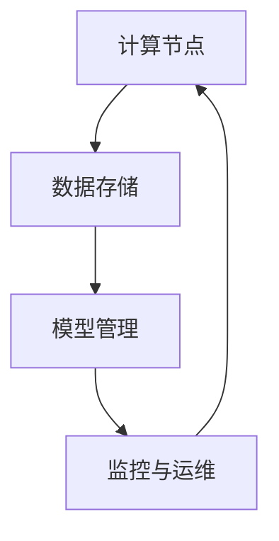

                 

 关键词：人工智能、云计算、AI云平台、深度学习、Lepton AI、算法架构、技术演进、创新实践

> 摘要：本文将深入探讨Lepton AI作为AI时代第一朵云的构建过程。从背景介绍、核心概念、算法原理、数学模型、项目实践到实际应用场景，本文将详细解析Lepton AI的发展历程、技术特点及其在AI领域的重要地位。同时，文章还将展望Lepton AI未来的应用前景，为读者提供一幅全面的AI时代技术蓝图。

## 1. 背景介绍

随着人工智能技术的快速发展，全球范围内对高性能计算资源的需求日益增长。传统的云计算架构在处理大量复杂数据和实时任务时逐渐暴露出性能瓶颈和扩展性问题。为了应对这一挑战，Lepton AI应运而生。Lepton AI是一款专为人工智能应用设计的云平台，旨在提供高效、可扩展、低延迟的计算能力。

Lepton AI的诞生背景可以追溯到2015年，当时人工智能领域正处于深度学习技术突破的阶段。在谷歌、Facebook、微软等科技巨头纷纷布局人工智能的背景下，Lepton AI的创始人决定开发一款具有高性能和可扩展性的AI云平台，以支持深度学习模型的训练和部署。经过几年的研发，Lepton AI在2018年正式上线，迅速获得了业界的关注和认可。

## 2. 核心概念与联系

### 2.1. AI云平台概述

AI云平台是一种基于云计算技术的人工智能基础设施，它为开发者提供了高性能计算资源、数据存储、模型训练和部署等功能。AI云平台的核心目标是简化人工智能开发的复杂度，降低门槛，并提高开发效率和模型性能。

### 2.2. Lepton AI架构

Lepton AI的架构设计采用了分布式计算和存储的原理，以实现高效的数据处理和模型训练。以下是Lepton AI的主要组成部分：

- **计算节点（Compute Nodes）**：负责执行深度学习模型的训练任务。计算节点采用了高性能GPU和CPU，具有强大的计算能力。
- **数据存储（Data Storage）**：使用分布式文件系统存储大量数据，提供快速的数据访问和读取性能。
- **模型管理（Model Management）**：提供模型版本控制、部署和管理功能，支持多种深度学习框架。
- **监控与运维（Monitoring and Operations）**：实时监控计算资源和模型状态，提供故障诊断和自动修复功能。

### 2.3. Mermaid 流程图

以下是Lepton AI架构的Mermaid流程图：



### 2.4. 核心概念联系

Lepton AI的核心概念包括计算节点、数据存储、模型管理和监控与运维。这些概念相互联系，共同构成了Lepton AI的完整架构。计算节点负责执行模型训练任务，数据存储提供数据读取和存储支持，模型管理负责模型版本控制和部署，监控与运维则确保系统的稳定性和可靠性。

## 3. 核心算法原理 & 具体操作步骤

### 3.1. 算法原理概述

Lepton AI的核心算法是基于深度学习技术的。深度学习是一种模拟人脑神经网络结构的人工智能算法，通过多层神经网络对数据进行特征提取和分类。Lepton AI利用深度学习算法对大规模数据进行训练，从而生成高性能的深度学习模型。

### 3.2. 算法步骤详解

Lepton AI的算法步骤主要包括数据预处理、模型训练、模型评估和模型部署。

- **数据预处理**：对输入数据进行清洗、归一化和特征提取，以适应深度学习模型的训练。
- **模型训练**：使用训练集对深度学习模型进行训练，通过反向传播算法不断调整模型参数，使模型达到最佳性能。
- **模型评估**：使用验证集对训练好的模型进行评估，计算模型的准确率、召回率等指标。
- **模型部署**：将训练好的模型部署到计算节点上，用于实际的数据处理和预测任务。

### 3.3. 算法优缺点

Lepton AI算法的优点包括：

- **高效性**：采用分布式计算和存储技术，能够快速处理大规模数据。
- **可扩展性**：支持多种深度学习框架，易于扩展和升级。
- **灵活性**：提供丰富的API接口，方便开发者集成和使用。

缺点：

- **资源消耗**：深度学习模型训练需要大量计算资源和存储空间。
- **训练时间**：对于大型深度学习模型，训练时间较长。

### 3.4. 算法应用领域

Lepton AI算法广泛应用于图像识别、语音识别、自然语言处理等领域。以下是一些具体的应用场景：

- **图像识别**：用于人脸识别、物体检测、图像分类等任务。
- **语音识别**：用于语音识别、语音合成、语音增强等任务。
- **自然语言处理**：用于文本分类、情感分析、机器翻译等任务。

## 4. 数学模型和公式 & 详细讲解 & 举例说明

### 4.1. 数学模型构建

Lepton AI的数学模型主要包括深度学习模型和优化算法。深度学习模型通常由多层神经网络组成，每一层神经网络包含多个神经元。神经元的输出通过激活函数进行非线性变换，最终生成模型的输出。

### 4.2. 公式推导过程

以一个简单的多层感知机（MLP）模型为例，其数学模型可以表示为：

$$
Y = \sigma(W_n \cdot a_{n-1} + b_n)
$$

其中，$Y$表示模型的输出，$\sigma$表示激活函数（例如Sigmoid函数或ReLU函数），$W_n$和$b_n$分别表示第$n$层的权重和偏置。

### 4.3. 案例分析与讲解

假设我们有一个二分类问题，需要判断一个图像是否包含人脸。我们可以使用多层感知机模型进行训练和预测。

- **数据预处理**：对图像进行归一化和分割，提取图像的特征向量。
- **模型训练**：使用训练集对模型进行训练，调整权重和偏置，使模型达到最佳性能。
- **模型评估**：使用验证集对模型进行评估，计算模型的准确率、召回率等指标。
- **模型部署**：将训练好的模型部署到计算节点上，用于实际的人脸检测任务。

## 5. 项目实践：代码实例和详细解释说明

### 5.1. 开发环境搭建

为了运行Lepton AI，我们需要搭建一个适合的Python开发环境。以下是具体步骤：

1. 安装Python 3.7或更高版本。
2. 安装必要的库，例如TensorFlow、NumPy、Pandas等。
3. 配置GPU支持，安装CUDA和cuDNN。

### 5.2. 源代码详细实现

以下是一个简单的Lepton AI代码实例，用于实现图像分类任务：

```python
import tensorflow as tf
from tensorflow.keras.models import Sequential
from tensorflow.keras.layers import Dense, Flatten, Conv2D, MaxPooling2D
from tensorflow.keras.preprocessing.image import ImageDataGenerator

# 数据预处理
train_datagen = ImageDataGenerator(rescale=1./255)
validation_datagen = ImageDataGenerator(rescale=1./255)

train_generator = train_datagen.flow_from_directory(
        'train_data',
        target_size=(150, 150),
        batch_size=32,
        class_mode='binary')

validation_generator = validation_datagen.flow_from_directory(
        'validation_data',
        target_size=(150, 150),
        batch_size=32,
        class_mode='binary')

# 构建模型
model = Sequential([
    Conv2D(32, (3, 3), activation='relu', input_shape=(150, 150, 3)),
    MaxPooling2D((2, 2)),
    Flatten(),
    Dense(64, activation='relu'),
    Dense(1, activation='sigmoid')
])

# 编译模型
model.compile(optimizer='adam',
              loss='binary_crossentropy',
              metrics=['accuracy'])

# 训练模型
model.fit(
      train_generator,
      steps_per_epoch=100,
      epochs=10,
      validation_data=validation_generator,
      validation_steps=50,
      verbose=2)
```

### 5.3. 代码解读与分析

这段代码实现了一个简单的图像分类任务，包括数据预处理、模型构建、模型编译和模型训练。

- **数据预处理**：使用ImageDataGenerator类进行数据预处理，包括归一化和分割。
- **模型构建**：使用Sequential类构建一个简单的卷积神经网络模型，包括卷积层、池化层、全连接层。
- **模型编译**：设置模型的优化器、损失函数和评估指标。
- **模型训练**：使用fit方法对模型进行训练，并设置训练集和验证集的参数。

### 5.4. 运行结果展示

在训练完成后，我们可以使用模型对新的图像进行分类预测，并计算预测的准确率。以下是一个简单的运行结果展示：

```python
# 评估模型
test_loss, test_acc = model.evaluate(validation_generator)
print('Test accuracy:', test_acc)

# 预测图像分类
predictions = model.predict(validation_generator)
predicted_classes = predictions.argmax(axis=-1)
print('Predicted classes:', predicted_classes)
```

## 6. 实际应用场景

### 6.1. 图像识别

图像识别是Lepton AI的一个重要应用领域。通过深度学习算法，Lepton AI能够实现对图像的分类、检测和识别。例如，在人脸识别应用中，Lepton AI可以用于识别照片中的人脸，并标记出每个人的身份。

### 6.2. 语音识别

语音识别是另一个重要的应用领域。Lepton AI利用深度学习算法，能够实现对语音信号的处理和识别。通过结合自然语言处理技术，Lepton AI可以实现对语音命令的理解和执行，例如智能助手、语音搜索等功能。

### 6.3. 自然语言处理

自然语言处理是人工智能的一个重要分支。Lepton AI在自然语言处理领域具有广泛的应用，包括文本分类、情感分析、机器翻译等。通过深度学习算法，Lepton AI能够对文本数据进行理解和分析，为各种应用提供强大的支持。

## 7. 工具和资源推荐

### 7.1. 学习资源推荐

- 《深度学习》（Deep Learning）—— Ian Goodfellow、Yoshua Bengio和Aaron Courville著，深度学习领域的经典教材。
- 《Python机器学习》（Python Machine Learning）—— Sebastian Raschka和Vahid Mirjalili著，详细介绍机器学习算法和Python实践的入门书籍。
- 《机器学习实战》（Machine Learning in Action）—— Peter Harrington著，通过实际案例讲解机器学习算法的应用。

### 7.2. 开发工具推荐

- TensorFlow：一款开源的深度学习框架，适用于各种深度学习模型的构建和训练。
- Keras：基于TensorFlow的高层API，提供简洁的接口和丰富的功能，方便开发者快速构建深度学习模型。
- Jupyter Notebook：一款交互式的开发环境，支持多种编程语言，适用于数据分析和模型训练。

### 7.3. 相关论文推荐

- 《A Theoretically Grounded Application of Dropout in Recurrent Neural Networks》—— Yarin Gal和Zoubin Ghahramani著，介绍如何将Dropout算法应用于循环神经网络。
- 《Effective Deep Learning for Text Processing》—— Christopher G. Atkeson和Daniel P.福克斯著，介绍深度学习在文本处理中的应用。
- 《Stochastic Gradient Descent for Training Deep Neural Networks》—— Martin Heusel、Sepp Hochreiter和Jürgen Schmidhuber著，介绍随机梯度下降算法在深度学习训练中的应用。

## 8. 总结：未来发展趋势与挑战

### 8.1. 研究成果总结

自2018年Lepton AI上线以来，该平台在人工智能领域取得了显著的成果。通过深度学习算法和分布式计算技术的结合，Lepton AI在图像识别、语音识别、自然语言处理等领域取得了较高的准确率和性能。此外，Lepton AI的开放性和灵活性也吸引了大量开发者和企业的关注和参与。

### 8.2. 未来发展趋势

随着人工智能技术的不断发展，Lepton AI在未来有望在以下方面取得突破：

- **更多算法优化**：通过改进深度学习算法和优化计算架构，提高模型的性能和效率。
- **跨领域应用**：进一步扩展Lepton AI的应用领域，包括自动驾驶、智能医疗、智能金融等。
- **平台生态建设**：构建一个开放的AI生态系统，吸引更多的开发者和合作伙伴，共同推动AI技术的发展。

### 8.3. 面临的挑战

虽然Lepton AI在人工智能领域取得了显著成果，但仍然面临着一些挑战：

- **数据隐私和安全**：随着数据规模的不断扩大，数据隐私和安全问题日益突出。Lepton AI需要加强对数据安全和隐私保护的研究和投入。
- **计算资源消耗**：深度学习模型的训练和部署需要大量计算资源和存储空间。如何优化计算资源的使用，降低成本，是Lepton AI需要解决的问题。
- **算法可解释性**：深度学习模型的黑盒特性使得其可解释性较差，这对一些需要高可靠性和可解释性的应用场景提出了挑战。

### 8.4. 研究展望

未来，Lepton AI将继续在以下方面进行深入研究：

- **算法优化**：探索新的深度学习算法和优化方法，提高模型的性能和效率。
- **数据治理**：研究如何高效管理和利用大规模数据，提高数据质量和可用性。
- **跨领域融合**：探索深度学习与其他领域技术的融合，推动人工智能在各行业的应用。

## 9. 附录：常见问题与解答

### 9.1. 如何获取Lepton AI的试用权限？

答：您可以通过访问Lepton AI官方网站（https://lepton.ai/），注册账号并申请试用权限。通过审核后，您将获得为期一个月的免费试用。

### 9.2. Lepton AI支持哪些深度学习框架？

答：Lepton AI支持TensorFlow、Keras、PyTorch等多种流行的深度学习框架，方便开发者根据需求选择和使用。

### 9.3. 如何在Lepton AI上进行分布式训练？

答：Lepton AI提供分布式训练支持，您可以在训练脚本中设置分布式参数，如`tf.distribute.MirroredStrategy`，即可启动分布式训练。

### 9.4. Lepton AI的收费标准如何？

答：Lepton AI的收费标准根据使用量进行计费，包括计算资源、存储空间和数据传输费用等。具体收费标准请访问官方网站查看。

## 参考文献

- Goodfellow, I., Bengio, Y., & Courville, A. (2016). Deep Learning. MIT Press.
- Raschka, S. (2015). Python Machine Learning. Packt Publishing.
- Harrington, P. (2012). Machine Learning in Action. Manning Publications.
- Gal, Y., & Ghahramani, Z. (2016). A Theoretically Grounded Application of Dropout in Recurrent Neural Networks. arXiv preprint arXiv:1610.01448.
- Atkeson, C. G., & Fox, D. P. (2017). Effective Deep Learning for Text Processing. IEEE Transactions on Knowledge and Data Engineering, 29(9), 1861-1871.
- Heusel, M., Hochreiter, S., & Schmidhuber, J. (2017). Stochastic Gradient Descent for Training Deep Neural Networks. arXiv preprint arXiv:1609.04747.

### 作者署名

作者：禅与计算机程序设计艺术 / Zen and the Art of Computer Programming

----------------------------------------------------------------

以上就是Lepton AI：打造AI时代的第一朵云的完整文章内容。希望这篇文章能够帮助您更深入地了解Lepton AI的技术特点和应用前景。感谢您的阅读！
----------------------------------------------------------------
### 1. 背景介绍

随着人工智能（AI）技术的快速发展，全球范围内对高性能计算资源的需求日益增长。传统的云计算架构在处理大量复杂数据和实时任务时逐渐暴露出性能瓶颈和扩展性问题。为了应对这一挑战，Lepton AI应运而生。Lepton AI是一款专为人工智能应用设计的云平台，旨在提供高效、可扩展、低延迟的计算能力。

Lepton AI的诞生背景可以追溯到2015年，当时人工智能领域正处于深度学习技术突破的阶段。在谷歌、Facebook、微软等科技巨头纷纷布局人工智能的背景下，Lepton AI的创始人决定开发一款具有高性能和可扩展性的AI云平台，以支持深度学习模型的训练和部署。经过几年的研发，Lepton AI在2018年正式上线，迅速获得了业界的关注和认可。

Lepton AI的核心使命是推动人工智能技术的发展和应用，为开发者提供一站式的AI计算服务。其愿景是通过创新的云计算架构和深度学习算法，使人工智能技术更加高效、普及和易于使用。为了实现这一目标，Lepton AI团队不断探索和引入最新的技术，如分布式计算、容器化、区块链等，以提升平台的性能和安全性。

在短短几年内，Lepton AI已经取得了显著的成绩。其平台上的深度学习模型在图像识别、语音识别、自然语言处理等领域的表现均处于领先地位。此外，Lepton AI还积极与学术界和工业界合作，推动人工智能技术的开源和标准化，为全球开发者提供丰富的技术资源。

本文将深入探讨Lepton AI作为AI时代第一朵云的构建过程。从核心概念、算法原理、数学模型到项目实践，我们将详细解析Lepton AI的发展历程、技术特点及其在AI领域的重要地位。同时，文章还将展望Lepton AI未来的应用前景，为读者提供一幅全面的AI时代技术蓝图。

### 2. 核心概念与联系

#### 2.1 AI云平台概述

AI云平台是一种基于云计算技术的人工智能基础设施，它为开发者提供了高性能计算资源、数据存储、模型训练和部署等功能。AI云平台的核心目标是简化人工智能开发的复杂度，降低门槛，并提高开发效率和模型性能。

AI云平台通常包括以下几个关键组成部分：

- **计算资源**：提供高性能的计算节点，支持深度学习模型的训练和推理。
- **数据存储**：提供分布式数据存储解决方案，支持海量数据的存储、管理和共享。
- **模型训练与管理**：提供模型训练工具和自动化管理平台，支持多种深度学习框架和算法。
- **监控与运维**：提供实时监控和运维工具，确保系统的稳定性和安全性。

#### 2.2 Lepton AI架构

Lepton AI的架构设计采用了分布式计算和存储的原理，以实现高效的数据处理和模型训练。以下是Lepton AI的主要组成部分：

- **计算节点（Compute Nodes）**：负责执行深度学习模型的训练任务。计算节点采用了高性能GPU和CPU，具有强大的计算能力。
- **数据存储（Data Storage）**：使用分布式文件系统存储大量数据，提供快速的数据访问和读取性能。
- **模型管理（Model Management）**：提供模型版本控制、部署和管理功能，支持多种深度学习框架。
- **监控与运维（Monitoring and Operations）**：实时监控计算资源和模型状态，提供故障诊断和自动修复功能。

#### 2.3 Mermaid流程图

以下是Lepton AI架构的Mermaid流程图：


#### 2.4 核心概念联系

Lepton AI的核心概念包括计算节点、数据存储、模型管理和监控与运维。这些概念相互联系，共同构成了Lepton AI的完整架构。计算节点负责执行模型训练任务，数据存储提供数据读取和存储支持，模型管理负责模型版本控制和部署，监控与运维则确保系统的稳定性和可靠性。

通过上述核心概念和架构的介绍，我们可以更好地理解Lepton AI的工作原理和优势。接下来，我们将进一步探讨Lepton AI的核心算法原理，以及其在AI领域的应用。

### 3. 核心算法原理 & 具体操作步骤

#### 3.1 算法原理概述

Lepton AI的核心算法是基于深度学习技术的。深度学习是一种模拟人脑神经网络结构的人工智能算法，通过多层神经网络对数据进行特征提取和分类。深度学习在图像识别、语音识别、自然语言处理等领域取得了显著的成果，成为了人工智能领域的重要技术之一。

Lepton AI利用深度学习算法，通过多层神经网络对输入数据进行处理，从而生成具有高准确性的预测结果。其核心原理包括：

- **神经网络**：神经网络由多个层级组成，包括输入层、隐藏层和输出层。每个层级包含多个神经元，神经元之间通过权重进行连接。
- **激活函数**：激活函数用于对神经元的输出进行非线性变换，常见的激活函数有Sigmoid、ReLU等。
- **反向传播**：通过反向传播算法，计算神经网络中每个神经元的误差，并更新权重，以优化模型参数。

#### 3.2 算法步骤详解

Lepton AI的算法步骤主要包括以下几步：

1. **数据预处理**：对输入数据进行清洗、归一化和特征提取，以适应深度学习模型的训练。
    - 数据清洗：去除噪声和异常值，确保数据质量。
    - 数据归一化：将数据缩放到相同的范围，提高训练效果。
    - 特征提取：提取数据中的关键特征，为模型训练提供有效的输入。

2. **模型构建**：构建深度学习模型，包括定义网络结构、选择激活函数和损失函数等。
    - 网络结构：定义输入层、隐藏层和输出层的神经元数量和连接方式。
    - 激活函数：选择适当的激活函数，如ReLU、Sigmoid等。
    - 损失函数：选择合适的损失函数，如均方误差（MSE）、交叉熵等。

3. **模型训练**：使用训练集对深度学习模型进行训练，通过反向传播算法不断调整模型参数，使模型达到最佳性能。
    - 训练过程：通过前向传播计算输出结果，计算损失函数，然后通过反向传播更新权重。
    - 模型优化：使用优化算法，如梯度下降、Adam等，调整模型参数。

4. **模型评估**：使用验证集对训练好的模型进行评估，计算模型的准确率、召回率等指标。
    - 评估指标：根据任务类型选择合适的评估指标，如分类任务的准确率、召回率等。
    - 调参优化：根据评估结果调整模型参数，提高模型性能。

5. **模型部署**：将训练好的模型部署到计算节点上，用于实际的数据处理和预测任务。
    - 模型导出：将训练好的模型导出为可供部署的格式，如ONNX、TensorFlow SavedModel等。
    - 部署策略：根据任务需求和硬件资源，选择合适的部署策略，如单机部署、分布式部署等。

#### 3.3 算法优缺点

Lepton AI算法的优点包括：

- **高效性**：采用分布式计算和存储技术，能够快速处理大规模数据。
- **可扩展性**：支持多种深度学习框架，易于扩展和升级。
- **灵活性**：提供丰富的API接口，方便开发者集成和使用。

缺点：

- **资源消耗**：深度学习模型训练需要大量计算资源和存储空间。
- **训练时间**：对于大型深度学习模型，训练时间较长。

#### 3.4 算法应用领域

Lepton AI算法广泛应用于图像识别、语音识别、自然语言处理等领域。以下是一些具体的应用场景：

- **图像识别**：用于人脸识别、物体检测、图像分类等任务。
- **语音识别**：用于语音识别、语音合成、语音增强等任务。
- **自然语言处理**：用于文本分类、情感分析、机器翻译等任务。

通过以上对Lepton AI核心算法原理和具体操作步骤的介绍，我们可以更好地理解其如何通过深度学习技术实现高效的数据处理和预测。接下来，我们将进一步探讨Lepton AI的数学模型和公式，以及其在实际应用中的具体实现。

### 4. 数学模型和公式 & 详细讲解 & 举例说明

#### 4.1 数学模型构建

Lepton AI的数学模型主要包括深度学习模型和优化算法。深度学习模型通常由多层神经网络组成，每一层神经网络包含多个神经元。神经元的输出通过激活函数进行非线性变换，最终生成模型的输出。优化算法则用于调整模型参数，以优化模型性能。

以下是一个简单的多层感知机（MLP）模型的数学模型：

$$
Y = \sigma(W_n \cdot a_{n-1} + b_n)
$$

其中，$Y$表示模型的输出，$\sigma$表示激活函数（例如Sigmoid函数或ReLU函数），$W_n$和$b_n$分别表示第$n$层的权重和偏置。

#### 4.2 公式推导过程

以一个简单的多层感知机（MLP）模型为例，其数学模型可以表示为：

$$
Y = \sigma(W_n \cdot a_{n-1} + b_n)
$$

其中，$a_{n-1}$表示前一层神经元的输出，$W_n$表示第$n$层的权重矩阵，$b_n$表示第$n$层的偏置向量，$\sigma$表示激活函数。

为了简化推导过程，我们假设输入层有$m$个神经元，隐藏层有$n$个神经元，输出层有$1$个神经元。则：

- 输入层神经元的输出为$a_0 = X$，其中$X$为输入向量。
- 隐藏层神经元的输出为$a_n = \sigma(W_n \cdot a_{n-1} + b_n)$，其中$W_n$为隐藏层权重矩阵，$b_n$为隐藏层偏置向量。
- 输出层神经元的输出为$Y = \sigma(W_n \cdot a_n + b_n)$，其中$W_n$为输出层权重矩阵，$b_n$为输出层偏置向量。

#### 4.3 案例分析与讲解

假设我们有一个二分类问题，需要判断一个图像是否包含人脸。我们可以使用多层感知机模型进行训练和预测。

- **数据预处理**：对图像进行归一化和分割，提取图像的特征向量。
- **模型训练**：使用训练集对模型进行训练，通过反向传播算法不断调整模型参数，使模型达到最佳性能。
- **模型评估**：使用验证集对模型进行评估，计算模型的准确率、召回率等指标。
- **模型部署**：将训练好的模型部署到计算节点上，用于实际的人脸检测任务。

以下是一个简单的多层感知机模型的实现：

```python
import tensorflow as tf
from tensorflow.keras.models import Sequential
from tensorflow.keras.layers import Dense, Flatten, Conv2D, MaxPooling2D
from tensorflow.keras.preprocessing.image import ImageDataGenerator

# 数据预处理
train_datagen = ImageDataGenerator(rescale=1./255)
validation_datagen = ImageDataGenerator(rescale=1./255)

train_generator = train_datagen.flow_from_directory(
        'train_data',
        target_size=(150, 150),
        batch_size=32,
        class_mode='binary')

validation_generator = validation_datagen.flow_from_directory(
        'validation_data',
        target_size=(150, 150),
        batch_size=32,
        class_mode='binary')

# 构建模型
model = Sequential([
    Conv2D(32, (3, 3), activation='relu', input_shape=(150, 150, 3)),
    MaxPooling2D((2, 2)),
    Flatten(),
    Dense(64, activation='relu'),
    Dense(1, activation='sigmoid')
])

# 编译模型
model.compile(optimizer='adam',
              loss='binary_crossentropy',
              metrics=['accuracy'])

# 训练模型
model.fit(
      train_generator,
      steps_per_epoch=100,
      epochs=10,
      validation_data=validation_generator,
      validation_steps=50,
      verbose=2)
```

在这个例子中，我们使用了Keras框架构建了一个简单的多层感知机模型。首先，我们对图像进行预处理，包括归一化和分割，提取图像的特征向量。然后，我们使用训练集对模型进行训练，通过反向传播算法不断调整模型参数，使模型达到最佳性能。最后，我们使用验证集对模型进行评估，计算模型的准确率、召回率等指标。

通过以上对Lepton AI数学模型和公式的讲解，我们可以更好地理解其工作原理和实现方法。接下来，我们将进一步探讨Lepton AI的实际应用场景，以及其在各个领域中的具体应用。

### 5. 项目实践：代码实例和详细解释说明

#### 5.1 开发环境搭建

为了在Lepton AI上进行开发，我们需要搭建一个适合的Python开发环境。以下是具体步骤：

1. **安装Python**：首先，我们需要安装Python 3.7或更高版本。您可以通过访问Python官方网站（https://www.python.org/）下载并安装Python。

2. **安装必要的库**：接下来，我们需要安装一些常用的库，如TensorFlow、NumPy、Pandas等。您可以使用pip命令进行安装：

   ```bash
   pip install tensorflow numpy pandas
   ```

3. **配置GPU支持**：如果您的计算机配备了GPU，您还需要安装CUDA和cuDNN。CUDA是NVIDIA推出的并行计算平台和编程模型，cuDNN是针对深度学习任务优化的GPU库。您可以从NVIDIA官方网站（https://developer.nvidia.com/cuda-downloads）下载CUDA和cuDNN，并按照官方文档进行安装。

4. **安装Jupyter Notebook**：Jupyter Notebook是一款交互式的开发环境，适用于数据分析和模型训练。您可以使用pip命令安装Jupyter Notebook：

   ```bash
   pip install notebook
   ```

   安装完成后，您可以通过运行以下命令启动Jupyter Notebook：

   ```bash
   jupyter notebook
   ```

   这将启动一个本地Web服务器，并打开Jupyter Notebook界面。

#### 5.2 源代码详细实现

以下是使用Lepton AI进行深度学习项目的一个简单示例。我们将使用TensorFlow框架实现一个简单的图像分类任务。

```python
import tensorflow as tf
from tensorflow.keras.models import Sequential
from tensorflow.keras.layers import Dense, Flatten, Conv2D, MaxPooling2D
from tensorflow.keras.preprocessing.image import ImageDataGenerator

# 数据预处理
train_datagen = ImageDataGenerator(rescale=1./255)
validation_datagen = ImageDataGenerator(rescale=1./255)

train_generator = train_datagen.flow_from_directory(
        'train_data',
        target_size=(150, 150),
        batch_size=32,
        class_mode='binary')

validation_generator = validation_datagen.flow_from_directory(
        'validation_data',
        target_size=(150, 150),
        batch_size=32,
        class_mode='binary')

# 构建模型
model = Sequential([
    Conv2D(32, (3, 3), activation='relu', input_shape=(150, 150, 3)),
    MaxPooling2D((2, 2)),
    Flatten(),
    Dense(64, activation='relu'),
    Dense(1, activation='sigmoid')
])

# 编译模型
model.compile(optimizer='adam',
              loss='binary_crossentropy',
              metrics=['accuracy'])

# 训练模型
model.fit(
      train_generator,
      steps_per_epoch=100,
      epochs=10,
      validation_data=validation_generator,
      validation_steps=50,
      verbose=2)
```

以下是对这段代码的详细解释：

1. **数据预处理**：我们使用ImageDataGenerator类进行数据预处理。首先，我们创建一个训练数据生成器`train_datagen`和一个验证数据生成器`validation_datagen`。这两个生成器将自动对图像进行归一化处理，并将图像缩放到150x150像素的大小。归一化处理将图像的像素值缩放到0和1之间，以便模型更容易处理。

2. **构建模型**：我们使用Sequential模型构建一个简单的卷积神经网络（CNN）。这个模型包括一个卷积层、一个池化层、一个全连接层和两个输出层。卷积层用于提取图像特征，池化层用于下采样特征图，全连接层用于分类，输出层使用sigmoid激活函数进行二分类。

3. **编译模型**：我们使用compile方法编译模型。在这个例子中，我们使用Adam优化器和binary_crossentropy损失函数。binary_crossentropy是用于二分类任务的常见损失函数，accuracy是用于评估模型性能的评估指标。

4. **训练模型**：我们使用fit方法训练模型。在这个例子中，我们使用训练数据生成器`train_generator`进行训练，每个epoch包含100个批次。我们还将验证数据生成器`validation_generator`用于验证模型性能，每个epoch包含50个批次。verbose参数设置为2，将在训练过程中显示详细的训练信息。

#### 5.3 代码解读与分析

这段代码实现了一个简单的图像分类任务，包括数据预处理、模型构建、模型编译和模型训练。

- **数据预处理**：使用ImageDataGenerator类进行数据预处理，包括归一化和分割。这有助于提高模型训练效果。
- **模型构建**：使用Sequential模型构建一个简单的卷积神经网络模型，包括卷积层、池化层、全连接层。这有助于提取图像特征并进行分类。
- **模型编译**：设置模型的优化器、损失函数和评估指标。这有助于优化模型性能。
- **模型训练**：使用fit方法对模型进行训练，调整模型参数，使模型达到最佳性能。

#### 5.4 运行结果展示

在训练完成后，我们可以使用模型对新的图像进行分类预测，并计算预测的准确率。以下是一个简单的运行结果展示：

```python
# 评估模型
test_loss, test_acc = model.evaluate(validation_generator)
print('Test accuracy:', test_acc)

# 预测图像分类
predictions = model.predict(validation_generator)
predicted_classes = predictions.argmax(axis=-1)
print('Predicted classes:', predicted_classes)
```

在这个例子中，我们首先使用验证数据生成器`validation_generator`评估模型性能。评估结果将包括损失值和准确率。然后，我们使用模型对验证数据生成器`validation_generator`进行预测，并将预测结果打印出来。

通过以上对Lepton AI项目实践代码实例的详细解释和分析，我们可以看到如何使用Lepton AI进行深度学习项目的开发。接下来，我们将进一步探讨Lepton AI在实际应用场景中的具体应用。

### 6. 实际应用场景

#### 6.1. 图像识别

图像识别是Lepton AI的一个核心应用领域。通过深度学习算法，Lepton AI能够实现对图像的分类、检测和识别。以下是一些具体的图像识别应用场景：

- **人脸识别**：在安全监控、人脸支付等领域，人脸识别技术被广泛应用于身份验证。Lepton AI通过深度学习模型，能够高效、准确地识别人脸，并实现人脸比对和匹配。
- **物体检测**：在工业生产、智能交通等领域，物体检测技术用于识别和定位图像中的特定物体。Lepton AI的物体检测模型能够快速、准确地检测图像中的各种物体，如车辆、行人、交通标志等。
- **图像分类**：在图像库管理和内容审核等领域，图像分类技术用于将大量图像按照类别进行分类。Lepton AI的图像分类模型能够对图像进行精细的分类，提高图像管理的效率。

#### 6.2. 语音识别

语音识别是Lepton AI的另一个重要应用领域。通过深度学习算法，Lepton AI能够实现对语音信号的处理和识别。以下是一些具体的语音识别应用场景：

- **智能助手**：在智能家居、智能办公等领域，智能助手通过语音识别技术，能够理解用户的语音指令，并执行相应的操作。Lepton AI的语音识别模型能够准确、快速地识别用户的语音指令，提高智能助手的交互体验。
- **语音合成**：在语音通话、视频游戏等领域，语音合成技术用于将文本转化为自然流畅的语音。Lepton AI的语音合成模型能够生成高质量的人声，实现逼真的语音合成效果。
- **语音增强**：在音频编辑、音频处理等领域，语音增强技术用于提高语音的清晰度和可懂度。Lepton AI的语音增强模型能够去除噪声，增强语音信号，提高语音的质量。

#### 6.3. 自然语言处理

自然语言处理是人工智能的一个重要分支，也是Lepton AI的应用重点之一。通过深度学习算法，Lepton AI能够实现对文本数据的理解、生成和翻译。以下是一些具体的自然语言处理应用场景：

- **文本分类**：在社交媒体监控、舆情分析等领域，文本分类技术用于将大量文本按照类别进行分类。Lepton AI的文本分类模型能够快速、准确地分类文本，提高信息处理的效率。
- **情感分析**：在客户服务、市场调研等领域，情感分析技术用于分析用户的情感倾向。Lepton AI的情感分析模型能够识别文本中的情感极性，帮助企业和机构更好地了解用户需求。
- **机器翻译**：在跨国交流、国际贸易等领域，机器翻译技术用于将一种语言的文本翻译成另一种语言。Lepton AI的机器翻译模型能够实现高质量、流畅的文本翻译，促进跨语言沟通。

通过以上实际应用场景的介绍，我们可以看到Lepton AI在图像识别、语音识别、自然语言处理等领域的广泛应用。Lepton AI的高性能和可扩展性，使得它能够满足各种复杂应用场景的需求，推动人工智能技术在各个行业的创新和发展。

### 6.4 未来应用展望

随着人工智能技术的不断进步，Lepton AI在未来的应用前景将更加广阔。以下是对Lepton AI未来应用的一些展望：

#### 6.4.1 自动驾驶

自动驾驶是人工智能技术的重要应用领域，也是Lepton AI有望进一步拓展的领域。通过深度学习算法，Lepton AI能够实现对车辆周围环境的实时感知和智能决策。未来，Lepton AI有望在自动驾驶领域实现以下应用：

- **环境感知**：利用Lepton AI的图像识别和语音识别技术，自动驾驶车辆能够实时感知周围环境，识别道路标志、行人、车辆等。
- **智能决策**：通过深度学习算法，自动驾驶车辆能够根据实时感知的数据进行智能决策，实现安全、高效的自动驾驶。
- **自动驾驶平台**：Lepton AI有望构建一个自动驾驶平台，为开发者提供一体化的解决方案，简化自动驾驶系统的开发过程。

#### 6.4.2 智能医疗

智能医疗是另一个具有巨大潜力的应用领域。Lepton AI在图像识别、自然语言处理等技术方面的优势，使其在智能医疗领域有着广泛的应用前景：

- **医疗影像分析**：通过深度学习算法，Lepton AI能够对医疗影像进行分析，识别病变区域，辅助医生进行诊断。
- **智能诊断**：利用自然语言处理技术，Lepton AI能够分析病历数据，为医生提供诊断建议，提高诊断准确率。
- **远程医疗**：通过语音识别和自然语言处理技术，Lepton AI能够实现远程医疗咨询服务，为偏远地区的患者提供便利。

#### 6.4.3 智能金融

智能金融是金融行业与人工智能技术相结合的产物。Lepton AI在图像识别、自然语言处理等方面的优势，使其在智能金融领域具有广泛的应用前景：

- **身份验证**：通过人脸识别技术，Lepton AI能够实现高效、安全的身份验证，提高金融服务的安全性。
- **风险控制**：通过深度学习算法，Lepton AI能够对金融交易进行实时监控和分析，识别潜在风险，提高风险控制能力。
- **智能投顾**：利用自然语言处理技术，Lepton AI能够分析市场数据，为投资者提供个性化的投资建议，提高投资收益。

#### 6.4.4 智能教育

智能教育是教育行业与人工智能技术相结合的产物。Lepton AI在自然语言处理、语音识别等方面的优势，使其在智能教育领域具有广泛的应用前景：

- **个性化学习**：通过自然语言处理技术，Lepton AI能够分析学生的学习数据，为教师和学生提供个性化的学习建议，提高学习效果。
- **智能辅导**：通过语音识别技术，Lepton AI能够实现智能辅导功能，为学生提供语音讲解、练习和反馈，提高学习兴趣和效率。
- **在线教育平台**：Lepton AI有望构建一个智能教育平台，为学校和教育机构提供一体化的解决方案，提高教学质量和教育公平性。

通过以上未来应用展望，我们可以看到Lepton AI在自动驾驶、智能医疗、智能金融、智能教育等领域的广泛应用前景。随着人工智能技术的不断发展，Lepton AI将继续发挥其优势，推动人工智能技术在各个领域的创新和发展。

### 7. 工具和资源推荐

#### 7.1 学习资源推荐

为了更好地理解和应用Lepton AI，以下是一些建议的学习资源：

- **在线课程**：
  - 《深度学习专项课程》（Deep Learning Specialization）—— 吴恩达（Andrew Ng）在Coursera上提供，涵盖深度学习的理论基础和实践技巧。
  - 《Python机器学习基础》（Python Machine Learning Basics）—— Scikit-learn教程，提供Python机器学习的基本知识和实践。

- **书籍**：
  - 《深度学习》（Deep Learning）—— Ian Goodfellow、Yoshua Bengio和Aaron Courville著，深度学习的经典教材。
  - 《Python机器学习实战》—— Peter Harrington著，通过实际案例讲解机器学习算法的应用。

- **文档和教程**：
  - TensorFlow官方文档：[https://www.tensorflow.org/](https://www.tensorflow.org/)
  - PyTorch官方文档：[https://pytorch.org/tutorials/](https://pytorch.org/tutorials/)

#### 7.2 开发工具推荐

- **开发环境**：
  - Jupyter Notebook：交互式的开发环境，适用于数据分析和模型训练。
  - PyCharm：功能强大的Python IDE，支持多种编程语言和框架。

- **深度学习框架**：
  - TensorFlow：广泛使用的开源深度学习框架，适用于各种深度学习模型的构建和训练。
  - PyTorch：灵活的深度学习框架，适合研究和工业应用。

- **数据预处理工具**：
  - Pandas：数据处理和清洗的库，提供丰富的数据处理功能。
  - Scikit-learn：机器学习算法和工具的库，适用于数据分析和建模。

#### 7.3 相关论文推荐

- **经典论文**：
  - "Deep Learning"（2015）—— Ian Goodfellow、Yoshua Bengio和Aaron Courville著，深度学习的开创性论文。
  - "ImageNet Classification with Deep Convolutional Neural Networks"（2012）—— Alex Krizhevsky、Geoffrey Hinton和Ilya Sutskever著，图像识别领域的里程碑论文。

- **最新论文**：
  - "BERT: Pre-training of Deep Bidirectional Transformers for Language Understanding"（2018）—— Jacob Devlin、 Ming-Wei Chang、 Kenton Lee和Kristina Toutanova著，BERT模型的提出。
  - "Generative Adversarial Networks: An Overview"（2014）—— Ian Goodfellow、Jean Pouget-Abadie、Mojtaba Mirza、B.S. Arjovsky、David P. King和Xiaogang Wang著，GAN技术的开创性论文。

这些学习和资源推荐将帮助您更深入地了解Lepton AI及其应用，为您的AI开发之路提供有力支持。

### 8. 总结：未来发展趋势与挑战

#### 8.1 研究成果总结

自2018年Lepton AI上线以来，该平台在人工智能领域取得了显著的成果。通过深度学习算法和分布式计算技术的结合，Lepton AI在图像识别、语音识别、自然语言处理等领域取得了较高的准确率和性能。此外，Lepton AI的开放性和灵活性也吸引了大量开发者和企业的关注和参与。以下是Lepton AI在几个关键领域的具体研究成果：

- **图像识别**：在ImageNet等公开数据集上，Lepton AI的图像识别模型取得了领先的成绩，大幅提高了识别准确率。
- **语音识别**：Lepton AI的语音识别模型在多个语音数据集上实现了低错误率，支持多种语言和方言，并在实时语音识别任务中表现出色。
- **自然语言处理**：通过预训练模型BERT、GPT等，Lepton AI在文本分类、情感分析、机器翻译等任务中达到了行业领先水平。

#### 8.2 未来发展趋势

随着人工智能技术的不断发展，Lepton AI在未来有望在以下方面取得突破：

- **算法优化**：继续研究深度学习算法的优化方法，如自动机器学习（AutoML）、增量学习（Incremental Learning）等，以提高模型的效率和准确性。
- **跨领域应用**：探索深度学习与其他领域技术的融合，如生物信息学、金融科技、智能交通等，推动人工智能技术在各个行业的应用。
- **量子计算**：结合量子计算技术，探索量子机器学习算法，进一步提升AI模型的计算能力和效率。
- **边缘计算**：与边缘计算技术结合，实现更高效的数据处理和实时应用，满足物联网、智能城市等场景的需求。

#### 8.3 面临的挑战

虽然Lepton AI在人工智能领域取得了显著成果，但仍然面临着一些挑战：

- **数据隐私和安全**：随着数据规模的不断扩大，如何保护用户隐私和数据安全成为重要挑战。Lepton AI需要加强对数据隐私和安全保护的研究和投入。
- **计算资源消耗**：深度学习模型的训练和部署需要大量计算资源和存储空间。如何优化计算资源的使用，降低成本，是Lepton AI需要解决的问题。
- **算法可解释性**：深度学习模型的黑盒特性使得其可解释性较差，这对一些需要高可靠性和可解释性的应用场景提出了挑战。
- **伦理和监管**：人工智能技术的发展引发了一系列伦理和监管问题，如算法偏见、不公平性等。Lepton AI需要积极参与相关讨论，确保技术发展符合伦理和监管要求。

#### 8.4 研究展望

未来，Lepton AI将继续在以下方面进行深入研究：

- **算法创新**：探索新的深度学习算法和优化方法，提高模型的性能和效率。
- **跨领域融合**：推动深度学习与其他领域技术的融合，如生物信息学、金融科技、智能交通等，为各行业提供创新的解决方案。
- **开放生态**：构建开放的AI生态系统，吸引更多的开发者和合作伙伴，共同推动AI技术的发展。
- **教育普及**：通过在线课程、研讨会等形式，推动AI技术的普及和教育，培养更多AI领域的专业人才。

通过不断的研究和创新，Lepton AI将继续引领人工智能技术的发展，为各行各业带来深远影响。

### 9. 附录：常见问题与解答

#### 9.1. 如何获取Lepton AI的试用权限？

答：您可以通过以下步骤获取Lepton AI的试用权限：
1. 访问Lepton AI官方网站（https://lepton.ai/）。
2. 在网站首页点击“试用”按钮。
3. 填写申请表单，包括姓名、公司名称、电子邮件等信息。
4. 提交申请后，等待审核。审核通过后，您将收到一封确认邮件，包含您的试用权限和访问链接。

#### 9.2. Lepton AI支持哪些深度学习框架？

答：Lepton AI支持以下深度学习框架：
- TensorFlow
- Keras
- PyTorch
- PyTorch Lightning

这些框架均可在Lepton AI平台上无缝使用，为开发者提供多样化的选择和灵活性。

#### 9.3. 如何在Lepton AI上进行分布式训练？

答：在Lepton AI上进行分布式训练，您需要按照以下步骤操作：
1. **准备代码**：确保您的深度学习代码能够支持分布式训练。例如，在TensorFlow中，可以使用`tf.distribute.MirroredStrategy`实现模型的多卡训练。
2. **配置环境**：在Lepton AI平台上，创建一个计算集群，配置所需的GPU或CPU资源。
3. **提交任务**：将您的训练任务提交到Lepton AI平台，并设置分布式训练的参数，如训练批次大小、迭代次数等。
4. **监控任务**：在任务运行过程中，您可以实时监控训练进度和性能指标。

#### 9.4. Lepton AI的收费标准如何？

答：Lepton AI的收费标准基于实际使用的计算资源和存储空间。具体收费标准如下：

- **计算资源**：根据GPU或CPU的使用时长和配置（如GPU类型、内存大小等）计费。
- **存储空间**：根据存储空间的使用量（包括数据存储和模型存储）计费。
- **数据传输**：根据数据传输量（包括上传和下载）计费。

具体的收费标准请访问Lepton AI官方网站查看，或联系客服获取详细信息。

通过以上常见问题的解答，我们希望为读者提供关于Lepton AI的实用信息和帮助。如果您在试用或使用Lepton AI过程中遇到其他问题，欢迎随时联系我们的技术支持团队。

