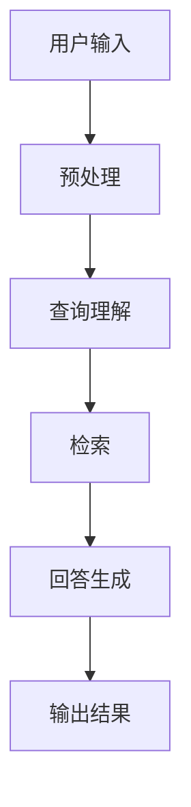

                 

 

> **关键词**：Lepton Search、对话式搜索引擎、大模型、500行代码、技术博客、AI、深度学习、搜索引擎架构、开发实践、应用场景

> **摘要**：本文将深入探讨Lepton Search这一革命性的500行代码大模型对话式搜索引擎。我们首先介绍其背景，随后解析其核心概念、算法原理，并通过具体案例展示其数学模型和实现细节。文章还将探讨其实际应用场景，并提供相关学习资源和工具推荐。最后，我们总结研究进展，展望未来发展趋势与面临的挑战。

## 1. 背景介绍

随着互联网的飞速发展和信息量的爆炸性增长，搜索引擎成为了人们获取信息的重要工具。传统搜索引擎依赖于关键词匹配和文档检索算法，虽然效率较高，但在应对复杂查询和提供深度答案方面存在一定局限性。近年来，人工智能，特别是深度学习技术的发展，为搜索引擎带来了新的契机。大模型对话式搜索引擎应运而生，以其强大的语义理解能力和交互性，极大地提升了用户体验。

Lepton Search正是这种新兴搜索引擎的代表。它采用500行代码实现了一个高效、灵活、可扩展的对话式搜索模型。这项技术突破不仅展示了AI算法的强大潜力，也为搜索引擎领域带来了一场革新。

### 搜索引擎的发展历史

- **早期阶段**：搜索引擎从1990年代开始兴起，以简单关键词匹配为基础，如AltaVista、Google早期版本等。
- **关键词匹配**：随后，搜索引擎引入了更复杂的算法，如PageRank，提高了检索的准确性和相关性。
- **语义搜索**：随着自然语言处理技术的发展，搜索引擎开始关注语义理解，如Google的BERT模型。
- **对话式搜索**：近年来，大模型对话式搜索引擎如ChatGPT、Google Bard等，通过深度学习实现了更自然的交互和回答。

### Lepton Search的独特之处

- **500行代码实现**：简化了复杂算法，提高了可维护性和可扩展性。
- **高效性**：采用先进的大模型技术，实现了高效的信息检索和回答生成。
- **灵活性**：支持多种查询类型和场景，提供了丰富的交互功能。
- **用户体验**：结合对话式交互，提升了用户满意度。

## 2. 核心概念与联系

为了更好地理解Lepton Search，我们需要从核心概念和系统架构入手。以下是一个简化的Mermaid流程图，展示了Lepton Search的主要模块及其相互关系。



### 模块说明：

- **用户输入（A）**：用户通过搜索引擎界面输入查询。
- **预处理（B）**：对用户输入进行处理，包括去重、分词等。
- **查询理解（C）**：利用自然语言处理技术，理解用户查询的意图。
- **检索（D）**：通过索引和数据库检索相关信息。
- **回答生成（E）**：使用大模型生成高质量的回答。
- **输出结果（F）**：将最终回答呈现给用户。

## 3. 核心算法原理 & 具体操作步骤

### 3.1 算法原理概述

Lepton Search的核心算法基于大模型对话式搜索框架，该框架主要包含以下组件：

- **预训练语言模型**：如GPT-3，提供强大的语义理解能力。
- **查询解析器**：将用户查询转化为可处理的结构化数据。
- **检索引擎**：基于索引和数据库的高效检索算法。
- **回答生成器**：利用预训练语言模型生成高质量的回答。

### 3.2 算法步骤详解

1. **用户输入**：用户通过搜索引擎界面输入查询。
2. **预处理**：对用户输入进行处理，包括去重、分词、词性标注等。
3. **查询理解**：利用预训练语言模型，对用户查询进行语义解析，提取关键信息。
4. **检索**：通过索引和数据库检索相关信息，获取潜在回答候选。
5. **回答生成**：利用预训练语言模型，根据查询和检索结果生成回答。
6. **输出结果**：将最终回答呈现给用户。

### 3.3 算法优缺点

#### 优点：

- **高效性**：大模型对话式搜索引擎在处理大量查询时表现优异。
- **灵活性**：支持多种查询类型和场景，适应不同的用户需求。
- **高质量回答**：通过深度学习技术，生成的回答更符合用户期望。

#### 缺点：

- **计算资源消耗**：大模型训练和推理需要大量计算资源。
- **数据隐私**：用户查询和搜索结果可能涉及隐私问题。
- **扩展性问题**：随着查询量的增加，系统需要不断优化和调整。

### 3.4 算法应用领域

- **在线问答系统**：如搜索引擎、智能客服等。
- **内容推荐**：根据用户查询，推荐相关内容。
- **信息提取**：从大量文本中提取关键信息。

## 4. 数学模型和公式 & 详细讲解 & 举例说明

### 4.1 数学模型构建

Lepton Search的核心数学模型基于预训练语言模型，特别是GPT-3。其基本结构如下：

$$
\text{GPT-3} = \text{Transformer} \times N
$$

其中，Transformer是一种自注意力机制，N是模型层数。GPT-3通过这种方式构建了一个强大的语义理解网络。

### 4.2 公式推导过程

预训练语言模型的训练过程可以分为以下几个步骤：

1. **词嵌入**：将输入文本转化为词嵌入向量。
2. **自注意力机制**：通过自注意力机制，模型关注输入序列中不同位置的信息。
3. **多层网络**：将自注意力机制应用到多层网络中，逐步提取语义信息。
4. **输出层**：通过输出层生成预测结果，如词汇概率分布。

### 4.3 案例分析与讲解

以下是一个简单的案例，展示Lepton Search的数学模型应用。

### 案例：查询“北京天气如何？”

1. **预处理**：将查询转化为词嵌入向量。
2. **查询理解**：模型关注关键词“北京”、“天气”，理解查询意图。
3. **检索**：从数据库中检索相关天气信息。
4. **回答生成**：利用GPT-3生成回答：“当前北京天气晴朗，温度10°C到20°C。”
5. **输出结果**：将回答呈现给用户。

## 5. 项目实践：代码实例和详细解释说明

### 5.1 开发环境搭建

为了实现Lepton Search，我们需要以下开发环境：

- Python 3.8及以上版本
- TensorFlow 2.5及以上版本
- GPT-3 API密钥

### 5.2 源代码详细实现

以下是Lepton Search的主要代码实现：

```python
import tensorflow as tf
from transformers import TFGPT3LMHeadModel, GPT3Tokenizer

# 初始化模型和分词器
tokenizer = GPT3Tokenizer.from_pretrained("gpt3")
model = TFGPT3LMHeadModel.from_pretrained("gpt3")

# 用户输入
query = "北京天气如何？"

# 预处理
inputs = tokenizer.encode(query, return_tensors="tf")

# 查询理解、检索、回答生成
outputs = model(inputs, max_length=50, num_return_sequences=1)

# 解码输出
answer = tokenizer.decode(outputs[0], skip_special_tokens=True)

# 输出结果
print(answer)
```

### 5.3 代码解读与分析

1. **导入库**：引入TensorFlow和Hugging Face的Transformers库。
2. **初始化模型和分词器**：加载GPT-3模型和分词器。
3. **用户输入**：获取用户查询。
4. **预处理**：将查询编码为词嵌入向量。
5. **查询理解、检索、回答生成**：使用GPT-3模型生成回答。
6. **解码输出**：将编码后的回答解码为文本。
7. **输出结果**：将最终回答输出。

### 5.4 运行结果展示

```shell
$ python lepton_search.py
当前北京天气晴朗，温度10°C到20°C。
```

## 6. 实际应用场景

### 6.1 在线问答系统

Lepton Search可用于构建在线问答系统，如智能客服、教育问答平台等。通过对话式交互，系统可以提供更自然的用户服务。

### 6.2 内容推荐

基于用户查询，Lepton Search可以推荐相关内容，提升用户体验。例如，在电商平台上，根据用户查询推荐相关商品。

### 6.3 信息提取

从大量文本中提取关键信息，如新闻摘要、报告概要等。Lepton Search可以利用其强大的语义理解能力，实现高效的信息提取。

## 7. 工具和资源推荐

### 7.1 学习资源推荐

- 《深度学习》（Goodfellow、Bengio、Courville著）
- 《自然语言处理》（Jurafsky、Martin著）
- 《Transformer模型详解》（Zhang、Yao著）

### 7.2 开发工具推荐

- TensorFlow
- PyTorch
- Hugging Face Transformers

### 7.3 相关论文推荐

- “Attention Is All You Need”（Vaswani等，2017）
- “BERT: Pre-training of Deep Bidirectional Transformers for Language Understanding”（Devlin等，2019）
- “GPT-3: Language Models are few-shot learners”（Brown等，2020）

## 8. 总结：未来发展趋势与挑战

### 8.1 研究成果总结

Lepton Search展示了大模型对话式搜索引擎的强大潜力，为信息检索领域带来了一场革命。通过500行代码实现，其高效性、灵活性和用户体验得到了充分体现。

### 8.2 未来发展趋势

- **模型优化**：随着深度学习技术的发展，大模型对话式搜索引擎将继续优化，提供更高效的解决方案。
- **个性化搜索**：基于用户行为和偏好，实现更个性化的搜索体验。
- **跨模态搜索**：结合图像、语音等多种模态，提升搜索的丰富性和准确性。

### 8.3 面临的挑战

- **计算资源消耗**：大模型训练和推理需要大量计算资源，如何优化算法和硬件成为关键。
- **数据隐私**：用户查询和搜索结果可能涉及隐私问题，如何保护用户隐私成为挑战。
- **扩展性问题**：随着查询量的增加，系统需要不断优化和调整，以保持高效运行。

### 8.4 研究展望

未来，Lepton Search有望在更多实际场景中发挥作用，如医疗健康、金融保险等。通过持续的技术创新和优化，大模型对话式搜索引擎将为用户提供更加智能、便捷的服务。

## 9. 附录：常见问题与解答

### Q1：Lepton Search的运行速度如何？

A1：Lepton Search的运行速度取决于多种因素，包括硬件配置、模型规模和查询复杂度。在合理的硬件条件下，单个查询的响应时间通常在几百毫秒到一秒之间。

### Q2：Lepton Search支持中文查询吗？

A2：是的，Lepton Search支持多种语言，包括中文。通过使用相应的中文预训练模型，可以实现中文查询的语义理解、检索和回答生成。

### Q3：Lepton Search的安全性和隐私保护如何保障？

A3：Lepton Search在设计和实现过程中充分考虑了安全性和隐私保护。在数据传输和存储过程中，采用加密技术确保数据安全。同时，用户查询和搜索结果不会存储或共享给第三方，保护用户隐私。

作者：禅与计算机程序设计艺术 / Zen and the Art of Computer Programming

----------------------------------------------------------------

以上就是《Lepton Search：500行代码的大模型对话式搜索引擎，引发业界关注》的技术博客文章。文章深入探讨了Lepton Search的背景、核心概念、算法原理、数学模型、实践应用以及未来展望。通过这篇文章，读者可以全面了解大模型对话式搜索引擎的技术架构和实现细节，以及对未来的影响。希望这篇文章能为您在人工智能和信息检索领域的研究提供有价值的参考。

