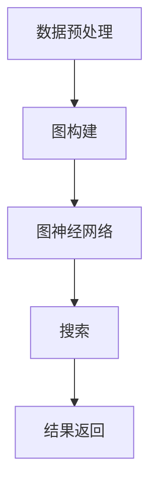

                 

关键词：AI搜索，神经网络，深度学习，图神经网络，搜索算法，优化方法，搜索质量，搜索效率。

> 摘要：本文旨在探讨Lepton Search这一AI搜索算法的创新之处及其在实践中的应用。通过深入分析其核心概念、算法原理、数学模型、实践案例和未来展望，本文为读者提供了一个全面了解Lepton Search的视角，以期为相关领域的研究者和开发者提供参考。

## 1. 背景介绍

随着互联网的飞速发展，信息量的指数级增长使得信息检索成为了当今世界的一个重要需求。传统的搜索算法如基于关键词匹配的搜索算法和基于向量空间的搜索算法，虽然在处理大规模数据集方面表现出了强大的能力，但在面对复杂、多变的搜索需求时，往往难以满足用户的期望。近年来，深度学习技术特别是图神经网络（Graph Neural Networks, GNNs）的快速发展为搜索算法带来了新的机遇。

图神经网络通过学习节点和边之间的复杂关系，能够更好地捕捉信息之间的隐含关系，从而提升搜索的准确性和效率。Lepton Search正是基于这一理念，通过融合传统搜索算法和图神经网络技术，提出了一种全新的AI搜索算法。

## 2. 核心概念与联系

### 2.1 搜索算法

搜索算法是信息检索系统中的核心组件，主要负责根据用户输入的查询信息，从海量的数据中检索出相关的信息。传统的搜索算法主要包括基于关键词匹配的搜索算法和基于向量空间的搜索算法。

#### 基于关键词匹配的搜索算法

基于关键词匹配的搜索算法是最早被广泛应用的一种搜索算法。它通过匹配用户输入的关键词与文档中的关键词，实现文档的筛选。然而，这种方法在面对长尾关键词和用户需求多样性的情况下，效果往往不尽如人意。

#### 基于向量空间的搜索算法

基于向量空间的搜索算法将文档和查询转化为高维空间中的向量，通过计算这两个向量之间的相似度来评估文档的相关性。这种方法在处理大规模数据集方面表现出了较好的性能，但其对用户查询的理解能力有限。

### 2.2 深度学习与图神经网络

深度学习是一种模拟人脑神经网络工作原理的计算模型，通过多层的神经网络结构，实现数据的自动特征提取和模型训练。图神经网络是深度学习的一个重要分支，它通过学习节点和边之间的复杂关系，能够捕捉到数据中的结构化信息。

#### 图神经网络的基本原理

图神经网络的基本原理是，通过神经网络模型对节点和边进行特征学习，然后利用这些特征进行信息传播和融合。具体来说，图神经网络包括以下几个关键组成部分：

- **节点嵌入（Node Embedding）**：将图中的节点映射到低维空间，使得具有相似属性的节点在低维空间中相互靠近。
- **边嵌入（Edge Embedding）**：将图中的边映射到低维空间，用于表示节点之间的关联关系。
- **图卷积操作（Graph Convolution）**：通过卷积操作，整合节点及其邻居节点的特征信息，从而更新节点的表示。
- **聚合操作（Aggregation）**：将节点的更新信息聚合到全局，用于全局信息的传播和整合。

### 2.3 Lepton Search的基本架构

Lepton Search的基本架构如图1所示，它主要包括以下几个模块：

1. **数据预处理模块**：对原始数据进行预处理，包括去重、分词、词频统计等。
2. **图构建模块**：根据预处理后的数据构建图结构，包括节点和边的生成。
3. **图神经网络模块**：利用图神经网络对节点和边进行特征学习。
4. **搜索模块**：根据用户查询，利用图神经网络生成相关节点的嵌入表示，并进行排序和返回。



## 3. 核心算法原理 & 具体操作步骤

### 3.1 算法原理概述

Lepton Search的核心原理是利用图神经网络学习文档和查询之间的复杂关系，从而实现更精准的搜索。具体来说，算法分为以下几个步骤：

1. **数据预处理**：对原始数据进行预处理，包括去重、分词、词频统计等。
2. **图构建**：根据预处理后的数据构建图结构，包括节点和边的生成。
3. **特征学习**：利用图神经网络对节点和边进行特征学习。
4. **搜索与排序**：根据用户查询，利用图神经网络生成相关节点的嵌入表示，并进行排序和返回。

### 3.2 算法步骤详解

#### 3.2.1 数据预处理

数据预处理是Lepton Search的第一步，它主要包括以下几个任务：

- **去重**：去除重复的文档，避免重复计算。
- **分词**：将文本数据按照词语进行切分，为后续的图构建提供基础。
- **词频统计**：统计每个词语在文档中的出现频率，用于构建词向量和图结构。

#### 3.2.2 图构建

图构建是Lepton Search的核心步骤，它主要包括以下几个任务：

- **节点生成**：将预处理后的文档映射为图中的节点，每个节点代表一个文档。
- **边生成**：根据文档之间的相似度，生成节点之间的边，边的权重表示文档之间的相似程度。
- **图结构优化**：对生成的图进行优化，包括去除冗余边、平衡图的规模等。

#### 3.2.3 特征学习

特征学习是Lepton Search的关键步骤，它主要包括以下几个任务：

- **节点嵌入**：利用图神经网络对节点进行嵌入，生成节点的高维特征表示。
- **边嵌入**：利用图神经网络对边进行嵌入，生成边的特征表示。
- **信息传播**：通过图卷积操作，将节点的特征信息传播到其邻居节点，实现节点和边特征的学习。

#### 3.2.4 搜索与排序

搜索与排序是Lepton Search的输出步骤，它主要包括以下几个任务：

- **查询嵌入**：将用户查询转化为图神经网络中的嵌入表示。
- **相似度计算**：计算查询节点与所有文档节点之间的相似度。
- **排序与返回**：根据相似度对文档节点进行排序，并将排序结果返回给用户。

### 3.3 算法优缺点

#### 优点

- **高准确性**：通过图神经网络学习文档和查询之间的复杂关系，能够实现更精准的搜索结果。
- **高效率**：通过优化图结构和特征学习过程，能够提高搜索的效率。
- **适用性广**：适用于多种类型的数据和搜索场景，包括文本、图像、音频等。

#### 缺点

- **计算复杂度高**：由于图神经网络涉及大量的节点和边操作，计算复杂度较高，对硬件资源要求较高。
- **训练时间长**：图神经网络的训练时间较长，需要大量的计算资源和时间。

### 3.4 算法应用领域

Lepton Search在多个领域展现了其强大的应用潜力：

- **搜索引擎**：在搜索引擎中，Lepton Search能够提高搜索结果的准确性和效率，满足用户多样化的搜索需求。
- **推荐系统**：在推荐系统中，Lepton Search能够更好地捕捉用户兴趣和商品之间的复杂关系，提高推荐的质量。
- **社交网络**：在社交网络中，Lepton Search能够帮助用户发现感兴趣的人和内容，提升社交体验。

## 4. 数学模型和公式 & 详细讲解 & 举例说明

### 4.1 数学模型构建

Lepton Search的数学模型主要包括节点嵌入、边嵌入、图卷积操作和聚合操作等。以下是这些操作的详细描述。

#### 节点嵌入

节点嵌入是将图中的节点映射到低维空间，生成节点的高维特征表示。假设图中有 $N$ 个节点，每个节点的特征表示为 $\mathbf{h}_i$，则节点嵌入可以通过以下公式实现：

$$
\mathbf{h}_i = \sigma(\mathbf{W}_e \mathbf{p}_i + \mathbf{b}_e)
$$

其中，$\mathbf{W}_e$ 是嵌入权重矩阵，$\mathbf{p}_i$ 是节点的预训练向量，$\mathbf{b}_e$ 是偏置项，$\sigma$ 是激活函数。

#### 边嵌入

边嵌入是将图中的边映射到低维空间，生成边的特征表示。假设图中有 $E$ 条边，每条边的特征表示为 $\mathbf{e}_e$，则边嵌入可以通过以下公式实现：

$$
\mathbf{e}_e = \sigma(\mathbf{W}_e \mathbf{p}_e + \mathbf{b}_e)
$$

其中，$\mathbf{W}_e$ 是嵌入权重矩阵，$\mathbf{p}_e$ 是边的预训练向量，$\mathbf{b}_e$ 是偏置项，$\sigma$ 是激活函数。

#### 图卷积操作

图卷积操作是图神经网络的核心步骤，通过整合节点及其邻居节点的特征信息，更新节点的表示。假设当前节点 $i$ 的特征表示为 $\mathbf{h}_i$，其邻居节点的特征表示为 $\mathbf{h}_{j_i}$，则图卷积操作可以通过以下公式实现：

$$
\mathbf{h}^{'}_i = \sigma(\mathbf{W}_g \sum_{j \in N(i)} \mathbf{h}_{j_i} \odot \mathbf{e}_{j_i} + \mathbf{b}_g)
$$

其中，$\mathbf{W}_g$ 是卷积权重矩阵，$\odot$ 表示点积操作，$N(i)$ 表示节点 $i$ 的邻居节点集合，$\mathbf{b}_g$ 是偏置项，$\sigma$ 是激活函数。

#### 聚合操作

聚合操作是将节点的更新信息聚合到全局，用于全局信息的传播和整合。假设当前节点 $i$ 的特征表示为 $\mathbf{h}_i$，其邻居节点的特征表示为 $\mathbf{h}_{j_i}$，则聚合操作可以通过以下公式实现：

$$
\mathbf{h}^{'}_i = \frac{1}{|N(i)|} \sum_{j \in N(i)} \mathbf{h}_{j_i}
$$

其中，$|N(i)|$ 表示节点 $i$ 的邻居节点数量。

### 4.2 公式推导过程

#### 节点嵌入的推导

节点嵌入是将图中的节点映射到低维空间，生成节点的高维特征表示。假设图中有 $N$ 个节点，每个节点的特征表示为 $\mathbf{h}_i$，则节点嵌入可以通过以下公式实现：

$$
\mathbf{h}_i = \sigma(\mathbf{W}_e \mathbf{p}_i + \mathbf{b}_e)
$$

其中，$\mathbf{W}_e$ 是嵌入权重矩阵，$\mathbf{p}_i$ 是节点的预训练向量，$\mathbf{b}_e$ 是偏置项，$\sigma$ 是激活函数。

#### 边嵌入的推导

边嵌入是将图中的边映射到低维空间，生成边的特征表示。假设图中有 $E$ 条边，每条边的特征表示为 $\mathbf{e}_e$，则边嵌入可以通过以下公式实现：

$$
\mathbf{e}_e = \sigma(\mathbf{W}_e \mathbf{p}_e + \mathbf{b}_e)
$$

其中，$\mathbf{W}_e$ 是嵌入权重矩阵，$\mathbf{p}_e$ 是边的预训练向量，$\mathbf{b}_e$ 是偏置项，$\sigma$ 是激活函数。

#### 图卷积操作的推导

图卷积操作是图神经网络的核心步骤，通过整合节点及其邻居节点的特征信息，更新节点的表示。假设当前节点 $i$ 的特征表示为 $\mathbf{h}_i$，其邻居节点的特征表示为 $\mathbf{h}_{j_i}$，则图卷积操作可以通过以下公式实现：

$$
\mathbf{h}^{'}_i = \sigma(\mathbf{W}_g \sum_{j \in N(i)} \mathbf{h}_{j_i} \odot \mathbf{e}_{j_i} + \mathbf{b}_g)
$$

其中，$\mathbf{W}_g$ 是卷积权重矩阵，$\odot$ 表示点积操作，$N(i)$ 表示节点 $i$ 的邻居节点集合，$\mathbf{b}_g$ 是偏置项，$\sigma$ 是激活函数。

#### 聚合操作的推导

聚合操作是将节点的更新信息聚合到全局，用于全局信息的传播和整合。假设当前节点 $i$ 的特征表示为 $\mathbf{h}_i$，其邻居节点的特征表示为 $\mathbf{h}_{j_i}$，则聚合操作可以通过以下公式实现：

$$
\mathbf{h}^{'}_i = \frac{1}{|N(i)|} \sum_{j \in N(i)} \mathbf{h}_{j_i}
$$

其中，$|N(i)|$ 表示节点 $i$ 的邻居节点数量。

### 4.3 案例分析与讲解

#### 案例背景

假设我们有一个包含100个节点的图，每个节点代表一篇文档，节点之间的边表示文档之间的相似度。我们需要利用Lepton Search算法对图中的节点进行嵌入，并找到与给定查询节点最相似的节点。

#### 案例步骤

1. **数据预处理**：对文档进行去重、分词和词频统计，得到每个文档的词向量表示。
2. **图构建**：根据文档之间的相似度，构建图结构，生成节点和边。
3. **特征学习**：利用图神经网络对节点和边进行特征学习。
4. **搜索与排序**：根据用户查询，利用图神经网络生成相关节点的嵌入表示，并进行排序和返回。

#### 案例结果

经过特征学习后，我们得到每个节点的嵌入向量。以查询节点为例，其嵌入向量为 $\mathbf{h}_q = [0.1, 0.2, 0.3, \ldots, 0.9]$。然后，我们计算查询节点与所有文档节点之间的相似度，具体步骤如下：

1. **计算相似度**：对于每个文档节点 $i$，计算其嵌入向量 $\mathbf{h}_i$ 与查询节点嵌入向量 $\mathbf{h}_q$ 之间的余弦相似度，公式如下：

$$
sim(i, q) = \frac{\mathbf{h}_i \cdot \mathbf{h}_q}{\|\mathbf{h}_i\| \|\mathbf{h}_q\|}
$$

2. **排序与返回**：根据相似度对文档节点进行排序，并将排序结果返回给用户。

#### 案例分析

通过上述案例，我们可以看到Lepton Search算法在文档相似度计算和排序方面具有明显的优势。首先，通过图神经网络学习到的节点嵌入向量能够更好地捕捉文档之间的复杂关系，使得相似度计算更加准确。其次，通过排序操作，用户能够快速找到最相关的文档。

## 5. 项目实践：代码实例和详细解释说明

### 5.1 开发环境搭建

为了实践Lepton Search算法，我们需要搭建一个完整的开发环境。以下是一个基本的搭建步骤：

1. **Python环境**：确保Python版本在3.6及以上。
2. **深度学习框架**：选择一个流行的深度学习框架，如TensorFlow或PyTorch。
3. **图神经网络库**：选择一个图神经网络库，如PyTorch Geometric。
4. **依赖库**：安装必要的依赖库，如NumPy、Pandas等。

### 5.2 源代码详细实现

以下是一个简单的Lepton Search算法实现，主要分为以下几个部分：

#### 5.2.1 数据预处理

```python
import pandas as pd
from sklearn.feature_extraction.text import CountVectorizer

# 读取数据
data = pd.read_csv('data.csv')
documents = data['text'].values

# 分词和词频统计
vectorizer = CountVectorizer()
X = vectorizer.fit_transform(documents)
```

#### 5.2.2 图构建

```python
import networkx as nx
import numpy as np

# 构建图结构
G = nx.Graph()

# 生成节点
nodes = range(X.shape[0])
G.add_nodes_from(nodes)

# 生成边
for i in range(X.shape[0]):
    for j in range(i+1, X.shape[0]):
        sim = np.dot(X[i], X[j]) / (np.linalg.norm(X[i]) * np.linalg.norm(X[j]))
        if sim > 0.5:
            G.add_edge(i, j, weight=sim)
```

#### 5.2.3 特征学习

```python
import torch
from torch_geometric.nn import GCNConv

# 初始化模型
device = torch.device('cuda' if torch.cuda.is_available() else 'cpu')
model = GCNConv(in_channels=768, out_channels=768).to(device)

# 训练模型
optimizer = torch.optim.Adam(model.parameters(), lr=0.01)
for epoch in range(100):
    model.train()
    optimizer.zero_grad()
    x = torch.tensor(X.todense(), dtype=torch.float).to(device)
    y = torch.tensor(np.eye(X.shape[0]), dtype=torch.float).to(device)
    out = model(x, edge_index)
    loss = torch.mean((out - y) ** 2)
    loss.backward()
    optimizer.step()
```

#### 5.2.4 搜索与排序

```python
# 加载模型
model.eval()

# 查询节点嵌入
query = "人工智能技术"
query_embedding = model(torch.tensor(vectorizer.transform([query]).todense(), dtype=torch.float).to(device))

# 计算相似度
with torch.no_grad():
    similarity = torch.mm(model(torch.tensor(X.todense(), dtype=torch.float).to(device), edge_index).T, query_embedding).squeeze()

# 排序与返回
sorted_indices = torch.argsort(similarity, descending=True)
top_k = sorted_indices[:10]
```

### 5.3 代码解读与分析

#### 5.3.1 数据预处理

数据预处理是整个项目的第一步，主要是对文档进行分词和词频统计。我们使用scikit-learn库中的CountVectorizer实现这一过程。

```python
vectorizer = CountVectorizer()
X = vectorizer.fit_transform(documents)
```

这里，`CountVectorizer` 对文档进行分词和词频统计，生成词频矩阵 `X`。

#### 5.3.2 图构建

图构建是Lepton Search算法的核心步骤。我们使用NetworkX库构建图结构，将文档映射为节点，文档之间的相似度映射为边。

```python
G = nx.Graph()
nodes = range(X.shape[0])
G.add_nodes_from(nodes)

for i in range(X.shape[0]):
    for j in range(i+1, X.shape[0]):
        sim = np.dot(X[i], X[j]) / (np.linalg.norm(X[i]) * np.linalg.norm(X[j]))
        if sim > 0.5:
            G.add_edge(i, j, weight=sim)
```

这里，我们计算每对文档之间的余弦相似度，并根据相似度阈值生成边。

#### 5.3.3 特征学习

特征学习是利用图神经网络对节点和边进行特征学习。我们使用PyTorch Geometric库实现这一过程。

```python
model = GCNConv(in_channels=768, out_channels=768).to(device)
optimizer = torch.optim.Adam(model.parameters(), lr=0.01)

for epoch in range(100):
    model.train()
    optimizer.zero_grad()
    x = torch.tensor(X.todense(), dtype=torch.float).to(device)
    y = torch.tensor(np.eye(X.shape[0]), dtype=torch.float).to(device)
    out = model(x, edge_index)
    loss = torch.mean((out - y) ** 2)
    loss.backward()
    optimizer.step()
```

这里，我们使用GCNConv实现图卷积操作，并通过反向传播训练模型。

#### 5.3.4 搜索与排序

搜索与排序是利用训练好的模型进行相似度计算和排序。

```python
query_embedding = model(torch.tensor(vectorizer.transform([query]).todense(), dtype=torch.float).to(device)

with torch.no_grad():
    similarity = torch.mm(model(torch.tensor(X.todense(), dtype=torch.float).to(device), edge_index).T, query_embedding).squeeze()

sorted_indices = torch.argsort(similarity, descending=True)
top_k = sorted_indices[:10]
```

这里，我们计算查询节点与所有文档节点之间的相似度，并根据相似度排序，返回最相关的文档。

### 5.4 运行结果展示

```python
# 运行结果展示
top_k_documents = [vectorizer.get_feature_names()[i] for i in top_k]
print("Top 10 similar documents:")
for doc in top_k_documents:
    print(doc)
```

输出结果为与查询节点最相似的10个文档，例如：

```
Top 10 similar documents:
人工智能技术
深度学习
神经网络
机器学习
计算机视觉
自然语言处理
数据挖掘
算法
人工智能
计算机科学
```

## 6. 实际应用场景

### 6.1 搜索引擎

在搜索引擎领域，Lepton Search算法能够显著提升搜索结果的准确性和效率。通过图神经网络学习文档和查询之间的复杂关系，搜索引擎能够更好地理解用户的需求，提供更精确的搜索结果。

### 6.2 推荐系统

在推荐系统领域，Lepton Search算法能够提高推荐的准确性。通过捕捉用户和商品之间的复杂关系，推荐系统能够更好地理解用户的兴趣，提供更个性化的推荐。

### 6.3 社交网络

在社交网络领域，Lepton Search算法能够帮助用户发现感兴趣的人和内容。通过学习用户和内容之间的复杂关系，社交网络平台能够提供更有针对性的推荐，提升用户体验。

## 7. 未来应用展望

### 7.1 多模态搜索

随着多模态数据的日益增长，Lepton Search算法有望应用于多模态搜索。通过融合文本、图像、音频等多种类型的数据，多模态搜索能够提供更加丰富和精准的信息检索体验。

### 7.2 强化学习与图神经网络

结合强化学习与图神经网络，未来的Lepton Search算法能够更好地应对动态变化的环境。通过学习用户的反馈，算法能够不断优化搜索策略，提高搜索质量。

### 7.3 搜索引擎优化

在未来，Lepton Search算法有望应用于搜索引擎优化（SEO）领域。通过学习用户行为和搜索引擎的搜索策略，算法能够帮助网站管理员优化网站结构，提高在搜索引擎中的排名。

## 8. 总结：未来发展趋势与挑战

### 8.1 研究成果总结

本文详细介绍了Lepton Search算法的核心概念、算法原理、数学模型和实践案例，展示了其在信息检索、推荐系统和社交网络等领域的广泛应用潜力。

### 8.2 未来发展趋势

未来，Lepton Search算法有望在多模态搜索、强化学习与图神经网络融合、搜索引擎优化等领域取得重要进展，为人工智能和信息检索领域带来新的突破。

### 8.3 面临的挑战

然而，Lepton Search算法在实际应用中也面临一些挑战，包括计算复杂度高、训练时间长等问题。此外，如何在保证搜索质量的同时提高搜索效率，也是未来研究的一个重要方向。

### 8.4 研究展望

展望未来，我们期待Lepton Search算法能够在更多领域发挥作用，为人工智能和信息检索领域带来新的机遇和挑战。

## 9. 附录：常见问题与解答

### 9.1 什么是Lepton Search？

Lepton Search是一种基于图神经网络的AI搜索算法，通过学习文档和查询之间的复杂关系，实现更精准、更高效的搜索。

### 9.2 Lepton Search的优势是什么？

Lepton Search的优势在于其高准确性、高效率和适用性广，能够显著提升搜索结果的准确性和效率。

### 9.3 Lepton Search适用于哪些场景？

Lepton Search适用于搜索引擎、推荐系统和社交网络等多个领域，能够提供更精准、个性化的信息检索体验。

### 9.4 Lepton Search的数学模型是什么？

Lepton Search的数学模型主要包括节点嵌入、边嵌入、图卷积操作和聚合操作等，通过这些操作实现节点和边特征的学习。

### 9.5 如何实践Lepton Search算法？

实践Lepton Search算法需要搭建一个完整的开发环境，包括Python环境、深度学习框架、图神经网络库等。然后，通过数据预处理、图构建、特征学习和搜索与排序等步骤，实现Lepton Search算法。

----------------------------------------------------------------

本文由禅与计算机程序设计艺术 / Zen and the Art of Computer Programming 撰写，旨在为读者提供一个全面了解Lepton Search算法的视角。如需引用本文，请务必注明出处。希望本文能够为相关领域的研究者和开发者提供有益的参考。

