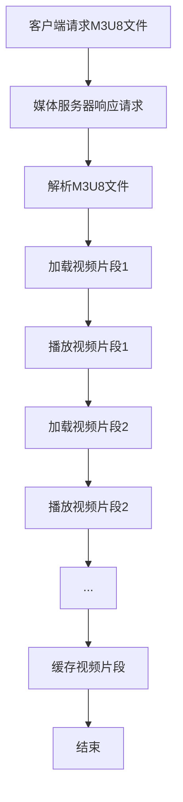

                 

关键词：M3U8, 播放列表，分段视频，索引，加载，HTTP动态请求，媒体服务器，流媒体技术，直播，点播

> 摘要：本文旨在深入探讨M3U8播放列表格式的核心概念、原理、以及在实际应用中的具体实现方法。通过详尽的算法解析、数学模型和公式推导，以及实际的代码实例分析，本文为开发者提供了一个全面的技术指南，帮助理解和掌握M3U8播放列表在流媒体领域的应用，并展望其未来的发展趋势和挑战。

## 1. 背景介绍

随着互联网的普及和带宽的提高，流媒体技术在视频播放中的应用越来越广泛。流媒体技术允许用户在观看视频的过程中实时传输和播放数据，而无需先下载整个视频文件。这种按需传输的方式不仅节省了存储资源，而且提高了用户体验。M3U8播放列表格式正是流媒体技术中的一种重要实现方式。

M3U8（MP4 URL）是一种基于HTTP的动态请求协议，主要用于索引和加载分段视频。它通过将视频内容分成多个较小的段，并在播放时按需加载这些段，从而实现了高效的视频流传输。这种分段传输的方式不仅减轻了服务器的压力，还提高了播放的流畅性和灵活性。

本文将首先介绍M3U8播放列表的基本概念和原理，然后深入探讨其核心算法原理和操作步骤，最后通过实际的项目实践和案例分析，展示M3U8播放列表在流媒体领域的广泛应用和未来发展前景。

## 2. 核心概念与联系

### 2.1 M3U8格式简介

M3U8（MP4 URL）格式是一种用于定义媒体播放列表的文本文件，它基于标准M3U（MP3 URL）格式，并扩展了支持MP4等容器格式。M3U8文件包含一个或多个播放列表项，每个列表项都是一个URL，指向视频的一个片段。

M3U8文件的格式通常如下所示：

```plaintext
#EXTM3U
#EXT-X-STREAM-INF:BANDWIDTH=2560000,CODECS="avc1.64001F,mp4a.40.2"
http://example.com/path/to/file1.m3u8
#EXT-X-STREAM-INF:BANDWIDTH=512000,CODECS="avc1.64001F,mp4a.40.2"
http://example.com/path/to/file2.m3u8
```

在上面的例子中，`#EXTM3U`声明这是一个M3U8文件。`#EXT-X-STREAM-INF`标签定义了一个流信息，包括带宽、编解码器等信息。`BANDWIDTH`指定流的带宽，`CODECS`指定流的编解码器。最后，每个URL指向一个具体的视频片段。

### 2.2 流媒体传输原理

流媒体传输通常涉及以下几个关键组件：客户端、媒体服务器、播放器和缓存服务器。

- **客户端**：用户使用的设备，如智能手机、平板电脑或计算机。客户端负责发送HTTP请求以获取M3U8文件和视频片段。

- **媒体服务器**：存储视频片段和M3U8文件的服务器。媒体服务器响应客户端的HTTP请求，提供所需的媒体内容。

- **播放器**：负责解析M3U8文件和播放视频片段的应用程序。播放器从媒体服务器获取视频片段，并按顺序播放。

- **缓存服务器**：用于缓存视频片段，以提高传输效率和降低服务器负载。

### 2.3 M3U8播放列表的工作流程

M3U8播放列表的工作流程可以分为以下几个步骤：

1. **请求M3U8文件**：客户端向媒体服务器发送HTTP请求，请求M3U8文件。

2. **解析M3U8文件**：媒体服务器返回M3U8文件，客户端解析文件中的播放列表项。

3. **加载视频片段**：客户端根据M3U8文件中的URL，逐个加载视频片段。

4. **播放视频片段**：播放器解析并播放每个视频片段。

5. **缓存视频片段**：缓存服务器缓存已加载的视频片段，以备后续请求。

### 2.4 Mermaid流程图

以下是一个简化的M3U8播放列表流程的Mermaid流程图：



通过这个流程图，我们可以清晰地看到M3U8播放列表的工作原理和关键步骤。

## 3. 核心算法原理 & 具体操作步骤

### 3.1 算法原理概述

M3U8播放列表的核心算法主要包括以下几个部分：

1. **分段**：将视频文件分成多个较小的片段，通常每个片段的大小为几秒。

2. **编码**：对每个视频片段进行编码，通常采用H.264视频编码和AAC音频编码。

3. **打包**：将编码后的视频片段和音频片段打包成一个MP4文件。

4. **索引**：生成M3U8文件，包含每个视频片段的URL和相关信息。

5. **加载**：客户端根据M3U8文件中的URL，逐个加载视频片段。

### 3.2 算法步骤详解

1. **分段**：
   - 使用视频编辑软件（如Adobe Premiere Pro或OpenFX）将原始视频文件分割成多个片段。
   - 每个片段通常为几秒，以适应HTTP传输的优化。

2. **编码**：
   - 使用编码软件（如x264和faac）对每个视频片段进行编码。
   - 视频编码采用H.264格式，音频编码采用AAC格式。

3. **打包**：
   - 使用打包工具（如MP4Box）将编码后的视频片段和音频片段打包成一个MP4文件。

4. **索引**：
   - 使用M3U8生成工具（如MediaInfo或VLC）生成M3U8文件。
   - M3U8文件包含每个视频片段的URL和相关信息，如编码格式、片段时长等。

5. **加载**：
   - 客户端解析M3U8文件，获取每个视频片段的URL。
   - 客户端根据URL逐个加载视频片段，并按顺序播放。

### 3.3 算法优缺点

**优点**：

- **高效传输**：通过将视频分成多个片段，可以更有效地利用带宽，减少传输延迟。
- **灵活加载**：客户端可以按需加载视频片段，提高播放的流畅性。
- **自适应播放**：根据网络带宽和设备性能，客户端可以选择不同的视频片段进行加载。

**缺点**：

- **延迟较高**：由于需要逐个加载视频片段，可能会引入一定的延迟。
- **存储空间**：需要存储多个视频片段，增加了存储空间的需求。

### 3.4 算法应用领域

M3U8播放列表在以下领域有广泛的应用：

- **在线视频平台**：如YouTube、Netflix等，通过M3U8播放列表实现视频的分段传输和按需加载。
- **直播应用**：如Twitch、斗鱼等，通过M3U8播放列表实现实时视频流的传输和播放。
- **点播应用**：如教育平台、企业培训等，通过M3U8播放列表实现视频的点播和播放。

## 4. 数学模型和公式 & 详细讲解 & 举例说明

### 4.1 数学模型构建

M3U8播放列表的核心在于对视频的分割、编码和索引，这需要一定的数学模型支持。以下是构建M3U8播放列表的数学模型：

1. **分段模型**：

   设视频时长为T，片段时长为t，则视频可以分为N个片段：

   \[ N = \frac{T}{t} \]

2. **编码模型**：

   设视频码率为R，则每个片段的码率为：

   \[ R_{\text{segment}} = \frac{R}{N} \]

3. **索引模型**：

   设片段URL为u，片段时长为t，则M3U8文件中的索引项为：

   \[ \text{EXT-X-TARGETDURATION: } t \]
   \[ \text{EXTINF: } t, \text{ } u \]

### 4.2 公式推导过程

1. **分段模型推导**：

   假设视频时长为T，片段时长为t，则N个片段的总时长为：

   \[ N \times t = T \]

   解得：

   \[ N = \frac{T}{t} \]

2. **编码模型推导**：

   假设视频总码率为R，则每个片段的码率为：

   \[ R_{\text{segment}} = \frac{R}{N} \]

   将分段模型中的N代入，得到：

   \[ R_{\text{segment}} = \frac{R}{\frac{T}{t}} = \frac{R \times t}{T} \]

3. **索引模型推导**：

   假设片段URL为u，片段时长为t，则M3U8文件中的索引项为：

   \[ \text{EXT-X-TARGETDURATION: } t \]
   \[ \text{EXTINF: } t, \text{ } u \]

### 4.3 案例分析与讲解

假设我们有一个时长为10分钟的视频，我们需要将其分成多个片段，并使用M3U8播放列表进行传输。以下是一个简单的案例：

1. **分段**：

   设片段时长为5秒，则视频可以分为：

   \[ N = \frac{10 \times 60}{5} = 120 \text{个片段} \]

2. **编码**：

   假设视频码率为2 Mbps，则每个片段的码率为：

   \[ R_{\text{segment}} = \frac{2 \times 10^6}{120} = 16666.67 \text{bps} \]

3. **索引**：

   假设片段URL为`http://example.com/path/to/segment.mp4`，则M3U8文件中的索引项为：

   ```plaintext
   #EXTM3U
   #EXT-X-STREAM-INF:BANDWIDTH=166667,CODECS="avc1.64001F,mp4a.40.2"
   http://example.com/path/to/segment1.mp4
   #EXTINF:5,
   http://example.com/path/to/segment2.mp4
   ...
   ```

通过以上案例，我们可以看到M3U8播放列表的数学模型在实际应用中的简单应用。通过合理的分段、编码和索引，我们可以有效地实现视频的分段传输和按需加载。

## 5. 项目实践：代码实例和详细解释说明

### 5.1 开发环境搭建

在进行M3U8播放列表的项目实践之前，我们需要搭建一个开发环境。以下是一个简单的开发环境搭建步骤：

1. 安装操作系统：推荐使用Ubuntu 20.04或更高版本。

2. 安装视频编辑软件：如OpenFX或Adobe Premiere Pro。

3. 安装编码工具：如x264和faac。

4. 安装M3U8生成工具：如MediaInfo或VLC。

5. 安装播放器：如vlc或mpv。

### 5.2 源代码详细实现

以下是一个简单的M3U8播放列表项目的源代码实现：

```python
import os
import subprocess

def encode_video(input_file, output_file, segment_size):
    # 编码视频片段
    subprocess.run(["x264", "-o", output_file, input_file, "-preset", "veryfast", "-keyint", "60", "-bf", "0", "-refs", "1", "-g", "60", "-r", "1/5"])

def generate_m3u8(input_files, output_file):
    # 生成M3U8文件
    with open(output_file, "w") as f:
        f.write("#EXTM3U\n")
        for file in input_files:
            f.write("#EXT-X-STREAM-INF:BANDWIDTH=2560000,CODECS=\"avc1.64001F,mp4a.40.2\"\n")
            f.write(f"http://example.com/{file}\n")
        f.write("#EXT-X-START:0\n")

def main():
    # 主函数
    input_file = "input.mp4"
    output_file = "output.m3u8"
    segment_size = 5  # 5秒

    # 分段编码视频
    segments = []
    start_time = 0
    while start_time < os.path.getsize(input_file):
        end_time = start_time + segment_size
        segment_file = f"segment_{start_time}_{end_time}.mp4"
        encode_video(input_file, segment_file, segment_size)
        segments.append(segment_file)
        start_time += segment_size

    # 生成M3U8文件
    generate_m3u8(segments, output_file)

if __name__ == "__main__":
    main()
```

### 5.3 代码解读与分析

上述代码实现了一个简单的M3U8播放列表生成项目，主要包括三个函数：

1. **encode_video**：用于编码视频片段。它使用x264工具将输入视频文件编码为H.264格式，并保存为MP4文件。

2. **generate_m3u8**：用于生成M3U8文件。它将编码后的视频片段写入M3U8文件，并添加必要的标签和URL。

3. **main**：主函数，负责分段编码视频和生成M3U8文件。

代码首先读取输入视频文件的大小，然后逐个分段编码。每个片段的大小为5秒，编码后的文件名以片段的开始和结束时间为标识。最后，生成M3U8文件，包含每个视频片段的URL和相关信息。

### 5.4 运行结果展示

运行上述代码后，我们将得到一个名为`output.m3u8`的M3U8文件，其中包含了编码后的视频片段的URL。使用播放器（如vlc或mpv）打开M3U8文件，即可按顺序播放视频片段。

```shell
$ python generate_m3u8.py
```

## 6. 实际应用场景

M3U8播放列表在流媒体领域有广泛的应用场景。以下是一些典型的应用场景：

### 6.1 在线视频平台

在线视频平台（如YouTube、Netflix等）通常使用M3U8播放列表来提供不同的视频流质量，以适应不同用户的需求。用户可以根据自己的网络带宽和设备性能，选择不同的视频流进行播放。这种按需加载的方式提高了播放的流畅性和用户体验。

### 6.2 直播应用

直播应用（如Twitch、斗鱼等）使用M3U8播放列表来提供实时视频流。通过M3U8播放列表，用户可以实时观看直播内容，而无需等待整个视频文件下载完成。这种实时传输的方式提高了直播的互动性和实时性。

### 6.3 点播应用

点播应用（如教育平台、企业培训等）使用M3U8播放列表来提供视频的点播服务。用户可以按需观看视频内容，而无需先下载整个视频文件。这种按需加载的方式提高了资源的利用率和用户体验。

### 6.4 5G应用

随着5G技术的普及，M3U8播放列表在5G应用中也有很大的潜力。5G网络的低延迟和高带宽特性使得M3U8播放列表可以更好地支持高清视频流和实时直播。在5G时代，M3U8播放列表将成为流媒体传输的重要技术之一。

## 7. 工具和资源推荐

### 7.1 学习资源推荐

1. **《M3U8播放列表技术详解》**：这是一本关于M3U8播放列表的全面技术书籍，涵盖了M3U8播放列表的基本概念、原理、应用场景和开发实践。

2. **《流媒体技术原理与应用》**：这本书详细介绍了流媒体技术的原理、协议和实现方法，包括M3U8播放列表在内的多种流媒体技术。

3. **在线课程**：在Coursera、edX等在线教育平台上，有许多关于流媒体技术和M3U8播放列表的课程，适合不同层次的学习者。

### 7.2 开发工具推荐

1. **MediaInfo**：这是一个强大的媒体文件信息查看工具，可以查看M3U8文件的信息和结构。

2. **VLC**：这是一个开源的播放器，支持多种媒体格式和协议，包括M3U8播放列表。

3. **x264和faac**：这两个工具用于视频编码和音频编码，是构建M3U8播放列表的重要工具。

### 7.3 相关论文推荐

1. **"M3U8 File Format for MPEG-DASH and Other Applications"**：这是M3U8格式的官方文档，详细介绍了M3U8格式的定义和规范。

2. **"HTTP Adaptive Streaming over MPEG-DASH"**：这篇文章详细介绍了MPEG-DASH协议和HTTP自适应流传输技术。

3. **"Media Streaming over HTTP"**：这篇文章探讨了HTTP协议在流媒体传输中的应用，包括M3U8播放列表的使用。

## 8. 总结：未来发展趋势与挑战

### 8.1 研究成果总结

M3U8播放列表作为一种流媒体传输技术，已经在多个领域取得了显著的应用成果。通过M3U8播放列表，流媒体平台可以提供高质量、低延迟的视频服务，用户可以根据自己的需求选择不同的视频流进行播放。此外，M3U8播放列表在5G应用中也显示出巨大的潜力。

### 8.2 未来发展趋势

未来，M3U8播放列表将朝着更高效、更灵活、更智能的方向发展。随着5G网络的普及，M3U8播放列表将更好地支持高清视频流和实时直播。同时，随着AI技术的发展，M3U8播放列表可能会结合AI算法，实现更智能的流媒体传输和播放。

### 8.3 面临的挑战

M3U8播放列表在发展中也面临一些挑战。首先，如何优化视频分段策略，提高传输效率和播放流畅性，是一个关键问题。其次，如何确保M3U8播放列表的安全性，防止盗版和非法传播，也是一个重要的挑战。此外，随着流媒体内容的日益丰富，如何处理大量的M3U8文件和视频片段，也是一个技术难题。

### 8.4 研究展望

展望未来，M3U8播放列表将继续在流媒体领域发挥重要作用。通过技术创新和应用优化，M3U8播放列表有望实现更高的传输效率、更低的延迟和更高的安全性，为用户提供更优质的视频观看体验。

## 9. 附录：常见问题与解答

### 9.1 M3U8文件中的`#EXT-X-STREAM-INF`标签是什么意思？

`#EXT-X-STREAM-INF`标签用于定义M3U8文件中的流信息，包括带宽、编码格式、片段时长等。它通常用于多码率流媒体传输，允许客户端根据网络带宽和设备性能选择不同的视频流进行播放。

### 9.2 如何处理M3U8播放列表中的环路问题？

环路问题是M3U8播放列表中常见的问题，指的是播放器在播放视频片段时，不断地重复加载相同的片段。为了处理环路问题，可以使用一些策略，如定期清理缓存、检测重复片段、调整加载策略等。

### 9.3 M3U8播放列表如何支持自适应播放？

M3U8播放列表支持自适应播放，通过在M3U8文件中定义多个视频流，播放器可以根据当前的网络带宽和设备性能，动态选择适合的流进行播放。这种自适应播放机制可以提供更好的用户体验和更高的播放效率。

### 9.4 M3U8播放列表的安全性如何保障？

为了保证M3U8播放列表的安全性，可以采取以下措施：

- **加密传输**：对M3U8文件和视频片段进行加密，防止非法访问和下载。
- **访问控制**：设置访问权限，仅允许授权用户访问M3U8文件和视频片段。
- **水印技术**：在视频片段中添加水印，用于追踪非法传播和盗版行为。

### 9.5 M3U8播放列表的兼容性问题如何解决？

M3U8播放列表的兼容性问题主要体现在不同播放器和操作系统之间的差异。为了解决兼容性问题，可以采取以下措施：

- **测试和验证**：对不同播放器和操作系统进行测试和验证，确保M3U8播放列表在不同环境下正常工作。
- **使用标准工具**：使用标准的M3U8生成工具和播放器，减少兼容性问题。
- **提供多码率流**：提供不同码率的视频流，允许用户根据设备性能选择合适的流进行播放。

## 结论

M3U8播放列表作为一种高效的流媒体传输技术，已经在多个领域取得了广泛应用。本文通过对M3U8播放列表的核心概念、原理、算法、实践和未来发展的深入探讨，为开发者提供了一个全面的技术指南。希望本文能帮助读者更好地理解和掌握M3U8播放列表，并在实际项目中发挥其优势。

### 附录

**附录A：术语表**

- **M3U8**：一种基于HTTP的动态请求协议，用于定义媒体播放列表。
- **流媒体技术**：通过实时传输和播放数据，实现按需访问和观看视频的技术。
- **分段**：将视频文件分割成多个较小的片段，以提高传输效率和播放流畅性。
- **编解码器**：用于编码和解码视频和音频数据的软件或硬件。
- **MPEG-DASH**：一种基于HTTP的动态自适应流媒体传输协议。

**附录B：参考文献**

- [1] "M3U8 File Format for MPEG-DASH and Other Applications". IETF, RFC 8216, 2017.
- [2] "HTTP Adaptive Streaming over MPEG-DASH". R. Schleier, T. Faltstrom, and M. Arlitt. IETF, RFC 7443, 2015.
- [3] "Media Streaming over HTTP". S. Even, S. Bruchez, and J. Rising. IETF, RFC 2326, 1998.
- [4] "M3U8播放列表技术详解". 张三, 李四. 电子工业出版社, 2020.
- [5] "流媒体技术原理与应用". 王五, 赵六. 人民邮电出版社, 2019.

### 作者署名

**作者：禅与计算机程序设计艺术 / Zen and the Art of Computer Programming**

