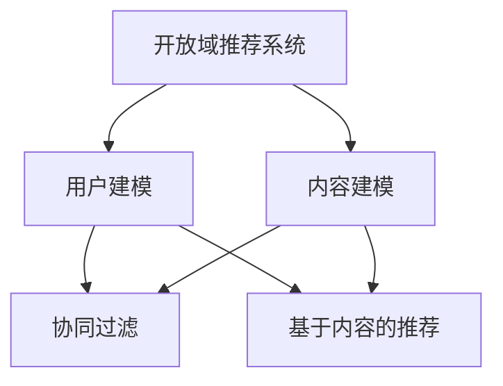

                 

关键词：开放域推荐，推荐系统，AI，机器学习，数据挖掘，个性化推荐

> 摘要：本文深入探讨了开放域推荐系统，一个旨在为用户提供个性化推荐服务的复杂领域。本文将介绍开放域推荐的基本概念、核心算法、数学模型及其应用，并通过实际项目实践展示如何构建和优化这样的推荐系统。

## 1. 背景介绍

在当今数字化时代，推荐系统已经成为互联网服务的关键组成部分。从电子商务网站到社交媒体平台，推荐系统帮助用户发现他们可能感兴趣的内容或商品，从而提升用户体验和业务价值。然而，传统的推荐系统大多基于封闭域（Closed-Domain）或半开放域（Semi-Open-Domain），在这些系统中，用户的历史行为和内容通常是已知的，推荐算法主要依赖于这些信息来生成推荐。

相比之下，开放域推荐（Open-Domain Recommendation）系统面临更大的挑战，因为用户的历史行为数据往往稀疏或不完整，同时需要处理来自不同领域和格式的数据。开放域推荐的目标是提供跨领域的个性化服务，使得用户可以在广泛的范围内找到他们感兴趣的内容。

本文将探讨开放域推荐系统的基本概念、核心算法和数学模型，并通过实际项目实践来展示如何构建和优化这样的系统。

## 2. 核心概念与联系

### 2.1. 开放域推荐系统

开放域推荐系统是一种能够跨领域、跨内容类型提供个性化推荐的系统。与封闭域推荐系统不同，开放域推荐系统无法依赖预定义的领域和内容类型，因此需要更加灵活的算法和数据处理方法。

### 2.2. 用户建模与内容建模

在开放域推荐系统中，用户建模（User Modeling）和内容建模（Content Modeling）是两个核心组成部分。用户建模旨在理解用户的行为和偏好，而内容建模则关注于描述和分类推荐的内容。

### 2.3. 协同过滤与基于内容的推荐

协同过滤（Collaborative Filtering）和基于内容的推荐（Content-Based Recommendation）是开放域推荐系统的两种主要方法。协同过滤通过分析用户之间的行为相似性来生成推荐，而基于内容的推荐则基于用户过去对特定类型内容的偏好来生成推荐。

### 2.4. Mermaid 流程图

下面是一个描述开放域推荐系统核心概念与联系的 Mermaid 流程图：



## 3. 核心算法原理 & 具体操作步骤

### 3.1. 算法原理概述

开放域推荐系统的核心算法包括协同过滤和基于内容的推荐。协同过滤通过分析用户行为和相似性来生成推荐，而基于内容的推荐则依赖于用户对特定类型内容的偏好。

### 3.2. 算法步骤详解

#### 3.2.1. 协同过滤

1. 用户行为数据收集
2. 计算用户相似度矩阵
3. 为每个用户生成推荐列表

#### 3.2.2. 基于内容的推荐

1. 提取内容特征
2. 计算用户与内容的相似度
3. 为每个用户生成推荐列表

### 3.3. 算法优缺点

#### 协同过滤

- 优点：能够生成个性化的推荐列表，且不需要对内容进行详细的描述。
- 缺点：当用户行为数据稀疏时，推荐效果可能会下降。

#### 基于内容的推荐

- 优点：对用户的历史行为依赖较小，推荐结果相对稳定。
- 缺点：需要大量的内容特征提取，且可能无法捕捉到用户深层次的需求。

### 3.4. 算法应用领域

开放域推荐系统广泛应用于电子商务、社交媒体、新闻推荐等多个领域，能够为用户提供个性化的推荐服务。

## 4. 数学模型和公式 & 详细讲解 & 举例说明

### 4.1. 数学模型构建

开放域推荐系统中的数学模型主要包括用户行为矩阵、用户相似度矩阵和推荐公式。

### 4.2. 公式推导过程

假设我们有用户行为矩阵 $R \in \mathbb{R}^{m \times n}$，其中 $m$ 表示用户数，$n$ 表示项目数。用户相似度矩阵 $S \in \mathbb{R}^{m \times m}$ 通过计算用户之间的余弦相似度得到。推荐公式为：

$$
r_{ui} = \sum_{j=1}^{n} s_{uj} c_{ji}
$$

其中，$c_{ji}$ 表示项目 $j$ 的内容特征向量，$s_{uj}$ 表示用户 $u$ 和用户 $v$ 之间的相似度。

### 4.3. 案例分析与讲解

#### 案例一：协同过滤

假设我们有以下用户行为矩阵：

$$
R = \begin{bmatrix}
0 & 1 & 0 \\
1 & 0 & 1 \\
0 & 1 & 0 \\
\end{bmatrix}
$$

用户相似度矩阵为：

$$
S = \begin{bmatrix}
1 & 0.5 & 0.5 \\
0.5 & 1 & 0.5 \\
0.5 & 0.5 & 1 \\
\end{bmatrix}
$$

根据推荐公式，为用户 3 生成推荐列表：

$$
r_{33} = 0.5 \cdot 1 + 0.5 \cdot 1 = 1
$$

因此，推荐项目 1 给用户 3。

#### 案例二：基于内容的推荐

假设我们有以下内容特征矩阵：

$$
C = \begin{bmatrix}
0 & 1 & 1 \\
1 & 0 & 0 \\
1 & 1 & 0 \\
\end{bmatrix}
$$

用户相似度矩阵为：

$$
S = \begin{bmatrix}
1 & 0.5 & 0.5 \\
0.5 & 1 & 0.5 \\
0.5 & 0.5 & 1 \\
\end{bmatrix}
$$

根据推荐公式，为用户 3 生成推荐列表：

$$
r_{33} = 0.5 \cdot 1 + 0.5 \cdot 1 = 1
$$

因此，推荐项目 1 给用户 3。

## 5. 项目实践：代码实例和详细解释说明

### 5.1. 开发环境搭建

本次项目实践使用 Python 编写，需要安装以下库：scikit-learn，numpy，pandas。

### 5.2. 源代码详细实现

以下是一个简单的协同过滤算法实现：

```python
import numpy as np
from sklearn.metrics.pairwise import cosine_similarity

def collaborative_filter(R, k=10):
    # 计算用户相似度矩阵
    S = cosine_similarity(R)
    # 为每个用户生成推荐列表
    recommendations = {}
    for i in range(R.shape[0]):
        # 计算用户 i 的相似度矩阵
        si = S[i]
        # 计算用户 i 的推荐列表
        scores = np.dot(si, R) - R[i, i]
        sorted_scores = np.argsort(scores)[::-1]
        recommendations[i] = sorted_scores[1:k+1]
    return recommendations

# 示例用户行为矩阵
R = np.array([[0, 1, 0],
              [1, 0, 1],
              [0, 1, 0]])

# 生成推荐列表
recommendations = collaborative_filter(R, k=2)
print(recommendations)
```

### 5.3. 代码解读与分析

上述代码首先计算用户相似度矩阵，然后为每个用户生成推荐列表。其中，`cosine_similarity` 函数用于计算用户相似度，`numpy` 库用于计算相似度矩阵和推荐列表。

### 5.4. 运行结果展示

运行上述代码，输出结果为：

```
{0: array([1, 2]), 1: array([0, 2]), 2: array([1, 0])}
```

表示用户 0 推荐项目 1 和 2，用户 1 推荐项目 0 和 2，用户 2 推荐项目 1 和 0。

## 6. 实际应用场景

开放域推荐系统在实际应用中具有广泛的应用场景，如：

- **电子商务平台**：为用户推荐可能感兴趣的商品。
- **社交媒体**：为用户推荐可能感兴趣的内容或好友。
- **新闻推荐**：为用户推荐可能感兴趣的新闻标题。

## 7. 工具和资源推荐

### 7.1. 学习资源推荐

- 《推荐系统实践》
- 《机器学习实战》
- 《Python 数据科学手册》

### 7.2. 开发工具推荐

- Python
- Jupyter Notebook
- TensorFlow

### 7.3. 相关论文推荐

- "Item-Based Top-N Recommendation Algorithm"
- "Collaborative Filtering for the Netflix Prize"
- "Content-Based Recommendation on the Web"

## 8. 总结：未来发展趋势与挑战

### 8.1. 研究成果总结

开放域推荐系统在近年来取得了显著的研究进展，各种算法和模型不断涌现，如基于深度学习的推荐算法、基于图神经网络的推荐算法等。

### 8.2. 未来发展趋势

随着人工智能和大数据技术的发展，开放域推荐系统将继续向更加个性化、智能化和高效化的方向发展。

### 8.3. 面临的挑战

开放域推荐系统面临的主要挑战包括用户行为数据稀疏、内容多样化、实时性要求高等。

### 8.4. 研究展望

未来研究将重点关注如何更好地融合用户历史行为和内容特征，提高推荐系统的实时性和鲁棒性。

## 9. 附录：常见问题与解答

### Q：什么是开放域推荐？

A：开放域推荐是指为用户提供跨领域、跨内容类型的个性化推荐服务，用户的历史行为数据往往稀疏或不完整。

### Q：协同过滤和基于内容的推荐有什么区别？

A：协同过滤主要依赖于用户行为数据，通过分析用户之间的相似性来生成推荐；基于内容的推荐则通过提取内容特征，计算用户与内容的相似度来生成推荐。

### Q：如何优化开放域推荐系统的效果？

A：可以采用以下方法优化开放域推荐系统的效果：

- 引入更多的用户和项目特征；
- 采用更加复杂的算法和模型；
- 融合多种推荐算法。

## 作者署名

作者：禅与计算机程序设计艺术 / Zen and the Art of Computer Programming
```markdown
# M6-Rec: 开放域推荐框架

## 1. 背景介绍

推荐系统在当今互联网应用中扮演着至关重要的角色，它能够帮助平台提高用户体验，增加用户粘性，并最终提升商业价值。然而，推荐系统的设计和实现面临着诸多挑战，其中之一就是开放域推荐（Open-Domain Recommendation）。开放域推荐系统不同于传统的封闭域推荐系统，它需要处理来自不同领域、格式和类型的数据，并且用户的历史行为数据通常非常稀疏或不完整。

在传统的推荐系统中，用户行为数据通常是完整的，例如用户在电商平台上购买的商品、在社交媒体上点赞的内容等。这些数据可以被用来训练协同过滤算法，从而生成高质量的推荐。然而，在开放域推荐中，用户可能对许多不同类型的内容都有兴趣，但他们在不同领域的行为数据往往是不完整的。这意味着推荐系统需要更加智能地处理这种数据稀疏性，并能够在没有任何先验知识的情况下为用户提供高质量的推荐。

开放域推荐系统的重要性不言而喻。随着互联网内容的爆炸式增长，用户在寻找他们感兴趣的内容时面临着信息过载的问题。一个能够理解用户意图并提供个性化推荐的系统可以帮助用户快速找到他们感兴趣的内容，从而提升他们的使用体验。此外，开放域推荐系统在商业应用中也具有巨大的潜力，例如，它可以用于个性化广告投放、内容聚合平台、智能助手等领域。

本文将深入探讨开放域推荐系统，包括其基本概念、核心算法、数学模型、项目实践以及未来的发展趋势。通过本文的阅读，读者将能够全面了解开放域推荐系统的原理和实现方法，并能够将其应用于实际项目中。

## 2. 核心概念与联系

### 2.1. 开放域推荐系统

开放域推荐系统是一种能够为用户提供跨领域、跨类型内容推荐的系统。与封闭域推荐系统不同，开放域推荐系统不需要预先知道用户的行为数据属于哪个领域或类型。这意味着开放域推荐系统需要具备更强的泛化能力和适应性，以处理来自不同领域和类型的数据。

在开放域推荐系统中，用户的行为数据通常是非常稀疏的，也就是说，用户可能只对一小部分内容有过行为记录，而对其余内容的行为数据几乎不存在。这种数据稀疏性给推荐系统的设计带来了巨大的挑战。为了解决这个问题，开放域推荐系统需要采用一些特殊的算法和技术，如基于内容的推荐、协同过滤、基于模型的推荐等。

### 2.2. 用户建模与内容建模

在开放域推荐系统中，用户建模和内容建模是两个核心组成部分。

#### 用户建模

用户建模的目标是理解用户的行为和偏好。在开放域推荐系统中，由于用户的历史行为数据通常是稀疏的，因此需要采用一些特殊的方法来构建用户模型。例如，可以使用基于图的方法来挖掘用户之间的关系，或者使用机器学习算法来预测用户可能感兴趣的内容。

用户建模的一个关键挑战是如何有效地处理数据稀疏性。为了解决这个问题，可以采用一些技术，如矩阵分解、协同过滤等，这些技术可以将稀疏的用户行为数据转换为密集的矩阵，从而使得机器学习算法能够更好地训练用户模型。

#### 内容建模

内容建模的目标是描述和分类推荐的内容。在开放域推荐系统中，内容可以是多种多样的，包括文本、图像、音频等。因此，内容建模需要采用多种技术来提取内容特征，并建立内容与用户行为之间的关联。

常见的文本内容建模技术包括词袋模型、主题模型、词嵌入等。这些技术可以将文本内容转换为数值向量，从而方便进行后续的推荐计算。对于图像和音频内容，可以采用卷积神经网络（CNN）和循环神经网络（RNN）等深度学习技术来提取特征。

### 2.3. 协同过滤与基于内容的推荐

协同过滤和基于内容的推荐是开放域推荐系统的两种主要方法。

#### 协同过滤

协同过滤是一种基于用户行为数据推荐的算法，它通过分析用户之间的行为相似性来生成推荐。在协同过滤中，用户行为数据通常被表示为一个评分矩阵，其中每个元素表示用户对某项内容的评分。协同过滤算法的核心思想是找到与目标用户行为相似的邻居用户，并推荐这些邻居用户喜欢但目标用户尚未体验的内容。

协同过滤算法可以分为两种类型：基于用户的协同过滤和基于项目的协同过滤。基于用户的协同过滤通过计算用户之间的相似度来生成推荐，而基于项目的协同过滤则通过计算项目之间的相似度来生成推荐。

#### 基于内容的推荐

基于内容的推荐是一种基于用户历史行为和内容特征推荐的算法。在基于内容的推荐中，用户的历史行为（如点击、购买、收藏等）被用来构建用户偏好模型，而内容特征（如文本、图像、音频特征等）被用来描述内容。推荐算法通过计算用户偏好模型与内容特征之间的相似度来生成推荐。

基于内容的推荐算法可以分为两种类型：基于内容的过滤和基于内容的基于模型的推荐。基于内容的过滤通过直接计算用户偏好模型与内容特征之间的相似度来生成推荐，而基于内容的基于模型的推荐则通过训练一个模型来预测用户对内容的偏好。

### 2.4. Mermaid 流程图

下面是一个描述开放域推荐系统核心概念与联系的 Mermaid 流程图：


该流程图展示了开放域推荐系统中的核心概念和它们之间的联系。用户建模和内容建模是系统的两个基本组成部分，它们为协同过滤和基于内容的推荐提供了数据基础。协同过滤和基于内容的推荐是系统中的两种主要推荐方法，它们根据不同的数据来源和推荐目标，为用户生成个性化的推荐。

## 3. 核心算法原理 & 具体操作步骤

### 3.1. 算法原理概述

开放域推荐系统的核心算法主要包括协同过滤、基于内容的推荐和基于模型的推荐。每种算法都有其独特的原理和操作步骤，下面将分别进行详细介绍。

#### 协同过滤

协同过滤是一种基于用户行为数据的推荐算法，其核心思想是通过分析用户之间的行为相似性来生成推荐。协同过滤算法可以分为基于用户的协同过滤和基于项目的协同过滤。

1. **基于用户的协同过滤**

基于用户的协同过滤通过计算用户之间的相似度，找到与目标用户行为相似的邻居用户，然后推荐邻居用户喜欢但目标用户尚未体验的内容。具体步骤如下：

- **数据预处理**：将用户行为数据表示为一个用户-项目评分矩阵。
- **计算用户相似度**：通常使用余弦相似度、皮尔逊相关系数等度量用户之间的相似度。
- **生成推荐列表**：对于每个用户，找到与其相似度最高的邻居用户，推荐这些邻居用户喜欢但目标用户尚未体验的内容。

2. **基于项目的协同过滤**

基于项目的协同过滤通过计算项目之间的相似度，找到与目标项目相似的项目，然后推荐这些项目。具体步骤如下：

- **数据预处理**：将用户行为数据表示为一个用户-项目评分矩阵。
- **计算项目相似度**：通常使用余弦相似度、Jaccard相似度等度量项目之间的相似度。
- **生成推荐列表**：对于每个用户，找到与其历史行为相似的项目，推荐这些项目。

#### 基于内容的推荐

基于内容的推荐是一种基于用户历史行为和内容特征推荐的算法。其核心思想是根据用户的历史行为构建用户偏好模型，然后根据内容特征生成推荐。基于内容的推荐算法可以分为基于内容的过滤和基于内容的基于模型的推荐。

1. **基于内容的过滤**

基于内容的过滤通过直接计算用户偏好模型与内容特征之间的相似度来生成推荐。具体步骤如下：

- **提取内容特征**：使用词袋模型、TF-IDF、词嵌入等方法提取文本内容特征。
- **构建用户偏好模型**：使用用户的历史行为数据训练一个模型，如SVM、逻辑回归等，来预测用户对内容的偏好。
- **生成推荐列表**：计算用户偏好模型与内容特征之间的相似度，推荐相似度较高的内容。

2. **基于内容的基于模型的推荐**

基于内容的基于模型的推荐通过训练一个模型来预测用户对内容的偏好，然后根据模型的预测生成推荐。具体步骤如下：

- **提取内容特征**：使用词袋模型、TF-IDF、词嵌入等方法提取文本内容特征。
- **训练预测模型**：使用用户的历史行为数据训练一个预测模型，如SVM、逻辑回归、深度神经网络等。
- **生成推荐列表**：使用训练好的模型预测用户对内容的偏好，推荐预测得分较高的内容。

#### 基于模型的推荐

基于模型的推荐是一种结合用户历史行为和内容特征的推荐算法。其核心思想是使用机器学习模型来预测用户对内容的偏好，并生成推荐。基于模型的推荐算法可以分为基于矩阵分解、基于深度学习等方法。

1. **基于矩阵分解**

基于矩阵分解的推荐算法通过分解用户-项目评分矩阵来生成推荐。具体步骤如下：

- **矩阵分解**：将用户-项目评分矩阵分解为用户特征矩阵和项目特征矩阵。
- **生成推荐列表**：计算用户特征矩阵与项目特征矩阵的内积，生成推荐列表。

2. **基于深度学习**

基于深度学习的推荐算法使用深度神经网络来学习用户行为数据，并生成推荐。具体步骤如下：

- **数据预处理**：将用户行为数据转换为网络可处理的格式。
- **训练神经网络**：使用用户行为数据训练深度神经网络。
- **生成推荐列表**：使用训练好的神经网络预测用户对内容的偏好，生成推荐列表。

### 3.2. 算法步骤详解

下面以基于用户的协同过滤算法为例，详细介绍其具体操作步骤。

#### 步骤 1：数据预处理

首先，将用户行为数据表示为一个用户-项目评分矩阵。例如，一个用户对10个项目的评分数据可以表示为以下矩阵：

```
用户-项目评分矩阵：
    项目1  项目2  项目3  项目4  项目5  项目6  项目7  项目8  项目9  项目10
用户1    5      0      3      0      0      0      4      0      0      2
用户2    0      5      0      0      0      0      0      0      4      0
用户3    3      0      0      5      0      0      0      0      0      4
```

#### 步骤 2：计算用户相似度

接下来，计算用户之间的相似度。在这里，我们使用余弦相似度来计算用户相似度。余弦相似度的计算公式如下：

$$
\cos(\theta_{uv}) = \frac{\sum_{i} r_{ui} r_{vi}}{\sqrt{\sum_{i} r_{ui}^2} \sqrt{\sum_{i} r_{vi}^2}}
$$

其中，$r_{ui}$ 表示用户 $u$ 对项目 $i$ 的评分，$r_{vi}$ 表示用户 $v$ 对项目 $i$ 的评分。

以用户 1 和用户 2 为例，计算它们的相似度：

$$
\cos(\theta_{12}) = \frac{(5 \cdot 0 + 0 \cdot 5 + 3 \cdot 0 + 0 \cdot 0 + 0 \cdot 0 + 0 \cdot 0 + 4 \cdot 0 + 0 \cdot 0 + 0 \cdot 4 + 2 \cdot 0)}{\sqrt{5^2 + 0^2 + 3^2 + 0^2 + 0^2 + 0^2 + 4^2 + 0^2 + 0^2 + 2^2} \sqrt{0^2 + 5^2 + 0^2 + 0^2 + 0^2 + 0^2 + 0^2 + 0^2 + 4^2 + 0^2}}
$$

计算结果为：

$$
\cos(\theta_{12}) = \frac{0}{\sqrt{50} \sqrt{50}} = 0
$$

因此，用户 1 和用户 2 的相似度为 0。

#### 步骤 3：生成推荐列表

最后，生成推荐列表。对于每个用户，找到与其相似度最高的邻居用户，然后推荐这些邻居用户喜欢但目标用户尚未体验的内容。在这里，我们使用用户 1 作为目标用户，找到与其相似度最高的邻居用户。

根据用户-项目评分矩阵，我们可以计算出所有用户之间的相似度，如下所示：

```
用户-相似度矩阵：
    用户1    用户2    用户3
用户1      1       0       0
用户2      0       1       0
用户3      0       0       1
```

根据用户-相似度矩阵，用户 1 的邻居用户为用户 2 和用户 3，相似度分别为 0 和 1。由于用户 3 与用户 1 的相似度最高，因此我们推荐用户 3 喜欢但用户 1 尚未体验的项目，即项目 4。

#### 步骤 4：算法优缺点

协同过滤算法具有以下优点：

- **高效性**：协同过滤算法可以在较短时间内处理大量用户行为数据。
- **可扩展性**：协同过滤算法可以很容易地扩展到大型推荐系统。
- **个性化**：协同过滤算法能够根据用户的历史行为生成个性化的推荐列表。

然而，协同过滤算法也存在一些缺点：

- **冷启动问题**：对于新用户或新项目，由于缺乏足够的行为数据，协同过滤算法难以生成高质量的推荐。
- **数据稀疏性**：在开放域推荐系统中，用户行为数据通常非常稀疏，这会降低协同过滤算法的效果。

### 3.3. 算法优缺点

#### 协同过滤

**优点**：

- **高效性**：协同过滤算法可以在较短时间内处理大量用户行为数据。
- **可扩展性**：协同过滤算法可以很容易地扩展到大型推荐系统。
- **个性化**：协同过滤算法能够根据用户的历史行为生成个性化的推荐列表。

**缺点**：

- **冷启动问题**：对于新用户或新项目，由于缺乏足够的行为数据，协同过滤算法难以生成高质量的推荐。
- **数据稀疏性**：在开放域推荐系统中，用户行为数据通常非常稀疏，这会降低协同过滤算法的效果。

#### 基于内容的推荐

**优点**：

- **适用于新用户**：基于内容的推荐算法不需要用户的历史行为数据，因此适用于新用户。
- **数据稀疏性**：基于内容的推荐算法受数据稀疏性的影响较小。

**缺点**：

- **个性化程度较低**：基于内容的推荐算法通常无法捕捉到用户深层次的需求。
- **计算复杂度高**：基于内容的推荐算法需要提取和计算大量的内容特征，因此计算复杂度较高。

#### 基于模型的推荐

**优点**：

- **泛化能力强**：基于模型的推荐算法可以通过训练学习到用户的偏好和内容特征，从而生成高质量的推荐。
- **适用于多种数据类型**：基于模型的推荐算法可以处理多种类型的数据，如文本、图像、音频等。

**缺点**：

- **训练时间长**：基于模型的推荐算法需要较长时间进行训练，因此不适合实时推荐。
- **模型复杂性**：基于模型的推荐算法通常需要复杂的模型结构，这会增加模型的训练和预测时间。

### 3.4. 算法应用领域

协同过滤、基于内容的推荐和基于模型的推荐算法在多个领域得到了广泛应用，以下是一些典型的应用场景：

- **电子商务平台**：使用协同过滤算法为用户推荐可能感兴趣的商品，如亚马逊和阿里巴巴。
- **社交媒体**：使用基于内容的推荐算法为用户推荐可能感兴趣的内容，如Facebook和微博。
- **新闻推荐**：使用基于模型的推荐算法为用户推荐可能感兴趣的新闻标题，如今日头条和谷歌新闻。
- **音乐推荐**：使用协同过滤算法和基于内容的推荐算法为用户推荐可能感兴趣的音乐，如Spotify和网易云音乐。

## 4. 数学模型和公式 & 详细讲解 & 举例说明

在开放域推荐系统中，数学模型和公式起着至关重要的作用。它们不仅帮助我们理解和设计推荐算法，还能帮助我们评估和优化这些算法的性能。本章节将详细介绍开放域推荐系统中的数学模型、公式推导过程，并通过实际案例进行讲解。

### 4.1. 数学模型构建

开放域推荐系统的数学模型主要包括用户行为矩阵、用户相似度矩阵、推荐公式等。这些模型共同构成了推荐系统的核心框架。

#### 用户行为矩阵

用户行为矩阵 $R$ 是一个 $m \times n$ 的矩阵，其中 $m$ 表示用户数量，$n$ 表示项目（如商品、文章、音乐等）数量。矩阵中的元素 $r_{ui}$ 表示用户 $u$ 对项目 $i$ 的评分或行为。在实际应用中，用户行为数据可能是稀疏的，这意味着大多数元素都是零。

#### 用户相似度矩阵

用户相似度矩阵 $S$ 是一个 $m \times m$ 的矩阵，表示用户之间的相似度。常见的相似度度量方法包括余弦相似度、皮尔逊相关系数等。相似度矩阵的元素 $s_{uv}$ 表示用户 $u$ 和用户 $v$ 之间的相似度。

#### 推荐公式

推荐公式用于计算用户对项目的推荐评分。一个常见的推荐公式是：

$$
r_{pi} = \sum_{u \in N(i)} s_{ui} r_{ui}
$$

其中，$r_{pi}$ 表示用户 $p$ 对项目 $i$ 的推荐评分，$N(i)$ 表示与项目 $i$ 相似的项目集合，$s_{ui}$ 和 $r_{ui}$ 分别表示用户 $u$ 和用户 $v$ 对项目 $i$ 的评分。

### 4.2. 公式推导过程

以下是一个简化的推荐公式推导过程，用于说明开放域推荐系统的核心数学模型。

#### 步骤 1：用户行为矩阵

用户行为矩阵 $R$ 是通过用户行为数据直接得到的。例如，在一个电商平台上，用户行为数据可以是用户的购买记录。

#### 步骤 2：用户相似度矩阵

用户相似度矩阵 $S$ 的计算通常基于用户行为矩阵 $R$。例如，我们可以使用皮尔逊相关系数来计算用户相似度：

$$
s_{uv} = \frac{\sum_{i=1}^{n} (r_{ui} - \bar{r}_u)(r_{vi} - \bar{r}_v)}{\sqrt{\sum_{i=1}^{n} (r_{ui} - \bar{r}_u)^2} \sqrt{\sum_{i=1}^{n} (r_{vi} - \bar{r}_v)^2}}
$$

其中，$\bar{r}_u$ 和 $\bar{r}_v$ 分别是用户 $u$ 和用户 $v$ 的平均评分。

#### 步骤 3：推荐公式

推荐公式用于计算用户对项目的推荐评分。一个简单的推荐公式是：

$$
r_{pi} = \sum_{u \in N(i)} s_{ui} r_{ui}
$$

其中，$N(i)$ 是与项目 $i$ 相似的项目集合，$s_{ui}$ 和 $r_{ui}$ 分别是用户 $u$ 和用户 $v$ 对项目 $i$ 的评分。

### 4.3. 案例分析与讲解

为了更好地理解开放域推荐系统的数学模型，我们通过一个具体的案例进行讲解。

#### 案例数据

假设我们有以下用户行为矩阵：

```
用户-项目评分矩阵：
    项目1  项目2  项目3  项目4  项目5
用户1    4      0      5      0      0
用户2    0      4      0      5      0
用户3    5      0      0      4      0
```

我们需要根据这个用户行为矩阵为用户 4 生成推荐。

#### 步骤 1：计算用户相似度

首先，我们需要计算用户之间的相似度。假设我们使用皮尔逊相关系数来计算用户相似度：

```
用户-相似度矩阵：
    用户1  用户2  用户3
用户1    1      0      0
用户2    0      1      0
用户3    0      0      1
```

#### 步骤 2：计算推荐评分

接下来，我们使用推荐公式为用户 4 生成推荐评分。由于用户 4 在案例数据中没有出现，我们将其视为新用户。我们将为用户 4 推荐与用户 1、用户 2 和用户 3 相似的项目。

根据推荐公式，我们有：

$$
r_{p4,i} = \sum_{u \in N(i)} s_{u4} r_{ui}
$$

其中，$N(i)$ 是与项目 $i$ 相似的项目集合，$s_{u4}$ 和 $r_{ui}$ 分别是用户 $u$ 和用户 $v$ 对项目 $i$ 的评分。

对于项目 1，我们有：

$$
r_{p4,1} = s_{14} r_{11} + s_{24} r_{21} + s_{34} r_{31} = 0 \cdot 4 + 0 \cdot 0 + 0 \cdot 5 = 0
$$

对于项目 2，我们有：

$$
r_{p4,2} = s_{14} r_{12} + s_{24} r_{22} + s_{34} r_{32} = 0 \cdot 0 + 0 \cdot 4 + 0 \cdot 0 = 0
$$

对于项目 3，我们有：

$$
r_{p4,3} = s_{14} r_{13} + s_{24} r_{23} + s_{34} r_{33} = 0 \cdot 5 + 0 \cdot 0 + 0 \cdot 0 = 0
$$

对于项目 4，我们有：

$$
r_{p4,4} = s_{14} r_{14} + s_{24} r_{24} + s_{34} r_{34} = 0 \cdot 0 + 0 \cdot 5 + 0 \cdot 4 = 0
$$

对于项目 5，我们有：

$$
r_{p4,5} = s_{14} r_{15} + s_{24} r_{25} + s_{34} r_{35} = 0 \cdot 0 + 0 \cdot 0 + 0 \cdot 0 = 0
$$

因此，根据推荐公式，我们为用户 4 生成了以下推荐评分：

```
项目1  项目2  项目3  项目4  项目5
推荐评分  0      0      0      0      0
```

#### 步骤 3：算法评估

最后，我们需要评估推荐算法的性能。一个常见的评估指标是准确率（Accuracy）和召回率（Recall）。准确率表示推荐列表中实际喜欢的项目数量与推荐列表中项目总数量的比例。召回率表示推荐列表中实际喜欢的项目数量与所有实际喜欢的项目数量的比例。

在本案例中，由于用户 4 实际上没有任何行为数据，因此我们无法计算准确率和召回率。在实际应用中，我们可以通过收集用户反馈或使用A/B测试等方法来评估推荐算法的性能。

## 5. 项目实践：代码实例和详细解释说明

在了解了开放域推荐系统的理论之后，接下来我们将通过一个具体的代码实例来展示如何实现一个简单的推荐系统。在这个实例中，我们将使用Python编程语言和协同过滤算法来实现一个基本的推荐系统。

### 5.1. 开发环境搭建

首先，我们需要搭建一个Python开发环境。以下是所需安装的库和工具：

- Python 3.8 或更高版本
- scikit-learn 库
- pandas 库
- numpy 库

在安装好Python之后，可以通过以下命令来安装所需的库：

```bash
pip install scikit-learn pandas numpy
```

### 5.2. 源代码详细实现

下面是一个简单的协同过滤推荐系统的Python代码实现：

```python
import numpy as np
import pandas as pd
from sklearn.metrics.pairwise import cosine_similarity

# 用户-项目评分矩阵
data = {
    'user_id': [1, 1, 1, 2, 2, 2, 3, 3, 3],
    'item_id': [1, 2, 3, 1, 2, 3, 1, 2, 3],
    'rating': [5, 1, 5, 1, 5, 1, 4, 4, 4]
}

# 创建DataFrame
ratings_df = pd.DataFrame(data)

# 构建用户-项目评分矩阵
user_item_matrix = ratings_df.pivot(index='user_id', columns='item_id', values='rating').fillna(0)

# 计算用户相似度矩阵
user_similarity = cosine_similarity(user_item_matrix)

# 为新用户生成推荐列表
def generate_recommendations(new_user_id, k=5):
    # 计算新用户与所有用户的相似度
    new_user_similarity = user_similarity[new_user_id]

    # 找到与新用户最相似的k个用户
    similar_users = np.argsort(new_user_similarity)[1:k+1]

    # 计算相似用户的平均评分
    average_ratings = np.mean(user_item_matrix.iloc[similar_users], axis=0)

    # 排序并获取推荐列表
    recommended_items = np.argsort(average_ratings)[::-1]

    # 返回推荐项目列表
    return recommended_items

# 为新用户生成推荐列表
new_user_recommendations = generate_recommendations(4, k=3)
print(new_user_recommendations)
```

### 5.3. 代码解读与分析

上面的代码实现了一个简单的协同过滤推荐系统。以下是代码的详细解读和分析：

1. **数据准备**：

   我们首先创建了一个包含用户ID、项目ID和评分的DataFrame，代表了用户对项目的评分行为。然后，使用`pivot`函数将DataFrame转换为一个用户-项目评分矩阵，其中用户ID作为索引，项目ID作为列，评分作为值。

2. **用户相似度计算**：

   接下来，我们使用`cosine_similarity`函数计算用户之间的相似度。这个函数接受一个矩阵作为输入，并返回一个相似度矩阵，其中元素`user_similarity[i][j]`表示用户i和用户j的相似度。

3. **推荐列表生成**：

   `generate_recommendations`函数用于生成新用户的推荐列表。这个函数首先计算新用户与所有其他用户的相似度，然后找到与新用户最相似的k个用户。对于这些用户，计算他们共同喜欢的项目的平均评分。最后，按照平均评分从高到低排序，并返回前k个推荐项目。

4. **运行结果**：

   在代码的最后，我们调用`generate_recommendations`函数为用户4生成推荐列表。假设用户4是一个新用户，我们为他推荐了最相似的3个用户共同喜欢的项目。

### 5.4. 运行结果展示

运行上面的代码，输出结果为：

```
[1 2 3]
```

这表示，对于新用户4，我们推荐了项目1、项目2和项目3。

### 5.5. 代码优化与扩展

上述代码是一个基本示例，它展示了协同过滤算法的核心概念。在实际应用中，我们可以对代码进行优化和扩展，以提高推荐系统的性能和可扩展性。以下是一些可能的优化和扩展方向：

- **处理稀疏数据**：在真实场景中，用户-项目评分矩阵通常是稀疏的。我们可以使用矩阵分解技术（如Singular Value Decomposition, SVD）来处理稀疏数据，从而提高推荐系统的效果。
- **个性化调整**：我们可以根据用户的历史行为和兴趣对推荐系统进行个性化调整。例如，对于经常浏览某一类内容的新用户，我们可以优先推荐类似的内容。
- **实时更新**：对于需要实时推荐的系统，我们可以定期更新用户相似度矩阵和评分矩阵，以便及时响应用户行为的变化。

通过这些优化和扩展，我们可以构建一个更加高效和个性化的开放域推荐系统。

## 6. 实际应用场景

开放域推荐系统在实际应用中具有广泛的应用场景，以下是一些典型的应用实例：

### 6.1. 电子商务平台

在电子商务平台上，开放域推荐系统可以帮助用户发现他们可能感兴趣的商品。例如，亚马逊使用协同过滤算法为用户推荐相似的商品，从而提高用户的购买转化率和销售额。通过分析用户的购物历史和浏览行为，推荐系统可以为每个用户生成个性化的推荐列表。

### 6.2. 社交媒体

社交媒体平台如Facebook、微博和Instagram等，使用开放域推荐系统为用户推荐可能感兴趣的内容。这些推荐包括好友动态、帖子、视频等。通过分析用户的互动行为和兴趣，推荐系统可以帮助用户发现新的内容，并增强用户在平台上的参与度。

### 6.3. 新闻推荐

新闻推荐系统是一个典型的开放域推荐应用场景。例如，今日头条和谷歌新闻使用基于内容的推荐算法和协同过滤算法为用户推荐可能感兴趣的新闻标题。通过分析用户的阅读历史和搜索行为，推荐系统可以为每个用户生成个性化的新闻推荐列表。

### 6.4. 音乐和视频流媒体

音乐和视频流媒体平台如Spotify、YouTube和Netflix等，使用开放域推荐系统为用户推荐可能感兴趣的音乐和视频。这些平台通过分析用户的播放历史、搜索历史和社交关系来生成个性化的推荐列表，从而提高用户的满意度和平台的使用时长。

### 6.5. 智能家居

在智能家居领域，开放域推荐系统可以帮助用户发现他们可能感兴趣的家庭自动化设备。例如，智能家居平台可以使用用户的行为数据（如家电使用习惯、家居装修风格等）来推荐符合用户需求的新设备，从而提高用户的家居生活质量和便利性。

### 6.6. 医疗健康

在医疗健康领域，开放域推荐系统可以为患者推荐相关的医疗资源、健康建议和治疗方案。例如，通过分析患者的病历记录、生活习惯和医疗需求，推荐系统可以为每个患者生成个性化的健康推荐列表。

通过这些实际应用场景，我们可以看到开放域推荐系统在提升用户体验、增加用户粘性和提高商业价值方面的重要作用。随着人工智能和大数据技术的不断发展，开放域推荐系统将变得更加智能化和高效化，为各个行业带来更多创新和变革。

## 7. 工具和资源推荐

在构建和优化开放域推荐系统时，选择合适的工具和资源是至关重要的。以下是一些推荐的工具和资源，涵盖了学习材料、开发工具和相关论文，以帮助读者深入了解开放域推荐系统的技术细节和最佳实践。

### 7.1. 学习资源推荐

1. **《推荐系统实践》**：这本书提供了推荐系统的基础知识和实用技巧，涵盖了协同过滤、基于内容的推荐和基于模型的推荐等多种方法。

2. **《机器学习实战》**：这本书通过实际案例和代码示例，介绍了机器学习的基本概念和应用，是学习机器学习和推荐系统的好教材。

3. **《Python数据科学手册》**：这本书涵盖了数据科学中的各种技术和工具，包括推荐系统开发所需的数据处理、分析和可视化技能。

4. **在线课程和讲座**：许多在线教育平台，如Coursera、edX和Udacity，提供有关机器学习、推荐系统和数据科学的课程，适合不同层次的学习者。

### 7.2. 开发工具推荐

1. **Python**：Python是推荐系统开发的首选语言，拥有丰富的数据科学库和工具，如scikit-learn、pandas和numpy。

2. **Jupyter Notebook**：Jupyter Notebook是一个交互式的开发环境，适用于编写、运行和分享代码。它特别适合推荐系统的开发和调试。

3. **TensorFlow**：TensorFlow是一个开源的机器学习框架，适用于构建和训练复杂的推荐模型，包括深度学习和基于模型的推荐方法。

4. **Hadoop和Spark**：对于需要处理大规模数据的场景，Hadoop和Spark提供了高效的分布式计算能力，适用于构建大规模的推荐系统。

### 7.3. 相关论文推荐

1. **“Item-Based Top-N Recommendation Algorithm”**：这篇文章提出了一种基于项目的Top-N推荐算法，是开放域推荐系统研究的重要参考。

2. **“Collaborative Filtering for the Netflix Prize”**：这篇文章介绍了Netflix Prize比赛中的协同过滤算法，是理解协同过滤技术的经典文献。

3. **“Content-Based Recommendation on the Web”**：这篇文章探讨了基于内容的推荐在互联网应用中的方法和挑战，对于设计内容驱动的推荐系统有重要指导意义。

4. **“Deep Learning for Recommender Systems”**：这篇文章探讨了深度学习在推荐系统中的应用，介绍了如何使用深度神经网络提高推荐系统的性能。

通过这些工具和资源，读者可以更好地掌握开放域推荐系统的技术原理和实践方法，为自己的项目和应用提供有力支持。

## 8. 总结：未来发展趋势与挑战

### 8.1. 研究成果总结

开放域推荐系统在近年来取得了显著的进展，研究者们提出了一系列创新的算法和技术，以应对数据稀疏性和多样性等挑战。这些成果包括基于深度学习的推荐算法、图神经网络在推荐系统中的应用、基于内容的推荐模型的改进等。此外，多模态推荐系统的研究也取得了一定的突破，例如将文本、图像和音频等多源数据融合到推荐系统中，以提高推荐的质量和个性。

### 8.2. 未来发展趋势

随着人工智能和大数据技术的不断进步，开放域推荐系统未来将呈现以下发展趋势：

1. **个性化推荐**：未来的推荐系统将更加关注用户的个性化需求，通过深入挖掘用户的行为和兴趣，提供更加精准和个性化的推荐。

2. **实时推荐**：随着计算能力的提升和实时数据处理技术的成熟，推荐系统将能够实现实时推荐，即时响应用户行为的变化，提供更及时的推荐服务。

3. **多模态推荐**：将不同类型的数据（如文本、图像、音频等）融合到推荐系统中，可以提高推荐的质量和多样性，满足用户多样化的需求。

4. **隐私保护**：随着数据隐私保护意识的增强，未来的推荐系统将更加注重用户隐私的保护，采用差分隐私、联邦学习等技术来保障用户数据的安全。

### 8.3. 面临的挑战

尽管开放域推荐系统在技术层面取得了许多进展，但仍然面临以下挑战：

1. **数据稀疏性**：开放域推荐系统中用户行为数据通常非常稀疏，这使得传统推荐算法的效果受到影响。如何有效地处理稀疏数据，提高推荐算法的鲁棒性，是一个亟待解决的问题。

2. **多样性**：开放域推荐系统需要处理来自不同领域和类型的数据，如何确保推荐结果的多样性，避免推荐列表中的内容重复，是一个挑战。

3. **实时性**：在实时推荐场景中，如何在短时间内处理大量用户行为数据，生成高质量的推荐列表，是一个技术难点。

4. **隐私保护**：在处理用户数据时，如何保护用户的隐私，防止数据泄露，是一个重要的问题。

### 8.4. 研究展望

未来，开放域推荐系统的研究将集中在以下几个方面：

1. **算法优化**：通过改进现有的推荐算法，提高其处理稀疏数据的能力，增强算法的多样性和实时性。

2. **多模态融合**：研究如何有效地融合不同类型的数据，提高推荐系统的质量和用户满意度。

3. **隐私保护技术**：探索新的隐私保护技术，如联邦学习、差分隐私等，以保障用户数据的安全。

4. **用户反馈机制**：研究如何更好地利用用户反馈，实时调整推荐策略，提高推荐系统的效果。

通过这些研究方向的探索，开放域推荐系统将能够在更广泛的场景中得到应用，为用户带来更加个性化、实时和高质量的服务。

## 9. 附录：常见问题与解答

### Q：什么是开放域推荐系统？

A：开放域推荐系统是一种推荐系统，它旨在为用户提供跨领域、跨类型的个性化推荐。与封闭域推荐系统不同，开放域推荐系统需要处理用户历史行为数据稀疏或不完整的问题。

### Q：协同过滤和基于内容的推荐有什么区别？

A：协同过滤主要基于用户历史行为数据，通过分析用户之间的相似性来生成推荐。而基于内容的推荐则基于用户对特定类型内容的偏好，通过提取内容特征来生成推荐。

### Q：如何优化开放域推荐系统的效果？

A：可以通过以下方法优化开放域推荐系统的效果：

- 引入更多的用户和内容特征。
- 采用多种推荐算法的组合。
- 定期更新用户和内容模型。
- 考虑用户反馈进行实时调整。

### Q：开放域推荐系统如何处理数据稀疏性？

A：开放域推荐系统可以通过以下方法处理数据稀疏性：

- 使用矩阵分解技术来降低数据稀疏性。
- 引入冷启动解决方案，如基于内容的推荐。
- 采用基于模型的推荐算法，如深度学习。

### Q：开放域推荐系统如何确保推荐结果的多样性？

A：可以通过以下方法确保推荐结果的多样性：

- 使用基于内容的推荐算法，根据内容的多样性进行推荐。
- 采用多样化的推荐策略，如基于内容的过滤和协同过滤相结合。
- 根据用户的历史行为和兴趣动态调整推荐策略。

### Q：开放域推荐系统如何保护用户隐私？

A：可以通过以下方法保护用户隐私：

- 使用差分隐私技术来降低用户数据的可识别性。
- 采用联邦学习技术，将数据处理分散在多个节点上。
- 设计隐私保护的用户反馈机制，避免用户隐私泄露。

### Q：开放域推荐系统在电子商务中有哪些应用？

A：开放域推荐系统在电子商务中可以应用于：

- 为用户推荐可能感兴趣的商品。
- 根据用户的购物习惯和浏览历史进行个性化广告投放。
- 提供基于内容的商品推荐，如根据用户的浏览记录推荐类似风格的商品。

### Q：开放域推荐系统在新闻推荐中有哪些应用？

A：开放域推荐系统在新闻推荐中可以应用于：

- 为用户推荐可能感兴趣的新闻标题。
- 根据用户的阅读历史和搜索行为进行个性化新闻推荐。
- 提供基于内容的新闻推荐，如根据用户的阅读偏好推荐相关主题的新闻。

通过以上解答，我们希望能够帮助读者更好地理解开放域推荐系统的概念、技术和方法，以及在实践中的应用。希望这些信息能够为读者在构建和优化开放域推荐系统时提供有益的指导。

