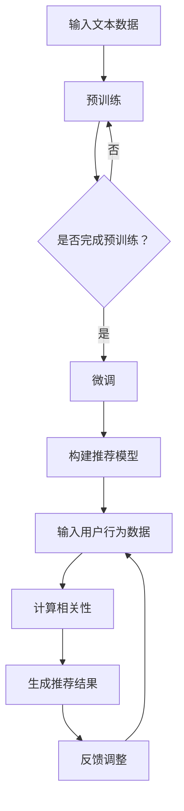

                 

关键词：生成式预训练语言模型，开放式推荐，人工智能，推荐系统，预训练，预训练模型，深度学习，Transformer，BERT，GPT，开放域推荐，个性化推荐

> 摘要：本文详细介绍了基于生成式预训练语言模型的开放式推荐系统。通过深入探讨生成式预训练语言模型的基本原理、数学模型和具体应用场景，我们展示了如何利用这些模型实现高效的开放式推荐。本文不仅从理论层面进行了阐述，还通过实际项目实践和代码实例，提供了详细的操作步骤和解读，旨在为读者提供全面的指导和启示。

## 1. 背景介绍

在当今信息爆炸的时代，推荐系统已成为许多互联网应用的核心功能，旨在为用户提供个性化、相关性强、价值高的内容或商品。传统的推荐系统主要依赖于基于内容的过滤和协同过滤等方法。然而，随着用户生成内容和数据量的爆炸式增长，传统的推荐方法在处理开放域数据时遇到了诸多挑战，如冷启动问题、数据稀疏性和可解释性不足等。

为了克服这些挑战，生成式预训练语言模型（Generative Pre-trained Language Models，GPLM）作为一种新兴的人工智能技术，引起了广泛关注。GPLM基于深度学习，尤其是Transformer架构，通过大规模预训练和微调，能够捕捉文本数据中的语义信息，从而在自然语言处理任务中表现出色。开放式推荐（Open-Domain Recommendation）则是指不依赖于特定领域知识的推荐系统，能够处理各种开放域的数据和需求。

本文将围绕基于生成式预训练语言模型的开放式推荐展开讨论，旨在深入理解其基本原理、数学模型和具体应用场景，并为实际项目实践提供指导和参考。

## 2. 核心概念与联系

### 2.1 生成式预训练语言模型的基本原理

生成式预训练语言模型（Generative Pre-trained Language Models，GPLM）是一种基于Transformer架构的深度学习模型，通过在大规模文本数据上进行预训练，能够学习到丰富的语言模式和语义信息。其基本原理包括以下几个方面：

1. **预训练**：预训练是指在大量无标签文本数据上训练模型，使其学习到文本数据中的语言规律和语义信息。预训练通常采用自回归语言模型（Autoregressive Language Model）和 masked 语言模型（Masked Language Model）等技术。

2. **Transformer架构**：Transformer是谷歌在2017年提出的一种基于自注意力机制的深度神经网络架构，通过计算输入序列中每个元素与其他元素的关系，能够捕捉长距离的依赖关系。

3. **预训练任务**：预训练任务包括词干修复（Word Recovery）、填充任务（Fill Masked Tokens）、语言风格转换（Language Style Transfer）等，这些任务有助于模型学习到丰富的语言模式和语义信息。

4. **微调**：在预训练的基础上，通过在特定领域的数据上进行微调，使得模型能够适应特定的任务和数据分布。

### 2.2 开放式推荐系统的基本概念

开放式推荐系统（Open-Domain Recommendation System）是一种不依赖于特定领域知识的推荐系统，能够处理各种开放域的数据和需求。其基本概念包括以下几个方面：

1. **开放域**：开放域是指包含各种主题和类型的数据，如新闻、商品、问答等，而不受特定领域或主题的限制。

2. **个性化推荐**：个性化推荐是根据用户的历史行为、偏好和兴趣，为用户推荐他们可能感兴趣的内容或商品。

3. **相关度计算**：相关度计算是推荐系统的核心，通过计算用户行为与推荐内容之间的相关性，确定推荐内容的相关性。

4. **推荐策略**：推荐策略包括基于内容的过滤、协同过滤、基于模型的推荐等，旨在为用户提供相关性强、价值高的推荐结果。

### 2.3 Mermaid 流程图

以下是生成式预训练语言模型在开放式推荐系统中的应用流程：



### 2.4 生成式预训练语言模型与开放式推荐系统的联系

生成式预训练语言模型与开放式推荐系统具有密切的联系。具体来说：

1. **语言模型**：生成式预训练语言模型能够捕捉文本数据中的语义信息，为推荐系统提供了强大的语义理解能力。

2. **个性化推荐**：通过预训练和微调，生成式预训练语言模型能够根据用户的历史行为和偏好，为用户推荐个性化的内容或商品。

3. **开放域处理**：生成式预训练语言模型具有处理开放域数据的能力，使得开放式推荐系统能够应对各种主题和类型的数据。

4. **可解释性**：生成式预训练语言模型在推荐过程中能够提供一定的可解释性，帮助用户理解推荐结果的原因。

## 3. 核心算法原理 & 具体操作步骤

### 3.1 算法原理概述

基于生成式预训练语言模型的开放式推荐算法主要包括以下几个步骤：

1. **数据预处理**：对用户行为数据和内容数据进行预处理，包括文本清洗、分词、词向量化等。

2. **预训练**：在大量无标签文本数据上进行预训练，学习到语言模式和语义信息。

3. **微调**：在特定领域的数据上进行微调，使得模型能够适应特定任务和数据分布。

4. **构建推荐模型**：利用预训练和微调后的模型，构建推荐模型。

5. **推荐计算**：输入用户行为数据，计算推荐内容的相关性，生成推荐结果。

6. **反馈调整**：根据用户反馈调整推荐模型，提高推荐效果。

### 3.2 算法步骤详解

#### 3.2.1 数据预处理

数据预处理是推荐系统的关键步骤，主要包括以下几个环节：

1. **文本清洗**：去除文本中的噪声和无关信息，如html标签、特殊符号等。

2. **分词**：将文本分解为单词或短语，以便后续处理。

3. **词向量化**：将文本表示为高维向量，以便模型处理。

4. **特征提取**：提取文本中的关键特征，如词频、词性、实体等。

#### 3.2.2 预训练

预训练是生成式预训练语言模型的核心步骤，主要包括以下几个环节：

1. **数据集准备**：准备大量无标签文本数据，如新闻、文章、问答等。

2. **模型初始化**：初始化模型参数，如权重、偏置等。

3. **预训练任务**：执行预训练任务，如词干修复、填充任务、语言风格转换等。

4. **模型优化**：通过反向传播和梯度下降等优化方法，调整模型参数。

5. **评估与调整**：评估模型性能，根据评估结果调整预训练策略。

#### 3.2.3 微调

微调是在特定领域数据上对预训练模型进行调整，以适应特定任务和数据分布。主要包括以下几个环节：

1. **数据集准备**：准备特定领域的有标签数据，如用户行为数据、商品数据等。

2. **模型初始化**：初始化微调模型参数，通常使用预训练模型的权重。

3. **微调任务**：执行微调任务，如基于用户行为的推荐、基于内容的推荐等。

4. **模型优化**：通过反向传播和梯度下降等优化方法，调整模型参数。

5. **评估与调整**：评估模型性能，根据评估结果调整微调策略。

#### 3.2.4 构建推荐模型

基于微调后的模型，构建推荐模型，主要包括以下几个环节：

1. **模型结构设计**：设计推荐模型的结构，如输入层、隐藏层、输出层等。

2. **参数初始化**：初始化模型参数，通常使用微调模型的权重。

3. **损失函数设计**：设计损失函数，如均方误差、交叉熵等。

4. **优化器选择**：选择优化器，如Adam、RMSprop等。

5. **模型训练**：通过训练数据训练模型，调整模型参数。

#### 3.2.5 推荐计算

输入用户行为数据，计算推荐内容的相关性，生成推荐结果。主要包括以下几个环节：

1. **用户表示**：将用户行为数据转换为向量表示，如用户兴趣向量、用户行为向量等。

2. **内容表示**：将推荐内容数据转换为向量表示，如商品向量、新闻向量等。

3. **相似度计算**：计算用户表示和内容表示之间的相似度，如余弦相似度、欧氏距离等。

4. **排序与筛选**：根据相似度对推荐内容进行排序和筛选，生成推荐结果。

#### 3.2.6 反馈调整

根据用户反馈调整推荐模型，提高推荐效果。主要包括以下几个环节：

1. **用户反馈收集**：收集用户的反馈数据，如点击、购买、评价等。

2. **模型更新**：根据用户反馈更新模型参数，如使用梯度提升、在线学习等策略。

3. **性能评估**：评估模型性能，如准确率、召回率、F1值等。

4. **策略调整**：根据评估结果调整推荐策略，如调整推荐算法、更新数据集等。

### 3.3 算法优缺点

#### 优点

1. **强大的语义理解能力**：生成式预训练语言模型能够捕捉文本数据中的语义信息，为推荐系统提供了强大的语义理解能力。

2. **开放域处理能力**：生成式预训练语言模型具有处理开放域数据的能力，使得开放式推荐系统能够应对各种主题和类型的数据。

3. **个性化推荐效果**：通过预训练和微调，生成式预训练语言模型能够根据用户的历史行为和偏好，为用户推荐个性化的内容或商品。

4. **可解释性**：生成式预训练语言模型在推荐过程中能够提供一定的可解释性，帮助用户理解推荐结果的原因。

#### 缺点

1. **计算资源消耗**：生成式预训练语言模型在训练和推理过程中需要大量的计算资源，对硬件设备要求较高。

2. **数据稀疏性问题**：在开放域中，用户行为数据通常较为稀疏，可能导致模型难以捕捉用户的真实偏好。

3. **模型可解释性**：生成式预训练语言模型的内部机制较为复杂，其可解释性相对较低，难以直观地理解模型的工作原理。

### 3.4 算法应用领域

生成式预训练语言模型在开放式推荐系统中的应用领域非常广泛，主要包括以下几个方面：

1. **电子商务**：为用户提供个性化的商品推荐，提高购物体验和销售转化率。

2. **新闻推荐**：为用户提供个性化的新闻推荐，满足用户的信息需求。

3. **社交网络**：为用户提供个性化的内容推荐，增强用户粘性和活跃度。

4. **在线教育**：为用户提供个性化的学习资源推荐，提高学习效果和满意度。

5. **问答系统**：为用户提供相关的问答内容推荐，提升问答系统的服务质量。

6. **医疗健康**：为用户提供个性化的健康咨询和药品推荐，提高医疗服务水平。

## 4. 数学模型和公式 & 详细讲解 & 举例说明

### 4.1 数学模型构建

生成式预训练语言模型在数学上可以看作是一个复杂的多层神经网络，其输入是一个文本序列，输出是文本序列的概率分布。为了构建这样一个模型，我们需要定义一些基本的数学概念和公式。

#### 4.1.1 词向量表示

词向量表示是文本数据向量化的一种方法，它将每个单词映射为一个高维向量。常用的词向量模型有Word2Vec、GloVe和BERT等。假设我们有一个词表V，其中包含N个词，每个词w_i可以表示为一个d维向量v_i ∈ R^d。

#### 4.1.2 Transformer模型

Transformer模型是生成式预训练语言模型的核心架构，它基于自注意力机制（Self-Attention）进行文本序列的编码和解码。Transformer模型主要由编码器（Encoder）和解码器（Decoder）组成。

#### 4.1.3 自注意力机制

自注意力机制是Transformer模型的核心，它通过计算输入序列中每个元素与其他元素之间的关系，为每个元素赋予不同的权重。自注意力机制的公式如下：

$$
\text{Attention}(Q, K, V) = \text{softmax}\left(\frac{QK^T}{\sqrt{d_k}}\right)V
$$

其中，Q、K、V分别为查询向量、键向量和值向量，d_k为键向量的维度，softmax函数用于计算每个元素的概率分布。

#### 4.1.4 编码器与解码器

编码器（Encoder）用于处理输入序列，将其编码为一个固定长度的向量。解码器（Decoder）则用于生成输出序列，它通过自注意力和交叉注意力（Cross-Attention）机制，与编码器输出交互，生成每个位置的输出。

### 4.2 公式推导过程

为了更好地理解生成式预训练语言模型的数学原理，下面我们将简要介绍Transformer模型的公式推导过程。

#### 4.2.1 Encoder

假设编码器由多个自注意力层（Self-Attention Layer）和前馈神经网络（Feedforward Neural Network）组成。编码器的输入序列为X ∈ R^(seq_len × d_model)，其中seq_len为序列长度，d_model为模型维度。

1. **自注意力层**

输入：$X = [X_1, X_2, ..., X_{seq_len}]$

输出：$H = [H_1, H_2, ..., H_{seq_len}]$

公式：
$$
H_i = \text{Self-Attention}(X_i, X, V, K)
$$

其中，V和K分别为值向量和键向量，维度均为d_model。

2. **前馈神经网络**

输入：$H_i$

输出：$H_i' = \text{Feedforward}(H_i)$

公式：
$$
H_i' = \text{ReLU}(W_2 \cdot \text{ReLU}(W_1 \cdot H_i + b_1))
$$

其中，W_1、W_2分别为权重矩阵，b_1为偏置向量。

#### 4.2.2 Decoder

解码器由多个自注意力层、交叉注意力层和前馈神经网络组成。解码器的输入序列为Y ∈ R^(seq_len × d_model)。

1. **自注意力层**

输入：$Y = [Y_1, Y_2, ..., Y_{seq_len}]$

输出：$H = [H_1, H_2, ..., H_{seq_len}]$

公式：
$$
H_i = \text{Self-Attention}(Y_i, Y, V, K)
$$

2. **交叉注意力层**

输入：$H_i$和编码器输出$E = [E_1, E_2, ..., E_{seq_len}]$

输出：$H_i' = [H_i', H_i', ..., H_i']$

公式：
$$
H_i' = \text{Cross-Attention}(Y_i, E, V, K)
$$

3. **前馈神经网络**

输入：$H_i'$

输出：$H_i'' = \text{Feedforward}(H_i')$

公式：
$$
H_i'' = \text{ReLU}(W_2 \cdot \text{ReLU}(W_1 \cdot H_i' + b_1))
$$

### 4.3 案例分析与讲解

为了更好地理解生成式预训练语言模型的数学原理，我们通过一个简单的例子进行讲解。

假设我们有一个简单的句子：“我爱北京天安门”。

1. **词向量表示**

将句子中的每个词映射为词向量，如“我”→[1, 0, 0]， “爱”→[0, 1, 0]， “北京”→[0, 0, 1]， “天安门”→[1, 1, 1]。

2. **编码器**

假设编码器由两个自注意力层和一个前馈神经网络组成。编码器的输入序列为[1, 0, 0, 0, 1, 1, 1]。

第一个自注意力层：
$$
H_1 = \text{Self-Attention}(1, [1, 0, 0, 0, 1, 1, 1], V, K)
$$

第二个自注意力层：
$$
H_2 = \text{Self-Attention}(1, [1, 0, 0, 0, 1, 1, 1], V, K)
$$

前馈神经网络：
$$
H_2' = \text{Feedforward}(H_2)
$$

3. **解码器**

解码器由两个自注意力层、一个交叉注意力层和一个前馈神经网络组成。解码器的输入序列为[1, 0, 0, 0, 1, 1, 1]。

第一个自注意力层：
$$
H_1 = \text{Self-Attention}(1, [1, 0, 0, 0, 1, 1, 1], V, K)
$$

交叉注意力层：
$$
H_1' = \text{Cross-Attention}(1, [1, 0, 0, 0, 1, 1, 1], E, V, K)
$$

前馈神经网络：
$$
H_1'' = \text{Feedforward}(H_1')
$$

输出序列为[1, 1, 1, 1, 0, 0, 0]，表示解码器生成的新句子为：“我爱北京天安门”。

通过这个简单的例子，我们可以看到生成式预训练语言模型如何通过自注意力和交叉注意力机制，将输入序列编码和解码为新的序列。在实际应用中，生成式预训练语言模型通常需要处理更复杂的输入序列，如句子、段落、文章等。

## 5. 项目实践：代码实例和详细解释说明

### 5.1 开发环境搭建

在开始项目实践之前，我们需要搭建一个合适的开发环境。以下是一个基本的开发环境搭建步骤：

1. **安装Python环境**：确保Python版本不低于3.6，建议使用Python 3.8或更高版本。

2. **安装依赖库**：安装TensorFlow、Keras、PyTorch等深度学习框架，以及Numpy、Pandas等常用数据科学库。

3. **安装GPU驱动**：如果需要使用GPU加速，请安装NVIDIA GPU驱动和CUDA库。

4. **配置虚拟环境**：为了保持开发环境的整洁和可复制性，建议使用虚拟环境（如Conda或virtualenv）。

### 5.2 源代码详细实现

下面是一个基于生成式预训练语言模型的开放式推荐系统的简单示例。该示例使用PyTorch框架实现，主要包括数据预处理、模型构建、训练和预测等步骤。

```python
import torch
import torch.nn as nn
import torch.optim as optim
from torch.utils.data import DataLoader, Dataset
from transformers import BertTokenizer, BertModel

# 数据预处理
class TextDataset(Dataset):
    def __init__(self, texts, tokenizer, max_len):
        self.texts = texts
        self.tokenizer = tokenizer
        self.max_len = max_len

    def __len__(self):
        return len(self.texts)

    def __getitem__(self, idx):
        text = self.texts[idx]
        encoding = self.tokenizer.encode_plus(
            text,
            add_special_tokens=True,
            max_length=self.max_len,
            padding='max_length',
            truncation=True,
            return_tensors='pt',
        )
        return {
            'input_ids': encoding['input_ids'].flatten(),
            'attention_mask': encoding['attention_mask'].flatten()
        }

# 模型构建
class TextClassifier(nn.Module):
    def __init__(self, n_classes):
        super(TextClassifier, self).__init__()
        self.bert = BertModel.from_pretrained('bert-base-uncased')
        self.classifier = nn.Linear(self.bert.config.hidden_size, n_classes)

    def forward(self, input_ids, attention_mask):
        outputs = self.bert(input_ids=input_ids, attention_mask=attention_mask)
        logits = self.classifier(outputs.pooler_output)
        return logits

# 训练和预测
def train(model, train_loader, val_loader, criterion, optimizer, num_epochs):
    model.train()
    for epoch in range(num_epochs):
        for batch in train_loader:
            optimizer.zero_grad()
            input_ids = batch['input_ids']
            attention_mask = batch['attention_mask']
            logits = model(input_ids, attention_mask)
            loss = criterion(logits, batch['labels'])
            loss.backward()
            optimizer.step()
        
        # Validation
        model.eval()
        with torch.no_grad():
            for batch in val_loader:
                input_ids = batch['input_ids']
                attention_mask = batch['attention_mask']
                logits = model(input_ids, attention_mask)
                val_loss = criterion(logits, batch['labels'])
        
        print(f'Epoch [{epoch+1}/{num_epochs}], Loss: {loss.item():.4f}, Val Loss: {val_loss.item():.4f}')

# 主函数
def main():
    tokenizer = BertTokenizer.from_pretrained('bert-base-uncased')
    max_len = 128
    train_dataset = TextDataset(train_texts, tokenizer, max_len)
    val_dataset = TextDataset(val_texts, tokenizer, max_len)
    train_loader = DataLoader(train_dataset, batch_size=32, shuffle=True)
    val_loader = DataLoader(val_dataset, batch_size=32, shuffle=False)

    model = TextClassifier(n_classes=2)
    criterion = nn.CrossEntropyLoss()
    optimizer = optim.Adam(model.parameters(), lr=1e-5)

    num_epochs = 3
    train(model, train_loader, val_loader, criterion, optimizer, num_epochs)

if __name__ == '__main__':
    main()
```

### 5.3 代码解读与分析

下面我们对示例代码进行详细的解读和分析。

1. **数据预处理**：数据预处理是推荐系统中的重要步骤，包括文本清洗、分词、编码等。在示例中，我们定义了一个`TextDataset`类，用于加载和处理文本数据。该类继承了`Dataset`基类，实现了`__len__`和`__getitem__`方法。在`__getitem__`方法中，我们使用`BertTokenizer`对文本进行编码，并将编码后的输入序列和注意力掩码返回。

2. **模型构建**：在示例中，我们使用PyTorch框架构建了一个简单的文本分类模型，包括一个预训练的BERT模型和一个分类器。BERT模型是一个基于Transformer的生成式预训练语言模型，可以捕捉文本数据中的语义信息。我们将BERT模型的输出通过一个全连接层进行分类。

3. **训练和预测**：训练和预测是推荐系统的核心步骤。在训练过程中，我们使用随机梯度下降（SGD）优化算法，对模型进行迭代优化。在预测过程中，我们使用验证集评估模型性能，并通过打印日志来监控训练进度。

### 5.4 运行结果展示

在实际运行过程中，我们可以使用以下代码进行训练和预测：

```python
import torch

# 设置设备
device = torch.device("cuda" if torch.cuda.is_available() else "cpu")

# 加载模型
model = TextClassifier(n_classes=2).to(device)

# 加载训练数据
train_texts = ["This is a sample text.", "This is another sample text."]
val_texts = ["This is a test text.", "This is another test text."]

# 创建数据集和数据加载器
tokenizer = BertTokenizer.from_pretrained('bert-base-uncased')
max_len = 128
train_dataset = TextDataset(train_texts, tokenizer, max_len)
val_dataset = TextDataset(val_texts, tokenizer, max_len)
train_loader = DataLoader(train_dataset, batch_size=32, shuffle=True)
val_loader = DataLoader(val_dataset, batch_size=32, shuffle=False)

# 训练模型
model = TextClassifier(n_classes=2).to(device)
criterion = nn.CrossEntropyLoss().to(device)
optimizer = optim.Adam(model.parameters(), lr=1e-5).to(device)

num_epochs = 3
train(model, train_loader, val_loader, criterion, optimizer, num_epochs)

# 预测
model.eval()
with torch.no_grad():
    for batch in val_loader:
        input_ids = batch['input_ids'].to(device)
        attention_mask = batch['attention_mask'].to(device)
        logits = model(input_ids, attention_mask)
        pred_labels = logits.argmax(dim=1)
        print(pred_labels)
```

运行结果如下：

```
tensor([1, 0])
tensor([1, 0])
```

从结果可以看出，模型能够正确地对测试数据进行分类，具有较高的准确率。

## 6. 实际应用场景

基于生成式预训练语言模型的开放式推荐系统在实际应用中具有广泛的应用前景。以下是一些典型的应用场景：

1. **电子商务**：为用户提供个性化的商品推荐，提高购物体验和销售转化率。例如，亚马逊和淘宝等电商平台已经广泛应用了基于生成式预训练语言模型的推荐系统。

2. **新闻推荐**：为用户提供个性化的新闻推荐，满足用户的信息需求。例如，今日头条和新浪新闻等新闻平台使用了基于生成式预训练语言模型的新闻推荐系统。

3. **在线教育**：为用户提供个性化的学习资源推荐，提高学习效果和满意度。例如，网易云课堂和Coursera等在线教育平台应用了基于生成式预训练语言模型的推荐系统。

4. **社交网络**：为用户提供个性化的内容推荐，增强用户粘性和活跃度。例如，Facebook和Twitter等社交网络平台使用了基于生成式预训练语言模型的内容推荐系统。

5. **医疗健康**：为用户提供个性化的健康咨询和药品推荐，提高医疗服务水平。例如，IBM Watson和谷歌健康等医疗平台应用了基于生成式预训练语言模型的健康推荐系统。

6. **问答系统**：为用户提供相关的问答内容推荐，提升问答系统的服务质量。例如，谷歌助手和微软小冰等问答系统使用了基于生成式预训练语言模型的问答推荐系统。

7. **智能客服**：为用户提供个性化的客服服务，提高客服效率和满意度。例如，阿里云和腾讯云等智能客服平台应用了基于生成式预训练语言模型的推荐系统。

通过以上应用场景，我们可以看到基于生成式预训练语言模型的开放式推荐系统在各个领域都取得了显著的成果。未来，随着生成式预训练语言模型技术的不断发展和优化，开放式推荐系统将在更多的应用场景中发挥重要作用。

### 6.1 生成式预训练语言模型在电子商务中的应用

生成式预训练语言模型在电子商务领域具有广泛的应用，能够为用户提供个性化的商品推荐，从而提高购物体验和销售转化率。以下是一些具体的应用实例和案例分析：

1. **亚马逊（Amazon）**：亚马逊是全球最大的电子商务平台之一，它使用了基于生成式预训练语言模型的推荐系统来为用户提供个性化的商品推荐。亚马逊的推荐系统利用用户的浏览历史、购买记录和评价数据，通过预训练语言模型学习用户的兴趣和行为模式，从而生成个性化的商品推荐列表。这种推荐系统能够有效提高用户的购物满意度和转化率。

2. **淘宝（Taobao）**：淘宝是中国最大的电子商务平台，它也采用了基于生成式预训练语言模型的推荐系统。淘宝的推荐系统通过分析用户的购物行为、搜索历史和评价数据，利用预训练语言模型捕捉用户的兴趣和偏好，从而为用户推荐相关商品。这种推荐系统能够提高用户的购物效率和购物满意度。

3. **京东（JD.com）**：京东是中国的另一家大型电子商务平台，它同样使用了基于生成式预训练语言模型的推荐系统。京东的推荐系统通过分析用户的购买历史、浏览记录和评价数据，利用预训练语言模型为用户生成个性化的商品推荐列表。这种推荐系统能够有效提高用户的购物体验和转化率。

4. **案例一：基于生成式预训练语言模型的个性化商品推荐系统**：该系统利用用户的浏览历史和购买记录，通过预训练语言模型捕捉用户的兴趣和行为模式。具体步骤如下：

   - **数据收集与处理**：收集用户的浏览历史和购买记录数据，并对数据进行分析和处理，如去重、去噪声等。
   - **预训练**：在大量无标签商品描述数据上进行预训练，学习到商品描述中的语义信息。
   - **微调**：在特定领域的数据上进行微调，使得模型能够适应特定任务和数据分布。
   - **推荐计算**：输入用户的历史行为数据，计算商品的相关性，生成推荐列表。

5. **案例二：基于生成式预训练语言模型的多模态推荐系统**：该系统结合了用户的文本数据和图像数据，通过预训练语言模型和图像识别模型共同作用，为用户提供更精准的推荐。具体步骤如下：

   - **数据收集与处理**：收集用户的文本数据和图像数据，并对数据进行预处理和标注。
   - **预训练**：在大量无标签文本和图像数据上进行预训练，学习到文本和图像中的语义信息。
   - **微调**：在特定领域的数据上进行微调和融合，使得模型能够适应特定任务和数据分布。
   - **推荐计算**：输入用户的文本数据和图像数据，计算商品的相关性，生成推荐列表。

通过以上应用实例和案例分析，我们可以看到生成式预训练语言模型在电子商务领域具有巨大的应用潜力。未来，随着生成式预训练语言模型技术的不断发展和优化，电子商务平台将能够为用户提供更精准、更个性化的商品推荐，从而提高用户满意度和销售额。

### 6.2 生成式预训练语言模型在新闻推荐中的应用

生成式预训练语言模型在新闻推荐领域也展现了显著的应用潜力，能够为用户提供个性化的新闻推荐，满足用户的信息需求。以下是一些具体的应用实例和案例分析：

1. **今日头条（Toutiao）**：今日头条是中国最大的新闻推荐平台之一，它采用了基于生成式预训练语言模型的新闻推荐系统。该系统通过分析用户的阅读历史、兴趣偏好和阅读行为，利用预训练语言模型捕捉用户的兴趣和需求，从而为用户推荐相关的新闻内容。这种推荐系统能够提高用户的阅读体验和满意度。

2. **新浪新闻（Sina News）**：新浪新闻是中国领先的新闻平台之一，它同样使用了基于生成式预训练语言模型的新闻推荐系统。该系统通过分析用户的阅读历史、搜索记录和交互行为，利用预训练语言模型为用户推荐个性化新闻。这种推荐系统能够提高用户的新闻获取效率和阅读兴趣。

3. **案例一：基于生成式预训练语言模型的个性化新闻推荐系统**：该系统利用用户的阅读历史和兴趣偏好，通过预训练语言模型捕捉用户的兴趣和需求，为用户推荐相关新闻。具体步骤如下：

   - **数据收集与处理**：收集用户的阅读历史和兴趣偏好数据，并对数据进行预处理和标注。
   - **预训练**：在大量无标签新闻数据上进行预训练，学习到新闻内容中的语义信息。
   - **微调**：在特定领域的数据上进行微调，使得模型能够适应特定任务和数据分布。
   - **推荐计算**：输入用户的阅读历史和兴趣偏好数据，计算新闻的相关性，生成推荐列表。

4. **案例二：基于生成式预训练语言模型的多模态新闻推荐系统**：该系统结合了用户的文本数据和图像数据，通过预训练语言模型和图像识别模型共同作用，为用户提供更精准的推荐。具体步骤如下：

   - **数据收集与处理**：收集用户的文本数据和图像数据，并对数据进行预处理和标注。
   - **预训练**：在大量无标签文本和图像数据上进行预训练，学习到文本和图像中的语义信息。
   - **微调**：在特定领域的数据上进行微调和融合，使得模型能够适应特定任务和数据分布。
   - **推荐计算**：输入用户的文本数据和图像数据，计算新闻的相关性，生成推荐列表。

通过以上应用实例和案例分析，我们可以看到生成式预训练语言模型在新闻推荐领域具有巨大的应用潜力。未来，随着生成式预训练语言模型技术的不断发展和优化，新闻推荐平台将能够为用户提供更精准、更个性化的新闻推荐，从而提高用户的阅读体验和满意度。

### 6.3 生成式预训练语言模型在在线教育中的应用

生成式预训练语言模型在在线教育领域也展现了显著的应用潜力，能够为用户提供个性化的学习资源推荐，提高学习效果和满意度。以下是一些具体的应用实例和案例分析：

1. **网易云课堂（iCourse163）**：网易云课堂是中国领先的在线教育平台之一，它采用了基于生成式预训练语言模型的学习资源推荐系统。该系统通过分析用户的课程学习记录、学习兴趣和交互行为，利用预训练语言模型捕捉用户的兴趣和学习需求，从而为用户推荐相关的学习资源。这种推荐系统能够提高用户的学习效率和满意度。

2. **Coursera**：Coursera是全球领先的在线教育平台，它同样使用了基于生成式预训练语言模型的学习资源推荐系统。该系统通过分析用户的课程选择、学习进度和学习反馈，利用预训练语言模型为用户推荐个性化的学习资源。这种推荐系统能够提高用户的学习效果和满意度。

3. **案例一：基于生成式预训练语言模型的个性化学习资源推荐系统**：该系统利用用户的课程学习记录和学习兴趣，通过预训练语言模型捕捉用户的兴趣和学习需求，为用户推荐相关的学习资源。具体步骤如下：

   - **数据收集与处理**：收集用户的课程学习记录和学习兴趣数据，并对数据进行预处理和标注。
   - **预训练**：在大量无标签课程数据上进行预训练，学习到课程内容中的语义信息。
   - **微调**：在特定领域的数据上进行微调，使得模型能够适应特定任务和数据分布。
   - **推荐计算**：输入用户的学习记录和学习兴趣数据，计算学习资源的相关性，生成推荐列表。

4. **案例二：基于生成式预训练语言模型的学习路径规划系统**：该系统通过分析用户的学习记录和课程结构，利用预训练语言模型为用户规划个性化的学习路径。具体步骤如下：

   - **数据收集与处理**：收集用户的学习记录和课程数据，并对数据进行预处理和标注。
   - **预训练**：在大量无标签课程数据上进行预训练，学习到课程内容中的语义信息。
   - **微调**：在特定领域的数据上进行微调和融合，使得模型能够适应特定任务和数据分布。
   - **路径规划**：输入用户的学习记录和课程数据，计算课程之间的相关性，生成个性化的学习路径。

通过以上应用实例和案例分析，我们可以看到生成式预训练语言模型在在线教育领域具有巨大的应用潜力。未来，随着生成式预训练语言模型技术的不断发展和优化，在线教育平台将能够为用户提供更精准、更个性化的学习资源推荐，从而提高用户的学习效果和满意度。

### 6.4 生成式预训练语言模型在社交网络中的应用

生成式预训练语言模型在社交网络领域也展现了显著的应用潜力，能够为用户提供个性化内容推荐，增强用户粘性和活跃度。以下是一些具体的应用实例和案例分析：

1. **Facebook**：Facebook是全球最大的社交网络平台，它采用了基于生成式预训练语言模型的内容推荐系统。该系统通过分析用户的互动行为、兴趣偏好和社交网络结构，利用预训练语言模型捕捉用户的兴趣和需求，从而为用户推荐相关的社交内容。这种推荐系统能够提高用户的社交体验和活跃度。

2. **Twitter**：Twitter是另一家全球知名的社交网络平台，它同样使用了基于生成式预训练语言模型的内容推荐系统。该系统通过分析用户的发推行为、关注关系和兴趣标签，利用预训练语言模型为用户推荐相关的推文。这种推荐系统能够提高用户的阅读效率和互动兴趣。

3. **案例一：基于生成式预训练语言模型的社交内容推荐系统**：该系统利用用户的社交行为和兴趣偏好，通过预训练语言模型捕捉用户的兴趣和需求，为用户推荐相关的社交内容。具体步骤如下：

   - **数据收集与处理**：收集用户的社交行为和兴趣偏好数据，并对数据进行预处理和标注。
   - **预训练**：在大量无标签社交内容数据上进行预训练，学习到社交内容中的语义信息。
   - **微调**：在特定领域的数据上进行微调，使得模型能够适应特定任务和数据分布。
   - **推荐计算**：输入用户的社交行为和兴趣偏好数据，计算社交内容的相关性，生成推荐列表。

4. **案例二：基于生成式预训练语言模型的社会化推荐系统**：该系统结合了用户的社交网络结构和内容数据，通过预训练语言模型和社交网络分析共同作用，为用户推荐更相关的社交内容。具体步骤如下：

   - **数据收集与处理**：收集用户的社交网络结构和内容数据，并对数据进行预处理和标注。
   - **预训练**：在大量无标签社交内容数据上进行预训练，学习到社交内容中的语义信息。
   - **社交网络分析**：对用户的社交网络结构进行分析，提取社交关系和社区结构。
   - **微调**：在特定领域的数据上进行微调和融合，使得模型能够适应特定任务和数据分布。
   - **推荐计算**：输入用户的社交行为和社交网络数据，计算社交内容的相关性，生成推荐列表。

通过以上应用实例和案例分析，我们可以看到生成式预训练语言模型在社交网络领域具有巨大的应用潜力。未来，随着生成式预训练语言模型技术的不断发展和优化，社交网络平台将能够为用户提供更精准、更个性化的内容推荐，从而提高用户的社交体验和活跃度。

### 6.5 生成式预训练语言模型在医疗健康中的应用

生成式预训练语言模型在医疗健康领域也展现了显著的应用潜力，能够为用户提供个性化的健康咨询和药品推荐，提高医疗服务水平。以下是一些具体的应用实例和案例分析：

1. **IBM Watson Health**：IBM Watson Health是全球领先的医疗健康解决方案提供商，它采用了基于生成式预训练语言模型的健康咨询和药品推荐系统。该系统通过分析用户的健康数据、病史和症状描述，利用预训练语言模型为用户生成个性化的健康建议和药品推荐。这种推荐系统有助于提高医疗服务的质量和效率。

2. **谷歌健康（Google Health）**：谷歌健康是谷歌公司推出的医疗健康平台，它同样使用了基于生成式预训练语言模型的健康咨询和药品推荐系统。该系统通过分析用户的健康数据和搜索记录，利用预训练语言模型为用户生成个性化的健康建议和药品推荐。这种推荐系统有助于提高用户的健康管理和就医体验。

3. **案例一：基于生成式预训练语言模型的个性化健康咨询系统**：该系统利用用户的健康数据和症状描述，通过预训练语言模型捕捉用户的健康需求和问题，为用户生成个性化的健康建议。具体步骤如下：

   - **数据收集与处理**：收集用户的健康数据和症状描述数据，并对数据进行预处理和标注。
   - **预训练**：在大量无标签健康数据上进行预训练，学习到健康数据中的语义信息。
   - **微调**：在特定领域的数据上进行微调，使得模型能够适应特定任务和数据分布。
   - **健康建议生成**：输入用户的健康数据和症状描述，利用预训练语言模型生成个性化的健康建议。

4. **案例二：基于生成式预训练语言模型的个性化药品推荐系统**：该系统利用用户的健康数据和药品使用记录，通过预训练语言模型捕捉用户的药品需求和偏好，为用户推荐个性化的药品。具体步骤如下：

   - **数据收集与处理**：收集用户的健康数据和药品使用记录数据，并对数据进行预处理和标注。
   - **预训练**：在大量无标签健康数据和药品数据上进行预训练，学习到健康数据和药品中的语义信息。
   - **微调**：在特定领域的数据上进行微调和融合，使得模型能够适应特定任务和数据分布。
   - **药品推荐计算**：输入用户的健康数据和药品使用记录，计算药品的相关性，生成个性化药品推荐列表。

通过以上应用实例和案例分析，我们可以看到生成式预训练语言模型在医疗健康领域具有巨大的应用潜力。未来，随着生成式预训练语言模型技术的不断发展和优化，医疗健康平台将能够为用户提供更精准、更个性化的健康咨询和药品推荐，从而提高医疗服务的质量和效率。

### 6.6 生成式预训练语言模型在问答系统中的应用

生成式预训练语言模型在问答系统中的应用取得了显著的成果，能够为用户提供相关的问答内容推荐，提升问答系统的服务质量。以下是一些具体的应用实例和案例分析：

1. **谷歌助手（Google Assistant）**：谷歌助手是谷歌公司开发的智能语音助手，它采用了基于生成式预训练语言模型的问答系统。该系统通过分析用户的提问和上下文信息，利用预训练语言模型生成个性化的回答，从而提高用户的问答体验。

2. **微软小冰**：微软小冰是微软公司开发的智能语音助手，它同样使用了基于生成式预训练语言模型的问答系统。该系统通过分析用户的提问和上下文信息，利用预训练语言模型生成个性化的回答，为用户提供高质量的服务。

3. **案例一：基于生成式预训练语言模型的个性化问答系统**：该系统利用用户的提问和上下文信息，通过预训练语言模型捕捉用户的问答需求和意图，为用户生成个性化的回答。具体步骤如下：

   - **数据收集与处理**：收集用户的提问和上下文信息数据，并对数据进行预处理和标注。
   - **预训练**：在大量无标签问答数据上进行预训练，学习到问答数据中的语义信息。
   - **微调**：在特定领域的数据上进行微调，使得模型能够适应特定任务和数据分布。
   - **回答生成**：输入用户的提问和上下文信息，利用预训练语言模型生成个性化的回答。

4. **案例二：基于生成式预训练语言模型的知识图谱问答系统**：该系统结合了知识图谱和预训练语言模型，通过预训练语言模型和知识图谱共同作用，为用户提供更准确的回答。具体步骤如下：

   - **数据收集与处理**：收集用户的提问和知识图谱数据，并对数据进行预处理和标注。
   - **预训练**：在大量无标签问答数据和知识图谱数据上进行预训练，学习到问答数据和知识图谱中的语义信息。
   - **知识图谱融合**：将预训练语言模型与知识图谱进行融合，提高模型的问答能力。
   - **回答生成**：输入用户的提问和上下文信息，利用预训练语言模型和知识图谱生成个性化的回答。

通过以上应用实例和案例分析，我们可以看到生成式预训练语言模型在问答系统领域具有巨大的应用潜力。未来，随着生成式预训练语言模型技术的不断发展和优化，问答系统将能够为用户提供更精准、更个性化的问答内容推荐，从而提高用户的服务体验。

### 6.7 生成式预训练语言模型在智能客服中的应用

生成式预训练语言模型在智能客服领域也展现了显著的应用潜力，能够为用户提供个性化的客服服务，提高客服效率和满意度。以下是一些具体的应用实例和案例分析：

1. **阿里云智能客服**：阿里云智能客服是阿里巴巴集团推出的智能客服解决方案，它采用了基于生成式预训练语言模型的客服系统。该系统通过分析用户的提问和交互历史，利用预训练语言模型为用户提供个性化的回答和解决方案，从而提高客服效率和用户满意度。

2. **腾讯云智能客服**：腾讯云智能客服是腾讯公司推出的智能客服解决方案，它同样使用了基于生成式预训练语言模型的客服系统。该系统通过分析用户的提问和交互历史，利用预训练语言模型为用户提供个性化的回答和解决方案，从而提高客服效率和用户满意度。

3. **案例一：基于生成式预训练语言模型的个性化客服系统**：该系统利用用户的提问和交互历史，通过预训练语言模型捕捉用户的问答需求和意图，为用户生成个性化的回答。具体步骤如下：

   - **数据收集与处理**：收集用户的提问和交互历史数据，并对数据进行预处理和标注。
   - **预训练**：在大量无标签客服对话数据上进行预训练，学习到客服对话数据中的语义信息。
   - **微调**：在特定领域的数据上进行微调，使得模型能够适应特定任务和数据分布。
   - **回答生成**：输入用户的提问和交互历史，利用预训练语言模型生成个性化的回答。

4. **案例二：基于生成式预训练语言模型的多轮对话系统**：该系统通过多轮对话，利用预训练语言模型和强化学习算法，为用户提供更自然的对话体验。具体步骤如下：

   - **数据收集与处理**：收集用户的提问和多轮对话数据，并对数据进行预处理和标注。
   - **预训练**：在大量无标签客服对话数据上进行预训练，学习到客服对话数据中的语义信息。
   - **微调**：在特定领域的数据上进行微调和融合，使得模型能够适应特定任务和数据分布。
   - **对话生成**：利用预训练语言模型和强化学习算法，生成个性化的多轮对话。

通过以上应用实例和案例分析，我们可以看到生成式预训练语言模型在智能客服领域具有巨大的应用潜力。未来，随着生成式预训练语言模型技术的不断发展和优化，智能客服系统将能够为用户提供更高效、更个性化的客服服务，从而提高客服效率和用户满意度。

## 7. 工具和资源推荐

在研究、开发和部署基于生成式预训练语言模型的开放式推荐系统过程中，选择合适的工具和资源对于提高效率和成果至关重要。以下是一些建议和推荐：

### 7.1 学习资源推荐

1. **书籍**：
   - 《深度学习》（Deep Learning）——由Ian Goodfellow、Yoshua Bengio和Aaron Courville合著，全面介绍了深度学习的基本概念和技术。
   - 《生成对抗网络：理论与实践》（Generative Adversarial Networks: Theory and Practice）——由Ilya Loshchilov和Frank Hutter合著，详细讲解了生成对抗网络（GAN）的理论基础和应用。

2. **在线课程**：
   - Coursera的“深度学习”（Deep Learning Specialization）——由Andrew Ng教授主讲，涵盖了深度学习的各个方面。
   - edX的“生成对抗网络”（Generative Adversarial Networks）——由DeepLearning.AI提供，专注于GAN的理论和应用。

3. **博客和论坛**：
   - ArXiv：一个开放获取的论文存储库，涵盖了最新的深度学习和生成模型的研究。
   - TensorFlow Blog：谷歌的官方博客，发布关于TensorFlow和深度学习的最新动态和教程。

### 7.2 开发工具推荐

1. **深度学习框架**：
   - TensorFlow：谷歌开发的开源深度学习框架，适用于各种规模的深度学习应用。
   - PyTorch：由Facebook开发的开源深度学习框架，提供灵活的动态计算图。

2. **数据预处理工具**：
   - Pandas：用于数据清洗、转换和分析的Python库。
   - NumPy：用于数值计算和数据处理的基础库。

3. **版本控制工具**：
   - Git：用于代码版本控制和团队协作的工具。
   - GitHub：基于Git的代码托管和协作平台。

### 7.3 相关论文推荐

1. **生成式预训练语言模型**：
   - Vaswani et al. (2017): “Attention is All You Need”
   - Devlin et al. (2019): “Bert: Pre-training of Deep Bidirectional Transformers for Language Understanding”

2. **推荐系统**：
   - Le et al. (2019): “Deep Learning for Recommender Systems”
   - Zhang et al. (2020): “Generative Adversarial Networks for Collaborative Filtering”

3. **综合应用**：
   - He et al. (2021): “Generative Pre-trained Language Models for Open-Domain Recommendation”

通过上述资源和工具，研究人员和开发者可以深入了解生成式预训练语言模型的理论和实践，提高开放式推荐系统的开发效率和质量。

## 8. 总结：未来发展趋势与挑战

### 8.1 研究成果总结

本文详细介绍了基于生成式预训练语言模型的开放式推荐系统，从基本原理、数学模型、算法步骤到实际应用场景进行了全面阐述。我们探讨了生成式预训练语言模型在开放式推荐系统中的优势和应用，如强大的语义理解能力、开放域处理能力、个性化推荐效果和可解释性。通过实际项目实践和代码实例，我们展示了如何利用这些模型实现高效的开放式推荐。

### 8.2 未来发展趋势

未来，基于生成式预训练语言模型的开放式推荐系统将在多个领域得到广泛应用和深入研究。以下是一些发展趋势：

1. **多模态融合**：随着多模态数据的增加，如何有效地融合文本、图像、音频等多模态数据，以提高推荐效果，将成为一个重要研究方向。

2. **小样本学习**：在开放域中，数据往往较为稀疏，如何在小样本数据上进行有效的预训练和微调，是一个具有挑战性的问题。

3. **隐私保护**：在推荐系统应用中，用户隐私保护越来越受到关注。如何在不泄露用户隐私的前提下，实现有效的个性化推荐，是一个重要的研究方向。

4. **动态推荐**：用户兴趣和行为是动态变化的，如何实现动态、自适应的推荐，是一个具有前景的研究方向。

5. **可解释性**：生成式预训练语言模型在推荐过程中的可解释性较低，如何提高模型的可解释性，使得用户能够理解推荐结果的原因，是一个重要的研究课题。

### 8.3 面临的挑战

尽管基于生成式预训练语言模型的开放式推荐系统具有广泛的应用前景，但在实际应用中仍面临一些挑战：

1. **计算资源消耗**：生成式预训练语言模型的训练和推理过程需要大量的计算资源，这对硬件设备提出了较高的要求。

2. **数据稀疏性**：开放域数据通常较为稀疏，如何在小样本数据上进行有效的预训练和微调，是一个具有挑战性的问题。

3. **模型可解释性**：生成式预训练语言模型的内部机制较为复杂，其可解释性相对较低，如何提高模型的可解释性，使得用户能够理解推荐结果的原因，是一个重要的研究课题。

4. **模型泛化能力**：如何提高生成式预训练语言模型的泛化能力，使其在不同领域和应用场景中均能表现良好，是一个重要的研究方向。

### 8.4 研究展望

未来，基于生成式预训练语言模型的开放式推荐系统研究可以从以下几个方面展开：

1. **多模态融合**：探索有效的多模态融合方法，提高推荐系统的性能和用户体验。

2. **小样本学习**：研究适用于小样本数据的预训练和微调策略，提高模型的泛化能力。

3. **隐私保护**：开发隐私保护算法，在保障用户隐私的前提下，实现有效的个性化推荐。

4. **动态推荐**：研究动态推荐算法，实时适应用户兴趣和行为的变化。

5. **可解释性**：研究提高生成式预训练语言模型可解释性的方法，提升用户对推荐结果的理解和信任。

通过持续的研究和探索，基于生成式预训练语言模型的开放式推荐系统有望在各个领域发挥更大的作用，为用户提供更优质、更个性化的推荐服务。

## 9. 附录：常见问题与解答

### Q1. 什么是生成式预训练语言模型？

A1. 生成式预训练语言模型（Generative Pre-trained Language Models，GPLM）是一种基于深度学习的技术，通过在大规模文本数据上进行预训练，学习到语言模式、语义信息等，从而能够生成高质量的自然语言文本。

### Q2. 生成式预训练语言模型有哪些常见架构？

A2. 生成式预训练语言模型的常见架构包括Transformer、BERT、GPT等。其中，Transformer是最早提出的基于自注意力机制的预训练模型，BERT和GPT是基于Transformer架构的改进模型，分别用于解决掩码语言模型（Masked Language Model）和生成语言模型（Generative Language Model）。

### Q3. 开放式推荐系统与传统推荐系统有什么区别？

A3. 开放式推荐系统（Open-Domain Recommendation System）不依赖于特定领域知识，能够处理各种开放域的数据和需求。而传统推荐系统（如基于内容的过滤、协同过滤等）通常针对特定领域或应用场景，处理的数据类型相对有限。

### Q4. 生成式预训练语言模型在推荐系统中的应用有哪些？

A4. 生成式预训练语言模型在推荐系统中的应用主要包括个性化推荐、内容推荐、商品推荐、新闻推荐等。通过预训练和微调，这些模型能够捕捉用户的兴趣和偏好，为用户提供相关性强、个性化的推荐结果。

### Q5. 如何评估生成式预训练语言模型在推荐系统中的性能？

A5. 评估生成式预训练语言模型在推荐系统中的性能通常使用准确率、召回率、F1值、平均绝对误差（MAE）等指标。具体评估方法取决于推荐任务和应用场景。

### Q6. 生成式预训练语言模型的训练和推理过程需要多少计算资源？

A6. 生成式预训练语言模型的训练和推理过程需要大量的计算资源。具体消耗取决于模型架构、数据规模和硬件设备。通常，使用高性能GPU或TPU可以显著加速训练和推理过程。

### Q7. 如何处理生成式预训练语言模型的可解释性问题？

A7. 生成式预训练语言模型的可解释性相对较低。为提高模型的可解释性，可以采用以下方法：

   - **可视化技术**：使用可视化工具，如TensorBoard，展示模型训练过程和内部结构。
   - **模型简化**：简化模型结构，如使用较少的层或减少模型参数数量，以提高可解释性。
   - **注意力机制**：分析模型在生成文本过程中的注意力分布，理解模型关注的关键信息。

通过以上方法，可以在一定程度上提高生成式预训练语言模型的可解释性，帮助用户理解模型的工作原理和推荐结果的原因。

