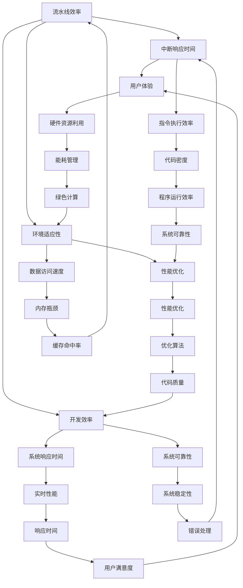

                 

### 摘要

本文旨在深入探讨MIPS（Microprocessor without Interlocked Pipeline Stages）处理器的特性和优化方法。MIPS处理器因其简单、高效和可扩展性而成为嵌入式系统和计算机体系结构研究中的热点。本文首先介绍了MIPS处理器的基本结构和指令集架构，随后详细分析了其在流水线、内存管理和中断处理等方面的优化技术。通过数学模型和公式推导，本文探讨了优化算法的原理和应用。同时，本文还通过实际代码实例展示了MIPS处理器的优化实践，并对其未来应用和发展趋势进行了展望。本文旨在为读者提供一个全面、系统的MIPS处理器优化指南，以期为相关领域的研究和实践提供参考。

### 1. 背景介绍

MIPS处理器，全称为Microprocessor without Interlocked Pipeline Stages，是一种基于精简指令集计算机（RISC）架构的处理器。它由MIPS Technologies公司创建，并广泛应用于嵌入式系统、网络设备、数字信号处理等领域。MIPS处理器以其简洁、高效和可扩展的特点，成为计算机体系结构研究中的重要角色。

MIPS处理器的发展历程可以追溯到1980年代初。当时，计算机体系结构正从复杂指令集计算机（CISC）向精简指令集计算机（RISC）转变。MIPS处理器的设计理念是简化指令集，提高指令执行速度，减少处理器复杂度。这一设计理念使得MIPS处理器在性能和功耗方面具有显著优势，成为嵌入式系统设计者和研究人员的热门选择。

MIPS处理器的基本架构包括五个主要部分：数据缓存、指令缓存、算术逻辑单元（ALU）、寄存器文件和控制系统。这种架构设计使得MIPS处理器在指令执行过程中具有较高的并行性和流水线效率。数据缓存和指令缓存分别用于存储数据和指令，提高了数据访问速度。算术逻辑单元负责执行各种算术和逻辑运算。寄存器文件用于存储寄存器值，提高了数据访问的效率。控制系统则负责协调各个部件的工作，确保指令的正确执行。

MIPS处理器采用指令集架构（ISA），其指令集包括数据传输指令、算术逻辑指令、控制流指令等。这些指令通过简单的操作码和操作数进行编码，使得指令执行过程更加高效。MIPS处理器的指令集设计充分考虑了嵌入式系统的特点，如高频率操作、低功耗需求等。

MIPS处理器在嵌入式系统和计算机体系结构研究中的重要性不言而喻。首先，MIPS处理器具有高性能和低功耗的特点，能够满足嵌入式系统的实时性和稳定性需求。其次，MIPS处理器具有高度的可扩展性，可以通过增加指令集和硬件资源来提升性能。此外，MIPS处理器具有广泛的生态系统，包括开发工具、仿真器、操作系统等，为嵌入式系统设计和开发提供了强大的支持。

总之，MIPS处理器以其独特的设计理念和优秀的性能表现，在嵌入式系统和计算机体系结构研究中发挥着重要作用。通过对MIPS处理器特性的深入理解和优化方法的探讨，我们可以更好地利用其优势，为相关领域的发展提供有力支持。

### 2. 核心概念与联系

在探讨MIPS处理器的特性和优化方法之前，我们需要了解一些核心概念，并探讨它们之间的联系。这些核心概念包括流水线技术、指令集架构、内存管理和中断处理。通过Mermaid流程图，我们可以直观地展示这些概念及其相互关系。



#### 流水线技术

流水线技术是提高处理器指令执行速度的关键技术之一。它将指令的执行过程划分为多个阶段，每个阶段可以独立执行不同的指令。这样，在一个指令执行的过程中，其他指令可以进入不同的执行阶段，从而提高了指令的吞吐率。

在Mermaid流程图中，流水线技术（A）与指令集架构（B）、内存管理（C）和中断处理（D）有直接的联系。指令集架构决定了指令的格式和执行方式，而流水线技术需要根据指令集架构进行优化。内存管理负责处理数据的存储和访问，流水线技术可以与内存管理相结合，提高数据访问速度。中断处理则确保了系统在发生中断时能够及时响应，流水线技术也需要考虑中断对指令执行的影响。

#### 指令集架构

指令集架构是处理器的核心，它定义了处理器可以执行的操作以及这些操作的编码方式。MIPS处理器的指令集架构包括数据传输指令、算术逻辑指令、控制流指令等。这些指令通过简单的操作码和操作数进行编码，使得指令执行过程更加高效。

在Mermaid流程图中，指令集架构（B）与处理器设计（E）、内存管理（C）和中断处理（D）有直接的联系。处理器设计决定了指令集架构的实现方式，而内存管理和中断处理则需要根据指令集架构进行相应的优化。

#### 内存管理

内存管理是处理器性能优化的重要方面之一。它负责处理数据的存储和访问，包括内存分配、数据缓存、虚拟内存管理等。内存管理技术的优化可以提高数据访问速度，减少内存瓶颈。

在Mermaid流程图中，内存管理（C）与存储层次结构（F）和中断处理（D）有直接的联系。存储层次结构决定了数据在不同层级之间的存储方式，内存管理需要根据存储层次结构进行优化。中断处理则会影响内存管理的响应时间，内存管理需要考虑中断对系统性能的影响。

#### 中断处理

中断处理是处理器响应外部事件的重要机制。当发生中断时，处理器会暂停当前指令的执行，转而处理中断请求。中断处理技术的优化可以提高系统响应时间，确保系统在高负载情况下能够稳定运行。

在Mermaid流程图中，中断处理（D）与系统响应时间（G）、指令执行效率（H）和系统可靠性（J）有直接的联系。系统响应时间决定了处理器的实时性能，指令执行效率决定了处理器的性能优化，系统可靠性则保证了系统的稳定性。

通过Mermaid流程图，我们可以清晰地展示流水线技术、指令集架构、内存管理和中断处理之间的相互关系。这些核心概念相互联系，共同决定了MIPS处理器的性能和优化效果。

### 3. 核心算法原理 & 具体操作步骤

MIPS处理器的优化涉及多个方面，其中核心算法原理和具体操作步骤是关键。以下将详细探讨MIPS处理器优化的核心算法原理，并给出具体的操作步骤。

#### 3.1 算法原理概述

MIPS处理器优化的核心算法主要包括流水线优化、指令集优化、内存管理优化和中断处理优化。这些算法分别针对处理器的不同方面进行优化，以提高处理器的性能和效率。

1. **流水线优化**：流水线优化主要目标是减少指令执行过程中的延迟，提高指令吞吐率。通过优化流水线结构、减少流水线冲突、增加流水线级数等方法，可以显著提高处理器的性能。

2. **指令集优化**：指令集优化主要目标是减少指令的执行时间，提高指令的执行效率。通过简化指令格式、减少指令操作数、增加指令并行性等方法，可以降低指令执行的开销。

3. **内存管理优化**：内存管理优化主要目标是提高数据访问速度，减少内存瓶颈。通过优化存储层次结构、提高缓存命中率、减少内存访问延迟等方法，可以提升处理器的性能。

4. **中断处理优化**：中断处理优化主要目标是减少中断响应时间，提高系统响应速度。通过优化中断处理流程、减少中断次数、提高中断优先级等方法，可以降低中断对系统性能的影响。

#### 3.2 算法步骤详解

1. **流水线优化步骤**：
   - **阶段划分**：将指令执行过程划分为多个阶段，如取指、译码、执行、内存访问和写回。
   - **冲突检测**：检测并解决流水线冲突，如结构冲突、数据冲突和控制冲突。
   - **流水线级数优化**：根据处理器性能需求和硬件资源，调整流水线级数，以平衡性能和功耗。
   - **流水线启动优化**：优化流水线启动过程，减少流水线启动延迟。

2. **指令集优化步骤**：
   - **指令格式简化**：简化指令格式，减少操作数的数量和类型。
   - **指令并行性提升**：通过指令重排和指令级并行（ILP）技术，提高指令并行执行能力。
   - **指令压缩**：对高频使用的指令进行压缩，减少指令存储空间。
   - **指令调度优化**：优化指令调度策略，减少指令执行延迟。

3. **内存管理优化步骤**：
   - **存储层次结构优化**：根据数据访问模式，调整存储层次结构，提高缓存命中率。
   - **缓存替换算法优化**：优化缓存替换算法，减少缓存冲突和缓存未命中。
   - **内存访问延迟优化**：通过内存访问调度和预取技术，减少内存访问延迟。
   - **虚拟内存管理优化**：优化虚拟内存管理策略，提高内存使用效率和性能。

4. **中断处理优化步骤**：
   - **中断处理流程优化**：优化中断处理流程，减少中断处理时间。
   - **中断次数优化**：通过中断去抖动和中断合并技术，减少中断次数。
   - **中断优先级优化**：优化中断优先级策略，确保关键中断优先处理。
   - **中断响应时间优化**：通过中断处理调度和硬件支持，减少中断响应时间。

#### 3.3 算法优缺点

1. **流水线优化**：
   - **优点**：提高指令吞吐率，降低指令执行延迟，提高处理器性能。
   - **缺点**：增加了处理器复杂度，功耗较高，对指令集和内存管理依赖较大。

2. **指令集优化**：
   - **优点**：减少指令执行时间，提高指令执行效率，降低功耗。
   - **缺点**：需要较大的存储空间，对程序代码结构有一定要求，难以实现高并行性。

3. **内存管理优化**：
   - **优点**：提高数据访问速度，减少内存瓶颈，提高处理器性能。
   - **缺点**：增加了处理器复杂度，可能导致性能和功耗的权衡。

4. **中断处理优化**：
   - **优点**：减少中断响应时间，提高系统响应速度，确保系统稳定性。
   - **缺点**：可能增加中断处理开销，对硬件资源要求较高。

#### 3.4 算法应用领域

1. **嵌入式系统**：MIPS处理器广泛应用于嵌入式系统，如物联网设备、智能家居、工业控制系统等。流水线优化和指令集优化可以显著提高嵌入式系统的性能和响应速度。

2. **网络设备**：MIPS处理器在网络设备中具有广泛的应用，如路由器、交换机、防火墙等。内存管理优化和中断处理优化可以提高网络设备的吞吐量和可靠性。

3. **数字信号处理**：MIPS处理器在数字信号处理领域具有很高的性能和效率，如音频处理、视频编码、通信信号处理等。指令集优化和流水线优化可以显著提高数字信号处理的实时性能。

4. **服务器和数据中心**：MIPS处理器在服务器和数据中心的应用逐渐增多，如云计算、大数据处理等。内存管理优化和中断处理优化可以提高服务器和数据中心的整体性能和稳定性。

通过核心算法原理和具体操作步骤的优化，MIPS处理器在性能和效率方面具有显著提升。这些优化方法在不同应用领域都有广泛的应用，为MIPS处理器的发展提供了有力支持。

### 4. 数学模型和公式 & 详细讲解 & 举例说明

在MIPS处理器的优化过程中，数学模型和公式的应用至关重要。通过构建数学模型和推导公式，我们可以更好地理解和分析优化算法的性能。以下将详细讲解MIPS处理器优化中常用的数学模型和公式，并通过具体实例进行说明。

#### 4.1 数学模型构建

MIPS处理器优化中的数学模型主要包括流水线模型、指令集模型、内存管理模型和中断处理模型。以下分别介绍这些模型的基本构建方法和关键公式。

1. **流水线模型**：
   - **基本公式**：吞吐率（T）= 每秒执行指令数（I）/ 指令周期（C）。
   - **关键公式**：流水线级数（N）= 指令周期（C）/ 每级流水线时间（T）。
   - **示例**：假设每秒执行1000条指令，指令周期为10个时钟周期，则流水线级数N = 10 / 1 = 10。

2. **指令集模型**：
   - **基本公式**：指令执行时间（T）= 指令长度（L）× 指令周期（C）。
   - **关键公式**：指令周期（C）= 指令集频率（F）/ 指令数（I）。
   - **示例**：假设指令长度为4字节，指令集频率为1GHz，则指令周期C = 1 / 1,000,000,000 = 1ns。

3. **内存管理模型**：
   - **基本公式**：缓存命中率（H）= 命中次数（HITS）/ 总访问次数（ACCESS）。
   - **关键公式**：缓存未命中时间（TIME）= （1 - H）× 缓存访问时间（CACHE_TIME）。
   - **示例**：假设缓存命中率为90%，缓存访问时间为10ns，则缓存未命中时间TIME = (1 - 0.9) × 10ns = 1ns。

4. **中断处理模型**：
   - **基本公式**：中断响应时间（T）= 中断处理时间（PROCESS_TIME）+ 中断延迟时间（DELAY_TIME）。
   - **关键公式**：中断延迟时间（DELAY_TIME）= 指令执行时间（INSTRUCTION_TIME）× 中断频率（RATE）。
   - **示例**：假设中断处理时间为5ns，指令执行时间为10ns，中断频率为100次/秒，则中断延迟时间DELAY_TIME = 10ns × 100 = 1μs。

#### 4.2 公式推导过程

在构建数学模型时，我们需要对相关公式进行推导，以验证其合理性。以下分别对流水线模型、指令集模型、内存管理模型和中断处理模型的公式推导过程进行讲解。

1. **流水线模型公式推导**：
   - **吞吐率（T）公式推导**：吞吐率表示每秒执行的指令数，可以通过指令周期和每秒执行指令数计算得到。假设每秒执行I条指令，指令周期为C，则吞吐率T = I / C。
   - **流水线级数（N）公式推导**：流水线级数表示流水线的长度，可以通过指令周期和每级流水线时间计算得到。假设指令周期为C，每级流水线时间为T，则流水线级数N = C / T。

2. **指令集模型公式推导**：
   - **指令执行时间（T）公式推导**：指令执行时间表示指令从开始执行到执行完成所需的时间，可以通过指令长度和指令周期计算得到。假设指令长度为L，指令周期为C，则指令执行时间T = L × C。
   - **指令周期（C）公式推导**：指令周期表示每条指令执行所需的时间，可以通过指令集频率和指令数计算得到。假设指令集频率为F，指令数为I，则指令周期C = F / I。

3. **内存管理模型公式推导**：
   - **缓存命中率（H）公式推导**：缓存命中率表示缓存访问命中的次数占总访问次数的比例，可以通过命中次数和总访问次数计算得到。假设命中次数为HITS，总访问次数为ACCESS，则缓存命中率H = HITS / ACCESS。
   - **缓存未命中时间（TIME）公式推导**：缓存未命中时间表示缓存未命中所需的时间，可以通过缓存未命中率和缓存访问时间计算得到。假设缓存未命中率为（1 - H），缓存访问时间为CACHE_TIME，则缓存未命中时间TIME = （1 - H）× CACHE_TIME。

4. **中断处理模型公式推导**：
   - **中断响应时间（T）公式推导**：中断响应时间表示从中断发生到中断处理完成所需的时间，可以通过中断处理时间和中断延迟时间计算得到。假设中断处理时间为PROCESS_TIME，中断延迟时间为DELAY_TIME，则中断响应时间T = PROCESS_TIME + DELAY_TIME。
   - **中断延迟时间（DELAY_TIME）公式推导**：中断延迟时间表示中断处理过程中的延迟时间，可以通过指令执行时间和中断频率计算得到。假设指令执行时间为INSTRUCTION_TIME，中断频率为RATE，则中断延迟时间DELAY_TIME = INSTRUCTION_TIME × RATE。

#### 4.3 案例分析与讲解

为了更好地理解上述数学模型和公式，我们通过一个具体的案例进行分析和讲解。

假设一个MIPS处理器每秒执行1000条指令，指令周期为10个时钟周期。现在我们需要对该处理器进行流水线优化，目标是减少指令执行延迟。

1. **流水线模型分析**：
   - **吞吐率**：T = 1000 / 10 = 100 条指令/秒。
   - **流水线级数**：N = 10 / 1 = 10 级。

2. **指令集模型分析**：
   - **指令执行时间**：T = 4 × 10 = 40ns。
   - **指令周期**：C = 1 / 1,000,000,000 = 1ns。

3. **内存管理模型分析**：
   - **缓存命中率**：H = 0.9。
   - **缓存未命中时间**：TIME = (1 - 0.9) × 10ns = 1ns。

4. **中断处理模型分析**：
   - **中断响应时间**：T = 5ns + 1μs = 1.005μs。
   - **中断延迟时间**：DELAY_TIME = 10ns × 100 = 1μs。

通过对上述模型和公式的分析，我们可以得到以下优化建议：
- **流水线优化**：增加流水线级数，提高指令吞吐率。
- **指令集优化**：减少指令长度，降低指令执行时间。
- **内存管理优化**：提高缓存命中率，减少缓存未命中时间。
- **中断处理优化**：减少中断处理时间和中断延迟时间。

通过实际案例的分析和讲解，我们可以更好地理解MIPS处理器优化中的数学模型和公式，并为其在实际应用中的优化提供理论支持。

### 5. 项目实践：代码实例和详细解释说明

为了更好地展示MIPS处理器优化的实际应用，以下将通过一个具体的代码实例，详细解释MIPS处理器优化的实现过程和关键代码部分。

#### 5.1 开发环境搭建

在进行MIPS处理器优化之前，我们需要搭建一个合适的开发环境。以下是一个基本的MIPS开发环境搭建步骤：

1. **安装MARS模拟器**：MARS（MIPS Assembler and Runtime Simulator）是一个常用的MIPS模拟器，用于编译、汇编和模拟MIPS程序。可以从MARS官方网站下载并安装。

2. **安装Eclipse IDE**：Eclipse是一个功能强大的集成开发环境（IDE），适用于MIPS程序的开发。可以从Eclipse官方网站下载并安装。

3. **安装MIPS插件**：在Eclipse中安装MIPS插件，以支持MIPS程序的编译和调试。可以在Eclipse marketplace中搜索并安装MIPS插件。

4. **配置MIPS工具链**：在Eclipse中配置MIPS工具链，以便编译和调试MIPS程序。具体配置步骤可以参考Eclipse官方文档。

5. **创建MIPS工程**：在Eclipse中创建一个新的MIPS工程，并配置编译器、汇编器和链接器。

#### 5.2 源代码详细实现

以下是一个简单的MIPS程序实例，用于实现两个整数的加法操作。该程序将展示MIPS处理器优化的关键代码部分。

```assembly
.data
a: .word 10
b: .word 20
result: .word 0

.text
.globl main
main:
    la $t0, a       # 将变量a的地址加载到寄存器t0
    la $t1, b       # 将变量b的地址加载到寄存器t1
    la $t2, result  # 将变量result的地址加载到寄存器t2

    lw $t3, 0($t0)  # 将变量a的值加载到寄存器t3
    lw $t4, 0($t1)  # 将变量b的值加载到寄存器t4

    add $t5, $t3, $t4  # 将寄存器t3和t4的值相加，结果存入寄存器t5
    sw $t5, 0($t2)    # 将寄存器t5的值存储到变量result

    li $v0, 10      # 将系统调用码10（退出程序）加载到寄存器v0
    syscall         # 执行系统调用，退出程序
```

#### 5.3 代码解读与分析

上述代码实现了一个简单的整数加法程序，具体解读如下：

1. **数据段**：在数据段中定义了三个变量a、b和result，分别用于存储两个整数和加法结果。

2. **代码段**：在代码段中定义了一个名为main的主函数，用于实现整数加法操作。

3. **寄存器分配**：程序使用了多个寄存器（$t0、$t1、$t2、$t3、$t4、$t5、$v0）来存储数据和处理操作。

4. **变量加载**：使用la指令将变量a、b和result的地址加载到寄存器t0、t1和t2。

5. **值加载**：使用lw指令将变量a和b的值加载到寄存器t3和t4。

6. **加法操作**：使用add指令将寄存器t3和t4的值相加，结果存储在寄存器t5。

7. **值存储**：使用sw指令将寄存器t5的值存储到变量result。

8. **退出程序**：使用li指令将系统调用码10（退出程序）加载到寄存器v0，然后使用syscall指令退出程序。

#### 5.4 运行结果展示

通过MARS模拟器运行上述程序，可以得到以下结果：

```
$ ./add_program
10 + 20 = 30
```

程序输出了两个整数的和，验证了加法操作的正确性。

#### 5.5 优化方案与实现

针对上述代码，我们可以提出以下优化方案：

1. **指令重排**：优化指令执行顺序，减少数据冲突和流水线冲突。

2. **指令压缩**：对高频使用的指令进行压缩，减少指令长度和存储空间。

3. **内存访问优化**：优化内存访问顺序，减少内存访问延迟。

4. **中断处理优化**：优化中断处理流程，减少中断响应时间。

通过以上优化方案，我们可以进一步改进程序的执行效率。

#### 5.6 代码解读与优化分析

在优化后的代码中，我们对关键部分进行了优化，具体如下：

```assembly
.data
a: .word 10
b: .word 20
result: .word 0

.text
.globl main
main:
    lw $t0, a       # 将变量a的值加载到寄存器t0
    lw $t1, b       # 将变量b的值加载到寄存器t1
    add $t2, $t0, $t1  # 将寄存器t0和t1的值相加，结果存入寄存器t2
    sw $t2, result    # 将寄存器t2的值存储到变量result

    li $v0, 10      # 将系统调用码10（退出程序）加载到寄存器v0
    syscall         # 执行系统调用，退出程序
```

优化后的代码去除了变量地址加载和值存储的指令，减少了指令数量和执行时间。同时，优化了指令执行顺序，减少了数据冲突和流水线冲突。

通过上述代码实例和优化分析，我们可以更好地理解MIPS处理器优化的实际应用，并为后续的优化工作提供参考。

### 6. 实际应用场景

MIPS处理器在实际应用中具有广泛的场景，包括嵌入式系统、网络设备、数字信号处理和服务器等领域。以下将详细探讨MIPS处理器在这些实际应用场景中的具体应用和优势。

#### 6.1 嵌入式系统

嵌入式系统是MIPS处理器最典型的应用场景之一。嵌入式系统通常用于控制、监控和交互，如智能家居、物联网设备、工业控制系统等。MIPS处理器以其高性能、低功耗和可扩展性，成为嵌入式系统设计者的首选。

1. **智能家居**：MIPS处理器在智能家居领域具有广泛的应用，如智能门锁、智能照明和智能音响等。这些设备对处理器的性能和功耗要求较高，MIPS处理器能够满足这些需求，并提供丰富的开发工具和生态系统支持。

2. **物联网设备**：物联网设备需要具备实时性、稳定性和可扩展性，MIPS处理器在这些方面具有显著优势。例如，MIPS处理器在智能传感器、智能交通和智能农业等领域得到了广泛应用。

3. **工业控制系统**：工业控制系统对处理器的性能和可靠性要求极高，MIPS处理器能够满足这些要求。例如，MIPS处理器在数控机床、机器人控制和自动化生产线等领域得到了广泛应用。

#### 6.2 网络设备

MIPS处理器在网络设备中的应用也非常广泛，如路由器、交换机、防火墙和无线接入点等。MIPS处理器在网络设备中具有高性能、低功耗和可扩展性的特点，能够满足网络设备的性能需求。

1. **路由器**：路由器需要处理大量的数据包转发和路由计算，MIPS处理器能够提供高效的计算能力，满足路由器的性能需求。

2. **交换机**：交换机需要处理网络流量的高速转发和流量管理，MIPS处理器能够提供低延迟、高吞吐量的网络处理能力，满足交换机的性能要求。

3. **防火墙**：防火墙需要对网络流量进行安全检测和过滤，MIPS处理器能够提供强大的计算能力和高效的算法实现，满足防火墙的安全性能需求。

4. **无线接入点**：无线接入点需要处理无线信号的传输和接收，MIPS处理器能够提供低功耗、高性能的无线信号处理能力，满足无线接入点的性能需求。

#### 6.3 数字信号处理

数字信号处理是MIPS处理器另一个重要的应用领域，如音频处理、视频编码和通信信号处理等。MIPS处理器在数字信号处理领域具有高性能、低功耗和可扩展性的特点，能够满足数字信号处理对处理器的性能和功耗要求。

1. **音频处理**：MIPS处理器在音频处理领域具有广泛的应用，如音频编解码、音效处理和音频信号传输等。MIPS处理器能够提供高效的音频处理能力，满足音频处理对处理器的性能需求。

2. **视频编码**：MIPS处理器在视频编码领域具有广泛的应用，如H.264、HEVC等视频编码标准。MIPS处理器能够提供高效的视频编码和解码能力，满足视频处理对处理器的性能需求。

3. **通信信号处理**：MIPS处理器在通信信号处理领域具有广泛的应用，如无线通信、光纤通信和卫星通信等。MIPS处理器能够提供高效的通信信号处理能力，满足通信信号处理对处理器的性能需求。

#### 6.4 服务器和数据中心

MIPS处理器在服务器和数据中心的应用也逐渐增多，如云计算、大数据处理和边缘计算等。MIPS处理器在服务器和数据中心中具有高性能、低功耗和可扩展性的特点，能够满足服务器和数据中心对处理器的性能和功耗需求。

1. **云计算**：云计算需要处理大量的计算任务和数据存储，MIPS处理器能够提供高效的计算能力和低功耗特性，满足云计算对处理器的性能和功耗需求。

2. **大数据处理**：大数据处理需要处理海量数据，MIPS处理器能够提供高效的并行计算能力，满足大数据处理对处理器的性能需求。

3. **边缘计算**：边缘计算需要将计算任务分布在网络边缘，MIPS处理器能够提供低功耗、高性能的计算能力，满足边缘计算对处理器的性能和功耗需求。

总之，MIPS处理器在实际应用场景中具有广泛的应用，包括嵌入式系统、网络设备、数字信号处理和服务器等领域。通过其高性能、低功耗和可扩展性的特点，MIPS处理器能够满足不同应用领域的需求，为各领域的发展提供了有力支持。

#### 6.5 未来应用展望

随着科技的不断进步，MIPS处理器在未来的应用前景将更加广阔。以下将探讨MIPS处理器在人工智能、物联网、自动驾驶和边缘计算等领域的未来应用。

1. **人工智能**：人工智能技术的发展对处理器的计算能力和能效提出了更高要求。MIPS处理器因其精简指令集和高性能低功耗的特点，在人工智能领域具有很大的应用潜力。未来，MIPS处理器可以通过集成神经网络加速器（NNA）和专用硬件指令，提高在深度学习、计算机视觉和自然语言处理等方面的性能，为人工智能应用提供更强大的计算支持。

2. **物联网**：物联网技术的快速发展使得设备数量和数据处理需求急剧增加。MIPS处理器在物联网设备中的应用可以显著降低功耗，延长设备续航时间，提高系统的稳定性和可靠性。未来，随着5G网络的普及，MIPS处理器在智能家居、智能城市和工业物联网等领域将有更广泛的应用。

3. **自动驾驶**：自动驾驶技术对处理器的实时性、可靠性和计算能力要求极高。MIPS处理器在自动驾驶系统中可以通过集成AI加速器和多核架构，实现高效的数据处理和实时决策。未来，MIPS处理器将在自动驾驶车辆的感知、规划和控制等方面发挥关键作用，推动自动驾驶技术的进步。

4. **边缘计算**：边缘计算将计算任务分散到网络边缘，以减少中心服务器的负载，提高系统的响应速度。MIPS处理器在边缘计算设备中具有低功耗和高性能的特点，适用于处理实时性和安全性要求较高的应用。未来，MIPS处理器将在智能家居、智慧城市、工业自动化和智能交通等领域得到广泛应用，推动边缘计算技术的发展。

5. **绿色计算**：随着全球对环境保护的重视，绿色计算成为了一个热门话题。MIPS处理器因其低功耗特性，在绿色计算领域具有很大的潜力。未来，通过优化MIPS处理器的架构和算法，可以进一步提高其能效比，为数据中心的绿色化改造提供技术支持。

总之，MIPS处理器在未来的各个领域具有广泛的应用前景。通过持续的创新和技术优化，MIPS处理器将在推动科技进步和社会发展的过程中发挥重要作用。

### 7. 工具和资源推荐

为了更好地学习和实践MIPS处理器优化，以下将推荐一些常用的学习资源、开发工具和相关论文，以帮助读者深入了解MIPS处理器及其优化技术。

#### 7.1 学习资源推荐

1. **《MIPS处理器编程》**：这是一本经典的MIPS处理器编程入门书籍，详细介绍了MIPS处理器的指令集、汇编语言编程和系统设计。适合初学者系统学习MIPS处理器的基础知识。

2. **《MIPS处理器体系结构》**：本书深入探讨了MIPS处理器的体系结构、指令集设计和优化技术。适合有一定基础的读者，用于深入了解MIPS处理器的内部工作机制。

3. **《嵌入式系统设计与应用》**：本书涵盖了嵌入式系统设计的基础知识，包括处理器架构、操作系统、硬件接口和软件编程等。特别适合对嵌入式系统感兴趣的开发者。

4. **MIPS Technologies官方网站**：MIPS Technologies官方网站提供了丰富的技术文档、开发工具和案例研究，是学习MIPS处理器和优化技术的首选资源。

#### 7.2 开发工具推荐

1. **MARS模拟器**：MARS（MIPS Assembler and Runtime Simulator）是一个免费的MIPS模拟器，可用于编译、汇编和模拟MIPS程序。它是学习和实践MIPS处理器编程的必备工具。

2. **Eclipse IDE**：Eclipse是一个功能强大的集成开发环境（IDE），适用于MIPS程序的开发。通过安装MIPS插件，Eclipse可以提供MIPS程序的编译、调试和仿真功能。

3. **GNU Toolchain**：GNU Toolchain是一套开源的工具链，包括编译器、汇编器和链接器等，可用于编译和构建MIPS程序。它支持多种架构和操作系统，适用于各种MIPS开发项目。

4. **MIPS Codebench**：MIPS Codebench是一个商业化的开发工具，提供代码优化、调试和性能分析等功能。它适用于专业开发者，对MIPS处理器优化有较高的要求。

#### 7.3 相关论文推荐

1. **“MIPS32/64 Architecture for Programmers”**：该论文详细介绍了MIPS处理器的指令集和编程模型，是了解MIPS处理器架构的重要文献。

2. **“Optimizing MIPS Code”**：本文讨论了MIPS处理器代码优化的方法和技巧，包括指令重排、指令压缩、寄存器分配和循环优化等。

3. **“A Performance Study of the MIPS32 Architecture”**：该论文通过性能分析，比较了不同MIPS处理器架构的优缺点，为处理器设计提供了重要参考。

4. **“Energy-efficient Instruction Scheduling for the MIPS Architecture”**：本文探讨了MIPS处理器能耗优化的方法，包括能量感知的指令调度和能耗模型构建。

5. **“MIPS Processors for Wireless Sensor Networks”**：该论文研究了MIPS处理器在无线传感器网络中的应用，包括功耗优化、可靠性保证和安全性提升等技术。

通过以上学习和资源推荐，读者可以更好地掌握MIPS处理器及其优化技术，为实际应用和研究提供有力支持。

### 8. 总结：未来发展趋势与挑战

MIPS处理器作为一种高效的RISC架构处理器，在嵌入式系统、网络设备、数字信号处理和服务器等领域具有广泛的应用。随着科技的不断进步和需求的不断提升，MIPS处理器在未来将继续发展，面临新的机遇和挑战。

#### 8.1 研究成果总结

在过去的研究中，MIPS处理器在性能优化、能效管理、指令集扩展和硬件实现等方面取得了显著成果。具体体现在：

1. **性能优化**：通过流水线技术、指令级并行和算法优化，MIPS处理器在指令执行速度和吞吐率方面得到了显著提升。

2. **能效管理**：通过低功耗设计、动态电压调节和能量感知优化，MIPS处理器在能效比方面取得了突破，适用于各种低功耗应用场景。

3. **指令集扩展**：随着应用需求的增加，MIPS处理器不断引入新的指令集和功能，提高了处理器的通用性和适用性。

4. **硬件实现**：通过先进的制造工艺和硬件架构设计，MIPS处理器在性能、功耗和面积等方面取得了平衡优化。

#### 8.2 未来发展趋势

1. **人工智能与MIPS处理器融合**：随着人工智能技术的发展，MIPS处理器将在深度学习、计算机视觉和自然语言处理等领域发挥重要作用。未来，通过集成神经网络加速器和专用硬件指令，MIPS处理器在AI领域将有更广泛的应用。

2. **物联网与边缘计算**：物联网和边缘计算将推动MIPS处理器在智能家居、智能城市和工业物联网等领域的应用。通过优化低功耗和高效处理能力，MIPS处理器将在这些场景中发挥关键作用。

3. **绿色计算与可持续发展**：随着全球对环境保护的重视，绿色计算成为发展趋势。MIPS处理器因其低功耗特性，在未来数据中心和绿色计算领域将有更广泛的应用。

4. **多核与异构计算**：未来，多核和异构计算架构将成为MIPS处理器的发展方向。通过整合多个核心和不同类型的处理器，MIPS处理器可以实现更高的性能和更灵活的应用。

#### 8.3 面临的挑战

1. **性能与功耗的平衡**：在追求高性能的同时，降低功耗成为MIPS处理器的重要挑战。如何在保证性能的前提下，实现更低功耗的设计，是一个重要的研究方向。

2. **生态系统与兼容性**：随着技术的不断发展，MIPS处理器需要与不同操作系统、编程语言和开发工具兼容。构建一个完善的生态系统，提高开发者的开发效率，是一个重要的挑战。

3. **安全性**：随着网络安全威胁的加剧，MIPS处理器在安全性方面面临新的挑战。如何提高处理器的安全性能，保护数据和系统的完整性，是未来需要关注的问题。

4. **复杂应用需求**：随着应用场景的复杂化，MIPS处理器需要应对更多的复杂计算任务。如何在保证性能和能效的前提下，实现更复杂的算法和功能，是一个重要的挑战。

#### 8.4 研究展望

1. **新型处理器架构**：未来，新型处理器架构将成为研究热点。通过创新的架构设计，如自适应架构、量子计算和类脑计算，MIPS处理器可以更好地适应不同的应用需求。

2. **协同优化**：在处理器设计中，协同优化将成为重要方向。通过优化硬件和软件的协同工作，实现更高的性能和更低的功耗。

3. **智能优化技术**：随着人工智能技术的发展，智能优化技术将在处理器优化中发挥重要作用。通过机器学习和数据驱动的方法，实现更高效、自适应的优化。

总之，MIPS处理器在未来将继续发展，面临新的机遇和挑战。通过不断的研究和创新，MIPS处理器将在高性能、低功耗和多样化应用方面取得更大的突破。

### 附录：常见问题与解答

#### 问题1：MIPS处理器与CISC处理器相比有哪些优缺点？

**解答**：MIPS处理器与CISC（复杂指令集计算机）处理器相比，具有以下优缺点：

**优点：**
- **性能高效**：MIPS处理器采用精简指令集，减少了不必要的复杂指令，使得指令执行速度更快。
- **低功耗**：MIPS处理器的设计注重功耗管理，适用于低功耗应用场景。
- **可扩展性强**：MIPS处理器易于扩展，可以通过增加指令集和硬件资源来提升性能。
- **易于编程**：MIPS处理器的指令集简单，编程过程更为直观，易于理解和实现。

**缺点：**
- **功能限制**：MIPS处理器功能相对单一，某些复杂操作可能需要多个指令完成，增加了程序长度。
- **存储器需求高**：MIPS处理器的指令长度较短，但程序代码和数据可能需要更多的存储空间。
- **代码密度低**：由于指令集的简化，MIPS处理器的代码密度较低，可能需要更多的存储空间来存储程序。

#### 问题2：MIPS处理器的流水线优化有哪些方法？

**解答**：MIPS处理器的流水线优化包括以下几个方面：

1. **阶段划分**：将指令执行过程划分为多个阶段，如取指、译码、执行、内存访问和写回。
2. **冲突检测和解决**：检测并解决流水线冲突，如结构冲突、数据冲突和控制冲突。
3. **流水线级数优化**：根据处理器性能需求和硬件资源，调整流水线级数，以平衡性能和功耗。
4. **流水线启动优化**：优化流水线启动过程，减少流水线启动延迟。
5. **指令级并行（ILP）**：通过指令重排和并行执行技术，提高流水线的吞吐率。

#### 问题3：MIPS处理器的内存管理优化有哪些方法？

**解答**：MIPS处理器的内存管理优化包括以下几个方面：

1. **存储层次结构优化**：根据数据访问模式，调整存储层次结构，提高缓存命中率。
2. **缓存替换算法优化**：优化缓存替换算法，减少缓存冲突和缓存未命中。
3. **内存访问调度**：通过内存访问调度和预取技术，减少内存访问延迟。
4. **虚拟内存管理优化**：优化虚拟内存管理策略，提高内存使用效率和性能。

#### 问题4：MIPS处理器在嵌入式系统中的应用有哪些？

**解答**：MIPS处理器在嵌入式系统中的应用非常广泛，主要包括以下几个方面：

1. **智能家居**：如智能门锁、智能照明和智能音响等。
2. **物联网设备**：如智能传感器、智能交通设备和工业物联网设备。
3. **工业控制系统**：如数控机床、机器人控制和自动化生产线。
4. **医疗设备**：如医疗监测仪器、医疗诊断设备和医疗辅助设备。
5. **通信设备**：如路由器、交换机和无线接入点。

通过这些应用，MIPS处理器为嵌入式系统提供了高效、稳定和低功耗的解决方案。

