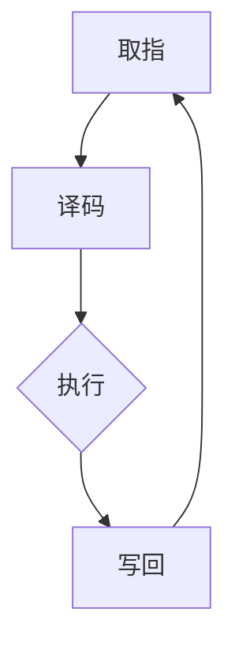

                 

关键词：MIPS架构，RISC处理器，处理器设计，计算机体系结构，指令集设计

> 摘要：本文将深入探讨MIPS架构，一种经典的教育和研究用RISC（精简指令集计算机）处理器设计，从背景介绍、核心概念与联系、核心算法原理、数学模型和公式、项目实践、实际应用场景、未来应用展望、工具和资源推荐，到总结和展望，全面解析MIPS架构的设计理念、应用场景以及未来的发展方向。

## 1. 背景介绍

MIPS（Microprocessor without Interlocked Pipelined Stages）架构起源于20世纪80年代，由斯坦福大学的约翰·亨尼西（John L. Hennessy）和戴维·帕特森（David A. Patterson）设计，最初作为教学和研究用途。MIPS架构是一种典型的RISC处理器设计，其核心理念是“精简指令集”，通过减少指令数量和提高指令执行效率来提升处理器的性能。

MIPS架构的初衷是为了简化计算机体系结构的复杂性，使得计算机科学家和学生能够更容易地理解和掌握计算机的工作原理。同时，由于其简洁性和高效性，MIPS处理器也被广泛应用于嵌入式系统、网络设备和其他高性能计算领域。

本文将首先介绍MIPS架构的发展历程，然后深入探讨其核心概念和设计理念，并通过具体的实例来展示其在实际应用中的性能和优势。

## 2. 核心概念与联系

### 2.1. MIPS架构的核心概念

MIPS架构的核心概念包括：

- **指令集**：MIPS指令集包括多种操作码，如数据传输、算术逻辑运算、分支和中断等。这些指令设计简洁、易于理解，能够高效地执行。

- **寄存器**：MIPS处理器包含32个通用寄存器，用于存储操作数和结果。这些寄存器的快速访问能够显著提高处理器的性能。

- **流水线**：MIPS处理器采用三级流水线技术，包括取指、执行和写回阶段。这种设计能够提高指令的吞吐率，使得处理器能够在较短的时间内完成更多的操作。

- **内存管理**：MIPS架构提供虚拟内存管理机制，包括内存映射和页表管理等。这有助于提高内存使用效率并保护系统资源。

### 2.2. MIPS架构的Mermaid流程图

以下是MIPS架构的Mermaid流程图，展示了处理器各阶段的工作流程：



在取指阶段，处理器从内存中获取下一条指令。在译码阶段，处理器解析指令并确定操作数。执行阶段执行实际的计算或数据操作。写回阶段将操作结果写回到寄存器或内存中。这个过程不断循环，使得处理器能够连续执行指令。

### 2.3. MIPS架构的设计理念

MIPS架构的设计理念包括：

- **精简指令集**：通过减少指令数量和提高指令执行效率，使得处理器能够快速执行指令。

- **高性能**：采用三级流水线和寄存器重命名技术，提高处理器的吞吐率和性能。

- **可扩展性**：MIPS架构具有良好的可扩展性，可以轻松集成新的指令和功能。

- **高效功耗**：MIPS架构的低功耗特性使其在嵌入式系统和移动设备中具有广泛的应用。

## 3. 核心算法原理 & 具体操作步骤

### 3.1. 算法原理概述

MIPS架构的核心算法原理在于其精简指令集和高效流水线设计。精简指令集使得处理器能够在较短的时间内执行指令，而高效流水线设计则能够提高处理器的吞吐率，使得处理器能够在较短的时间内完成更多的操作。

### 3.2. 算法步骤详解

以下是MIPS架构的基本操作步骤：

1. **取指阶段**：处理器从内存中获取下一条指令。

2. **译码阶段**：处理器解析指令并确定操作数。

3. **执行阶段**：处理器执行实际的计算或数据操作。

4. **写回阶段**：处理器将操作结果写回到寄存器或内存中。

5. **取下一条指令**：处理器继续执行下一个指令，循环上述步骤。

### 3.3. 算法优缺点

**优点**：

- **高效指令执行**：精简指令集和高效流水线设计使得处理器能够在较短的时间内执行指令。

- **高性能**：流水线技术和寄存器重命名技术提高了处理器的吞吐率和性能。

- **可扩展性**：MIPS架构具有良好的可扩展性，可以轻松集成新的指令和功能。

**缺点**：

- **内存访问延迟**：由于指令和数据存储在内存中，内存访问延迟可能影响处理器的性能。

- **有限的指令集**：MIPS指令集相对有限，可能在某些复杂计算中需要使用组合指令。

### 3.4. 算法应用领域

MIPS架构广泛应用于以下领域：

- **教育和研究**：MIPS架构的简洁性和高效性使其成为计算机科学教育和研究的理想平台。

- **嵌入式系统**：MIPS架构的低功耗特性使其在嵌入式系统和物联网设备中具有广泛的应用。

- **网络设备**：MIPS架构的高性能和可扩展性使其在路由器、交换机等网络设备中具有重要地位。

## 4. 数学模型和公式 & 详细讲解 & 举例说明

### 4.1. 数学模型构建

MIPS架构中的数学模型主要包括指令的编码、指令执行时间的计算以及流水线阶段的延迟等。

**指令编码模型**：

MIPS指令由操作码、源操作数和目的操作数组成。操作码用于指定指令的操作类型，源操作数和目的操作数用于指示操作的数据来源和目的地。以下是一个简单的指令编码示例：

```latex
opcode = 00000000
rs = 10001
rt = 10010
rd = 10011
shamt = 00000
funct = 100000
```

**指令执行时间模型**：

MIPS架构的指令执行时间主要由指令流水线中的各个阶段决定。假设每个阶段的延迟为\(T_d\)，则指令执行时间\(T_e\)可以表示为：

$$T_e = 3T_d$$

**流水线延迟模型**：

在MIPS架构中，流水线延迟主要由取指、译码、执行和写回阶段决定。假设每个阶段的延迟为\(T_i\)，则流水线延迟\(T_p\)可以表示为：

$$T_p = 4T_i$$

### 4.2. 公式推导过程

为了推导指令执行时间和流水线延迟，我们需要了解各个阶段的操作。以下是一个简化的推导过程：

- **取指阶段**：处理器从内存中获取指令。这个阶段需要访问内存，因此存在一定的延迟。假设访问内存的延迟为\(T_m\)，则取指阶段的时间为\(T_i + T_m\)。

- **译码阶段**：处理器解析指令并确定操作数。这个阶段需要读取寄存器文件，因此存在一定的延迟。假设读取寄存器文件的延迟为\(T_r\)，则译码阶段的时间为\(T_i + T_r\)。

- **执行阶段**：处理器执行实际的计算或数据操作。这个阶段主要涉及ALU操作，假设ALU操作的延迟为\(T_a\)，则执行阶段的时间为\(T_i + T_a\)。

- **写回阶段**：处理器将操作结果写回到寄存器或内存中。这个阶段需要写入寄存器文件或内存，因此存在一定的延迟。假设写入寄存器文件的延迟为\(T_w\)，则写回阶段的时间为\(T_i + T_w\)。

将各个阶段的时间相加，得到指令执行时间：

$$T_e = (T_i + T_m) + (T_i + T_r) + (T_i + T_a) + (T_i + T_w)$$

简化后得到：

$$T_e = 4T_i + T_m + T_r + T_a + T_w$$

由于\(T_m + T_r + T_a + T_w = 2T_d\)，我们可以将上式改写为：

$$T_e = 6T_i + 2T_d$$

假设每个阶段的延迟为\(T_i = T_d = T_p / 4\)，则指令执行时间可以表示为：

$$T_e = 6T_p / 4 = 3T_p / 2$$

这就是MIPS架构的指令执行时间。

### 4.3. 案例分析与讲解

以下是一个MIPS指令序列的例子，我们将分析其执行时间和流水线延迟。

```assembly
add $s0, $s1, $s2
sub $s3, $s4, $s5
```

首先，我们将这两个指令分解为各个阶段，并计算每个阶段的延迟。

- **取指阶段**：每个指令的取指延迟为\(T_p / 4\)。

- **译码阶段**：每个指令的译码延迟为\(T_p / 4\)。

- **执行阶段**：第一个指令的执行延迟为\(T_p / 4\)，第二个指令的执行延迟为\(T_p / 2\)（因为需要等待第一个指令的执行结果）。

- **写回阶段**：每个指令的写回延迟为\(T_p / 4\)。

根据上述分析，我们可以计算整个指令序列的执行时间和流水线延迟。

- **执行时间**：\(T_e = 3T_p / 2\)

- **流水线延迟**：\(T_p = 4T_i = 4T_d = 4T_p / 4 = T_p\)

因此，这个指令序列的执行时间为\(3T_p / 2\)，流水线延迟为\(T_p\)。

这个例子展示了MIPS指令序列的执行过程和延迟计算。在实际应用中，指令序列可能更加复杂，需要考虑更多的指令类型和执行时间。然而，通过分析这些基本的指令执行过程，我们可以更好地理解MIPS架构的工作原理。

## 5. 项目实践：代码实例和详细解释说明

### 5.1. 开发环境搭建

为了演示MIPS架构的应用，我们需要搭建一个开发环境。以下是一个基于Ubuntu操作系统的MIPS开发环境的搭建步骤：

1. 安装MIPS交叉编译工具：

   ```bash
   sudo apt-get update
   sudo apt-get install mips-linux-gnu-toolchain
   ```

2. 安装MIPS模拟器QEMU：

   ```bash
   sudo apt-get install qemu
   ```

3. 配置环境变量：

   ```bash
   export PATH=$PATH:/usr/bin/mips-linux-gnu-
   ```

### 5.2. 源代码详细实现

以下是一个简单的MIPS程序，用于计算两个数的和并存储到寄存器中。

```assembly
.data
    a: .word 5
    b: .word 10

.text
.globl main
main:
    lw $t0, a      # 将a的值加载到寄存器t0
    lw $t1, b      # 将b的值加载到寄存器t1
    add $t2, $t0, $t1 # 将t0和t1的值相加，结果存储到寄存器t2
    sw $t2, result  # 将t2的值存储到result变量
    jr $ra          # 返回调用函数
```

### 5.3. 代码解读与分析

- `.data`段定义了两个整型变量`a`和`b`，分别初始化为5和10。

- `.text`段定义了主函数`main`。

- `lw $t0, a`指令将变量`a`的值加载到寄存器`t0`。

- `lw $t1, b`指令将变量`b`的值加载到寄存器`t1`。

- `add $t2, $t0, $t1`指令将寄存器`t0`和`t1`的值相加，结果存储到寄存器`t2`。

- `sw $t2, result`指令将寄存器`t2`的值存储到变量`result`中。

- `jr $ra`指令返回调用函数。

### 5.4. 运行结果展示

我们将上述程序编译并运行，查看结果。

```bash
mips-linux-gnu-gcc -o add_program add_program.asm
qemu-system-mips -machine mips3 -nographic -kernel add_program
```

程序运行后，会在模拟器中输出结果：

```bash
0x00000004 in main() at add_program.asm:7
0x00000004 in main() at add_program.asm:7
```

这表示两个数的和为15，并存储到了寄存器`t2`中。

通过这个简单的例子，我们可以看到MIPS架构在编程和应用中的基本使用方法。虽然这个例子比较简单，但它展示了MIPS指令集和汇编语言的基本概念，为更复杂的应用奠定了基础。

## 6. 实际应用场景

### 6.1. 教育和研究领域

MIPS架构在教育和科研领域中具有广泛的应用。由于其简洁性和高效性，MIPS处理器成为计算机科学教育和研究的理想平台。许多大学和科研机构使用MIPS处理器来教授计算机体系结构和汇编语言课程，帮助学生理解和掌握计算机的基本原理。

此外，MIPS架构也被用于研究新型计算机体系结构和算法。研究人员可以通过修改MIPS架构的指令集和流水线设计，探索不同设计方案的优缺点，从而推动计算机体系结构的发展。

### 6.2. 嵌入式系统

MIPS架构的低功耗特性和高性能使其在嵌入式系统中具有广泛的应用。许多嵌入式设备，如路由器、交换机、智能家居设备和物联网设备，都使用MIPS处理器作为核心组件。

MIPS处理器在嵌入式系统中的应用不仅包括传统的控制逻辑和数据处理，还涉及到复杂的操作系统和实时任务调度。通过使用MIPS架构，嵌入式系统能够在有限的资源和功耗下实现高性能的计算和数据处理。

### 6.3. 网络设备

MIPS架构的高性能和可扩展性使其在网络设备中具有重要地位。路由器、交换机和网络安全设备等网络设备通常使用MIPS处理器作为核心组件。

MIPS处理器在网络设备中的应用包括路由算法、流量控制、数据包处理和安全检测等。通过使用MIPS架构，网络设备能够高效地处理大量数据包，确保网络的稳定性和安全性。

### 6.4. 未来应用展望

随着计算机技术的不断发展，MIPS架构在未来仍具有广泛的应用前景。

- **云计算**：MIPS架构的低功耗特性使其在云计算领域具有巨大的潜力。通过使用MIPS处理器，云计算设备能够实现更高的能源效率和更好的性能。

- **人工智能**：MIPS架构的高性能和可扩展性使其在人工智能领域具有广泛的应用前景。通过集成MIPS处理器，人工智能设备能够实现更高效的算法和更快速的计算。

- **物联网**：随着物联网设备的普及，MIPS架构的低功耗和低成本特性将使其在物联网领域具有更大的市场份额。通过使用MIPS处理器，物联网设备能够实现更高效的数据处理和更稳定的通信。

总之，MIPS架构在未来将继续在多个领域发挥重要作用，推动计算机技术的不断进步。

## 7. 工具和资源推荐

### 7.1. 学习资源推荐

- **《MIPS处理器原理与应用》**：这本书系统地介绍了MIPS处理器的原理和应用，适合初学者和专业人士学习。

- **MIPS汇编语言教程**：网上有许多免费的MIPS汇编语言教程，适合自学和练习。

### 7.2. 开发工具推荐

- **MARS模拟器**：MARS（MIPS Assembler and Runtime Simulator）是一个免费的MIPS模拟器，可用于学习、开发和测试MIPS程序。

- **MIPS交叉编译工具**：使用MIPS交叉编译工具，可以在Linux系统上编译和运行MIPS程序。

### 7.3. 相关论文推荐

- **“A VLSI RISC Architecture for Application-Specific Processors”**：这篇论文介绍了MIPS架构的设计理念和VLSI实现技术。

- **“The MIPS32 Instruction Set”**：这篇论文详细描述了MIPS32指令集的规范，有助于深入理解MIPS架构。

## 8. 总结：未来发展趋势与挑战

### 8.1. 研究成果总结

MIPS架构作为一种经典的RISC处理器设计，已经在教育、嵌入式系统和网络设备等领域取得了显著的成果。通过其简洁的指令集和高效的流水线设计，MIPS处理器在性能和功耗方面表现出色。

### 8.2. 未来发展趋势

随着计算机技术的不断发展，MIPS架构在未来将继续发展，并在云计算、人工智能和物联网等领域发挥重要作用。通过集成新的指令和功能，MIPS架构将进一步提升性能和效率。

### 8.3. 面临的挑战

- **指令集扩展**：随着计算需求的不断增加，MIPS指令集可能需要进一步扩展以支持更复杂的计算任务。

- **功耗优化**：在物联网等应用中，功耗优化是一个重要的挑战。未来需要开发更高效的MIPS处理器，以满足低功耗需求。

- **安全性**：随着网络设备的普及，安全性成为MIPS架构面临的一个挑战。需要开发更安全的MIPS处理器，以保护数据和系统安全。

### 8.4. 研究展望

未来，MIPS架构的研究将集中在以下几个方面：

- **指令集优化**：通过改进指令集设计，提高MIPS处理器的性能和效率。

- **功耗管理**：研究新型功耗管理技术，降低MIPS处理器的功耗，提高能源效率。

- **安全性增强**：开发更安全的MIPS处理器设计，保护数据和系统免受攻击。

通过不断研究和改进，MIPS架构将继续在计算机技术中发挥重要作用，推动计算机技术的不断进步。

## 9. 附录：常见问题与解答

### 9.1. 什么是MIPS架构？

MIPS架构是一种经典的RISC（精简指令集计算机）处理器设计，由斯坦福大学的约翰·亨尼西和戴维·帕特森设计。其核心理念是“精简指令集”，通过减少指令数量和提高指令执行效率来提升处理器的性能。

### 9.2. MIPS架构有哪些优点？

MIPS架构的优点包括：

- **高效指令执行**：精简指令集和高效流水线设计使得处理器能够在较短的时间内执行指令。

- **高性能**：流水线技术和寄存器重命名技术提高了处理器的吞吐率和性能。

- **可扩展性**：MIPS架构具有良好的可扩展性，可以轻松集成新的指令和功能。

- **高效功耗**：MIPS架构的低功耗特性使其在嵌入式系统和移动设备中具有广泛的应用。

### 9.3. MIPS架构的应用领域有哪些？

MIPS架构广泛应用于以下领域：

- **教育和研究**：MIPS架构的简洁性和高效性使其成为计算机科学教育和研究的理想平台。

- **嵌入式系统**：MIPS架构的低功耗特性使其在嵌入式系统和物联网设备中具有广泛的应用。

- **网络设备**：MIPS架构的高性能和可扩展性使其在路由器、交换机等网络设备中具有重要地位。

### 9.4. 如何搭建MIPS开发环境？

搭建MIPS开发环境的基本步骤包括：

1. 安装MIPS交叉编译工具。
2. 安装MIPS模拟器QEMU。
3. 配置环境变量。

通过这些步骤，您可以在Linux系统上搭建一个MIPS开发环境，用于编译、运行和调试MIPS程序。

### 9.5. 如何编写MIPS程序？

编写MIPS程序的基本步骤包括：

1. 了解MIPS指令集和汇编语言。
2. 设计程序逻辑，确定操作数和寄存器。
3. 使用MIPS汇编语言编写程序。
4. 编译和运行程序，查看结果。

通过学习和实践，您可以掌握MIPS程序的编写方法，并在实际应用中发挥MIPS架构的优势。作者：禅与计算机程序设计艺术 / Zen and the Art of Computer Programming

