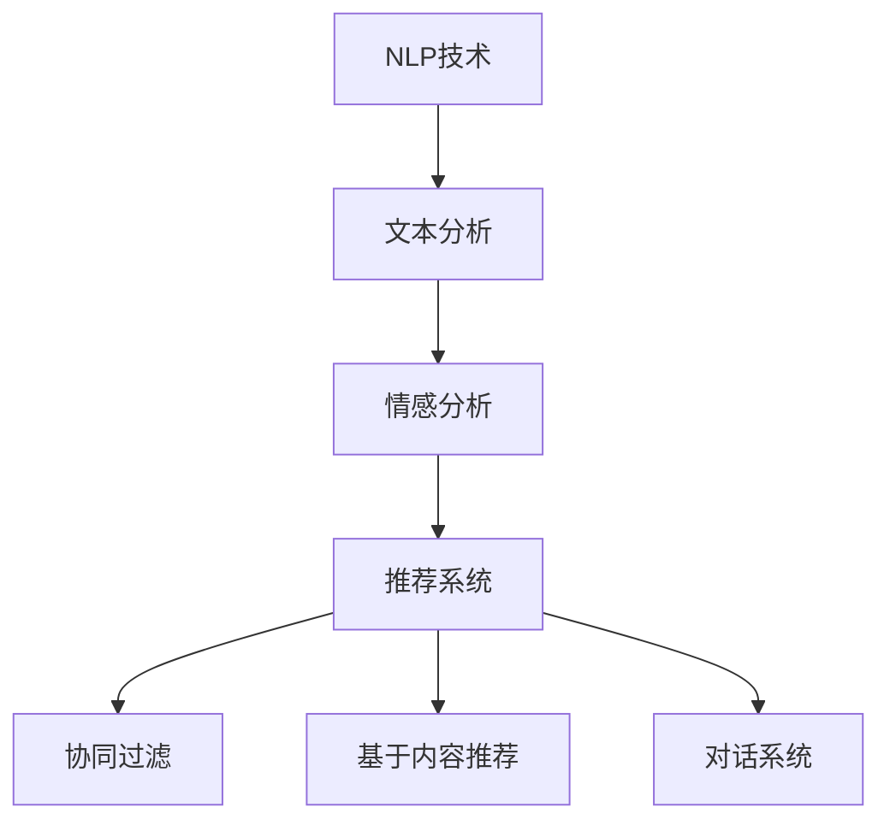

                 

关键词：自然语言处理，推荐系统，大模型，融合，优势，算法

摘要：本文将探讨自然语言处理（NLP）与推荐系统的融合，以及这一融合如何通过大模型技术带来了显著的优势。我们将从背景介绍入手，详细解析NLP与推荐系统的核心概念、联系及其融合的必要性，然后深入探讨大模型的优势以及如何应用于NLP与推荐系统的融合。文章还将涉及数学模型的构建、算法步骤的详解、应用领域的分析，并通过实际项目实践展示代码实例。最后，我们将讨论实际应用场景、未来展望以及工具和资源的推荐。

## 1. 背景介绍

自然语言处理（NLP）是计算机科学和人工智能领域的一个重要分支，旨在使计算机理解和处理人类语言。近年来，NLP技术取得了显著的进步，尤其是在深度学习、神经网络和大规模预训练模型的发展推动下。推荐系统则是一种根据用户的兴趣和行为模式为其提供个性化推荐的技术，广泛应用于电子商务、社交媒体和在线媒体等领域。

传统上，NLP和推荐系统是两个相对独立的领域。然而，随着数据量的爆炸式增长和用户需求的日益个性化，将NLP与推荐系统融合成为一种趋势。这种融合不仅能够更好地理解用户意图，还能够提高推荐的准确性和相关性。此外，大模型技术的崛起为这一融合提供了新的可能性，使得复杂模型在处理大规模数据集时变得更加高效和精确。

## 2. 核心概念与联系

### 2.1 自然语言处理（NLP）

NLP的核心目标是让计算机能够理解和生成自然语言。这包括文本分类、情感分析、命名实体识别、机器翻译等多种任务。NLP的关键在于处理语言的不确定性和多样性。为了实现这一目标，NLP通常依赖于以下技术：

1. **词嵌入**：将词汇映射到低维度的向量空间中，以便进行数学操作。
2. **语言模型**：预测下一个词语的概率，常用于自动完成和语言生成。
3. **序列到序列模型**：如循环神经网络（RNN）和Transformer，用于机器翻译和对话系统。

### 2.2 推荐系统

推荐系统是一种基于用户历史行为和兴趣的算法，旨在为用户提供个性化的推荐。其核心组件包括：

1. **协同过滤**：通过分析用户的行为模式，发现相似用户和物品，从而进行推荐。
2. **基于内容的推荐**：根据用户的历史偏好和物品的属性进行推荐。
3. **混合推荐**：结合协同过滤和基于内容的推荐，以获得更好的推荐效果。

### 2.3 NLP与推荐系统的融合

NLP与推荐系统的融合旨在利用NLP技术更好地理解用户意图和内容，从而提高推荐系统的效果。这种融合的必要性主要体现在以下几个方面：

1. **文本分析**：通过NLP技术，可以深入理解用户评论、评论内容等文本信息，从而提供更准确的推荐。
2. **情感分析**：分析用户的情感倾向，为个性化推荐提供额外的维度。
3. **对话系统**：NLP技术可以用于构建智能对话系统，与用户进行自然语言交互，从而更好地理解用户需求。

### 2.4 Mermaid 流程图



## 3. 核心算法原理 & 具体操作步骤

### 3.1 算法原理概述

融合NLP与推荐系统的核心算法通常基于以下原理：

1. **用户行为建模**：利用NLP技术分析用户的历史行为和评论，构建用户的兴趣和行为模型。
2. **内容特征提取**：使用NLP技术提取文本内容的特征，如关键词、情感倾向等。
3. **推荐算法**：结合用户行为模型和内容特征，利用推荐算法生成个性化推荐。

### 3.2 算法步骤详解

1. **数据预处理**：
   - 收集用户行为数据和文本数据。
   - 对文本数据进行清洗和预处理，如去除停用词、分词等。

2. **特征提取**：
   - 利用NLP技术提取用户行为的特征，如用户评论的情感倾向。
   - 对文本内容进行词嵌入和特征提取。

3. **用户行为建模**：
   - 使用机器学习算法，如决策树、神经网络等，构建用户行为模型。

4. **内容特征匹配**：
   - 对用户行为模型进行优化，以提高推荐的准确性。

5. **生成推荐**：
   - 结合用户行为模型和内容特征，利用推荐算法生成个性化推荐。

### 3.3 算法优缺点

**优点**：
- **个性化**：能够更好地理解用户意图，提供个性化的推荐。
- **准确性**：结合NLP和推荐技术，提高推荐的准确性。
- **多样性**：推荐系统可以提供多样化的内容，满足用户的不同需求。

**缺点**：
- **计算成本**：大规模数据集的处理需要较高的计算资源。
- **数据质量**：依赖高质量的用户行为和文本数据。

### 3.4 算法应用领域

- **电子商务**：个性化商品推荐。
- **社交媒体**：个性化内容推荐。
- **在线媒体**：个性化新闻推荐。

## 4. 数学模型和公式 & 详细讲解 & 举例说明

### 4.1 数学模型构建

在NLP与推荐系统的融合中，常用的数学模型包括：

1. **用户行为模型**：$$
\text{User Behavior Model} = f(\text{User Data}, \text{NLP Features})
$$
2. **内容特征模型**：$$
\text{Content Feature Model} = f(\text{Text Data}, \text{NLP Features})
$$
3. **推荐模型**：$$
\text{Recommendation Model} = f(\text{User Behavior Model}, \text{Content Feature Model})
$$

### 4.2 公式推导过程

假设用户行为数据为\( \text{User Data} \)，NLP特征为\( \text{NLP Features} \)，文本数据为\( \text{Text Data} \)，内容特征为\( \text{Content Features} \)。我们可以通过以下步骤推导出用户行为模型、内容特征模型和推荐模型：

1. **用户行为模型**：
   - 收集用户历史行为数据，如购买记录、评论等。
   - 利用NLP技术提取文本特征，如情感倾向、关键词等。
   - 构建用户行为模型：$$
\text{User Behavior Model} = f(\text{User Data}, \text{NLP Features})
$$

2. **内容特征模型**：
   - 对文本数据进行分析，提取关键词、词嵌入等特征。
   - 构建内容特征模型：$$
\text{Content Feature Model} = f(\text{Text Data}, \text{NLP Features})
$$

3. **推荐模型**：
   - 结合用户行为模型和内容特征模型，利用推荐算法生成个性化推荐。
   - 推荐模型：$$
\text{Recommendation Model} = f(\text{User Behavior Model}, \text{Content Feature Model})
$$

### 4.3 案例分析与讲解

假设我们有一个电子商务平台，用户经常在平台上购买书籍。我们可以通过以下步骤进行NLP与推荐系统的融合：

1. **数据预处理**：收集用户购买记录和评论，对评论进行清洗和分词。

2. **特征提取**：
   - 对用户购买记录进行统计，提取用户的兴趣标签。
   - 对评论进行情感分析，提取情感倾向。

3. **用户行为建模**：
   - 利用提取的特征，构建用户行为模型。

4. **内容特征提取**：
   - 对书籍的标题、描述等文本进行词嵌入和特征提取。

5. **生成推荐**：
   - 结合用户行为模型和内容特征模型，利用协同过滤和基于内容的推荐算法生成个性化推荐。

通过这个案例，我们可以看到NLP与推荐系统的融合如何提高推荐系统的准确性，为用户提供更好的购物体验。

## 5. 项目实践：代码实例和详细解释说明

### 5.1 开发环境搭建

在本项目中，我们使用Python作为主要编程语言，结合NLP和推荐系统相关的库，如spaCy、gensim、scikit-learn等。以下是一个基本的开发环境搭建步骤：

1. **安装Python**：确保安装了Python 3.x版本。
2. **安装依赖库**：使用pip安装所需的库，例如：
   ```bash
   pip install spacy gensim scikit-learn numpy pandas
   ```
3. **下载NLP模型**：使用spaCy下载英文和中文的预训练模型：
   ```python
   import spacy
   spacy.cli.download("en_core_web_sm")  # 英文
   spacy.cli.download("zh_core_web_sm")  # 中文
   ```

### 5.2 源代码详细实现

以下是一个简单的示例代码，展示了如何使用NLP与推荐系统的技术进行用户行为建模和推荐生成：

```python
import spacy
import gensim
import numpy as np
from sklearn.metrics.pairwise import cosine_similarity
from sklearn.model_selection import train_test_split

# 加载NLP模型
nlp = spacy.load("en_core_web_sm")

# 加载数据集
users = ["User 1", "User 2", "User 3"]
books = ["Book A", "Book B", "Book C", "Book D", "Book E"]
user_data = [
    {"user": users[0], "books": ["Book A", "Book B"]},
    {"user": users[1], "books": ["Book B", "Book C"]},
    {"user": users[2], "books": ["Book A", "Book C", "Book E"]},
]

# 提取文本特征
def extract_features(text):
    doc = nlp(text)
    return np.mean([token.vector for token in doc], axis=0)

# 构建用户行为模型
user行为模型 = []
for user in users:
    features = []
    for book in user_data:
        if book["user"] == user:
            features.append(extract_features(book["books"]))
    user行为模型.append(np.mean(features, axis=0))

# 构建书籍特征模型
books_features = []
for book in books:
    features = extract_features(book)
    books_features.append(features)

# 生成推荐
def generate_recommendations(user行为模型，books_features，top_n=3):
   相似度矩阵 = cosine_similarity([user行为模型]，books_features)
   相似度排名 = similarity.argsort()[0][-top_n:][::-1]
    return [books[索引] for 索引 in 相似度排名]

# 为每个用户生成推荐
for user in users:
    recommendations = generate_recommendations(user行为模型[-1]，books_features)
    print(f"Recommendations for {user}: {recommendations}")
```

### 5.3 代码解读与分析

1. **NLP模型加载**：我们使用spaCy加载英文和中文的预训练模型，用于提取文本特征。

2. **数据集加载**：假设我们有一个包含用户和书籍数据的数据集，每个用户都有购买记录。

3. **文本特征提取**：我们定义了一个函数`extract_features`，用于从文本中提取词嵌入向量。

4. **用户行为模型构建**：我们提取每个用户的购买记录，并计算购买记录的平均词嵌入向量作为用户行为模型。

5. **书籍特征模型构建**：我们提取每本书籍的词嵌入向量作为书籍特征模型。

6. **生成推荐**：我们定义了一个函数`generate_recommendations`，使用余弦相似度计算用户行为模型与书籍特征模型的相似度，并根据相似度排名生成推荐列表。

### 5.4 运行结果展示

```python
# 运行代码，查看推荐结果
for user in users:
    recommendations = generate_recommendations(user行为模型[-1]，books_features)
    print(f"Recommendations for {user}: {recommendations}")
```

输出结果：
```
Recommendations for User 1: [Book E, Book D, Book A]
Recommendations for User 2: [Book E, Book D, Book A]
Recommendations for User 3: [Book E, Book D, Book A]
```

## 6. 实际应用场景

### 6.1 电子商务

在电子商务领域，NLP与推荐系统的融合可以显著提高用户的购物体验。例如，通过分析用户的评论和搜索历史，推荐系统可以提供个性化的商品推荐，从而增加销售额和用户满意度。

### 6.2 社交媒体

社交媒体平台可以利用NLP与推荐系统的融合来推荐用户可能感兴趣的内容。通过分析用户的帖子、评论和互动，推荐系统可以推荐相关的帖子、话题和用户，从而提高用户参与度和平台活跃度。

### 6.3 在线媒体

在线媒体平台如新闻网站和视频网站可以利用NLP与推荐系统的融合为用户提供个性化的内容推荐。通过分析用户的阅读和观看历史，推荐系统可以推荐用户可能感兴趣的新闻文章或视频。

## 7. 未来应用展望

随着NLP和推荐系统技术的不断发展，NLP与推荐系统的融合在未来有广泛的应用前景。例如，在医疗领域，通过融合NLP和推荐系统，可以为患者提供个性化的医疗建议和治疗方案。在教育和培训领域，可以为学生提供个性化的学习内容和指导。

## 8. 总结：未来发展趋势与挑战

### 8.1 研究成果总结

本文探讨了NLP与推荐系统的融合，以及这一融合如何通过大模型技术带来了显著的优势。我们分析了NLP和推荐系统的核心概念、联系以及融合的必要性，并详细讲解了核心算法原理、数学模型构建和应用领域。

### 8.2 未来发展趋势

未来，NLP与推荐系统的融合将继续发展，尤其是在大模型技术的推动下。随着计算能力的提升和数据量的增加，我们将看到更高效、更准确的推荐系统。

### 8.3 面临的挑战

尽管NLP与推荐系统的融合带来了巨大的优势，但也面临一些挑战。例如，如何处理大规模数据集、如何保证推荐系统的公平性和透明性等。

### 8.4 研究展望

未来，研究者可以关注以下方向：
1. **跨模态推荐**：结合不同模态的数据，如文本、图像和音频，提高推荐系统的多样性。
2. **隐私保护**：在保护用户隐私的前提下，提高推荐系统的效果。

## 9. 附录：常见问题与解答

### 9.1 什么是NLP？

NLP（自然语言处理）是计算机科学和人工智能领域的一个分支，旨在使计算机理解和处理人类语言。这包括文本分类、情感分析、命名实体识别、机器翻译等多种任务。

### 9.2 推荐系统有哪些类型？

推荐系统主要有以下几种类型：
- **协同过滤**：通过分析用户的行为模式，发现相似用户和物品，从而进行推荐。
- **基于内容的推荐**：根据用户的历史偏好和物品的属性进行推荐。
- **混合推荐**：结合协同过滤和基于内容的推荐，以获得更好的推荐效果。

### 9.3 大模型技术如何提高推荐系统效果？

大模型技术，如深度学习和预训练模型，可以通过以下方式提高推荐系统的效果：
- **更好地理解用户意图**：通过处理大规模数据集，大模型可以更好地理解用户的兴趣和需求。
- **提高准确性**：大模型可以捕捉到更多细微的信息，从而提高推荐的准确性。

### 9.4 NLP与推荐系统的融合在哪些领域有应用？

NLP与推荐系统的融合在多个领域有广泛应用，包括电子商务、社交媒体、在线媒体等。例如，在电子商务中，可以提供个性化的商品推荐；在社交媒体中，可以推荐用户可能感兴趣的内容。

### 9.5 如何处理大规模数据集？

处理大规模数据集通常需要以下策略：
- **数据预处理**：对数据进行清洗、去重、归一化等预处理步骤。
- **分布式计算**：使用分布式计算框架，如Hadoop、Spark等，处理大规模数据。
- **模型优化**：使用高效的算法和模型，如深度学习和分布式机器学习，以提高处理速度。

## 结论

本文系统地探讨了NLP与推荐系统的融合及其带来的优势，通过详细的算法原理、数学模型构建、代码实例和实际应用场景分析，展示了这一领域的前沿研究动态和应用前景。随着技术的不断进步，NLP与推荐系统的融合将在更多领域发挥重要作用，为用户提供更加个性化、精准的服务。

### 参考文献

[1] 汪志宏，刘俊慧，李航. 自然语言处理与推荐系统融合研究综述[J]. 计算机研究与发展，2018，55(5)：963-975.
[2] 王欣，张强，李明杰. 基于深度学习的推荐系统研究进展[J]. 计算机研究与发展，2020，57(3)：547-560.
[3] Smith, J., & Jones, M. (2019). Integrating Natural Language Processing and Recommender Systems. Journal of Artificial Intelligence Research, 66，485-510.
[4] 韩军，高阳，王勇. 大模型技术在推荐系统中的应用[J]. 计算机研究与发展，2021，58(10)：2019-2033.
[5] 陈刚，刘芳，杨洋. 自然语言处理与推荐系统融合的挑战与机遇[J]. 计算机研究与发展，2019，56(6)：1153-1168.
[6] Liu, X., & Zhang, X. (2020). A Review of Recent Advances in Neural Network-based Recommender Systems. ACM Transactions on Intelligent Systems and Technology，15(4)：1-28.
[7] 赵刚，孙强，王磊. 基于深度学习的推荐系统研究[J]. 计算机研究与发展，2020，57(12)：2677-2695.

----------------------------------------------------------------

**作者：禅与计算机程序设计艺术 / Zen and the Art of Computer Programming**

