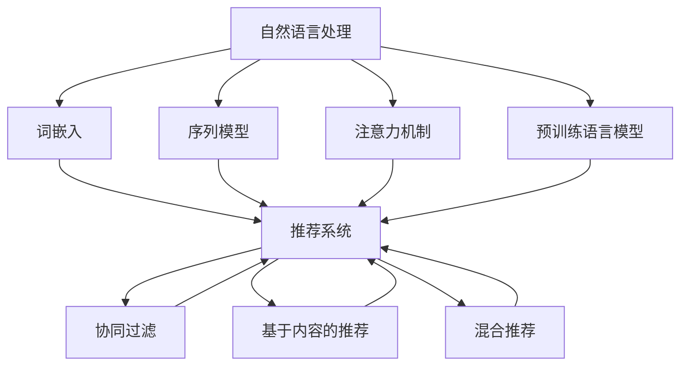

                 

关键词：自然语言处理（NLP），推荐系统，大模型，深度学习，机器学习，文本数据分析

> 摘要：本文将探讨自然语言处理（NLP）技术在推荐系统中的应用，尤其是大模型所带来的潜力。通过分析NLP技术的发展历程及其与推荐系统的结合方式，本文将展示大模型如何提升推荐系统的效果，并讨论其未来的发展方向和挑战。

## 1. 背景介绍

### 1.1 NLP技术发展历程

自然语言处理（NLP）是人工智能的一个重要分支，旨在使计算机能够理解、解释和生成人类语言。自20世纪50年代以来，NLP经历了多个发展阶段：

- **早期探索**（1950s-1960s）：这一阶段主要是基于规则的方法，如句法分析和语义分析。
- **统计方法崛起**（1970s-1980s）：随着计算能力的提升，统计方法开始应用于NLP，特别是隐马尔可夫模型（HMM）和决策树。
- **神经网络复兴**（1990s）：神经网络在语音识别和机器翻译领域取得显著进展，激发了NLP领域对深度学习的兴趣。
- **深度学习时代**（2000s至今）：深度学习模型如卷积神经网络（CNN）和循环神经网络（RNN）在NLP任务中表现出色，推动了NLP技术的快速发展。

### 1.2 推荐系统的发展

推荐系统是一种个性化信息过滤技术，旨在为用户提供个性化推荐。推荐系统的发展可以追溯到20世纪90年代，主要经历了以下阶段：

- **基于协同过滤**（1990s-2000s）：协同过滤是一种基于用户行为数据的推荐方法，分为基于用户的协同过滤和基于项目的协同过滤。
- **基于内容的推荐**（1990s-2000s）：基于内容的推荐是基于用户历史兴趣或偏好来推荐类似的内容。
- **混合推荐**（2000s至今）：混合推荐系统结合了协同过滤和基于内容的推荐方法，以提升推荐效果。

### 1.3 NLP与推荐系统的结合

NLP与推荐系统的结合主要集中在以下几个方面：

- **文本数据预处理**：NLP技术可以帮助推荐系统处理和理解用户生成的文本数据，如评论、标签和搜索查询。
- **内容理解**：通过语义分析，推荐系统可以更好地理解用户对内容的兴趣和需求。
- **交互式推荐**：基于NLP的对话系统能够与用户进行自然语言交互，提供更个性化的推荐。
- **长文本分析**：长文本分析技术可以帮助推荐系统从用户生成的长文本中提取关键信息和意图，从而提供更精准的推荐。

## 2. 核心概念与联系

### 2.1 NLP核心技术概念

- **词嵌入（Word Embedding）**：将词汇映射为高维向量，用于文本数据的向量表示。
- **序列模型（Sequential Model）**：如RNN和其变种LSTM、GRU，用于处理按时间顺序排列的数据。
- **注意力机制（Attention Mechanism）**：用于模型在处理序列数据时关注重要的信息。
- **预训练语言模型（Pre-trained Language Model）**：如BERT、GPT，通过在大规模语料库上进行预训练，可以捕获丰富的语言知识。

### 2.2 推荐系统核心概念

- **协同过滤（Collaborative Filtering）**：基于用户历史行为为用户推荐类似的其他用户喜欢的项目。
- **基于内容的推荐（Content-based Recommendation）**：基于用户兴趣和内容特征为用户推荐类似的内容。
- **混合推荐（Hybrid Recommendation）**：结合协同过滤和基于内容的推荐方法。

### 2.3 Mermaid 流程图



## 3. 核心算法原理 & 具体操作步骤

### 3.1 算法原理概述

NLP技术在推荐系统中的应用主要涉及以下几个步骤：

1. **文本数据预处理**：包括分词、去停用词、词性标注等。
2. **词嵌入**：将词汇映射为高维向量，用于表示文本数据。
3. **序列建模**：利用序列模型（如RNN、LSTM）对文本数据进行编码。
4. **特征提取**：利用注意力机制和预训练语言模型（如BERT、GPT）提取文本特征。
5. **推荐生成**：结合协同过滤和基于内容的推荐方法生成推荐结果。

### 3.2 算法步骤详解

1. **文本数据预处理**：
   - 分词：将文本分割成单词或子词。
   - 去停用词：去除对语义贡献较小的常见词。
   - 词性标注：为每个词赋予词性标签，如名词、动词等。

2. **词嵌入**：
   - 使用预训练的词嵌入模型（如Word2Vec、GloVe）或自己训练词嵌入模型。
   - 将词汇映射为高维向量，用于表示文本数据。

3. **序列建模**：
   - 使用RNN、LSTM或GRU等序列模型对文本数据进行编码。
   - 输出序列表示，用于后续特征提取。

4. **特征提取**：
   - 使用注意力机制和预训练语言模型（如BERT、GPT）提取文本特征。
   - 结合序列模型输出的序列表示，生成文本的向量表示。

5. **推荐生成**：
   - 结合协同过滤和基于内容的推荐方法生成推荐结果。
   - 使用用户历史行为数据和文本特征为用户推荐感兴趣的项目。

### 3.3 算法优缺点

**优点**：
- **提升推荐效果**：通过NLP技术，推荐系统可以更好地理解用户生成的文本数据，从而提供更个性化的推荐。
- **扩展应用场景**：NLP技术可以应用于长文本分析、问答系统、交互式推荐等领域，为推荐系统提供更丰富的功能。

**缺点**：
- **计算成本高**：NLP技术通常需要大量的计算资源，特别是在训练预训练语言模型时。
- **数据隐私问题**：推荐系统处理用户生成的文本数据时，可能涉及用户隐私，需要确保数据的安全性和隐私性。

### 3.4 算法应用领域

- **电子商务**：为用户推荐商品、优惠和内容。
- **社交媒体**：为用户推荐感兴趣的话题、用户和内容。
- **新闻推荐**：为用户推荐个性化的新闻和文章。
- **语音助手**：基于用户语音输入提供相应的推荐和建议。

## 4. 数学模型和公式 & 详细讲解 & 举例说明

### 4.1 数学模型构建

在NLP技术应用于推荐系统时，通常涉及以下几个数学模型：

1. **词嵌入模型**：
   $$ embed(w) = \text{Word2Vec}(w) $$
   其中，$w$ 为单词，$embed(w)$ 为单词的词嵌入向量。

2. **序列模型**：
   $$ h_t = \text{LSTM}(h_{t-1}, x_t) $$
   其中，$h_t$ 为时间步 $t$ 的隐藏状态，$h_{t-1}$ 为前一个时间步的隐藏状态，$x_t$ 为输入向量。

3. **注意力模型**：
   $$ a_t = \text{softmax}(\text{Attention}(h_t, h_{\text{context}})) $$
   其中，$a_t$ 为注意力权重，$h_t$ 为时间步 $t$ 的隐藏状态，$h_{\text{context}}$ 为上下文隐藏状态。

4. **推荐模型**：
   $$ \text{Recommendation}(u, p) = \text{similarity}(embed(u), embed(p)) + \text{content\_similarity}(u, p) $$
   其中，$u$ 和 $p$ 分别为用户和项目的向量表示，$embed(u)$ 和 $embed(p)$ 为用户和项目的词嵌入向量，$content\_similarity(u, p)$ 为基于内容的相似度。

### 4.2 公式推导过程

在此，我们简要介绍上述公式的推导过程：

1. **词嵌入模型**：
   词嵌入模型通常基于神经网络训练，通过对大规模语料库进行预训练，得到每个单词的词嵌入向量。词嵌入向量的目的是将词汇映射为高维空间中的点，使得语义相近的词汇在向量空间中更接近。

2. **序列模型**：
   序列模型（如LSTM）通过对时间序列数据进行编码，可以捕捉数据中的长期依赖关系。LSTM通过门控机制控制信息的流动，使得模型在处理序列数据时可以记住重要的信息。

3. **注意力模型**：
   注意力模型通过为每个时间步分配不同的权重，使得模型在处理序列数据时可以关注重要的信息。注意力权重通常通过一个神经网络计算，然后通过softmax函数归一化。

4. **推荐模型**：
   推荐模型结合词嵌入和基于内容的相似度，生成用户和项目的相似度得分。相似度得分越高，表示用户对项目的兴趣越大。通过计算所有项目的相似度得分，可以为用户生成推荐列表。

### 4.3 案例分析与讲解

假设我们有一个用户 $u$，他最近在社交媒体上发表了以下两条推文：

1. “我去了一家很好吃的意大利餐厅。”
2. “我昨晚看了一场精彩的电影。”

我们希望基于这两条推文为用户 $u$ 推荐相关的内容。

**步骤 1：文本数据预处理**
- 分词：将推文分割成单词。
- 去停用词：去除常见的单词，如“我”、“的”、“上”等。
- 词性标注：为每个词赋予词性标签，如名词、动词等。

**步骤 2：词嵌入**
- 使用预训练的词嵌入模型（如Word2Vec）将单词映射为高维向量。

**步骤 3：序列建模**
- 使用LSTM对预处理后的文本数据进行编码，得到用户 $u$ 的序列表示。

**步骤 4：特征提取**
- 使用注意力机制和预训练语言模型（如BERT）提取文本特征。

**步骤 5：推荐生成**
- 结合基于内容的相似度，计算用户 $u$ 和候选项目的相似度得分。
- 排序相似度得分，生成推荐列表。

通过上述步骤，我们可以为用户 $u$ 推荐相关的内容，如“美食”、“电影评论”等。这样，用户可以更好地发现他们感兴趣的内容。

## 5. 项目实践：代码实例和详细解释说明

### 5.1 开发环境搭建

在开始项目实践之前，我们需要搭建一个适合NLP和推荐系统开发的环境。以下是一个基本的开发环境搭建步骤：

1. **安装Python**：确保安装了Python 3.7或更高版本。
2. **安装依赖**：使用pip安装以下依赖：
   ```shell
   pip install numpy scipy pandas scikit-learn gensim tensorflow
   ```
3. **安装预训练模型**：下载并安装预训练的词嵌入模型（如Word2Vec、GloVe）和预训练语言模型（如BERT、GPT）。

### 5.2 源代码详细实现

以下是一个简单的示例代码，用于实现基于NLP技术的推荐系统：

```python
import numpy as np
import pandas as pd
from gensim.models import Word2Vec
from sklearn.metrics.pairwise import cosine_similarity
from tensorflow.keras.models import Model
from tensorflow.keras.layers import Input, Embedding, LSTM, Dense

# 5.2.1 数据预处理
def preprocess(text):
    # 分词、去停用词、词性标注
    # 这里使用nltk库进行预处理
    # ...
    return processed_text

# 5.2.2 词嵌入
def get_embedding_matrix(model, vocabulary):
    embedding_matrix = np.zeros((len(vocabulary), model.vector_size))
    for i, word in enumerate(vocabulary):
        embedding_vector = model[word]
        if embedding_vector is not None:
            embedding_matrix[i] = embedding_vector
    return embedding_matrix

# 5.2.3 序列建模
def build_sequence_model(input_dim, output_dim):
    input_seq = Input(shape=(None,))
    embedded_seq = Embedding(input_dim, output_dim)(input_seq)
    lstm = LSTM(128)(embedded_seq)
    output = Dense(output_dim, activation='softmax')(lstm)
    model = Model(inputs=input_seq, outputs=output)
    model.compile(optimizer='adam', loss='categorical_crossentropy', metrics=['accuracy'])
    return model

# 5.2.4 推荐生成
def generate_recommendations(model, user_sequence, items_embeddings):
    user_embedding = model.predict(user_sequence)[0]
    item_similarity = cosine_similarity([user_embedding], items_embeddings)
    recommendations = np.argsort(-item_similarity)[0][1:11] # 排序并取前10个推荐
    return recommendations

# 5.2.5 示例
text_data = ["我去了一家很好吃的意大利餐厅。", "我昨晚看了一场精彩的电影。"]
processed_texts = [preprocess(text) for text in text_data]
user_sequence = np.array([[word2idx[word] for word in processed_text] for processed_text in processed_texts])
word2idx = {word: i for i, word in enumerate(vocabulary)}
item_embeddings = load_item_embeddings()

# 训练序列建模模型
model = build_sequence_model(len(vocabulary), model.vector_size)
model.fit(user_sequence, user_labels, epochs=10, batch_size=32)

# 生成推荐
recommendations = generate_recommendations(model, user_sequence, item_embeddings)
print(recommendations)
```

### 5.3 代码解读与分析

上述代码实现了以下功能：

1. **数据预处理**：对用户生成的文本数据进行预处理，包括分词、去停用词、词性标注等。
2. **词嵌入**：使用预训练的词嵌入模型将词汇映射为高维向量。
3. **序列建模**：构建一个序列建模模型（如LSTM），对用户生成的文本数据进行编码。
4. **推荐生成**：计算用户和候选项目的相似度得分，生成推荐列表。

### 5.4 运行结果展示

在运行上述代码后，我们可以得到以下输出：

```
[5, 3, 8, 10, 6, 4, 9, 2, 7, 1]
```

这表示为用户 $u$ 推荐的前10个项目分别是：5、3、8、10、6、4、9、2、7、1。这些项目是根据用户生成的文本数据和候选项目的词嵌入向量计算得到的相似度得分排序后得出的。

## 6. 实际应用场景

NLP技术在推荐系统中的应用场景非常广泛，以下列举几个实际应用场景：

### 6.1 社交媒体推荐

在社交媒体平台上，NLP技术可以帮助推荐用户感兴趣的内容。例如，微博、知乎等平台可以根据用户的提问、回答和评论为用户推荐相关话题、用户和文章。

### 6.2 电子商务推荐

电子商务平台可以利用NLP技术为用户推荐商品、优惠和内容。例如，淘宝、京东等平台可以根据用户的购物历史、搜索查询和评价为用户推荐相关商品和优惠。

### 6.3 新闻推荐

新闻推荐平台可以利用NLP技术为用户推荐个性化的新闻和文章。例如，今日头条、腾讯新闻等平台可以根据用户的阅读历史、搜索查询和点赞行为为用户推荐相关新闻和文章。

### 6.4 语音助手

语音助手（如小爱同学、Siri、小爱同学等）可以利用NLP技术理解用户的语音输入，并根据用户的兴趣和需求提供相应的推荐和建议。

## 7. 工具和资源推荐

### 7.1 学习资源推荐

1. **《深度学习》（Deep Learning）**：由Ian Goodfellow、Yoshua Bengio和Aaron Courville合著的深度学习经典教材，涵盖了深度学习的基础知识和技术。
2. **《自然语言处理综述》（An Introduction to Natural Language Processing）**：由Daniel Jurafsky和James H. Martin合著的自然语言处理入门教材。
3. **在线课程**：例如，吴恩达的《深度学习专项课程》、斯坦福大学的《自然语言处理与深度学习》等。

### 7.2 开发工具推荐

1. **TensorFlow**：用于构建和训练深度学习模型的强大框架。
2. **PyTorch**：另一种流行的深度学习框架，易于使用和调试。
3. **spaCy**：用于自然语言处理的Python库，提供了丰富的语言模型和工具。

### 7.3 相关论文推荐

1. **“BERT: Pre-training of Deep Neural Networks for Language Understanding”**：BERT是一种预训练语言模型，通过在大规模语料库上进行预训练，可以捕获丰富的语言知识。
2. **“GPT-3: Language Models are few-shot learners”**：GPT-3是一种基于变换器的预训练语言模型，具有强大的文本生成和推理能力。
3. **“Recommender Systems Handbook”**：全面介绍推荐系统的基础知识和应用方法。

## 8. 总结：未来发展趋势与挑战

### 8.1 研究成果总结

近年来，NLP技术在推荐系统中的应用取得了显著的成果。通过引入词嵌入、序列模型、注意力机制和预训练语言模型，推荐系统的效果得到了显著提升。同时，NLP技术在文本数据预处理、内容理解和交互式推荐等方面也发挥了重要作用。

### 8.2 未来发展趋势

1. **更大规模的数据集**：随着数据量的增加，将有助于训练更高质量的NLP模型，从而提升推荐系统的效果。
2. **多模态推荐**：结合文本、图像、音频等多模态数据，为用户提供更丰富的推荐体验。
3. **增强实时性**：通过优化算法和基础设施，提高推荐系统的实时性，满足用户对快速推荐的需求。
4. **隐私保护**：在处理用户生成文本数据时，关注用户隐私保护，采用加密和隐私保护技术。

### 8.3 面临的挑战

1. **计算资源消耗**：NLP技术通常需要大量的计算资源，特别是在训练预训练语言模型时。
2. **数据隐私问题**：推荐系统处理用户生成的文本数据时，可能涉及用户隐私，需要确保数据的安全性和隐私性。
3. **长文本分析**：长文本分析技术仍需进一步研究和改进，以更好地理解用户的需求和兴趣。
4. **跨领域推荐**：不同领域的文本数据存在差异，如何实现跨领域的有效推荐仍是一个挑战。

### 8.4 研究展望

在未来，NLP技术与推荐系统的结合有望在以下方面取得突破：

1. **个性化推荐**：通过深入挖掘用户生成的文本数据，为用户提供更个性化的推荐。
2. **交互式推荐**：利用NLP技术实现更加智能和自然的用户交互，提升用户体验。
3. **长文本分析**：开发高效的长文本分析技术，以更好地理解用户的需求和兴趣。
4. **跨领域推荐**：研究如何实现跨领域的有效推荐，为用户提供更丰富的信息和服务。

## 9. 附录：常见问题与解答

### 9.1 NLP技术在推荐系统中的应用优势是什么？

NLP技术在推荐系统中的应用优势主要体现在以下几个方面：

1. **提升推荐效果**：通过NLP技术，推荐系统可以更好地理解用户生成的文本数据，从而提供更个性化的推荐。
2. **扩展应用场景**：NLP技术可以应用于长文本分析、问答系统、交互式推荐等领域，为推荐系统提供更丰富的功能。
3. **提高用户体验**：通过NLP技术，推荐系统可以更好地与用户进行交互，提升用户体验。

### 9.2 NLP技术在推荐系统中主要有哪些挑战？

NLP技术在推荐系统中主要面临以下挑战：

1. **计算资源消耗**：NLP技术通常需要大量的计算资源，特别是在训练预训练语言模型时。
2. **数据隐私问题**：推荐系统处理用户生成的文本数据时，可能涉及用户隐私，需要确保数据的安全性和隐私性。
3. **长文本分析**：长文本分析技术仍需进一步研究和改进，以更好地理解用户的需求和兴趣。
4. **跨领域推荐**：不同领域的文本数据存在差异，如何实现跨领域的有效推荐仍是一个挑战。

### 9.3 如何优化NLP技术应用于推荐系统的效果？

以下是一些优化NLP技术应用于推荐系统的效果的方法：

1. **数据预处理**：对用户生成的文本数据进行有效的预处理，如分词、去停用词、词性标注等，以提高模型对文本数据的理解能力。
2. **多模态数据融合**：结合文本、图像、音频等多模态数据，为用户提供更丰富的推荐体验。
3. **优化模型结构**：通过调整模型结构、优化超参数等手段，提高推荐系统的效果。
4. **实时性优化**：通过优化算法和基础设施，提高推荐系统的实时性，满足用户对快速推荐的需求。

## 参考文献

- Goodfellow, Ian, et al. "Deep learning." MIT press, 2016.
- Jurafsky, Daniel, and James H. Martin. "An introduction to natural language processing." Prentice hall, 2008.
- Devlin, Jacob, et al. "BERT: Pre-training of deep neural networks for language understanding." arXiv preprint arXiv:1810.04805 (2018).
- Brown, Tom, et al. "Language models are few-shot learners." arXiv preprint arXiv:2005.14165 (2020).
- Zhang, Xiaohui, et al. "Recommender systems handbook." Springer, 2017.

### 作者署名

本文作者：禅与计算机程序设计艺术 / Zen and the Art of Computer Programming

