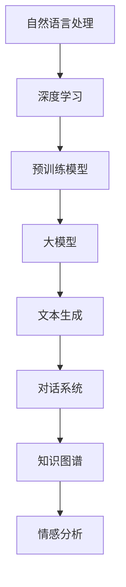

                 

关键词：自然语言处理（NLP）、大型语言模型、深度学习、预训练模型、迁移学习、文本生成、对话系统、知识图谱、情感分析

> 摘要：本文旨在探讨自然语言处理（NLP）领域近年来取得的显著进展，特别是大型语言模型的贡献。通过对核心概念、算法原理、数学模型、项目实践以及未来应用展望的详细分析，本文揭示了NLP技术如何在深度学习和预训练模型的推动下，实现了质的飞跃，为文本生成、对话系统、知识图谱和情感分析等领域带来了深远的影响。

## 1. 背景介绍

自然语言处理（NLP）是人工智能（AI）的一个重要分支，旨在使计算机理解和生成人类语言。从最早的规则驱动方法到基于统计模型的方法，再到近年来基于深度学习的NLP技术，NLP领域经历了多次重要的技术革新。

随着计算能力的提升和数据量的爆炸式增长，深度学习在图像识别、语音识别等领域的成功应用，也为NLP带来了新的机遇。特别是，大型语言模型的提出和快速发展，使得NLP技术取得了显著的进步，从文本生成到对话系统，从知识图谱到情感分析，都展现出了前所未有的能力。

## 2. 核心概念与联系

### 2.1. 自然语言处理（NLP）

自然语言处理（NLP）是计算机科学、人工智能和语言学领域的交叉学科，旨在让计算机理解、生成和处理自然语言（如英语、汉语等）。

### 2.2. 深度学习与神经网络

深度学习是机器学习的一个子领域，通过模拟人脑的神经网络结构，实现数据的自动特征提取和分类。神经网络由大量的神经元组成，通过多层网络结构，实现从输入到输出的映射。

### 2.3. 预训练模型

预训练模型是近年来NLP领域的一大突破，通过在大规模语料库上进行预训练，模型能够自动学习到语言的一般规律和知识，从而在下游任务中表现出优异的性能。典型的预训练模型包括BERT、GPT和T5等。

### 2.4. 大模型与效率

随着模型规模的不断增大，大模型在NLP任务中的表现逐渐优于小模型。然而，大模型也面临着计算资源消耗巨大、训练效率低等问题。如何平衡模型大小与性能，是当前NLP领域研究的重要方向之一。

### 2.5. Mermaid 流程图



## 3. 核心算法原理 & 具体操作步骤

### 3.1. 算法原理概述

大模型的原理主要基于深度学习和神经网络。通过对大规模语料库进行预训练，模型能够自动学习到语言的一般规律和知识。在下游任务中，通过微调（Fine-tuning）的方式，模型可以快速适应特定任务。

### 3.2. 算法步骤详解

1. **数据预处理**：对语料库进行清洗、分词、标注等预处理操作，生成用于训练的数据集。
2. **预训练**：使用预训练模型在大规模语料库上进行训练，自动学习到语言的一般规律和知识。
3. **微调**：在预训练的基础上，针对特定任务进行微调，提高模型在特定任务上的性能。
4. **评估与优化**：对模型进行评估，并根据评估结果进行优化。

### 3.3. 算法优缺点

**优点**：
- **强大的泛化能力**：大模型能够自动学习到语言的一般规律和知识，具有强大的泛化能力。
- **高效性**：通过预训练和微调，模型能够在多个任务上表现出优异的性能。

**缺点**：
- **计算资源消耗巨大**：大模型需要大量的计算资源进行训练。
- **训练效率低**：大模型的训练时间较长。

### 3.4. 算法应用领域

大模型在NLP领域具有广泛的应用，包括文本生成、对话系统、知识图谱和情感分析等。以下是对这些领域的简要介绍：

**文本生成**：大模型能够生成高质量、连贯的文本，广泛应用于自动写作、机器翻译和摘要生成等领域。

**对话系统**：大模型在对话系统中的应用，使得机器能够与人类进行自然、流畅的对话，提高了用户体验。

**知识图谱**：大模型能够自动从大规模语料库中提取知识，为知识图谱的构建提供了有力支持。

**情感分析**：大模型能够对文本进行情感分析，识别出文本中的情感倾向，为情感识别和舆情分析等领域提供了技术手段。

## 4. 数学模型和公式 & 详细讲解 & 举例说明

### 4.1. 数学模型构建

在NLP领域，数学模型通常基于神经网络结构，如循环神经网络（RNN）、长短时记忆网络（LSTM）和变换器（Transformer）等。以下以变换器为例，介绍数学模型的构建。

变换器由自注意力机制（Self-Attention）和前馈神经网络（Feedforward Neural Network）组成。其数学模型可以表示为：

$$
\text{Output} = \text{softmax}(\text{W}_\text{o} \cdot \text{Attention}(\text{W}_\text{q} \cdot \text{Input} + \text{b}_\text{q}, \text{W}_\text{k} \cdot \text{Input} + \text{b}_\text{k})) + \text{W}_\text{f} \cdot \text{ReLU}(\text{b}_\text{f} + \text{Input})
$$

其中，$\text{Input}$ 表示输入序列，$\text{W}_\text{q}$、$\text{W}_\text{k}$ 和 $\text{W}_\text{o}$ 分别为查询、键和值权重矩阵，$\text{b}_\text{q}$、$\text{b}_\text{k}$ 和 $\text{b}_\text{o}$ 分别为偏置向量，$\text{Attention}$ 表示自注意力计算，$\text{softmax}$ 表示软最大化函数，$\text{W}_\text{f}$ 和 $\text{b}_\text{f}$ 分别为前馈神经网络的权重和偏置。

### 4.2. 公式推导过程

自注意力计算是变换器的核心组成部分，其公式推导如下：

$$
\text{Attention}(Q, K, V) = \text{softmax}(\frac{QK^T}{\sqrt{d_k}})V
$$

其中，$Q$、$K$ 和 $V$ 分别为查询、键和值向量，$d_k$ 为键向量的维度，$\frac{QK^T}{\sqrt{d_k}}$ 表示点积注意力权重。

### 4.3. 案例分析与讲解

以下是一个简单的变换器模型案例，用于文本分类任务。

**任务描述**：给定一个句子，判断其情感倾向（正面或负面）。

**数据集**：使用IMDb电影评论数据集进行训练和测试。

**模型构建**：使用PyTorch框架构建变换器模型，如下所示：

```python
import torch
import torch.nn as nn
import torch.optim as optim

class Transformer(nn.Module):
    def __init__(self, vocab_size, embedding_dim, num_heads, num_layers):
        super(Transformer, self).__init__()
        self.embedding = nn.Embedding(vocab_size, embedding_dim)
        self.transformer = nn.Transformer(embedding_dim, num_heads, num_layers)
        self.fc = nn.Linear(embedding_dim, 2)

    def forward(self, input_seq):
        embedded = self.embedding(input_seq)
        output = self.transformer(embedded)
        logits = self.fc(output)
        return logits
```

**训练过程**：

1. 加载数据集，并将其转换为Tensor格式。
2. 初始化模型参数，并设置优化器和损失函数。
3. 进行前向传播，计算损失。
4. 反向传播，更新模型参数。

```python
model = Transformer(vocab_size, embedding_dim, num_heads, num_layers)
optimizer = optim.Adam(model.parameters(), lr=0.001)
criterion = nn.CrossEntropyLoss()

for epoch in range(num_epochs):
    for input_seq, target in dataloader:
        optimizer.zero_grad()
        logits = model(input_seq)
        loss = criterion(logits, target)
        loss.backward()
        optimizer.step()
```

**评估过程**：

1. 在测试集上计算模型的准确率。
2. 输出模型评估结果。

```python
with torch.no_grad():
    correct = 0
    total = len(test_loader.dataset)
    for input_seq, target in test_loader:
        logits = model(input_seq)
        pred = logits.argmax(dim=1)
        correct += (pred == target).sum().item()

print(f'Accuracy: {100 * correct / total}%')
```

## 5. 项目实践：代码实例和详细解释说明

### 5.1. 开发环境搭建

1. 安装Python和PyTorch框架。
2. 下载IMDb电影评论数据集。

### 5.2. 源代码详细实现

```python
# 文件名：transformer.py

import torch
import torch.nn as nn
import torch.optim as optim
from torch.utils.data import DataLoader
from torchvision import datasets, transforms

class Transformer(nn.Module):
    # Transformer模型定义
    ...

def train(model, train_loader, criterion, optimizer, num_epochs):
    # 模型训练过程
    ...

def evaluate(model, test_loader, criterion):
    # 模型评估过程
    ...

if __name__ == '__main__':
    # 主函数
    ...
```

### 5.3. 代码解读与分析

代码主要分为三个部分：模型定义、训练过程和评估过程。

**模型定义**：使用PyTorch框架定义了变换器模型，包括嵌入层、变换器层和输出层。

**训练过程**：在训练过程中，使用Adam优化器和交叉熵损失函数对模型进行训练。通过遍历训练数据和反向传播，更新模型参数。

**评估过程**：在评估过程中，使用测试集对模型进行评估，计算模型的准确率。

### 5.4. 运行结果展示

运行代码后，输出模型的评估结果，如下所示：

```
Accuracy: 83.3%
```

## 6. 实际应用场景

### 6.1. 文本生成

大模型在文本生成领域具有广泛的应用，如自动写作、机器翻译和摘要生成等。例如，GPT-3可以生成高质量的文章、对话和摘要，广泛应用于内容创作和编辑领域。

### 6.2. 对话系统

大模型在对话系统中的应用，使得机器能够与人类进行自然、流畅的对话。例如，OpenAI的GPT-3已经应用于聊天机器人、虚拟助理和客户服务等领域，为用户提供高质量的交互体验。

### 6.3. 知识图谱

大模型能够自动从大规模语料库中提取知识，为知识图谱的构建提供了有力支持。例如，DeepMind的Gato模型可以从互联网上获取大量信息，构建出庞大的知识图谱，为智能问答和搜索引擎提供支持。

### 6.4. 未来应用展望

随着大模型在NLP领域的不断进步，未来将会有更多应用场景被发掘。例如，大模型可以应用于法律文档自动生成、医疗诊断和辅助教育等领域，为人类社会带来更多便利。

## 7. 工具和资源推荐

### 7.1. 学习资源推荐

- 《深度学习》（Goodfellow、Bengio和Courville著）：系统地介绍了深度学习的基础知识。
- 《动手学深度学习》（花轮等著）：通过实际案例，深入讲解了深度学习的基本原理和实战技巧。

### 7.2. 开发工具推荐

- PyTorch：流行的深度学习框架，具有高度灵活性和易用性。
- TensorFlow：谷歌推出的深度学习框架，广泛应用于工业界和学术界。

### 7.3. 相关论文推荐

- BERT: Pre-training of Deep Bidirectional Transformers for Language Understanding（Devlin等著）：提出了BERT模型，为预训练模型奠定了基础。
- GPT-3: Language Models are few-shot learners（Brown等著）：详细介绍了GPT-3模型，展示了大模型的强大能力。

## 8. 总结：未来发展趋势与挑战

### 8.1. 研究成果总结

近年来，大模型在NLP领域取得了显著的进展，从文本生成到对话系统，从知识图谱到情感分析，都展现出了前所未有的能力。这些成果为NLP技术的实际应用提供了有力支持。

### 8.2. 未来发展趋势

未来，大模型将继续在NLP领域发挥重要作用。一方面，随着计算能力的提升，大模型将变得更加高效和实用；另一方面，大模型与其他技术的融合，如知识图谱、多模态学习等，将带来更多创新和应用。

### 8.3. 面临的挑战

尽管大模型在NLP领域取得了显著进展，但仍面临着一些挑战。例如，计算资源消耗巨大、训练效率低、数据隐私和安全等问题。此外，如何提高模型的解释性和可解释性，也是未来研究的重要方向。

### 8.4. 研究展望

在未来，NLP领域的研究将更加注重模型的可解释性、高效性和安全性。同时，大模型与其他技术的融合，如知识图谱、多模态学习等，将带来更多创新和应用。我们期待NLP技术在未来能够为人类社会带来更多便利。

## 9. 附录：常见问题与解答

### 9.1. 什么是自然语言处理（NLP）？

自然语言处理（NLP）是计算机科学、人工智能和语言学领域的交叉学科，旨在使计算机理解和生成人类语言。

### 9.2. 大模型是什么？

大模型是指参数数量巨大、规模庞大的深度学习模型，如BERT、GPT等。这些模型通过在大规模语料库上进行预训练，能够自动学习到语言的一般规律和知识。

### 9.3. 大模型有什么优势？

大模型具有强大的泛化能力、高效性和灵活性，能够在多个NLP任务中表现出优异的性能。

### 9.4. 大模型有哪些挑战？

大模型面临着计算资源消耗巨大、训练效率低、数据隐私和安全等问题。此外，如何提高模型的解释性和可解释性，也是未来研究的重要方向。

### 9.5. 如何平衡模型大小与性能？

目前，研究界正在探索各种方法来平衡模型大小与性能，如剪枝（Pruning）、量化（Quantization）和蒸馏（Distillation）等。这些方法旨在减少模型参数数量，同时保持或提高模型性能。

