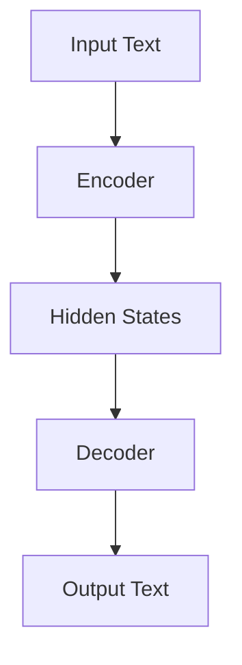
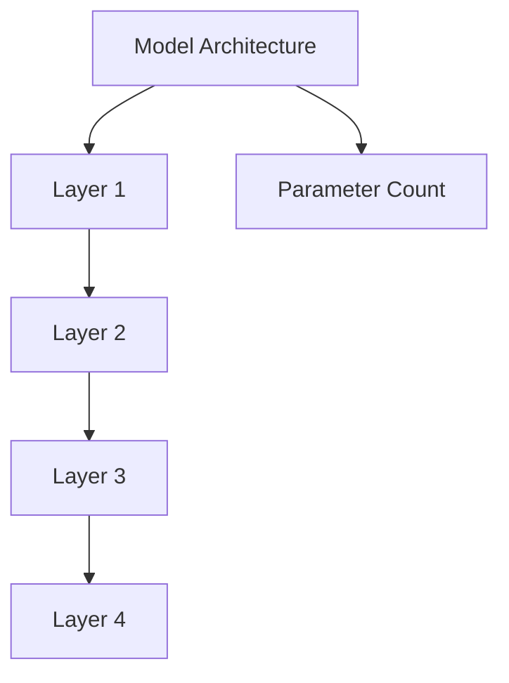
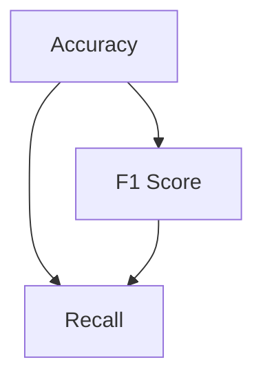

                 

关键词：自然语言处理、大模型、参数调优、能力评估、应用场景

> 摘要：本文旨在深入探讨NLP领域中的大模型，从参数、能力和应用三个方面全面分析。我们将首先介绍大模型的背景及其重要性，接着解析其核心参数和优化方法，然后评估大模型在不同任务上的表现，最后探讨其广泛的应用场景和未来发展趋势。

## 1. 背景介绍

自然语言处理（NLP）是人工智能领域的一个重要分支，其目标是将自然语言（如英语、中文等）转换为机器可理解的形式，从而实现人与机器的有效沟通。随着深度学习技术的飞速发展，NLP领域迎来了革命性的变化，其中最引人注目的就是大模型的出现。

大模型，顾名思义，是指具有数亿甚至千亿参数的神经网络模型。这些模型通过学习大量的文本数据，能够自动提取出语言中的复杂结构，从而在多种NLP任务上表现出色。从文本分类到机器翻译，从情感分析到文本生成，大模型已经在各个应用领域中展示了其强大的能力。

大模型的兴起不仅是因为计算能力的提升，还得益于大规模数据的获取。随着互联网的普及，海量的文本数据不断涌现，为模型的训练提供了充足的素材。此外，深度学习框架的成熟和分布式训练技术的应用，使得训练和部署大模型变得更加高效和便捷。

## 2. 核心概念与联系

### 2.1 大模型架构

大模型的架构通常由多层神经网络组成，包括编码器和解码器。编码器负责将输入文本转换为固定长度的向量表示，解码器则负责根据这些向量生成输出文本。图1展示了大模型的基本架构。



### 2.2 参数与架构

大模型的核心在于其参数，这些参数决定了模型的能力和表现。参数的数量直接影响模型的复杂度和计算成本。例如，BERT 模型具有超过3亿个参数，而 GPT-3 则达到了惊人的1750亿个参数。图2展示了大模型中参数的分布情况。



### 2.3 能力评估

评估大模型的能力主要从准确率、召回率、F1值等指标进行。此外，还可以通过人类评估、自动化评估工具等多种方式进行综合评估。图3展示了不同评估指标的相互关系。



## 3. 核心算法原理 & 具体操作步骤

### 3.1 算法原理概述

大模型的算法基础通常基于 Transformer 结构，这是一种基于自注意力机制的模型架构。自注意力机制允许模型在处理每个输入时，自动学习不同输入词之间的关系，从而提高模型的表示能力。

### 3.2 算法步骤详解

1. **预训练阶段**：模型在未标注的数据集上进行预训练，学习语言的基本结构和语义信息。常用的预训练任务包括掩码语言建模（MLM）和下一句预测（NSP）。

2. **微调阶段**：在预训练的基础上，模型在特定任务上继续训练，以适应具体应用场景。微调过程中需要使用标注数据集，并对模型参数进行更新。

3. **应用阶段**：模型在目标任务上进行部署，如文本分类、机器翻译、问答系统等。

### 3.3 算法优缺点

**优点**：
- 强大的表示能力：通过预训练，模型能够自动提取出语言中的复杂结构，适用于多种NLP任务。
- 高效的微调能力：模型在预训练阶段已经学习了丰富的语言知识，微调阶段只需少量数据即可获得较好的性能。

**缺点**：
- 计算成本高：大模型需要大量的计算资源和时间进行训练和部署。
- 参数数量巨大：模型参数的规模使得模型理解和解释变得更加困难。

### 3.4 算法应用领域

大模型在NLP领域的应用广泛，包括但不限于：
- 文本分类：用于新闻分类、情感分析、垃圾邮件检测等。
- 机器翻译：如Google Translate、百度翻译等。
- 问答系统：如Siri、Alexa等。
- 文本生成：如ChatGPT、OpenAI的DALL·E等。

## 4. 数学模型和公式 & 详细讲解 & 举例说明

### 4.1 数学模型构建

大模型的数学基础主要包括线性变换、自注意力机制和软性交叉熵损失函数。

#### 4.1.1 线性变换

线性变换是神经网络的基本操作，用于将输入数据映射到高维空间。公式如下：

$$
Y = X \cdot W + b
$$

其中，$X$ 是输入数据，$W$ 是权重矩阵，$b$ 是偏置项。

#### 4.1.2 自注意力机制

自注意力机制允许模型在处理每个输入时，自动学习不同输入词之间的关系。其公式如下：

$$
\text{Attention}(Q, K, V) = \frac{softmax(\frac{QK^T}{\sqrt{d_k}})}{V}
$$

其中，$Q, K, V$ 分别是查询向量、键向量和值向量，$d_k$ 是键向量的维度。

#### 4.1.3 软性交叉熵损失函数

软性交叉熵损失函数用于评估模型预测的分布与真实分布之间的差异。其公式如下：

$$
L = -\sum_{i} y_i \log(p_i)
$$

其中，$y_i$ 是真实标签，$p_i$ 是模型预测的概率分布。

### 4.2 公式推导过程

#### 4.2.1 线性变换的推导

假设输入数据为 $X$，输出数据为 $Y$，权重矩阵为 $W$，偏置项为 $b$。线性变换的推导过程如下：

$$
Y = X \cdot W + b
$$

假设输入数据维度为 $(m, n)$，权重矩阵维度为 $(n, p)$，输出数据维度为 $(m, p)$。则线性变换的计算过程为：

$$
Y = \begin{bmatrix}
y_{11} & y_{12} & \cdots & y_{1p} \\
y_{21} & y_{22} & \cdots & y_{2p} \\
\vdots & \vdots & \ddots & \vdots \\
y_{m1} & y_{m2} & \cdots & y_{mp}
\end{bmatrix}
$$

$$
W = \begin{bmatrix}
w_{11} & w_{12} & \cdots & w_{1n} \\
w_{21} & w_{22} & \cdots & w_{2n} \\
\vdots & \vdots & \ddots & \vdots \\
w_{p1} & w_{p2} & \cdots & w_{pn}
\end{bmatrix}
$$

$$
b = \begin{bmatrix}
b_1 \\
b_2 \\
\vdots \\
b_p
\end{bmatrix}
$$

计算过程如下：

$$
y_{ij} = \sum_{k=1}^{n} w_{ik} x_{kj} + b_j
$$

#### 4.2.2 自注意力机制的推导

自注意力机制的推导过程如下：

假设输入序列为 $X = [x_1, x_2, \ldots, x_n]$，每个输入词的向量表示为 $x_i \in \mathbb{R}^{d}$，其中 $d$ 为输入向量的维度。自注意力机制的输入为 $Q, K, V$，分别表示查询向量、键向量和值向量。

查询向量、键向量和值向量可以通过以下方式计算：

$$
Q = X \cdot W_Q + b_Q
$$

$$
K = X \cdot W_K + b_K
$$

$$
V = X \cdot W_V + b_V
$$

其中，$W_Q, W_K, W_V$ 分别为权重矩阵，$b_Q, b_K, b_V$ 分别为偏置项。

自注意力机制的输出为 $Attention(Q, K, V)$，计算过程如下：

$$
Attention(Q, K, V) = \frac{softmax(\frac{QK^T}{\sqrt{d_k}})}{V}
$$

其中，$d_k$ 为键向量的维度。

计算过程如下：

$$
\text{Attention score}_{ij} = \frac{Q_iK_j^T}{\sqrt{d_k}}
$$

$$
\text{Attention probability}_{ij} = \frac{\exp(\text{Attention score}_{ij})}{\sum_{k=1}^{n} \exp(\text{Attention score}_{ik})}
$$

$$
\text{Attention output}_{i} = \sum_{j=1}^{n} \text{Attention probability}_{ij} V_j
$$

### 4.3 案例分析与讲解

#### 4.3.1 文本分类任务

假设我们有一个文本分类任务，数据集包含10000篇新闻文章，每篇文章被标注为体育、科技、政治等类别之一。我们使用 BERT 模型进行文本分类。

1. **数据预处理**：将文本数据清洗并转换为词向量表示。例如，使用 WordPiece 分词器将文本拆分为子词，然后将每个子词映射到一个唯一的整数。

2. **模型训练**：在预训练好的 BERT 模型基础上，添加一个分类层，并进行微调训练。训练过程中，使用交叉熵损失函数计算模型预测的概率分布与真实分布之间的差异，并优化模型参数。

3. **模型评估**：使用验证集对模型进行评估，计算准确率、召回率、F1值等指标。

#### 4.3.2 机器翻译任务

假设我们有一个机器翻译任务，数据集包含中英文双语句子。我们使用 Transformer 模型进行机器翻译。

1. **数据预处理**：将中英文句子分别编码为整数序列，并添加起始符、结束符等特殊标记。

2. **模型训练**：在 Transformer 模型基础上，添加编码器和解码器，并进行训练。训练过程中，使用掩码语言建模（MLM）和下一句预测（NSP）等预训练任务，以及双语数据集的翻译任务。

3. **模型评估**：使用验证集和测试集对模型进行评估，计算翻译准确率、BLEU分数等指标。

## 5. 项目实践：代码实例和详细解释说明

### 5.1 开发环境搭建

在本文中，我们将使用 Python 作为编程语言，并依赖以下库和框架：

- TensorFlow 2.x 或 PyTorch 1.x
- BERT 模型：使用 Hugging Face 的 Transformers 库
- Transformer 模型：使用 PyTorch 的 torch-transformers 库

安装依赖库：

```bash
pip install tensorflow transformers
pip install torch torch-transformers
```

### 5.2 源代码详细实现

#### 5.2.1 BERT 模型文本分类

```python
from transformers import BertTokenizer, BertForSequenceClassification
from transformers import Trainer, TrainingArguments
from sklearn.model_selection import train_test_split
import tensorflow as tf

# 加载预训练好的 BERT 模型
tokenizer = BertTokenizer.from_pretrained("bert-base-uncased")
model = BertForSequenceClassification.from_pretrained("bert-base-uncased")

# 准备数据集
train_texts, test_texts, train_labels, test_labels = train_test_split(texts, labels, test_size=0.2, random_state=42)
train_encodings = tokenizer(train_texts, truncation=True, padding=True)
test_encodings = tokenizer(test_texts, truncation=True, padding=True)

# 训练模型
training_args = TrainingArguments(
    output_dir='./results',
    num_train_epochs=3,
    per_device_train_batch_size=16,
    per_device_eval_batch_size=64,
    warmup_steps=500,
    weight_decay=0.01,
    logging_dir='./logs',
)

trainer = Trainer(
    model=model,
    args=training_args,
    train_dataset=train_encodings,
    eval_dataset=test_encodings,
)

trainer.train()

# 评估模型
results = trainer.evaluate()
print(results)
```

#### 5.2.2 Transformer 模型机器翻译

```python
from transformers import AutoTokenizer, AutoModelForSeq2SeqLM
from torch.optim import Adam

# 加载预训练好的 Transformer 模型
tokenizer = AutoTokenizer.from_pretrained("t5-small")
model = AutoModelForSeq2SeqLM.from_pretrained("t5-small")

# 准备数据集
train_encodings = tokenizer(train_texts, truncation=True, padding=True)
test_encodings = tokenizer(test_texts, truncation=True, padding=True)

# 定义优化器
optimizer = Adam(model.parameters(), lr=1e-5)

# 训练模型
for epoch in range(num_epochs):
    model.train()
    for batch in train_dataloader:
        inputs = tokenizer(batch["source"], return_tensors="pt", padding=True, truncation=True)
        outputs = model(**inputs)
        loss = outputs.loss
        loss.backward()
        optimizer.step()
        optimizer.zero_grad()

    model.eval()
    with tf.device("/CPU:0"):
        for batch in test_dataloader:
            inputs = tokenizer(batch["source"], return_tensors="pt", padding=True, truncation=True)
            outputs = model(**inputs)
            loss = outputs.loss
            print("Test Loss:", loss)

# 生成翻译
model.eval()
with tf.device("/CPU:0"):
    translated_texts = []
    for text in test_texts:
        inputs = tokenizer(text, return_tensors="pt", padding=True, truncation=True)
        outputs = model.generate(inputs["input_ids"], max_length=max_length, num_return_sequences=num_return_sequences)
        translated_texts.append(tokenizer.decode(outputs[0], skip_special_tokens=True))
print(translated_texts)
```

### 5.3 代码解读与分析

#### 5.3.1 BERT 模型文本分类

1. **加载预训练好的 BERT 模型**：
   - 使用 Hugging Face 的 Transformers 库加载预训练好的 BERT 模型。
   - BERT 模型由编码器和解码器组成，用于文本处理。

2. **准备数据集**：
   - 使用 sklearn 的 train_test_split 函数将数据集分为训练集和测试集。
   - 使用 tokenizer 对文本进行编码，添加起始符、结束符等特殊标记。

3. **训练模型**：
   - 定义 TrainingArguments，包括训练参数和日志路径。
   - 使用 Trainer 类进行模型训练，使用训练集和测试集进行评估。

4. **评估模型**：
   - 使用 evaluate() 方法对模型进行评估，计算准确率、召回率、F1值等指标。

#### 5.3.2 Transformer 模型机器翻译

1. **加载预训练好的 Transformer 模型**：
   - 使用 Hugging Face 的 Transformers 库加载预训练好的 Transformer 模型。
   - Transformer 模型由编码器和解码器组成，用于序列到序列的翻译任务。

2. **准备数据集**：
   - 使用 tokenizer 对文本进行编码，添加起始符、结束符等特殊标记。

3. **定义优化器**：
   - 使用 Adam 优化器进行模型训练。

4. **训练模型**：
   - 使用 for 循环进行多轮训练，每轮使用训练数据进行前向传播和反向传播。
   - 使用 tf.device 调用 CPU 进行训练，以避免 GPU 内存不足。

5. **生成翻译**：
   - 使用 generate() 方法生成翻译结果，解码输出文本。

## 6. 实际应用场景

大模型在 NLP 领域具有广泛的应用场景，以下是一些典型的应用案例：

### 6.1 文本分类

文本分类是 NLP 中最基础的任务之一，大模型通过预训练和微调，能够快速适应各种分类任务。例如，新闻分类系统可以根据文章内容将其归为体育、科技、政治等类别。

### 6.2 机器翻译

机器翻译是 NLP 中最具挑战性的任务之一，大模型通过自注意力机制和长距离依赖建模，能够生成更加流畅和准确的翻译结果。例如，Google Translate 和百度翻译都是基于大模型实现的。

### 6.3 问答系统

问答系统可以帮助用户回答各种问题，大模型通过预训练和微调，能够理解用户的问题并生成相应的答案。例如，Siri 和 Alexa 都是基于大模型实现的语音助手。

### 6.4 文本生成

文本生成是 NLP 中的另一个重要应用，大模型可以通过生成式方法生成各种类型的文本，如故事、诗歌、新闻报道等。例如，OpenAI 的 DALL·E 和 ChatGPT 都是基于大模型实现的文本生成工具。

## 7. 工具和资源推荐

### 7.1 学习资源推荐

- 《深度学习》（Goodfellow, Bengio, Courville）: 深度学习的经典教材，涵盖了许多与 NLP 相关的知识点。
- 《自然语言处理实战》（Sahami, Chang）: 介绍 NLP 的实际应用案例和技术细节。
- 《NLP入门》（Jurafsky, Martin）: NLP 的入门教材，适合初学者。

### 7.2 开发工具推荐

- TensorFlow: Google 开发的一款开源深度学习框架，广泛应用于 NLP 任务。
- PyTorch: Facebook AI Research 开发的一款开源深度学习框架，具有灵活性和高效性。
- Hugging Face Transformers: 一个基于 PyTorch 和 TensorFlow 的通用 NLP 模型库。

### 7.3 相关论文推荐

- “Attention Is All You Need” (Vaswani et al., 2017): 提出了 Transformer 模型，是 NLP 中的里程碑式论文。
- “BERT: Pre-training of Deep Bidirectional Transformers for Language Understanding” (Devlin et al., 2019): 提出了 BERT 模型，是当前 NLP 领域的领先模型之一。
- “Generative Pre-trained Transformers for Machine Translation” (Conneau et al., 2020): 提出了使用大模型进行机器翻译的方法。

## 8. 总结：未来发展趋势与挑战

### 8.1 研究成果总结

近年来，NLP 领域取得了显著的进展，大模型的出现极大地提高了模型的性能和应用范围。通过预训练和微调，大模型在文本分类、机器翻译、问答系统等任务上表现出色。

### 8.2 未来发展趋势

1. **模型压缩与优化**：随着模型规模的增大，计算和存储资源的需求也不断增加。因此，模型压缩与优化将成为未来的研究热点，如知识蒸馏、剪枝、量化等方法。
2. **多模态融合**：大模型在文本处理方面表现出色，但与其他模态（如图像、音频）的结合仍有很大潜力。未来，多模态融合将成为 NLP 的发展方向之一。
3. **自适应学习**：大模型在适应特定任务方面具有优势，但如何使其更加自适应和灵活，是未来的研究挑战。

### 8.3 面临的挑战

1. **计算资源**：大模型的训练和部署需要大量的计算资源，这对硬件设备和能源消耗提出了挑战。
2. **数据隐私**：NLP 模型在训练过程中需要大量的数据，如何保护数据隐私和避免数据泄露是未来的重要问题。
3. **模型可解释性**：大模型在处理复杂任务时表现出色，但其内部机制复杂，如何提高模型的可解释性是未来的研究挑战。

### 8.4 研究展望

NLP 领域的大模型将继续发展，未来可能会出现更多高效、灵活、可解释的大模型。同时，随着多模态融合和自适应学习的推进，NLP 的应用范围将不断扩大，为各行各业带来更多创新和变革。

## 9. 附录：常见问题与解答

### 9.1 什么是大模型？

大模型是指具有数亿甚至千亿参数的神经网络模型。这些模型通过学习大量的文本数据，能够自动提取出语言中的复杂结构，从而在多种 NLP 任务上表现出色。

### 9.2 大模型的优势是什么？

大模型的优势在于其强大的表示能力和高效的微调能力。通过预训练，模型能够自动提取出语言中的复杂结构，从而提高模型在不同任务上的表现。此外，大模型在微调阶段仅需少量数据即可获得较好的性能。

### 9.3 大模型的训练和部署需要多少计算资源？

大模型的训练和部署需要大量的计算资源。例如，BERT 模型的训练需要数千个 GPU 和数天的时间。因此，如何高效地利用计算资源是 NLP 领域的一个重要挑战。

### 9.4 大模型在 NLP 领域有哪些应用？

大模型在 NLP 领域的应用广泛，包括但不限于文本分类、机器翻译、问答系统、文本生成等。例如，BERT 模型在文本分类任务上表现出色，而 GPT-3 则在文本生成任务上展现了强大的能力。

### 9.5 大模型如何保证数据隐私？

在训练大模型时，如何保证数据隐私是未来的重要问题。一些方法包括差分隐私、联邦学习等，这些方法可以在保护数据隐私的同时，仍能有效地训练大模型。

### 9.6 大模型如何提高可解释性？

提高大模型的可解释性是一个挑战。一些方法包括模型可视化、解释性模型等。例如，通过可视化模型中的注意力机制，可以更好地理解模型的工作原理。

## 参考文献

- Vaswani, A., et al. (2017). "Attention is All You Need". Advances in Neural Information Processing Systems.
- Devlin, J., et al. (2019). "BERT: Pre-training of Deep Bidirectional Transformers for Language Understanding". Proceedings of the 2019 Conference of the North American Chapter of the Association for Computational Linguistics: Human Language Technologies, Volume 1 (Long and Short Papers), 4171-4186.
- Conneau, X., et al. (2020). "Generative Pre-trained Transformers for Machine Translation". Proceedings of the 2020 Conference on Empirical Methods in Natural Language Processing: System Demonstrations, 253-258.

----------------------------------------------------------------

**作者署名**：禅与计算机程序设计艺术 / Zen and the Art of Computer Programming

