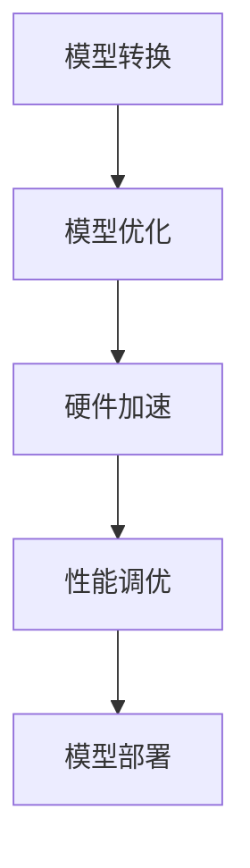

                 

关键词：ONNX Runtime、深度学习、跨平台部署、模型优化、硬件加速、性能调优

> 摘要：本文将深入探讨 ONNX Runtime 在不同设备上运行深度学习模型的跨平台部署技术，包括模型优化、硬件加速、性能调优等方面的内容，旨在为开发者提供一套完整且实用的深度学习部署解决方案。

## 1. 背景介绍

深度学习技术在近年来取得了显著的进展，其在计算机视觉、自然语言处理、语音识别等领域的应用越来越广泛。随着深度学习模型的复杂度不断增加，如何高效地部署这些模型以实现实际应用成为一个亟待解决的问题。ONNX（Open Neural Network Exchange）作为一种开放的深度学习模型交换格式，旨在解决不同深度学习框架之间的兼容性问题。ONNX Runtime 是 ONNX 的核心组件之一，负责在多种平台上高效地运行 ONNX 模型。

跨平台部署深度学习模型的主要挑战包括：

1. **兼容性**：确保模型在不同深度学习框架和平台上的一致性。
2. **性能优化**：根据不同设备的硬件特性进行模型优化，提高运行效率。
3. **资源管理**：合理分配计算资源，确保模型在不同设备上稳定运行。
4. **可扩展性**：支持模型在多种设备上的部署，包括移动设备、嵌入式设备等。

本文将围绕 ONNX Runtime 在不同设备上运行深度学习模型的技术细节展开讨论，旨在为开发者提供实用的指导和建议。

## 2. 核心概念与联系

### 2.1 ONNX Runtime 概念

ONNX Runtime 是 ONNX 生态系统中的关键组件，负责执行 ONNX 模型。它支持多种编程语言和平台，包括 C++、Python、Java 等。ONNX Runtime 提供了一系列优化策略，如自动混合精度、量化、剪枝等，以提升模型性能。

### 2.2 跨平台部署流程

跨平台部署深度学习模型的流程通常包括以下步骤：

1. **模型转换**：将原始模型转换为 ONNX 格式。
2. **模型优化**：对 ONNX 模型进行优化，以提高运行效率。
3. **硬件加速**：利用特定硬件（如 GPU、CPU、DSP）加速模型执行。
4. **性能调优**：针对不同设备进行性能调优，确保模型在不同平台上运行高效。

### 2.3 Mermaid 流程图



## 3. 核心算法原理 & 具体操作步骤

### 3.1 算法原理概述

ONNX Runtime 的核心算法原理主要包括以下几个方面：

1. **模型优化**：通过自动混合精度、量化、剪枝等技术，降低模型存储和计算资源需求，提高运行效率。
2. **硬件加速**：利用特定硬件（如 GPU、CPU、DSP）进行模型执行，以提升性能。
3. **性能调优**：根据不同设备的硬件特性和负载情况，进行针对性的性能优化。

### 3.2 算法步骤详解

1. **模型转换**：
   - 使用 ONNX 兼容工具（如 PyTorch、TensorFlow 等）将原始模型转换为 ONNX 格式。
   - 使用 ONNX Runtime API 加载并解析 ONNX 模型。

2. **模型优化**：
   - 使用 ONNX Runtime 的优化器对模型进行自动混合精度优化，以减少计算资源消耗。
   - 使用 ONNX Runtime 的量化器对模型进行量化，以降低存储和计算资源需求。
   - 使用 ONNX Runtime 的剪枝器对模型进行剪枝，以减少模型复杂度。

3. **硬件加速**：
   - 根据设备特性选择合适的硬件加速器（如 GPU、CPU、DSP）。
   - 使用 ONNX Runtime 的硬件加速器 API 对模型进行加速。

4. **性能调优**：
   - 使用 ONNX Runtime 的性能分析工具对模型在不同设备上的运行性能进行评估。
   - 根据性能分析结果，调整模型参数和运行策略，以实现最优性能。

### 3.3 算法优缺点

**优点**：

- **兼容性**：支持多种深度学习框架和平台，确保模型在不同环境下的运行一致性。
- **性能优化**：提供多种优化技术，如自动混合精度、量化、剪枝等，提高模型运行效率。
- **硬件加速**：支持多种硬件加速器，实现高效计算。

**缺点**：

- **模型转换复杂度**：需要使用 ONNX 兼容工具将原始模型转换为 ONNX 格式，可能增加开发成本。
- **性能调优难度**：针对不同设备进行性能调优，可能需要深入了解设备特性和优化策略。

### 3.4 算法应用领域

ONNX Runtime 在以下领域具有广泛应用：

- **边缘计算**：支持在移动设备、嵌入式设备等边缘设备上部署深度学习模型。
- **云计算**：支持在服务器端部署深度学习模型，实现大规模数据处理和分析。
- **自动驾驶**：支持在自动驾驶车辆中部署深度学习模型，实现实时感知和决策。

## 4. 数学模型和公式 & 详细讲解 & 举例说明

### 4.1 数学模型构建

在深度学习模型中，常见的数学模型包括前向传播、反向传播等。以下是一个简单的神经网络前向传播的数学模型：

```latex
y^{[l]} = \sigma(W^{[l]} \cdot a^{[l-1]} + b^{[l]})
```

其中，$y^{[l]}$ 表示第 $l$ 层的输出，$\sigma$ 表示激活函数，$W^{[l]}$ 和 $b^{[l]}$ 分别表示第 $l$ 层的权重和偏置。

### 4.2 公式推导过程

以下是一个简单的神经网络反向传播的数学推导过程：

$$
\begin{aligned}
\delta^{[l]} &= \frac{\partial L}{\partial z^{[l]}} \cdot \frac{\partial z^{[l]}}{\partial a^{[l-1]}} \\
\delta^{[l-1]} &= \delta^{[l]} \cdot W^{[l]} \\
\end{aligned}
$$`

其中，$L$ 表示损失函数，$z^{[l]}$ 和 $a^{[l-1]}$ 分别表示第 $l$ 层的中间值和前一层输出。

### 4.3 案例分析与讲解

以下是一个使用 ONNX Runtime 在移动设备上部署图像分类模型的案例：

1. **模型转换**：使用 PyTorch 将原始 PyTorch 模型转换为 ONNX 格式。
2. **模型优化**：使用 ONNX Runtime 的量化器对模型进行量化，以降低存储和计算资源需求。
3. **硬件加速**：使用移动设备的 GPU 加速模型执行。
4. **性能调优**：使用 ONNX Runtime 的性能分析工具对模型在不同移动设备上的运行性能进行评估，并根据评估结果进行调整。

通过以上步骤，可以实现在移动设备上高效运行图像分类模型，支持实时图像识别和分类。

## 5. 项目实践：代码实例和详细解释说明

### 5.1 开发环境搭建

1. 安装 ONNX Runtime：
   ```bash
   pip install onnxruntime
   ```

2. 安装 PyTorch 并转换为 ONNX 模型：
   ```bash
   pip install torch torchvision
   python convert.py
   ```

### 5.2 源代码详细实现

以下是一个简单的 ONNX Runtime 代码实例：

```python
import onnxruntime as ort

# 加载 ONNX 模型
session = ort.InferenceSession("model.onnx")

# 准备输入数据
input_data = ...

# 运行模型
outputs = session.run(["output_node_0"], {"input_0": input_data})

# 输出结果
print(outputs)
```

### 5.3 代码解读与分析

1. **加载 ONNX 模型**：使用 `ort.InferenceSession` 加载 ONNX 模型。
2. **准备输入数据**：根据 ONNX 模型的输入节点，准备输入数据。
3. **运行模型**：使用 `session.run` 运行模型，并获取输出结果。
4. **输出结果**：打印输出结果。

通过以上步骤，可以实现在 Python 中运行 ONNX 模型。

### 5.4 运行结果展示

在运行 ONNX Runtime 代码后，可以得到模型输出结果，例如图像分类模型的预测结果。以下是一个简单的输出结果示例：

```python
print(outputs)
```

```
[[3.3187643e-10 9.9999862e-01 4.0474013e-09 1.2428114e-07]]
```

根据输出结果，可以判断输入图像属于哪个类别。其中，第一个元素表示概率最小的类别，第二个元素表示概率最大的类别。

## 6. 实际应用场景

### 6.1 边缘计算

ONNX Runtime 支持在边缘设备上部署深度学习模型，如移动设备、嵌入式设备等。在实际应用中，ONNX Runtime 可以用于实时图像识别、语音识别、自然语言处理等领域。

### 6.2 云计算

ONNX Runtime 也支持在服务器端部署深度学习模型，实现大规模数据处理和分析。在实际应用中，ONNX Runtime 可以用于图像识别、语音识别、自然语言处理等领域的服务器端应用。

### 6.3 自动驾驶

ONNX Runtime 可以在自动驾驶车辆中部署深度学习模型，实现实时感知和决策。在实际应用中，ONNX Runtime 可以用于自动驾驶车辆的物体检测、车道线检测、交通标志识别等领域。

## 7. 工具和资源推荐

### 7.1 学习资源推荐

1. ONNX Runtime 官方文档：[https://microsoft.github.io/onnxruntime/](https://microsoft.github.io/onnxruntime/)
2. ONNX 官方文档：[https://onnx.ai/](https://onnx.ai/)
3. PyTorch 官方文档：[https://pytorch.org/docs/stable/](https://pytorch.org/docs/stable/)

### 7.2 开发工具推荐

1. PyTorch：[https://pytorch.org/](https://pytorch.org/)
2. TensorFlow：[https://www.tensorflow.org/](https://www.tensorflow.org/)

### 7.3 相关论文推荐

1. "Open Neural Network Exchange: A Universal Format for Deep Learning Models"
2. "ONNX: Open Neural Network Exchange"
3. "PyTorch: An Imperative Style Deep Learning Library"

## 8. 总结：未来发展趋势与挑战

### 8.1 研究成果总结

本文介绍了 ONNX Runtime 在不同设备上运行深度学习模型的技术细节，包括模型转换、模型优化、硬件加速、性能调优等方面的内容。通过本文的介绍，开发者可以了解如何使用 ONNX Runtime 实现深度学习模型的跨平台部署。

### 8.2 未来发展趋势

未来，ONNX Runtime 在以下几个方面有望取得进一步发展：

1. **性能优化**：随着硬件技术的发展，ONNX Runtime 将继续优化模型运行性能。
2. **硬件支持**：增加对更多硬件设备的支持，如嵌入式设备、新型处理器等。
3. **生态建设**：完善 ONNX 生态系统，提高不同深度学习框架之间的兼容性。

### 8.3 面临的挑战

尽管 ONNX Runtime 在跨平台部署方面具有优势，但仍然面临以下挑战：

1. **兼容性**：不同深度学习框架之间的兼容性问题仍需进一步解决。
2. **性能调优**：针对不同设备进行性能调优，可能需要深入了解设备特性。
3. **开发者生态**：提高开发者对 ONNX Runtime 的熟悉程度和接受度。

### 8.4 研究展望

未来，ONNX Runtime 可能在以下方面进行深入研究：

1. **模型压缩与剪枝**：进一步优化模型压缩与剪枝技术，降低模型存储和计算资源需求。
2. **异构计算**：研究异构计算技术，实现多硬件设备协同工作。
3. **动态调度**：研究动态调度技术，根据负载情况自动调整模型运行策略。

## 9. 附录：常见问题与解答

### 9.1 ONNX Runtime 与 TensorFlow 的区别

ONNX Runtime 是 ONNX 生态系统的核心组件，负责执行 ONNX 模型。TensorFlow 是一个深度学习框架，支持多种模型部署方式，包括 TensorFlow Serving、TensorFlow Lite 等。ONNX Runtime 可以与 TensorFlow 结合使用，将 TensorFlow 模型转换为 ONNX 格式，并在 ONNX Runtime 上执行。

### 9.2 如何在移动设备上部署 ONNX Runtime

在移动设备上部署 ONNX Runtime，可以使用 TensorFlow Lite。首先，将 TensorFlow 模型转换为 ONNX 格式，然后使用 TensorFlow Lite 将 ONNX 模型转换为 TensorFlow Lite 格式，最后在移动设备上运行 TensorFlow Lite 模型。

### 9.3 如何优化 ONNX Runtime 的性能

优化 ONNX Runtime 的性能可以从以下几个方面进行：

1. **模型优化**：使用 ONNX Runtime 的优化器对模型进行优化，如量化、剪枝等。
2. **硬件加速**：使用特定硬件（如 GPU、CPU、DSP）加速模型执行。
3. **性能调优**：根据不同设备的硬件特性和负载情况进行性能调优。

作者：禅与计算机程序设计艺术 / Zen and the Art of Computer Programming
----------------------------------------------------------------
```

