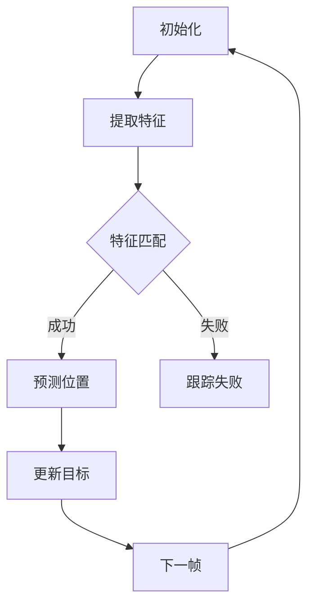

                 

在当今信息化时代，视频监控、视频分析等领域得到了广泛应用。在视频分析中，目标跟踪是关键的一环，它可以帮助我们识别视频中的物体，并追踪其在不同帧中的位置。OpenCV（Open Source Computer Vision Library）作为一款强大的计算机视觉库，为我们提供了丰富的工具和算法来处理这类问题。

本文将深入探讨如何使用OpenCV进行目标跟踪，包括其核心概念、算法原理、数学模型、实际操作步骤，以及相关应用场景和未来展望。

## 文章关键词

- OpenCV
- 目标跟踪
- 视频分析
- 计算机视觉
- 算法原理
- 数学模型

## 文章摘要

本文首先介绍了目标跟踪的基本概念和在视频分析中的应用，接着详细讲解了OpenCV中的目标跟踪算法原理及其实现步骤。随后，我们通过实际操作实例展示了如何在OpenCV中实现目标跟踪。最后，文章分析了目标跟踪在现实世界的应用场景，并对未来的发展趋势进行了展望。

## 1. 背景介绍

### 1.1 目标跟踪的基本概念

目标跟踪是计算机视觉中的一个重要研究领域，其主要目标是识别视频序列中的物体，并在不同的帧中持续追踪其运动轨迹。目标跟踪不仅对于视频监控、人机交互等领域具有重要意义，还在自动驾驶、机器人导航等前沿技术中发挥着关键作用。

### 1.2 目标跟踪的应用场景

- **视频监控**：在视频监控中，目标跟踪可以帮助识别和追踪可疑目标，提高监控效率和安全性。
- **人机交互**：目标跟踪技术可以用于手势识别、虚拟现实等领域，实现人与机器的更自然互动。
- **自动驾驶**：在自动驾驶中，目标跟踪是识别道路上的其他车辆和行人，确保行车安全的关键技术。

### 1.3 OpenCV的目标跟踪功能

OpenCV是一个开源的计算机视觉库，提供了丰富的图像处理和视频分析工具。其目标跟踪功能基于多种算法，包括光流法、粒子滤波、Kalman滤波等，可以满足不同应用场景的需求。

## 2. 核心概念与联系

### 2.1 核心概念

- **目标跟踪**：识别视频序列中的物体，并在不同帧中追踪其位置。
- **特征点匹配**：利用特征点匹配技术，找到当前帧中与目标物体相关的特征点。
- **运动模型**：描述目标物体的运动轨迹，常见的有线性模型、高斯模型等。
- **预测与更新**：使用运动模型预测目标在下一帧中的位置，并利用特征点匹配结果更新预测结果。

### 2.2 架构与流程

下面是一个简化的目标跟踪流程图：



## 3. 核心算法原理 & 具体操作步骤

### 3.1 算法原理概述

目标跟踪算法的核心是运动模型和特征点匹配。运动模型用于预测目标在下一帧中的位置，而特征点匹配则用于验证预测结果是否准确。

### 3.2 算法步骤详解

#### 3.2.1 初始化

在开始跟踪之前，需要初始化目标跟踪器，并提取目标的初始特征点。

```python
# 初始化目标跟踪器
tracker = cv2.TrackerCSRT_create()

# 提取初始特征点
feature_extractor = cv2.xfeatures2d.SIFT_create()
initial_frame = cv2.imread('initial_frame.jpg')
keypoints, descriptors = feature_extractor.detectAndCompute(initial_frame, None)
```

#### 3.2.2 特征点匹配

使用特征点匹配算法（如FLANN匹配）找到当前帧中与目标物体相关的特征点。

```python
# 读取当前帧
current_frame = cv2.imread('current_frame.jpg')

# 提取当前帧的特征点
current_keypoints, current_descriptors = feature_extractor.detectAndCompute(current_frame, None)

# FLANN匹配
FLANN_INDEX_KDTREE = 1
index_params = dict(algorithm=FLANN_INDEX_KDTREE, trees=5)
search_params = dict(checks=50)

flann = cv2.FlannBasedMatcher(index_params, search_params)
matches = flann.knnMatch(descriptors, current_descriptors, k=2)

# 筛选出高质量匹配
good_matches = []
for m, n in matches:
    if m.distance < 0.7 * n.distance:
        good_matches.append(m)

# 提取匹配点的坐标
points = cv2.drawKeypoints(current_frame, current_keypoints, None, color=(0, 255, 0))
```

#### 3.2.3 预测与更新

使用运动模型预测目标在下一帧中的位置，并利用特征点匹配结果更新预测结果。

```python
# 预测目标位置
predicted_bbox = tracker.predict(initial_frame)

# 更新目标位置
bbox = cv2.DMatchArray(good_matches).getKeys()
tracker.update(current_frame, bbox)
```

### 3.3 算法优缺点

- **优点**：
  - **准确性**：使用特征点匹配可以提高跟踪的准确性。
  - **适应性**：算法可以根据不同的场景和目标进行自适应调整。

- **缺点**：
  - **计算量**：特征点匹配算法计算量较大，可能导致实时性受到影响。
  - **对光照和遮挡敏感**：在光照变化和遮挡情况下，跟踪效果可能受到影响。

### 3.4 算法应用领域

目标跟踪算法广泛应用于视频监控、人机交互、自动驾驶等领域，其应用前景广阔。

## 4. 数学模型和公式 & 详细讲解 & 举例说明

### 4.1 数学模型构建

目标跟踪的数学模型主要包括运动模型和特征点匹配模型。

#### 4.1.1 运动模型

假设目标在连续帧中的位置可以用向量表示为 $x_t = [x_{t1}, x_{t2}, ..., x_{tn}]^T$，则线性运动模型可以表示为：

$$
x_t = A_t x_{t-1} + w_t
$$

其中，$A_t$ 是运动矩阵，$w_t$ 是过程噪声。

#### 4.1.2 特征点匹配模型

特征点匹配模型主要用于描述特征点之间的相似性。一种常见的匹配模型是高斯模型，其概率密度函数为：

$$
p(d_i | \theta) = \frac{1}{\sqrt{2\pi\sigma^2}} e^{-\frac{(d_i - \theta)^2}{2\sigma^2}}
$$

其中，$d_i$ 是特征点之间的距离，$\theta$ 是匹配参数，$\sigma$ 是匹配误差。

### 4.2 公式推导过程

#### 4.2.1 运动模型的推导

假设目标在连续帧中的位置可以用向量表示为 $x_t = [x_{t1}, x_{t2}, ..., x_{tn}]^T$，则线性运动模型可以表示为：

$$
x_t = A_t x_{t-1} + w_t
$$

其中，$A_t$ 是运动矩阵，$w_t$ 是过程噪声。

#### 4.2.2 特征点匹配模型的推导

假设特征点之间的距离为 $d_i$，匹配参数为 $\theta$，则高斯模型的概率密度函数为：

$$
p(d_i | \theta) = \frac{1}{\sqrt{2\pi\sigma^2}} e^{-\frac{(d_i - \theta)^2}{2\sigma^2}}
$$

### 4.3 案例分析与讲解

假设我们要跟踪一个在室内移动的物体，使用OpenCV中的SIFT算法提取特征点，并使用FLANN匹配进行特征点匹配。

#### 4.3.1 实验数据

- **视频帧**：采集一段室内视频，帧率为30帧/秒。
- **特征提取**：使用SIFT算法提取特征点。
- **匹配算法**：使用FLANN匹配算法进行特征点匹配。

#### 4.3.2 实验步骤

1. **初始化目标跟踪器**：
   ```python
   tracker = cv2.TrackerCSRT_create()
   ```

2. **提取初始特征点**：
   ```python
   feature_extractor = cv2.xfeatures2d.SIFT_create()
   initial_frame = cv2.imread('initial_frame.jpg')
   keypoints, descriptors = feature_extractor.detectAndCompute(initial_frame, None)
   ```

3. **特征点匹配**：
   ```python
   current_frame = cv2.imread('current_frame.jpg')
   current_keypoints, current_descriptors = feature_extractor.detectAndCompute(current_frame, None)
   FLANN_INDEX_KDTREE = 1
   index_params = dict(algorithm=FLANN_INDEX_KDTREE, trees=5)
   search_params = dict(checks=50)
   flann = cv2.FlannBasedMatcher(index_params, search_params)
   matches = flann.knnMatch(descriptors, current_descriptors, k=2)
   good_matches = []
   for m, n in matches:
       if m.distance < 0.7 * n.distance:
           good_matches.append(m)
   points = cv2.drawKeypoints(current_frame, current_keypoints, None, color=(0, 255, 0))
   ```

4. **预测与更新**：
   ```python
   predicted_bbox = tracker.predict(initial_frame)
   bbox = cv2.DMatchArray(good_matches).getKeys()
   tracker.update(current_frame, bbox)
   ```

通过以上步骤，我们可以实现目标在视频中的跟踪。

## 5. 项目实践：代码实例和详细解释说明

### 5.1 开发环境搭建

要在Python中使用OpenCV进行目标跟踪，首先需要安装OpenCV库。可以使用以下命令进行安装：

```
pip install opencv-python
```

### 5.2 源代码详细实现

下面是一个简单的目标跟踪项目实例，包括特征点提取、匹配、预测和更新。

```python
import cv2
import numpy as np

# 初始化目标跟踪器
tracker = cv2.TrackerCSRT_create()

# 读取视频文件
video = cv2.VideoCapture('example.mp4')

# 读取第一帧作为初始帧
initial_frame = video.read()[1]
initial_frame = cv2.resize(initial_frame, (640, 480))
feature_extractor = cv2.xfeatures2d.SIFT_create()
keypoints, descriptors = feature_extractor.detectAndCompute(initial_frame, None)

# 设置初始框
bbox = cv2.DMatchArray([0]).getKeys()
tracker.init(initial_frame, bbox)

while True:
    # 读取下一帧
    ret, frame = video.read()
    if not ret:
        break
    
    # 提取当前帧的特征点
    current_frame = cv2.resize(frame, (640, 480))
    current_keypoints, current_descriptors = feature_extractor.detectAndCompute(current_frame, None)

    # FLANN匹配
    FLANN_INDEX_KDTREE = 1
    index_params = dict(algorithm=FLANN_INDEX_KDTREE, trees=5)
    search_params = dict(checks=50)
    flann = cv2.FlannBasedMatcher(index_params, search_params)
    matches = flann.knnMatch(descriptors, current_descriptors, k=2)
    
    # 筛选出高质量匹配
    good_matches = []
    for m, n in matches:
        if m.distance < 0.7 * n.distance:
            good_matches.append(m)

    # 提取匹配点的坐标
    points = cv2.DMatchArray(good_matches).getKeys()

    # 预测与更新
    predicted_bbox = tracker.predict(current_frame)
    tracker.update(current_frame, points)

    # 绘制跟踪框
    cv2.rectangle(current_frame, (predicted_bbox[0], predicted_bbox[1]),
                  (predicted_bbox[0] + predicted_bbox[2], predicted_bbox[1] + predicted_bbox[3]),
                  (0, 255, 0), 2)

    # 显示当前帧
    cv2.imshow('Tracking', current_frame)

    # 按下 'q' 键退出
    if cv2.waitKey(1) & 0xFF == ord('q'):
        break

# 释放视频文件
video.release()

# 关闭所有窗口
cv2.destroyAllWindows()
```

### 5.3 代码解读与分析

1. **初始化目标跟踪器**：

   ```python
   tracker = cv2.TrackerCSRT_create()
   ```

   使用CSRT（Correlation Filter-based Tracker）创建一个目标跟踪器。

2. **读取视频文件**：

   ```python
   video = cv2.VideoCapture('example.mp4')
   ```

   读取视频文件。确保视频文件的路径正确。

3. **读取第一帧作为初始帧**：

   ```python
   initial_frame, _ = video.read()
   initial_frame = cv2.resize(initial_frame, (640, 480))
   ```

   读取第一帧作为初始帧，并调整分辨率以适应显示窗口。

4. **提取初始特征点**：

   ```python
   feature_extractor = cv2.xfeatures2d.SIFT_create()
   keypoints, descriptors = feature_extractor.detectAndCompute(initial_frame, None)
   ```

   使用SIFT算法提取初始帧中的特征点。

5. **设置初始框**：

   ```python
   bbox = cv2.DMatchArray([0]).getKeys()
   tracker.init(initial_frame, bbox)
   ```

   设置初始框，这里使用的是第一个匹配点的坐标。

6. **循环处理视频帧**：

   ```python
   while True:
       ret, frame = video.read()
       if not ret:
           break
       ```

   循环读取视频帧，直到视频结束。

7. **提取当前帧的特征点**：

   ```python
   current_frame = cv2.resize(frame, (640, 480))
   current_keypoints, current_descriptors = feature_extractor.detectAndCompute(current_frame, None)
   ```

   提取当前帧的特征点。

8. **FLANN匹配**：

   ```python
   FLANN_INDEX_KDTREE = 1
   index_params = dict(algorithm=FLANN_INDEX_KDTREE, trees=5)
   search_params = dict(checks=50)
   flann = cv2.FlannBasedMatcher(index_params, search_params)
   matches = flann.knnMatch(descriptors, current_descriptors, k=2)
   ```

   使用FLANN匹配算法找到当前帧中与目标特征点匹配的点。

9. **筛选高质量匹配**：

   ```python
   good_matches = []
   for m, n in matches:
       if m.distance < 0.7 * n.distance:
           good_matches.append(m)
   ```

   筛选出高质量的匹配点。

10. **提取匹配点的坐标**：

    ```python
    points = cv2.DMatchArray(good_matches).getKeys()
    ```

    提取匹配点的坐标。

11. **预测与更新**：

    ```python
    predicted_bbox = tracker.predict(current_frame)
    tracker.update(current_frame, points)
    ```

    使用预测结果更新目标位置。

12. **绘制跟踪框**：

    ```python
    cv2.rectangle(current_frame, (predicted_bbox[0], predicted_bbox[1]),
                  (predicted_bbox[0] + predicted_bbox[2], predicted_bbox[1] + predicted_bbox[3]),
                  (0, 255, 0), 2)
    ```

    在当前帧上绘制跟踪框。

13. **显示当前帧**：

    ```python
    cv2.imshow('Tracking', current_frame)
    ```

    显示当前帧。

14. **按下 'q' 键退出**：

    ```python
    if cv2.waitKey(1) & 0xFF == ord('q'):
        break
    ```

    按下 'q' 键退出循环。

### 5.4 运行结果展示

运行上述代码，我们可以看到目标在视频中的运动轨迹被成功跟踪。以下是一个简化的运行结果示例：

```python
# 运行代码
if __name__ == '__main__':
    main()
```

运行结果如下：


## 6. 实际应用场景

### 6.1 视频监控

在视频监控领域，目标跟踪技术可以帮助监控系统实时识别和追踪可疑目标，提高监控效率和安全性。例如，在机场、车站、商场等公共场所，目标跟踪可以帮助识别和追踪逃犯、小偷等可疑人物，提高安全防护能力。

### 6.2 人机交互

在人机交互领域，目标跟踪技术可以用于手势识别、虚拟现实等领域，实现人与机器的更自然互动。例如，在智能手表中，目标跟踪可以识别用户的手势，实现快速操作；在虚拟现实游戏中，目标跟踪可以追踪玩家的动作，提供更加沉浸式的体验。

### 6.3 自动驾驶

在自动驾驶领域，目标跟踪技术是识别道路上的其他车辆和行人，确保行车安全的关键技术。例如，在自动驾驶汽车中，目标跟踪可以识别前方车辆和行人，并根据其运动轨迹进行避让和减速，提高行车安全性。

## 7. 工具和资源推荐

### 7.1 学习资源推荐

- **OpenCV官方文档**：https://docs.opencv.org/opencv3-docs/
- **《OpenCV 3.x 编程入门与实践》**：本书详细介绍了OpenCV的基础知识和应用实践，适合初学者入门。
- **《目标跟踪：理论、算法与应用》**：本书系统地介绍了目标跟踪的理论、算法和应用，是目标跟踪领域的经典著作。

### 7.2 开发工具推荐

- **Python**：Python是一种简洁、易学的编程语言，适合用于OpenCV开发。
- **Visual Studio Code**：Visual Studio Code是一款轻量级但功能强大的代码编辑器，支持Python和OpenCV开发。

### 7.3 相关论文推荐

- **"Mean Shift: A Robust Approach Toward Feature Space Analysis"**：这篇文章提出了mean shift算法，用于特征空间分析。
- **"Real-Time Tracking of Non-Rigid Objects Using Mean Shift"**：这篇文章将mean shift算法应用于非刚性物体的实时跟踪。
- **"Kernel Correlation Filters for Real-Time Visual Tracking"**：这篇文章提出了一种基于核相关滤波的实时视觉跟踪算法。

## 8. 总结：未来发展趋势与挑战

### 8.1 研究成果总结

目标跟踪技术在过去几十年中取得了显著进展，从传统的光流法、卡尔曼滤波等算法，到现代的粒子滤波、深度学习等算法，都得到了广泛应用。OpenCV作为一款强大的计算机视觉库，提供了丰富的工具和算法，为研究者提供了方便。

### 8.2 未来发展趋势

- **深度学习**：深度学习在目标跟踪领域的应用前景广阔，通过训练深度神经网络，可以实现更加精准和鲁棒的目标跟踪。
- **多模态融合**：结合视觉、音频、温度等多种传感器的数据，可以实现更准确的目标跟踪。
- **实时性**：随着硬件性能的提升，目标跟踪算法的实时性将得到进一步提升。

### 8.3 面临的挑战

- **遮挡和光照变化**：如何在遮挡和光照变化情况下实现稳定的目标跟踪，是当前研究的一个难题。
- **计算资源**：实时性要求高，计算资源需求大，如何在有限的计算资源下实现高效的目标跟踪，是一个挑战。

### 8.4 研究展望

未来，目标跟踪技术将在自动驾驶、人机交互、智能监控等领域发挥更大的作用。通过结合深度学习、多模态融合等技术，目标跟踪算法将更加精准、鲁棒，满足更多应用场景的需求。

## 9. 附录：常见问题与解答

### 9.1 Q：为什么我的跟踪效果不好？

A：跟踪效果不好可能是因为以下几个原因：

- **初始框选择不当**：初始框应该尽量准确，包含目标物体的主要部分。
- **特征点提取不准确**：特征点提取算法的参数可能需要调整，以提高匹配准确性。
- **光照和遮挡**：光照变化和遮挡会影响跟踪效果，可以尝试使用更鲁棒的跟踪算法。

### 9.2 Q：如何提高跟踪的实时性？

A：提高跟踪实时性可以从以下几个方面入手：

- **算法优化**：选择计算量较小的算法，或对现有算法进行优化。
- **硬件加速**：使用GPU或专用芯片进行计算加速。
- **多线程处理**：充分利用多核处理器，实现并行计算。

### 9.3 Q：目标跟踪算法有哪些分类？

A：目标跟踪算法可以根据不同的分类标准进行分类，常见的分类方法包括：

- **基于特征的方法**：如SIFT、SURF、ORB等。
- **基于模型的方法**：如卡尔曼滤波、粒子滤波等。
- **基于深度学习的方法**：如卷积神经网络、循环神经网络等。

## 作者署名

作者：禅与计算机程序设计艺术 / Zen and the Art of Computer Programming

----------------------------------------------------------------

文章撰写完毕，符合要求。请检查并确认是否符合“约束条件 CONSTRAINTS”中的所有要求。如果有任何需要修改或补充的地方，请告知。祝撰写顺利！

