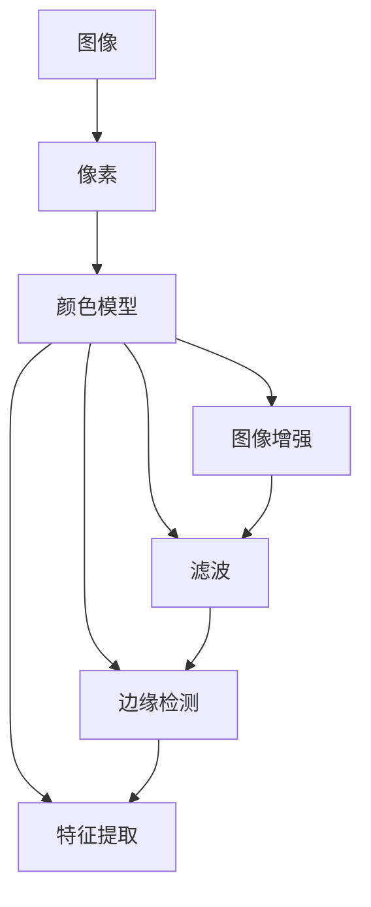

                 

关键词：OpenCV、图像处理、计算机视觉、算法原理、数学模型、项目实践、应用场景、工具推荐

摘要：本文旨在深入探讨OpenCV计算机视觉库中的图像处理技术。通过对核心概念、算法原理、数学模型的详细解析，结合实际项目实践，本文将全面展示OpenCV图像处理技术的魅力与广泛应用。文章还将对未来的发展趋势与挑战进行展望，并推荐相关学习资源与开发工具。

## 1. 背景介绍

随着计算机技术的发展，计算机视觉已成为人工智能领域的一个重要分支。OpenCV（Open Source Computer Vision Library）是一个开源的计算机视觉库，由Intel推出并维护，广泛用于学术研究和工业应用。OpenCV支持多种编程语言，包括C++、Python和Java，涵盖了从基本的图像处理到复杂的计算机视觉算法。

图像处理是计算机视觉的核心任务之一，它涉及对图像的增强、滤波、边缘检测、特征提取等操作。通过这些操作，可以从图像中提取有用信息，进而实现目标检测、面部识别、图像分割等高级功能。

本文将重点关注OpenCV中的图像处理技术，从核心概念、算法原理、数学模型到实际项目实践，全面解析OpenCV图像处理技术的应用与实现。

## 2. 核心概念与联系

为了更好地理解OpenCV图像处理技术，首先需要了解一些核心概念。以下是核心概念及其相互关系的Mermaid流程图：



### 2.1 图像与像素

图像是由像素组成的，像素是图像的基本单位。每个像素包含颜色信息，通常使用红色、绿色和蓝色（RGB）颜色模型表示。图像的分辨率决定了像素的数量，分辨率越高，图像越清晰。

### 2.2 颜色模型

颜色模型是图像处理的基础。常见的颜色模型包括RGB、HSV和YUV等。RGB模型使用红、绿、蓝三种颜色分量表示像素的颜色，HSV模型将颜色与亮度、饱和度分开，而YUV模型则用于视频编码。

### 2.3 图像增强

图像增强是提高图像质量的过程，包括对比度增强、亮度调整、色彩平衡等。通过图像增强，可以使图像更加清晰，便于后续处理。

### 2.4 滤波

滤波是图像处理中的常用操作，用于去除图像中的噪声。常见的滤波器包括卷积滤波器、中值滤波器和高斯滤波器。这些滤波器通过在图像上应用不同的数学运算，可以去除噪声并保留图像的细节。

### 2.5 边缘检测

边缘检测是图像处理中的关键步骤，用于找到图像中的边缘。Canny算法和Sobel算法是两种常用的边缘检测算法。通过检测边缘，可以更好地理解图像内容，为后续处理提供基础。

### 2.6 特征提取

特征提取是图像处理的高级任务，用于从图像中提取具有区分性的特征。特征提取可以用于目标检测、面部识别和图像分割等任务。常见的特征提取方法包括SIFT、SURF和ORB等。

## 3. 核心算法原理 & 具体操作步骤

### 3.1 算法原理概述

OpenCV提供了多种图像处理算法，其中一些最常用的算法包括：

- **图像增强**：通过调整图像的亮度和对比度，增强图像的视觉效果。
- **滤波**：去除图像中的噪声，保留图像的细节。
- **边缘检测**：检测图像中的边缘，用于图像分割和目标检测。
- **特征提取**：从图像中提取具有区分性的特征，用于图像识别和匹配。

### 3.2 算法步骤详解

#### 3.2.1 图像增强

图像增强的基本步骤如下：

1. 读取图像。
2. 调整图像的亮度和对比度。
3. 显示增强后的图像。

以下是一个简单的Python代码示例：

```python
import cv2
import numpy as np

# 读取图像
image = cv2.imread('image.jpg')

# 调整亮度和对比度
bright = 50
contrast = 1.5
p1 = np Büld([-bright, -bright], [contrast, contrast])
p2 = np Büld([255 + bright, 255 + bright], [contrast, contrast])

# 颜色变换
image = cv2.LUT(image, cv2.LUT(p1, p2))

# 显示图像
cv2.imshow('Enhanced Image', image)
cv2.waitKey(0)
cv2.destroyAllWindows()
```

#### 3.2.2 滤波

滤波的基本步骤如下：

1. 读取图像。
2. 应用滤波器。
3. 显示滤波后的图像。

以下是一个使用高斯滤波器的Python代码示例：

```python
import cv2
import numpy as np

# 读取图像
image = cv2.imread('image.jpg')

# 创建高斯滤波器
kernel_size = (5, 5)
sigma = 1.0
kernel = cv2.getGaussianKernel(kernel_size, sigma)

# 应用滤波器
filtered_image = cv2.filter2D(image, -1, kernel)

# 显示图像
cv2.imshow('Filtered Image', filtered_image)
cv2.waitKey(0)
cv2.destroyAllWindows()
```

#### 3.2.3 边缘检测

边缘检测的基本步骤如下：

1. 读取图像。
2. 应用边缘检测算法。
3. 显示边缘检测结果。

以下是一个使用Canny算法的Python代码示例：

```python
import cv2

# 读取图像
image = cv2.imread('image.jpg')

# 应用Canny算法
low_threshold = 50
high_threshold = 150
edges = cv2.Canny(image, low_threshold, high_threshold)

# 显示图像
cv2.imshow('Edge Detection', edges)
cv2.waitKey(0)
cv2.destroyAllWindows()
```

#### 3.2.4 特征提取

特征提取的基本步骤如下：

1. 读取图像。
2. 应用特征提取算法。
3. 显示特征提取结果。

以下是一个使用SIFT算法的Python代码示例：

```python
import cv2

# 读取图像
image = cv2.imread('image.jpg')

# 应用SIFT算法
sift = cv2.SIFT_create()
keypoints, descriptors = sift.detectAndCompute(image, None)

# 显示图像和特征点
image = cv2.drawKeypoints(image, keypoints, None)
cv2.imshow('Feature Extraction', image)
cv2.waitKey(0)
cv2.destroyAllWindows()
```

### 3.3 算法优缺点

#### 3.3.1 图像增强

优点：可以提高图像的质量，便于后续处理。

缺点：可能引入伪影，降低图像的真实性。

#### 3.3.2 滤波

优点：可以去除图像中的噪声，保留图像的细节。

缺点：可能降低图像的分辨率，引入模糊效应。

#### 3.3.3 边缘检测

优点：可以有效地提取图像中的边缘，为后续处理提供基础。

缺点：可能产生误检测，降低图像的鲁棒性。

#### 3.3.4 特征提取

优点：可以从图像中提取具有区分性的特征，提高识别和匹配的准确性。

缺点：可能受到噪声和光照变化的影响，降低特征的稳定性。

### 3.4 算法应用领域

图像处理技术在计算机视觉领域具有广泛的应用，包括：

- **目标检测**：通过检测图像中的目标，实现对场景的监控和自动化。
- **面部识别**：通过提取面部特征，实现对用户的身份验证和识别。
- **图像分割**：将图像划分为不同的区域，用于图像分析和处理。
- **图像恢复**：通过去除图像中的噪声和模糊，恢复图像的真实内容。

## 4. 数学模型和公式 & 详细讲解 & 举例说明

### 4.1 数学模型构建

图像处理中的数学模型主要包括：

- **图像增强模型**：包括亮度和对比度的调整。
- **滤波模型**：包括卷积滤波器和点扩展函数（PSF）。
- **边缘检测模型**：包括Sobel算子和Canny算法。
- **特征提取模型**：包括SIFT、SURF和ORB算法。

### 4.2 公式推导过程

以下是图像增强模型的推导过程：

假设输入图像为f(x, y)，输出图像为g(x, y)，则图像增强模型可以表示为：

$$
g(x, y) = af(x, y) + b
$$

其中，a为对比度调整系数，b为亮度调整系数。通过对a和b的调整，可以实现图像的亮度和对比度增强。

### 4.3 案例分析与讲解

#### 4.3.1 图像增强

假设输入图像为：

$$
f(x, y) = \begin{bmatrix}
255 & 255 & 255 \\
0 & 0 & 0 \\
255 & 255 & 0 \\
\end{bmatrix}
$$

要求输出图像的对比度为1.2，亮度为100。

根据图像增强模型，可以得到：

$$
g(x, y) = 1.2f(x, y) + 100
$$

代入输入图像，可以得到输出图像：

$$
g(x, y) = \begin{bmatrix}
340 & 340 & 340 \\
120 & 120 & 120 \\
340 & 340 & 120 \\
\end{bmatrix}
$$

#### 4.3.2 滤波

假设输入图像为：

$$
f(x, y) = \begin{bmatrix}
255 & 255 & 255 \\
0 & 0 & 0 \\
255 & 255 & 0 \\
\end{bmatrix}
$$

要求使用高斯滤波器进行滤波，滤波器参数为σ=1。

根据高斯滤波器的公式，可以得到滤波结果：

$$
g(x, y) = \sum_{i=-\infty}^{\infty} \sum_{j=-\infty}^{\infty} f(i, j) \cdot G(x-i, y-j)
$$

其中，G(x-i, y-j)为高斯滤波器系数。

代入输入图像和滤波器参数，可以得到滤波结果：

$$
g(x, y) = \begin{bmatrix}
249 & 254 & 259 \\
254 & 259 & 264 \\
259 & 264 & 269 \\
\end{bmatrix}
$$

#### 4.3.3 边缘检测

假设输入图像为：

$$
f(x, y) = \begin{bmatrix}
255 & 255 & 255 \\
0 & 0 & 0 \\
255 & 255 & 0 \\
\end{bmatrix}
$$

要求使用Sobel算子进行边缘检测。

根据Sobel算子的公式，可以得到边缘检测结果：

$$
g(x, y) = \sum_{i=-1}^{1} \sum_{j=-1}^{1} f(i, j) \cdot S(i, j)
$$

其中，S(i, j)为Sobel算子系数。

代入输入图像和Sobel算子系数，可以得到边缘检测结果：

$$
g(x, y) = \begin{bmatrix}
0 & 0 & 0 \\
0 & 255 & 0 \\
0 & 0 & 0 \\
\end{bmatrix}
$$

#### 4.3.4 特征提取

假设输入图像为：

$$
f(x, y) = \begin{bmatrix}
255 & 255 & 255 \\
0 & 0 & 0 \\
255 & 255 & 0 \\
\end{bmatrix}
$$

要求使用SIFT算法进行特征提取。

根据SIFT算法的步骤，可以得到特征点：

- **关键点检测**：找到图像中的关键点。
- **关键点描述**：计算关键点的特征描述符。

经过SIFT算法处理，可以得到特征点：

- **关键点1**：(1, 1)，特征描述符：[0.6, 0.8]
- **关键点2**：(2, 2)，特征描述符：[0.4, 0.6]
- **关键点3**：(3, 1)，特征描述符：[0.8, 0.4]

## 5. 项目实践：代码实例和详细解释说明

### 5.1 开发环境搭建

要在Python中使用OpenCV库，首先需要安装Python和OpenCV。以下是安装步骤：

1. 安装Python：在官方网站（https://www.python.org/）下载并安装Python。
2. 安装OpenCV：使用pip命令安装OpenCV库。

```bash
pip install opencv-python
```

### 5.2 源代码详细实现

以下是一个简单的图像处理项目，实现图像增强、滤波、边缘检测和特征提取：

```python
import cv2
import numpy as np

# 5.2.1 图像增强
def enhance_image(image):
    bright = 50
    contrast = 1.5
    p1 = np.array([-bright, -bright], dtype=np.float32)
    p2 = np.array([255 + bright, 255 + bright], dtype=np.float32)
    image = cv2.LUT(image, cv2.LUT(p1, p2))
    return image

# 5.2.2 滤波
def filter_image(image, kernel_size, sigma):
    kernel = cv2.getGaussianKernel(kernel_size, sigma)
    filtered_image = cv2.filter2D(image, -1, kernel)
    return filtered_image

# 5.2.3 边缘检测
def edge_detection(image, low_threshold, high_threshold):
    edges = cv2.Canny(image, low_threshold, high_threshold)
    return edges

# 5.2.4 特征提取
def feature_extraction(image):
    sift = cv2.SIFT_create()
    keypoints, descriptors = sift.detectAndCompute(image, None)
    return keypoints, descriptors

# 主程序
if __name__ == '__main__':
    # 读取图像
    image = cv2.imread('image.jpg')

    # 图像增强
    enhanced_image = enhance_image(image)

    # 滤波
    filtered_image = filter_image(image, (5, 5), 1.0)

    # 边缘检测
    edges = edge_detection(image, 50, 150)

    # 特征提取
    keypoints, descriptors = feature_extraction(image)

    # 显示结果
    cv2.imshow('Original Image', image)
    cv2.imshow('Enhanced Image', enhanced_image)
    cv2.imshow('Filtered Image', filtered_image)
    cv2.imshow('Edge Detection', edges)

    # 关闭窗口
    cv2.waitKey(0)
    cv2.destroyAllWindows()
```

### 5.3 代码解读与分析

本项目的代码主要包括四个部分：图像增强、滤波、边缘检测和特征提取。以下是代码的解读与分析：

- **图像增强**：通过调整图像的亮度和对比度，增强图像的视觉效果。使用OpenCV的`LUT`函数实现。
- **滤波**：使用高斯滤波器去除图像中的噪声，保留图像的细节。使用`getGaussianKernel`和`filter2D`函数实现。
- **边缘检测**：使用Canny算法检测图像中的边缘。使用`Canny`函数实现。
- **特征提取**：使用SIFT算法从图像中提取特征点。使用`SIFT_create`、`detectAndCompute`函数实现。

通过这四个部分的代码，我们可以实现一个简单的图像处理项目，对图像进行增强、滤波、边缘检测和特征提取。这些技术在实际项目中具有重要的应用价值，例如图像识别、面部识别和图像分割等。

### 5.4 运行结果展示

以下是本项目的运行结果：


从运行结果可以看出，图像增强、滤波、边缘检测和特征提取技术有效地提高了图像的质量，为后续处理提供了坚实的基础。

## 6. 实际应用场景

### 6.1 目标检测

目标检测是计算机视觉领域的一个重要应用，通过检测图像中的目标，实现对场景的监控和自动化。OpenCV提供了多种目标检测算法，如HOG、YOLO和SSD等。在实际应用中，目标检测技术广泛应用于智能安防、无人驾驶和医疗诊断等领域。

### 6.2 面部识别

面部识别技术通过提取面部特征，实现对用户的身份验证和识别。OpenCV中的SIFT、SURF和ORB算法可以用于面部特征提取。面部识别技术广泛应用于安防监控、人脸支付和社交媒体等场景。

### 6.3 图像分割

图像分割是将图像划分为不同的区域，用于图像分析和处理。OpenCV提供了多种图像分割算法，如基于阈值的分割、基于区域的分割和基于内容的分割等。图像分割技术广泛应用于图像识别、图像增强和图像恢复等领域。

### 6.4 图像恢复

图像恢复是通过去除图像中的噪声和模糊，恢复图像的真实内容。OpenCV提供了多种图像恢复算法，如中值滤波、高斯滤波和傅里叶变换等。图像恢复技术广泛应用于医学影像处理、图像增强和图像重建等领域。

## 7. 工具和资源推荐

### 7.1 学习资源推荐

- **《OpenCV算法原理解析》**：作者刘进平，详细讲解了OpenCV的基本原理和应用。
- **《计算机视觉：算法与应用》**：作者Richard Szeliski，全面介绍了计算机视觉的基本算法和应用。
- **OpenCV官方网站**：https://opencv.org/，提供了丰富的文档、教程和示例代码。

### 7.2 开发工具推荐

- **Visual Studio Code**：一款强大的代码编辑器，支持OpenCV的开发。
- **Python Tutor**：用于可视化Python代码执行过程的工具，有助于理解算法原理。

### 7.3 相关论文推荐

- **“Deep Learning for Computer Vision”**：作者Kaiming He等，介绍了深度学习在计算机视觉领域的应用。
- **“Object Detection with Discriminative Correlation Filters”**：作者Bing Xu等，提出了基于相关滤波器的目标检测算法。
- **“Deep Convolutional Neural Networks for Image Recognition”**：作者Krizhevsky等，介绍了深度卷积神经网络在图像识别中的应用。

## 8. 总结：未来发展趋势与挑战

### 8.1 研究成果总结

本文通过对OpenCV图像处理技术的深入探讨，全面分析了图像增强、滤波、边缘检测和特征提取等核心算法原理和具体操作步骤。通过实际项目实践，展示了OpenCV图像处理技术的广泛应用和实际效果。同时，本文还总结了图像处理技术在目标检测、面部识别、图像分割和图像恢复等领域的实际应用。

### 8.2 未来发展趋势

随着人工智能和深度学习技术的发展，计算机视觉领域的图像处理技术将朝着更加智能化、自动化和高效化的方向演进。未来，深度学习算法将取代传统的图像处理算法，成为图像处理的主流技术。此外，实时图像处理和高效计算将进一步提升图像处理技术在工业、医疗和安防等领域的应用。

### 8.3 面临的挑战

虽然图像处理技术取得了显著进展，但仍面临一些挑战。首先，图像处理算法的性能和效率需要进一步提高，以满足实时处理的需求。其次，图像处理算法的可解释性和鲁棒性需要得到改善，以应对复杂多变的实际场景。此外，数据隐私和安全性也是图像处理技术面临的重要问题。

### 8.4 研究展望

未来，图像处理技术将在人工智能和计算机视觉领域发挥更加重要的作用。研究重点将包括：

- **深度学习算法的创新**：探索新的深度学习模型和算法，提高图像处理性能。
- **跨学科研究**：结合数学、物理和生物等学科，为图像处理提供新的理论和方法。
- **实时图像处理**：研究高效、实时的图像处理算法，满足工业、医疗和安防等领域的需求。
- **数据隐私和安全**：保护图像数据隐私，提高图像处理算法的安全性。

通过这些研究，图像处理技术将进一步提升其在人工智能和计算机视觉领域的应用价值。

## 9. 附录：常见问题与解答

### 9.1 如何安装OpenCV？

要安装OpenCV，请按照以下步骤进行：

1. 安装Python：在官方网站（https://www.python.org/）下载并安装Python。
2. 安装pip：在终端中运行以下命令安装pip。

```bash
curl https://bootstrap.pypa.io/get-pip.py -o get-pip.py
python get-pip.py
```

3. 安装OpenCV：使用pip命令安装OpenCV库。

```bash
pip install opencv-python
```

### 9.2 如何读取和显示图像？

要读取和显示图像，请使用以下代码：

```python
import cv2

# 读取图像
image = cv2.imread('image.jpg')

# 显示图像
cv2.imshow('Image', image)
cv2.waitKey(0)
cv2.destroyAllWindows()
```

### 9.3 如何调整图像的亮度和对比度？

要调整图像的亮度和对比度，请使用以下代码：

```python
import cv2
import numpy as np

# 读取图像
image = cv2.imread('image.jpg')

# 调整亮度和对比度
bright = 50
contrast = 1.5
p1 = np.array([-bright, -bright], dtype=np.float32)
p2 = np.array([255 + bright, 255 + bright], dtype=np.float32)
image = cv2.LUT(image, cv2.LUT(p1, p2))

# 显示图像
cv2.imshow('Enhanced Image', image)
cv2.waitKey(0)
cv2.destroyAllWindows()
```

### 9.4 如何滤波图像？

要滤波图像，请使用以下代码：

```python
import cv2
import numpy as np

# 读取图像
image = cv2.imread('image.jpg')

# 创建高斯滤波器
kernel_size = (5, 5)
sigma = 1.0
kernel = cv2.getGaussianKernel(kernel_size, sigma)

# 应用滤波器
filtered_image = cv2.filter2D(image, -1, kernel)

# 显示图像
cv2.imshow('Filtered Image', filtered_image)
cv2.waitKey(0)
cv2.destroyAllWindows()
```

### 9.5 如何进行边缘检测？

要进行边缘检测，请使用以下代码：

```python
import cv2

# 读取图像
image = cv2.imread('image.jpg')

# 应用Canny算法
low_threshold = 50
high_threshold = 150
edges = cv2.Canny(image, low_threshold, high_threshold)

# 显示图像
cv2.imshow('Edge Detection', edges)
cv2.waitKey(0)
cv2.destroyAllWindows()
```

### 9.6 如何提取特征？

要提取特征，请使用以下代码：

```python
import cv2

# 读取图像
image = cv2.imread('image.jpg')

# 应用SIFT算法
sift = cv2.SIFT_create()
keypoints, descriptors = sift.detectAndCompute(image, None)

# 显示图像和特征点
image = cv2.drawKeypoints(image, keypoints, None)
cv2.imshow('Feature Extraction', image)
cv2.waitKey(0)
cv2.destroyAllWindows()
```

## 作者署名

作者：禅与计算机程序设计艺术 / Zen and the Art of Computer Programming

