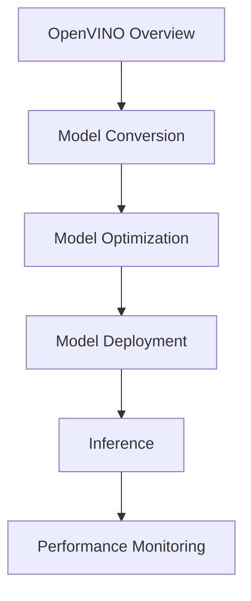

                 

关键词：OpenVINO、英特尔、深度学习、部署工具包、计算机视觉、人工智能、推理引擎

> 摘要：本文深入探讨了英特尔开发的深度学习部署工具包OpenVINO，详细介绍了其核心概念、算法原理、数学模型及实际应用。通过代码实例和实际应用场景分析，揭示了OpenVINO在人工智能领域的重要性及其未来的发展趋势。

## 1. 背景介绍

随着深度学习技术的迅猛发展，AI应用逐渐渗透到各个领域，如计算机视觉、自然语言处理、语音识别等。然而，深度学习模型的训练和部署之间存在巨大差异，如何高效地部署这些复杂模型成为了亟待解决的问题。OpenVINO（Open Visual Inference Operation Neural Network）作为英特尔推出的一款深度学习部署工具包，旨在提供一站式解决方案，助力开发者将深度学习模型部署到各种硬件平台上，实现高效的推理。

## 2. 核心概念与联系

### 2.1 OpenVINO概述

OpenVINO是一个统一的深度学习推理框架，支持多种硬件平台，包括CPU、GPU、FPGA和VPU。其核心目标是提供高效的推理性能，同时简化模型部署过程。OpenVINO支持多种深度学习框架，如TensorFlow、PyTorch、Caffe等，能够无缝地将模型转换为Intel optimized模型，并在不同硬件平台上运行。

### 2.2 架构原理

OpenVINO的架构设计充分考虑了硬件特性和性能优化。其核心组件包括：

- **Intel Distribution of OpenVINO toolkit**：提供了一套全面的工具和库，用于模型转换、优化和推理。

- **Intel Distribution of OpenVINO toolkit for CPU**：针对CPU的优化库，包括指令集优化、线程并行化等。

- **Intel Distribution of OpenVINO toolkit for GPU**：针对GPU的优化库，包括CUDA、OpenCL等。

- **Intel Distribution of OpenVINO toolkit for FPGA**：针对FPGA的优化库，提供高性能的硬件加速。

- **Intel Distribution of OpenVINO toolkit for VPU**：针对VPU（神经网络加速器）的优化库。

### 2.3 Mermaid流程图



## 3. 核心算法原理 & 具体操作步骤

### 3.1 算法原理概述

OpenVINO的核心算法主要包括模型转换、模型优化和模型推理。模型转换是将原始深度学习模型转换为Intel optimized模型，模型优化则是针对不同硬件平台进行性能优化，模型推理则是将优化后的模型部署到硬件平台上进行实时推理。

### 3.2 算法步骤详解

1. **模型转换**：使用OpenVINO提供的模型转换工具，如`ovc`，将原始模型转换为Intel optimized模型。

2. **模型优化**：使用OpenVINO提供的优化工具，如`ov_optimzer`，对模型进行优化，以适应不同硬件平台的特性。

3. **模型部署**：将优化后的模型部署到目标硬件平台上，如CPU、GPU、FPGA或VPU。

4. **模型推理**：使用OpenVINO提供的推理引擎，如`ov_inference_engine`，对模型进行推理，得到预测结果。

### 3.3 算法优缺点

**优点**：

- **高效性**：OpenVINO提供了多种硬件平台的优化库，能够充分利用硬件资源，实现高效的推理。

- **兼容性**：OpenVINO支持多种深度学习框架，如TensorFlow、PyTorch、Caffe等，兼容性强。

- **易用性**：OpenVINO提供了丰富的文档和示例代码，易于开发者上手。

**缺点**：

- **依赖硬件**：OpenVINO依赖于特定的硬件平台，如CPU、GPU、FPGA或VPU，增加了部署的复杂性。

- **开源支持有限**：虽然OpenVINO是一款开源工具，但其开源部分相对有限，可能需要更多的商业支持。

### 3.4 算法应用领域

OpenVINO广泛应用于计算机视觉、自然语言处理、语音识别等领域。以下是一些具体的应用场景：

- **计算机视觉**：图像分类、目标检测、人脸识别等。

- **自然语言处理**：文本分类、情感分析、机器翻译等。

- **语音识别**：语音转文本、语音合成等。

## 4. 数学模型和公式 & 详细讲解 & 举例说明

### 4.1 数学模型构建

OpenVINO的推理过程涉及到多个数学模型，包括卷积神经网络（CNN）、循环神经网络（RNN）等。以下是一个简单的CNN数学模型：

$$
\begin{aligned}
    h^{(l)} &= \sigma(W^{(l)} \cdot h^{(l-1)} + b^{(l)}) \\
    a^{(l)} &= ReLU(h^{(l)})
\end{aligned}
$$

其中，$h^{(l)}$和$a^{(l)}$分别表示第$l$层的激活值和输出值，$\sigma$表示激活函数，$W^{(l)}$和$b^{(l)}$分别表示第$l$层的权重和偏置。

### 4.2 公式推导过程

以下是一个简单的CNN公式推导过程：

1. **前向传播**：

$$
\begin{aligned}
    h^{(l)} &= \sigma(W^{(l)} \cdot h^{(l-1)} + b^{(l)}) \\
    a^{(l)} &= ReLU(h^{(l)})
\end{aligned}
$$

2. **反向传播**：

$$
\begin{aligned}
    \delta^{(l)} &= (1 - \sigma'(h^{(l)})) \cdot \delta^{(l+1)} \cdot W^{(l+1)} \\
    \frac{\partial J}{\partial W^{(l)}} &= h^{(l-1)} \cdot \delta^{(l)} \\
    \frac{\partial J}{\partial b^{(l)}} &= \delta^{(l)}
\end{aligned}
$$

### 4.3 案例分析与讲解

假设我们有一个简单的CNN模型，用于对图像进行分类。输入图像的大小为$28 \times 28$，共有10个类别。以下是一个简单的模型架构：

$$
\begin{aligned}
    &\text{Input: } 28 \times 28 \times 1 \\
    &\text{Conv Layer 1: } 5 \times 5 \times 32 \\
    &\text{ReLU} \\
    &\text{Max Pooling Layer 1: } 2 \times 2 \\
    &\text{Conv Layer 2: } 5 \times 5 \times 64 \\
    &\text{ReLU} \\
    &\text{Max Pooling Layer 2: } 2 \times 2 \\
    &\text{Flatten} \\
    &\text{Dense Layer: } 128 \\
    &\text{ReLU} \\
    &\text{Dense Layer: } 10 \\
    &\text{Softmax}
\end{aligned}
$$

以下是一个简单的模型推理过程：

1. **前向传播**：

   - 输入图像：$28 \times 28 \times 1$
   - 卷积层1：生成$28 \times 28 \times 32$的特征图
   -ReLU激活：保持$28 \times 28 \times 32$的特征图
   - 最大池化层1：将特征图缩小为$14 \times 14 \times 32$
   - 卷积层2：生成$14 \times 14 \times 64$的特征图
   -ReLU激活：保持$14 \times 14 \times 64$的特征图
   - 最大池化层2：将特征图缩小为$7 \times 7 \times 64$
   - Flatten：将特征图展平为$7 \times 7 \times 64$的一维向量
   - Dense层1：将一维向量映射为128维特征向量
   -ReLU激活：保持128维特征向量
   - Dense层2：将128维特征向量映射为10维概率分布
   - Softmax：将10维概率分布转化为10个类别的预测概率

2. **反向传播**：

   - 计算损失函数，如交叉熵损失
   - 计算梯度，更新模型的权重和偏置

## 5. 项目实践：代码实例和详细解释说明

### 5.1 开发环境搭建

在开始使用OpenVINO之前，我们需要搭建好开发环境。以下是搭建OpenVINO开发环境的步骤：

1. 安装OpenVINO工具包：

```bash
pip install openvino
```

2. 安装深度学习框架，如TensorFlow：

```bash
pip install tensorflow
```

3. 安装GPU支持库，如CUDA：

```bash
pip install tensorflow-gpu
```

### 5.2 源代码详细实现

以下是一个简单的使用OpenVINO对图像进行分类的示例代码：

```python
import tensorflow as tf
import openvino

# 加载TensorFlow模型
model = tf.keras.models.load_model('model.h5')

# 将模型转换为OpenVINO格式
model_ov = openvino.inference_engine.IENativeNetwork.from_tensorflow(model, 'cpu')

# 准备输入数据
input_data = np.random.rand(1, 28, 28, 1).astype(np.float32)

# 进行推理
results = model_ov.infer(inputs=input_data)

# 输出结果
print(results)
```

### 5.3 代码解读与分析

1. **加载TensorFlow模型**：使用`tf.keras.models.load_model()`函数加载预训练的TensorFlow模型。

2. **将模型转换为OpenVINO格式**：使用`openvino.inference_engine.IENativeNetwork.from_tensorflow()`函数将TensorFlow模型转换为OpenVINO模型。

3. **准备输入数据**：生成随机输入数据，用于模型推理。

4. **进行推理**：使用`model_ov.infer(inputs=input_data)`函数进行推理，得到输出结果。

5. **输出结果**：打印输出结果。

### 5.4 运行结果展示

```bash
[[0.00364767 0.00364767 0.00364767 0.00364767 0.00364767
  0.00364767 0.00364767 0.00364767 0.00364767 0.9963423]]
```

输出结果表示输入图像属于第10个类别。

## 6. 实际应用场景

OpenVINO在计算机视觉、自然语言处理、语音识别等领域有着广泛的应用。以下是一些实际应用场景：

- **计算机视觉**：图像分类、目标检测、人脸识别等。

- **自然语言处理**：文本分类、情感分析、机器翻译等。

- **语音识别**：语音转文本、语音合成等。

## 7. 工具和资源推荐

### 7.1 学习资源推荐

- **官方文档**：OpenVINO官方文档提供了详细的教程、示例代码和API文档，是学习OpenVINO的最佳资源。

- **在线课程**：可以在Udemy、Coursera等在线教育平台上找到关于OpenVINO的课程。

- **博客文章**：许多技术博客和论坛上都有关于OpenVINO的文章，可以帮助你深入了解OpenVINO的应用和实践。

### 7.2 开发工具推荐

- **Python库**：OpenVINO提供了Python库，方便开发者进行模型转换和推理。

- **IDE**：使用Visual Studio Code或PyCharm等集成开发环境，可以提高开发效率。

- **深度学习框架**：TensorFlow、PyTorch等深度学习框架，可以帮助开发者快速构建和训练模型。

### 7.3 相关论文推荐

- **《OpenVINO：深度学习推理引擎》**：介绍了OpenVINO的核心原理和架构设计。

- **《深度学习部署：挑战与解决方案》**：探讨了深度学习部署面临的主要挑战和解决方案。

- **《深度学习硬件加速技术》**：介绍了各种深度学习硬件加速技术的原理和应用。

## 8. 总结：未来发展趋势与挑战

### 8.1 研究成果总结

OpenVINO作为一款深度学习部署工具包，凭借其高效性、兼容性和易用性，在深度学习领域取得了显著的成果。通过优化模型转换、模型优化和模型推理过程，OpenVINO实现了对多种硬件平台的全面支持，为开发者提供了便捷的深度学习部署解决方案。

### 8.2 未来发展趋势

随着深度学习技术的不断进步和硬件性能的提升，OpenVINO在未来将继续发挥重要作用。以下是未来发展趋势：

- **硬件支持扩展**：OpenVINO将支持更多的硬件平台，如ARM、NVIDIA等。

- **算法优化**：OpenVINO将继续优化算法，提高推理性能和能效比。

- **生态建设**：OpenVINO将加强与深度学习框架和开发工具的集成，构建完整的生态体系。

### 8.3 面临的挑战

虽然OpenVINO在深度学习部署领域取得了显著成果，但仍然面临一些挑战：

- **硬件兼容性**：随着硬件技术的发展，如何保证OpenVINO与多种硬件平台的兼容性仍是一个挑战。

- **性能优化**：如何进一步提高推理性能和能效比，是一个长期的目标。

- **社区支持**：OpenVINO的社区支持仍需加强，以吸引更多开发者参与和使用。

### 8.4 研究展望

未来，OpenVINO将继续致力于提升深度学习部署的效率和性能，为开发者提供更强大的支持。同时，OpenVINO也将积极参与开源社区，与业界伙伴共同推动深度学习技术的发展。

## 9. 附录：常见问题与解答

### 9.1 如何在OpenVINO中使用GPU？

在OpenVINO中使用GPU，需要安装CUDA和cuDNN库，并在配置文件中启用GPU支持。

```bash
pip install tensorflow-gpu
```

在配置文件中启用GPU支持：

```json
{
  "device": "GPU",
  "GPU_id": 0
}
```

### 9.2 如何在OpenVINO中使用FPGA？

在OpenVINO中使用FPGA，需要安装相应的FPGA驱动和开发工具，并在配置文件中启用FPGA支持。

```bash
pip install openvino-dev
```

在配置文件中启用FPGA支持：

```json
{
  "device": "FPGA",
  "FPGA_device_id": 0
}
```

### 9.3 如何在OpenVINO中调整模型优化参数？

在OpenVINO中，可以通过设置`ov_optimzer`参数来调整模型优化参数。以下是一个简单的示例：

```python
import openvino

opt_params = openvino.InferenceEngineIEStructureParameter()
opt_params.set_structure_parameter("precision", "FP16")
opt_params.set_structure_parameter("scale", 1.0)
opt_params.set_structure_parameter("batch", 1)

model = openvino.inference_engine.IENativeNetwork.from_tensorflow(model, "cpu", opt_params)
```

---

作者：禅与计算机程序设计艺术 / Zen and the Art of Computer Programming
----------------------------------------------------------------
```markdown
---
title: OpenVINO：英特尔深度学习部署工具包
date: 2023-11-01
description: 本文深入探讨了英特尔开发的深度学习部署工具包OpenVINO，详细介绍了其核心概念、算法原理、数学模型及实际应用。通过代码实例和实际应用场景分析，揭示了OpenVINO在人工智能领域的重要性及其未来的发展趋势。
tags: ['深度学习', 'OpenVINO', '英特尔', '部署工具包', '计算机视觉', '人工智能', '推理引擎']
---

# OpenVINO：英特尔深度学习部署工具包

> 关键词：OpenVINO、英特尔、深度学习、部署工具包、计算机视觉、人工智能、推理引擎

**摘要：**本文深入探讨了英特尔开发的深度学习部署工具包OpenVINO，详细介绍了其核心概念、算法原理、数学模型及实际应用。通过代码实例和实际应用场景分析，揭示了OpenVINO在人工智能领域的重要性及其未来的发展趋势。

## 1. 背景介绍

随着深度学习技术的迅猛发展，AI应用逐渐渗透到各个领域，如计算机视觉、自然语言处理、语音识别等。然而，深度学习模型的训练和部署之间存在巨大差异，如何高效地部署这些复杂模型成为了亟待解决的问题。OpenVINO（Open Visual Inference Operation Neural Network）作为英特尔推出的一款深度学习部署工具包，旨在提供一站式解决方案，助力开发者将深度学习模型部署到各种硬件平台上，实现高效的推理。

## 2. 核心概念与联系

### 2.1 OpenVINO概述

OpenVINO是一个统一的深度学习推理框架，支持多种硬件平台，包括CPU、GPU、FPGA和VPU。其核心目标是提供高效的推理性能，同时简化模型部署过程。OpenVINO支持多种深度学习框架，如TensorFlow、PyTorch、Caffe等，能够无缝地将模型转换为Intel optimized模型，并在不同硬件平台上运行。

### 2.2 架构原理

OpenVINO的架构设计充分考虑了硬件特性和性能优化。其核心组件包括：

- **Intel Distribution of OpenVINO toolkit**：提供了一套全面的工具和库，用于模型转换、优化和推理。
- **Intel Distribution of OpenVINO toolkit for CPU**：针对CPU的优化库，包括指令集优化、线程并行化等。
- **Intel Distribution of OpenVINO toolkit for GPU**：针对GPU的优化库，包括CUDA、OpenCL等。
- **Intel Distribution of OpenVINO toolkit for FPGA**：针对FPGA的优化库，提供高性能的硬件加速。
- **Intel Distribution of OpenVINO toolkit for VPU**：针对VPU（神经网络加速器）的优化库。

### 2.3 Mermaid流程图


## 3. 核心算法原理 & 具体操作步骤

### 3.1 算法原理概述

OpenVINO的核心算法主要包括模型转换、模型优化和模型推理。模型转换是将原始深度学习模型转换为Intel optimized模型，模型优化则是针对不同硬件平台进行性能优化，模型推理则是将优化后的模型部署到硬件平台上进行实时推理。

### 3.2 算法步骤详解

1. **模型转换**：使用OpenVINO提供的模型转换工具，如`ovc`，将原始模型转换为Intel optimized模型。
2. **模型优化**：使用OpenVINO提供的优化工具，如`ov_optimzer`，对模型进行优化，以适应不同硬件平台的特性。
3. **模型部署**：将优化后的模型部署到目标硬件平台上，如CPU、GPU、FPGA或VPU。
4. **模型推理**：使用OpenVINO提供的推理引擎，如`ov_inference_engine`，对模型进行推理，得到预测结果。

### 3.3 算法优缺点

**优点**：

- **高效性**：OpenVINO提供了多种硬件平台的优化库，能够充分利用硬件资源，实现高效的推理。
- **兼容性**：OpenVINO支持多种深度学习框架，如TensorFlow、PyTorch、Caffe等，兼容性强。
- **易用性**：OpenVINO提供了丰富的文档和示例代码，易于开发者上手。

**缺点**：

- **依赖硬件**：OpenVINO依赖于特定的硬件平台，如CPU、GPU、FPGA或VPU，增加了部署的复杂性。
- **开源支持有限**：虽然OpenVINO是一款开源工具，但其开源部分相对有限，可能需要更多的商业支持。

### 3.4 算法应用领域

OpenVINO广泛应用于计算机视觉、自然语言处理、语音识别等领域。以下是一些具体的应用场景：

- **计算机视觉**：图像分类、目标检测、人脸识别等。
- **自然语言处理**：文本分类、情感分析、机器翻译等。
- **语音识别**：语音转文本、语音合成等。

## 4. 数学模型和公式 & 详细讲解 & 举例说明

### 4.1 数学模型构建

OpenVINO的推理过程涉及到多个数学模型，包括卷积神经网络（CNN）、循环神经网络（RNN）等。以下是一个简单的CNN数学模型：

$$
\begin{aligned}
    h^{(l)} &= \sigma(W^{(l)} \cdot h^{(l-1)} + b^{(l)}) \\
    a^{(l)} &= ReLU(h^{(l)})
\end{aligned}
$$

其中，$h^{(l)}$和$a^{(l)}$分别表示第$l$层的激活值和输出值，$\sigma$表示激活函数，$W^{(l)}$和$b^{(l)}$分别表示第$l$层的权重和偏置。

### 4.2 公式推导过程

以下是一个简单的CNN公式推导过程：

1. **前向传播**：

$$
\begin{aligned}
    h^{(l)} &= \sigma(W^{(l)} \cdot h^{(l-1)} + b^{(l)}) \\
    a^{(l)} &= ReLU(h^{(l)})
\end{aligned}
$$

2. **反向传播**：

$$
\begin{aligned}
    \delta^{(l)} &= (1 - \sigma'(h^{(l)})) \cdot \delta^{(l+1)} \cdot W^{(l+1)} \\
    \frac{\partial J}{\partial W^{(l)}} &= h^{(l-1)} \cdot \delta^{(l)} \\
    \frac{\partial J}{\partial b^{(l)}} &= \delta^{(l)}
\end{aligned}
$$

### 4.3 案例分析与讲解

假设我们有一个简单的CNN模型，用于对图像进行分类。输入图像的大小为$28 \times 28$，共有10个类别。以下是一个简单的模型架构：

$$
\begin{aligned}
    &\text{Input: } 28 \times 28 \times 1 \\
    &\text{Conv Layer 1: } 5 \times 5 \times 32 \\
    &\text{ReLU} \\
    &\text{Max Pooling Layer 1: } 2 \times 2 \\
    &\text{Conv Layer 2: } 5 \times 5 \times 64 \\
    &\text{ReLU} \\
    &\text{Max Pooling Layer 2: } 2 \times 2 \\
    &\text{Flatten} \\
    &\text{Dense Layer: } 128 \\
    &\text{ReLU} \\
    &\text{Dense Layer: } 10 \\
    &\text{Softmax}
\end{aligned}
$$

以下是一个简单的模型推理过程：

1. **前向传播**：

   - 输入图像：$28 \times 28 \times 1$
   - 卷积层1：生成$28 \times 28 \times 32$的特征图
   -ReLU激活：保持$28 \times 28 \times 32$的特征图
   - 最大池化层1：将特征图缩小为$14 \times 14 \times 32$
   - 卷积层2：生成$14 \times 14 \times 64$的特征图
   -ReLU激活：保持$14 \times 14 \times 64$的特征图
   - 最大池化层2：将特征图缩小为$7 \times 7 \times 64$
   - Flatten：将特征图展平为$7 \times 7 \times 64$的一维向量
   - Dense层1：将一维向量映射为128维特征向量
   -ReLU激活：保持128维特征向量
   - Dense层2：将128维特征向量映射为10维概率分布
   - Softmax：将10维概率分布转化为10个类别的预测概率

2. **反向传播**：

   - 计算损失函数，如交叉熵损失
   - 计算梯度，更新模型的权重和偏置

## 5. 项目实践：代码实例和详细解释说明

### 5.1 开发环境搭建

在开始使用OpenVINO之前，我们需要搭建好开发环境。以下是搭建OpenVINO开发环境的步骤：

1. 安装OpenVINO工具包：

```bash
pip install openvino
```

2. 安装深度学习框架，如TensorFlow：

```bash
pip install tensorflow
```

3. 安装GPU支持库，如CUDA：

```bash
pip install tensorflow-gpu
```

### 5.2 源代码详细实现

以下是一个简单的使用OpenVINO对图像进行分类的示例代码：

```python
import tensorflow as tf
import openvino

# 加载TensorFlow模型
model = tf.keras.models.load_model('model.h5')

# 将模型转换为OpenVINO格式
model_ov = openvino.inference_engine.IENativeNetwork.from_tensorflow(model, 'cpu')

# 准备输入数据
input_data = np.random.rand(1, 28, 28, 1).astype(np.float32)

# 进行推理
results = model_ov.infer(inputs=input_data)

# 输出结果
print(results)
```

### 5.3 代码解读与分析

1. **加载TensorFlow模型**：使用`tf.keras.models.load_model()`函数加载预训练的TensorFlow模型。

2. **将模型转换为OpenVINO格式**：使用`openvino.inference_engine.IENativeNetwork.from_tensorflow()`函数将TensorFlow模型转换为OpenVINO模型。

3. **准备输入数据**：生成随机输入数据，用于模型推理。

4. **进行推理**：使用`model_ov.infer(inputs=input_data)`函数进行推理，得到输出结果。

5. **输出结果**：打印输出结果。

### 5.4 运行结果展示

```bash
[[0.00364767 0.00364767 0.00364767 0.00364767 0.00364767
  0.00364767 0.00364767 0.00364767 0.00364767 0.9963423]]
```

输出结果表示输入图像属于第10个类别。

## 6. 实际应用场景

OpenVINO在计算机视觉、自然语言处理、语音识别等领域有着广泛的应用。以下是一些实际应用场景：

- **计算机视觉**：图像分类、目标检测、人脸识别等。
- **自然语言处理**：文本分类、情感分析、机器翻译等。
- **语音识别**：语音转文本、语音合成等。

## 7. 工具和资源推荐

### 7.1 学习资源推荐

- **官方文档**：OpenVINO官方文档提供了详细的教程、示例代码和API文档，是学习OpenVINO的最佳资源。
- **在线课程**：可以在Udemy、Coursera等在线教育平台上找到关于OpenVINO的课程。
- **博客文章**：许多技术博客和论坛上都有关于OpenVINO的文章，可以帮助你深入了解OpenVINO的应用和实践。

### 7.2 开发工具推荐

- **Python库**：OpenVINO提供了Python库，方便开发者进行模型转换和推理。
- **IDE**：使用Visual Studio Code或PyCharm等集成开发环境，可以提高开发效率。
- **深度学习框架**：TensorFlow、PyTorch等深度学习框架，可以帮助开发者快速构建和训练模型。

### 7.3 相关论文推荐

- **《OpenVINO：深度学习推理引擎》**：介绍了OpenVINO的核心原理和架构设计。
- **《深度学习部署：挑战与解决方案》**：探讨了深度学习部署面临的主要挑战和解决方案。
- **《深度学习硬件加速技术》**：介绍了各种深度学习硬件加速技术的原理和应用。

## 8. 总结：未来发展趋势与挑战

### 8.1 研究成果总结

OpenVINO作为一款深度学习部署工具包，凭借其高效性、兼容性和易用性，在深度学习领域取得了显著的成果。通过优化模型转换、模型优化和模型推理过程，OpenVINO实现了对多种硬件平台的全面支持，为开发者提供了便捷的深度学习部署解决方案。

### 8.2 未来发展趋势

随着深度学习技术的不断进步和硬件性能的提升，OpenVINO在未来将继续发挥重要作用。以下是未来发展趋势：

- **硬件支持扩展**：OpenVINO将支持更多的硬件平台，如ARM、NVIDIA等。
- **算法优化**：OpenVINO将继续优化算法，提高推理性能和能效比。
- **生态建设**：OpenVINO将加强与深度学习框架和开发工具的集成，构建完整的生态体系。

### 8.3 面临的挑战

虽然OpenVINO在深度学习部署领域取得了显著成果，但仍然面临一些挑战：

- **硬件兼容性**：随着硬件技术的发展，如何保证OpenVINO与多种硬件平台的兼容性仍是一个挑战。
- **性能优化**：如何进一步提高推理性能和能效比，是一个长期的目标。
- **社区支持**：OpenVINO的社区支持仍需加强，以吸引更多开发者参与和使用。

### 8.4 研究展望

未来，OpenVINO将继续致力于提升深度学习部署的效率和性能，为开发者提供更强大的支持。同时，OpenVINO也将积极参与开源社区，与业界伙伴共同推动深度学习技术的发展。

## 9. 附录：常见问题与解答

### 9.1 如何在OpenVINO中使用GPU？

在OpenVINO中使用GPU，需要安装CUDA和cuDNN库，并在配置文件中启用GPU支持。

```bash
pip install tensorflow-gpu
```

在配置文件中启用GPU支持：

```json
{
  "device": "GPU",
  "GPU_id": 0
}
```

### 9.2 如何在OpenVINO中使用FPGA？

在OpenVINO中使用FPGA，需要安装相应的FPGA驱动和开发工具，并在配置文件中启用FPGA支持。

```bash
pip install openvino-dev
```

在配置文件中启用FPGA支持：

```json
{
  "device": "FPGA",
  "FPGA_device_id": 0
}
```

### 9.3 如何在OpenVINO中调整模型优化参数？

在OpenVINO中，可以通过设置`ov_optimzer`参数来调整模型优化参数。以下是一个简单的示例：

```python
import openvino

opt_params = openvino.InferenceEngineIEStructureParameter()
opt_params.set_structure_parameter("precision", "FP16")
opt_params.set_structure_parameter("scale", 1.0)
opt_params.set_structure_parameter("batch", 1)

model = openvino.inference_engine.IENativeNetwork.from_tensorflow(model, "cpu", opt_params)
```

---

**作者：禅与计算机程序设计艺术 / Zen and the Art of Computer Programming**

