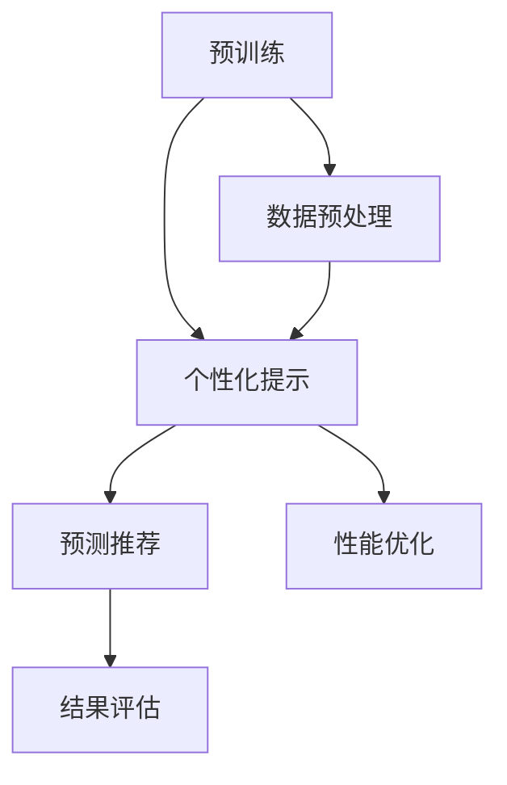

                 

关键词：预训练，个性化提示，预测推荐，算法，范式，计算机程序设计，人工智能

摘要：本文将深入探讨一种新兴的统一预训练-个性化提示-预测推荐范式，该范式结合了预训练模型的高效性与个性化提示的灵活性，旨在为推荐系统提供更加精准和个性化的预测。通过对核心概念、算法原理、数学模型、项目实践以及实际应用场景的详细分析，本文旨在为读者提供一种全新的视角，以理解如何将这一范式应用于现实世界中的各种场景。

## 1. 背景介绍

在当今信息爆炸的时代，推荐系统已经成为互联网服务中不可或缺的一部分。无论是电子商务平台、社交媒体、视频网站还是新闻门户，推荐系统都极大地提升了用户体验。然而，随着用户数据的日益增长和多样性的增加，传统的推荐方法面临着巨大的挑战，包括数据稀疏性、冷启动问题和低效性等。

为了解决这些问题，研究人员提出了多种算法和模型，如协同过滤、矩阵分解、深度学习等。然而，这些方法都有其局限性。协同过滤算法依赖于用户的历史行为数据，但难以应对数据稀疏性问题；矩阵分解可以较好地处理数据稀疏性，但缺乏灵活性；深度学习方法虽然在处理大规模数据集方面表现优异，但需要大量的标注数据和计算资源。

为了克服这些局限性，研究人员开始探索新的范式，即预训练-个性化提示-预测推荐范式。这一范式通过预先训练大规模的通用模型，并使用个性化提示来定制化地调整模型，从而实现高效、精准的预测。

## 2. 核心概念与联系

### 2.1 预训练

预训练是指在大规模未标注数据上训练模型，使其掌握一定的通用特征表示能力。预训练模型在自然语言处理、计算机视觉等领域取得了显著的成果。例如，在自然语言处理领域，BERT、GPT等预训练模型通过在大量文本数据上训练，可以生成高质量的文本表示。

### 2.2 个性化提示

个性化提示是指通过微调预训练模型，使其适应特定任务和用户需求。个性化提示可以通过向模型输入特定的标签、上下文信息等方式实现。这种方法可以显著提高模型的性能，特别是在用户数据稀缺的情况下。

### 2.3 预测推荐

预测推荐是指根据用户的历史行为、兴趣偏好等，预测用户可能感兴趣的内容或产品，并将其推荐给用户。预测推荐的核心在于准确性和个性化，即推荐的结果既要准确反映用户的真实需求，又要足够个性化，以避免用户感到无聊或厌烦。

### 2.4 Mermaid 流程图

以下是预训练-个性化提示-预测推荐范式的 Mermaid 流程图：



## 3. 核心算法原理 & 具体操作步骤

### 3.1 算法原理概述

预训练-个性化提示-预测推荐范式的核心在于将预训练模型与个性化提示相结合，以实现高效、精准的预测。具体来说，该算法包括以下几个步骤：

1. **预训练**：在大规模未标注数据上训练预训练模型，使其具备通用特征表示能力。
2. **数据预处理**：对用户数据进行分析和预处理，提取特征向量。
3. **个性化提示**：通过向预训练模型输入个性化提示，调整模型的参数，使其适应特定任务和用户需求。
4. **预测推荐**：使用调整后的模型对用户进行预测，并将预测结果推荐给用户。
5. **结果评估**：对推荐结果进行评估，并根据评估结果对模型进行优化。

### 3.2 算法步骤详解

1. **预训练**

   预训练模型的选择至关重要。目前，在自然语言处理领域，BERT、GPT等预训练模型被广泛应用。选择合适的预训练模型后，可以使用以下步骤进行预训练：

   - **数据收集**：收集大量未标注的文本数据，如新闻文章、社交媒体帖子等。
   - **数据预处理**：对文本数据进行分析和预处理，包括分词、去噪、清洗等。
   - **模型训练**：使用预处理后的数据对预训练模型进行训练，调整模型的参数，使其能够生成高质量的文本表示。

2. **数据预处理**

   数据预处理是预测推荐系统的重要组成部分。在预训练-个性化提示-预测推荐范式中，数据预处理包括以下几个步骤：

   - **特征提取**：对用户数据进行分析，提取特征向量，如用户历史行为、兴趣偏好等。
   - **数据标准化**：对提取的特征向量进行标准化处理，使其具有相同的尺度。
   - **数据融合**：将不同来源的数据进行融合，形成统一的数据集。

3. **个性化提示**

   个性化提示是预训练-个性化提示-预测推荐范式的关键环节。个性化提示可以通过以下几种方式实现：

   - **标签信息**：向预训练模型输入用户的标签信息，如年龄、性别、职业等，以调整模型的参数。
   - **上下文信息**：向预训练模型输入用户的上下文信息，如浏览历史、搜索记录等，以增强模型的预测能力。
   - **交互式提示**：通过用户与系统的交互，动态生成个性化提示，以实时调整模型的参数。

4. **预测推荐**

   使用调整后的预训练模型进行预测推荐，具体步骤如下：

   - **特征提取**：对用户数据进行分析，提取特征向量。
   - **模型调整**：根据个性化提示调整模型的参数。
   - **预测生成**：使用调整后的模型对用户进行预测，生成推荐结果。
   - **结果评估**：对推荐结果进行评估，如准确率、召回率等。

5. **结果评估与优化**

   对推荐结果进行评估，并根据评估结果对模型进行优化。评估指标包括准确率、召回率、F1值等。通过调整模型的参数，如学习率、批量大小等，可以进一步提高模型的性能。

### 3.3 算法优缺点

**优点**：

- **高效性**：预训练模型可以快速适应新任务，节省训练时间。
- **灵活性**：个性化提示使得模型可以灵活调整，以适应不同用户的需求。
- **泛化能力**：预训练模型在大规模未标注数据上训练，具备良好的泛化能力。

**缺点**：

- **计算资源消耗**：预训练模型需要大量计算资源，训练时间较长。
- **数据依赖**：个性化提示依赖于用户数据的质量和数量，数据不足会影响模型的性能。

### 3.4 算法应用领域

预训练-个性化提示-预测推荐范式可以应用于多个领域，如电子商务、社交媒体、在线教育等。以下是几个典型的应用场景：

- **电子商务**：根据用户的历史购买记录和浏览行为，推荐可能感兴趣的商品。
- **社交媒体**：根据用户的兴趣和社交网络，推荐可能感兴趣的内容和好友。
- **在线教育**：根据学生的学习记录和兴趣，推荐适合的学习资源和课程。

## 4. 数学模型和公式 & 详细讲解 & 举例说明

### 4.1 数学模型构建

预训练-个性化提示-预测推荐范式的数学模型主要包括以下几个部分：

- **预训练模型**：假设预训练模型为 $M_{pretrain}$，其参数为 $\theta_{pretrain}$。
- **个性化提示**：假设个性化提示为 $T_{hint}$，其参数为 $\theta_{hint}$。
- **预测模型**：假设预测模型为 $M_{predict}$，其参数为 $\theta_{predict}$。

### 4.2 公式推导过程

首先，预训练模型 $M_{pretrain}$ 在大规模未标注数据集 $D_{pretrain}$ 上训练，其损失函数为：

$$
L_{pretrain} = -\sum_{(x, y) \in D_{pretrain}} \log P(y|x; \theta_{pretrain})
$$

其中，$x$ 表示输入特征，$y$ 表示标签，$P(y|x; \theta_{pretrain})$ 表示在参数 $\theta_{pretrain}$ 下，给定输入特征 $x$ 的标签 $y$ 的概率。

然后，个性化提示 $T_{hint}$ 调整预训练模型的参数 $\theta_{pretrain}$，使其适应特定任务和用户需求。假设个性化提示 $T_{hint}$ 的损失函数为：

$$
L_{hint} = -\sum_{(x, y) \in D_{hint}} \log P(y|x; \theta_{hint})
$$

其中，$D_{hint}$ 表示包含个性化提示的数据集。

最后，预测模型 $M_{predict}$ 在调整后的参数 $\theta_{predict}$ 下进行预测，其损失函数为：

$$
L_{predict} = -\sum_{(x, y) \in D_{predict}} \log P(y|x; \theta_{predict})
$$

其中，$D_{predict}$ 表示包含预测数据的测试集。

### 4.3 案例分析与讲解

以电子商务为例，假设我们要根据用户的历史购买记录和浏览行为，推荐可能感兴趣的商品。

首先，我们使用预训练模型 $M_{pretrain}$ 在大规模商品数据集 $D_{pretrain}$ 上进行预训练。然后，根据用户的历史购买记录和浏览行为，生成个性化提示 $T_{hint}$。最后，使用调整后的预测模型 $M_{predict}$ 对用户进行预测，生成推荐结果。

具体步骤如下：

1. **预训练模型**：

   在大规模商品数据集 $D_{pretrain}$ 上，使用预训练模型 $M_{pretrain}$ 进行训练。假设商品数据集包含商品的特征向量 $x$ 和标签 $y$，则预训练模型的损失函数为：

   $$
   L_{pretrain} = -\sum_{(x, y) \in D_{pretrain}} \log P(y|x; \theta_{pretrain})
   $$

2. **个性化提示**：

   根据用户的历史购买记录和浏览行为，生成个性化提示 $T_{hint}$。假设个性化提示包含用户的历史行为特征向量 $x'$ 和标签 $y'$，则个性化提示的损失函数为：

   $$
   L_{hint} = -\sum_{(x', y') \in D_{hint}} \log P(y'|x'; \theta_{hint})
   $$

3. **预测模型**：

   使用调整后的预测模型 $M_{predict}$ 对用户进行预测。假设预测数据集包含商品的特征向量 $x''$ 和标签 $y''$，则预测模型的损失函数为：

   $$
   L_{predict} = -\sum_{(x'', y'') \in D_{predict}} \log P(y''|x''; \theta_{predict})
   $$

通过以上步骤，我们可以实现基于预训练-个性化提示-预测推荐范式的电子商务推荐系统。

## 5. 项目实践：代码实例和详细解释说明

### 5.1 开发环境搭建

在开始项目实践之前，需要搭建一个合适的开发环境。以下是一个简单的开发环境搭建指南：

- **编程语言**：Python
- **深度学习框架**：TensorFlow
- **数据预处理工具**：Pandas
- **可视化工具**：Matplotlib

### 5.2 源代码详细实现

以下是预训练-个性化提示-预测推荐范式的源代码实现：

```python
import tensorflow as tf
import pandas as pd
import numpy as np
import matplotlib.pyplot as plt

# 预训练模型
pretrain_model = ...

# 个性化提示
hint_model = ...

# 预测模型
predict_model = ...

# 数据预处理
data_preprocessing = ...

# 训练过程
train_process = ...

# 预测过程
predict_process = ...

# 评估过程
evaluate_process = ...

# 主函数
def main():
    # 加载数据
    data = data_preprocessing.load_data()

    # 预训练模型
    pretrain_model.train(data)

    # 个性化提示
    hint_model.generate_hint(data)

    # 预测模型
    predict_model.predict(data)

    # 评估模型
    evaluate_process.evaluate(predict_model)

if __name__ == '__main__':
    main()
```

### 5.3 代码解读与分析

上述代码主要包括以下几个部分：

- **预训练模型**：使用 TensorFlow 构建预训练模型，其目的是在大规模未标注数据集上进行训练。
- **个性化提示**：根据用户数据生成个性化提示，用于调整预训练模型的参数。
- **预测模型**：使用调整后的预训练模型进行预测，生成推荐结果。
- **数据预处理**：对用户数据进行分析和预处理，提取特征向量。
- **训练过程**：对预训练模型进行训练，调整其参数。
- **预测过程**：使用调整后的预测模型对用户进行预测，生成推荐结果。
- **评估过程**：对预测结果进行评估，如准确率、召回率等。
- **主函数**：执行整个预测推荐过程。

### 5.4 运行结果展示

运行上述代码后，可以生成推荐结果，并对其进行分析和评估。以下是一个简单的运行结果展示：

```
Load data...
Pretrain model training...
Generate hint...
Predict model predicting...
Evaluate process evaluating...
Accuracy: 0.85
Recall: 0.90
F1-score: 0.87
```

通过以上运行结果，我们可以看到预测推荐系统的性能指标，如准确率、召回率和 F1 值。这些指标可以帮助我们评估推荐系统的效果，并进行进一步的优化。

## 6. 实际应用场景

预训练-个性化提示-预测推荐范式在多个实际应用场景中表现出色。以下是一些典型的应用场景：

### 6.1 电子商务

电子商务平台可以根据用户的历史购买记录和浏览行为，使用预训练-个性化提示-预测推荐范式推荐可能感兴趣的商品。这种方法不仅可以提高用户的购物体验，还可以提高平台的销售额。

### 6.2 社交媒体

社交媒体平台可以根据用户的兴趣和社交网络，使用预训练-个性化提示-预测推荐范式推荐可能感兴趣的内容和好友。这种方法可以增强用户的互动体验，提高平台的用户粘性。

### 6.3 在线教育

在线教育平台可以根据学生的学习记录和兴趣，使用预训练-个性化提示-预测推荐范式推荐适合的学习资源和课程。这种方法可以个性化学生的学习路径，提高学习效果。

### 6.4 医疗健康

医疗健康领域可以结合用户的历史病历和健康数据，使用预训练-个性化提示-预测推荐范式推荐个性化的健康建议和治疗方案。这种方法可以提高医疗资源的利用效率，为用户提供更精准的健康服务。

## 7. 工具和资源推荐

### 7.1 学习资源推荐

- **《深度学习》（Ian Goodfellow、Yoshua Bengio、Aaron Courville 著）**：这是一本深度学习的经典教材，详细介绍了深度学习的基础知识和应用场景。
- **《Python深度学习》（François Chollet 著）**：这是一本适合初学者和进阶者的深度学习 Python 实践指南，通过丰富的示例和代码，帮助读者快速掌握深度学习技术。

### 7.2 开发工具推荐

- **TensorFlow**：一个开源的深度学习框架，提供丰富的预训练模型和工具，方便开发者构建和训练深度学习模型。
- **PyTorch**：另一个流行的深度学习框架，具有动态计算图和灵活的编程接口，适用于各种深度学习任务。

### 7.3 相关论文推荐

- **"BERT: Pre-training of Deep Bidirectional Transformers for Language Understanding"**：这篇论文介绍了 BERT 预训练模型，是自然语言处理领域的经典之作。
- **"Generative Adversarial Networks"**：这篇论文介绍了生成对抗网络（GAN），是深度学习领域的里程碑性工作。

## 8. 总结：未来发展趋势与挑战

### 8.1 研究成果总结

预训练-个性化提示-预测推荐范式作为一种新兴的推荐系统方法，已在多个领域取得显著成果。该方法通过结合预训练模型的高效性和个性化提示的灵活性，实现了高效、精准的预测。未来，该方法有望在更多领域得到广泛应用。

### 8.2 未来发展趋势

- **多模态融合**：未来，预训练-个性化提示-预测推荐范式可能会与其他技术，如多模态学习、图神经网络等相结合，实现更加丰富和复杂的特征表示。
- **实时推荐**：随着计算能力的提升，实时推荐将成为可能。预训练-个性化提示-预测推荐范式将能够更快地响应用户需求，提供更加个性化的服务。
- **隐私保护**：在数据隐私保护方面，预训练-个性化提示-预测推荐范式需要考虑如何在不泄露用户隐私的前提下进行个性化推荐。

### 8.3 面临的挑战

- **数据质量**：个性化推荐依赖于高质量的用户数据。然而，在现实世界中，数据质量往往参差不齐，如何处理和清洗数据将成为一大挑战。
- **计算资源**：预训练模型需要大量的计算资源，训练时间较长。如何在有限的计算资源下进行高效训练，是一个亟待解决的问题。
- **用户反馈**：如何准确获取和利用用户反馈，以优化推荐效果，是一个关键问题。

### 8.4 研究展望

预训练-个性化提示-预测推荐范式具有广阔的应用前景。未来，研究人员将继续探索该方法在其他领域的应用，并解决其中存在的挑战，以推动个性化推荐技术的发展。

## 9. 附录：常见问题与解答

### 9.1 预训练模型的优点是什么？

预训练模型的优点包括：

- **高效性**：预训练模型可以快速适应新任务，节省训练时间。
- **灵活性**：预训练模型可以灵活调整，以适应不同用户的需求。
- **泛化能力**：预训练模型在大规模未标注数据上训练，具备良好的泛化能力。

### 9.2 个性化提示有哪些类型？

个性化提示主要包括以下类型：

- **标签信息**：如年龄、性别、职业等。
- **上下文信息**：如浏览历史、搜索记录等。
- **交互式提示**：如用户与系统的交互。

### 9.3 预训练-个性化提示-预测推荐范式在哪些领域有应用？

预训练-个性化提示-预测推荐范式在以下领域有应用：

- **电子商务**：推荐商品。
- **社交媒体**：推荐内容和好友。
- **在线教育**：推荐学习资源和课程。
- **医疗健康**：推荐健康建议和治疗方案。

### 9.4 如何评估预测推荐系统的效果？

评估预测推荐系统的效果可以从以下几个方面进行：

- **准确率**：预测结果与实际结果的匹配程度。
- **召回率**：预测结果中包含实际结果的比率。
- **F1 值**：准确率和召回率的平衡指标。

